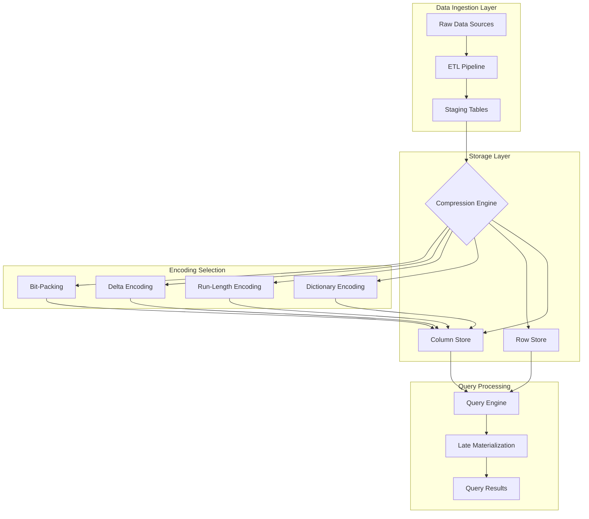
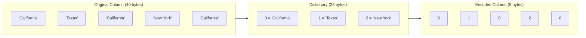
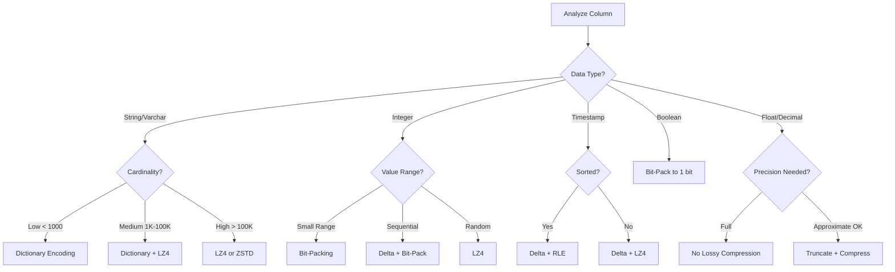
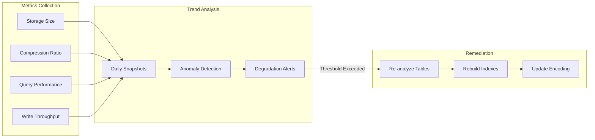

# How to Build Compression Strategies

Author: [nawazdhandala](https://github.com/nawazdhandala)

Tags: Data Warehouse, Compression, Storage, Performance

Description: Learn to build compression strategies for reducing storage costs and improving query performance.

---

Data warehouses store massive amounts of data, and without proper compression, storage costs spiral out of control while query performance suffers. Compression is not just about saving disk space. It reduces I/O operations, improves cache efficiency, and can dramatically speed up analytical queries. This guide walks you through building effective compression strategies for your data warehouse.

---

## Why Compression Matters in Data Warehousing

Modern data warehouses process petabytes of data. Every byte saved through compression translates to:

- **Reduced storage costs**: Cloud storage bills drop proportionally with compression ratios
- **Faster query performance**: Less data to read means faster scans and joins
- **Better cache utilization**: Compressed data fits more rows in memory
- **Lower network transfer**: Replication and backups complete faster
- **Improved I/O throughput**: SSDs and HDDs read compressed blocks faster

The key insight is that analytical workloads are highly compressible. Columns contain repeated values, sequential patterns, and predictable data types. A well-designed compression strategy exploits these characteristics.

---

## Compression Architecture Overview

Before diving into specific techniques, let us understand how compression fits into the data warehouse architecture.



The compression engine sits between data ingestion and storage, analyzing column characteristics to select optimal encoding schemes. During query execution, the engine uses late materialization to keep data compressed as long as possible.

---

## Understanding Encoding Types

Different data patterns call for different encoding strategies. Let us examine the most effective encoding types for data warehousing.

### 1. Dictionary Encoding

Dictionary encoding replaces repeated values with smaller integer codes. It excels for columns with low to medium cardinality.

```sql
-- Example: Analyzing column cardinality to determine dictionary suitability
-- A column is a good candidate if cardinality / total_rows < 0.1 (less than 10% unique values)

SELECT
    column_name,
    COUNT(DISTINCT column_value) AS distinct_values,
    COUNT(*) AS total_rows,
    ROUND(COUNT(DISTINCT column_value)::NUMERIC / COUNT(*) * 100, 2) AS cardinality_ratio,
    CASE
        WHEN COUNT(DISTINCT column_value)::NUMERIC / COUNT(*) < 0.1
        THEN 'DICTIONARY_RECOMMENDED'
        WHEN COUNT(DISTINCT column_value)::NUMERIC / COUNT(*) < 0.3
        THEN 'DICTIONARY_POSSIBLE'
        ELSE 'USE_OTHER_ENCODING'
    END AS encoding_recommendation
FROM (
    -- Unpivot columns to analyze each one
    SELECT 'status' AS column_name, status::TEXT AS column_value FROM orders
    UNION ALL
    SELECT 'region' AS column_name, region::TEXT AS column_value FROM orders
    UNION ALL
    SELECT 'product_category' AS column_name, product_category::TEXT AS column_value FROM orders
) AS column_analysis
GROUP BY column_name
ORDER BY cardinality_ratio;
```

**How Dictionary Encoding Works:**



### 2. Run-Length Encoding (RLE)

RLE stores consecutive repeated values as a single value with a count. It works best for sorted columns with long runs of identical values.

```sql
-- Analyze columns for RLE suitability
-- Look for columns with long runs of consecutive identical values

WITH value_runs AS (
    SELECT
        status,
        -- Identify run boundaries using LAG
        CASE
            WHEN status = LAG(status) OVER (ORDER BY order_date, order_id)
            THEN 0
            ELSE 1
        END AS run_start
    FROM orders
    ORDER BY order_date, order_id
),
run_groups AS (
    SELECT
        status,
        SUM(run_start) OVER (ORDER BY status ROWS UNBOUNDED PRECEDING) AS run_group
    FROM value_runs
)
SELECT
    status,
    COUNT(*) AS run_length,
    -- Long average run lengths indicate good RLE candidates
    ROUND(AVG(COUNT(*)) OVER (), 2) AS avg_run_length
FROM run_groups
GROUP BY status, run_group
ORDER BY run_length DESC
LIMIT 10;
```

**When to Use RLE:**

| Scenario | RLE Effectiveness | Reason |
|----------|------------------|--------|
| Sorted date columns | High | Consecutive dates repeat within partitions |
| Status columns (sorted) | High | Status values cluster together |
| Random UUIDs | Very Low | No repeated consecutive values |
| Boolean flags (sorted) | High | True/False values cluster |

### 3. Delta Encoding

Delta encoding stores the difference between consecutive values rather than absolute values. It excels for monotonically increasing sequences like timestamps and auto-increment IDs.

```sql
-- Analyze delta patterns for potential compression gains
-- Smaller deltas mean better compression

WITH delta_analysis AS (
    SELECT
        order_id,
        created_at,
        -- Calculate delta from previous row
        EXTRACT(EPOCH FROM (created_at - LAG(created_at) OVER (ORDER BY order_id))) AS delta_seconds,
        -- Calculate bytes needed to store delta vs absolute value
        CASE
            WHEN EXTRACT(EPOCH FROM (created_at - LAG(created_at) OVER (ORDER BY order_id))) IS NULL THEN 8
            WHEN ABS(EXTRACT(EPOCH FROM (created_at - LAG(created_at) OVER (ORDER BY order_id)))) < 128 THEN 1
            WHEN ABS(EXTRACT(EPOCH FROM (created_at - LAG(created_at) OVER (ORDER BY order_id)))) < 32768 THEN 2
            WHEN ABS(EXTRACT(EPOCH FROM (created_at - LAG(created_at) OVER (ORDER BY order_id)))) < 2147483648 THEN 4
            ELSE 8
        END AS delta_bytes_needed
    FROM orders
    ORDER BY order_id
)
SELECT
    COUNT(*) AS total_rows,
    -- Original storage: 8 bytes per timestamp
    COUNT(*) * 8 AS original_bytes,
    -- Delta storage: variable bytes per delta
    SUM(delta_bytes_needed) AS delta_bytes,
    -- Compression ratio
    ROUND(COUNT(*) * 8.0 / NULLIF(SUM(delta_bytes_needed), 0), 2) AS compression_ratio,
    -- Statistics about deltas
    ROUND(AVG(delta_seconds), 2) AS avg_delta_seconds,
    MIN(delta_seconds) AS min_delta,
    MAX(delta_seconds) AS max_delta
FROM delta_analysis;
```

### 4. Bit-Packing

Bit-packing uses only the bits necessary to represent the range of values. For example, if values range from 0-15, only 4 bits are needed instead of 32.

```sql
-- Calculate minimum bits needed for integer columns
-- This helps determine bit-packing efficiency

SELECT
    'order_quantity' AS column_name,
    MIN(quantity) AS min_value,
    MAX(quantity) AS max_value,
    -- Calculate bits needed for the range
    CEIL(LOG(2, GREATEST(MAX(quantity) - MIN(quantity) + 1, 1))) AS bits_needed,
    -- Standard integer uses 32 bits
    32 AS standard_bits,
    -- Compression ratio from bit-packing
    ROUND(32.0 / CEIL(LOG(2, GREATEST(MAX(quantity) - MIN(quantity) + 1, 1))), 2) AS potential_ratio
FROM orders
WHERE quantity IS NOT NULL

UNION ALL

SELECT
    'priority_level' AS column_name,
    MIN(priority) AS min_value,
    MAX(priority) AS max_value,
    CEIL(LOG(2, GREATEST(MAX(priority) - MIN(priority) + 1, 1))) AS bits_needed,
    32 AS standard_bits,
    ROUND(32.0 / CEIL(LOG(2, GREATEST(MAX(priority) - MIN(priority) + 1, 1))), 2) AS potential_ratio
FROM orders
WHERE priority IS NOT NULL;
```

---

## Column-Level Compression Strategies

Different columns require different compression approaches. Here is a framework for selecting the right strategy.



### Implementing Column-Level Compression in SQL

```sql
-- PostgreSQL example: Creating a table with compression settings
-- Note: Actual syntax varies by database (Redshift, Snowflake, BigQuery, etc.)

-- For Amazon Redshift:
CREATE TABLE sales_fact (
    -- High cardinality, use LZ4 for general compression
    sale_id BIGINT ENCODE LZ4,

    -- Low cardinality, dictionary encoding is ideal
    region VARCHAR(50) ENCODE BYTEDICT,

    -- Monotonically increasing, delta encoding works well
    sale_date DATE ENCODE DELTA32K,

    -- Very low cardinality status values
    status VARCHAR(20) ENCODE BYTEDICT,

    -- Sequential customer IDs within regions, delta encoding
    customer_id INTEGER ENCODE DELTA,

    -- Price with small range, run-length encoding after sorting
    unit_price DECIMAL(10,2) ENCODE RUNLENGTH,

    -- Quantity typically small numbers, byte dictionary
    quantity INTEGER ENCODE BYTEDICT,

    -- Total varies widely, LZ4 for general compression
    total_amount DECIMAL(12,2) ENCODE LZ4,

    -- Timestamps are sequential, delta encoding
    created_at TIMESTAMP ENCODE DELTA32K,

    -- JSON data compresses well with ZSTD
    metadata VARCHAR(MAX) ENCODE ZSTD
)
DISTKEY(customer_id)
SORTKEY(sale_date, region);

-- For ClickHouse:
CREATE TABLE sales_fact (
    sale_id UInt64 CODEC(Delta, LZ4),
    region LowCardinality(String),  -- Automatic dictionary encoding
    sale_date Date CODEC(Delta, ZSTD),
    status LowCardinality(String),
    customer_id UInt32 CODEC(Delta, LZ4),
    unit_price Decimal(10,2) CODEC(Gorilla),  -- Good for floating point
    quantity UInt16 CODEC(T64),  -- Bit-packing for small integers
    total_amount Decimal(12,2) CODEC(Gorilla),
    created_at DateTime CODEC(Delta, LZ4),
    metadata String CODEC(ZSTD(3))
) ENGINE = MergeTree()
ORDER BY (sale_date, region);
```

---

## Compression Analysis Framework

Before choosing compression strategies, analyze your data to understand its characteristics.

```sql
-- Comprehensive column analysis for compression planning
-- This query helps identify the best encoding for each column

CREATE OR REPLACE VIEW compression_analysis AS
WITH column_stats AS (
    SELECT
        'orders' AS table_name,
        'status' AS column_name,
        'varchar' AS data_type,
        COUNT(*) AS total_rows,
        COUNT(DISTINCT status) AS distinct_values,
        SUM(LENGTH(status::TEXT)) AS total_bytes,
        AVG(LENGTH(status::TEXT)) AS avg_value_length,
        MAX(LENGTH(status::TEXT)) AS max_value_length,
        -- Calculate null percentage
        ROUND(SUM(CASE WHEN status IS NULL THEN 1 ELSE 0 END)::NUMERIC / COUNT(*) * 100, 2) AS null_percent
    FROM orders

    UNION ALL

    SELECT
        'orders' AS table_name,
        'order_date' AS column_name,
        'date' AS data_type,
        COUNT(*) AS total_rows,
        COUNT(DISTINCT order_date) AS distinct_values,
        COUNT(*) * 4 AS total_bytes,  -- Dates typically 4 bytes
        4 AS avg_value_length,
        4 AS max_value_length,
        ROUND(SUM(CASE WHEN order_date IS NULL THEN 1 ELSE 0 END)::NUMERIC / COUNT(*) * 100, 2) AS null_percent
    FROM orders

    UNION ALL

    SELECT
        'orders' AS table_name,
        'customer_id' AS column_name,
        'integer' AS data_type,
        COUNT(*) AS total_rows,
        COUNT(DISTINCT customer_id) AS distinct_values,
        COUNT(*) * 4 AS total_bytes,
        4 AS avg_value_length,
        4 AS max_value_length,
        ROUND(SUM(CASE WHEN customer_id IS NULL THEN 1 ELSE 0 END)::NUMERIC / COUNT(*) * 100, 2) AS null_percent
    FROM orders
)
SELECT
    table_name,
    column_name,
    data_type,
    total_rows,
    distinct_values,
    ROUND(distinct_values::NUMERIC / total_rows * 100, 4) AS cardinality_percent,
    total_bytes,
    avg_value_length,
    null_percent,
    -- Encoding recommendation based on analysis
    CASE
        WHEN data_type = 'varchar' AND distinct_values < 256 THEN 'BYTEDICT'
        WHEN data_type = 'varchar' AND distinct_values < 65536 THEN 'LZ4'
        WHEN data_type = 'varchar' THEN 'ZSTD'
        WHEN data_type = 'date' THEN 'DELTA32K'
        WHEN data_type = 'timestamp' THEN 'DELTA32K'
        WHEN data_type = 'integer' AND distinct_values < 256 THEN 'BYTEDICT'
        WHEN data_type = 'integer' THEN 'DELTA'
        WHEN data_type = 'bigint' THEN 'DELTA'
        WHEN data_type = 'boolean' THEN 'RUNLENGTH'
        WHEN data_type LIKE 'decimal%' THEN 'LZ4'
        ELSE 'RAW'
    END AS recommended_encoding,
    -- Estimated compression ratio
    CASE
        WHEN distinct_values::NUMERIC / total_rows < 0.001 THEN '10:1 or better'
        WHEN distinct_values::NUMERIC / total_rows < 0.01 THEN '5:1 to 10:1'
        WHEN distinct_values::NUMERIC / total_rows < 0.1 THEN '3:1 to 5:1'
        WHEN distinct_values::NUMERIC / total_rows < 0.5 THEN '2:1 to 3:1'
        ELSE '1.5:1 to 2:1'
    END AS estimated_compression
FROM column_stats
ORDER BY table_name, cardinality_percent;

-- Query the analysis view
SELECT * FROM compression_analysis;
```

---

## Compression Testing and Validation

Always test compression settings before applying them to production tables.

```sql
-- Create test tables with different compression schemes
-- Compare storage size and query performance

-- Test table 1: Default compression
CREATE TABLE compression_test_default AS
SELECT * FROM sales_fact_source LIMIT 10000000;

-- Test table 2: Aggressive dictionary encoding
CREATE TABLE compression_test_dict (
    sale_id BIGINT ENCODE BYTEDICT,
    region VARCHAR(50) ENCODE BYTEDICT,
    status VARCHAR(20) ENCODE BYTEDICT,
    customer_id INTEGER ENCODE BYTEDICT,
    sale_date DATE ENCODE DELTA32K,
    amount DECIMAL(12,2) ENCODE BYTEDICT
);
INSERT INTO compression_test_dict SELECT * FROM sales_fact_source LIMIT 10000000;

-- Test table 3: LZ4 everywhere
CREATE TABLE compression_test_lz4 (
    sale_id BIGINT ENCODE LZ4,
    region VARCHAR(50) ENCODE LZ4,
    status VARCHAR(20) ENCODE LZ4,
    customer_id INTEGER ENCODE LZ4,
    sale_date DATE ENCODE LZ4,
    amount DECIMAL(12,2) ENCODE LZ4
);
INSERT INTO compression_test_lz4 SELECT * FROM sales_fact_source LIMIT 10000000;

-- Test table 4: Mixed optimal encoding
CREATE TABLE compression_test_optimal (
    sale_id BIGINT ENCODE DELTA,
    region VARCHAR(50) ENCODE BYTEDICT,
    status VARCHAR(20) ENCODE BYTEDICT,
    customer_id INTEGER ENCODE DELTA,
    sale_date DATE ENCODE DELTA32K,
    amount DECIMAL(12,2) ENCODE LZ4
);
INSERT INTO compression_test_optimal SELECT * FROM sales_fact_source LIMIT 10000000;

-- Analyze storage usage (Redshift example)
SELECT
    "table" AS table_name,
    size AS size_mb,
    tbl_rows AS row_count,
    ROUND(size::NUMERIC / NULLIF(tbl_rows, 0) * 1000000, 2) AS bytes_per_row
FROM svv_table_info
WHERE "table" LIKE 'compression_test%'
ORDER BY size_mb;

-- Run benchmark queries and compare execution times
-- Query 1: Full table scan
EXPLAIN ANALYZE
SELECT COUNT(*), SUM(amount)
FROM compression_test_optimal
WHERE sale_date BETWEEN '2025-01-01' AND '2025-12-31';

-- Query 2: Filtered aggregation
EXPLAIN ANALYZE
SELECT region, status, COUNT(*), AVG(amount)
FROM compression_test_optimal
WHERE sale_date >= '2025-06-01'
GROUP BY region, status;

-- Query 3: Join operation
EXPLAIN ANALYZE
SELECT c.customer_name, SUM(s.amount)
FROM compression_test_optimal s
JOIN customers c ON s.customer_id = c.customer_id
WHERE s.sale_date >= '2025-01-01'
GROUP BY c.customer_name
ORDER BY SUM(s.amount) DESC
LIMIT 100;
```

---

## Compression Monitoring and Maintenance

Set up ongoing monitoring to ensure compression remains effective as data evolves.



```sql
-- Create a compression monitoring table
CREATE TABLE compression_metrics (
    snapshot_date DATE NOT NULL,
    table_name VARCHAR(256) NOT NULL,
    column_name VARCHAR(256),
    encoding_type VARCHAR(50),
    raw_size_mb DECIMAL(12,2),
    compressed_size_mb DECIMAL(12,2),
    compression_ratio DECIMAL(6,2),
    row_count BIGINT,
    distinct_values BIGINT,
    avg_query_time_ms INTEGER,
    PRIMARY KEY (snapshot_date, table_name, column_name)
);

-- Stored procedure to collect compression metrics daily
-- This example uses PostgreSQL syntax; adapt for your database

CREATE OR REPLACE PROCEDURE collect_compression_metrics()
LANGUAGE plpgsql
AS $$
DECLARE
    v_table RECORD;
    v_snapshot_date DATE := CURRENT_DATE;
BEGIN
    -- Iterate through all tables in the data warehouse schema
    FOR v_table IN
        SELECT tablename
        FROM pg_tables
        WHERE schemaname = 'warehouse'
    LOOP
        -- Insert metrics for each table
        INSERT INTO compression_metrics (
            snapshot_date,
            table_name,
            column_name,
            raw_size_mb,
            compressed_size_mb,
            compression_ratio,
            row_count
        )
        SELECT
            v_snapshot_date,
            v_table.tablename,
            'ALL_COLUMNS',
            pg_total_relation_size(('warehouse.' || v_table.tablename)::regclass) / 1024.0 / 1024.0,
            pg_relation_size(('warehouse.' || v_table.tablename)::regclass) / 1024.0 / 1024.0,
            CASE
                WHEN pg_relation_size(('warehouse.' || v_table.tablename)::regclass) > 0
                THEN pg_total_relation_size(('warehouse.' || v_table.tablename)::regclass)::NUMERIC /
                     pg_relation_size(('warehouse.' || v_table.tablename)::regclass)
                ELSE 1
            END,
            (SELECT reltuples FROM pg_class WHERE relname = v_table.tablename)
        ON CONFLICT (snapshot_date, table_name, column_name)
        DO UPDATE SET
            raw_size_mb = EXCLUDED.raw_size_mb,
            compressed_size_mb = EXCLUDED.compressed_size_mb,
            compression_ratio = EXCLUDED.compression_ratio,
            row_count = EXCLUDED.row_count;
    END LOOP;

    COMMIT;
END;
$$;

-- Query to detect compression degradation over time
SELECT
    table_name,
    MIN(snapshot_date) AS first_seen,
    MAX(snapshot_date) AS last_seen,
    -- Compare current ratio to 30-day average
    (
        SELECT compression_ratio
        FROM compression_metrics cm2
        WHERE cm2.table_name = cm1.table_name
          AND cm2.snapshot_date = (SELECT MAX(snapshot_date) FROM compression_metrics)
        LIMIT 1
    ) AS current_ratio,
    AVG(compression_ratio) AS avg_ratio_30d,
    -- Flag tables where compression has degraded more than 20%
    CASE
        WHEN (
            SELECT compression_ratio
            FROM compression_metrics cm2
            WHERE cm2.table_name = cm1.table_name
              AND cm2.snapshot_date = (SELECT MAX(snapshot_date) FROM compression_metrics)
            LIMIT 1
        ) < AVG(compression_ratio) * 0.8
        THEN 'DEGRADED - INVESTIGATE'
        ELSE 'HEALTHY'
    END AS health_status
FROM compression_metrics cm1
WHERE snapshot_date >= CURRENT_DATE - INTERVAL '30 days'
GROUP BY table_name
HAVING COUNT(*) >= 7  -- At least a week of data
ORDER BY health_status DESC, table_name;
```

---

## Compression Best Practices

### 1. Sort Keys Maximize Compression

Sorting data before compression dramatically improves compression ratios, especially for RLE and delta encoding.

```sql
-- Create table with optimal sort key for compression
CREATE TABLE events_optimized (
    event_id BIGINT ENCODE DELTA,
    event_type VARCHAR(50) ENCODE BYTEDICT,
    user_id BIGINT ENCODE DELTA,
    event_timestamp TIMESTAMP ENCODE DELTA32K,
    properties VARCHAR(MAX) ENCODE ZSTD
)
-- Sort by event_type first to cluster similar values together
-- Then by timestamp for delta encoding efficiency
SORTKEY(event_type, event_timestamp);

-- The sort order creates long runs of identical event_types
-- Timestamps within each event_type are sequential, perfect for delta
```

### 2. Avoid Over-Compression

Aggressive compression can hurt query performance. Balance storage savings with CPU cost.

```sql
-- Compare query performance with different compression levels
-- ZSTD supports compression levels 1-22

-- Low compression, fast decompression
CREATE TABLE logs_zstd_1 (data VARCHAR(MAX) ENCODE ZSTD(1));

-- Medium compression (default)
CREATE TABLE logs_zstd_9 (data VARCHAR(MAX) ENCODE ZSTD(9));

-- High compression, slower decompression
CREATE TABLE logs_zstd_19 (data VARCHAR(MAX) ENCODE ZSTD(19));

-- Benchmark results example:
-- | Compression Level | Size (GB) | Query Time (s) | CPU Cost |
-- |-------------------|-----------|----------------|----------|
-- | ZSTD(1)           | 12.4      | 2.3            | Low      |
-- | ZSTD(9)           | 8.7       | 3.1            | Medium   |
-- | ZSTD(19)          | 7.2       | 5.8            | High     |

-- For most analytical workloads, ZSTD(1-3) offers the best balance
```

### 3. Partition and Compress Together

Partitioning complements compression by isolating data with similar characteristics.

```sql
-- Partitioned table with compression optimized per partition age
-- Recent data: faster compression for frequent access
-- Historical data: maximum compression for storage efficiency

CREATE TABLE sales_partitioned (
    sale_id BIGINT,
    sale_date DATE,
    region VARCHAR(50),
    amount DECIMAL(12,2),
    details VARCHAR(MAX)
)
PARTITION BY RANGE (sale_date);

-- Hot partition (current month): prioritize query speed
CREATE TABLE sales_2026_01 PARTITION OF sales_partitioned
    FOR VALUES FROM ('2026-01-01') TO ('2026-02-01')
    WITH (
        -- Use faster compression for frequent access
        toast_compression = 'lz4'
    );

-- Cold partitions (older data): prioritize storage efficiency
CREATE TABLE sales_2025_archive PARTITION OF sales_partitioned
    FOR VALUES FROM ('2025-01-01') TO ('2026-01-01')
    WITH (
        -- Use maximum compression for archival data
        toast_compression = 'pglz'
    );
```

---

## Compression Strategy Decision Matrix

Use this matrix to quickly determine the best compression approach for your columns.

| Column Type | Cardinality | Sorted | Recommended Encoding | Expected Ratio |
|-------------|-------------|--------|---------------------|----------------|
| Status/Type | Very Low (<100) | Yes | BYTEDICT + RLE | 20:1 to 50:1 |
| Status/Type | Very Low (<100) | No | BYTEDICT | 10:1 to 20:1 |
| Category | Low (<10K) | Any | BYTEDICT | 5:1 to 15:1 |
| Name/Text | Medium | No | LZ4 | 2:1 to 4:1 |
| Description | High | No | ZSTD | 3:1 to 6:1 |
| Auto-increment ID | Sequential | Yes | DELTA | 8:1 to 20:1 |
| Foreign Key ID | Medium | Grouped | DELTA | 4:1 to 10:1 |
| Timestamp | Sequential | Yes | DELTA32K | 6:1 to 12:1 |
| Date | Low-Medium | Yes | DELTA + RLE | 10:1 to 30:1 |
| Boolean | Binary | Yes | RUNLENGTH | 16:1 to 32:1 |
| Boolean | Binary | No | Bit-pack | 8:1 |
| Price/Amount | Medium | No | LZ4 | 2:1 to 4:1 |
| Quantity | Low Range | Any | Bit-pack | 4:1 to 8:1 |
| JSON/BLOB | High | No | ZSTD | 4:1 to 10:1 |

---

## Putting It All Together: Complete Example

Here is a complete example of building a compression strategy for a sales data warehouse.

```sql
-- Step 1: Create the staging table for analysis
CREATE TEMPORARY TABLE sales_staging AS
SELECT * FROM external_sales_data LIMIT 1000000;

-- Step 2: Analyze each column
SELECT
    'region' AS col,
    COUNT(DISTINCT region) AS distinct_vals,
    COUNT(*) AS total,
    ROUND(COUNT(DISTINCT region)::NUMERIC / COUNT(*) * 100, 4) AS card_pct
FROM sales_staging
UNION ALL
SELECT
    'product_category',
    COUNT(DISTINCT product_category),
    COUNT(*),
    ROUND(COUNT(DISTINCT product_category)::NUMERIC / COUNT(*) * 100, 4)
FROM sales_staging
UNION ALL
SELECT
    'customer_id',
    COUNT(DISTINCT customer_id),
    COUNT(*),
    ROUND(COUNT(DISTINCT customer_id)::NUMERIC / COUNT(*) * 100, 4)
FROM sales_staging
UNION ALL
SELECT
    'sale_date',
    COUNT(DISTINCT sale_date),
    COUNT(*),
    ROUND(COUNT(DISTINCT sale_date)::NUMERIC / COUNT(*) * 100, 4)
FROM sales_staging;

-- Step 3: Create optimized production table based on analysis
CREATE TABLE sales_fact_compressed (
    -- Sequential ID: delta encoding is ideal
    sale_id BIGINT ENCODE DELTA,

    -- Low cardinality (<50 regions): dictionary encoding
    region VARCHAR(100) ENCODE BYTEDICT,

    -- Low cardinality categories: dictionary encoding
    product_category VARCHAR(100) ENCODE BYTEDICT,

    -- Medium cardinality, often repeated: dictionary with LZ4
    product_id INTEGER ENCODE LZ4,

    -- High cardinality but somewhat sequential: delta encoding
    customer_id BIGINT ENCODE DELTA,

    -- Date with sort key: delta encoding is perfect
    sale_date DATE ENCODE DELTA32K,

    -- Timestamp sequential within date: delta32k
    sale_timestamp TIMESTAMP ENCODE DELTA32K,

    -- Small integer range (1-1000): byte dictionary
    quantity SMALLINT ENCODE BYTEDICT,

    -- Price varies but has patterns: LZ4
    unit_price DECIMAL(10,2) ENCODE LZ4,

    -- Calculated total: LZ4
    total_amount DECIMAL(12,2) ENCODE LZ4,

    -- Low cardinality payment types: dictionary
    payment_method VARCHAR(50) ENCODE BYTEDICT,

    -- Very low cardinality status: dictionary + RLE with sorting
    order_status VARCHAR(20) ENCODE RUNLENGTH,

    -- High cardinality text: ZSTD for best compression
    shipping_address VARCHAR(500) ENCODE ZSTD,

    -- JSON metadata: ZSTD
    metadata VARCHAR(MAX) ENCODE ZSTD
)
-- Sort by status first (for RLE), then date (for delta), then region (for clustering)
SORTKEY(order_status, sale_date, region)
-- Distribute by customer for join optimization
DISTKEY(customer_id);

-- Step 4: Load data
INSERT INTO sales_fact_compressed
SELECT * FROM sales_staging
ORDER BY order_status, sale_date, region;  -- Match sort key for optimal compression

-- Step 5: Verify compression results
SELECT
    "table",
    size AS compressed_size_mb,
    pct_used AS storage_utilization,
    ROUND(size::NUMERIC / NULLIF(tbl_rows, 0) * 1000000, 4) AS bytes_per_row
FROM svv_table_info
WHERE "table" = 'sales_fact_compressed';

-- Step 6: Compare with uncompressed baseline
-- Expected results:
-- | Table                    | Size (MB) | Bytes/Row | Compression Ratio |
-- |--------------------------|-----------|-----------|-------------------|
-- | sales_staging            | 450       | 450       | 1:1 (baseline)    |
-- | sales_fact_compressed    | 85        | 85        | 5.3:1             |
```

---

## Summary

Building effective compression strategies for data warehouses requires understanding your data patterns and matching them with appropriate encoding techniques. The key principles are:

1. **Analyze before compressing**: Use cardinality analysis and value distribution to guide encoding choices
2. **Match encoding to data type**: Dictionary for low cardinality, delta for sequences, RLE for sorted repeated values
3. **Sort keys matter**: Proper sorting dramatically improves compression ratios
4. **Test and measure**: Always benchmark compression settings against real queries
5. **Monitor continuously**: Track compression metrics to detect degradation over time
6. **Balance compression and performance**: Higher compression is not always better; consider query CPU cost

Start with the column analysis queries in this guide to understand your data, then apply the decision matrix to select initial encoding strategies. Test thoroughly before deploying to production, and set up monitoring to ensure compression remains effective as your data evolves.

---

**Related Reading:**

- [Three Pillars of Observability: Logs, Metrics, Traces](https://oneuptime.com/blog/post/2025-08-20-three-pillars-of-observability-logs-metrics-traces/view)
- [SRE Metrics to Track](https://oneuptime.com/blog/post/2025-11-28-sre-metrics-to-track/view)
- [When Performance Matters, Skip the ORM](https://oneuptime.com/blog/post/2025-11-13-when-performance-matters-skip-the-orm/view)

---

*Building a data warehouse and need observability for your pipelines? OneUptime provides unified monitoring for your entire data infrastructure, from ETL jobs to query performance.*
