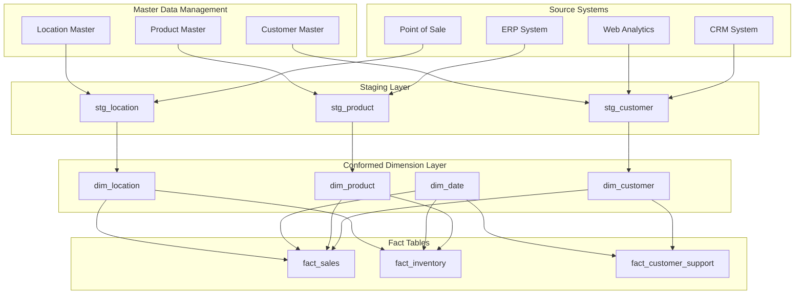
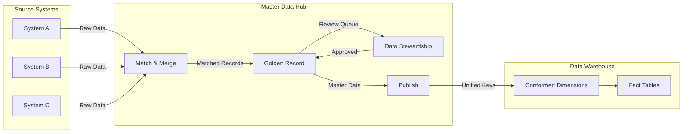
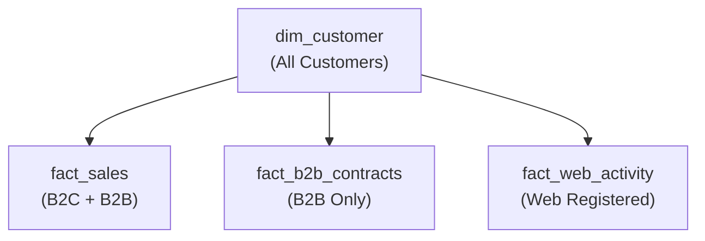

# How to Create Conformed Dimensions

Author: [nawazdhandala](https://github.com/nawazdhandala)

Tags: Data Warehouse, Conformed Dimensions, Dimensional Modeling, Analytics

Description: Learn to create conformed dimensions for consistent analysis across multiple fact tables and subject areas.

---

You have three data marts: Sales, Inventory, and Customer Service. Each tracks the same products but uses different product keys, different category hierarchies, and different naming conventions. Your CFO asks for a unified view of product performance across all channels. You spend two weeks reconciling spreadsheets, mapping keys, and explaining why the numbers do not match.

This is what happens when dimensions are not conformed.

Conformed dimensions are the backbone of enterprise data warehousing. They enable consistent, cross-functional analysis by ensuring that shared business concepts like customers, products, dates, and locations have identical definitions and keys across all fact tables and subject areas.

This guide shows you how to design, implement, and maintain conformed dimensions properly.

---

## What Are Conformed Dimensions?

A conformed dimension is a dimension table that maintains the same structure, keys, and attribute values across multiple fact tables and data marts. When two fact tables share a conformed dimension, you can analyze them together with consistent business context.

```text
Conformed Dimension: dim_product
├── Used by: fact_sales
├── Used by: fact_inventory
├── Used by: fact_returns
└── Used by: fact_customer_support
```

Key characteristics:

- **Identical surrogate keys** across all fact tables
- **Consistent attribute values** (same names, codes, hierarchies)
- **Single source of truth** managed centrally
- **Versioned changes** tracked through slowly changing dimension techniques

---

## Why Conformed Dimensions Matter

Without conformed dimensions, you face:

| Problem | Business Impact |
|---------|-----------------|
| Inconsistent product names | Reports show different totals for the same product |
| Multiple customer keys | Cannot track customer behavior across touchpoints |
| Conflicting hierarchies | Roll-ups produce different results in different reports |
| Date misalignment | Fiscal vs calendar year comparisons break |
| Region mapping conflicts | Geographic analysis becomes unreliable |

With conformed dimensions, you gain:

- **Drill-across capability**: Query multiple fact tables in a single report
- **Consistent KPIs**: Same definition of "customer" everywhere
- **Reduced ETL complexity**: One transformation, many consumers
- **Faster report development**: No reconciliation needed
- **Trustworthy analytics**: Stakeholders believe the numbers

---

## Architecture Overview

Here is how conformed dimensions fit into a typical data warehouse architecture:



---

## Step 1: Identify Shared Business Concepts

Start by cataloging dimensions that appear in multiple business processes:

```sql
-- Audit query: Find dimensions used across multiple fact tables
-- This helps identify candidates for conformance

SELECT
    column_name,
    COUNT(DISTINCT table_name) AS fact_table_count,
    STRING_AGG(DISTINCT table_name, ', ') AS fact_tables
FROM information_schema.columns
WHERE table_schema = 'warehouse'
  AND table_name LIKE 'fact_%'
  AND column_name LIKE '%_key' OR column_name LIKE '%_id'
GROUP BY column_name
HAVING COUNT(DISTINCT table_name) > 1
ORDER BY fact_table_count DESC;
```

Common candidates for conformed dimensions:

| Dimension | Shared Across |
|-----------|---------------|
| Date/Time | All fact tables |
| Customer | Sales, Support, Marketing |
| Product | Sales, Inventory, Returns |
| Location | Sales, Inventory, Shipping |
| Employee | Sales, HR, Operations |
| Currency | All financial facts |

---

## Step 2: Design the Conformed Dimension Schema

### Date Dimension (The Most Conformed Dimension)

Every data warehouse needs a conformed date dimension. Here is a production-ready implementation:

```sql
-- Create the conformed date dimension
-- This table serves as the single source of truth for all date-related analysis

CREATE TABLE dim_date (
    -- Surrogate key: Integer for efficient joins
    date_key INTEGER PRIMARY KEY,

    -- Natural key: The actual date value
    full_date DATE NOT NULL UNIQUE,

    -- Calendar attributes
    day_of_week SMALLINT NOT NULL,           -- 1=Sunday, 7=Saturday
    day_of_week_name VARCHAR(10) NOT NULL,   -- 'Monday', 'Tuesday', etc.
    day_of_week_abbrev VARCHAR(3) NOT NULL,  -- 'Mon', 'Tue', etc.
    day_of_month SMALLINT NOT NULL,          -- 1-31
    day_of_year SMALLINT NOT NULL,           -- 1-366

    -- Week attributes
    week_of_year SMALLINT NOT NULL,          -- 1-53
    week_of_month SMALLINT NOT NULL,         -- 1-5
    week_start_date DATE NOT NULL,           -- Monday of that week
    week_end_date DATE NOT NULL,             -- Sunday of that week

    -- Month attributes
    month_number SMALLINT NOT NULL,          -- 1-12
    month_name VARCHAR(10) NOT NULL,         -- 'January', 'February', etc.
    month_abbrev VARCHAR(3) NOT NULL,        -- 'Jan', 'Feb', etc.
    month_start_date DATE NOT NULL,
    month_end_date DATE NOT NULL,
    days_in_month SMALLINT NOT NULL,

    -- Quarter attributes
    quarter_number SMALLINT NOT NULL,        -- 1-4
    quarter_name VARCHAR(2) NOT NULL,        -- 'Q1', 'Q2', etc.
    quarter_start_date DATE NOT NULL,
    quarter_end_date DATE NOT NULL,

    -- Year attributes
    calendar_year SMALLINT NOT NULL,
    year_start_date DATE NOT NULL,
    year_end_date DATE NOT NULL,

    -- Fiscal calendar (adjust based on your fiscal year start)
    fiscal_year SMALLINT NOT NULL,
    fiscal_quarter SMALLINT NOT NULL,
    fiscal_month SMALLINT NOT NULL,
    fiscal_week SMALLINT NOT NULL,
    fiscal_year_start_date DATE NOT NULL,
    fiscal_year_end_date DATE NOT NULL,

    -- Relative date flags (updated daily via ETL)
    is_today BOOLEAN DEFAULT FALSE,
    is_yesterday BOOLEAN DEFAULT FALSE,
    is_current_week BOOLEAN DEFAULT FALSE,
    is_current_month BOOLEAN DEFAULT FALSE,
    is_current_quarter BOOLEAN DEFAULT FALSE,
    is_current_year BOOLEAN DEFAULT FALSE,

    -- Business calendar flags
    is_weekday BOOLEAN NOT NULL,
    is_weekend BOOLEAN NOT NULL,
    is_holiday BOOLEAN DEFAULT FALSE,
    holiday_name VARCHAR(50),
    is_business_day BOOLEAN NOT NULL,

    -- Period comparison helpers
    same_day_last_year DATE,
    same_week_last_year_start DATE,
    same_month_last_year_start DATE,

    -- Metadata
    created_at TIMESTAMP DEFAULT CURRENT_TIMESTAMP,
    updated_at TIMESTAMP DEFAULT CURRENT_TIMESTAMP
);

-- Create indexes for common query patterns
CREATE INDEX idx_dim_date_year_month ON dim_date(calendar_year, month_number);
CREATE INDEX idx_dim_date_fiscal ON dim_date(fiscal_year, fiscal_quarter);
CREATE INDEX idx_dim_date_full_date ON dim_date(full_date);
```

### Populating the Date Dimension

```sql
-- Procedure to populate the date dimension
-- Run once to initialize, then extend as needed

CREATE OR REPLACE PROCEDURE populate_dim_date(
    start_date DATE,
    end_date DATE,
    fiscal_year_start_month INTEGER DEFAULT 1  -- 1=January, 4=April, 7=July, etc.
)
LANGUAGE plpgsql
AS $$
DECLARE
    current_date_val DATE;
    date_key_val INTEGER;
    fiscal_year_val INTEGER;
    fiscal_quarter_val INTEGER;
    fiscal_month_val INTEGER;
BEGIN
    current_date_val := start_date;

    WHILE current_date_val <= end_date LOOP
        -- Generate surrogate key as YYYYMMDD integer
        date_key_val := TO_CHAR(current_date_val, 'YYYYMMDD')::INTEGER;

        -- Calculate fiscal year based on fiscal year start month
        IF EXTRACT(MONTH FROM current_date_val) >= fiscal_year_start_month THEN
            fiscal_year_val := EXTRACT(YEAR FROM current_date_val)::INTEGER;
        ELSE
            fiscal_year_val := EXTRACT(YEAR FROM current_date_val)::INTEGER - 1;
        END IF;

        -- Calculate fiscal month (1-12 starting from fiscal year start)
        fiscal_month_val := MOD(
            EXTRACT(MONTH FROM current_date_val)::INTEGER - fiscal_year_start_month + 12,
            12
        ) + 1;

        -- Calculate fiscal quarter
        fiscal_quarter_val := CEIL(fiscal_month_val / 3.0)::INTEGER;

        INSERT INTO dim_date (
            date_key,
            full_date,
            day_of_week,
            day_of_week_name,
            day_of_week_abbrev,
            day_of_month,
            day_of_year,
            week_of_year,
            week_of_month,
            week_start_date,
            week_end_date,
            month_number,
            month_name,
            month_abbrev,
            month_start_date,
            month_end_date,
            days_in_month,
            quarter_number,
            quarter_name,
            quarter_start_date,
            quarter_end_date,
            calendar_year,
            year_start_date,
            year_end_date,
            fiscal_year,
            fiscal_quarter,
            fiscal_month,
            fiscal_week,
            fiscal_year_start_date,
            fiscal_year_end_date,
            is_weekday,
            is_weekend,
            is_business_day,
            same_day_last_year,
            same_week_last_year_start,
            same_month_last_year_start
        )
        VALUES (
            date_key_val,
            current_date_val,
            EXTRACT(DOW FROM current_date_val)::SMALLINT + 1,
            TO_CHAR(current_date_val, 'Day'),
            TO_CHAR(current_date_val, 'Dy'),
            EXTRACT(DAY FROM current_date_val)::SMALLINT,
            EXTRACT(DOY FROM current_date_val)::SMALLINT,
            EXTRACT(WEEK FROM current_date_val)::SMALLINT,
            CEIL(EXTRACT(DAY FROM current_date_val) / 7.0)::SMALLINT,
            DATE_TRUNC('week', current_date_val)::DATE,
            (DATE_TRUNC('week', current_date_val) + INTERVAL '6 days')::DATE,
            EXTRACT(MONTH FROM current_date_val)::SMALLINT,
            TO_CHAR(current_date_val, 'Month'),
            TO_CHAR(current_date_val, 'Mon'),
            DATE_TRUNC('month', current_date_val)::DATE,
            (DATE_TRUNC('month', current_date_val) + INTERVAL '1 month - 1 day')::DATE,
            EXTRACT(DAY FROM DATE_TRUNC('month', current_date_val) + INTERVAL '1 month - 1 day')::SMALLINT,
            EXTRACT(QUARTER FROM current_date_val)::SMALLINT,
            'Q' || EXTRACT(QUARTER FROM current_date_val)::TEXT,
            DATE_TRUNC('quarter', current_date_val)::DATE,
            (DATE_TRUNC('quarter', current_date_val) + INTERVAL '3 months - 1 day')::DATE,
            EXTRACT(YEAR FROM current_date_val)::SMALLINT,
            DATE_TRUNC('year', current_date_val)::DATE,
            (DATE_TRUNC('year', current_date_val) + INTERVAL '1 year - 1 day')::DATE,
            fiscal_year_val,
            fiscal_quarter_val,
            fiscal_month_val,
            CEIL((fiscal_month_val - 1) * 4.33 +
                 EXTRACT(DAY FROM current_date_val) / 7.0)::SMALLINT,
            MAKE_DATE(fiscal_year_val, fiscal_year_start_month, 1),
            (MAKE_DATE(fiscal_year_val + 1, fiscal_year_start_month, 1) - INTERVAL '1 day')::DATE,
            EXTRACT(DOW FROM current_date_val) BETWEEN 1 AND 5,
            EXTRACT(DOW FROM current_date_val) IN (0, 6),
            EXTRACT(DOW FROM current_date_val) BETWEEN 1 AND 5,
            current_date_val - INTERVAL '1 year',
            DATE_TRUNC('week', current_date_val - INTERVAL '1 year')::DATE,
            DATE_TRUNC('month', current_date_val - INTERVAL '1 year')::DATE
        )
        ON CONFLICT (date_key) DO NOTHING;

        current_date_val := current_date_val + INTERVAL '1 day';
    END LOOP;
END;
$$;

-- Initialize date dimension for 20 years (2020-2040)
CALL populate_dim_date('2020-01-01'::DATE, '2040-12-31'::DATE, 1);
```

---

## Step 3: Design the Customer Dimension

The customer dimension is often the most complex conformed dimension due to multiple source systems:

```sql
-- Conformed customer dimension with SCD Type 2 support
-- This handles customer attribute changes over time

CREATE TABLE dim_customer (
    -- Surrogate key: System-generated, used in all fact tables
    customer_key SERIAL PRIMARY KEY,

    -- Natural key: Business identifier from source system
    customer_id VARCHAR(50) NOT NULL,

    -- Source system tracking
    source_system VARCHAR(20) NOT NULL,      -- 'CRM', 'ERP', 'WEB'
    source_customer_id VARCHAR(50) NOT NULL,

    -- Customer identification
    customer_name VARCHAR(200) NOT NULL,
    first_name VARCHAR(100),
    last_name VARCHAR(100),
    email VARCHAR(255),
    phone VARCHAR(50),

    -- Customer classification
    customer_type VARCHAR(50) NOT NULL,      -- 'Individual', 'Business', 'Government'
    customer_segment VARCHAR(50),            -- 'Premium', 'Standard', 'Basic'
    customer_tier VARCHAR(20),               -- 'Gold', 'Silver', 'Bronze'
    account_status VARCHAR(20) NOT NULL,     -- 'Active', 'Inactive', 'Suspended'

    -- Geographic attributes (linked to conformed location dimension)
    billing_address_line1 VARCHAR(200),
    billing_address_line2 VARCHAR(200),
    billing_city VARCHAR(100),
    billing_state VARCHAR(100),
    billing_postal_code VARCHAR(20),
    billing_country VARCHAR(100),
    billing_region VARCHAR(50),              -- 'North America', 'EMEA', 'APAC'

    -- Shipping address (may differ from billing)
    shipping_address_line1 VARCHAR(200),
    shipping_address_line2 VARCHAR(200),
    shipping_city VARCHAR(100),
    shipping_state VARCHAR(100),
    shipping_postal_code VARCHAR(20),
    shipping_country VARCHAR(100),
    shipping_region VARCHAR(50),

    -- Temporal attributes
    customer_since_date DATE,
    first_purchase_date DATE,
    last_purchase_date DATE,

    -- SCD Type 2 columns for tracking historical changes
    effective_start_date DATE NOT NULL,
    effective_end_date DATE,                 -- NULL means current record
    is_current_record BOOLEAN NOT NULL DEFAULT TRUE,

    -- Metadata
    created_at TIMESTAMP DEFAULT CURRENT_TIMESTAMP,
    updated_at TIMESTAMP DEFAULT CURRENT_TIMESTAMP,
    created_by VARCHAR(100),
    updated_by VARCHAR(100),

    -- Data quality flags
    is_verified BOOLEAN DEFAULT FALSE,
    verification_date DATE,
    data_quality_score DECIMAL(3,2)          -- 0.00 to 1.00
);

-- Indexes for common access patterns
CREATE INDEX idx_dim_customer_id ON dim_customer(customer_id);
CREATE INDEX idx_dim_customer_current ON dim_customer(is_current_record) WHERE is_current_record = TRUE;
CREATE INDEX idx_dim_customer_segment ON dim_customer(customer_segment, customer_tier);
CREATE INDEX idx_dim_customer_region ON dim_customer(billing_region, billing_country);
CREATE INDEX idx_dim_customer_effective ON dim_customer(effective_start_date, effective_end_date);

-- Unique constraint for business key + effective date
CREATE UNIQUE INDEX idx_dim_customer_bk_effective
    ON dim_customer(customer_id, effective_start_date);
```

### Customer Dimension ETL with SCD Type 2

```sql
-- Merge procedure for customer dimension
-- Implements SCD Type 2 for tracking historical changes

CREATE OR REPLACE PROCEDURE merge_dim_customer()
LANGUAGE plpgsql
AS $$
DECLARE
    v_load_date DATE := CURRENT_DATE;
    v_rows_inserted INTEGER := 0;
    v_rows_updated INTEGER := 0;
BEGIN
    -- Step 1: Expire records where attributes have changed
    -- This closes out the old version of the customer record

    UPDATE dim_customer dc
    SET
        effective_end_date = v_load_date - INTERVAL '1 day',
        is_current_record = FALSE,
        updated_at = CURRENT_TIMESTAMP,
        updated_by = 'ETL_PROCESS'
    FROM stg_customer sc
    WHERE dc.customer_id = sc.customer_id
      AND dc.is_current_record = TRUE
      AND (
          -- Check for changes in tracked attributes
          dc.customer_name != sc.customer_name OR
          dc.customer_segment != sc.customer_segment OR
          dc.customer_tier != sc.customer_tier OR
          dc.account_status != sc.account_status OR
          dc.billing_city != sc.billing_city OR
          dc.billing_state != sc.billing_state OR
          dc.billing_country != sc.billing_country
      );

    GET DIAGNOSTICS v_rows_updated = ROW_COUNT;
    RAISE NOTICE 'Expired % existing records with attribute changes', v_rows_updated;

    -- Step 2: Insert new versions of changed records
    -- This creates the new current version

    INSERT INTO dim_customer (
        customer_id,
        source_system,
        source_customer_id,
        customer_name,
        first_name,
        last_name,
        email,
        phone,
        customer_type,
        customer_segment,
        customer_tier,
        account_status,
        billing_address_line1,
        billing_city,
        billing_state,
        billing_postal_code,
        billing_country,
        billing_region,
        customer_since_date,
        effective_start_date,
        effective_end_date,
        is_current_record,
        created_by
    )
    SELECT
        sc.customer_id,
        sc.source_system,
        sc.source_customer_id,
        sc.customer_name,
        sc.first_name,
        sc.last_name,
        sc.email,
        sc.phone,
        sc.customer_type,
        sc.customer_segment,
        sc.customer_tier,
        sc.account_status,
        sc.billing_address_line1,
        sc.billing_city,
        sc.billing_state,
        sc.billing_postal_code,
        sc.billing_country,
        -- Derive region from country
        CASE
            WHEN sc.billing_country IN ('USA', 'Canada', 'Mexico') THEN 'North America'
            WHEN sc.billing_country IN ('UK', 'Germany', 'France', 'Italy', 'Spain') THEN 'EMEA'
            WHEN sc.billing_country IN ('China', 'Japan', 'Australia', 'India') THEN 'APAC'
            ELSE 'Other'
        END AS billing_region,
        COALESCE(
            (SELECT MIN(customer_since_date) FROM dim_customer WHERE customer_id = sc.customer_id),
            v_load_date
        ),
        v_load_date,
        NULL,
        TRUE,
        'ETL_PROCESS'
    FROM stg_customer sc
    WHERE NOT EXISTS (
        -- Insert if no current record exists for this customer
        SELECT 1 FROM dim_customer dc
        WHERE dc.customer_id = sc.customer_id
          AND dc.is_current_record = TRUE
    );

    GET DIAGNOSTICS v_rows_inserted = ROW_COUNT;
    RAISE NOTICE 'Inserted % new customer records', v_rows_inserted;

    -- Step 3: Log the merge results
    INSERT INTO etl_audit_log (
        table_name,
        operation,
        rows_affected,
        load_date,
        execution_time
    )
    VALUES (
        'dim_customer',
        'MERGE_SCD2',
        v_rows_inserted + v_rows_updated,
        v_load_date,
        CURRENT_TIMESTAMP
    );

    COMMIT;
END;
$$;
```

---

## Step 4: Design the Product Dimension

```sql
-- Conformed product dimension with hierarchy support
-- Handles multiple category levels and product attributes

CREATE TABLE dim_product (
    -- Surrogate key
    product_key SERIAL PRIMARY KEY,

    -- Natural keys from different systems
    product_id VARCHAR(50) NOT NULL,
    sku VARCHAR(50) UNIQUE,
    upc VARCHAR(20),

    -- Product identification
    product_name VARCHAR(200) NOT NULL,
    product_description TEXT,
    brand VARCHAR(100),
    manufacturer VARCHAR(100),

    -- Product hierarchy (conformed across all systems)
    -- Level 1: Department
    department_code VARCHAR(10),
    department_name VARCHAR(100),

    -- Level 2: Category
    category_code VARCHAR(10),
    category_name VARCHAR(100),

    -- Level 3: Subcategory
    subcategory_code VARCHAR(10),
    subcategory_name VARCHAR(100),

    -- Level 4: Product class
    product_class_code VARCHAR(10),
    product_class_name VARCHAR(100),

    -- Product attributes
    unit_of_measure VARCHAR(20),
    pack_size INTEGER,
    weight_kg DECIMAL(10,3),
    volume_liters DECIMAL(10,3),

    -- Pricing (reference prices, actual prices in fact tables)
    standard_cost DECIMAL(12,2),
    list_price DECIMAL(12,2),

    -- Product status
    product_status VARCHAR(20) NOT NULL,     -- 'Active', 'Discontinued', 'Pending'
    introduction_date DATE,
    discontinuation_date DATE,

    -- Product flags
    is_active BOOLEAN DEFAULT TRUE,
    is_seasonal BOOLEAN DEFAULT FALSE,
    is_perishable BOOLEAN DEFAULT FALSE,
    is_hazardous BOOLEAN DEFAULT FALSE,
    requires_refrigeration BOOLEAN DEFAULT FALSE,

    -- SCD Type 2 support
    effective_start_date DATE NOT NULL,
    effective_end_date DATE,
    is_current_record BOOLEAN NOT NULL DEFAULT TRUE,

    -- Metadata
    created_at TIMESTAMP DEFAULT CURRENT_TIMESTAMP,
    updated_at TIMESTAMP DEFAULT CURRENT_TIMESTAMP
);

-- Hierarchy relationship view for drill-down analysis
CREATE VIEW v_product_hierarchy AS
SELECT DISTINCT
    department_code,
    department_name,
    category_code,
    category_name,
    subcategory_code,
    subcategory_name,
    product_class_code,
    product_class_name,
    -- Path for tree visualization
    department_name || ' > ' ||
    category_name || ' > ' ||
    subcategory_name || ' > ' ||
    product_class_name AS hierarchy_path
FROM dim_product
WHERE is_current_record = TRUE
ORDER BY department_name, category_name, subcategory_name, product_class_name;

-- Indexes
CREATE INDEX idx_dim_product_sku ON dim_product(sku);
CREATE INDEX idx_dim_product_category ON dim_product(category_code, subcategory_code);
CREATE INDEX idx_dim_product_brand ON dim_product(brand);
CREATE INDEX idx_dim_product_current ON dim_product(is_current_record) WHERE is_current_record = TRUE;
```

---

## Step 5: Implement Dimension Conformance Rules

Create a validation framework to ensure dimensions remain conformed:

```sql
-- Table to store conformance rules
CREATE TABLE dim_conformance_rules (
    rule_id SERIAL PRIMARY KEY,
    dimension_name VARCHAR(100) NOT NULL,
    rule_name VARCHAR(200) NOT NULL,
    rule_description TEXT,
    validation_query TEXT NOT NULL,
    severity VARCHAR(20) NOT NULL,           -- 'ERROR', 'WARNING', 'INFO'
    is_active BOOLEAN DEFAULT TRUE,
    created_at TIMESTAMP DEFAULT CURRENT_TIMESTAMP
);

-- Insert conformance validation rules
INSERT INTO dim_conformance_rules (dimension_name, rule_name, rule_description, validation_query, severity)
VALUES

-- Rule 1: All fact tables must use the same customer keys
('dim_customer', 'customer_key_conformance',
 'Verify all customer keys in fact tables exist in dim_customer',
 $$
 SELECT 'fact_sales' AS fact_table, COUNT(*) AS orphan_count
 FROM fact_sales f
 LEFT JOIN dim_customer d ON f.customer_key = d.customer_key
 WHERE d.customer_key IS NULL
 UNION ALL
 SELECT 'fact_customer_support', COUNT(*)
 FROM fact_customer_support f
 LEFT JOIN dim_customer d ON f.customer_key = d.customer_key
 WHERE d.customer_key IS NULL
 $$,
 'ERROR'),

-- Rule 2: Product hierarchy must be consistent
('dim_product', 'product_hierarchy_consistency',
 'Verify product hierarchy has no gaps or inconsistencies',
 $$
 SELECT product_id, 'Missing category for subcategory' AS issue
 FROM dim_product
 WHERE subcategory_code IS NOT NULL
   AND category_code IS NULL
   AND is_current_record = TRUE
 UNION ALL
 SELECT product_id, 'Missing department for category'
 FROM dim_product
 WHERE category_code IS NOT NULL
   AND department_code IS NULL
   AND is_current_record = TRUE
 $$,
 'ERROR'),

-- Rule 3: Date dimension completeness
('dim_date', 'date_completeness',
 'Verify no date gaps exist in the date dimension',
 $$
 WITH date_range AS (
     SELECT generate_series(
         (SELECT MIN(full_date) FROM dim_date),
         (SELECT MAX(full_date) FROM dim_date),
         '1 day'::interval
     )::date AS expected_date
 )
 SELECT expected_date, 'Missing date' AS issue
 FROM date_range dr
 LEFT JOIN dim_date dd ON dr.expected_date = dd.full_date
 WHERE dd.date_key IS NULL
 $$,
 'ERROR'),

-- Rule 4: No duplicate current records
('dim_customer', 'no_duplicate_current_records',
 'Verify only one current record exists per business key',
 $$
 SELECT customer_id, COUNT(*) AS current_record_count
 FROM dim_customer
 WHERE is_current_record = TRUE
 GROUP BY customer_id
 HAVING COUNT(*) > 1
 $$,
 'ERROR'),

-- Rule 5: Attribute value consistency across fact tables
('dim_product', 'product_attribute_consistency',
 'Verify product attributes match across all usage contexts',
 $$
 SELECT DISTINCT
     p.product_id,
     'Inconsistent category mapping' AS issue
 FROM dim_product p
 INNER JOIN (
     SELECT product_key, category_code
     FROM dim_product
     WHERE is_current_record = TRUE
     GROUP BY product_key, category_code
     HAVING COUNT(DISTINCT category_code) > 1
 ) dups ON p.product_key = dups.product_key
 $$,
 'WARNING');

-- Procedure to run all conformance validations
CREATE OR REPLACE PROCEDURE validate_dimension_conformance()
LANGUAGE plpgsql
AS $$
DECLARE
    rule_rec RECORD;
    validation_result INTEGER;
    v_start_time TIMESTAMP;
BEGIN
    v_start_time := CURRENT_TIMESTAMP;

    RAISE NOTICE 'Starting dimension conformance validation at %', v_start_time;

    -- Loop through all active rules
    FOR rule_rec IN
        SELECT * FROM dim_conformance_rules WHERE is_active = TRUE
    LOOP
        -- Execute the validation query and count results
        EXECUTE 'SELECT COUNT(*) FROM (' || rule_rec.validation_query || ') AS validation'
        INTO validation_result;

        -- Log the result
        INSERT INTO dim_conformance_audit (
            rule_id,
            dimension_name,
            rule_name,
            execution_time,
            issues_found,
            severity,
            status
        )
        VALUES (
            rule_rec.rule_id,
            rule_rec.dimension_name,
            rule_rec.rule_name,
            CURRENT_TIMESTAMP,
            validation_result,
            rule_rec.severity,
            CASE WHEN validation_result = 0 THEN 'PASSED' ELSE 'FAILED' END
        );

        -- Raise notice for failures
        IF validation_result > 0 THEN
            RAISE NOTICE '[%] % - %: Found % issues',
                rule_rec.severity,
                rule_rec.dimension_name,
                rule_rec.rule_name,
                validation_result;
        END IF;
    END LOOP;

    RAISE NOTICE 'Conformance validation completed in % seconds',
        EXTRACT(EPOCH FROM (CURRENT_TIMESTAMP - v_start_time));
END;
$$;

-- Audit table for tracking validation results
CREATE TABLE dim_conformance_audit (
    audit_id SERIAL PRIMARY KEY,
    rule_id INTEGER REFERENCES dim_conformance_rules(rule_id),
    dimension_name VARCHAR(100),
    rule_name VARCHAR(200),
    execution_time TIMESTAMP,
    issues_found INTEGER,
    severity VARCHAR(20),
    status VARCHAR(20)
);
```

---

## Step 6: Master Data Management Integration

Conformed dimensions work best when backed by proper master data management (MDM):



### MDM Integration Pattern

```sql
-- Cross-reference table linking source system IDs to master IDs
-- This is the bridge between MDM and your conformed dimensions

CREATE TABLE mdm_customer_xref (
    xref_id SERIAL PRIMARY KEY,

    -- Master identifier (from MDM system)
    master_customer_id VARCHAR(50) NOT NULL,

    -- Source system reference
    source_system VARCHAR(50) NOT NULL,
    source_customer_id VARCHAR(100) NOT NULL,

    -- Match confidence and type
    match_confidence DECIMAL(5,2),           -- 0.00 to 100.00
    match_type VARCHAR(50),                  -- 'Exact', 'Fuzzy', 'Manual'

    -- Status tracking
    is_active BOOLEAN DEFAULT TRUE,
    verified_by VARCHAR(100),
    verified_date TIMESTAMP,

    -- Audit fields
    created_at TIMESTAMP DEFAULT CURRENT_TIMESTAMP,
    updated_at TIMESTAMP DEFAULT CURRENT_TIMESTAMP,

    -- Prevent duplicate mappings
    UNIQUE(source_system, source_customer_id)
);

-- Index for efficient lookups from source to master
CREATE INDEX idx_mdm_xref_source ON mdm_customer_xref(source_system, source_customer_id);
CREATE INDEX idx_mdm_xref_master ON mdm_customer_xref(master_customer_id);

-- View to resolve any source customer ID to the master ID
CREATE VIEW v_customer_resolution AS
SELECT
    x.source_system,
    x.source_customer_id,
    x.master_customer_id,
    dc.customer_key,
    dc.customer_name,
    dc.customer_segment,
    x.match_confidence
FROM mdm_customer_xref x
INNER JOIN dim_customer dc
    ON x.master_customer_id = dc.customer_id
    AND dc.is_current_record = TRUE
WHERE x.is_active = TRUE;

-- Example: Resolving customer from different source systems
-- This query demonstrates how to get the conformed customer key
-- regardless of which source system the transaction came from

SELECT
    'CRM' AS source_system,
    crm.crm_customer_id AS source_id,
    COALESCE(v.customer_key, -1) AS customer_key,
    COALESCE(v.customer_name, 'Unknown') AS customer_name
FROM crm_transactions crm
LEFT JOIN v_customer_resolution v
    ON v.source_system = 'CRM'
    AND v.source_customer_id = crm.crm_customer_id;
```

---

## Step 7: Drill-Across Queries

The real power of conformed dimensions is enabling drill-across queries that span multiple fact tables:

```sql
-- Example: Combined analysis across Sales and Customer Support
-- This is only possible because both fact tables share conformed dimensions

WITH customer_sales AS (
    -- Aggregate sales by customer and product category
    SELECT
        dc.customer_key,
        dc.customer_name,
        dc.customer_segment,
        dp.category_name,
        dd.calendar_year,
        dd.quarter_name,
        SUM(fs.quantity_sold) AS units_sold,
        SUM(fs.revenue_amount) AS total_revenue
    FROM fact_sales fs
    INNER JOIN dim_customer dc ON fs.customer_key = dc.customer_key
    INNER JOIN dim_product dp ON fs.product_key = dp.product_key
    INNER JOIN dim_date dd ON fs.order_date_key = dd.date_key
    WHERE dc.is_current_record = TRUE
      AND dp.is_current_record = TRUE
      AND dd.calendar_year = 2025
    GROUP BY
        dc.customer_key, dc.customer_name, dc.customer_segment,
        dp.category_name, dd.calendar_year, dd.quarter_name
),
customer_support AS (
    -- Aggregate support tickets by customer and category
    SELECT
        dc.customer_key,
        dp.category_name,
        dd.calendar_year,
        dd.quarter_name,
        COUNT(*) AS ticket_count,
        AVG(fcs.resolution_hours) AS avg_resolution_hours,
        SUM(CASE WHEN fcs.satisfaction_score >= 4 THEN 1 ELSE 0 END)::DECIMAL /
            NULLIF(COUNT(*), 0) AS satisfaction_rate
    FROM fact_customer_support fcs
    INNER JOIN dim_customer dc ON fcs.customer_key = dc.customer_key
    INNER JOIN dim_product dp ON fcs.product_key = dp.product_key
    INNER JOIN dim_date dd ON fcs.ticket_date_key = dd.date_key
    WHERE dc.is_current_record = TRUE
      AND dp.is_current_record = TRUE
      AND dd.calendar_year = 2025
    GROUP BY
        dc.customer_key, dp.category_name,
        dd.calendar_year, dd.quarter_name
)
-- Drill-across: Combine sales and support metrics
SELECT
    cs.customer_name,
    cs.customer_segment,
    cs.category_name,
    cs.quarter_name,
    cs.units_sold,
    cs.total_revenue,
    COALESCE(sup.ticket_count, 0) AS support_tickets,
    COALESCE(sup.avg_resolution_hours, 0) AS avg_resolution_hours,
    COALESCE(sup.satisfaction_rate, 1.0) AS satisfaction_rate,
    -- Calculate support intensity (tickets per unit sold)
    CASE
        WHEN cs.units_sold > 0
        THEN COALESCE(sup.ticket_count, 0)::DECIMAL / cs.units_sold
        ELSE 0
    END AS tickets_per_unit
FROM customer_sales cs
LEFT JOIN customer_support sup
    ON cs.customer_key = sup.customer_key
    AND cs.category_name = sup.category_name
    AND cs.calendar_year = sup.calendar_year
    AND cs.quarter_name = sup.quarter_name
ORDER BY
    cs.total_revenue DESC,
    tickets_per_unit DESC;
```

---

## Common Conformance Patterns

### Pattern 1: Shared Dimension, Subset Facts

When a dimension is shared but fact tables use different subsets:



### Pattern 2: Role-Playing Dimensions

A single conformed dimension used in multiple roles:

```sql
-- The date dimension plays multiple roles in fact_shipments
-- This is a common pattern for tracking different date events

CREATE TABLE fact_shipments (
    shipment_key SERIAL PRIMARY KEY,

    -- Multiple role-playing date keys, all referencing dim_date
    order_date_key INTEGER REFERENCES dim_date(date_key),
    ship_date_key INTEGER REFERENCES dim_date(date_key),
    expected_delivery_date_key INTEGER REFERENCES dim_date(date_key),
    actual_delivery_date_key INTEGER REFERENCES dim_date(date_key),

    -- Other dimension keys
    customer_key INTEGER REFERENCES dim_customer(customer_key),
    product_key INTEGER REFERENCES dim_product(product_key),

    -- Measures
    quantity INTEGER,
    shipping_cost DECIMAL(10,2),
    days_to_deliver INTEGER
);

-- Query using role-playing dimensions
SELECT
    od.month_name AS order_month,
    sd.month_name AS ship_month,
    dd.month_name AS delivery_month,
    AVG(f.days_to_deliver) AS avg_delivery_days,
    COUNT(*) AS shipment_count
FROM fact_shipments f
INNER JOIN dim_date od ON f.order_date_key = od.date_key
INNER JOIN dim_date sd ON f.ship_date_key = sd.date_key
INNER JOIN dim_date dd ON f.actual_delivery_date_key = dd.date_key
WHERE od.calendar_year = 2025
GROUP BY od.month_name, sd.month_name, dd.month_name
ORDER BY od.month_number;
```

### Pattern 3: Shrunken Dimensions (Subsets)

When a fact table needs only a subset of dimension attributes:

```sql
-- Full conformed customer dimension
-- dim_customer has 50+ attributes

-- Shrunken dimension for specific use case
-- Contains only the attributes needed for web analytics

CREATE VIEW dim_customer_web AS
SELECT
    customer_key,
    customer_id,
    customer_segment,
    billing_region,
    customer_since_date,
    is_current_record
FROM dim_customer;

-- The shrunken dimension maintains conformance
-- because it uses the same surrogate key
```

---

## Maintenance and Governance

### Daily Conformance Check

```sql
-- Schedule this to run daily after ETL completes
-- It validates all conformed dimensions remain consistent

CREATE OR REPLACE PROCEDURE daily_conformance_check()
LANGUAGE plpgsql
AS $$
DECLARE
    v_check_date DATE := CURRENT_DATE;
    v_errors INTEGER := 0;
BEGIN
    -- Run all conformance validations
    CALL validate_dimension_conformance();

    -- Count any errors found
    SELECT COUNT(*) INTO v_errors
    FROM dim_conformance_audit
    WHERE DATE(execution_time) = v_check_date
      AND status = 'FAILED'
      AND severity = 'ERROR';

    -- Send alert if errors found
    IF v_errors > 0 THEN
        -- Insert notification record (integrate with your alerting system)
        INSERT INTO system_notifications (
            notification_type,
            severity,
            message,
            created_at
        )
        VALUES (
            'CONFORMANCE_FAILURE',
            'ERROR',
            'Daily conformance check found ' || v_errors || ' errors. Review dim_conformance_audit table.',
            CURRENT_TIMESTAMP
        );
    END IF;

    RAISE NOTICE 'Daily conformance check completed. Errors found: %', v_errors;
END;
$$;
```

### Dimension Change Tracking Dashboard Query

```sql
-- Query to monitor dimension changes over time
-- Useful for governance and audit purposes

SELECT
    'dim_customer' AS dimension_name,
    DATE(created_at) AS change_date,
    COUNT(CASE WHEN effective_start_date = DATE(created_at)
               AND effective_end_date IS NULL THEN 1 END) AS new_records,
    COUNT(CASE WHEN effective_end_date = DATE(created_at) - 1 THEN 1 END) AS expired_records,
    COUNT(CASE WHEN updated_at::DATE = DATE(created_at)
               AND effective_start_date < DATE(created_at) THEN 1 END) AS updated_records
FROM dim_customer
WHERE created_at >= CURRENT_DATE - INTERVAL '30 days'
GROUP BY DATE(created_at)

UNION ALL

SELECT
    'dim_product' AS dimension_name,
    DATE(created_at) AS change_date,
    COUNT(CASE WHEN effective_start_date = DATE(created_at)
               AND effective_end_date IS NULL THEN 1 END) AS new_records,
    COUNT(CASE WHEN effective_end_date = DATE(created_at) - 1 THEN 1 END) AS expired_records,
    COUNT(CASE WHEN updated_at::DATE = DATE(created_at)
               AND effective_start_date < DATE(created_at) THEN 1 END) AS updated_records
FROM dim_product
WHERE created_at >= CURRENT_DATE - INTERVAL '30 days'
GROUP BY DATE(created_at)

ORDER BY dimension_name, change_date DESC;
```

---

## Key Takeaways

1. **Conformed dimensions are not optional** for enterprise data warehouses. They are the foundation that enables cross-functional analysis.

2. **Start with Date** because every fact table needs it, and it is the simplest dimension to conform.

3. **Invest in MDM** to ensure your conformed dimensions have a single, authoritative source.

4. **Implement validation rules** to catch conformance violations before they corrupt your reports.

5. **Use surrogate keys** to insulate your fact tables from source system changes.

6. **Document hierarchies** explicitly, and enforce them through constraints.

7. **Monitor dimension changes** to understand data lineage and detect unexpected modifications.

8. **Design for drill-across** from day one, even if you only have one fact table today.

---

## Related Resources

- [The Data Warehouse Toolkit by Ralph Kimball](https://www.kimballgroup.com/data-warehouse-business-intelligence-resources/books/)
- [Building a Scalable Data Warehouse with Data Vault 2.0](https://datavaultalliance.com/)
- [Master Data Management: Best Practices](https://www.gartner.com/en/information-technology/glossary/master-data-management-mdm)

---

Conformed dimensions require upfront investment in design and governance. But that investment pays dividends every time a business user asks a question that spans multiple subject areas, and you can answer it in minutes instead of weeks.
