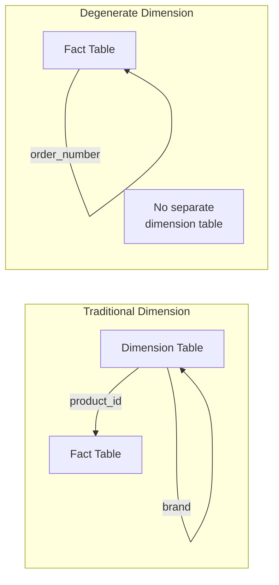
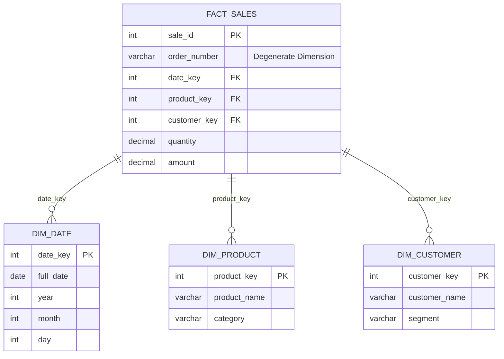
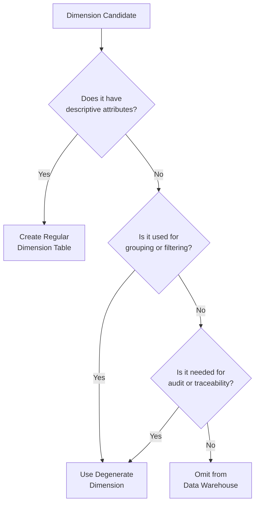
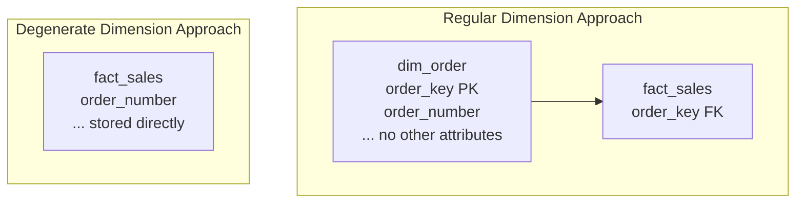

# How to Implement Degenerate Dimensions

Author: [nawazdhandala](https://github.com/nawazdhandala)

Tags: Data Warehouse, Degenerate Dimensions, Dimensional Modeling, Fact Tables

Description: Learn to implement degenerate dimensions for storing dimension keys directly in fact tables without dimension tables.

---

> Degenerate dimensions break the traditional dimensional modeling rule by storing dimension attributes directly in fact tables. When a dimension has no useful attributes beyond its identifier, creating a separate dimension table adds unnecessary complexity. Learn when and how to implement this powerful optimization technique.

Not every identifier needs its own dimension table. Understanding degenerate dimensions helps you build leaner, more efficient data warehouses.

---

## What is a Degenerate Dimension?

A degenerate dimension is a dimension key that exists in the fact table but has no corresponding dimension table. Unlike regular dimensions that contain descriptive attributes, degenerate dimensions are identifiers that provide transaction-level granularity without additional context.



---

## Common Use Cases

Degenerate dimensions appear frequently in transactional data. Here are the most common scenarios:

### Order Numbers and Invoice Numbers

Order numbers uniquely identify transactions but rarely have attributes worth storing separately:



### Transaction IDs and Reference Numbers

These identifiers serve as audit trails and cross-system references:

- Transaction IDs from payment systems
- Reference numbers from external sources
- Ticket numbers from support systems
- Shipment tracking numbers
- Receipt numbers

---

## Implementing Degenerate Dimensions in SQL

### Basic Fact Table with Degenerate Dimension

Create a fact table that includes the degenerate dimension as a column:

```sql
-- Create the sales fact table with order_number as a degenerate dimension
-- The order_number column stores the dimension value directly without a foreign key reference
CREATE TABLE fact_sales (
    -- Surrogate key for the fact table
    sale_id BIGINT IDENTITY(1,1) PRIMARY KEY,

    -- Degenerate dimension: stored directly in the fact table
    -- No foreign key constraint because there is no corresponding dimension table
    order_number VARCHAR(50) NOT NULL,

    -- Foreign keys to regular dimension tables
    date_key INT NOT NULL REFERENCES dim_date(date_key),
    product_key INT NOT NULL REFERENCES dim_product(product_key),
    customer_key INT NOT NULL REFERENCES dim_customer(customer_key),
    store_key INT NOT NULL REFERENCES dim_store(store_key),

    -- Measures (facts) that we want to analyze
    quantity INT NOT NULL,
    unit_price DECIMAL(10,2) NOT NULL,
    discount_amount DECIMAL(10,2) DEFAULT 0,
    total_amount DECIMAL(12,2) NOT NULL,

    -- Metadata for tracking data lineage
    created_at TIMESTAMP DEFAULT CURRENT_TIMESTAMP,
    source_system VARCHAR(50)
);

-- Create an index on the degenerate dimension for efficient lookups
-- This is critical because users often search by order number
CREATE INDEX idx_fact_sales_order_number
ON fact_sales(order_number);

-- Create a composite index for common query patterns
-- Queries often filter by date and then look up specific orders
CREATE INDEX idx_fact_sales_date_order
ON fact_sales(date_key, order_number);
```

### Multiple Degenerate Dimensions

A fact table can contain multiple degenerate dimensions:

```sql
-- Create a fact table for payment transactions with multiple degenerate dimensions
-- Each degenerate dimension serves a different purpose for tracking and auditing
CREATE TABLE fact_payment_transactions (
    transaction_id BIGINT IDENTITY(1,1) PRIMARY KEY,

    -- Degenerate Dimension 1: Internal reference for customer inquiries
    payment_reference VARCHAR(100) NOT NULL,

    -- Degenerate Dimension 2: External ID from the payment gateway
    gateway_transaction_id VARCHAR(100),

    -- Degenerate Dimension 3: Authorization code from the card network
    authorization_code VARCHAR(50),

    -- Degenerate Dimension 4: Links to original order in the sales system
    order_number VARCHAR(50) NOT NULL,

    -- Regular dimension foreign keys for analytical context
    date_key INT NOT NULL REFERENCES dim_date(date_key),
    time_key INT NOT NULL REFERENCES dim_time(time_key),
    customer_key INT NOT NULL REFERENCES dim_customer(customer_key),
    payment_method_key INT NOT NULL REFERENCES dim_payment_method(payment_method_key),

    -- Measures for financial analysis
    transaction_amount DECIMAL(12,2) NOT NULL,
    fee_amount DECIMAL(8,2) DEFAULT 0,
    net_amount DECIMAL(12,2) NOT NULL,

    -- Transaction status stored as a flag rather than a dimension
    -- because status changes are tracked in a separate fact table
    is_successful BIT NOT NULL,

    -- Audit columns
    processed_at TIMESTAMP DEFAULT CURRENT_TIMESTAMP
);

-- Index each degenerate dimension separately for direct lookups
CREATE INDEX idx_payment_reference ON fact_payment_transactions(payment_reference);
CREATE INDEX idx_gateway_transaction ON fact_payment_transactions(gateway_transaction_id);
CREATE INDEX idx_authorization_code ON fact_payment_transactions(authorization_code);
CREATE INDEX idx_payment_order ON fact_payment_transactions(order_number);
```

---

## ETL Process for Degenerate Dimensions

### Loading Data with Degenerate Dimensions

The ETL process is simpler because no dimension lookup is required:

```sql
-- ETL procedure to load sales data from staging to the fact table
-- Degenerate dimensions are copied directly without transformation
CREATE PROCEDURE sp_load_fact_sales
AS
BEGIN
    SET NOCOUNT ON;

    -- Begin transaction for data consistency
    BEGIN TRANSACTION;

    BEGIN TRY
        -- Insert new sales records from staging
        -- Regular dimensions require lookup; degenerate dimensions are copied directly
        INSERT INTO fact_sales (
            order_number,          -- Degenerate dimension: direct copy from source
            date_key,              -- Regular dimension: requires lookup
            product_key,           -- Regular dimension: requires lookup
            customer_key,          -- Regular dimension: requires lookup
            store_key,             -- Regular dimension: requires lookup
            quantity,
            unit_price,
            discount_amount,
            total_amount,
            source_system
        )
        SELECT
            -- Degenerate dimension: copy the order number as-is from the source
            -- No lookup table needed, no surrogate key generation
            stg.order_number,

            -- Regular dimension lookups using business keys
            dd.date_key,
            dp.product_key,
            dc.customer_key,
            ds.store_key,

            -- Measures from the staging table
            stg.quantity,
            stg.unit_price,
            stg.discount_amount,
            stg.quantity * stg.unit_price - stg.discount_amount AS total_amount,
            'POS_SYSTEM' AS source_system

        FROM staging_sales stg

        -- Join to dimension tables to get surrogate keys
        INNER JOIN dim_date dd
            ON dd.full_date = CAST(stg.sale_date AS DATE)
        INNER JOIN dim_product dp
            ON dp.product_code = stg.product_code
            AND dp.is_current = 1  -- SCD Type 2: get current version
        INNER JOIN dim_customer dc
            ON dc.customer_id = stg.customer_id
            AND dc.is_current = 1
        INNER JOIN dim_store ds
            ON ds.store_code = stg.store_code

        -- Avoid loading duplicates by checking if order already exists
        WHERE NOT EXISTS (
            SELECT 1
            FROM fact_sales fs
            WHERE fs.order_number = stg.order_number
        );

        -- Log the number of records loaded
        DECLARE @rows_inserted INT = @@ROWCOUNT;

        INSERT INTO etl_log (procedure_name, rows_affected, status)
        VALUES ('sp_load_fact_sales', @rows_inserted, 'SUCCESS');

        COMMIT TRANSACTION;

    END TRY
    BEGIN CATCH
        ROLLBACK TRANSACTION;

        -- Log the error for troubleshooting
        INSERT INTO etl_log (procedure_name, rows_affected, status, error_message)
        VALUES ('sp_load_fact_sales', 0, 'FAILED', ERROR_MESSAGE());

        THROW;
    END CATCH
END;
```

### Handling Duplicate Detection

Use the degenerate dimension as a natural key for duplicate detection:

```sql
-- Merge statement for incremental loading with duplicate handling
-- The degenerate dimension (order_number) serves as the business key for matching
MERGE INTO fact_sales AS target
USING (
    SELECT
        stg.order_number,
        dd.date_key,
        dp.product_key,
        dc.customer_key,
        ds.store_key,
        stg.quantity,
        stg.unit_price,
        stg.discount_amount,
        stg.quantity * stg.unit_price - stg.discount_amount AS total_amount
    FROM staging_sales stg
    INNER JOIN dim_date dd ON dd.full_date = CAST(stg.sale_date AS DATE)
    INNER JOIN dim_product dp ON dp.product_code = stg.product_code AND dp.is_current = 1
    INNER JOIN dim_customer dc ON dc.customer_id = stg.customer_id AND dc.is_current = 1
    INNER JOIN dim_store ds ON ds.store_code = stg.store_code
) AS source
-- Match on the degenerate dimension to detect duplicates
ON target.order_number = source.order_number

-- Update existing records if measures have changed
WHEN MATCHED AND (
    target.quantity <> source.quantity OR
    target.total_amount <> source.total_amount
) THEN
    UPDATE SET
        target.quantity = source.quantity,
        target.unit_price = source.unit_price,
        target.discount_amount = source.discount_amount,
        target.total_amount = source.total_amount

-- Insert new records that do not exist
WHEN NOT MATCHED THEN
    INSERT (order_number, date_key, product_key, customer_key, store_key,
            quantity, unit_price, discount_amount, total_amount)
    VALUES (source.order_number, source.date_key, source.product_key,
            source.customer_key, source.store_key, source.quantity,
            source.unit_price, source.discount_amount, source.total_amount);
```

---

## Query Patterns with Degenerate Dimensions

### Lookup by Degenerate Dimension

Find all line items for a specific order:

```sql
-- Retrieve complete order details using the degenerate dimension
-- This query pattern is common for customer service and order tracking
SELECT
    fs.order_number,
    dd.full_date AS order_date,
    dc.customer_name,
    dp.product_name,
    dp.category,
    ds.store_name,
    fs.quantity,
    fs.unit_price,
    fs.discount_amount,
    fs.total_amount
FROM fact_sales fs
-- Join to dimension tables for descriptive attributes
INNER JOIN dim_date dd ON fs.date_key = dd.date_key
INNER JOIN dim_customer dc ON fs.customer_key = dc.customer_key
INNER JOIN dim_product dp ON fs.product_key = dp.product_key
INNER JOIN dim_store ds ON fs.store_key = ds.store_key
-- Filter by the degenerate dimension
WHERE fs.order_number = 'ORD-2026-001234'
ORDER BY dp.product_name;
```

### Aggregate While Preserving Degenerate Dimension

Calculate order totals while keeping order-level detail:

```sql
-- Calculate order-level metrics from line-item facts
-- The degenerate dimension groups line items into orders
SELECT
    fs.order_number,
    dd.full_date AS order_date,
    dc.customer_name,
    ds.store_name,
    COUNT(*) AS line_item_count,
    SUM(fs.quantity) AS total_items,
    SUM(fs.total_amount) AS order_total,
    SUM(fs.discount_amount) AS total_discount
FROM fact_sales fs
INNER JOIN dim_date dd ON fs.date_key = dd.date_key
INNER JOIN dim_customer dc ON fs.customer_key = dc.customer_key
INNER JOIN dim_store ds ON fs.store_key = ds.store_key
WHERE dd.year = 2026
    AND dd.month = 1
-- Group by degenerate dimension to aggregate at the order level
GROUP BY
    fs.order_number,
    dd.full_date,
    dc.customer_name,
    ds.store_name
HAVING SUM(fs.total_amount) > 1000
ORDER BY order_total DESC;
```

### Cross-Reference Using Degenerate Dimensions

Link related fact tables using shared degenerate dimensions:

```sql
-- Join multiple fact tables using a shared degenerate dimension
-- This pattern links sales to shipments and payments for a complete view
SELECT
    fs.order_number,
    dd.full_date AS order_date,
    dc.customer_name,

    -- Sales metrics from fact_sales
    SUM(fs.total_amount) AS order_total,

    -- Shipment metrics from fact_shipments
    ship.shipment_tracking_number,
    ship.shipped_date,
    ship.delivered_date,

    -- Payment metrics from fact_payments
    pay.payment_reference,
    pay.payment_date,
    pay.payment_amount

FROM fact_sales fs
INNER JOIN dim_date dd ON fs.date_key = dd.date_key
INNER JOIN dim_customer dc ON fs.customer_key = dc.customer_key

-- Join to shipment facts using the degenerate dimension
LEFT JOIN fact_shipments ship
    ON ship.order_number = fs.order_number

-- Join to payment facts using the degenerate dimension
LEFT JOIN fact_payments pay
    ON pay.order_number = fs.order_number

WHERE fs.order_number = 'ORD-2026-001234'
GROUP BY
    fs.order_number,
    dd.full_date,
    dc.customer_name,
    ship.shipment_tracking_number,
    ship.shipped_date,
    ship.delivered_date,
    pay.payment_reference,
    pay.payment_date,
    pay.payment_amount;
```

---

## Design Considerations

### When to Use Degenerate Dimensions



**Use degenerate dimensions when:**

1. The identifier has no meaningful descriptive attributes
2. Creating a dimension table would result in a single-column table
3. The identifier is needed for transaction-level grouping
4. The value serves as an audit trail or cross-reference
5. The identifier links to external systems

**Avoid degenerate dimensions when:**

1. The identifier has associated attributes that users want to analyze
2. The identifier might gain attributes in the future
3. Multiple fact tables would benefit from a shared dimension

### Data Type Selection

Choose appropriate data types for degenerate dimensions:

```sql
-- Best practices for degenerate dimension data types
CREATE TABLE fact_orders (
    order_id BIGINT IDENTITY(1,1) PRIMARY KEY,

    -- Use VARCHAR for variable-length identifiers
    -- Size the column based on the maximum expected length plus buffer
    order_number VARCHAR(50) NOT NULL,

    -- Use CHAR for fixed-length codes to save space
    -- CHAR avoids per-row length storage overhead
    transaction_code CHAR(10) NOT NULL,

    -- Use VARCHAR for external system IDs that may vary in format
    external_reference VARCHAR(100),

    -- Consider using BINARY for UUIDs to save space
    -- UUID as binary uses 16 bytes vs 36 bytes as VARCHAR
    correlation_id BINARY(16),

    -- Remaining columns
    date_key INT NOT NULL,
    amount DECIMAL(12,2) NOT NULL
);

-- Add check constraints to ensure data quality
ALTER TABLE fact_orders
ADD CONSTRAINT chk_order_number_format
CHECK (order_number LIKE 'ORD-[0-9][0-9][0-9][0-9]-[0-9]%');
```

### Indexing Strategy

Proper indexing is critical for degenerate dimension performance:

```sql
-- Primary index on the degenerate dimension for direct lookups
-- This is the most common access pattern for operational queries
CREATE INDEX idx_order_number
ON fact_orders(order_number);

-- Filtered index for recent data to optimize common queries
-- Most lookups target recent orders so index only last 90 days
CREATE INDEX idx_order_number_recent
ON fact_orders(order_number)
WHERE date_key >= (SELECT MAX(date_key) - 90 FROM dim_date);

-- Covering index for common query patterns
-- Includes frequently accessed columns to avoid table lookups
CREATE INDEX idx_order_lookup
ON fact_orders(order_number)
INCLUDE (date_key, customer_key, amount);

-- Composite index when degenerate dimensions are queried together
-- Useful when filtering by both order and external reference
CREATE INDEX idx_order_external
ON fact_orders(order_number, external_reference);
```

---

## Comparison: Regular vs Degenerate Dimensions



| Aspect | Regular Dimension | Degenerate Dimension |
|--------|------------------|---------------------|
| Storage | Separate table required | No additional table |
| ETL Complexity | Requires dimension lookup | Direct copy from source |
| Join Operations | Extra join needed | No join required |
| Maintenance | Dimension table must be maintained | Simpler maintenance |
| Flexibility | Can add attributes later | Limited to identifier only |
| Query Performance | Additional join overhead | Faster for direct lookups |

---

## Advanced Patterns

### Composite Degenerate Dimensions

When a business identifier spans multiple columns:

```sql
-- Create a fact table with a composite degenerate dimension
-- Some business processes use multi-part identifiers
CREATE TABLE fact_inventory_movements (
    movement_id BIGINT IDENTITY(1,1) PRIMARY KEY,

    -- Composite degenerate dimension: warehouse + document number
    -- Together these uniquely identify a movement document
    warehouse_code CHAR(4) NOT NULL,
    document_number VARCHAR(20) NOT NULL,
    document_line INT NOT NULL,

    -- Regular dimension keys
    date_key INT NOT NULL REFERENCES dim_date(date_key),
    product_key INT NOT NULL REFERENCES dim_product(product_key),

    -- Measures
    quantity_moved INT NOT NULL,
    movement_type CHAR(1) NOT NULL  -- 'I' = In, 'O' = Out
);

-- Create a unique constraint on the composite degenerate dimension
-- This enforces that each document line appears only once
ALTER TABLE fact_inventory_movements
ADD CONSTRAINT uq_inventory_document
UNIQUE (warehouse_code, document_number, document_line);

-- Index the composite degenerate dimension for lookups
CREATE INDEX idx_inventory_document
ON fact_inventory_movements(warehouse_code, document_number);
```

### Slowly Changing Degenerate Dimensions

When the meaning of a degenerate dimension value might change:

```sql
-- Create a mini-dimension for degenerate dimensions that need history
-- This hybrid approach captures changes to order status over time
CREATE TABLE fact_order_status_history (
    status_history_id BIGINT IDENTITY(1,1) PRIMARY KEY,

    -- Degenerate dimension: the order identifier
    order_number VARCHAR(50) NOT NULL,

    -- Status captured at this point in time
    status_code VARCHAR(20) NOT NULL,
    status_description VARCHAR(100),

    -- Effective date range for this status
    effective_date_key INT NOT NULL REFERENCES dim_date(date_key),
    effective_timestamp DATETIME2 NOT NULL,

    -- End date for Type 2 history tracking
    end_date_key INT REFERENCES dim_date(date_key),
    end_timestamp DATETIME2,

    -- Flag to identify current status
    is_current BIT DEFAULT 1
);

-- Query to get the current status for an order
SELECT
    osh.order_number,
    osh.status_code,
    osh.status_description,
    dd.full_date AS effective_date
FROM fact_order_status_history osh
INNER JOIN dim_date dd ON osh.effective_date_key = dd.date_key
WHERE osh.order_number = 'ORD-2026-001234'
    AND osh.is_current = 1;
```

---

## Performance Optimization

### Partitioning with Degenerate Dimensions

Partition fact tables while maintaining degenerate dimension access:

```sql
-- Create a partitioned fact table
-- Partition by date for efficient data management and query performance
CREATE TABLE fact_sales_partitioned (
    sale_id BIGINT IDENTITY(1,1),
    order_number VARCHAR(50) NOT NULL,
    date_key INT NOT NULL,
    product_key INT NOT NULL,
    customer_key INT NOT NULL,
    quantity INT NOT NULL,
    total_amount DECIMAL(12,2) NOT NULL
)
PARTITION BY RANGE (date_key);

-- Create partitions for each month
-- This enables partition pruning for date-filtered queries
CREATE TABLE fact_sales_202601 PARTITION OF fact_sales_partitioned
    FOR VALUES FROM (20260101) TO (20260201);

CREATE TABLE fact_sales_202602 PARTITION OF fact_sales_partitioned
    FOR VALUES FROM (20260201) TO (20260301);

-- Create local indexes on each partition for the degenerate dimension
-- Local indexes improve query performance within each partition
CREATE INDEX idx_sales_202601_order ON fact_sales_202601(order_number);
CREATE INDEX idx_sales_202602_order ON fact_sales_202602(order_number);

-- Create a global index for cross-partition lookups by order number
-- This index spans all partitions for queries that do not filter by date
CREATE INDEX idx_sales_order_global
ON fact_sales_partitioned(order_number);
```

### Compression Strategies

Optimize storage for high-cardinality degenerate dimensions:

```sql
-- Enable column compression for degenerate dimensions
-- Dictionary encoding works well for repeated patterns in order numbers
ALTER TABLE fact_sales
ALTER COLUMN order_number
SET DATA TYPE VARCHAR(50) ENCODING DICTIONARY;

-- For databases that support it, use page-level compression
-- This reduces storage without sacrificing query performance
ALTER TABLE fact_sales
REBUILD WITH (DATA_COMPRESSION = PAGE);

-- Analyze compression savings
SELECT
    object_name(object_id) AS table_name,
    SUM(used_page_count) * 8 / 1024 AS size_mb,
    SUM(row_count) AS row_count
FROM sys.dm_db_partition_stats
WHERE object_id = OBJECT_ID('fact_sales')
GROUP BY object_id;
```

---

## Testing and Validation

Validate degenerate dimension implementation:

```sql
-- Test 1: Verify no orphaned degenerate dimensions
-- Ensure every order number in fact_sales has corresponding records
SELECT
    fs.order_number,
    COUNT(*) AS line_count
FROM fact_sales fs
GROUP BY fs.order_number
HAVING COUNT(*) = 0;  -- Should return no rows

-- Test 2: Verify degenerate dimension uniqueness at the grain
-- Each order should not have duplicate product lines
SELECT
    order_number,
    product_key,
    COUNT(*) AS duplicate_count
FROM fact_sales
GROUP BY order_number, product_key
HAVING COUNT(*) > 1;  -- Should return no rows if grain is correct

-- Test 3: Verify degenerate dimension format consistency
-- Check that all order numbers follow the expected pattern
SELECT
    order_number,
    COUNT(*) AS count
FROM fact_sales
WHERE order_number NOT LIKE 'ORD-[0-9][0-9][0-9][0-9]-%'
GROUP BY order_number;  -- Should return no rows if format is consistent

-- Test 4: Verify cross-reference integrity
-- Check that related fact tables have matching degenerate dimensions
SELECT
    fs.order_number,
    'Missing shipment' AS issue
FROM fact_sales fs
LEFT JOIN fact_shipments ship ON fs.order_number = ship.order_number
WHERE ship.order_number IS NULL
    AND fs.date_key < (SELECT MAX(date_key) - 7 FROM dim_date)  -- Older than 7 days

UNION ALL

SELECT
    ship.order_number,
    'Orphaned shipment' AS issue
FROM fact_shipments ship
LEFT JOIN fact_sales fs ON ship.order_number = fs.order_number
WHERE fs.order_number IS NULL;
```

---

## Best Practices Summary

1. **Use degenerate dimensions for identifiers without attributes** - Do not create single-column dimension tables

2. **Index appropriately** - Create indexes on degenerate dimensions for efficient lookups

3. **Choose correct data types** - Use VARCHAR for variable identifiers and CHAR for fixed formats

4. **Validate data quality** - Add check constraints to enforce identifier formats

5. **Document the design** - Clearly mark degenerate dimensions in your data model documentation

6. **Consider future needs** - If an identifier might gain attributes, consider a regular dimension

7. **Use for cross-referencing** - Leverage degenerate dimensions to link related fact tables

8. **Maintain consistency** - Use the same degenerate dimension format across all fact tables

---

## Conclusion

Degenerate dimensions provide an elegant solution for storing transaction identifiers in fact tables without the overhead of separate dimension tables. Key takeaways:

- **Simpler architecture** reduces unnecessary tables and joins
- **Faster ETL** by eliminating dimension lookups for identifiers
- **Better query performance** for order-level lookups
- **Effective cross-referencing** between related fact tables

When an identifier exists only to uniquely identify a transaction and carries no descriptive attributes, the degenerate dimension pattern is the right choice. Apply proper indexing and data quality constraints to ensure optimal performance and data integrity.

---

*Building a data warehouse? Understanding dimensional modeling patterns like degenerate dimensions helps you create efficient, maintainable analytical systems.*
