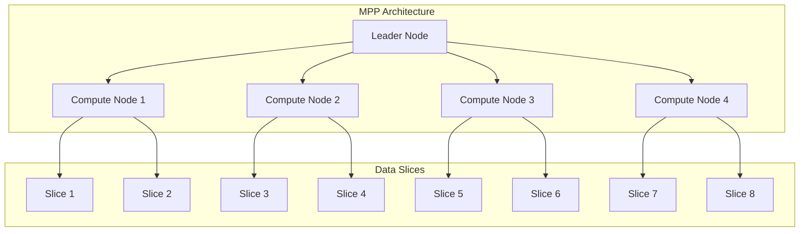
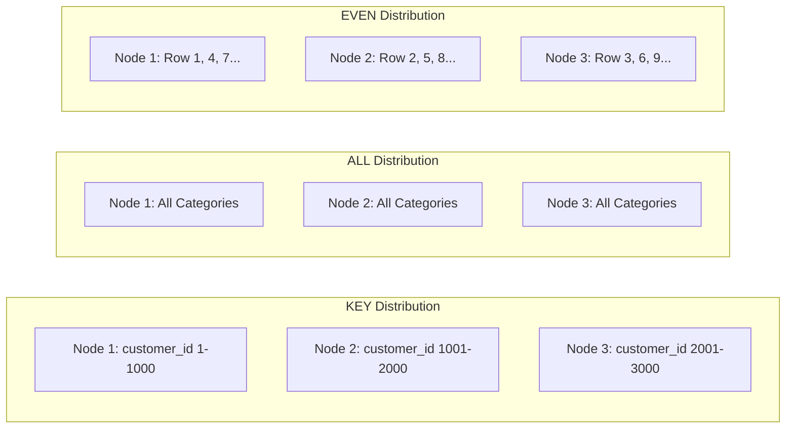
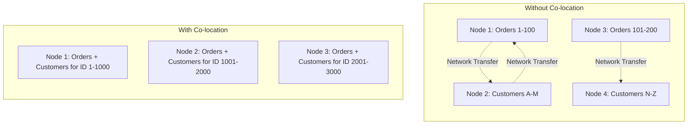
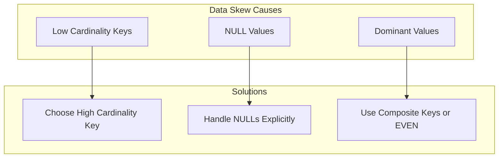
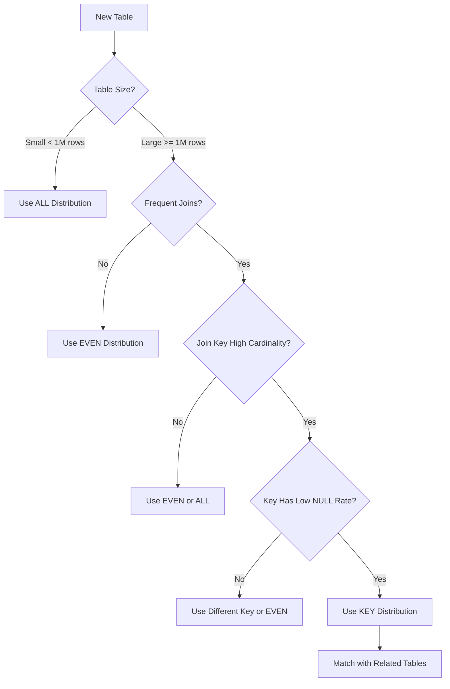

# How to Create Distribution Keys

Author: [nawazdhandala](https://github.com/nawazdhandala)

Tags: Data Warehouse, Distribution Keys, Redshift, MPP

Description: Learn to create distribution keys for optimizing data distribution across nodes in MPP databases.

---

In massively parallel processing (MPP) data warehouses like Amazon Redshift, Snowflake, and Azure Synapse, data distribution is fundamental to query performance. Distribution keys determine how your data is spread across compute nodes, directly impacting join operations, aggregations, and overall query speed. This guide will walk you through creating effective distribution keys with practical examples and best practices.

## Understanding Data Distribution in MPP Databases

MPP databases split data across multiple nodes to enable parallel processing. When you run a query, each node processes its portion of the data simultaneously. The way data is distributed across these nodes can either accelerate or slow down your queries dramatically.



## Distribution Styles

There are three main distribution styles in MPP databases. Each serves a specific purpose depending on your table size and query patterns.

### 1. KEY Distribution

Key distribution places rows with the same key value on the same node. This is ideal for large tables that are frequently joined together.

```sql
-- Create a large fact table with KEY distribution
-- The customer_id column is chosen because it will be used
-- in joins with the customers dimension table
CREATE TABLE sales_facts (
    sale_id         BIGINT IDENTITY(1,1),
    customer_id     INTEGER NOT NULL,
    product_id      INTEGER NOT NULL,
    sale_date       DATE NOT NULL,
    quantity        INTEGER NOT NULL,
    unit_price      DECIMAL(10,2) NOT NULL,
    total_amount    DECIMAL(12,2) NOT NULL
)
DISTSTYLE KEY
DISTKEY (customer_id);  -- Distribute data based on customer_id

-- Create the customers dimension table with the same distribution key
-- This ensures customer data is co-located with their sales data
CREATE TABLE customers (
    customer_id     INTEGER NOT NULL,
    customer_name   VARCHAR(100) NOT NULL,
    email           VARCHAR(255),
    region          VARCHAR(50),
    created_date    DATE NOT NULL,
    PRIMARY KEY (customer_id)
)
DISTSTYLE KEY
DISTKEY (customer_id);  -- Same key ensures co-location
```

### 2. ALL Distribution

All distribution copies the entire table to every node. This is best for small dimension tables that are joined with large fact tables.

```sql
-- Create a small lookup table with ALL distribution
-- This table has only ~200 rows, so copying to all nodes is efficient
CREATE TABLE product_categories (
    category_id     INTEGER NOT NULL,
    category_name   VARCHAR(100) NOT NULL,
    parent_category INTEGER,
    is_active       BOOLEAN DEFAULT TRUE,
    PRIMARY KEY (category_id)
)
DISTSTYLE ALL;  -- Copy entire table to every node

-- Create another small dimension table with ALL distribution
-- Region lookup tables are typically small and frequently joined
CREATE TABLE regions (
    region_id       INTEGER NOT NULL,
    region_name     VARCHAR(50) NOT NULL,
    country_code    CHAR(2) NOT NULL,
    timezone        VARCHAR(50),
    PRIMARY KEY (region_id)
)
DISTSTYLE ALL;  -- Small table, copy everywhere for fast joins
```

### 3. EVEN Distribution

Even distribution spreads rows uniformly across all nodes in a round-robin fashion. Use this when there is no clear join pattern or the table is not frequently joined.

```sql
-- Create a staging table with EVEN distribution
-- Staging tables often receive bulk loads and do not have consistent join keys
CREATE TABLE staging_events (
    event_id        BIGINT IDENTITY(1,1),
    event_type      VARCHAR(50) NOT NULL,
    event_payload   VARCHAR(MAX),
    source_system   VARCHAR(50),
    load_timestamp  TIMESTAMP DEFAULT GETDATE()
)
DISTSTYLE EVEN;  -- Round-robin distribution for uniform spread

-- Create a log table with EVEN distribution
-- Log tables are typically scanned fully rather than joined
CREATE TABLE application_logs (
    log_id          BIGINT IDENTITY(1,1),
    log_level       VARCHAR(10) NOT NULL,
    message         VARCHAR(4000),
    stack_trace     VARCHAR(MAX),
    logged_at       TIMESTAMP NOT NULL
)
DISTSTYLE EVEN;  -- No specific join pattern, spread evenly
```

## Distribution Style Comparison



## Co-location for Optimized Joins

Co-location is the key benefit of proper distribution key selection. When two tables share the same distribution key, their matching rows reside on the same node, eliminating network data transfer during joins.



Here is a practical example of co-located tables:

```sql
-- Orders fact table distributed by customer_id
CREATE TABLE orders (
    order_id        BIGINT IDENTITY(1,1),
    customer_id     INTEGER NOT NULL,
    order_date      DATE NOT NULL,
    status          VARCHAR(20) NOT NULL,
    total_amount    DECIMAL(12,2) NOT NULL
)
DISTSTYLE KEY
DISTKEY (customer_id);

-- Order items fact table also distributed by customer_id
-- This enables three-way co-located joins
CREATE TABLE order_items (
    item_id         BIGINT IDENTITY(1,1),
    order_id        BIGINT NOT NULL,
    customer_id     INTEGER NOT NULL,  -- Denormalized for distribution
    product_id      INTEGER NOT NULL,
    quantity        INTEGER NOT NULL,
    unit_price      DECIMAL(10,2) NOT NULL
)
DISTSTYLE KEY
DISTKEY (customer_id);  -- Same key as orders and customers

-- Customers dimension table with matching distribution
CREATE TABLE customers (
    customer_id     INTEGER NOT NULL,
    customer_name   VARCHAR(100) NOT NULL,
    email           VARCHAR(255),
    region_id       INTEGER,
    PRIMARY KEY (customer_id)
)
DISTSTYLE KEY
DISTKEY (customer_id);

-- This join executes entirely within each node
-- No data movement required between nodes
SELECT
    c.customer_name,
    COUNT(o.order_id) AS order_count,
    SUM(oi.quantity * oi.unit_price) AS total_spent
FROM customers c
INNER JOIN orders o ON c.customer_id = o.customer_id
INNER JOIN order_items oi ON o.order_id = oi.order_id
    AND c.customer_id = oi.customer_id  -- Include dist key in join
WHERE o.order_date >= '2025-01-01'
GROUP BY c.customer_name
ORDER BY total_spent DESC;
```

## Preventing Data Skew

Data skew occurs when data is unevenly distributed across nodes, causing some nodes to process significantly more data than others. This creates bottlenecks and degrades performance.

### Identifying Skew

```sql
-- Check for data skew in your table
-- A well-distributed table should have similar row counts per slice
SELECT
    slice,
    COUNT(*) AS row_count,
    ROUND(100.0 * COUNT(*) / SUM(COUNT(*)) OVER(), 2) AS percentage
FROM stv_blocklist b
INNER JOIN stv_tbl_perm p ON b.tbl = p.id
WHERE p.name = 'orders'
GROUP BY slice
ORDER BY row_count DESC;

-- Calculate skew ratio
-- Values close to 1.0 indicate good distribution
SELECT
    MAX(row_count) AS max_rows,
    MIN(row_count) AS min_rows,
    ROUND(MAX(row_count)::DECIMAL / NULLIF(MIN(row_count), 0), 2) AS skew_ratio
FROM (
    SELECT slice, COUNT(*) AS row_count
    FROM stv_blocklist b
    INNER JOIN stv_tbl_perm p ON b.tbl = p.id
    WHERE p.name = 'orders'
    GROUP BY slice
) slice_counts;
```

### Common Causes and Solutions



Here are SQL examples for preventing skew:

```sql
-- BAD: Using a low-cardinality column as distribution key
-- Only 5 status values means only 5 nodes will have data
CREATE TABLE orders_bad (
    order_id        BIGINT,
    status          VARCHAR(20)  -- Only: pending, processing, shipped, delivered, cancelled
)
DISTSTYLE KEY
DISTKEY (status);  -- Causes severe skew

-- GOOD: Using high-cardinality column as distribution key
-- Millions of unique customer IDs spread data evenly
CREATE TABLE orders_good (
    order_id        BIGINT,
    customer_id     INTEGER,
    status          VARCHAR(20)
)
DISTSTYLE KEY
DISTKEY (customer_id);  -- High cardinality, even distribution

-- Handle NULL values to prevent skew
-- NULLs in distribution key all go to the same node
CREATE TABLE events (
    event_id        BIGINT IDENTITY(1,1),
    user_id         INTEGER,
    session_id      VARCHAR(50) NOT NULL  -- Never NULL, use as dist key
)
DISTSTYLE KEY
DISTKEY (session_id);  -- Avoid user_id which may have NULLs

-- Alternative: Use a surrogate key when natural keys cause skew
CREATE TABLE transactions (
    transaction_id  BIGINT IDENTITY(1,1),
    merchant_id     INTEGER NOT NULL,  -- Large merchant has 80% of transactions
    amount          DECIMAL(12,2)
)
DISTSTYLE KEY
DISTKEY (transaction_id);  -- Even distribution using surrogate key
```

## Best Practices for Choosing Distribution Keys

### Decision Framework



### Complete Example Schema

```sql
-- Dimension: Small table, copy to all nodes
CREATE TABLE dim_date (
    date_key        INTEGER NOT NULL,
    full_date       DATE NOT NULL,
    day_of_week     SMALLINT,
    month           SMALLINT,
    quarter         SMALLINT,
    year            SMALLINT,
    is_weekend      BOOLEAN,
    is_holiday      BOOLEAN,
    PRIMARY KEY (date_key)
)
DISTSTYLE ALL
SORTKEY (full_date);  -- Sort by date for range queries

-- Dimension: Small table, copy to all nodes
CREATE TABLE dim_product (
    product_key     INTEGER NOT NULL,
    product_id      VARCHAR(20) NOT NULL,
    product_name    VARCHAR(200) NOT NULL,
    category        VARCHAR(100),
    subcategory     VARCHAR(100),
    brand           VARCHAR(100),
    unit_cost       DECIMAL(10,2),
    PRIMARY KEY (product_key)
)
DISTSTYLE ALL
SORTKEY (category, subcategory);

-- Dimension: Medium to large table, distribute by key
CREATE TABLE dim_customer (
    customer_key    INTEGER NOT NULL,
    customer_id     VARCHAR(20) NOT NULL,
    customer_name   VARCHAR(200) NOT NULL,
    email           VARCHAR(255),
    segment         VARCHAR(50),
    region          VARCHAR(50),
    created_date    DATE,
    PRIMARY KEY (customer_key)
)
DISTSTYLE KEY
DISTKEY (customer_key)
SORTKEY (segment, region);

-- Fact: Large table, distribute by customer for join optimization
CREATE TABLE fact_sales (
    sale_key        BIGINT IDENTITY(1,1),
    date_key        INTEGER NOT NULL,
    customer_key    INTEGER NOT NULL,
    product_key     INTEGER NOT NULL,
    quantity        INTEGER NOT NULL,
    unit_price      DECIMAL(10,2) NOT NULL,
    discount        DECIMAL(5,2) DEFAULT 0,
    total_amount    DECIMAL(12,2) NOT NULL,
    PRIMARY KEY (sale_key)
)
DISTSTYLE KEY
DISTKEY (customer_key)  -- Co-locate with dim_customer
SORTKEY (date_key);     -- Sort by date for time-range queries

-- Optimized query using co-located joins
-- dim_date and dim_product use ALL distribution (local on every node)
-- fact_sales and dim_customer are co-located by customer_key
SELECT
    d.full_date,
    c.segment,
    p.category,
    SUM(f.quantity) AS total_units,
    SUM(f.total_amount) AS total_revenue
FROM fact_sales f
INNER JOIN dim_date d ON f.date_key = d.date_key          -- Local join (ALL)
INNER JOIN dim_customer c ON f.customer_key = c.customer_key  -- Co-located join
INNER JOIN dim_product p ON f.product_key = p.product_key  -- Local join (ALL)
WHERE d.year = 2025
    AND d.quarter = 4
GROUP BY d.full_date, c.segment, p.category
ORDER BY d.full_date, total_revenue DESC;
```

## Monitoring Distribution Effectiveness

```sql
-- View table distribution style and skew
SELECT
    "table" AS table_name,
    diststyle,
    skew_rows,
    skew_sortkey1
FROM svv_table_info
WHERE "table" IN ('fact_sales', 'dim_customer', 'dim_product')
ORDER BY table_name;

-- Analyze query execution for data movement
-- Look for DS_BCAST_INNER or DS_DIST_BOTH which indicate data redistribution
EXPLAIN
SELECT c.customer_name, SUM(f.total_amount)
FROM fact_sales f
JOIN dim_customer c ON f.customer_key = c.customer_key
GROUP BY c.customer_name;

-- Check actual data distribution per node
SELECT
    owner AS table_owner,
    name AS table_name,
    slice,
    rows
FROM stv_tbl_perm
WHERE name = 'fact_sales'
ORDER BY slice;
```

## Summary

Effective distribution key selection is critical for MPP data warehouse performance. Remember these key principles:

1. Use KEY distribution for large tables that are frequently joined, ensuring related tables share the same distribution key for co-location
2. Use ALL distribution for small dimension tables (under 1 million rows) that are joined with many fact tables
3. Use EVEN distribution for staging tables or when there is no clear join pattern
4. Choose high-cardinality columns as distribution keys to prevent data skew
5. Avoid using columns with many NULL values as distribution keys
6. Monitor your data distribution regularly and adjust as data patterns change

By following these guidelines and using the examples provided, you can optimize your data warehouse queries and achieve significant performance improvements in your analytical workloads.

**Related Reading:**

- [Amazon Redshift Distribution Styles](https://docs.aws.amazon.com/redshift/latest/dg/c_choosing_dist_sort.html)
- [Data Warehouse Performance Tuning Best Practices](https://docs.aws.amazon.com/redshift/latest/dg/c_designing-tables-best-practices.html)
