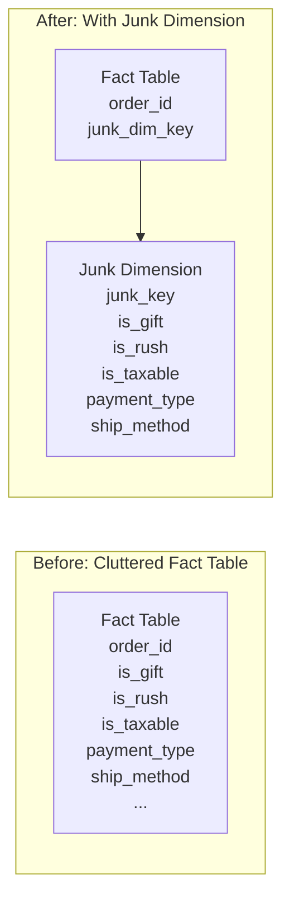
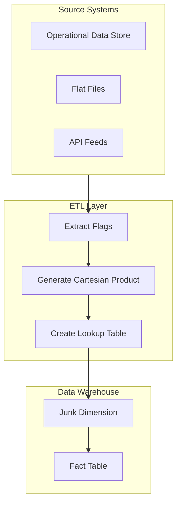
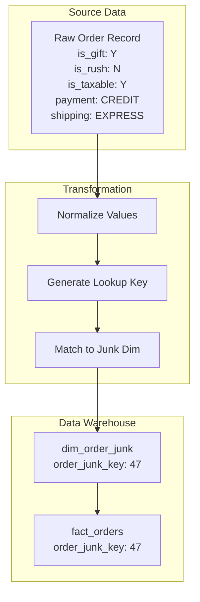

# How to Build Junk Dimensions

Author: [nawazdhandala](https://github.com/nawazdhandala)

Tags: Data Warehouse, Junk Dimensions, Dimensional Modeling, ETL

Description: Learn to build junk dimensions for consolidating low-cardinality flags and indicators.

---

> Junk dimensions solve a common data warehousing problem: what do you do with all those scattered boolean flags, status codes, and indicators cluttering your fact tables? Instead of creating dozens of small dimensions or polluting facts with degenerate attributes, consolidate them into a single, manageable dimension.

Low-cardinality attributes deserve a home. Junk dimensions provide that home while keeping your star schema clean.

---

## What Is a Junk Dimension?

A junk dimension is a dimension table that combines multiple low-cardinality flags, indicators, and codes that would otherwise clutter your fact table or require separate small dimension tables.



---

## When to Use Junk Dimensions

Junk dimensions are ideal for:

- **Boolean flags**: is_active, is_deleted, is_verified
- **Status indicators**: Y/N, True/False, 1/0
- **Low-cardinality codes**: payment_type (3-5 values), shipping_method (4-6 values)
- **Attributes with few distinct values**: priority (Low/Medium/High)

Avoid including in junk dimensions:

- High-cardinality attributes (more than 50 distinct values)
- Attributes that change frequently
- Attributes with business meaning that warrants their own dimension

---

## Architecture Overview



---

## Building the Junk Dimension

### Step 1: Identify Candidate Attributes

First, analyze your source data to find low-cardinality attributes suitable for consolidation:

```sql
-- Analyze distinct values for potential junk dimension attributes
-- Run this against your staging or source tables to identify candidates

SELECT
    'is_gift' AS attribute_name,
    COUNT(DISTINCT is_gift) AS distinct_values
FROM staging.orders

UNION ALL

SELECT
    'is_rush_order' AS attribute_name,
    COUNT(DISTINCT is_rush_order) AS distinct_values
FROM staging.orders

UNION ALL

SELECT
    'is_taxable' AS attribute_name,
    COUNT(DISTINCT is_taxable) AS distinct_values
FROM staging.orders

UNION ALL

SELECT
    'payment_type' AS attribute_name,
    COUNT(DISTINCT payment_type) AS distinct_values
FROM staging.orders

UNION ALL

SELECT
    'shipping_method' AS attribute_name,
    COUNT(DISTINCT shipping_method) AS distinct_values
FROM staging.orders

ORDER BY distinct_values;

-- Results might look like:
-- attribute_name    | distinct_values
-- ------------------|----------------
-- is_gift           | 2
-- is_rush_order     | 2
-- is_taxable        | 2
-- payment_type      | 4
-- shipping_method   | 5
```

### Step 2: Create the Junk Dimension Table

Define the structure for your junk dimension with appropriate constraints:

```sql
-- Create the junk dimension table
-- Using a surrogate key with natural key columns for each attribute

CREATE TABLE dim_order_junk (
    -- Surrogate key for the junk dimension
    order_junk_key INT PRIMARY KEY,

    -- Boolean flags stored as single characters for clarity
    is_gift_flag CHAR(1) NOT NULL,
    is_rush_flag CHAR(1) NOT NULL,
    is_taxable_flag CHAR(1) NOT NULL,

    -- Low-cardinality categorical attributes
    payment_type_code VARCHAR(20) NOT NULL,
    shipping_method_code VARCHAR(20) NOT NULL,

    -- Descriptive labels for reporting and BI tools
    is_gift_desc VARCHAR(50) NOT NULL,
    is_rush_desc VARCHAR(50) NOT NULL,
    is_taxable_desc VARCHAR(50) NOT NULL,
    payment_type_desc VARCHAR(100) NOT NULL,
    shipping_method_desc VARCHAR(100) NOT NULL,

    -- Audit columns for tracking ETL loads
    created_date DATETIME DEFAULT CURRENT_TIMESTAMP,
    modified_date DATETIME DEFAULT CURRENT_TIMESTAMP,

    -- Unique constraint prevents duplicate combinations
    CONSTRAINT uq_order_junk_combination UNIQUE (
        is_gift_flag,
        is_rush_flag,
        is_taxable_flag,
        payment_type_code,
        shipping_method_code
    )
);

-- Add check constraints to enforce valid values
ALTER TABLE dim_order_junk
ADD CONSTRAINT chk_is_gift CHECK (is_gift_flag IN ('Y', 'N'));

ALTER TABLE dim_order_junk
ADD CONSTRAINT chk_is_rush CHECK (is_rush_flag IN ('Y', 'N'));

ALTER TABLE dim_order_junk
ADD CONSTRAINT chk_is_taxable CHECK (is_taxable_flag IN ('Y', 'N'));
```

### Step 3: Generate Cartesian Product

The most common approach is to pre-populate all possible combinations using a Cartesian product:

```sql
-- Generate all possible combinations using CROSS JOIN
-- This approach pre-populates the dimension with every valid combination

-- First, create helper tables with valid values for each attribute
-- These can be temporary tables or CTEs

CREATE TEMPORARY TABLE gift_values (
    flag_value CHAR(1),
    flag_desc VARCHAR(50)
);

INSERT INTO gift_values VALUES
    ('Y', 'Gift Order'),
    ('N', 'Non-Gift Order');

CREATE TEMPORARY TABLE rush_values (
    flag_value CHAR(1),
    flag_desc VARCHAR(50)
);

INSERT INTO rush_values VALUES
    ('Y', 'Rush Delivery'),
    ('N', 'Standard Delivery');

CREATE TEMPORARY TABLE taxable_values (
    flag_value CHAR(1),
    flag_desc VARCHAR(50)
);

INSERT INTO taxable_values VALUES
    ('Y', 'Taxable'),
    ('N', 'Tax Exempt');

CREATE TEMPORARY TABLE payment_values (
    type_code VARCHAR(20),
    type_desc VARCHAR(100)
);

INSERT INTO payment_values VALUES
    ('CREDIT', 'Credit Card'),
    ('DEBIT', 'Debit Card'),
    ('ACH', 'Bank Transfer'),
    ('PAYPAL', 'PayPal');

CREATE TEMPORARY TABLE shipping_values (
    method_code VARCHAR(20),
    method_desc VARCHAR(100)
);

INSERT INTO shipping_values VALUES
    ('STANDARD', 'Standard Shipping (5-7 days)'),
    ('EXPRESS', 'Express Shipping (2-3 days)'),
    ('OVERNIGHT', 'Overnight Shipping'),
    ('PICKUP', 'Store Pickup'),
    ('FREIGHT', 'Freight Shipping');

-- Generate the Cartesian product of all combinations
-- Total rows = 2 x 2 x 2 x 4 x 5 = 160 combinations

INSERT INTO dim_order_junk (
    order_junk_key,
    is_gift_flag,
    is_rush_flag,
    is_taxable_flag,
    payment_type_code,
    shipping_method_code,
    is_gift_desc,
    is_rush_desc,
    is_taxable_desc,
    payment_type_desc,
    shipping_method_desc
)
SELECT
    -- Generate surrogate key using ROW_NUMBER
    ROW_NUMBER() OVER (ORDER BY g.flag_value, r.flag_value, t.flag_value,
                       p.type_code, s.method_code) AS order_junk_key,
    g.flag_value AS is_gift_flag,
    r.flag_value AS is_rush_flag,
    t.flag_value AS is_taxable_flag,
    p.type_code AS payment_type_code,
    s.method_code AS shipping_method_code,
    g.flag_desc AS is_gift_desc,
    r.flag_desc AS is_rush_desc,
    t.flag_desc AS is_taxable_desc,
    p.type_desc AS payment_type_desc,
    s.method_desc AS shipping_method_desc
FROM gift_values g
CROSS JOIN rush_values r
CROSS JOIN taxable_values t
CROSS JOIN payment_values p
CROSS JOIN shipping_values s;
```

---

## Alternative: Build on Demand

Instead of pre-generating all combinations, you can build the junk dimension incrementally as new combinations appear:

```sql
-- Procedure to get or create junk dimension key
-- This approach only creates combinations that actually exist in the data

CREATE PROCEDURE usp_get_order_junk_key
    @is_gift CHAR(1),
    @is_rush CHAR(1),
    @is_taxable CHAR(1),
    @payment_type VARCHAR(20),
    @shipping_method VARCHAR(20),
    @junk_key INT OUTPUT
AS
BEGIN
    SET NOCOUNT ON;

    -- Try to find existing combination
    SELECT @junk_key = order_junk_key
    FROM dim_order_junk
    WHERE is_gift_flag = @is_gift
      AND is_rush_flag = @is_rush
      AND is_taxable_flag = @is_taxable
      AND payment_type_code = @payment_type
      AND shipping_method_code = @shipping_method;

    -- If not found, create new entry
    IF @junk_key IS NULL
    BEGIN
        -- Get the next available key
        SELECT @junk_key = ISNULL(MAX(order_junk_key), 0) + 1
        FROM dim_order_junk;

        -- Insert new combination with descriptive labels
        INSERT INTO dim_order_junk (
            order_junk_key,
            is_gift_flag,
            is_rush_flag,
            is_taxable_flag,
            payment_type_code,
            shipping_method_code,
            is_gift_desc,
            is_rush_desc,
            is_taxable_desc,
            payment_type_desc,
            shipping_method_desc
        )
        VALUES (
            @junk_key,
            @is_gift,
            @is_rush,
            @is_taxable,
            @payment_type,
            @shipping_method,
            CASE @is_gift WHEN 'Y' THEN 'Gift Order' ELSE 'Non-Gift Order' END,
            CASE @is_rush WHEN 'Y' THEN 'Rush Delivery' ELSE 'Standard Delivery' END,
            CASE @is_taxable WHEN 'Y' THEN 'Taxable' ELSE 'Tax Exempt' END,
            @payment_type,
            @shipping_method
        );
    END
END;
```

---

## ETL Integration Pattern

### Lookup During Fact Table Load

Integrate junk dimension lookups into your ETL process:

```sql
-- ETL procedure to load fact table with junk dimension lookup
-- This pattern ensures every fact row has a valid junk dimension key

CREATE PROCEDURE usp_load_fact_orders
AS
BEGIN
    SET NOCOUNT ON;

    -- Insert facts with junk dimension lookup
    -- Uses LEFT JOIN to handle missing combinations gracefully

    INSERT INTO fact_orders (
        order_key,
        customer_key,
        product_key,
        date_key,
        order_junk_key,        -- Foreign key to junk dimension
        order_amount,
        quantity,
        discount_amount
    )
    SELECT
        s.order_id AS order_key,
        dc.customer_key,
        dp.product_key,
        dd.date_key,
        -- Lookup junk dimension key based on attribute combination
        COALESCE(dj.order_junk_key, -1) AS order_junk_key,
        s.order_amount,
        s.quantity,
        s.discount_amount
    FROM staging.orders s
    -- Join to standard dimensions
    INNER JOIN dim_customer dc
        ON s.customer_id = dc.customer_id
    INNER JOIN dim_product dp
        ON s.product_id = dp.product_id
    INNER JOIN dim_date dd
        ON CAST(s.order_date AS DATE) = dd.full_date
    -- Join to junk dimension using all attribute columns
    LEFT JOIN dim_order_junk dj
        ON s.is_gift = dj.is_gift_flag
        AND s.is_rush = dj.is_rush_flag
        AND s.is_taxable = dj.is_taxable_flag
        AND s.payment_type = dj.payment_type_code
        AND s.shipping_method = dj.shipping_method_code
    WHERE s.load_date > @last_load_date;

    -- Log any unmatched combinations for investigation
    INSERT INTO etl_audit.unmatched_junk_combinations
    SELECT DISTINCT
        s.is_gift,
        s.is_rush,
        s.is_taxable,
        s.payment_type,
        s.shipping_method,
        GETDATE() AS detected_date
    FROM staging.orders s
    LEFT JOIN dim_order_junk dj
        ON s.is_gift = dj.is_gift_flag
        AND s.is_rush = dj.is_rush_flag
        AND s.is_taxable = dj.is_taxable_flag
        AND s.payment_type = dj.payment_type_code
        AND s.shipping_method = dj.shipping_method_code
    WHERE dj.order_junk_key IS NULL;

END;
```

---

## Handling Unknown Values

Always include a default row for handling NULL or unknown values:

```sql
-- Insert default/unknown row with key = -1
-- This row catches any facts with missing or invalid attribute values

INSERT INTO dim_order_junk (
    order_junk_key,
    is_gift_flag,
    is_rush_flag,
    is_taxable_flag,
    payment_type_code,
    shipping_method_code,
    is_gift_desc,
    is_rush_desc,
    is_taxable_desc,
    payment_type_desc,
    shipping_method_desc
)
VALUES (
    -1,                              -- Reserved key for unknown
    'U',                             -- Unknown flag value
    'U',
    'U',
    'UNKNOWN',
    'UNKNOWN',
    'Unknown',
    'Unknown',
    'Unknown',
    'Unknown Payment Type',
    'Unknown Shipping Method'
);

-- Query to handle NULLs in source data during lookup
SELECT
    COALESCE(dj.order_junk_key, -1) AS order_junk_key
FROM staging.orders s
LEFT JOIN dim_order_junk dj
    ON COALESCE(s.is_gift, 'U') = dj.is_gift_flag
    AND COALESCE(s.is_rush, 'U') = dj.is_rush_flag
    AND COALESCE(s.is_taxable, 'U') = dj.is_taxable_flag
    AND COALESCE(s.payment_type, 'UNKNOWN') = dj.payment_type_code
    AND COALESCE(s.shipping_method, 'UNKNOWN') = dj.shipping_method_code;
```

---

## Data Flow Diagram



---

## Performance Optimization

### Indexing Strategy

Create appropriate indexes for efficient lookups:

```sql
-- Create composite index for lookup queries
-- This index covers all columns used in the WHERE clause during ETL

CREATE INDEX ix_order_junk_lookup
ON dim_order_junk (
    is_gift_flag,
    is_rush_flag,
    is_taxable_flag,
    payment_type_code,
    shipping_method_code
)
INCLUDE (order_junk_key);

-- Alternative: Create hash index for exact match lookups (PostgreSQL)
-- Hash indexes are faster for equality comparisons

CREATE INDEX ix_order_junk_hash
ON dim_order_junk USING hash (
    (is_gift_flag || is_rush_flag || is_taxable_flag ||
     payment_type_code || shipping_method_code)
);
```

### Using Hash Keys for Faster Lookups

Generate a hash key to simplify and speed up lookups:

```sql
-- Add a hash column for faster lookups
ALTER TABLE dim_order_junk
ADD junk_hash_key AS (
    HASHBYTES('SHA2_256',
        CONCAT(is_gift_flag, '|',
               is_rush_flag, '|',
               is_taxable_flag, '|',
               payment_type_code, '|',
               shipping_method_code))
) PERSISTED;

-- Create index on the hash key
CREATE INDEX ix_order_junk_hash
ON dim_order_junk (junk_hash_key);

-- Lookup using hash key in ETL
SELECT order_junk_key
FROM dim_order_junk
WHERE junk_hash_key = HASHBYTES('SHA2_256',
    CONCAT(@is_gift, '|',
           @is_rush, '|',
           @is_taxable, '|',
           @payment_type, '|',
           @shipping_method));
```

---

## Querying with Junk Dimensions

### Basic Query Pattern

Join the junk dimension to your fact table for analysis:

```sql
-- Query orders with junk dimension attributes expanded
-- The junk dimension provides descriptive labels for reporting

SELECT
    dd.calendar_year,
    dd.calendar_month_name,
    dj.payment_type_desc,
    dj.shipping_method_desc,
    dj.is_gift_desc,
    COUNT(*) AS order_count,
    SUM(f.order_amount) AS total_revenue,
    AVG(f.order_amount) AS avg_order_value
FROM fact_orders f
INNER JOIN dim_date dd
    ON f.date_key = dd.date_key
INNER JOIN dim_order_junk dj
    ON f.order_junk_key = dj.order_junk_key
WHERE dd.calendar_year = 2026
GROUP BY
    dd.calendar_year,
    dd.calendar_month_name,
    dj.payment_type_desc,
    dj.shipping_method_desc,
    dj.is_gift_desc
ORDER BY
    dd.calendar_year,
    dd.calendar_month_name,
    total_revenue DESC;
```

### Filtering on Junk Attributes

Filter fact data using junk dimension attributes:

```sql
-- Find all rush gift orders paid by credit card
-- Junk dimension enables efficient filtering on multiple flags

SELECT
    f.order_key,
    dc.customer_name,
    dp.product_name,
    f.order_amount
FROM fact_orders f
INNER JOIN dim_customer dc
    ON f.customer_key = dc.customer_key
INNER JOIN dim_product dp
    ON f.product_key = dp.product_key
INNER JOIN dim_order_junk dj
    ON f.order_junk_key = dj.order_junk_key
WHERE dj.is_gift_flag = 'Y'
  AND dj.is_rush_flag = 'Y'
  AND dj.payment_type_code = 'CREDIT';
```

---

## Maintenance Procedures

### Adding New Attribute Values

When new values appear in source systems:

```sql
-- Procedure to add new combinations when source system adds new values
-- Example: Adding a new payment type 'CRYPTO'

CREATE PROCEDURE usp_add_junk_dimension_values
    @attribute_name VARCHAR(50),
    @new_code VARCHAR(20),
    @new_description VARCHAR(100)
AS
BEGIN
    SET NOCOUNT ON;

    DECLARE @max_key INT;
    SELECT @max_key = MAX(order_junk_key) FROM dim_order_junk;

    -- For a new payment type, generate combinations with all existing values
    IF @attribute_name = 'payment_type'
    BEGIN
        INSERT INTO dim_order_junk (
            order_junk_key,
            is_gift_flag,
            is_rush_flag,
            is_taxable_flag,
            payment_type_code,
            shipping_method_code,
            is_gift_desc,
            is_rush_desc,
            is_taxable_desc,
            payment_type_desc,
            shipping_method_desc
        )
        SELECT
            @max_key + ROW_NUMBER() OVER (ORDER BY is_gift_flag, is_rush_flag,
                                          is_taxable_flag, shipping_method_code),
            is_gift_flag,
            is_rush_flag,
            is_taxable_flag,
            @new_code,
            shipping_method_code,
            is_gift_desc,
            is_rush_desc,
            is_taxable_desc,
            @new_description,
            shipping_method_desc
        FROM dim_order_junk
        WHERE payment_type_code = (
            SELECT TOP 1 payment_type_code
            FROM dim_order_junk
            WHERE order_junk_key > 0
        )
        GROUP BY
            is_gift_flag, is_rush_flag, is_taxable_flag,
            shipping_method_code, is_gift_desc, is_rush_desc,
            is_taxable_desc, shipping_method_desc;
    END
END;
```

### Validating Junk Dimension Integrity

Run periodic checks to ensure data quality:

```sql
-- Validation query to check junk dimension integrity
-- Run this as part of your data quality monitoring

-- Check for duplicate combinations
SELECT
    is_gift_flag,
    is_rush_flag,
    is_taxable_flag,
    payment_type_code,
    shipping_method_code,
    COUNT(*) AS duplicate_count
FROM dim_order_junk
GROUP BY
    is_gift_flag,
    is_rush_flag,
    is_taxable_flag,
    payment_type_code,
    shipping_method_code
HAVING COUNT(*) > 1;

-- Check for orphaned fact records
SELECT COUNT(*) AS orphaned_facts
FROM fact_orders f
LEFT JOIN dim_order_junk dj
    ON f.order_junk_key = dj.order_junk_key
WHERE dj.order_junk_key IS NULL
  AND f.order_junk_key != -1;

-- Check for unused junk dimension combinations
SELECT
    dj.order_junk_key,
    dj.is_gift_flag,
    dj.is_rush_flag,
    dj.payment_type_code
FROM dim_order_junk dj
LEFT JOIN fact_orders f
    ON dj.order_junk_key = f.order_junk_key
WHERE f.order_junk_key IS NULL
  AND dj.order_junk_key > 0;
```

---

## Best Practices

1. **Keep cardinality manageable** - Limit junk dimensions to attributes with fewer than 10-15 distinct values each
2. **Pre-generate combinations** - For small cardinality, generate all combinations upfront for predictable ETL performance
3. **Include an unknown row** - Always have a default row (key = -1) for handling NULL or unexpected values
4. **Document attribute meanings** - Include descriptive columns that explain codes and flags
5. **Monitor for new values** - Set up alerts when source data contains combinations not in the junk dimension
6. **Index for lookup patterns** - Create composite indexes matching your ETL lookup queries
7. **Avoid frequent changes** - Junk dimensions should be relatively stable; changing attributes may require reprocessing facts

---

## Conclusion

Junk dimensions are a practical solution for consolidating low-cardinality attributes in your data warehouse. By combining boolean flags, status codes, and indicators into a single dimension, you can:

- **Reduce fact table width** - Replace multiple columns with a single foreign key
- **Improve query performance** - Enable efficient filtering on multiple attributes
- **Simplify ETL logic** - Centralize attribute handling in one lookup
- **Maintain clean star schemas** - Avoid polluting facts with degenerate dimensions

Start by identifying candidate attributes in your source systems, generate the Cartesian product of all valid combinations, and integrate the lookup into your ETL pipeline.

---

*Building a data warehouse? Dimensional modeling patterns like junk dimensions help create efficient, maintainable analytics systems. Start with clean designs and your future self will thank you.*
