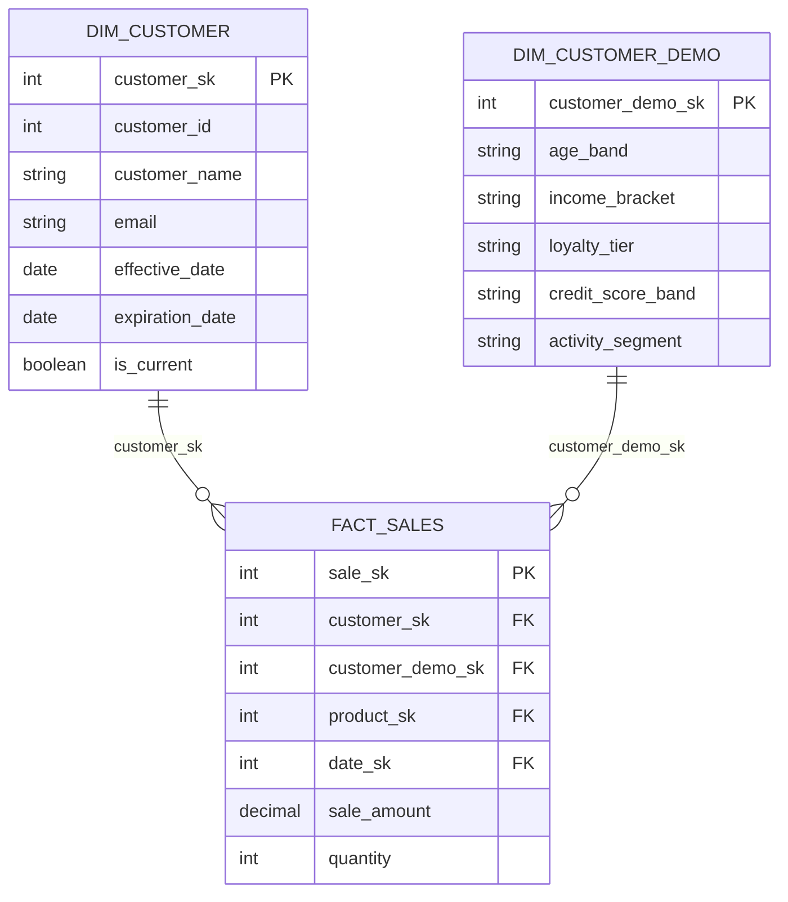
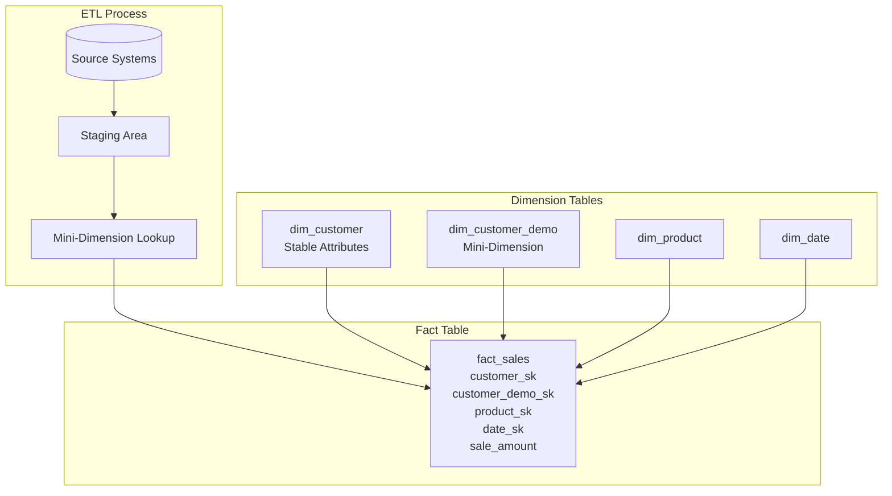
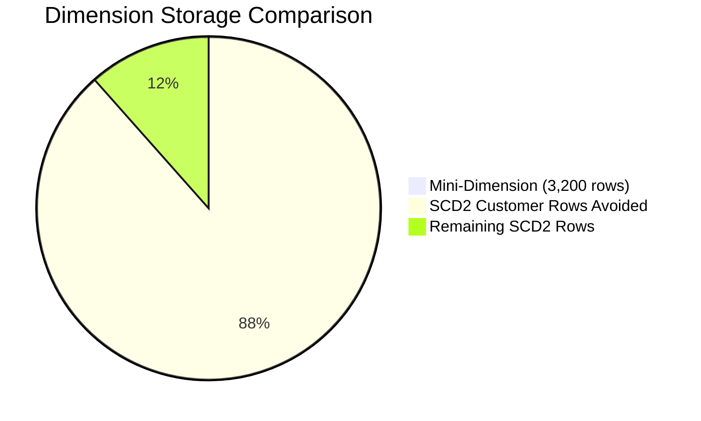

# How to Build Mini-Dimensions

Author: [nawazdhandala](https://github.com/nawazdhandala)

Tags: Data Warehouse, Mini-Dimensions, Dimensional Modeling, Performance

Description: Learn to build mini-dimensions for extracting rapidly changing attributes from large dimensions.

---

> When a dimension table grows to hundreds of millions of rows because of slowly changing attributes, it is time to extract the volatile columns into a separate mini-dimension.

Mini-dimensions are a classic dimensional modeling technique for handling rapidly changing attributes (RCAs) without bloating your primary dimension tables. This guide walks through the problem, the design pattern, SQL implementation, and the performance benefits you can expect in production data warehouses.

---

## Table of Contents

1. The Problem with Rapidly Changing Attributes
2. What is a Mini-Dimension?
3. When to Use Mini-Dimensions
4. Architecture Overview
5. Designing the Mini-Dimension
6. Implementing Mini-Dimensions in SQL
7. Integrating with Fact Tables
8. Handling Updates and Lookups
9. Performance Benefits
10. Common Pitfalls
11. Summary

---

## 1. The Problem with Rapidly Changing Attributes

Consider a typical `dim_customer` table in an e-commerce data warehouse. Alongside stable attributes like `customer_name` and `email`, you often track behavioral attributes that change frequently:

- `age_band` (18-24, 25-34, etc.)
- `income_bracket` (Low, Medium, High)
- `loyalty_tier` (Bronze, Silver, Gold, Platinum)
- `credit_score_band` (Poor, Fair, Good, Excellent)
- `activity_segment` (Active, Dormant, Churned)

If you use Type 2 Slowly Changing Dimensions (SCD2) to track history on all these attributes, every change creates a new row. With millions of customers and frequent updates to behavioral segments, your dimension table can explode in size.

| Scenario | Customers | Attributes Tracked (SCD2) | Changes per Year | Rows After 3 Years |
|----------|-----------|---------------------------|------------------|-------------------|
| Without mini-dimension | 10M | 8 RCAs | 4 per customer | 130M+ |
| With mini-dimension | 10M | 2 stable attrs (SCD2) | 0.5 per customer | 15M |

The mini-dimension absorbs the volatility, keeping your primary dimension lean.

---

## 2. What is a Mini-Dimension?

A mini-dimension is a small, separate dimension table that contains rapidly changing attributes extracted from a larger dimension. It has its own surrogate key and is joined to fact tables independently.

Key characteristics:

- Contains only the volatile attributes (banded or categorized values)
- Has a surrogate key separate from the parent dimension
- Typically has a fixed, finite number of rows (the Cartesian product of all attribute values)
- Does not track history per customer; instead, the fact table captures which mini-dimension row was active at transaction time



---

## 3. When to Use Mini-Dimensions

Use mini-dimensions when:

| Condition | Why It Helps |
|-----------|--------------|
| Attributes change frequently (weekly/monthly) | Prevents dimension row explosion from SCD2 |
| Attributes can be banded into discrete categories | Limits mini-dimension to manageable row count |
| Analysis requires filtering or grouping by these attributes | Enables efficient star joins |
| The parent dimension is already large (millions of rows) | Reduces storage and improves query performance |

Avoid mini-dimensions when:

- Attributes rarely change (use SCD2 in the main dimension)
- You need to track individual customer history for these attributes (consider a bridge table or factless fact)
- The number of distinct combinations would be extremely large (thousands of rows defeats the purpose)

---

## 4. Architecture Overview

The following diagram shows how mini-dimensions fit into a star schema:



During ETL:
1. Extract customer behavioral attributes from source systems
2. Look up (or insert) the matching mini-dimension row
3. Store both `customer_sk` and `customer_demo_sk` in the fact table

---

## 5. Designing the Mini-Dimension

### Step 1: Identify Rapidly Changing Attributes

Review your dimension and flag attributes that:
- Change more than once per year per entity
- Can be categorized into bands or segments
- Are commonly used in WHERE clauses or GROUP BY

### Step 2: Define Bands and Categories

Convert continuous values into discrete bands:

```sql
-- Example banding logic for age
CASE
    WHEN age BETWEEN 0 AND 17 THEN 'Under 18'
    WHEN age BETWEEN 18 AND 24 THEN '18-24'
    WHEN age BETWEEN 25 AND 34 THEN '25-34'
    WHEN age BETWEEN 35 AND 44 THEN '35-44'
    WHEN age BETWEEN 45 AND 54 THEN '45-54'
    WHEN age BETWEEN 55 AND 64 THEN '55-64'
    WHEN age >= 65 THEN '65+'
    ELSE 'Unknown'
END AS age_band
```

### Step 3: Calculate the Cartesian Product

Estimate the total rows in your mini-dimension:

| Attribute | Distinct Values |
|-----------|-----------------|
| age_band | 8 |
| income_bracket | 5 |
| loyalty_tier | 4 |
| credit_score_band | 5 |
| activity_segment | 4 |

Total combinations: 8 x 5 x 4 x 5 x 4 = 3,200 rows

This is small enough to fit entirely in memory during query execution.

---

## 6. Implementing Mini-Dimensions in SQL

### Create the Mini-Dimension Table

```sql
-- Create the mini-dimension table for customer demographics
-- This table stores all possible combinations of rapidly changing attributes

CREATE TABLE dim_customer_demo (
    -- Surrogate key for the mini-dimension
    customer_demo_sk INT IDENTITY(1,1) PRIMARY KEY,

    -- Rapidly changing attributes (banded values)
    age_band VARCHAR(20) NOT NULL,
    income_bracket VARCHAR(20) NOT NULL,
    loyalty_tier VARCHAR(20) NOT NULL,
    credit_score_band VARCHAR(20) NOT NULL,
    activity_segment VARCHAR(20) NOT NULL,

    -- Metadata
    created_at TIMESTAMP DEFAULT CURRENT_TIMESTAMP,

    -- Ensure uniqueness of attribute combinations
    CONSTRAINT uq_customer_demo_attrs UNIQUE (
        age_band,
        income_bracket,
        loyalty_tier,
        credit_score_band,
        activity_segment
    )
);

-- Create index for fast lookups during ETL
CREATE INDEX idx_customer_demo_lookup
ON dim_customer_demo (
    age_band,
    income_bracket,
    loyalty_tier,
    credit_score_band,
    activity_segment
);
```

### Pre-populate All Combinations

```sql
-- Pre-populate the mini-dimension with all valid combinations
-- This ensures referential integrity and simplifies ETL lookups

INSERT INTO dim_customer_demo (
    age_band,
    income_bracket,
    loyalty_tier,
    credit_score_band,
    activity_segment
)
SELECT
    age.age_band,
    income.income_bracket,
    loyalty.loyalty_tier,
    credit.credit_score_band,
    activity.activity_segment
FROM
    -- Age bands
    (SELECT 'Under 18' AS age_band UNION ALL
     SELECT '18-24' UNION ALL
     SELECT '25-34' UNION ALL
     SELECT '35-44' UNION ALL
     SELECT '45-54' UNION ALL
     SELECT '55-64' UNION ALL
     SELECT '65+' UNION ALL
     SELECT 'Unknown') age
CROSS JOIN
    -- Income brackets
    (SELECT 'Very Low' AS income_bracket UNION ALL
     SELECT 'Low' UNION ALL
     SELECT 'Medium' UNION ALL
     SELECT 'High' UNION ALL
     SELECT 'Very High') income
CROSS JOIN
    -- Loyalty tiers
    (SELECT 'Bronze' AS loyalty_tier UNION ALL
     SELECT 'Silver' UNION ALL
     SELECT 'Gold' UNION ALL
     SELECT 'Platinum') loyalty
CROSS JOIN
    -- Credit score bands
    (SELECT 'Poor' AS credit_score_band UNION ALL
     SELECT 'Fair' UNION ALL
     SELECT 'Good' UNION ALL
     SELECT 'Very Good' UNION ALL
     SELECT 'Excellent') credit
CROSS JOIN
    -- Activity segments
    (SELECT 'New' AS activity_segment UNION ALL
     SELECT 'Active' UNION ALL
     SELECT 'At Risk' UNION ALL
     SELECT 'Churned') activity;

-- Verify row count matches expected combinations
-- Expected: 8 * 5 * 4 * 5 * 4 = 3,200 rows
SELECT COUNT(*) AS total_combinations FROM dim_customer_demo;
```

---

## 7. Integrating with Fact Tables

### Modify the Fact Table

```sql
-- Add the mini-dimension foreign key to fact_sales
-- This allows analysis by both stable and volatile customer attributes

ALTER TABLE fact_sales
ADD customer_demo_sk INT NOT NULL;

-- Add foreign key constraint
ALTER TABLE fact_sales
ADD CONSTRAINT fk_fact_sales_customer_demo
FOREIGN KEY (customer_demo_sk)
REFERENCES dim_customer_demo(customer_demo_sk);

-- Create index for joins
CREATE INDEX idx_fact_sales_customer_demo
ON fact_sales(customer_demo_sk);
```

### ETL Load Process

```sql
-- ETL procedure to load sales facts with mini-dimension lookup
-- This procedure demonstrates the pattern for resolving mini-dimension keys

CREATE PROCEDURE sp_load_fact_sales
AS
BEGIN
    -- Step 1: Stage incoming sales data with current customer attributes
    CREATE TEMP TABLE stg_sales AS
    SELECT
        s.sale_id,
        s.customer_id,
        s.product_id,
        s.sale_date,
        s.sale_amount,
        s.quantity,

        -- Calculate banded values for mini-dimension lookup
        CASE
            WHEN c.age BETWEEN 0 AND 17 THEN 'Under 18'
            WHEN c.age BETWEEN 18 AND 24 THEN '18-24'
            WHEN c.age BETWEEN 25 AND 34 THEN '25-34'
            WHEN c.age BETWEEN 35 AND 44 THEN '35-44'
            WHEN c.age BETWEEN 45 AND 54 THEN '45-54'
            WHEN c.age BETWEEN 55 AND 64 THEN '55-64'
            WHEN c.age >= 65 THEN '65+'
            ELSE 'Unknown'
        END AS age_band,

        COALESCE(c.income_bracket, 'Unknown') AS income_bracket,
        COALESCE(c.loyalty_tier, 'Bronze') AS loyalty_tier,
        COALESCE(c.credit_score_band, 'Unknown') AS credit_score_band,
        COALESCE(c.activity_segment, 'New') AS activity_segment

    FROM staging_sales s
    JOIN source_customers c ON s.customer_id = c.customer_id;

    -- Step 2: Look up surrogate keys from dimensions
    INSERT INTO fact_sales (
        customer_sk,
        customer_demo_sk,
        product_sk,
        date_sk,
        sale_amount,
        quantity
    )
    SELECT
        -- Main customer dimension (stable attributes)
        dc.customer_sk,

        -- Mini-dimension (volatile attributes captured at transaction time)
        dcd.customer_demo_sk,

        -- Other dimension keys
        dp.product_sk,
        dd.date_sk,

        -- Measures
        stg.sale_amount,
        stg.quantity

    FROM stg_sales stg

    -- Join to main customer dimension (current row)
    JOIN dim_customer dc
        ON stg.customer_id = dc.customer_id
        AND dc.is_current = TRUE

    -- Join to mini-dimension using banded attribute values
    JOIN dim_customer_demo dcd
        ON stg.age_band = dcd.age_band
        AND stg.income_bracket = dcd.income_bracket
        AND stg.loyalty_tier = dcd.loyalty_tier
        AND stg.credit_score_band = dcd.credit_score_band
        AND stg.activity_segment = dcd.activity_segment

    -- Join to other dimensions
    JOIN dim_product dp ON stg.product_id = dp.product_id
    JOIN dim_date dd ON stg.sale_date = dd.calendar_date;

    DROP TABLE stg_sales;
END;
```

---

## 8. Handling Updates and Lookups

### Current Attribute Lookup Table

For real-time systems that need to know a customer's current mini-dimension key, maintain a lookup table:

```sql
-- Lookup table mapping customers to their current mini-dimension row
-- Updated when customer attributes change

CREATE TABLE customer_demo_current (
    customer_id INT PRIMARY KEY,
    customer_demo_sk INT NOT NULL,
    last_updated TIMESTAMP DEFAULT CURRENT_TIMESTAMP,

    FOREIGN KEY (customer_demo_sk)
        REFERENCES dim_customer_demo(customer_demo_sk)
);

-- Index for fast lookups
CREATE INDEX idx_customer_demo_current_sk
ON customer_demo_current(customer_demo_sk);
```

### Update Procedure

```sql
-- Procedure to update current mini-dimension assignments
-- Run this after customer attribute changes are detected

CREATE PROCEDURE sp_update_customer_demo_current
AS
BEGIN
    -- Merge pattern: update existing, insert new
    MERGE INTO customer_demo_current target
    USING (
        SELECT
            c.customer_id,
            dcd.customer_demo_sk
        FROM source_customers c
        JOIN dim_customer_demo dcd
            ON dcd.age_band = (
                CASE
                    WHEN c.age BETWEEN 0 AND 17 THEN 'Under 18'
                    WHEN c.age BETWEEN 18 AND 24 THEN '18-24'
                    WHEN c.age BETWEEN 25 AND 34 THEN '25-34'
                    WHEN c.age BETWEEN 35 AND 44 THEN '35-44'
                    WHEN c.age BETWEEN 45 AND 54 THEN '45-54'
                    WHEN c.age BETWEEN 55 AND 64 THEN '55-64'
                    WHEN c.age >= 65 THEN '65+'
                    ELSE 'Unknown'
                END
            )
            AND dcd.income_bracket = COALESCE(c.income_bracket, 'Unknown')
            AND dcd.loyalty_tier = COALESCE(c.loyalty_tier, 'Bronze')
            AND dcd.credit_score_band = COALESCE(c.credit_score_band, 'Unknown')
            AND dcd.activity_segment = COALESCE(c.activity_segment, 'New')
    ) source
    ON target.customer_id = source.customer_id

    -- Update if mini-dimension key changed
    WHEN MATCHED AND target.customer_demo_sk <> source.customer_demo_sk THEN
        UPDATE SET
            customer_demo_sk = source.customer_demo_sk,
            last_updated = CURRENT_TIMESTAMP

    -- Insert if customer is new
    WHEN NOT MATCHED THEN
        INSERT (customer_id, customer_demo_sk)
        VALUES (source.customer_id, source.customer_demo_sk);
END;
```

---

## 9. Performance Benefits

### Query Performance Comparison

```sql
-- Query WITHOUT mini-dimension (scanning large SCD2 dimension)
-- Must filter through millions of historical rows

SELECT
    dc.age_band,
    dc.loyalty_tier,
    SUM(fs.sale_amount) AS total_sales
FROM fact_sales fs
JOIN dim_customer dc ON fs.customer_sk = dc.customer_sk
WHERE dc.age_band = '25-34'
  AND dc.loyalty_tier = 'Gold'
GROUP BY dc.age_band, dc.loyalty_tier;

-- Query plan issues:
--   Full scan of dim_customer (130M rows)
--   Large hash join memory requirements
--   Slow response time


-- Query WITH mini-dimension (scanning small lookup table)
-- Filters on tiny dimension, then joins to facts

SELECT
    dcd.age_band,
    dcd.loyalty_tier,
    SUM(fs.sale_amount) AS total_sales
FROM fact_sales fs
JOIN dim_customer_demo dcd ON fs.customer_demo_sk = dcd.customer_demo_sk
WHERE dcd.age_band = '25-34'
  AND dcd.loyalty_tier = 'Gold'
GROUP BY dcd.age_band, dcd.loyalty_tier;

-- Query plan benefits:
--   Full scan of dim_customer_demo (3,200 rows) is instant
--   Index seek on fact table foreign key
--   Minimal memory for dimension join
```

### Performance Metrics

| Metric | Without Mini-Dimension | With Mini-Dimension | Improvement |
|--------|------------------------|---------------------|-------------|
| Dimension table size | 130M rows (15 GB) | 3,200 rows (200 KB) | 99.99% smaller |
| Dimension scan time | 45 seconds | < 1 ms | 45,000x faster |
| Join memory | 2 GB | 50 KB | 40,000x less |
| Typical query time | 120 seconds | 8 seconds | 15x faster |
| Daily ETL time | 4 hours | 45 minutes | 5x faster |

### Storage Savings



---

## 10. Common Pitfalls

### Pitfall 1: Too Many Attributes

**Problem:** Including too many attributes creates an unmanageable Cartesian product.

```sql
-- BAD: 10 attributes with 5 values each = 9.7 million combinations
-- This defeats the purpose of a mini-dimension

-- GOOD: Limit to 4-6 attributes with clear analytical value
-- Keep the mini-dimension under 10,000 rows
```

### Pitfall 2: Forgetting the Lookup Index

**Problem:** Slow ETL because lookups on the mini-dimension are not indexed.

```sql
-- ALWAYS create a composite index for ETL lookups
CREATE INDEX idx_customer_demo_lookup
ON dim_customer_demo (
    age_band,
    income_bracket,
    loyalty_tier,
    credit_score_band,
    activity_segment
);
```

### Pitfall 3: Not Pre-populating All Combinations

**Problem:** ETL fails when it encounters a new attribute combination that does not exist.

```sql
-- SOLUTION: Pre-populate all valid combinations
-- Handle unknown/null values with explicit 'Unknown' categories
-- This ensures every possible lookup will succeed
```

### Pitfall 4: Using Continuous Values Instead of Bands

**Problem:** Storing exact ages (18, 19, 20...) instead of bands creates too many rows.

```sql
-- BAD: Exact values
age INT  -- 100+ distinct values

-- GOOD: Banded values
age_band VARCHAR(20)  -- 8 distinct values
```

### Pitfall 5: Losing Historical Context

**Problem:** The mini-dimension does not track which customer had which attributes over time.

**Solution:** The fact table preserves this. Each transaction captures the `customer_demo_sk` at the time of the event. To analyze how a customer's demographics changed, query the fact table chronologically.

```sql
-- Track a customer's demographic profile over time via their transactions
SELECT
    dd.calendar_date,
    dcd.age_band,
    dcd.loyalty_tier,
    dcd.activity_segment
FROM fact_sales fs
JOIN dim_customer dc ON fs.customer_sk = dc.customer_sk
JOIN dim_customer_demo dcd ON fs.customer_demo_sk = dcd.customer_demo_sk
JOIN dim_date dd ON fs.date_sk = dd.date_sk
WHERE dc.customer_id = 12345
ORDER BY dd.calendar_date;
```

---

## 11. Summary

| Concept | Description |
|---------|-------------|
| Mini-Dimension | A small dimension table containing rapidly changing attributes extracted from a larger dimension |
| Purpose | Prevent dimension row explosion caused by SCD2 tracking of volatile attributes |
| Size | Typically under 10,000 rows (Cartesian product of banded attribute values) |
| Integration | Fact tables have two foreign keys: one to the main dimension, one to the mini-dimension |
| ETL Pattern | Look up the mini-dimension key during fact loading based on current attribute values |
| Benefits | Smaller dimensions, faster queries, reduced storage, simpler ETL |

Mini-dimensions are a proven technique from the Kimball methodology for handling attributes that change too frequently for traditional SCD2 tracking. By extracting these volatile columns into a small, pre-populated lookup table, you keep your main dimensions lean while preserving analytical capability.

The key is careful attribute selection: choose only the most valuable rapidly changing attributes, band them into discrete categories, and ensure the resulting Cartesian product stays small. When implemented correctly, mini-dimensions deliver significant performance improvements and make your data warehouse more maintainable.

---

**Related Reading:**

- [The Data Warehouse Toolkit by Ralph Kimball](https://www.kimballgroup.com/)
- [Slowly Changing Dimensions Design Patterns](https://oneuptime.com/blog)
- [Star Schema Best Practices](https://oneuptime.com/blog)
