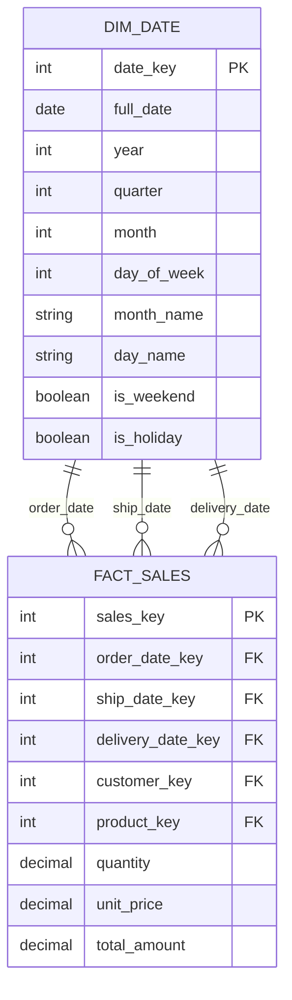
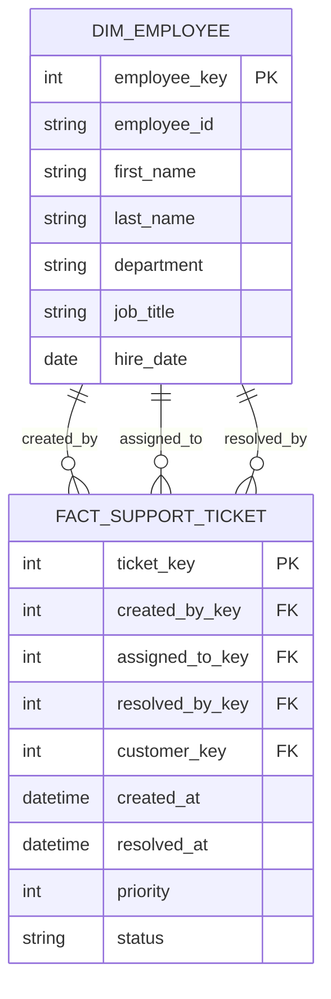

# How to Create Role-Playing Dimensions

Author: [nawazdhandala](https://github.com/nawazdhandala)

Tags: Data Warehouse, Role-Playing Dimensions, Date Dimension, Dimensional Modeling

Description: Learn to create role-playing dimensions for using the same dimension table in multiple roles within a fact table.

---

## Introduction

In data warehousing, a **role-playing dimension** is a single physical dimension table that appears multiple times in a fact table, each time playing a different logical role. The most common example is a date dimension that serves as order date, ship date, and delivery date within the same sales fact table.

This technique helps maintain consistency, reduce redundancy, and simplify maintenance in your data warehouse design.

## Understanding Role-Playing Dimensions

### What Are Role-Playing Dimensions?

Role-playing dimensions occur when a single dimension table is referenced multiple times in a fact table through different foreign keys. Each reference represents a distinct business context or "role" that the dimension plays.

### Why Use Role-Playing Dimensions?

1. **Data Consistency**: A single source of truth for dimensional data
2. **Reduced Storage**: No need to duplicate dimension tables
3. **Easier Maintenance**: Updates only need to happen in one place
4. **Simplified ETL**: One dimension load process instead of many

## Common Examples of Role-Playing Dimensions

### Date Dimension Roles

The date dimension is the most frequently used role-playing dimension:

- **Order Date**: When the order was placed
- **Ship Date**: When the order was shipped
- **Delivery Date**: When the order was delivered
- **Due Date**: When payment is due
- **Payment Date**: When payment was received

### Other Role-Playing Dimension Examples

- **Employee Dimension**: Sales rep, manager, support agent
- **Location Dimension**: Ship-from location, ship-to location, billing location
- **Account Dimension**: Source account, destination account in financial transfers

## Architecture Overview

The following diagram illustrates how a single date dimension can play multiple roles:



## Implementation Approaches

There are two primary methods to implement role-playing dimensions:

1. **View-Based Approach**: Create views that alias the dimension table
2. **Direct Aliasing**: Use table aliases in queries

### Approach 1: View-Based Implementation

Creating views provides a cleaner abstraction and makes queries more readable.

#### Step 1: Create the Base Date Dimension Table

```sql
-- Create the base date dimension table
-- This is the single physical table that will be reused
CREATE TABLE dim_date (
    date_key INT PRIMARY KEY,           -- Surrogate key (YYYYMMDD format)
    full_date DATE NOT NULL,            -- Actual date value
    year INT NOT NULL,                  -- Calendar year
    quarter INT NOT NULL,               -- Calendar quarter (1-4)
    month INT NOT NULL,                 -- Month number (1-12)
    month_name VARCHAR(20) NOT NULL,    -- Full month name
    day_of_month INT NOT NULL,          -- Day of month (1-31)
    day_of_week INT NOT NULL,           -- Day of week (1-7)
    day_name VARCHAR(20) NOT NULL,      -- Full day name
    week_of_year INT NOT NULL,          -- Week number (1-53)
    is_weekend BOOLEAN NOT NULL,        -- True if Saturday or Sunday
    is_holiday BOOLEAN NOT NULL,        -- True if a holiday
    fiscal_year INT,                    -- Fiscal year
    fiscal_quarter INT                  -- Fiscal quarter
);

-- Create index for date lookups
CREATE INDEX idx_dim_date_full_date ON dim_date(full_date);
```

#### Step 2: Create Role-Playing Views

```sql
-- Create view for Order Date role
-- This view represents dates in the context of when orders were placed
CREATE VIEW dim_order_date AS
SELECT
    date_key AS order_date_key,
    full_date AS order_date,
    year AS order_year,
    quarter AS order_quarter,
    month AS order_month,
    month_name AS order_month_name,
    day_of_month AS order_day_of_month,
    day_of_week AS order_day_of_week,
    day_name AS order_day_name,
    week_of_year AS order_week_of_year,
    is_weekend AS order_is_weekend,
    is_holiday AS order_is_holiday,
    fiscal_year AS order_fiscal_year,
    fiscal_quarter AS order_fiscal_quarter
FROM dim_date;

-- Create view for Ship Date role
-- This view represents dates in the context of when orders were shipped
CREATE VIEW dim_ship_date AS
SELECT
    date_key AS ship_date_key,
    full_date AS ship_date,
    year AS ship_year,
    quarter AS ship_quarter,
    month AS ship_month,
    month_name AS ship_month_name,
    day_of_month AS ship_day_of_month,
    day_of_week AS ship_day_of_week,
    day_name AS ship_day_name,
    week_of_year AS ship_week_of_year,
    is_weekend AS ship_is_weekend,
    is_holiday AS ship_is_holiday,
    fiscal_year AS ship_fiscal_year,
    fiscal_quarter AS ship_fiscal_quarter
FROM dim_date;

-- Create view for Delivery Date role
-- This view represents dates in the context of when orders were delivered
CREATE VIEW dim_delivery_date AS
SELECT
    date_key AS delivery_date_key,
    full_date AS delivery_date,
    year AS delivery_year,
    quarter AS delivery_quarter,
    month AS delivery_month,
    month_name AS delivery_month_name,
    day_of_month AS delivery_day_of_month,
    day_of_week AS delivery_day_of_week,
    day_name AS delivery_day_name,
    week_of_year AS delivery_week_of_year,
    is_weekend AS delivery_is_weekend,
    is_holiday AS delivery_is_holiday,
    fiscal_year AS delivery_fiscal_year,
    fiscal_quarter AS delivery_fiscal_quarter
FROM dim_date;
```

#### Step 3: Create the Fact Table

```sql
-- Create the sales fact table with multiple date foreign keys
-- Each date key references the same dim_date table but plays a different role
CREATE TABLE fact_sales (
    sales_key INT PRIMARY KEY,          -- Surrogate key for the fact
    order_date_key INT NOT NULL,        -- FK to dim_date (order date role)
    ship_date_key INT NOT NULL,         -- FK to dim_date (ship date role)
    delivery_date_key INT,              -- FK to dim_date (delivery date role)
    customer_key INT NOT NULL,          -- FK to customer dimension
    product_key INT NOT NULL,           -- FK to product dimension
    quantity DECIMAL(10,2) NOT NULL,    -- Number of units sold
    unit_price DECIMAL(10,2) NOT NULL,  -- Price per unit
    discount_amount DECIMAL(10,2),      -- Discount applied
    total_amount DECIMAL(10,2) NOT NULL,-- Total sale amount

    -- Foreign key constraints all reference the same physical table
    CONSTRAINT fk_order_date
        FOREIGN KEY (order_date_key) REFERENCES dim_date(date_key),
    CONSTRAINT fk_ship_date
        FOREIGN KEY (ship_date_key) REFERENCES dim_date(date_key),
    CONSTRAINT fk_delivery_date
        FOREIGN KEY (delivery_date_key) REFERENCES dim_date(date_key)
);

-- Create indexes for common query patterns
CREATE INDEX idx_fact_sales_order_date ON fact_sales(order_date_key);
CREATE INDEX idx_fact_sales_ship_date ON fact_sales(ship_date_key);
CREATE INDEX idx_fact_sales_delivery_date ON fact_sales(delivery_date_key);
```

### Approach 2: Direct Aliasing in Queries

When views are not available or preferred, you can use table aliases directly.

```sql
-- Query using direct table aliases
-- This approach joins the same dim_date table multiple times with different aliases
SELECT
    -- Order date attributes
    order_dt.full_date AS order_date,
    order_dt.month_name AS order_month,
    order_dt.year AS order_year,

    -- Ship date attributes
    ship_dt.full_date AS ship_date,
    ship_dt.month_name AS ship_month,

    -- Delivery date attributes
    delivery_dt.full_date AS delivery_date,
    delivery_dt.day_name AS delivery_day,

    -- Calculate days between order and delivery
    DATEDIFF(delivery_dt.full_date, order_dt.full_date) AS days_to_deliver,

    -- Fact measures
    SUM(f.quantity) AS total_quantity,
    SUM(f.total_amount) AS total_sales
FROM fact_sales f
-- Join for order date role
INNER JOIN dim_date order_dt
    ON f.order_date_key = order_dt.date_key
-- Join for ship date role
INNER JOIN dim_date ship_dt
    ON f.ship_date_key = ship_dt.date_key
-- Join for delivery date role (left join since delivery might be null)
LEFT JOIN dim_date delivery_dt
    ON f.delivery_date_key = delivery_dt.date_key
WHERE
    order_dt.year = 2024
GROUP BY
    order_dt.full_date,
    order_dt.month_name,
    order_dt.year,
    ship_dt.full_date,
    ship_dt.month_name,
    delivery_dt.full_date,
    delivery_dt.day_name
ORDER BY
    order_dt.full_date;
```

## Practical Query Examples

### Example 1: Sales Analysis by Order and Ship Date

```sql
-- Analyze sales performance comparing order dates vs ship dates
-- Useful for understanding order-to-ship patterns
SELECT
    od.month_name AS order_month,
    od.year AS order_year,
    sd.month_name AS ship_month,
    COUNT(DISTINCT f.sales_key) AS order_count,
    SUM(f.total_amount) AS total_revenue,
    AVG(DATEDIFF(sd.full_date, od.full_date)) AS avg_days_to_ship
FROM fact_sales f
INNER JOIN dim_order_date od
    ON f.order_date_key = od.order_date_key
INNER JOIN dim_ship_date sd
    ON f.ship_date_key = sd.ship_date_key
WHERE
    od.order_year = 2024
GROUP BY
    od.month_name,
    od.year,
    sd.month_name
ORDER BY
    od.order_year,
    od.order_month;
```

### Example 2: Weekend vs Weekday Delivery Analysis

```sql
-- Compare delivery patterns on weekends vs weekdays
-- Helps optimize delivery scheduling
SELECT
    CASE
        WHEN dd.delivery_is_weekend THEN 'Weekend'
        ELSE 'Weekday'
    END AS delivery_type,
    dd.delivery_day_name,
    COUNT(*) AS delivery_count,
    SUM(f.total_amount) AS delivered_value,
    AVG(DATEDIFF(dd.delivery_date, od.order_date)) AS avg_delivery_days
FROM fact_sales f
INNER JOIN dim_order_date od
    ON f.order_date_key = od.order_date_key
INNER JOIN dim_delivery_date dd
    ON f.delivery_date_key = dd.delivery_date_key
WHERE
    dd.delivery_date IS NOT NULL
    AND od.order_year = 2024
GROUP BY
    dd.delivery_is_weekend,
    dd.delivery_day_name
ORDER BY
    delivery_type,
    dd.delivery_day_of_week;
```

### Example 3: Shipping Delay Analysis

```sql
-- Identify orders with shipping delays
-- Ship date is more than 3 days after order date
SELECT
    od.order_date,
    sd.ship_date,
    DATEDIFF(sd.ship_date, od.order_date) AS days_to_ship,
    f.sales_key,
    f.total_amount,
    CASE
        WHEN DATEDIFF(sd.ship_date, od.order_date) > 5 THEN 'Critical Delay'
        WHEN DATEDIFF(sd.ship_date, od.order_date) > 3 THEN 'Moderate Delay'
        ELSE 'On Time'
    END AS shipping_status
FROM fact_sales f
INNER JOIN dim_order_date od
    ON f.order_date_key = od.order_date_key
INNER JOIN dim_ship_date sd
    ON f.ship_date_key = sd.ship_date_key
WHERE
    DATEDIFF(sd.ship_date, od.order_date) > 3
ORDER BY
    days_to_ship DESC;
```

## Employee Dimension as Role-Playing Example

Here is another common example using an employee dimension:



### Employee Role-Playing Views

```sql
-- View for employees who create tickets
CREATE VIEW dim_ticket_creator AS
SELECT
    employee_key AS creator_key,
    employee_id AS creator_id,
    first_name AS creator_first_name,
    last_name AS creator_last_name,
    department AS creator_department,
    job_title AS creator_job_title
FROM dim_employee;

-- View for employees assigned to tickets
CREATE VIEW dim_ticket_assignee AS
SELECT
    employee_key AS assignee_key,
    employee_id AS assignee_id,
    first_name AS assignee_first_name,
    last_name AS assignee_last_name,
    department AS assignee_department,
    job_title AS assignee_job_title
FROM dim_employee;

-- View for employees who resolve tickets
CREATE VIEW dim_ticket_resolver AS
SELECT
    employee_key AS resolver_key,
    employee_id AS resolver_id,
    first_name AS resolver_first_name,
    last_name AS resolver_last_name,
    department AS resolver_department,
    job_title AS resolver_job_title
FROM dim_employee;
```

## Populating the Date Dimension

Here is a script to populate your date dimension with data:

```sql
-- Procedure to populate the date dimension
-- Generates date records for a specified range
DELIMITER //

CREATE PROCEDURE populate_date_dimension(
    IN start_date DATE,
    IN end_date DATE
)
BEGIN
    DECLARE current_date_val DATE;
    SET current_date_val = start_date;

    -- Loop through each date in the range
    WHILE current_date_val <= end_date DO
        INSERT INTO dim_date (
            date_key,
            full_date,
            year,
            quarter,
            month,
            month_name,
            day_of_month,
            day_of_week,
            day_name,
            week_of_year,
            is_weekend,
            is_holiday,
            fiscal_year,
            fiscal_quarter
        )
        VALUES (
            -- Generate date_key in YYYYMMDD format
            YEAR(current_date_val) * 10000 +
                MONTH(current_date_val) * 100 +
                DAY(current_date_val),
            current_date_val,
            YEAR(current_date_val),
            QUARTER(current_date_val),
            MONTH(current_date_val),
            MONTHNAME(current_date_val),
            DAY(current_date_val),
            DAYOFWEEK(current_date_val),
            DAYNAME(current_date_val),
            WEEKOFYEAR(current_date_val),
            -- Weekend check (1=Sunday, 7=Saturday in MySQL)
            CASE WHEN DAYOFWEEK(current_date_val) IN (1, 7)
                THEN TRUE ELSE FALSE END,
            FALSE,  -- Holiday flag defaults to false
            -- Fiscal year (assuming fiscal year starts in July)
            CASE WHEN MONTH(current_date_val) >= 7
                THEN YEAR(current_date_val) + 1
                ELSE YEAR(current_date_val) END,
            -- Fiscal quarter
            CASE
                WHEN MONTH(current_date_val) IN (7,8,9) THEN 1
                WHEN MONTH(current_date_val) IN (10,11,12) THEN 2
                WHEN MONTH(current_date_val) IN (1,2,3) THEN 3
                ELSE 4
            END
        );

        -- Move to next date
        SET current_date_val = DATE_ADD(current_date_val, INTERVAL 1 DAY);
    END WHILE;
END //

DELIMITER ;

-- Execute to populate 10 years of dates
CALL populate_date_dimension('2020-01-01', '2030-12-31');
```

## Best Practices

### Naming Conventions

1. **Use descriptive prefixes**: Name views and aliases clearly to indicate their role
2. **Consistent naming**: Apply the same pattern across all role-playing views
3. **Document the roles**: Keep documentation of what each role represents

### Performance Considerations

1. **Index foreign keys**: Create indexes on all date foreign keys in fact tables
2. **Consider materialized views**: For complex transformations, materialized views may improve performance
3. **Partition by date**: Consider partitioning large fact tables by the primary date role

### Design Guidelines

1. **Identify roles during design**: Plan role-playing dimensions during the modeling phase
2. **Use views for BI tools**: Many BI tools work better with views than with complex aliased queries
3. **Handle null roles**: Use LEFT JOIN for optional date relationships

## Summary

Role-playing dimensions are a powerful technique in dimensional modeling that allow you to:

- Reuse a single dimension table in multiple business contexts
- Maintain data consistency across your warehouse
- Reduce storage and simplify ETL processes
- Create clear, understandable queries with proper aliasing

The view-based approach is generally recommended for production environments as it provides:

- Better abstraction for end users and BI tools
- Cleaner query syntax
- Easier maintenance and documentation

By implementing role-playing dimensions correctly, you can build a more efficient and maintainable data warehouse that accurately represents your business processes.

## Further Reading

- Kimball Group: The Data Warehouse Toolkit
- Star Schema Design Patterns
- Dimensional Modeling Best Practices
