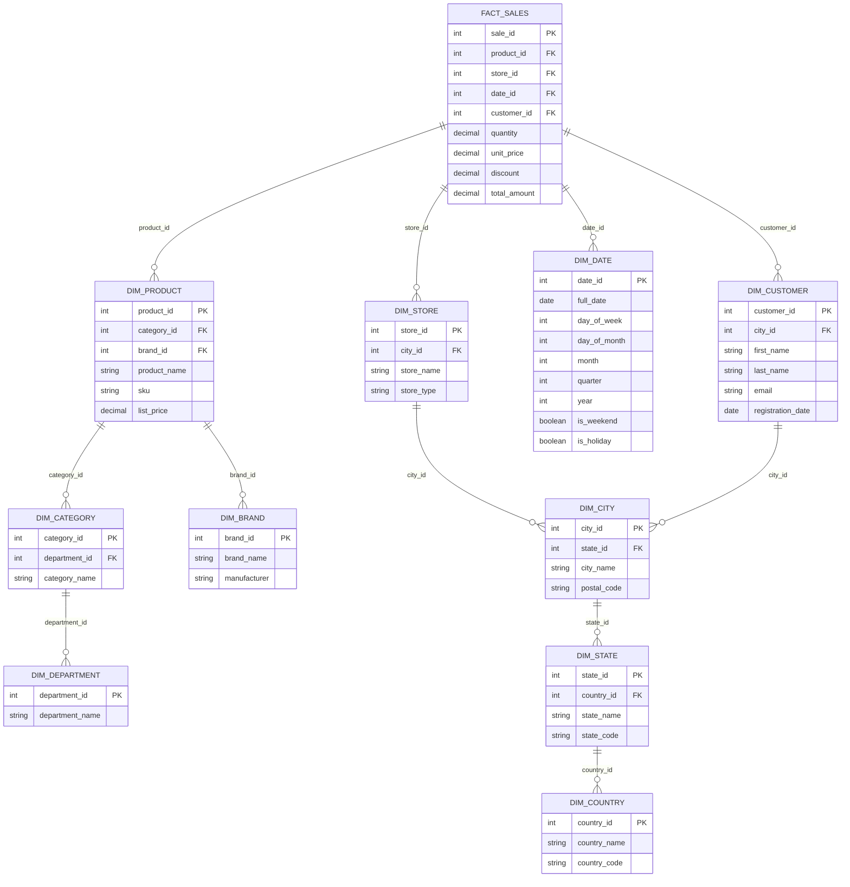
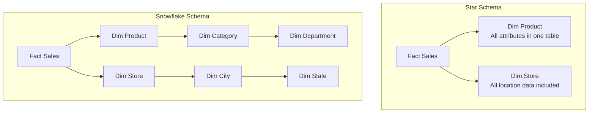

# How to Create Snowflake Schema Design

Author: [nawazdhandala](https://github.com/nawazdhandala)

Tags: Data Warehouse, Snowflake Schema, Dimensional Modeling, ETL

Description: Learn to create snowflake schema design for normalized dimension tables in data warehouses.

---

Data warehousing is essential for organizations that need to analyze large volumes of historical data. One of the most important decisions in designing a data warehouse is choosing the right schema architecture. The snowflake schema is a logical arrangement of tables that extends the star schema by normalizing dimension tables into multiple related tables. This guide will walk you through the process of creating a snowflake schema design from scratch.

## What is a Snowflake Schema?

A snowflake schema is a type of database schema used in data warehousing where dimension tables are normalized into multiple related tables. The name comes from its resemblance to a snowflake shape when visualized, with the fact table at the center and normalized dimension tables branching outward like the arms of a snowflake.

### Key Characteristics

- **Normalized Dimensions**: Dimension tables are split into sub-dimension tables to eliminate redundancy
- **Central Fact Table**: Contains measurable, quantitative data (facts) and foreign keys to dimension tables
- **Hierarchical Structure**: Dimensions are organized in a hierarchical manner with parent-child relationships
- **Reduced Storage**: Normalization reduces data redundancy and storage requirements
- **Referential Integrity**: Strong enforcement of data relationships through foreign keys

## Snowflake Schema Architecture

Here is a visual representation of a snowflake schema for a retail sales data warehouse:



## Normalization Levels in Snowflake Schema

Understanding normalization is crucial for designing an effective snowflake schema. Let us examine how a denormalized dimension table transforms through normalization levels.

### Starting Point: Denormalized Product Dimension

```sql
-- Denormalized product dimension (as it would appear in a star schema)
-- All product-related attributes are in a single table
-- This leads to data redundancy when the same category or brand appears multiple times
CREATE TABLE dim_product_denormalized (
    product_id INT PRIMARY KEY,
    product_name VARCHAR(200),
    sku VARCHAR(50),
    list_price DECIMAL(10, 2),
    category_name VARCHAR(100),        -- Repeated for each product in category
    category_description VARCHAR(500), -- Redundant data
    department_name VARCHAR(100),      -- Further redundancy
    department_manager VARCHAR(100),   -- Redundant across many products
    brand_name VARCHAR(100),           -- Repeated for brand's products
    brand_country VARCHAR(50),         -- Redundant brand info
    manufacturer VARCHAR(200)          -- Repeated manufacturer data
);
```

### First Normal Form (1NF): Atomic Values

```sql
-- 1NF: Ensure all columns contain atomic (indivisible) values
-- Remove any repeating groups or arrays
-- Each column should contain only one value per row
CREATE TABLE dim_product_1nf (
    product_id INT PRIMARY KEY,
    product_name VARCHAR(200) NOT NULL,      -- Single atomic value
    sku VARCHAR(50) NOT NULL,                -- Single atomic value
    list_price DECIMAL(10, 2) NOT NULL,      -- Single atomic value
    category_name VARCHAR(100) NOT NULL,     -- Single value, not a list
    category_description VARCHAR(500),
    department_name VARCHAR(100) NOT NULL,
    department_manager VARCHAR(100),
    brand_name VARCHAR(100) NOT NULL,
    brand_country VARCHAR(50),
    manufacturer VARCHAR(200)
);

-- Note: 1NF still has redundancy issues
-- The same category_name appears for multiple products
```

### Second Normal Form (2NF): Remove Partial Dependencies

```sql
-- 2NF: Remove partial dependencies on the primary key
-- Split tables so non-key attributes depend on the entire primary key
-- Category information now in its own table

-- Category dimension with its own primary key
CREATE TABLE dim_category_2nf (
    category_id INT PRIMARY KEY,
    category_name VARCHAR(100) NOT NULL,
    category_description VARCHAR(500),
    department_name VARCHAR(100) NOT NULL,   -- Still has transitive dependency
    department_manager VARCHAR(100)
);

-- Product dimension references category via foreign key
CREATE TABLE dim_product_2nf (
    product_id INT PRIMARY KEY,
    category_id INT NOT NULL,                -- Foreign key to category
    product_name VARCHAR(200) NOT NULL,
    sku VARCHAR(50) NOT NULL,
    list_price DECIMAL(10, 2) NOT NULL,
    brand_name VARCHAR(100) NOT NULL,        -- Still has redundancy
    brand_country VARCHAR(50),
    manufacturer VARCHAR(200),
    FOREIGN KEY (category_id) REFERENCES dim_category_2nf(category_id)
);
```

### Third Normal Form (3NF): Remove Transitive Dependencies

```sql
-- 3NF: Remove transitive dependencies
-- Non-key attributes should depend only on the primary key
-- This is the typical normalization level for snowflake schemas

-- Department dimension (top of hierarchy)
CREATE TABLE dim_department (
    department_id INT PRIMARY KEY,
    department_name VARCHAR(100) NOT NULL,
    department_manager VARCHAR(100),
    created_at TIMESTAMP DEFAULT CURRENT_TIMESTAMP
);

-- Category dimension references department
CREATE TABLE dim_category (
    category_id INT PRIMARY KEY,
    department_id INT NOT NULL,              -- Foreign key to department
    category_name VARCHAR(100) NOT NULL,
    category_description VARCHAR(500),
    FOREIGN KEY (department_id) REFERENCES dim_department(department_id)
);

-- Brand dimension (separate hierarchy)
CREATE TABLE dim_brand (
    brand_id INT PRIMARY KEY,
    brand_name VARCHAR(100) NOT NULL,
    brand_country VARCHAR(50),
    manufacturer VARCHAR(200),
    website_url VARCHAR(500)
);

-- Product dimension (fully normalized)
CREATE TABLE dim_product (
    product_id INT PRIMARY KEY,
    category_id INT NOT NULL,                -- FK to normalized category
    brand_id INT NOT NULL,                   -- FK to normalized brand
    product_name VARCHAR(200) NOT NULL,
    sku VARCHAR(50) NOT NULL UNIQUE,
    list_price DECIMAL(10, 2) NOT NULL,
    weight_kg DECIMAL(8, 3),
    is_active BOOLEAN DEFAULT TRUE,
    created_at TIMESTAMP DEFAULT CURRENT_TIMESTAMP,
    FOREIGN KEY (category_id) REFERENCES dim_category(category_id),
    FOREIGN KEY (brand_id) REFERENCES dim_brand(brand_id)
);
```

## Complete Snowflake Schema Implementation

Here is a complete SQL implementation of a retail sales snowflake schema:

### Geographic Dimension Hierarchy

```sql
-- Country dimension (top level of geographic hierarchy)
-- Contains country-level attributes that rarely change
CREATE TABLE dim_country (
    country_id INT PRIMARY KEY,
    country_name VARCHAR(100) NOT NULL,
    country_code CHAR(3) NOT NULL UNIQUE,   -- ISO 3166-1 alpha-3
    continent VARCHAR(50),
    currency_code CHAR(3),
    created_at TIMESTAMP DEFAULT CURRENT_TIMESTAMP,
    updated_at TIMESTAMP DEFAULT CURRENT_TIMESTAMP
);

-- State/Province dimension (second level)
-- References country for geographic hierarchy
CREATE TABLE dim_state (
    state_id INT PRIMARY KEY,
    country_id INT NOT NULL,
    state_name VARCHAR(100) NOT NULL,
    state_code VARCHAR(10),                  -- State abbreviation
    region VARCHAR(50),                      -- Geographic region within country
    FOREIGN KEY (country_id) REFERENCES dim_country(country_id),
    UNIQUE (country_id, state_code)          -- Unique within country
);

-- City dimension (third level)
-- References state for geographic hierarchy
CREATE TABLE dim_city (
    city_id INT PRIMARY KEY,
    state_id INT NOT NULL,
    city_name VARCHAR(100) NOT NULL,
    postal_code VARCHAR(20),
    latitude DECIMAL(9, 6),                  -- For geographic analysis
    longitude DECIMAL(9, 6),
    population INT,
    timezone VARCHAR(50),
    FOREIGN KEY (state_id) REFERENCES dim_state(state_id)
);
```

### Store Dimension

```sql
-- Store dimension references the geographic hierarchy
-- Contains store-specific attributes
CREATE TABLE dim_store (
    store_id INT PRIMARY KEY,
    city_id INT NOT NULL,
    store_name VARCHAR(200) NOT NULL,
    store_code VARCHAR(20) NOT NULL UNIQUE,
    store_type VARCHAR(50),                  -- e.g., Retail, Outlet, Flagship
    store_size_sqft INT,
    opening_date DATE,
    manager_name VARCHAR(100),
    phone_number VARCHAR(20),
    is_active BOOLEAN DEFAULT TRUE,
    FOREIGN KEY (city_id) REFERENCES dim_city(city_id)
);

-- Create index for common query patterns
CREATE INDEX idx_store_city ON dim_store(city_id);
CREATE INDEX idx_store_type ON dim_store(store_type);
```

### Customer Dimension

```sql
-- Customer dimension with geographic reference
-- Contains customer demographic information
CREATE TABLE dim_customer (
    customer_id INT PRIMARY KEY,
    city_id INT,                             -- Nullable for unknown locations
    first_name VARCHAR(100) NOT NULL,
    last_name VARCHAR(100) NOT NULL,
    email VARCHAR(255) UNIQUE,
    phone_number VARCHAR(20),
    date_of_birth DATE,
    gender CHAR(1),
    registration_date DATE NOT NULL,
    customer_segment VARCHAR(50),            -- e.g., Premium, Standard, New
    loyalty_tier VARCHAR(20),                -- e.g., Gold, Silver, Bronze
    is_active BOOLEAN DEFAULT TRUE,
    FOREIGN KEY (city_id) REFERENCES dim_city(city_id)
);

-- Indexes for customer queries
CREATE INDEX idx_customer_city ON dim_customer(city_id);
CREATE INDEX idx_customer_segment ON dim_customer(customer_segment);
CREATE INDEX idx_customer_registration ON dim_customer(registration_date);
```

### Date Dimension

```sql
-- Date dimension (typically not normalized further)
-- Pre-populated with date attributes for efficient querying
CREATE TABLE dim_date (
    date_id INT PRIMARY KEY,                 -- Format: YYYYMMDD
    full_date DATE NOT NULL UNIQUE,
    day_of_week SMALLINT NOT NULL,           -- 1=Monday, 7=Sunday
    day_name VARCHAR(10) NOT NULL,           -- Monday, Tuesday, etc.
    day_of_month SMALLINT NOT NULL,
    day_of_year SMALLINT NOT NULL,
    week_of_year SMALLINT NOT NULL,
    month SMALLINT NOT NULL,
    month_name VARCHAR(10) NOT NULL,
    quarter SMALLINT NOT NULL,
    year INT NOT NULL,
    is_weekend BOOLEAN NOT NULL,
    is_holiday BOOLEAN DEFAULT FALSE,
    holiday_name VARCHAR(50),
    fiscal_year INT,
    fiscal_quarter SMALLINT
);

-- Populate date dimension with a date range
-- This procedure generates date records for analysis
INSERT INTO dim_date (
    date_id, full_date, day_of_week, day_name, day_of_month,
    day_of_year, week_of_year, month, month_name, quarter,
    year, is_weekend, fiscal_year, fiscal_quarter
)
SELECT
    TO_CHAR(d, 'YYYYMMDD')::INT AS date_id,
    d AS full_date,
    EXTRACT(ISODOW FROM d) AS day_of_week,
    TO_CHAR(d, 'Day') AS day_name,
    EXTRACT(DAY FROM d) AS day_of_month,
    EXTRACT(DOY FROM d) AS day_of_year,
    EXTRACT(WEEK FROM d) AS week_of_year,
    EXTRACT(MONTH FROM d) AS month,
    TO_CHAR(d, 'Month') AS month_name,
    EXTRACT(QUARTER FROM d) AS quarter,
    EXTRACT(YEAR FROM d) AS year,
    CASE WHEN EXTRACT(ISODOW FROM d) IN (6, 7) THEN TRUE ELSE FALSE END AS is_weekend,
    -- Fiscal year starts in April
    CASE
        WHEN EXTRACT(MONTH FROM d) >= 4 THEN EXTRACT(YEAR FROM d)
        ELSE EXTRACT(YEAR FROM d) - 1
    END AS fiscal_year,
    CASE
        WHEN EXTRACT(MONTH FROM d) BETWEEN 4 AND 6 THEN 1
        WHEN EXTRACT(MONTH FROM d) BETWEEN 7 AND 9 THEN 2
        WHEN EXTRACT(MONTH FROM d) BETWEEN 10 AND 12 THEN 3
        ELSE 4
    END AS fiscal_quarter
FROM generate_series('2020-01-01'::DATE, '2030-12-31'::DATE, '1 day'::INTERVAL) AS d;
```

### Fact Table

```sql
-- Central fact table containing sales transactions
-- References all dimension tables through foreign keys
CREATE TABLE fact_sales (
    sale_id BIGINT PRIMARY KEY,
    -- Foreign keys to dimension tables
    product_id INT NOT NULL,
    store_id INT NOT NULL,
    customer_id INT,                         -- Nullable for anonymous sales
    date_id INT NOT NULL,

    -- Degenerate dimension (transaction-level identifier)
    transaction_number VARCHAR(50) NOT NULL,
    line_item_number SMALLINT NOT NULL,

    -- Measures (facts)
    quantity INT NOT NULL,
    unit_price DECIMAL(10, 2) NOT NULL,
    discount_amount DECIMAL(10, 2) DEFAULT 0,
    tax_amount DECIMAL(10, 2) DEFAULT 0,
    total_amount DECIMAL(12, 2) NOT NULL,
    cost_amount DECIMAL(10, 2),              -- For margin calculations

    -- Timestamps for ETL tracking
    created_at TIMESTAMP DEFAULT CURRENT_TIMESTAMP,

    -- Foreign key constraints
    FOREIGN KEY (product_id) REFERENCES dim_product(product_id),
    FOREIGN KEY (store_id) REFERENCES dim_store(store_id),
    FOREIGN KEY (customer_id) REFERENCES dim_customer(customer_id),
    FOREIGN KEY (date_id) REFERENCES dim_date(date_id)
);

-- Performance indexes for common query patterns
CREATE INDEX idx_fact_sales_date ON fact_sales(date_id);
CREATE INDEX idx_fact_sales_product ON fact_sales(product_id);
CREATE INDEX idx_fact_sales_store ON fact_sales(store_id);
CREATE INDEX idx_fact_sales_customer ON fact_sales(customer_id);

-- Composite index for date range queries with store filter
CREATE INDEX idx_fact_sales_date_store ON fact_sales(date_id, store_id);
```

## Snowflake Schema vs Star Schema Comparison

Understanding the differences between these schemas helps you choose the right approach for your use case.

| Aspect | Star Schema | Snowflake Schema |
|--------|-------------|------------------|
| **Normalization** | Denormalized dimensions | Normalized dimensions (3NF) |
| **Query Complexity** | Simpler queries with fewer joins | More complex queries with multiple joins |
| **Query Performance** | Faster for simple aggregations | May be slower due to additional joins |
| **Storage Space** | Higher due to redundancy | Lower due to normalization |
| **Data Integrity** | Harder to maintain | Easier to maintain with referential integrity |
| **ETL Complexity** | Simpler ETL processes | More complex ETL with multiple tables |
| **Maintenance** | Updates may require multiple rows | Updates in one place propagate correctly |
| **Best For** | OLAP, simple reporting | Complex hierarchies, storage constraints |

### Visual Comparison



## Query Examples

### Basic Sales Query with All Dimensions

```sql
-- Retrieve sales data with full dimension details
-- This query joins the fact table with all normalized dimensions
-- Demonstrates the typical join pattern in a snowflake schema
SELECT
    d.full_date AS sale_date,
    c.country_name,
    st.state_name,
    ci.city_name,
    s.store_name,
    dept.department_name,
    cat.category_name,
    b.brand_name,
    p.product_name,
    cust.first_name || ' ' || cust.last_name AS customer_name,
    f.quantity,
    f.unit_price,
    f.total_amount
FROM fact_sales f
-- Join dimension tables
INNER JOIN dim_date d ON f.date_id = d.date_id
INNER JOIN dim_product p ON f.product_id = p.product_id
INNER JOIN dim_category cat ON p.category_id = cat.category_id
INNER JOIN dim_department dept ON cat.department_id = dept.department_id
INNER JOIN dim_brand b ON p.brand_id = b.brand_id
INNER JOIN dim_store s ON f.store_id = s.store_id
INNER JOIN dim_city ci ON s.city_id = ci.city_id
INNER JOIN dim_state st ON ci.state_id = st.state_id
INNER JOIN dim_country c ON st.country_id = c.country_id
LEFT JOIN dim_customer cust ON f.customer_id = cust.customer_id
WHERE d.year = 2025
    AND d.quarter = 4
ORDER BY f.total_amount DESC
LIMIT 100;
```

### Aggregation Query by Geographic Hierarchy

```sql
-- Sales aggregation rolling up geographic hierarchy
-- Uses the normalized structure to aggregate at different levels
SELECT
    c.country_name,
    st.state_name,
    ci.city_name,
    COUNT(DISTINCT f.sale_id) AS total_transactions,
    SUM(f.quantity) AS total_units_sold,
    SUM(f.total_amount) AS total_revenue,
    AVG(f.total_amount) AS avg_transaction_value,
    SUM(f.total_amount - f.cost_amount) AS gross_profit
FROM fact_sales f
INNER JOIN dim_store s ON f.store_id = s.store_id
INNER JOIN dim_city ci ON s.city_id = ci.city_id
INNER JOIN dim_state st ON ci.state_id = st.state_id
INNER JOIN dim_country c ON st.country_id = c.country_id
INNER JOIN dim_date d ON f.date_id = d.date_id
WHERE d.year = 2025
GROUP BY
    c.country_name,
    st.state_name,
    ci.city_name
-- Use ROLLUP for subtotals at each hierarchy level
WITH ROLLUP
ORDER BY
    c.country_name NULLS LAST,
    st.state_name NULLS LAST,
    ci.city_name NULLS LAST;
```

### Product Performance by Category Hierarchy

```sql
-- Analyze product performance across the category hierarchy
-- Demonstrates drilling down through normalized product dimensions
SELECT
    dept.department_name,
    cat.category_name,
    b.brand_name,
    p.product_name,
    SUM(f.quantity) AS units_sold,
    SUM(f.total_amount) AS revenue,
    SUM(f.total_amount - f.cost_amount) AS profit,
    ROUND(
        SUM(f.total_amount - f.cost_amount) / NULLIF(SUM(f.total_amount), 0) * 100,
        2
    ) AS profit_margin_pct,
    -- Rank products within their category
    RANK() OVER (
        PARTITION BY cat.category_id
        ORDER BY SUM(f.total_amount) DESC
    ) AS rank_in_category
FROM fact_sales f
INNER JOIN dim_product p ON f.product_id = p.product_id
INNER JOIN dim_category cat ON p.category_id = cat.category_id
INNER JOIN dim_department dept ON cat.department_id = dept.department_id
INNER JOIN dim_brand b ON p.brand_id = b.brand_id
INNER JOIN dim_date d ON f.date_id = d.date_id
WHERE d.year = 2025
GROUP BY
    dept.department_name,
    cat.category_name,
    cat.category_id,
    b.brand_name,
    p.product_name
HAVING SUM(f.total_amount) > 1000
ORDER BY
    dept.department_name,
    cat.category_name,
    revenue DESC;
```

### Time-based Trend Analysis

```sql
-- Monthly sales trend with year-over-year comparison
-- Leverages the date dimension for time-based analysis
WITH monthly_sales AS (
    SELECT
        d.year,
        d.month,
        d.month_name,
        SUM(f.total_amount) AS monthly_revenue,
        COUNT(DISTINCT f.customer_id) AS unique_customers,
        COUNT(DISTINCT f.sale_id) AS total_transactions
    FROM fact_sales f
    INNER JOIN dim_date d ON f.date_id = d.date_id
    WHERE d.year IN (2024, 2025)
    GROUP BY d.year, d.month, d.month_name
)
SELECT
    curr.month,
    curr.month_name,
    curr.monthly_revenue AS revenue_2025,
    prev.monthly_revenue AS revenue_2024,
    curr.monthly_revenue - prev.monthly_revenue AS revenue_change,
    ROUND(
        (curr.monthly_revenue - prev.monthly_revenue) /
        NULLIF(prev.monthly_revenue, 0) * 100,
        2
    ) AS yoy_growth_pct,
    curr.unique_customers AS customers_2025,
    prev.unique_customers AS customers_2024
FROM monthly_sales curr
LEFT JOIN monthly_sales prev
    ON curr.month = prev.month
    AND curr.year = 2025
    AND prev.year = 2024
WHERE curr.year = 2025
ORDER BY curr.month;
```

## Creating Views for Simplified Querying

To reduce query complexity, create views that pre-join commonly used dimension hierarchies:

```sql
-- View that flattens the product hierarchy
-- Simplifies queries by pre-joining product-related dimensions
CREATE VIEW vw_product_full AS
SELECT
    p.product_id,
    p.product_name,
    p.sku,
    p.list_price,
    p.is_active AS product_active,
    cat.category_id,
    cat.category_name,
    cat.category_description,
    dept.department_id,
    dept.department_name,
    dept.department_manager,
    b.brand_id,
    b.brand_name,
    b.manufacturer,
    b.brand_country
FROM dim_product p
INNER JOIN dim_category cat ON p.category_id = cat.category_id
INNER JOIN dim_department dept ON cat.department_id = dept.department_id
INNER JOIN dim_brand b ON p.brand_id = b.brand_id;

-- View that flattens the geographic hierarchy
-- Pre-joins location dimensions for easier store and customer queries
CREATE VIEW vw_location_full AS
SELECT
    ci.city_id,
    ci.city_name,
    ci.postal_code,
    ci.latitude,
    ci.longitude,
    st.state_id,
    st.state_name,
    st.state_code,
    st.region,
    c.country_id,
    c.country_name,
    c.country_code,
    c.continent
FROM dim_city ci
INNER JOIN dim_state st ON ci.state_id = st.state_id
INNER JOIN dim_country c ON st.country_id = c.country_id;

-- Materialized view for common sales aggregations
-- Refreshed periodically to improve query performance
CREATE MATERIALIZED VIEW mv_daily_sales_summary AS
SELECT
    f.date_id,
    f.store_id,
    p.category_id,
    SUM(f.quantity) AS total_quantity,
    SUM(f.total_amount) AS total_revenue,
    SUM(f.discount_amount) AS total_discounts,
    COUNT(DISTINCT f.customer_id) AS unique_customers,
    COUNT(*) AS transaction_count
FROM fact_sales f
INNER JOIN dim_product p ON f.product_id = p.product_id
GROUP BY f.date_id, f.store_id, p.category_id;

-- Create index on materialized view
CREATE INDEX idx_mv_daily_sales_date ON mv_daily_sales_summary(date_id);

-- Refresh the materialized view (run periodically via scheduler)
-- REFRESH MATERIALIZED VIEW mv_daily_sales_summary;
```

## ETL Considerations

### Loading Dimension Tables

```sql
-- Procedure to load or update the product dimension
-- Implements Type 1 SCD (Slowly Changing Dimension) with overwrites
CREATE OR REPLACE PROCEDURE sp_load_dim_product(
    p_source_table VARCHAR
)
LANGUAGE plpgsql
AS $$
BEGIN
    -- First, ensure parent dimensions exist (department, category, brand)
    -- Load departments from source
    INSERT INTO dim_department (department_id, department_name, department_manager)
    SELECT DISTINCT
        department_id,
        department_name,
        department_manager
    FROM staging_products
    ON CONFLICT (department_id)
    DO UPDATE SET
        department_name = EXCLUDED.department_name,
        department_manager = EXCLUDED.department_manager;

    -- Load categories (depends on departments)
    INSERT INTO dim_category (category_id, department_id, category_name, category_description)
    SELECT DISTINCT
        category_id,
        department_id,
        category_name,
        category_description
    FROM staging_products
    ON CONFLICT (category_id)
    DO UPDATE SET
        department_id = EXCLUDED.department_id,
        category_name = EXCLUDED.category_name,
        category_description = EXCLUDED.category_description;

    -- Load brands
    INSERT INTO dim_brand (brand_id, brand_name, brand_country, manufacturer)
    SELECT DISTINCT
        brand_id,
        brand_name,
        brand_country,
        manufacturer
    FROM staging_products
    ON CONFLICT (brand_id)
    DO UPDATE SET
        brand_name = EXCLUDED.brand_name,
        brand_country = EXCLUDED.brand_country,
        manufacturer = EXCLUDED.manufacturer;

    -- Finally, load products (depends on categories and brands)
    INSERT INTO dim_product (
        product_id, category_id, brand_id, product_name,
        sku, list_price, weight_kg, is_active
    )
    SELECT
        product_id,
        category_id,
        brand_id,
        product_name,
        sku,
        list_price,
        weight_kg,
        is_active
    FROM staging_products
    ON CONFLICT (product_id)
    DO UPDATE SET
        category_id = EXCLUDED.category_id,
        brand_id = EXCLUDED.brand_id,
        product_name = EXCLUDED.product_name,
        list_price = EXCLUDED.list_price,
        weight_kg = EXCLUDED.weight_kg,
        is_active = EXCLUDED.is_active;

    -- Log the load completion
    RAISE NOTICE 'Product dimension load completed at %', NOW();
END;
$$;
```

### Loading Fact Tables

```sql
-- Procedure to load fact_sales from staging
-- Validates foreign keys and handles data quality issues
CREATE OR REPLACE PROCEDURE sp_load_fact_sales(
    p_batch_date DATE
)
LANGUAGE plpgsql
AS $$
DECLARE
    v_records_loaded INT;
    v_records_rejected INT;
BEGIN
    -- Create temporary table for rejected records
    CREATE TEMP TABLE IF NOT EXISTS tmp_rejected_sales (
        transaction_number VARCHAR(50),
        rejection_reason VARCHAR(200),
        rejected_at TIMESTAMP DEFAULT CURRENT_TIMESTAMP
    );

    -- Log records with invalid product references
    INSERT INTO tmp_rejected_sales (transaction_number, rejection_reason)
    SELECT
        s.transaction_number,
        'Invalid product_id: ' || s.product_id
    FROM staging_sales s
    LEFT JOIN dim_product p ON s.product_id = p.product_id
    WHERE p.product_id IS NULL
        AND s.batch_date = p_batch_date;

    -- Log records with invalid store references
    INSERT INTO tmp_rejected_sales (transaction_number, rejection_reason)
    SELECT
        s.transaction_number,
        'Invalid store_id: ' || s.store_id
    FROM staging_sales s
    LEFT JOIN dim_store st ON s.store_id = st.store_id
    WHERE st.store_id IS NULL
        AND s.batch_date = p_batch_date;

    -- Load valid records into fact table
    INSERT INTO fact_sales (
        sale_id, product_id, store_id, customer_id, date_id,
        transaction_number, line_item_number,
        quantity, unit_price, discount_amount, tax_amount,
        total_amount, cost_amount
    )
    SELECT
        s.sale_id,
        s.product_id,
        s.store_id,
        s.customer_id,
        TO_CHAR(s.sale_date, 'YYYYMMDD')::INT AS date_id,
        s.transaction_number,
        s.line_item_number,
        s.quantity,
        s.unit_price,
        COALESCE(s.discount_amount, 0),
        COALESCE(s.tax_amount, 0),
        s.total_amount,
        s.cost_amount
    FROM staging_sales s
    -- Validate all foreign keys exist
    INNER JOIN dim_product p ON s.product_id = p.product_id
    INNER JOIN dim_store st ON s.store_id = st.store_id
    INNER JOIN dim_date d ON TO_CHAR(s.sale_date, 'YYYYMMDD')::INT = d.date_id
    LEFT JOIN dim_customer c ON s.customer_id = c.customer_id
    WHERE s.batch_date = p_batch_date
        -- Exclude already rejected records
        AND s.transaction_number NOT IN (
            SELECT transaction_number FROM tmp_rejected_sales
        );

    GET DIAGNOSTICS v_records_loaded = ROW_COUNT;

    SELECT COUNT(*) INTO v_records_rejected FROM tmp_rejected_sales;

    -- Log ETL results
    RAISE NOTICE 'Batch % completed: % records loaded, % records rejected',
        p_batch_date, v_records_loaded, v_records_rejected;

    -- Clean up
    DROP TABLE IF EXISTS tmp_rejected_sales;
END;
$$;
```

## Performance Optimization Tips

### Index Strategy

```sql
-- Bitmap indexes work well for low-cardinality columns in dimensions
-- (Syntax varies by database - this is PostgreSQL compatible)
CREATE INDEX idx_product_active ON dim_product(is_active);
CREATE INDEX idx_store_type ON dim_store(store_type);

-- Covering indexes for common query patterns
-- Includes all columns needed by the query to avoid table lookups
CREATE INDEX idx_fact_sales_covering ON fact_sales(
    date_id, store_id, product_id
) INCLUDE (quantity, total_amount);

-- Partial indexes for frequently filtered data
-- Only indexes active records, reducing index size
CREATE INDEX idx_active_products ON dim_product(category_id, brand_id)
WHERE is_active = TRUE;

-- Function-based index for case-insensitive searches
CREATE INDEX idx_product_name_lower ON dim_product(LOWER(product_name));
```

### Partitioning the Fact Table

```sql
-- Partition fact table by date for better query performance
-- This example uses PostgreSQL declarative partitioning
CREATE TABLE fact_sales_partitioned (
    sale_id BIGINT,
    product_id INT NOT NULL,
    store_id INT NOT NULL,
    customer_id INT,
    date_id INT NOT NULL,
    transaction_number VARCHAR(50) NOT NULL,
    line_item_number SMALLINT NOT NULL,
    quantity INT NOT NULL,
    unit_price DECIMAL(10, 2) NOT NULL,
    discount_amount DECIMAL(10, 2) DEFAULT 0,
    tax_amount DECIMAL(10, 2) DEFAULT 0,
    total_amount DECIMAL(12, 2) NOT NULL,
    cost_amount DECIMAL(10, 2),
    created_at TIMESTAMP DEFAULT CURRENT_TIMESTAMP,
    PRIMARY KEY (sale_id, date_id)
) PARTITION BY RANGE (date_id);

-- Create partitions for each year
CREATE TABLE fact_sales_2024 PARTITION OF fact_sales_partitioned
    FOR VALUES FROM (20240101) TO (20250101);

CREATE TABLE fact_sales_2025 PARTITION OF fact_sales_partitioned
    FOR VALUES FROM (20250101) TO (20260101);

CREATE TABLE fact_sales_2026 PARTITION OF fact_sales_partitioned
    FOR VALUES FROM (20260101) TO (20270101);

-- Create indexes on partitions
CREATE INDEX idx_fact_sales_2025_product ON fact_sales_2025(product_id);
CREATE INDEX idx_fact_sales_2025_store ON fact_sales_2025(store_id);
```

## Best Practices Summary

1. **Start with Business Requirements**: Understand what questions the data warehouse needs to answer before designing the schema.

2. **Normalize Strategically**: Not all dimensions need full normalization. Apply snowflaking where it provides clear benefits such as storage savings or data integrity.

3. **Use Surrogate Keys**: Always use integer surrogate keys for dimension tables rather than natural keys for better join performance.

4. **Create Helper Views**: Build views that flatten commonly used dimension hierarchies to simplify analyst queries.

5. **Index Thoughtfully**: Create indexes based on actual query patterns, not assumptions. Monitor and adjust over time.

6. **Partition Large Tables**: Partition fact tables by date or another high-cardinality column to improve query performance and maintenance.

7. **Document Relationships**: Maintain clear documentation of all table relationships and business rules encoded in the schema.

8. **Plan for Growth**: Design with scalability in mind, considering how data volumes will grow over time.

## Conclusion

The snowflake schema offers a powerful approach to data warehouse design when storage efficiency and data integrity are priorities. While it requires more complex queries due to additional joins, the benefits of reduced redundancy and clearer data relationships often outweigh this trade-off. By following the patterns and practices outlined in this guide, you can build a robust snowflake schema that serves your organization's analytical needs effectively.

The key is to balance normalization benefits against query complexity. Use views and materialized views to abstract away join complexity from end users, and implement proper indexing and partitioning strategies to maintain query performance as your data warehouse grows.

**Related Reading:**

- [Star Schema vs Snowflake Schema: Choosing the Right Data Warehouse Design](https://oneuptime.com/blog)
- [ETL Best Practices for Data Warehouse Loading](https://oneuptime.com/blog)
- [Data Warehouse Performance Tuning Guide](https://oneuptime.com/blog)
