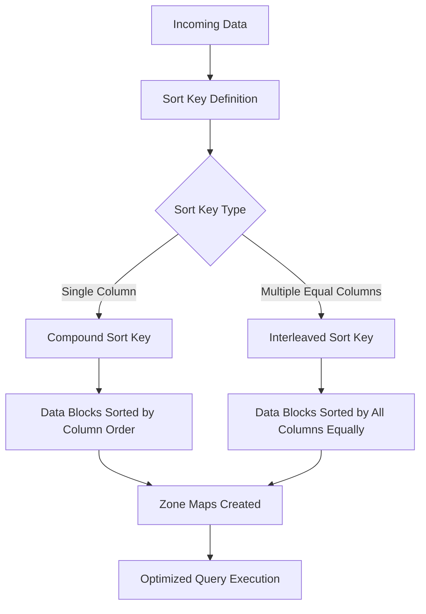
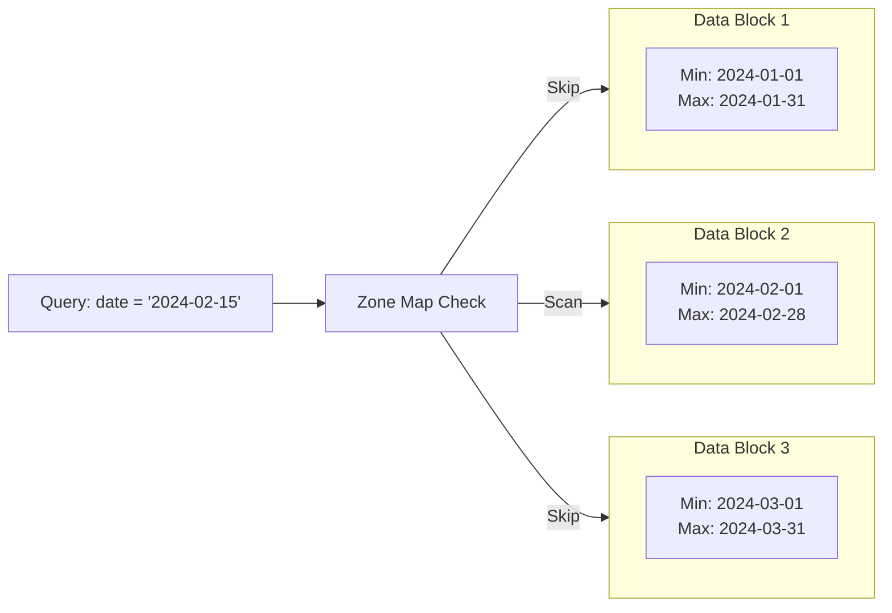
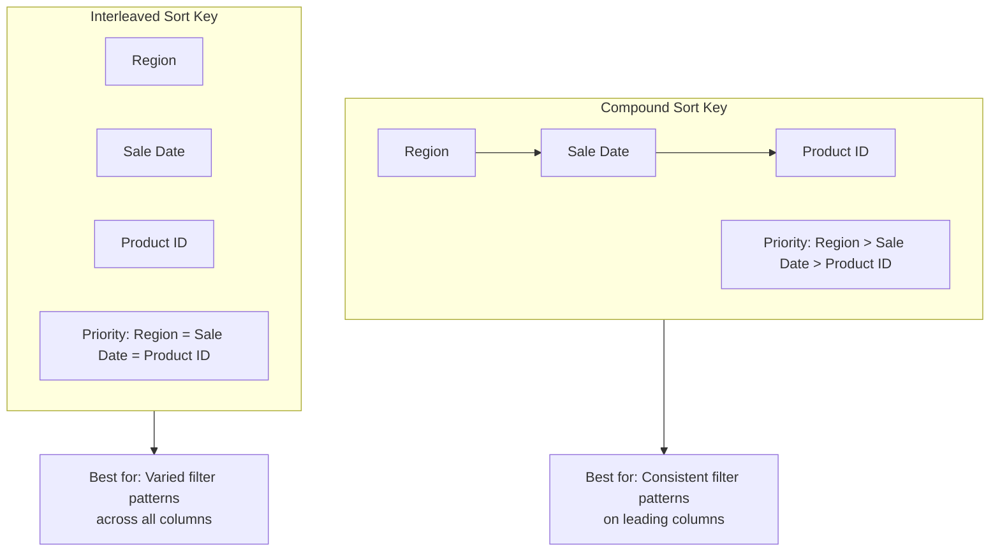
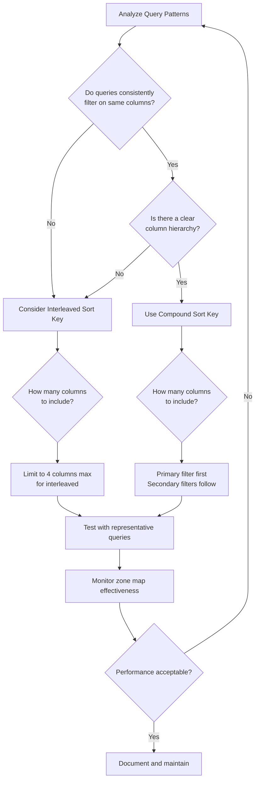

# How to Implement Sort Keys

Author: [nawazdhandala](https://github.com/nawazdhandala)

Tags: Data Warehouse, Sort Keys, Redshift, Query Optimization

Description: Learn to implement sort keys for optimizing data storage order and query performance in columnar databases.

---

Sort keys are one of the most powerful optimization techniques in columnar data warehouses like Amazon Redshift, Google BigQuery, and Snowflake. They determine the physical order in which data is stored on disk, directly impacting query performance through efficient data retrieval and zone map utilization.

### Understanding Sort Keys

Sort keys define how rows are physically ordered within each data block on disk. When you query data with predicates that match the sort key columns, the database can skip entire blocks of data that do not contain relevant values. This is accomplished through zone maps, which store the minimum and maximum values for each block.



### Zone Maps: The Foundation of Sort Key Efficiency

Zone maps are metadata structures that store the minimum and maximum values for each column within a 1 MB data block. When a query includes a filter condition, the query engine checks zone maps to determine which blocks need to be scanned.



When data is properly sorted, zone maps become highly effective because values are clustered together. Without sort keys, values are scattered across blocks, reducing the ability to skip irrelevant data.

### Compound Sort Keys

Compound sort keys sort data by multiple columns in a hierarchical order. The first column in the sort key definition has the highest priority, followed by subsequent columns. This works best when queries consistently filter on the leading columns.

```sql
-- Create a table with a compound sort key
-- Data will be sorted first by region, then by sale_date, then by product_id
-- This is optimal for queries that filter by region first
CREATE TABLE sales_data (
    sale_id         BIGINT IDENTITY(1,1),
    region          VARCHAR(50),
    sale_date       DATE,
    product_id      INTEGER,
    customer_id     INTEGER,
    quantity        INTEGER,
    unit_price      DECIMAL(10,2),
    total_amount    DECIMAL(12,2)
)
DISTKEY(region)
COMPOUND SORTKEY(region, sale_date, product_id);
```

Compound sort keys excel when queries follow a predictable pattern:

```sql
-- This query benefits greatly from the compound sort key
-- The optimizer can use zone maps to skip blocks efficiently
-- because we filter on the leading sort key column (region)
SELECT
    sale_date,
    SUM(total_amount) as daily_revenue
FROM sales_data
WHERE region = 'North America'
    AND sale_date BETWEEN '2024-01-01' AND '2024-03-31'
GROUP BY sale_date
ORDER BY sale_date;

-- This query also benefits because it uses both leading columns
-- The compound sort key hierarchy (region -> sale_date) matches the filter pattern
SELECT
    product_id,
    COUNT(*) as sales_count,
    SUM(quantity) as total_units
FROM sales_data
WHERE region = 'Europe'
    AND sale_date = '2024-02-15'
GROUP BY product_id;
```

However, compound sort keys lose effectiveness when queries skip leading columns:

```sql
-- This query will NOT benefit from the compound sort key
-- because it skips the leading column (region)
-- Zone maps cannot be used efficiently here
SELECT
    region,
    SUM(total_amount) as revenue
FROM sales_data
WHERE sale_date = '2024-02-15'  -- Filtering only on second sort key column
GROUP BY region;
```

### Interleaved Sort Keys

Interleaved sort keys give equal weight to each column in the sort key definition. They use a space-filling Z-order curve algorithm to interleave the sort order of all specified columns. This approach is beneficial when queries filter on different columns with roughly equal frequency.

```sql
-- Create a table with an interleaved sort key
-- All three columns (region, sale_date, product_id) have equal sort priority
-- Useful when queries filter on any combination of these columns
CREATE TABLE sales_analytics (
    sale_id         BIGINT IDENTITY(1,1),
    region          VARCHAR(50),
    sale_date       DATE,
    product_id      INTEGER,
    customer_id     INTEGER,
    category        VARCHAR(100),
    quantity        INTEGER,
    total_amount    DECIMAL(12,2)
)
DISTKEY(region)
INTERLEAVED SORTKEY(region, sale_date, product_id);
```

Interleaved sort keys work well for varied query patterns:

```sql
-- Query filtering only on region (works well with interleaved)
SELECT
    sale_date,
    SUM(total_amount) as revenue
FROM sales_analytics
WHERE region = 'Asia Pacific'
GROUP BY sale_date;

-- Query filtering only on sale_date (also works well)
-- Unlike compound sort keys, this query benefits from zone maps
SELECT
    region,
    product_id,
    SUM(quantity) as units_sold
FROM sales_analytics
WHERE sale_date BETWEEN '2024-06-01' AND '2024-06-30'
GROUP BY region, product_id;

-- Query filtering only on product_id (also efficient)
SELECT
    region,
    sale_date,
    SUM(total_amount) as revenue
FROM sales_analytics
WHERE product_id = 12345
GROUP BY region, sale_date;
```



### Trade-offs Between Compound and Interleaved Sort Keys

| Aspect | Compound Sort Key | Interleaved Sort Key |
|--------|-------------------|----------------------|
| Query Pattern | Best for consistent filters on leading columns | Best for varied filters on any column |
| Load Performance | Faster data loading | Slower data loading (2x overhead) |
| VACUUM Performance | Faster VACUUM operations | Slower VACUUM operations |
| Storage Overhead | Lower | Higher due to interleaving metadata |
| Zone Map Efficiency | High for leading columns, low for others | Moderate for all columns |

### Implementing Sort Keys: A Practical Example

Let us walk through a complete example of implementing sort keys for an e-commerce analytics table.

```sql
-- Step 1: Analyze your query patterns first
-- Run this query to understand common filter columns
-- Look at the Filter column in query plans
SELECT
    query,
    substring(querytxt, 1, 100) as query_preview,
    starttime
FROM stl_query
WHERE database = 'analytics_db'
    AND querytxt ILIKE '%orders%'
ORDER BY starttime DESC
LIMIT 100;

-- Step 2: Create the table with appropriate sort key
-- Based on analysis, we determine that most queries filter by:
-- 1. order_date (time-series queries are most common)
-- 2. customer_segment (for segmentation analysis)
-- 3. product_category (for category performance)
CREATE TABLE ecommerce_orders (
    order_id            BIGINT IDENTITY(1,1),
    order_date          DATE NOT NULL,
    customer_id         BIGINT NOT NULL,
    customer_segment    VARCHAR(50),
    product_id          INTEGER,
    product_category    VARCHAR(100),
    quantity            INTEGER,
    unit_price          DECIMAL(10,2),
    discount_percent    DECIMAL(5,2),
    total_amount        DECIMAL(12,2),
    shipping_region     VARCHAR(50),
    payment_method      VARCHAR(30),
    created_at          TIMESTAMP DEFAULT GETDATE()
)
DISTSTYLE KEY
DISTKEY(customer_id)
COMPOUND SORTKEY(order_date, customer_segment, product_category);

-- Step 3: Load data in sorted order when possible
-- This creates optimal zone maps from the start
COPY ecommerce_orders
FROM 's3://data-bucket/orders/'
IAM_ROLE 'arn:aws:iam::123456789:role/RedshiftCopyRole'
FORMAT AS PARQUET
SORTKEY order_date;
```

### Monitoring Sort Key Effectiveness

After implementing sort keys, monitor their effectiveness using system tables:

```sql
-- Check table sort percentage
-- A low percentage indicates the table needs VACUUM
-- Values below 80% typically indicate degraded query performance
SELECT
    "table" as table_name,
    unsorted as unsorted_percent,
    vacuum_sort_benefit
FROM svv_table_info
WHERE "table" = 'ecommerce_orders';

-- Analyze zone map effectiveness for a specific query
-- Look at rows_pre_filter vs rows to see zone map filtering
-- A high ratio means zone maps are working effectively
EXPLAIN
SELECT
    customer_segment,
    SUM(total_amount) as revenue
FROM ecommerce_orders
WHERE order_date BETWEEN '2024-01-01' AND '2024-01-31'
GROUP BY customer_segment;

-- Monitor block skipping through zone maps
-- This shows how many blocks were skipped vs scanned
-- Higher skip rates indicate better sort key effectiveness
SELECT
    query,
    segment,
    step,
    rows,
    rows_pre_filter,
    CASE
        WHEN rows_pre_filter > 0
        THEN ROUND((1 - (rows::FLOAT / rows_pre_filter)) * 100, 2)
        ELSE 0
    END as block_skip_percentage
FROM stl_scan
WHERE query = pg_last_query_id()
ORDER BY segment, step;
```

### Maintaining Sort Key Efficiency with VACUUM

Over time, as data is inserted and deleted, the sort order degrades. The VACUUM command reorganizes data to restore optimal sort order:

```sql
-- Full vacuum to resort and reclaim space
-- Run during maintenance windows as it can be resource intensive
-- This restores zone map effectiveness
VACUUM FULL ecommerce_orders;

-- Sort-only vacuum (faster, does not reclaim space)
-- Use when table has good disk utilization but poor sort order
VACUUM SORT ONLY ecommerce_orders;

-- Delete-only vacuum (reclaim space from deleted rows)
-- Use when sort order is good but deleted rows consume space
VACUUM DELETE ONLY ecommerce_orders;

-- Check vacuum progress
-- Monitor long-running vacuum operations
SELECT
    table_name,
    status,
    time_remaining_estimate
FROM svv_vacuum_progress;
```

### Sort Key Selection Strategy

Use this decision framework to select the right sort key strategy:



### Best Practices for Sort Key Implementation

1. **Analyze before implementing**: Study your query patterns using system tables before choosing a sort key strategy

2. **Start with compound sort keys**: They are simpler and have lower maintenance overhead. Switch to interleaved only if query patterns demand it

3. **Place most selective columns first**: For compound sort keys, columns with higher cardinality and more frequent filtering should come first

4. **Limit interleaved columns**: Do not include more than 4 columns in an interleaved sort key. The overhead increases exponentially

5. **Monitor and maintain**: Regularly check sort percentages and run VACUUM operations during maintenance windows

6. **Consider data loading order**: Loading pre-sorted data creates optimal zone maps immediately

```sql
-- Example: Checking if your sort key choice is effective
-- Run this after implementing sort keys and executing queries
SELECT
    ti.table_id,
    ti."table" as table_name,
    ti.sortkey1,
    ti.sortkey_num,
    ti.unsorted,
    qs.avg_elapsed_time_ms,
    qs.query_count
FROM svv_table_info ti
LEFT JOIN (
    SELECT
        tbl,
        AVG(elapsed) / 1000 as avg_elapsed_time_ms,
        COUNT(*) as query_count
    FROM stl_scan s
    JOIN stl_query q ON s.query = q.query
    WHERE q.starttime > DATEADD(day, -7, GETDATE())
    GROUP BY tbl
) qs ON ti.table_id = qs.tbl
WHERE ti."table" = 'ecommerce_orders';
```

### Conclusion

Sort keys are fundamental to achieving optimal query performance in columnar data warehouses. Compound sort keys work best when query patterns are predictable and filter on a consistent hierarchy of columns. Interleaved sort keys provide flexibility when queries filter on different columns with equal frequency, though they come with higher maintenance overhead.

The key to success is understanding your query patterns, implementing the appropriate sort key strategy, and maintaining sort order through regular VACUUM operations. Monitor zone map effectiveness using system tables and adjust your strategy as query patterns evolve.

**Related Reading:**

- [Understanding Distribution Keys in Redshift](https://oneuptime.com/blog/post/2026-02-12-optimize-redshift-distribution-and-sort-keys/view)
- [Query Optimization Techniques for Data Warehouses](https://oneuptime.com/blog/post/2026-02-13-query-optimization-data-warehouse/view)
- [Columnar Storage: How It Works](https://oneuptime.com/blog/post/2026-02-13-columnar-storage-explained/view)
