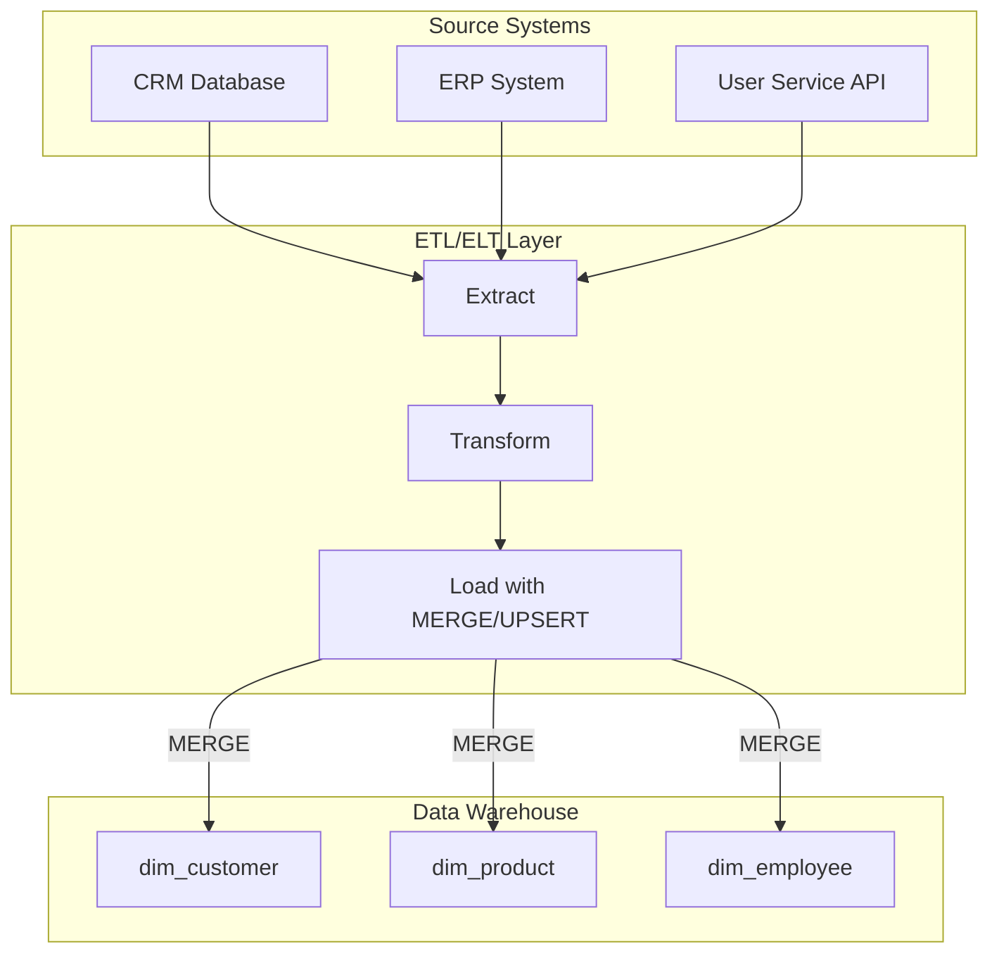
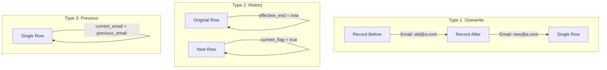

# How to Implement Type 1 SCD

Author: [nawazdhandala](https://github.com/nawazdhandala)

Tags: Data Warehouse, SCD, Slowly Changing Dimensions, ETL

Description: Learn to implement Type 1 SCD (Slowly Changing Dimensions) for overwriting old values with current values.

---

> In data warehousing, maintaining accurate and current dimension data is essential. **Type 1 SCD** is the simplest approach: when data changes, you overwrite the old value with the new one. No history, no complexity, just the current truth.

Slowly Changing Dimensions (SCD) are a core concept in dimensional modeling. Type 1 SCD is the most straightforward strategy, where you simply update the existing record with new values, discarding historical data. This guide covers when to use Type 1 SCD, implementation patterns in SQL and dbt, and practical examples you can apply immediately.

---

## Table of Contents

1. What is Type 1 SCD?
2. When to Use Type 1 SCD
3. Type 1 SCD Architecture
4. Implementation in SQL
5. Implementation in dbt
6. Handling Batch Updates
7. Best Practices
8. Common Pitfalls
9. Type 1 vs Other SCD Types
10. Summary

---

## 1. What is Type 1 SCD?

Type 1 SCD is the simplest form of handling dimension changes in a data warehouse. When a source system value changes, you update the corresponding dimension record to reflect the new value. The previous value is permanently overwritten.

| Characteristic | Type 1 SCD |
|----------------|------------|
| History Preserved | No |
| Complexity | Low |
| Storage Requirements | Minimal |
| Query Performance | Excellent |
| Use Case | Correcting errors, non-essential attributes |

**Example scenario**: A customer changes their email address from `old@example.com` to `new@example.com`. With Type 1 SCD, you update the customer record and the old email is gone forever.


---

## 2. When to Use Type 1 SCD

Type 1 SCD is appropriate when:

| Scenario | Why Type 1 Works |
|----------|------------------|
| Data corrections | Fixing typos or errors does not require history |
| Non-analytical attributes | Phone numbers, email addresses rarely need historical tracking |
| Compliance requirements | GDPR/CCPA may require ability to fully update/delete personal data |
| Storage constraints | When history preservation is not worth the storage cost |
| Real-time dashboards | When only current state matters for reporting |

**Do NOT use Type 1 SCD when**:

- You need to track historical changes for auditing
- Business questions require point-in-time analysis
- Facts are linked to dimension versions (requires Type 2)
- Regulatory requirements mandate historical record keeping

---

## 3. Type 1 SCD Architecture



The key operation in Type 1 SCD is the **MERGE** (or UPSERT) statement. This allows you to:

1. **INSERT** new records that do not exist in the dimension
2. **UPDATE** existing records when values have changed
3. Perform both operations in a single, atomic transaction

---

## 4. Implementation in SQL

### Basic Table Structure

```sql
-- Create the dimension table for customers
-- This table stores the current state of each customer
CREATE TABLE dim_customer (
    customer_key    BIGINT PRIMARY KEY,           -- Surrogate key for the dimension
    customer_id     VARCHAR(50) NOT NULL UNIQUE,  -- Natural key from source system
    first_name      VARCHAR(100),
    last_name       VARCHAR(100),
    email           VARCHAR(255),
    phone           VARCHAR(50),
    address_line1   VARCHAR(255),
    city            VARCHAR(100),
    state           VARCHAR(50),
    country         VARCHAR(100),
    created_at      TIMESTAMP DEFAULT CURRENT_TIMESTAMP,
    updated_at      TIMESTAMP DEFAULT CURRENT_TIMESTAMP
);

-- Create index on natural key for efficient lookups during MERGE
CREATE INDEX idx_dim_customer_natural_key ON dim_customer(customer_id);
```

### Staging Table for Incoming Data

```sql
-- Staging table to hold incoming data from source systems
-- This table is truncated and reloaded before each ETL run
CREATE TABLE stg_customer (
    customer_id     VARCHAR(50) NOT NULL,
    first_name      VARCHAR(100),
    last_name       VARCHAR(100),
    email           VARCHAR(255),
    phone           VARCHAR(50),
    address_line1   VARCHAR(255),
    city            VARCHAR(100),
    state           VARCHAR(50),
    country         VARCHAR(100),
    loaded_at       TIMESTAMP DEFAULT CURRENT_TIMESTAMP
);
```

### MERGE Statement (SQL Server / Snowflake / BigQuery)

```sql
-- Type 1 SCD MERGE: Update existing records, insert new ones
-- This is the core pattern for Type 1 SCD implementation
MERGE INTO dim_customer AS target
USING stg_customer AS source
ON target.customer_id = source.customer_id

-- When a matching record exists, update all columns
WHEN MATCHED AND (
    target.first_name    <> source.first_name    OR
    target.last_name     <> source.last_name     OR
    target.email         <> source.email         OR
    target.phone         <> source.phone         OR
    target.address_line1 <> source.address_line1 OR
    target.city          <> source.city          OR
    target.state         <> source.state         OR
    target.country       <> source.country
) THEN UPDATE SET
    target.first_name    = source.first_name,
    target.last_name     = source.last_name,
    target.email         = source.email,
    target.phone         = source.phone,
    target.address_line1 = source.address_line1,
    target.city          = source.city,
    target.state         = source.state,
    target.country       = source.country,
    target.updated_at    = CURRENT_TIMESTAMP

-- When no matching record exists, insert a new row
WHEN NOT MATCHED THEN INSERT (
    customer_key,
    customer_id,
    first_name,
    last_name,
    email,
    phone,
    address_line1,
    city,
    state,
    country,
    created_at,
    updated_at
) VALUES (
    -- Generate surrogate key (method varies by database)
    (SELECT COALESCE(MAX(customer_key), 0) + 1 FROM dim_customer),
    source.customer_id,
    source.first_name,
    source.last_name,
    source.email,
    source.phone,
    source.address_line1,
    source.city,
    source.state,
    source.country,
    CURRENT_TIMESTAMP,
    CURRENT_TIMESTAMP
);
```

### PostgreSQL Implementation (INSERT ON CONFLICT)

PostgreSQL does not support the MERGE statement directly. Use INSERT ON CONFLICT instead:

```sql
-- PostgreSQL Type 1 SCD using INSERT ON CONFLICT (UPSERT)
-- Requires a unique constraint on the natural key
INSERT INTO dim_customer (
    customer_id,
    first_name,
    last_name,
    email,
    phone,
    address_line1,
    city,
    state,
    country,
    created_at,
    updated_at
)
SELECT
    customer_id,
    first_name,
    last_name,
    email,
    phone,
    address_line1,
    city,
    state,
    country,
    CURRENT_TIMESTAMP,
    CURRENT_TIMESTAMP
FROM stg_customer

-- On conflict with the natural key, update all columns
ON CONFLICT (customer_id)
DO UPDATE SET
    first_name    = EXCLUDED.first_name,
    last_name     = EXCLUDED.last_name,
    email         = EXCLUDED.email,
    phone         = EXCLUDED.phone,
    address_line1 = EXCLUDED.address_line1,
    city          = EXCLUDED.city,
    state         = EXCLUDED.state,
    country       = EXCLUDED.country,
    updated_at    = CURRENT_TIMESTAMP
-- Only update if something actually changed (optional optimization)
WHERE
    dim_customer.first_name    <> EXCLUDED.first_name    OR
    dim_customer.last_name     <> EXCLUDED.last_name     OR
    dim_customer.email         <> EXCLUDED.email         OR
    dim_customer.phone         <> EXCLUDED.phone         OR
    dim_customer.address_line1 <> EXCLUDED.address_line1 OR
    dim_customer.city          <> EXCLUDED.city          OR
    dim_customer.state         <> EXCLUDED.state         OR
    dim_customer.country       <> EXCLUDED.country;
```

### MySQL Implementation (INSERT ON DUPLICATE KEY)

```sql
-- MySQL Type 1 SCD using INSERT ON DUPLICATE KEY UPDATE
-- Requires a unique constraint on customer_id
INSERT INTO dim_customer (
    customer_id,
    first_name,
    last_name,
    email,
    phone,
    address_line1,
    city,
    state,
    country,
    created_at,
    updated_at
)
SELECT
    customer_id,
    first_name,
    last_name,
    email,
    phone,
    address_line1,
    city,
    state,
    country,
    NOW(),
    NOW()
FROM stg_customer

-- On duplicate key (natural key collision), update the record
ON DUPLICATE KEY UPDATE
    first_name    = VALUES(first_name),
    last_name     = VALUES(last_name),
    email         = VALUES(email),
    phone         = VALUES(phone),
    address_line1 = VALUES(address_line1),
    city          = VALUES(city),
    state         = VALUES(state),
    country       = VALUES(country),
    updated_at    = NOW();
```

---

## 5. Implementation in dbt

dbt (data build tool) provides native support for SCD Type 1 through its incremental models. Here is a complete implementation:

### dbt Model: dim_customer.sql

```sql
-- models/marts/dim_customer.sql
-- Type 1 SCD implementation using dbt incremental model

{{
  config(
    materialized='incremental',
    unique_key='customer_id',
    incremental_strategy='merge',
    merge_update_columns=['first_name', 'last_name', 'email', 'phone',
                          'address_line1', 'city', 'state', 'country', 'updated_at']
  )
}}

-- CTE to transform and prepare source data
WITH source_customers AS (
    SELECT
        -- Natural key from source system
        customer_id,

        -- Dimension attributes (these will overwrite on changes)
        TRIM(first_name) AS first_name,
        TRIM(last_name) AS last_name,
        LOWER(TRIM(email)) AS email,
        phone,
        address_line1,
        city,
        state,
        country,

        -- Metadata columns
        CURRENT_TIMESTAMP AS updated_at
    FROM {{ source('crm', 'customers') }}

    -- Only process records modified since last run (for incremental)
    
    WHERE modified_date > (SELECT MAX(updated_at) FROM {{ this }})
    
),

-- Add surrogate key generation
final AS (
    SELECT
        -- Generate surrogate key using dbt_utils
        {{ dbt_utils.generate_surrogate_key(['customer_id']) }} AS customer_key,
        customer_id,
        first_name,
        last_name,
        email,
        phone,
        address_line1,
        city,
        state,
        country,

        -- Track when record was first created vs last updated
        
        COALESCE(
            (SELECT created_at FROM {{ this }} WHERE customer_id = source_customers.customer_id),
            CURRENT_TIMESTAMP
        ) AS created_at,
        
        CURRENT_TIMESTAMP AS created_at,
        

        updated_at
    FROM source_customers
)

SELECT * FROM final
```

### dbt Schema Definition

```yaml
# models/marts/schema.yml
version: 2

models:
  - name: dim_customer
    description: |
      Customer dimension table implementing Type 1 SCD.
      Changes to customer attributes overwrite existing values.
      No historical tracking is maintained.

    config:
      tags: ['dimension', 'scd-type-1']

    columns:
      - name: customer_key
        description: Surrogate key for the dimension (hash of customer_id)
        tests:
          - unique
          - not_null

      - name: customer_id
        description: Natural key from source CRM system
        tests:
          - unique
          - not_null

      - name: first_name
        description: Customer first name (current value)

      - name: last_name
        description: Customer last name (current value)

      - name: email
        description: Customer email address (current value, lowercased)
        tests:
          - not_null

      - name: phone
        description: Customer phone number (current value)

      - name: address_line1
        description: Primary address line (current value)

      - name: city
        description: City (current value)

      - name: state
        description: State or province (current value)

      - name: country
        description: Country (current value)

      - name: created_at
        description: Timestamp when record was first inserted
        tests:
          - not_null

      - name: updated_at
        description: Timestamp of most recent update
        tests:
          - not_null
```

### dbt Macro for Reusable Type 1 Logic

```sql
-- macros/scd_type1_merge.sql
-- Reusable macro for Type 1 SCD pattern


{#
    Generates a Type 1 SCD merge statement

    Args:
        source_table: Source table or CTE name
        target_table: Target dimension table
        natural_key: Column name of the natural key
        columns_to_update: List of columns to update on match

    Example usage:
        {{ scd_type1_merge('stg_customers', 'dim_customer', 'customer_id',
           ['first_name', 'last_name', 'email', 'phone']) }}
#}

MERGE INTO {{ target_table }} AS target
USING {{ source_table }} AS source
ON target.{{ natural_key }} = source.{{ natural_key }}

WHEN MATCHED AND (
    
    target.{{ col }} <> source.{{ col }}{{ ' OR' if not loop.last else '' }}
    
) THEN UPDATE SET
    
    target.{{ col }} = source.{{ col }}{{ ',' if not loop.last else '' }}
    
    , target.updated_at = CURRENT_TIMESTAMP

WHEN NOT MATCHED THEN INSERT (
    {{ natural_key }},
    
    {{ col }},
    
    created_at,
    updated_at
) VALUES (
    source.{{ natural_key }},
    
    source.{{ col }},
    
    CURRENT_TIMESTAMP,
    CURRENT_TIMESTAMP
)


```

---

## 6. Handling Batch Updates

For large-scale data warehouses, batch processing patterns improve performance:


### Checksum-Based Change Detection

```sql
-- Use checksums to efficiently detect changes
-- This reduces comparison overhead for wide tables

-- Step 1: Add checksum column to dimension table
ALTER TABLE dim_customer ADD COLUMN row_checksum BIGINT;

-- Step 2: Create staging table with checksum
CREATE TABLE stg_customer_with_checksum AS
SELECT
    customer_id,
    first_name,
    last_name,
    email,
    phone,
    address_line1,
    city,
    state,
    country,
    -- Generate checksum from all updateable columns
    -- Using MD5 hash converted to bigint for efficiency
    ABS(HASHBYTES('MD5',
        CONCAT_WS('|',
            COALESCE(first_name, ''),
            COALESCE(last_name, ''),
            COALESCE(email, ''),
            COALESCE(phone, ''),
            COALESCE(address_line1, ''),
            COALESCE(city, ''),
            COALESCE(state, ''),
            COALESCE(country, '')
        )
    ) % 9223372036854775807) AS row_checksum
FROM stg_customer;

-- Step 3: MERGE using checksum comparison (much faster)
MERGE INTO dim_customer AS target
USING stg_customer_with_checksum AS source
ON target.customer_id = source.customer_id

-- Only update if checksum differs (single comparison vs many)
WHEN MATCHED AND target.row_checksum <> source.row_checksum
THEN UPDATE SET
    target.first_name    = source.first_name,
    target.last_name     = source.last_name,
    target.email         = source.email,
    target.phone         = source.phone,
    target.address_line1 = source.address_line1,
    target.city          = source.city,
    target.state         = source.state,
    target.country       = source.country,
    target.row_checksum  = source.row_checksum,
    target.updated_at    = CURRENT_TIMESTAMP

WHEN NOT MATCHED THEN INSERT (
    customer_id, first_name, last_name, email, phone,
    address_line1, city, state, country, row_checksum,
    created_at, updated_at
) VALUES (
    source.customer_id, source.first_name, source.last_name,
    source.email, source.phone, source.address_line1,
    source.city, source.state, source.country, source.row_checksum,
    CURRENT_TIMESTAMP, CURRENT_TIMESTAMP
);
```

### Parallel Processing Pattern

```sql
-- For very large dimensions, process in parallel chunks
-- This example uses modulo partitioning on the natural key

-- Process chunk 1 of 4 (can run concurrently)
MERGE INTO dim_customer AS target
USING (
    SELECT * FROM stg_customer
    WHERE ABS(HASHBYTES('MD5', customer_id) % 4) = 0
) AS source
ON target.customer_id = source.customer_id
WHEN MATCHED AND /* change detection */ THEN UPDATE SET /* ... */
WHEN NOT MATCHED THEN INSERT /* ... */;

-- Process chunk 2 of 4
MERGE INTO dim_customer AS target
USING (
    SELECT * FROM stg_customer
    WHERE ABS(HASHBYTES('MD5', customer_id) % 4) = 1
) AS source
ON target.customer_id = source.customer_id
WHEN MATCHED AND /* change detection */ THEN UPDATE SET /* ... */
WHEN NOT MATCHED THEN INSERT /* ... */;

-- Continue for chunks 3 and 4...
```

---

## 7. Best Practices

### Surrogate Keys

Always use surrogate keys in dimension tables:

```sql
-- Good: Surrogate key isolates dimension from source system changes
CREATE TABLE dim_customer (
    customer_key    BIGINT PRIMARY KEY,  -- Surrogate key
    customer_id     VARCHAR(50) UNIQUE,  -- Natural key (for lookups)
    -- ... attributes
);

-- Bad: Using natural key as primary key
CREATE TABLE dim_customer (
    customer_id     VARCHAR(50) PRIMARY KEY,  -- Tied to source system
    -- ... attributes
);
```

### NULL Handling

Handle NULLs explicitly in change detection:

```sql
-- Use COALESCE to handle NULL comparisons correctly
-- NULL <> 'value' returns NULL (unknown), not TRUE
WHEN MATCHED AND (
    COALESCE(target.email, '') <> COALESCE(source.email, '') OR
    COALESCE(target.phone, '') <> COALESCE(source.phone, '')
) THEN UPDATE SET /* ... */
```

### Audit Columns

Always include audit columns:

```sql
-- Essential audit columns for Type 1 SCD
CREATE TABLE dim_customer (
    -- ... business columns ...

    created_at      TIMESTAMP NOT NULL DEFAULT CURRENT_TIMESTAMP,
    updated_at      TIMESTAMP NOT NULL DEFAULT CURRENT_TIMESTAMP,
    source_system   VARCHAR(50),        -- Which system provided the data
    etl_batch_id    BIGINT              -- Which ETL run processed this record
);
```

### Indexing Strategy

```sql
-- Index the natural key for MERGE join performance
CREATE INDEX idx_customer_natural_key ON dim_customer(customer_id);

-- Index updated_at for incremental extraction queries
CREATE INDEX idx_customer_updated ON dim_customer(updated_at);

-- Consider covering index if you frequently query specific columns
CREATE INDEX idx_customer_email_lookup ON dim_customer(email) INCLUDE (customer_key, first_name, last_name);
```

---

## 8. Common Pitfalls

### Pitfall 1: Not Handling Deletes

Type 1 SCD typically does not handle deletes. Decide on a strategy:

```sql
-- Option A: Soft delete with flag
ALTER TABLE dim_customer ADD COLUMN is_deleted BOOLEAN DEFAULT FALSE;

-- Mark records as deleted (soft delete)
UPDATE dim_customer
SET is_deleted = TRUE, updated_at = CURRENT_TIMESTAMP
WHERE customer_id NOT IN (SELECT customer_id FROM stg_customer)
  AND is_deleted = FALSE;

-- Option B: Hard delete (removes row entirely)
DELETE FROM dim_customer
WHERE customer_id NOT IN (SELECT customer_id FROM stg_customer);

-- Option C: Unknown member (replace with placeholder)
UPDATE dim_customer
SET first_name = 'Unknown', last_name = 'Unknown', email = 'unknown@deleted'
WHERE customer_id NOT IN (SELECT customer_id FROM stg_customer);
```

### Pitfall 2: Duplicate Natural Keys in Source

```sql
-- Always deduplicate before MERGE
WITH deduplicated AS (
    SELECT
        customer_id,
        first_name,
        last_name,
        email,
        -- Keep most recent record per natural key
        ROW_NUMBER() OVER (
            PARTITION BY customer_id
            ORDER BY loaded_at DESC
        ) AS rn
    FROM stg_customer
)
SELECT * FROM deduplicated WHERE rn = 1;
```

### Pitfall 3: Missing Transaction Control

```sql
-- Wrap MERGE in transaction for atomicity
BEGIN TRANSACTION;

-- Execute the MERGE
MERGE INTO dim_customer AS target
USING stg_customer AS source
ON target.customer_id = source.customer_id
/* ... */;

-- Verify row counts before committing
DECLARE @rows_affected INT = @@ROWCOUNT;
IF @rows_affected < 0
BEGIN
    ROLLBACK TRANSACTION;
    RAISERROR('MERGE failed', 16, 1);
END
ELSE
BEGIN
    COMMIT TRANSACTION;
END
```

---

## 9. Type 1 vs Other SCD Types



| Aspect | Type 1 | Type 2 | Type 3 |
|--------|--------|--------|--------|
| History | None | Full | Limited (1 previous) |
| Storage | Minimal | High | Medium |
| Complexity | Low | High | Medium |
| Query Performance | Best | Slower (versioning) | Good |
| Point-in-Time Analysis | No | Yes | Partial |
| Fact Table Impact | None | Requires version keys | None |

### Decision Matrix

| Scenario | Recommended Type |
|----------|------------------|
| Correcting data entry errors | Type 1 |
| Tracking address changes for shipping analysis | Type 2 |
| Storing current and previous value only | Type 3 |
| GDPR right to erasure compliance | Type 1 |
| Customer lifetime value with historical segments | Type 2 |
| Simple reporting, current state only | Type 1 |

---

## 10. Summary

Type 1 SCD is the simplest and most performant approach to handling dimension changes. It works by overwriting existing records with new values, maintaining only the current state.

| Concept | Description |
|---------|-------------|
| Core Operation | MERGE/UPSERT to update existing or insert new records |
| History | Not preserved; old values are permanently overwritten |
| Best For | Data corrections, non-analytical attributes, GDPR compliance |
| Key Implementation | Use staging tables, natural key matching, checksum optimization |
| Performance | Excellent due to minimal storage and simple queries |

**Key Takeaways**:

1. Use Type 1 SCD when history is not required
2. Always use surrogate keys alongside natural keys
3. Implement proper NULL handling in change detection
4. Consider checksum-based change detection for wide tables
5. Handle deletes explicitly with soft delete or hard delete strategy
6. Wrap operations in transactions for atomicity
7. Use dbt incremental models for maintainable implementations

---

*Building a data warehouse? Consider using [OneUptime](https://oneuptime.com) to monitor your ETL pipelines and ensure data freshness with alerts when SCD jobs fail or fall behind schedule.*

---

### See Also

- [Data Warehouse Best Practices](https://www.kimballgroup.com/data-warehouse-business-intelligence-resources/kimball-techniques/dimensional-modeling-techniques/)
- [dbt Documentation on Incremental Models](https://docs.getdbt.com/docs/build/incremental-models)

**Related Concepts**:

- Type 2 SCD for full historical tracking with effective dates
- Type 3 SCD for storing current and previous values
- Type 6 SCD (Hybrid) combining Type 1, 2, and 3 approaches
