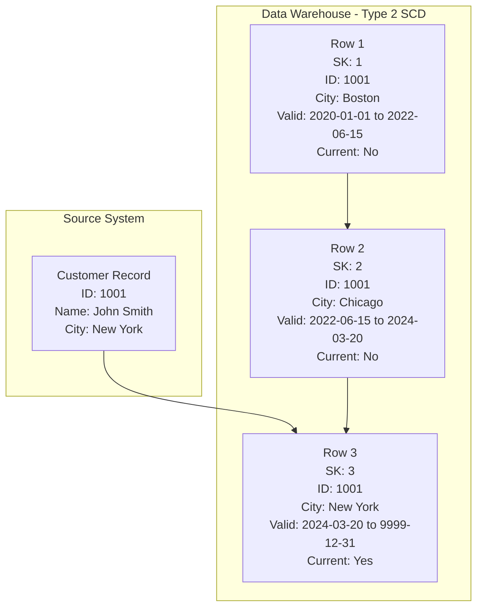
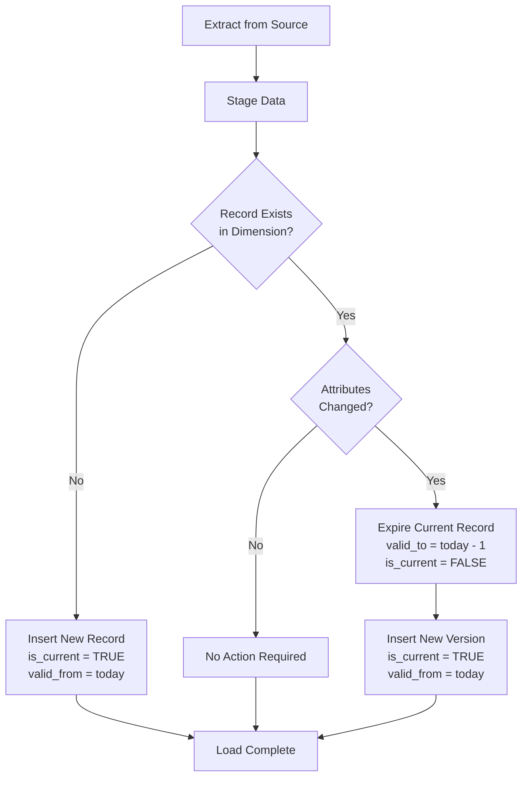

# How to Create Type 2 SCD

Author: [nawazdhandala](https://github.com/nawazdhandala)

Tags: Data Warehouse, SCD, History Tracking, ETL

Description: Learn to create Type 2 SCD for tracking historical changes with versioned dimension records.

---

> Type 2 Slowly Changing Dimensions (SCD) preserve complete history by creating new records for each change. This technique is essential for data warehouses where understanding how data evolved over time is critical for accurate historical reporting and trend analysis.

When business data changes, such as a customer moving to a new address or an employee getting promoted, you need to decide how to handle these changes in your data warehouse. Type 2 SCD solves this by maintaining a full audit trail of every change, allowing you to analyze data as it existed at any point in time.

---

## Understanding SCD Types

Before diving into Type 2, let's understand the three main approaches:

| Type | Behavior | History | Use Case |
|------|----------|---------|----------|
| Type 1 | Overwrite old values | No history | Corrections, typos |
| Type 2 | Add new row with version | Full history | Address changes, status changes |
| Type 3 | Add new column for previous value | Limited history | Only need previous value |

---

## Type 2 SCD Architecture

Type 2 SCD creates a new row whenever a tracked attribute changes, preserving the complete history of that record.



### Key Components

**Surrogate Key**: A system-generated unique identifier for each version of a record. Unlike natural keys from source systems, surrogate keys uniquely identify each historical version.

**Natural Key**: The business key from the source system (e.g., customer_id). This remains constant across all versions of the same entity.

**Valid From/To Dates**: Define the time period when each version was current. The "valid_to" date of 9999-12-31 typically indicates the current active record.

**Current Flag**: A boolean indicator showing which record is the currently active version. This simplifies queries for current data.

---

## Table Design

### Basic Structure

```sql
-- Type 2 SCD table for customer dimension
-- This table tracks all historical changes to customer attributes
CREATE TABLE dim_customer (
    -- Surrogate key: unique identifier for each version
    -- Auto-incremented to ensure uniqueness across all versions
    customer_sk BIGINT IDENTITY(1,1) PRIMARY KEY,

    -- Natural key: business identifier from source system
    -- This stays constant across all versions of the same customer
    customer_id VARCHAR(50) NOT NULL,

    -- Type 2 tracked attributes: changes create new versions
    -- These are the fields we want to preserve history for
    customer_name VARCHAR(200) NOT NULL,
    email VARCHAR(255),
    phone VARCHAR(50),
    address_line1 VARCHAR(200),
    address_line2 VARCHAR(200),
    city VARCHAR(100),
    state VARCHAR(50),
    postal_code VARCHAR(20),
    country VARCHAR(100),
    customer_segment VARCHAR(50),

    -- Type 1 attributes: changes overwrite all versions
    -- Corrections that should be reflected in history
    data_quality_score DECIMAL(5,2),

    -- SCD metadata columns
    -- valid_from: when this version became effective
    valid_from DATE NOT NULL,
    -- valid_to: when this version was superseded (9999-12-31 = current)
    valid_to DATE NOT NULL DEFAULT '9999-12-31',
    -- is_current: flag for easy filtering of current records
    is_current BOOLEAN NOT NULL DEFAULT TRUE,

    -- Audit columns for tracking ETL processes
    created_at TIMESTAMP DEFAULT CURRENT_TIMESTAMP,
    updated_at TIMESTAMP DEFAULT CURRENT_TIMESTAMP,
    etl_batch_id BIGINT,
    source_system VARCHAR(50)
);

-- Index for efficient lookups by natural key
CREATE INDEX idx_customer_natural_key ON dim_customer(customer_id);

-- Index for filtering current records
CREATE INDEX idx_customer_current ON dim_customer(is_current) WHERE is_current = TRUE;

-- Index for point-in-time queries
CREATE INDEX idx_customer_validity ON dim_customer(customer_id, valid_from, valid_to);
```

---

## ETL Process Flow

The ETL process for Type 2 SCD involves detecting changes and managing record versions.



---

## SQL Implementation

### Merge Statement Approach

The MERGE statement provides an elegant way to handle Type 2 SCD logic in a single operation.

```sql
-- Type 2 SCD merge procedure using staging table approach
-- This procedure handles inserts, updates, and expiration in one operation

-- Step 1: Create a staging table for incoming data
CREATE TEMPORARY TABLE stg_customer AS
SELECT
    customer_id,
    customer_name,
    email,
    phone,
    address_line1,
    address_line2,
    city,
    state,
    postal_code,
    country,
    customer_segment,
    data_quality_score,
    CURRENT_DATE as load_date
FROM source_customer_table;

-- Step 2: Identify records that have changed
-- Compare staging data against current dimension records
CREATE TEMPORARY TABLE changed_records AS
SELECT
    s.customer_id,
    s.customer_name,
    s.email,
    s.phone,
    s.address_line1,
    s.address_line2,
    s.city,
    s.state,
    s.postal_code,
    s.country,
    s.customer_segment,
    s.data_quality_score,
    s.load_date,
    -- Flag to indicate if this is a new customer or changed existing
    CASE WHEN d.customer_sk IS NULL THEN 'INSERT' ELSE 'UPDATE' END as action_type
FROM stg_customer s
LEFT JOIN dim_customer d
    ON s.customer_id = d.customer_id
    AND d.is_current = TRUE
WHERE
    -- New record: no existing current record found
    d.customer_sk IS NULL
    OR
    -- Changed record: at least one tracked attribute differs
    -- Using COALESCE to handle NULL comparisons correctly
    (
        COALESCE(s.customer_name, '') <> COALESCE(d.customer_name, '') OR
        COALESCE(s.email, '') <> COALESCE(d.email, '') OR
        COALESCE(s.phone, '') <> COALESCE(d.phone, '') OR
        COALESCE(s.address_line1, '') <> COALESCE(d.address_line1, '') OR
        COALESCE(s.city, '') <> COALESCE(d.city, '') OR
        COALESCE(s.state, '') <> COALESCE(d.state, '') OR
        COALESCE(s.postal_code, '') <> COALESCE(d.postal_code, '') OR
        COALESCE(s.country, '') <> COALESCE(d.country, '') OR
        COALESCE(s.customer_segment, '') <> COALESCE(d.customer_segment, '')
    );

-- Step 3: Expire old records that have changes
-- Set valid_to to yesterday and is_current to FALSE
UPDATE dim_customer d
SET
    valid_to = CURRENT_DATE - INTERVAL '1 day',
    is_current = FALSE,
    updated_at = CURRENT_TIMESTAMP
WHERE d.customer_id IN (
    SELECT customer_id
    FROM changed_records
    WHERE action_type = 'UPDATE'
)
AND d.is_current = TRUE;

-- Step 4: Insert new versions for changed records and new records
INSERT INTO dim_customer (
    customer_id,
    customer_name,
    email,
    phone,
    address_line1,
    address_line2,
    city,
    state,
    postal_code,
    country,
    customer_segment,
    data_quality_score,
    valid_from,
    valid_to,
    is_current,
    created_at,
    etl_batch_id,
    source_system
)
SELECT
    customer_id,
    customer_name,
    email,
    phone,
    address_line1,
    address_line2,
    city,
    state,
    postal_code,
    country,
    customer_segment,
    data_quality_score,
    load_date,                    -- valid_from = load date
    '9999-12-31',                 -- valid_to = far future date
    TRUE,                         -- is_current = TRUE for new version
    CURRENT_TIMESTAMP,            -- created_at
    @current_batch_id,            -- ETL batch identifier
    'CRM_SYSTEM'                  -- source system name
FROM changed_records;

-- Step 5: Handle Type 1 updates (corrections applied to all versions)
-- Update data_quality_score across all historical versions
UPDATE dim_customer d
SET
    data_quality_score = s.data_quality_score,
    updated_at = CURRENT_TIMESTAMP
FROM stg_customer s
WHERE d.customer_id = s.customer_id
AND d.data_quality_score <> s.data_quality_score;

-- Clean up temporary tables
DROP TABLE IF EXISTS stg_customer;
DROP TABLE IF EXISTS changed_records;
```

### Using MERGE Statement (SQL Server / Snowflake)

```sql
-- Type 2 SCD using MERGE statement
-- This approach combines detection and action in one statement

-- First, expire existing current records that have changes
MERGE INTO dim_customer AS target
USING (
    SELECT
        s.customer_id,
        s.customer_name,
        s.email,
        s.phone,
        s.city,
        s.state,
        s.postal_code,
        s.country,
        s.customer_segment
    FROM stg_customer s
) AS source
ON target.customer_id = source.customer_id
   AND target.is_current = TRUE
WHEN MATCHED AND (
    -- Check if any Type 2 attribute has changed
    COALESCE(target.customer_name, '') <> COALESCE(source.customer_name, '') OR
    COALESCE(target.email, '') <> COALESCE(source.email, '') OR
    COALESCE(target.city, '') <> COALESCE(source.city, '') OR
    COALESCE(target.state, '') <> COALESCE(source.state, '') OR
    COALESCE(target.customer_segment, '') <> COALESCE(source.customer_segment, '')
)
THEN UPDATE SET
    valid_to = CURRENT_DATE - 1,
    is_current = FALSE,
    updated_at = CURRENT_TIMESTAMP;

-- Then insert new versions and new records
MERGE INTO dim_customer AS target
USING (
    SELECT
        s.*,
        d.customer_sk as existing_sk
    FROM stg_customer s
    LEFT JOIN dim_customer d
        ON s.customer_id = d.customer_id
        AND d.is_current = TRUE
    WHERE
        d.customer_sk IS NULL  -- New record
        OR (                   -- Changed record (now expired above)
            COALESCE(s.customer_name, '') <> COALESCE(d.customer_name, '') OR
            COALESCE(s.email, '') <> COALESCE(d.email, '') OR
            COALESCE(s.city, '') <> COALESCE(d.city, '')
        )
) AS source
ON 1 = 0  -- Force INSERT for all matched source records
WHEN NOT MATCHED THEN INSERT (
    customer_id, customer_name, email, phone, city, state,
    postal_code, country, customer_segment,
    valid_from, valid_to, is_current
)
VALUES (
    source.customer_id, source.customer_name, source.email,
    source.phone, source.city, source.state,
    source.postal_code, source.country, source.customer_segment,
    CURRENT_DATE, '9999-12-31', TRUE
);
```

---

## dbt Implementation

dbt (data build tool) provides excellent support for Type 2 SCD through its snapshot feature.

### dbt Snapshot Model

```sql
-- snapshots/customer_snapshot.sql
-- dbt snapshot model for Type 2 SCD on customer dimension



{{
    config(
        -- Target schema where snapshot table will be created
        target_schema='snapshots',

        -- Unique key: the natural business key from source
        unique_key='customer_id',

        -- Strategy: 'timestamp' uses updated_at column to detect changes
        -- Alternative: 'check' compares specified columns
        strategy='timestamp',

        -- Column containing the last modified timestamp
        updated_at='updated_at',

        -- Invalidate hard deletes: track when records are deleted
        invalidate_hard_deletes=true
    )
}}

-- Select current data from source
-- dbt will automatically manage SCD Type 2 versioning
SELECT
    -- Natural key: identifies the business entity
    customer_id,

    -- Attributes to track: changes trigger new versions
    customer_name,
    email,
    phone,
    address_line1,
    address_line2,
    city,
    state,
    postal_code,
    country,
    customer_segment,

    -- Timestamp for change detection
    updated_at,

    -- Additional metadata from source
    created_at,
    source_system

FROM {{ source('crm', 'customers') }}

-- Optional: filter to only active customers in source
WHERE is_deleted = FALSE


```

### dbt Snapshot with Check Strategy

```sql
-- snapshots/product_snapshot.sql
-- Using check strategy when source lacks reliable timestamp



{{
    config(
        target_schema='snapshots',
        unique_key='product_id',

        -- Check strategy: compare specific columns for changes
        strategy='check',

        -- Columns to monitor: any change triggers new version
        check_cols=[
            'product_name',
            'category',
            'subcategory',
            'unit_price',
            'supplier_id',
            'is_active'
        ]
    )
}}

SELECT
    product_id,
    product_name,
    product_description,
    category,
    subcategory,
    unit_price,
    cost_price,
    supplier_id,
    is_active,
    CURRENT_TIMESTAMP as loaded_at

FROM {{ source('inventory', 'products') }}


```

### dbt Snapshot Output Schema

When dbt runs snapshots, it automatically adds these columns:

```sql
-- dbt automatically adds these SCD metadata columns:
-- dbt_scd_id: unique identifier for each version (surrogate key)
-- dbt_updated_at: timestamp when this version was created
-- dbt_valid_from: when this version became effective
-- dbt_valid_to: when this version was superseded (NULL = current)

-- Example output from dbt snapshot:
SELECT
    dbt_scd_id,           -- Unique version identifier
    customer_id,          -- Natural key (unchanged)
    customer_name,        -- Tracked attribute
    city,                 -- Tracked attribute
    dbt_valid_from,       -- Version start date
    dbt_valid_to,         -- Version end date (NULL = current)
    dbt_updated_at        -- When dbt processed this version
FROM snapshots.customer_snapshot
WHERE customer_id = 'CUST-1001'
ORDER BY dbt_valid_from;

-- Sample output:
-- dbt_scd_id | customer_id | customer_name | city     | dbt_valid_from | dbt_valid_to | dbt_updated_at
-- abc123     | CUST-1001   | John Smith    | Boston   | 2020-01-15     | 2022-06-14   | 2020-01-15 08:00
-- def456     | CUST-1001   | John Smith    | Chicago  | 2022-06-15     | 2024-03-19   | 2022-06-15 08:00
-- ghi789     | CUST-1001   | John Smith    | New York | 2024-03-20     | NULL         | 2024-03-20 08:00
```

### Running dbt Snapshots

```bash
# Run all snapshots
dbt snapshot

# Run specific snapshot
dbt snapshot --select customer_snapshot

# Run snapshots with full refresh (recreate from scratch)
dbt snapshot --full-refresh

# Preview snapshot SQL without executing
dbt compile --select customer_snapshot
```

---

## Query Patterns

### Get Current Records

```sql
-- Retrieve only current (active) versions of all customers
-- Method 1: Using is_current flag (fastest with proper index)
SELECT
    customer_sk,
    customer_id,
    customer_name,
    city,
    customer_segment
FROM dim_customer
WHERE is_current = TRUE;

-- Method 2: Using valid_to date
-- Useful when is_current flag is not available
SELECT
    customer_sk,
    customer_id,
    customer_name,
    city,
    customer_segment
FROM dim_customer
WHERE valid_to = '9999-12-31';

-- Method 3: For dbt snapshots (using NULL for current)
SELECT *
FROM snapshots.customer_snapshot
WHERE dbt_valid_to IS NULL;
```

### Point-in-Time Query

```sql
-- Get customer data as it existed on a specific date
-- Essential for historical reporting and auditing

DECLARE @report_date DATE = '2023-06-15';

SELECT
    customer_sk,
    customer_id,
    customer_name,
    city,
    state,
    customer_segment,
    valid_from,
    valid_to
FROM dim_customer
WHERE
    -- Record was active on the report date
    valid_from <= @report_date
    AND valid_to >= @report_date;

-- Example: Get customer addresses for tax year 2023
SELECT
    c.customer_id,
    c.customer_name,
    c.address_line1,
    c.city,
    c.state,
    c.postal_code
FROM dim_customer c
WHERE
    c.valid_from <= '2023-12-31'
    AND c.valid_to >= '2023-01-01';
```

### Complete History for a Customer

```sql
-- Retrieve full change history for a specific customer
-- Useful for auditing and understanding customer journey

SELECT
    customer_sk,
    customer_id,
    customer_name,
    email,
    city,
    state,
    customer_segment,
    valid_from,
    valid_to,
    is_current,
    -- Calculate how long each version was active
    DATEDIFF(day, valid_from,
        CASE WHEN valid_to = '9999-12-31'
             THEN CURRENT_DATE
             ELSE valid_to END
    ) as days_active
FROM dim_customer
WHERE customer_id = 'CUST-1001'
ORDER BY valid_from ASC;
```

### Joining Fact Tables with SCD

```sql
-- Join fact table to dimension using point-in-time lookup
-- This ensures the dimension values match when the fact occurred

SELECT
    f.order_id,
    f.order_date,
    f.order_amount,
    -- Customer info as of the order date (not current info)
    c.customer_name,
    c.city as customer_city_at_order,
    c.customer_segment as segment_at_order
FROM fact_orders f
INNER JOIN dim_customer c
    ON f.customer_id = c.customer_id
    -- Point-in-time join: match the version active on order date
    AND f.order_date >= c.valid_from
    AND f.order_date < c.valid_to;

-- Compare with current customer info
SELECT
    f.order_id,
    f.order_date,
    f.order_amount,
    -- Historical values at time of order
    hist.city as city_at_order,
    hist.customer_segment as segment_at_order,
    -- Current values
    curr.city as current_city,
    curr.customer_segment as current_segment,
    -- Flag if customer has moved
    CASE WHEN hist.city <> curr.city
         THEN 'Relocated'
         ELSE 'Same Location' END as location_status
FROM fact_orders f
INNER JOIN dim_customer hist
    ON f.customer_id = hist.customer_id
    AND f.order_date >= hist.valid_from
    AND f.order_date < hist.valid_to
INNER JOIN dim_customer curr
    ON f.customer_id = curr.customer_id
    AND curr.is_current = TRUE;
```

---

## Handling Edge Cases

### Late Arriving Facts

When fact records arrive after dimension changes have occurred:

```sql
-- Scenario: Order from 2023-03-15 arrives on 2024-01-10
-- Customer had different address on order date

-- Find correct dimension version for late-arriving fact
INSERT INTO fact_orders (
    order_id,
    order_date,
    customer_sk,  -- Use surrogate key, not natural key
    order_amount
)
SELECT
    'ORD-12345',
    '2023-03-15',  -- Historical order date
    c.customer_sk, -- Surrogate key for version active on order date
    150.00
FROM dim_customer c
WHERE c.customer_id = 'CUST-1001'
  AND '2023-03-15' >= c.valid_from
  AND '2023-03-15' < c.valid_to;
```

### Late Arriving Dimensions

When dimension changes are discovered after the fact:

```sql
-- Scenario: Discovered customer moved on 2023-06-01,
-- but we're loading this on 2024-01-15

-- Step 1: Find and update the affected version's end date
UPDATE dim_customer
SET valid_to = '2023-05-31'  -- Day before the change
WHERE customer_id = 'CUST-1001'
  AND '2023-06-01' > valid_from
  AND '2023-06-01' <= valid_to;

-- Step 2: If there's a version after the gap, adjust its start
UPDATE dim_customer
SET valid_from = DATE_ADD('2023-06-01', INTERVAL
    (SELECT DATEDIFF(valid_to, '2023-06-01') END) DAY)
WHERE customer_id = 'CUST-1001'
  AND valid_from > '2023-06-01';

-- Step 3: Insert the missing historical version
INSERT INTO dim_customer (
    customer_id, customer_name, city, state,
    valid_from, valid_to, is_current
)
VALUES (
    'CUST-1001', 'John Smith', 'Chicago', 'IL',
    '2023-06-01',  -- When change actually occurred
    -- valid_to depends on next version or current
    (SELECT MIN(valid_from) - INTERVAL '1 day'
     FROM dim_customer
     WHERE customer_id = 'CUST-1001'
       AND valid_from > '2023-06-01'),
    FALSE
);
```

### Handling Deletes

```sql
-- Option 1: Soft delete with is_deleted flag
ALTER TABLE dim_customer ADD COLUMN is_deleted BOOLEAN DEFAULT FALSE;
ALTER TABLE dim_customer ADD COLUMN deleted_at TIMESTAMP;

-- When source record is deleted:
UPDATE dim_customer
SET
    is_deleted = TRUE,
    deleted_at = CURRENT_TIMESTAMP,
    valid_to = CURRENT_DATE - 1,
    is_current = FALSE
WHERE customer_id = 'CUST-1001'
  AND is_current = TRUE;

-- Option 2: Insert final version with deleted status
INSERT INTO dim_customer (
    customer_id, customer_name, city, customer_segment,
    valid_from, valid_to, is_current
)
SELECT
    customer_id,
    customer_name,
    city,
    'DELETED' as customer_segment,  -- Mark as deleted
    CURRENT_DATE,
    '9999-12-31',
    TRUE
FROM dim_customer
WHERE customer_id = 'CUST-1001'
  AND is_current = TRUE;

-- Then expire the previous version
UPDATE dim_customer
SET valid_to = CURRENT_DATE - 1, is_current = FALSE
WHERE customer_id = 'CUST-1001'
  AND is_current = TRUE
  AND customer_segment <> 'DELETED';
```

---

## Performance Optimization

### Indexing Strategy

```sql
-- Primary lookup: current records by natural key
CREATE INDEX idx_customer_current_lookup
ON dim_customer(customer_id, is_current)
WHERE is_current = TRUE;

-- Point-in-time queries: date range lookups
CREATE INDEX idx_customer_date_range
ON dim_customer(customer_id, valid_from, valid_to);

-- Fact table joins using surrogate key
CREATE INDEX idx_customer_sk
ON dim_customer(customer_sk);

-- Covering index for common query patterns
CREATE INDEX idx_customer_reporting
ON dim_customer(customer_id, valid_from, valid_to)
INCLUDE (customer_name, city, customer_segment);
```

### Partitioning for Large Tables

```sql
-- Partition by valid_from year for large dimensions
-- Improves query performance for historical analysis

CREATE TABLE dim_customer_partitioned (
    customer_sk BIGINT,
    customer_id VARCHAR(50),
    customer_name VARCHAR(200),
    city VARCHAR(100),
    valid_from DATE,
    valid_to DATE,
    is_current BOOLEAN
)
PARTITION BY RANGE (valid_from);

-- Create partitions for each year
CREATE TABLE dim_customer_2022
    PARTITION OF dim_customer_partitioned
    FOR VALUES FROM ('2022-01-01') TO ('2023-01-01');

CREATE TABLE dim_customer_2023
    PARTITION OF dim_customer_partitioned
    FOR VALUES FROM ('2023-01-01') TO ('2024-01-01');

CREATE TABLE dim_customer_2024
    PARTITION OF dim_customer_partitioned
    FOR VALUES FROM ('2024-01-01') TO ('2025-01-01');

-- Current records partition (for fast current lookups)
CREATE TABLE dim_customer_current
    PARTITION OF dim_customer_partitioned
    FOR VALUES FROM ('2025-01-01') TO ('9999-12-31');
```

---

## Complete dbt Project Structure

```plaintext
my_dbt_project/
+-- dbt_project.yml
+-- snapshots/
|   +-- customer_snapshot.sql
|   +-- product_snapshot.sql
|   +-- employee_snapshot.sql
+-- models/
|   +-- staging/
|   |   +-- stg_customers.sql
|   |   +-- stg_products.sql
|   +-- marts/
|       +-- dim_customer_current.sql
|       +-- dim_customer_history.sql
+-- macros/
    +-- scd_helpers.sql
```

### dbt Project Configuration

```yaml
# dbt_project.yml
name: 'data_warehouse'
version: '1.0.0'
config-version: 2

profile: 'data_warehouse'

# Snapshot configuration
snapshots:
  data_warehouse:
    +target_schema: snapshots
    +strategy: timestamp
    +updated_at: updated_at
    +invalidate_hard_deletes: true

# Model configuration
models:
  data_warehouse:
    staging:
      +materialized: view
    marts:
      +materialized: table
```

### Helper Macro for Current Records

```sql
-- macros/scd_helpers.sql


-- Returns only current (non-expired) records from a snapshot
SELECT *
FROM {{ snapshot_ref }}
WHERE dbt_valid_to IS NULL



-- Returns records as they existed on a specific date
SELECT *
FROM {{ snapshot_ref }}
WHERE {{ date_column }} >= dbt_valid_from
  AND ({{ date_column }} < dbt_valid_to OR dbt_valid_to IS NULL)

```

### Dimension Model Using Snapshot

```sql
-- models/marts/dim_customer_current.sql
-- Dimension view exposing only current customer records

{{ config(materialized='view') }}

SELECT
    dbt_scd_id as customer_sk,
    customer_id,
    customer_name,
    email,
    phone,
    address_line1,
    city,
    state,
    postal_code,
    country,
    customer_segment,
    dbt_valid_from as effective_date,
    dbt_updated_at as last_updated
FROM {{ ref('customer_snapshot') }}
WHERE dbt_valid_to IS NULL  -- Current records only
```

---

## Monitoring and Data Quality

### Track SCD Changes Over Time

```sql
-- Monitor daily change volume
SELECT
    DATE(valid_from) as change_date,
    COUNT(*) as new_versions,
    COUNT(DISTINCT customer_id) as unique_customers_changed
FROM dim_customer
WHERE valid_from >= CURRENT_DATE - INTERVAL '30 days'
GROUP BY DATE(valid_from)
ORDER BY change_date DESC;

-- Identify customers with high change frequency
-- May indicate data quality issues
SELECT
    customer_id,
    COUNT(*) as version_count,
    MIN(valid_from) as first_version,
    MAX(valid_from) as latest_change
FROM dim_customer
GROUP BY customer_id
HAVING COUNT(*) > 10  -- Flag customers with many versions
ORDER BY version_count DESC;
```

### Data Quality Checks

```sql
-- Check for orphaned records (no current version)
SELECT DISTINCT customer_id
FROM dim_customer d1
WHERE NOT EXISTS (
    SELECT 1 FROM dim_customer d2
    WHERE d2.customer_id = d1.customer_id
    AND d2.is_current = TRUE
);

-- Check for overlapping date ranges (data integrity issue)
SELECT
    a.customer_id,
    a.customer_sk as version_a,
    b.customer_sk as version_b,
    a.valid_from as a_from,
    a.valid_to as a_to,
    b.valid_from as b_from,
    b.valid_to as b_to
FROM dim_customer a
JOIN dim_customer b
    ON a.customer_id = b.customer_id
    AND a.customer_sk < b.customer_sk
    AND a.valid_from < b.valid_to
    AND a.valid_to > b.valid_from;

-- Check for gaps in history (missing versions)
WITH version_sequence AS (
    SELECT
        customer_id,
        valid_from,
        valid_to,
        LEAD(valid_from) OVER (
            PARTITION BY customer_id
            ORDER BY valid_from
        ) as next_valid_from
    FROM dim_customer
)
SELECT
    customer_id,
    valid_to as gap_start,
    next_valid_from as gap_end,
    DATEDIFF(day, valid_to, next_valid_from) as gap_days
FROM version_sequence
WHERE next_valid_from IS NOT NULL
  AND valid_to < next_valid_from - INTERVAL '1 day';
```

---

## Best Practices

### Do's

1. **Use surrogate keys for fact table relationships** to maintain referential integrity across versions
2. **Index the is_current flag** for fast current-state queries
3. **Create composite indexes** on (natural_key, valid_from, valid_to) for point-in-time queries
4. **Document which attributes are Type 1 vs Type 2** in your data dictionary
5. **Implement data quality checks** to detect overlapping date ranges and gaps
6. **Use consistent date conventions** (e.g., valid_to is always exclusive or inclusive)

### Don'ts

1. **Don't use natural keys in fact tables** as this breaks point-in-time analysis
2. **Don't track every column as Type 2** unless you truly need that history (increases storage and complexity)
3. **Don't forget to handle deletes** based on your business requirements
4. **Don't ignore late-arriving data** as it can corrupt historical accuracy
5. **Don't skip the is_current flag** just because you have valid_to dates (it simplifies queries significantly)

---

## Conclusion

Type 2 SCD is essential for maintaining accurate historical records in your data warehouse. By implementing surrogate keys, validity dates, and current flags, you create a robust system that supports both current-state reporting and historical analysis.

Key takeaways:

- Type 2 SCD preserves complete history by creating new rows for each change
- Surrogate keys uniquely identify each version and enable point-in-time joins
- dbt snapshots automate Type 2 SCD management with minimal configuration
- Proper indexing is critical for query performance on large dimensions
- Data quality monitoring helps catch integrity issues early

Whether you implement Type 2 SCD manually with SQL or leverage dbt's snapshot feature, the pattern remains the same: detect changes, expire old versions, and insert new versions with accurate validity periods.

---

*Building a modern data warehouse? Proper dimension management is crucial for reliable analytics. Start with the patterns in this guide and adapt them to your specific business requirements.*

**Related Reading:**
- [Introduction to Dimensional Modeling](https://oneuptime.com/blog/post/dimensional-modeling-guide/view)
- [ETL Best Practices for Data Warehouses](https://oneuptime.com/blog/post/etl-best-practices/view)
- [Data Quality Monitoring Strategies](https://oneuptime.com/blog/post/data-quality-monitoring/view)
