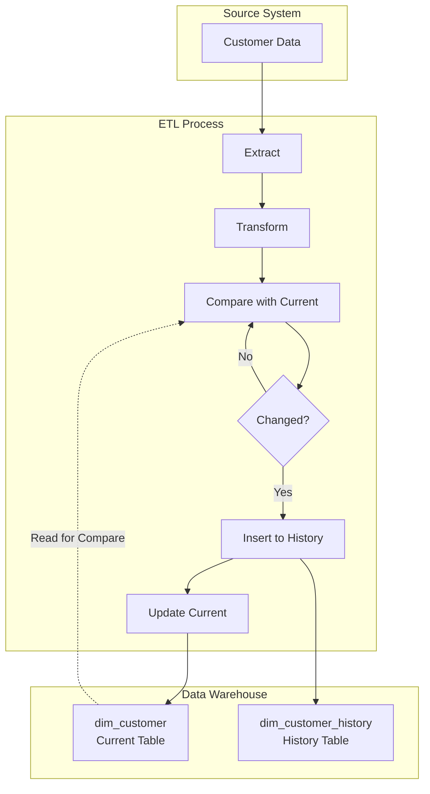
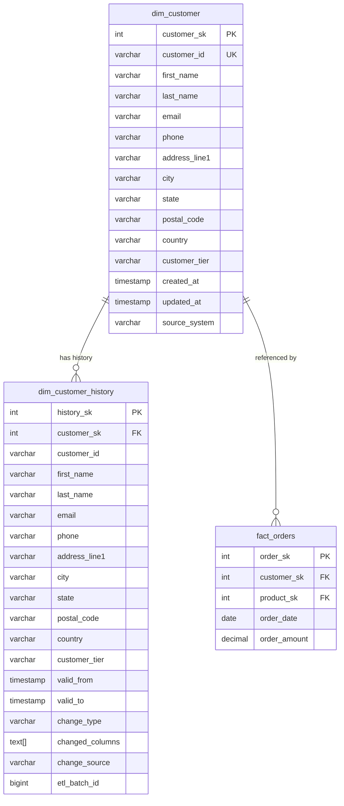
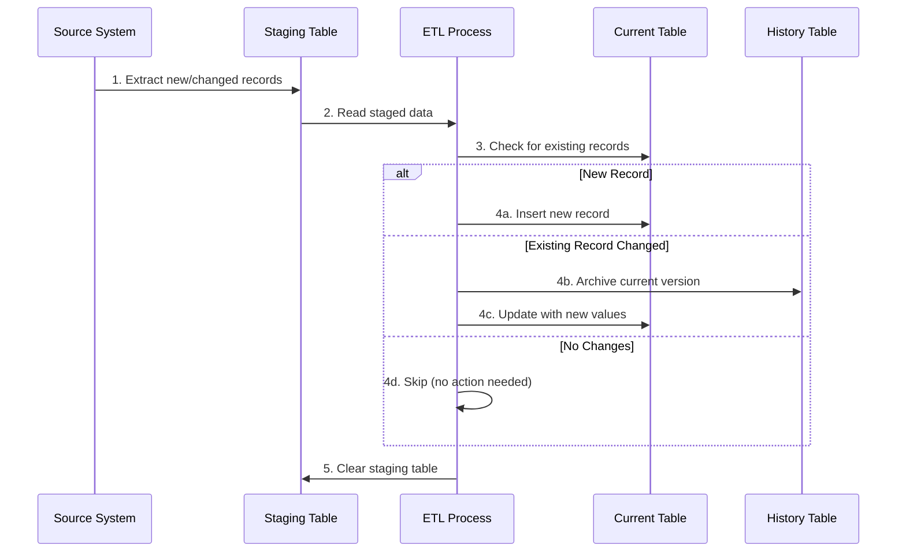

# How to Implement Type 4 SCD

Author: [nawazdhandala](https://github.com/nawazdhandala)

Tags: Data Warehouse, SCD, History Tables, ETL

Description: Learn to implement Type 4 SCD using separate history tables for tracking all dimension changes.

---

## Introduction

Slowly Changing Dimensions (SCD) are a fundamental concept in data warehousing that address how to handle changes in dimension data over time. Type 4 SCD, also known as the "History Table" approach, maintains current dimension values in one table and stores all historical changes in a separate history table.

This approach offers a clean separation between current operational data and historical analysis, making it ideal for scenarios where you need fast access to current values while preserving complete audit trails.

## Understanding Type 4 SCD

Type 4 SCD uses two tables for each dimension:

1. **Current Table**: Contains only the most recent version of each record
2. **History Table**: Stores all historical versions with timestamps

This dual-table approach provides several advantages:
- Fast queries on current data (no date filtering needed)
- Complete historical audit trail
- Simpler current table structure
- Efficient storage for operational queries

### Architecture Overview



## Table Design

### Current Dimension Table

The current table holds only the latest version of each dimension record. It uses a simple structure optimized for fast lookups.

```sql
-- Current dimension table: stores only the latest version of each customer
CREATE TABLE dim_customer (
    -- Surrogate key for the dimension
    customer_sk SERIAL PRIMARY KEY,

    -- Natural key from the source system
    customer_id VARCHAR(50) NOT NULL UNIQUE,

    -- Dimension attributes
    first_name VARCHAR(100) NOT NULL,
    last_name VARCHAR(100) NOT NULL,
    email VARCHAR(255),
    phone VARCHAR(20),
    address_line1 VARCHAR(255),
    address_line2 VARCHAR(255),
    city VARCHAR(100),
    state VARCHAR(50),
    postal_code VARCHAR(20),
    country VARCHAR(100),
    customer_tier VARCHAR(20) DEFAULT 'STANDARD',

    -- Metadata columns
    created_at TIMESTAMP NOT NULL DEFAULT CURRENT_TIMESTAMP,
    updated_at TIMESTAMP NOT NULL DEFAULT CURRENT_TIMESTAMP,
    source_system VARCHAR(50) NOT NULL,

    -- Index for common query patterns
    CONSTRAINT chk_customer_tier CHECK (customer_tier IN ('STANDARD', 'SILVER', 'GOLD', 'PLATINUM'))
);

-- Create indexes for common access patterns
CREATE INDEX idx_customer_email ON dim_customer(email);
CREATE INDEX idx_customer_tier ON dim_customer(customer_tier);
CREATE INDEX idx_customer_city_state ON dim_customer(city, state);
```

### History Table

The history table stores all previous versions of dimension records, including the version that was current before the most recent change.

```sql
-- History table: stores all historical versions of customer records
CREATE TABLE dim_customer_history (
    -- Unique identifier for each history record
    history_sk SERIAL PRIMARY KEY,

    -- Foreign key to current dimension (nullable for deleted records)
    customer_sk INTEGER REFERENCES dim_customer(customer_sk),

    -- Natural key from the source system
    customer_id VARCHAR(50) NOT NULL,

    -- Dimension attributes (same as current table)
    first_name VARCHAR(100) NOT NULL,
    last_name VARCHAR(100) NOT NULL,
    email VARCHAR(255),
    phone VARCHAR(20),
    address_line1 VARCHAR(255),
    address_line2 VARCHAR(255),
    city VARCHAR(100),
    state VARCHAR(50),
    postal_code VARCHAR(20),
    country VARCHAR(100),
    customer_tier VARCHAR(20),

    -- Temporal tracking columns
    valid_from TIMESTAMP NOT NULL,
    valid_to TIMESTAMP NOT NULL,

    -- Change tracking metadata
    change_type VARCHAR(10) NOT NULL,
    changed_columns TEXT[],
    change_source VARCHAR(100),
    etl_batch_id BIGINT,

    -- Constraints
    CONSTRAINT chk_valid_dates CHECK (valid_to >= valid_from),
    CONSTRAINT chk_change_type CHECK (change_type IN ('INSERT', 'UPDATE', 'DELETE'))
);

-- Create indexes optimized for history queries
CREATE INDEX idx_history_customer_id ON dim_customer_history(customer_id);
CREATE INDEX idx_history_valid_from ON dim_customer_history(valid_from);
CREATE INDEX idx_history_valid_to ON dim_customer_history(valid_to);
CREATE INDEX idx_history_date_range ON dim_customer_history(customer_id, valid_from, valid_to);
CREATE INDEX idx_history_change_type ON dim_customer_history(change_type);
```

### Entity Relationship Diagram



## ETL Implementation

### Complete ETL Procedure

This stored procedure handles the full ETL process for Type 4 SCD, including detecting changes, archiving to history, and updating the current table.

```sql
-- Main ETL procedure for Type 4 SCD implementation
CREATE OR REPLACE PROCEDURE sp_load_dim_customer(
    p_batch_id BIGINT,
    p_source_system VARCHAR(50) DEFAULT 'CRM'
)
LANGUAGE plpgsql
AS $$
DECLARE
    v_processed_count INTEGER := 0;
    v_inserted_count INTEGER := 0;
    v_updated_count INTEGER := 0;
    v_current_timestamp TIMESTAMP := CURRENT_TIMESTAMP;
BEGIN
    -- Step 1: Create a temporary table to hold incoming data
    -- This simulates data coming from a staging area
    CREATE TEMP TABLE IF NOT EXISTS stg_customer (
        customer_id VARCHAR(50) PRIMARY KEY,
        first_name VARCHAR(100),
        last_name VARCHAR(100),
        email VARCHAR(255),
        phone VARCHAR(20),
        address_line1 VARCHAR(255),
        address_line2 VARCHAR(255),
        city VARCHAR(100),
        state VARCHAR(50),
        postal_code VARCHAR(20),
        country VARCHAR(100),
        customer_tier VARCHAR(20)
    );

    -- Step 2: Identify new records (not in current dimension)
    -- Insert new customers directly to the current table
    INSERT INTO dim_customer (
        customer_id,
        first_name,
        last_name,
        email,
        phone,
        address_line1,
        address_line2,
        city,
        state,
        postal_code,
        country,
        customer_tier,
        created_at,
        updated_at,
        source_system
    )
    SELECT
        s.customer_id,
        s.first_name,
        s.last_name,
        s.email,
        s.phone,
        s.address_line1,
        s.address_line2,
        s.city,
        s.state,
        s.postal_code,
        s.country,
        COALESCE(s.customer_tier, 'STANDARD'),
        v_current_timestamp,
        v_current_timestamp,
        p_source_system
    FROM stg_customer s
    LEFT JOIN dim_customer d ON s.customer_id = d.customer_id
    WHERE d.customer_id IS NULL;

    GET DIAGNOSTICS v_inserted_count = ROW_COUNT;

    -- Step 3: Archive the current version to history before updating
    -- Only archive records that have actually changed
    INSERT INTO dim_customer_history (
        customer_sk,
        customer_id,
        first_name,
        last_name,
        email,
        phone,
        address_line1,
        address_line2,
        city,
        state,
        postal_code,
        country,
        customer_tier,
        valid_from,
        valid_to,
        change_type,
        changed_columns,
        change_source,
        etl_batch_id
    )
    SELECT
        d.customer_sk,
        d.customer_id,
        d.first_name,
        d.last_name,
        d.email,
        d.phone,
        d.address_line1,
        d.address_line2,
        d.city,
        d.state,
        d.postal_code,
        d.country,
        d.customer_tier,
        d.updated_at,                    -- Previous update becomes valid_from
        v_current_timestamp,             -- Current timestamp becomes valid_to
        'UPDATE',
        -- Track which columns changed
        ARRAY_REMOVE(ARRAY[
            CASE WHEN d.first_name != s.first_name THEN 'first_name' END,
            CASE WHEN d.last_name != s.last_name THEN 'last_name' END,
            CASE WHEN d.email IS DISTINCT FROM s.email THEN 'email' END,
            CASE WHEN d.phone IS DISTINCT FROM s.phone THEN 'phone' END,
            CASE WHEN d.address_line1 IS DISTINCT FROM s.address_line1 THEN 'address_line1' END,
            CASE WHEN d.city IS DISTINCT FROM s.city THEN 'city' END,
            CASE WHEN d.state IS DISTINCT FROM s.state THEN 'state' END,
            CASE WHEN d.postal_code IS DISTINCT FROM s.postal_code THEN 'postal_code' END,
            CASE WHEN d.country IS DISTINCT FROM s.country THEN 'country' END,
            CASE WHEN d.customer_tier IS DISTINCT FROM s.customer_tier THEN 'customer_tier' END
        ], NULL),
        p_source_system,
        p_batch_id
    FROM dim_customer d
    INNER JOIN stg_customer s ON d.customer_id = s.customer_id
    WHERE
        -- Check if any attribute has changed
        d.first_name != s.first_name
        OR d.last_name != s.last_name
        OR d.email IS DISTINCT FROM s.email
        OR d.phone IS DISTINCT FROM s.phone
        OR d.address_line1 IS DISTINCT FROM s.address_line1
        OR d.address_line2 IS DISTINCT FROM s.address_line2
        OR d.city IS DISTINCT FROM s.city
        OR d.state IS DISTINCT FROM s.state
        OR d.postal_code IS DISTINCT FROM s.postal_code
        OR d.country IS DISTINCT FROM s.country
        OR d.customer_tier IS DISTINCT FROM s.customer_tier;

    -- Step 4: Update the current table with new values
    UPDATE dim_customer d
    SET
        first_name = s.first_name,
        last_name = s.last_name,
        email = s.email,
        phone = s.phone,
        address_line1 = s.address_line1,
        address_line2 = s.address_line2,
        city = s.city,
        state = s.state,
        postal_code = s.postal_code,
        country = s.country,
        customer_tier = COALESCE(s.customer_tier, d.customer_tier),
        updated_at = v_current_timestamp
    FROM stg_customer s
    WHERE d.customer_id = s.customer_id
    AND (
        d.first_name != s.first_name
        OR d.last_name != s.last_name
        OR d.email IS DISTINCT FROM s.email
        OR d.phone IS DISTINCT FROM s.phone
        OR d.address_line1 IS DISTINCT FROM s.address_line1
        OR d.address_line2 IS DISTINCT FROM s.address_line2
        OR d.city IS DISTINCT FROM s.city
        OR d.state IS DISTINCT FROM s.state
        OR d.postal_code IS DISTINCT FROM s.postal_code
        OR d.country IS DISTINCT FROM s.country
        OR d.customer_tier IS DISTINCT FROM s.customer_tier
    );

    GET DIAGNOSTICS v_updated_count = ROW_COUNT;

    -- Step 5: Log the ETL results
    RAISE NOTICE 'ETL Complete - Batch: %, Inserted: %, Updated: %',
        p_batch_id, v_inserted_count, v_updated_count;

    -- Clean up temporary table
    DROP TABLE IF EXISTS stg_customer;

    COMMIT;
END;
$$;
```

### Change Detection Function

This helper function determines if a customer record has changed and identifies which columns were modified.

```sql
-- Function to detect changes between staging and current dimension
CREATE OR REPLACE FUNCTION fn_detect_customer_changes(
    p_customer_id VARCHAR(50)
)
RETURNS TABLE (
    has_changes BOOLEAN,
    changed_columns TEXT[],
    change_summary TEXT
)
LANGUAGE plpgsql
AS $$
DECLARE
    v_changes TEXT[] := ARRAY[]::TEXT[];
BEGIN
    -- Compare each column and track changes
    SELECT ARRAY_AGG(column_name)
    INTO v_changes
    FROM (
        SELECT 'first_name' AS column_name
        FROM stg_customer s
        JOIN dim_customer d ON s.customer_id = d.customer_id
        WHERE s.customer_id = p_customer_id
        AND s.first_name != d.first_name

        UNION ALL

        SELECT 'last_name'
        FROM stg_customer s
        JOIN dim_customer d ON s.customer_id = d.customer_id
        WHERE s.customer_id = p_customer_id
        AND s.last_name != d.last_name

        UNION ALL

        SELECT 'email'
        FROM stg_customer s
        JOIN dim_customer d ON s.customer_id = d.customer_id
        WHERE s.customer_id = p_customer_id
        AND s.email IS DISTINCT FROM d.email

        UNION ALL

        SELECT 'customer_tier'
        FROM stg_customer s
        JOIN dim_customer d ON s.customer_id = d.customer_id
        WHERE s.customer_id = p_customer_id
        AND s.customer_tier IS DISTINCT FROM d.customer_tier
    ) changes;

    RETURN QUERY
    SELECT
        COALESCE(array_length(v_changes, 1), 0) > 0,
        v_changes,
        CASE
            WHEN v_changes IS NULL OR array_length(v_changes, 1) IS NULL
            THEN 'No changes detected'
            ELSE 'Changed columns: ' || array_to_string(v_changes, ', ')
        END;
END;
$$;
```

## Query Patterns

### Querying Current Data

The primary advantage of Type 4 SCD is simple and fast queries on current data.

```sql
-- Simple query for current customer data
-- No date filtering required since current table only has latest values
SELECT
    customer_sk,
    customer_id,
    first_name || ' ' || last_name AS full_name,
    email,
    city,
    state,
    customer_tier
FROM dim_customer
WHERE customer_tier = 'GOLD';

-- Join with fact table for current customer analysis
SELECT
    c.customer_id,
    c.first_name || ' ' || c.last_name AS customer_name,
    c.customer_tier,
    COUNT(o.order_sk) AS order_count,
    SUM(o.order_amount) AS total_spent
FROM dim_customer c
INNER JOIN fact_orders o ON c.customer_sk = o.customer_sk
WHERE o.order_date >= CURRENT_DATE - INTERVAL '30 days'
GROUP BY c.customer_sk, c.customer_id, c.first_name, c.last_name, c.customer_tier
ORDER BY total_spent DESC
LIMIT 100;
```

### Querying Historical Data

Access historical versions for audit trails, trend analysis, or point-in-time reporting.

```sql
-- Get complete history for a specific customer
SELECT
    h.customer_id,
    h.first_name || ' ' || h.last_name AS full_name,
    h.email,
    h.customer_tier,
    h.valid_from,
    h.valid_to,
    h.change_type,
    h.changed_columns
FROM dim_customer_history h
WHERE h.customer_id = 'CUST-12345'
ORDER BY h.valid_from DESC;

-- Point-in-time query: What did the customer look like on a specific date?
-- First check history, then fall back to current if not in history
WITH point_in_time AS (
    SELECT
        customer_id,
        first_name,
        last_name,
        email,
        customer_tier,
        valid_from,
        valid_to,
        'HISTORICAL' AS data_source
    FROM dim_customer_history
    WHERE customer_id = 'CUST-12345'
    AND '2025-06-15'::TIMESTAMP BETWEEN valid_from AND valid_to

    UNION ALL

    SELECT
        customer_id,
        first_name,
        last_name,
        email,
        customer_tier,
        updated_at AS valid_from,
        '9999-12-31'::TIMESTAMP AS valid_to,
        'CURRENT' AS data_source
    FROM dim_customer
    WHERE customer_id = 'CUST-12345'
    AND NOT EXISTS (
        SELECT 1 FROM dim_customer_history h
        WHERE h.customer_id = 'CUST-12345'
        AND '2025-06-15'::TIMESTAMP BETWEEN h.valid_from AND h.valid_to
    )
)
SELECT * FROM point_in_time;
```

### Tracking Customer Tier Changes

Analyze how customers have moved between tiers over time.

```sql
-- Track customer tier progression over time
WITH tier_changes AS (
    SELECT
        customer_id,
        customer_tier,
        valid_from,
        valid_to,
        LAG(customer_tier) OVER (
            PARTITION BY customer_id
            ORDER BY valid_from
        ) AS previous_tier,
        ROW_NUMBER() OVER (
            PARTITION BY customer_id
            ORDER BY valid_from
        ) AS change_sequence
    FROM (
        -- Combine current and historical records
        SELECT customer_id, customer_tier, updated_at AS valid_from,
               '9999-12-31'::TIMESTAMP AS valid_to
        FROM dim_customer
        UNION ALL
        SELECT customer_id, customer_tier, valid_from, valid_to
        FROM dim_customer_history
    ) all_records
)
SELECT
    customer_id,
    previous_tier,
    customer_tier AS new_tier,
    valid_from AS change_date,
    CASE
        WHEN previous_tier IS NULL THEN 'Initial Assignment'
        WHEN previous_tier = 'STANDARD' AND customer_tier IN ('SILVER', 'GOLD', 'PLATINUM') THEN 'Upgrade'
        WHEN previous_tier = 'SILVER' AND customer_tier IN ('GOLD', 'PLATINUM') THEN 'Upgrade'
        WHEN previous_tier = 'GOLD' AND customer_tier = 'PLATINUM' THEN 'Upgrade'
        ELSE 'Downgrade'
    END AS change_direction
FROM tier_changes
WHERE previous_tier IS DISTINCT FROM customer_tier
ORDER BY customer_id, valid_from;
```

### Audit Report Query

Generate an audit report showing all changes within a date range.

```sql
-- Comprehensive audit report for a date range
SELECT
    h.customer_id,
    c.first_name || ' ' || c.last_name AS current_name,
    h.change_type,
    h.valid_from AS change_timestamp,
    h.changed_columns,
    h.change_source,
    h.etl_batch_id,
    -- Show what changed
    CASE
        WHEN 'customer_tier' = ANY(h.changed_columns)
        THEN h.customer_tier
    END AS old_tier,
    CASE
        WHEN 'customer_tier' = ANY(h.changed_columns)
        THEN c.customer_tier
    END AS new_tier
FROM dim_customer_history h
LEFT JOIN dim_customer c ON h.customer_sk = c.customer_sk
WHERE h.valid_to BETWEEN '2025-01-01' AND '2025-12-31'
ORDER BY h.valid_to DESC, h.customer_id;
```

## Data Flow Visualization



## Best Practices

### 1. Indexing Strategy

Create appropriate indexes to optimize both current and historical queries.

```sql
-- Indexes for current table (optimized for operational queries)
CREATE INDEX idx_customer_lookup ON dim_customer(customer_id);
CREATE INDEX idx_customer_tier_city ON dim_customer(customer_tier, city);

-- Indexes for history table (optimized for temporal queries)
CREATE INDEX idx_history_temporal ON dim_customer_history(customer_id, valid_from, valid_to);
CREATE INDEX idx_history_batch ON dim_customer_history(etl_batch_id);

-- Partial index for recent history (if frequently queried)
CREATE INDEX idx_history_recent ON dim_customer_history(customer_id, valid_from)
WHERE valid_from >= CURRENT_DATE - INTERVAL '1 year';
```

### 2. Partitioning History Table

For large history tables, consider partitioning by date range.

```sql
-- Create partitioned history table
CREATE TABLE dim_customer_history_partitioned (
    history_sk SERIAL,
    customer_sk INTEGER,
    customer_id VARCHAR(50) NOT NULL,
    first_name VARCHAR(100),
    last_name VARCHAR(100),
    email VARCHAR(255),
    customer_tier VARCHAR(20),
    valid_from TIMESTAMP NOT NULL,
    valid_to TIMESTAMP NOT NULL,
    change_type VARCHAR(10),
    PRIMARY KEY (history_sk, valid_from)
) PARTITION BY RANGE (valid_from);

-- Create partitions for each year
CREATE TABLE dim_customer_history_2024
    PARTITION OF dim_customer_history_partitioned
    FOR VALUES FROM ('2024-01-01') TO ('2025-01-01');

CREATE TABLE dim_customer_history_2025
    PARTITION OF dim_customer_history_partitioned
    FOR VALUES FROM ('2025-01-01') TO ('2026-01-01');

CREATE TABLE dim_customer_history_2026
    PARTITION OF dim_customer_history_partitioned
    FOR VALUES FROM ('2026-01-01') TO ('2027-01-01');
```

### 3. Data Quality Checks

Implement validation to ensure data integrity between current and history tables.

```sql
-- Verify no gaps in history for any customer
WITH history_gaps AS (
    SELECT
        customer_id,
        valid_to AS previous_end,
        LEAD(valid_from) OVER (
            PARTITION BY customer_id
            ORDER BY valid_from
        ) AS next_start
    FROM dim_customer_history
)
SELECT
    customer_id,
    previous_end,
    next_start,
    next_start - previous_end AS gap_duration
FROM history_gaps
WHERE next_start IS NOT NULL
AND next_start != previous_end;

-- Verify all current records have complete history chain
SELECT
    c.customer_id,
    c.created_at,
    MIN(h.valid_from) AS earliest_history,
    CASE
        WHEN MIN(h.valid_from) IS NULL THEN 'No history records'
        WHEN MIN(h.valid_from) > c.created_at THEN 'Gap at beginning'
        ELSE 'OK'
    END AS validation_status
FROM dim_customer c
LEFT JOIN dim_customer_history h ON c.customer_id = h.customer_id
GROUP BY c.customer_sk, c.customer_id, c.created_at
HAVING MIN(h.valid_from) IS NULL OR MIN(h.valid_from) > c.created_at;
```

## Comparison with Other SCD Types

| Feature | Type 1 | Type 2 | Type 4 |
|---------|--------|--------|--------|
| Preserves History | No | Yes | Yes |
| Current Data Query | Simple | Requires filter | Simple |
| Storage Overhead | Low | Medium | Medium |
| Table Complexity | Single table | Single table | Two tables |
| Point-in-time Query | Not possible | Single query | Join required |
| Audit Trail | No | Yes | Yes |
| Best For | Non-critical attributes | Full versioning | Separation of concerns |

## Conclusion

Type 4 SCD provides an elegant solution for maintaining dimension history while keeping current data access simple and fast. The separation between current and history tables offers clear benefits for operational reporting while preserving complete audit trails for compliance and analysis.

Key takeaways:
- Use Type 4 SCD when you need both fast current data access and complete history
- Design your ETL process to handle inserts, updates, and change detection efficiently
- Implement proper indexing strategies for both current and historical queries
- Consider partitioning the history table for large datasets
- Validate data integrity between current and history tables regularly

**Related Reading:**

- [Building Scalable Data Pipelines](https://oneuptime.com/blog)
- [ETL Best Practices for Modern Data Warehouses](https://oneuptime.com/blog)
- [Monitoring Your Data Infrastructure](https://oneuptime.com/blog)
