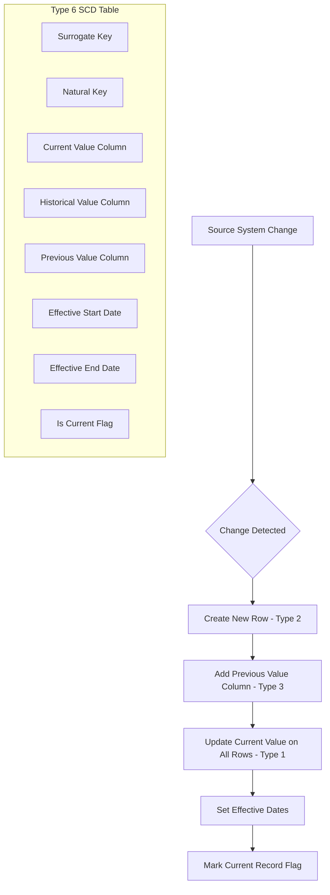
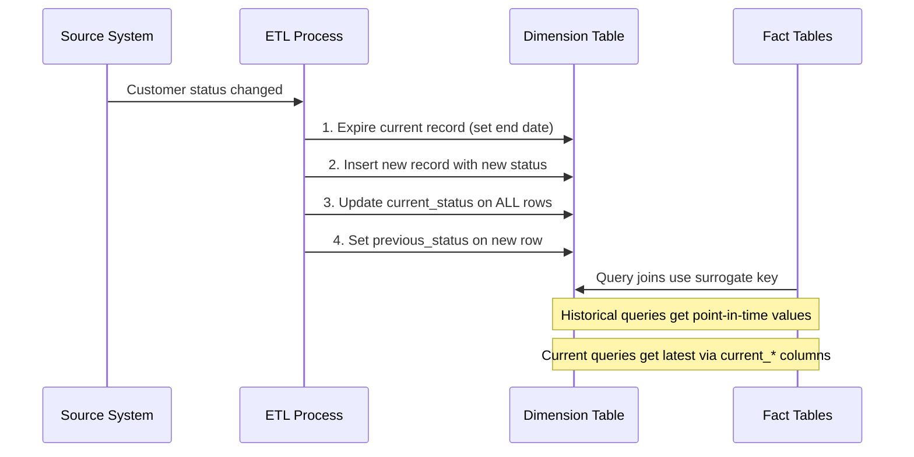
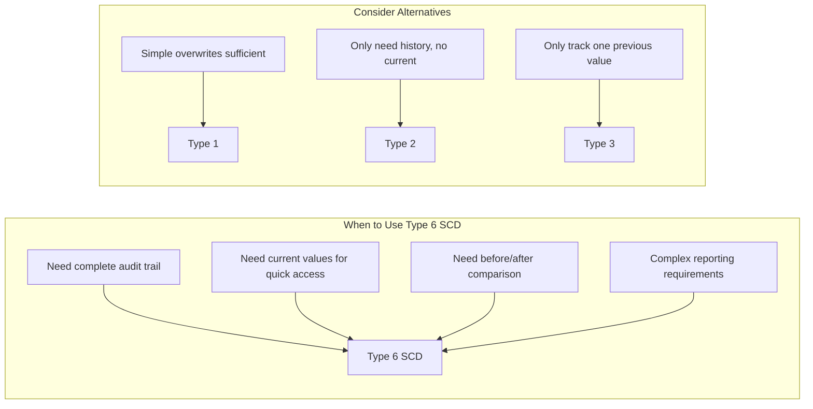

# How to Create Type 6 SCD

Author: [nawazdhandala](https://github.com/nawazdhandala)

Tags: Data Warehouse, SCD, Hybrid, ETL

Description: Learn to create Type 6 SCD (hybrid) combining Type 1, 2, and 3 approaches for flexible history tracking.

---

Slowly Changing Dimensions (SCD) are fundamental to data warehousing, enabling businesses to track historical changes in dimension data. Type 6 SCD, also known as the Hybrid SCD, combines the best features of Type 1, Type 2, and Type 3 to provide maximum flexibility in tracking both current and historical values.

## Understanding SCD Types

Before diving into Type 6, let us briefly review the three types it combines:

- **Type 1**: Overwrites old data with new data. No history is preserved.
- **Type 2**: Creates a new row for each change, preserving complete history with effective dates.
- **Type 3**: Adds columns to store both current and previous values.

Type 6 SCD (1 + 2 + 3 = 6) combines all three approaches, giving you:

- Complete historical records (Type 2)
- Current value accessible on every row (Type 1 behavior via updates)
- Previous value columns for quick comparison (Type 3)

## Type 6 SCD Architecture



## Table Structure

Here is the recommended schema for a Type 6 SCD dimension table:

```sql
-- Create the Type 6 SCD Customer Dimension table
-- This table tracks customer data changes using the hybrid approach

CREATE TABLE dim_customer_type6 (
    -- Surrogate key: unique identifier for each version of the record
    customer_sk          INT IDENTITY(1,1) PRIMARY KEY,

    -- Natural key: business identifier from source system
    customer_id          INT NOT NULL,

    -- Historical attribute: value at the time of this record version
    customer_status      VARCHAR(50) NOT NULL,

    -- Current attribute (Type 1): always reflects the latest value
    -- This column is updated across ALL rows when a change occurs
    current_status       VARCHAR(50) NOT NULL,

    -- Previous attribute (Type 3): stores the immediately prior value
    previous_status      VARCHAR(50) NULL,

    -- Additional dimension attributes
    customer_name        VARCHAR(100) NOT NULL,
    email                VARCHAR(255),
    city                 VARCHAR(100),

    -- Current city (Type 1 behavior)
    current_city         VARCHAR(100),

    -- Previous city (Type 3 behavior)
    previous_city        VARCHAR(100) NULL,

    -- Type 2 tracking columns
    effective_start_date DATE NOT NULL,
    effective_end_date   DATE NULL,

    -- Flag to identify the current active record
    is_current           BIT NOT NULL DEFAULT 1,

    -- Audit columns
    created_at           DATETIME DEFAULT GETDATE(),
    updated_at           DATETIME DEFAULT GETDATE()
);

-- Create index for efficient lookups by natural key
CREATE INDEX idx_customer_id ON dim_customer_type6(customer_id);

-- Create index for current record queries
CREATE INDEX idx_is_current ON dim_customer_type6(is_current) WHERE is_current = 1;
```

## Data Flow Diagram



## ETL Procedure for Type 6 SCD

The following stored procedure handles all Type 6 SCD operations:

```sql
-- Stored procedure to handle Type 6 SCD updates
-- This procedure manages inserts, updates, and historical tracking

CREATE PROCEDURE usp_merge_customer_type6
    @customer_id INT,
    @customer_name VARCHAR(100),
    @customer_status VARCHAR(50),
    @email VARCHAR(255),
    @city VARCHAR(100)
AS
BEGIN
    SET NOCOUNT ON;

    DECLARE @today DATE = CAST(GETDATE() AS DATE);
    DECLARE @old_status VARCHAR(50);
    DECLARE @old_city VARCHAR(100);
    DECLARE @record_exists BIT = 0;

    -- Step 1: Check if customer already exists and get current values
    SELECT
        @record_exists = 1,
        @old_status = customer_status,
        @old_city = city
    FROM dim_customer_type6
    WHERE customer_id = @customer_id
      AND is_current = 1;

    -- Step 2: Handle new customer (no existing record)
    IF @record_exists = 0
    BEGIN
        INSERT INTO dim_customer_type6 (
            customer_id,
            customer_name,
            customer_status,
            current_status,
            previous_status,
            email,
            city,
            current_city,
            previous_city,
            effective_start_date,
            effective_end_date,
            is_current
        )
        VALUES (
            @customer_id,
            @customer_name,
            @customer_status,
            @customer_status,      -- Current equals historical for new records
            NULL,                  -- No previous value for new records
            @email,
            @city,
            @city,                 -- Current equals historical for new records
            NULL,                  -- No previous value for new records
            @today,
            NULL,                  -- Open-ended record
            1                      -- This is the current record
        );

        RETURN;
    END

    -- Step 3: Check if tracked attributes have changed
    IF @old_status != @customer_status OR @old_city != @city
    BEGIN
        -- Step 3a: Expire the current record (Type 2 behavior)
        UPDATE dim_customer_type6
        SET
            effective_end_date = DATEADD(DAY, -1, @today),
            is_current = 0,
            updated_at = GETDATE()
        WHERE customer_id = @customer_id
          AND is_current = 1;

        -- Step 3b: Insert new version with historical and previous values
        INSERT INTO dim_customer_type6 (
            customer_id,
            customer_name,
            customer_status,
            current_status,
            previous_status,
            email,
            city,
            current_city,
            previous_city,
            effective_start_date,
            effective_end_date,
            is_current
        )
        VALUES (
            @customer_id,
            @customer_name,
            @customer_status,      -- New historical value
            @customer_status,      -- New current value
            @old_status,           -- Previous value (Type 3)
            @email,
            @city,                 -- New historical city
            @city,                 -- New current city
            @old_city,             -- Previous city (Type 3)
            @today,
            NULL,
            1
        );

        -- Step 3c: Update current_* columns on ALL historical rows (Type 1 behavior)
        -- This ensures every row reflects the latest values in current_* columns
        UPDATE dim_customer_type6
        SET
            current_status = @customer_status,
            current_city = @city,
            updated_at = GETDATE()
        WHERE customer_id = @customer_id
          AND is_current = 0;  -- Update only historical rows (new row already has correct values)
    END
    ELSE
    BEGIN
        -- Step 4: No SCD attribute change, just update non-tracked attributes
        UPDATE dim_customer_type6
        SET
            customer_name = @customer_name,
            email = @email,
            updated_at = GETDATE()
        WHERE customer_id = @customer_id
          AND is_current = 1;
    END
END;
```

## Example Data Walkthrough

Let us trace through a customer's journey to see how Type 6 SCD captures changes:

```sql
-- Initial load: Customer 1001 joins as Bronze status in New York
EXEC usp_merge_customer_type6 1001, 'John Doe', 'Bronze', 'john@email.com', 'New York';

-- After 6 months: Customer upgrades to Silver and moves to Boston
EXEC usp_merge_customer_type6 1001, 'John Doe', 'Silver', 'john@email.com', 'Boston';

-- After 1 year: Customer achieves Gold status, still in Boston
EXEC usp_merge_customer_type6 1001, 'John Doe', 'Gold', 'john@email.com', 'Boston';
```

The resulting table data:

```sql
-- Query to view the complete history
SELECT
    customer_sk,
    customer_id,
    customer_status AS historical_status,
    current_status,
    previous_status,
    city AS historical_city,
    current_city,
    previous_city,
    effective_start_date,
    effective_end_date,
    is_current
FROM dim_customer_type6
WHERE customer_id = 1001
ORDER BY effective_start_date;
```

| customer_sk | customer_id | historical_status | current_status | previous_status | historical_city | current_city | previous_city | effective_start_date | effective_end_date | is_current |
|-------------|-------------|-------------------|----------------|-----------------|-----------------|--------------|---------------|---------------------|-------------------|------------|
| 1 | 1001 | Bronze | Gold | NULL | New York | Boston | NULL | 2025-01-15 | 2025-07-14 | 0 |
| 2 | 1001 | Silver | Gold | Bronze | Boston | Boston | New York | 2025-07-15 | 2026-01-14 | 0 |
| 3 | 1001 | Gold | Gold | Silver | Boston | Boston | Boston | 2026-01-15 | NULL | 1 |

## Query Patterns for Type 6 SCD

### Get Current Customer Data

```sql
-- Simple query for current state
-- Uses the is_current flag for efficient filtering

SELECT
    customer_id,
    customer_name,
    current_status,
    current_city,
    email
FROM dim_customer_type6
WHERE is_current = 1;
```

### Point-in-Time Analysis

```sql
-- Get customer status as of a specific date
-- Uses the effective date range for historical accuracy

SELECT
    customer_id,
    customer_name,
    customer_status AS status_at_date,
    city AS city_at_date,
    current_status AS current_status_now,
    current_city AS current_city_now
FROM dim_customer_type6
WHERE customer_id = 1001
  AND '2025-08-01' BETWEEN effective_start_date
                       AND COALESCE(effective_end_date, '9999-12-31');
```

### Compare Current vs Previous

```sql
-- Identify customers whose status changed recently
-- Uses Type 3 columns for quick comparison

SELECT
    customer_id,
    customer_name,
    previous_status,
    current_status,
    previous_city,
    current_city,
    effective_start_date AS change_date
FROM dim_customer_type6
WHERE is_current = 1
  AND (previous_status IS NOT NULL OR previous_city IS NOT NULL);
```

### Full Historical Analysis

```sql
-- Complete history for trend analysis
-- Useful for customer journey mapping

SELECT
    customer_id,
    customer_name,
    customer_status,
    city,
    effective_start_date,
    effective_end_date,
    DATEDIFF(DAY,
             effective_start_date,
             COALESCE(effective_end_date, GETDATE())) AS days_in_status
FROM dim_customer_type6
WHERE customer_id = 1001
ORDER BY effective_start_date;
```

## Type 6 SCD Decision Matrix



## Performance Considerations

### Indexing Strategy

```sql
-- Composite index for common query patterns
CREATE INDEX idx_customer_lookup
ON dim_customer_type6(customer_id, is_current, effective_start_date);

-- Covering index for current record queries
CREATE INDEX idx_current_customers
ON dim_customer_type6(customer_id, current_status, current_city)
WHERE is_current = 1;

-- Index for date range queries
CREATE INDEX idx_effective_dates
ON dim_customer_type6(effective_start_date, effective_end_date);
```

### Partitioning for Large Tables

```sql
-- Partition by effective start date for better query performance
-- Useful when dimension table grows very large

CREATE PARTITION FUNCTION pf_customer_date (DATE)
AS RANGE RIGHT FOR VALUES
('2024-01-01', '2025-01-01', '2026-01-01');

CREATE PARTITION SCHEME ps_customer_date
AS PARTITION pf_customer_date
ALL TO ([PRIMARY]);

-- Apply partitioning to the table (during table creation or migration)
```

## Use Cases for Type 6 SCD

### 1. Customer Loyalty Programs

Track customer tier changes while maintaining quick access to current status for real-time eligibility checks.

### 2. Employee Management

Monitor employee department and role changes with full history for compliance, while showing current assignments for operational queries.

### 3. Product Pricing

Maintain historical prices for invoice accuracy while having current prices readily available for sales systems.

### 4. Regulatory Compliance

Industries like finance and healthcare require complete audit trails. Type 6 provides both historical accuracy and current state visibility.

## Best Practices

1. **Choose tracked attributes carefully**: Only apply Type 6 to attributes that truly need both historical tracking and current value propagation. Excessive tracking increases storage and processing costs.

2. **Batch the Type 1 updates**: When updating current_* columns across all historical rows, consider batching for large dimension tables to avoid lock contention.

3. **Document your SCD strategy**: Clearly document which attributes use which SCD type within your Type 6 implementation.

4. **Monitor table growth**: Type 2 behavior creates new rows. Implement archival strategies for very old historical data if needed.

5. **Test with realistic data volumes**: Type 6 operations touch multiple rows. Performance test with production-scale data before deployment.

## Conclusion

Type 6 SCD provides a powerful hybrid approach to slowly changing dimensions by combining the strengths of Types 1, 2, and 3. While it requires more storage and complex ETL logic, it delivers maximum flexibility for both historical analysis and current state queries.

The key benefits of Type 6 SCD are:

- Complete historical audit trail for compliance and analysis
- Current values on every row for simplified reporting
- Previous value columns for quick change detection
- Flexibility to answer virtually any temporal query

When your data warehouse needs to support complex historical and current state queries, Type 6 SCD is an excellent choice that balances the trade-offs between storage, complexity, and analytical capability.
