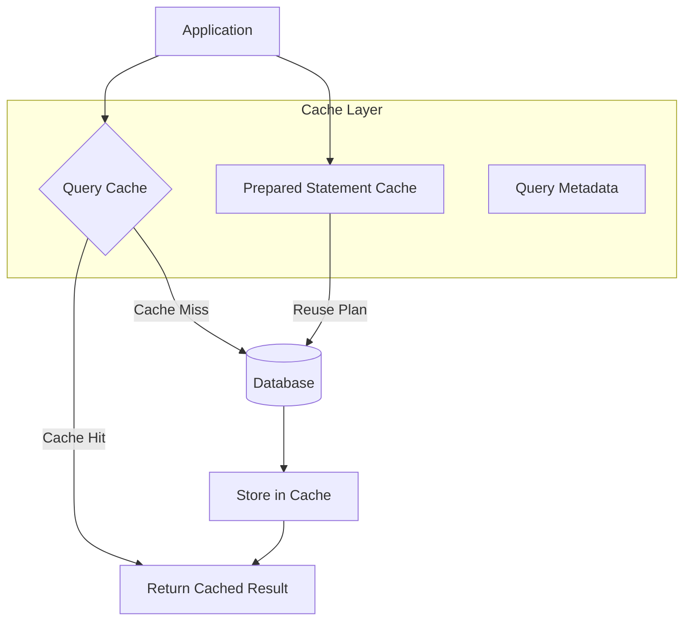
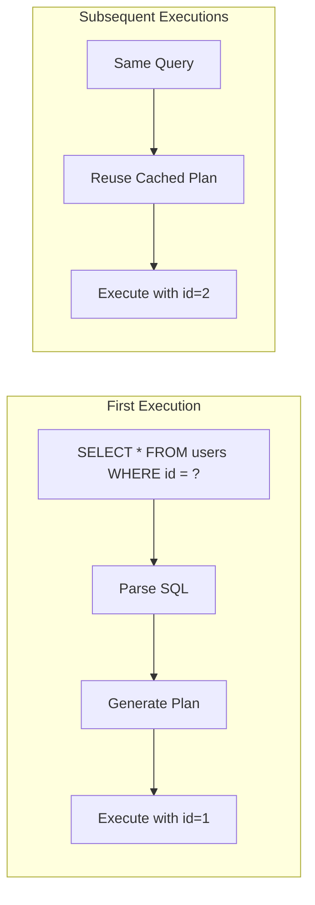
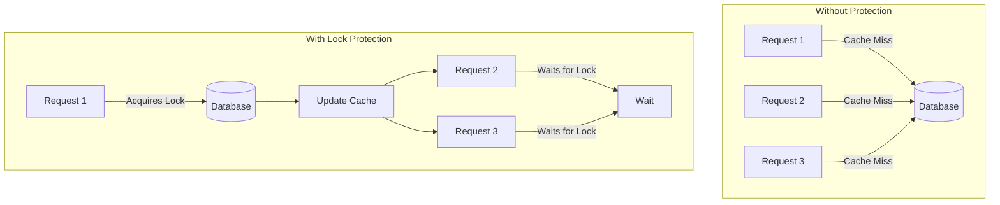

# How to Create Database Cache Design

Author: [nawazdhandala](https://github.com/nawazdhandala)

Tags: Caching, Database, Query Cache, Performance

Description: Learn to create database-level cache design for query results and prepared statements.

---

Database caching sits between your application and the database, storing frequently accessed query results and prepared statements. When implemented correctly, it reduces database load, cuts response times, and allows your application to handle more concurrent users without scaling the database.

This guide covers the core patterns for database-level caching, including query result caching, prepared statement caching, and strategies for keeping cached data consistent with the underlying database.

## Why Cache at the Database Level?

Application-level caching handles objects and computed results. Database-level caching focuses on query results and query plans. Both layers serve different purposes and often work together.

Here is a comparison of caching at different levels.

| Cache Level | What It Stores | Best For |
|-------------|----------------|----------|
| Application | Domain objects, computed values | Business logic results |
| Database | Query results, prepared statements | Repeated queries, join results |
| ORM | Entity hydration, relationship maps | Object graph traversal |

Database caching shines when multiple queries return the same result set, when complex joins take significant time, or when prepared statements can be reused across connections.

## Cache Architecture Overview

A database cache typically intercepts queries before they reach the database, checks for cached results, and returns them directly when available.



## Query Result Caching

Query result caching stores the output of SELECT statements. When the same query runs again, the cached result returns without hitting the database.

The cache key must uniquely identify the query. This typically combines the SQL text, parameter values, and any session-specific settings that affect results.

```python
import hashlib
import json
from typing import Any, Dict, List, Optional
import redis

class QueryResultCache:
    def __init__(self, redis_url: str, default_ttl: int = 300):
        self.redis = redis.from_url(redis_url)
        self.default_ttl = default_ttl

    def _generate_cache_key(self, sql: str, params: tuple) -> str:
        # Combine SQL and params into a unique key
        key_data = json.dumps({"sql": sql, "params": params}, sort_keys=True)
        hash_value = hashlib.sha256(key_data.encode()).hexdigest()
        return f"query_cache:{hash_value}"

    def get(self, sql: str, params: tuple) -> Optional[List[Dict]]:
        cache_key = self._generate_cache_key(sql, params)
        cached = self.redis.get(cache_key)

        if cached:
            # Return deserialized result set
            return json.loads(cached)
        return None

    def set(self, sql: str, params: tuple, results: List[Dict], ttl: int = None) -> None:
        cache_key = self._generate_cache_key(sql, params)
        ttl = ttl or self.default_ttl

        # Serialize and store with expiration
        self.redis.setex(cache_key, ttl, json.dumps(results))

    def invalidate_by_table(self, table_name: str) -> int:
        # Find and delete all cached queries for a table
        # This requires tracking which queries touch which tables
        pattern = f"query_cache:table:{table_name}:*"
        keys = self.redis.keys(pattern)
        if keys:
            return self.redis.delete(*keys)
        return 0
```

## Prepared Statement Caching

Prepared statements separate query parsing from execution. The database parses the SQL once, creates an execution plan, and reuses that plan for subsequent executions with different parameters.

Caching prepared statements avoids repeated parsing overhead. Most database drivers handle this automatically, but you can control the cache size and behavior.



Here is a prepared statement cache implementation that works with connection pools.

```python
import psycopg2
from psycopg2 import pool
from typing import Any, Dict, List
import threading

class PreparedStatementCache:
    def __init__(self, dsn: str, min_conn: int = 5, max_conn: int = 20):
        self.pool = pool.ThreadedConnectionPool(min_conn, max_conn, dsn)
        # Track prepared statements per connection
        self._prepared: Dict[int, Dict[str, str]] = {}
        self._lock = threading.Lock()
        self._stmt_counter = 0

    def _get_statement_name(self, conn_id: int, sql: str) -> str:
        # Check if this SQL is already prepared on this connection
        with self._lock:
            if conn_id not in self._prepared:
                self._prepared[conn_id] = {}

            if sql in self._prepared[conn_id]:
                return self._prepared[conn_id][sql]

            # Create new prepared statement name
            self._stmt_counter += 1
            stmt_name = f"stmt_{self._stmt_counter}"
            self._prepared[conn_id][sql] = stmt_name
            return None  # Indicates statement needs preparation

    def execute(self, sql: str, params: tuple = ()) -> List[Dict]:
        conn = self.pool.getconn()
        conn_id = id(conn)

        try:
            cursor = conn.cursor()
            stmt_name = self._get_statement_name(conn_id, sql)

            if stmt_name is None:
                # First time seeing this query on this connection
                stmt_name = self._prepared[conn_id][sql]
                # Prepare the statement for future reuse
                cursor.execute(f"PREPARE {stmt_name} AS {sql}")

            # Execute using the prepared statement
            execute_sql = f"EXECUTE {stmt_name}"
            if params:
                placeholders = ", ".join(["%s"] * len(params))
                execute_sql = f"EXECUTE {stmt_name} ({placeholders})"

            cursor.execute(execute_sql, params)

            columns = [desc[0] for desc in cursor.description] if cursor.description else []
            rows = cursor.fetchall()

            return [dict(zip(columns, row)) for row in rows]
        finally:
            self.pool.putconn(conn)
```

## Cache Invalidation Strategies

Cache invalidation determines when cached query results become stale. The right strategy depends on how your data changes and how tolerant your application is of stale reads.

| Strategy | Description | Staleness Risk | Complexity |
|----------|-------------|----------------|------------|
| TTL-based | Expire after fixed time | Moderate | Low |
| Write-through | Update cache on writes | Low | Medium |
| Event-driven | Invalidate on data changes | Very low | High |
| Version tagging | Compare version numbers | Low | Medium |

TTL-based invalidation works well for data that changes infrequently. Write-through ensures cache stays current but adds latency to writes. Event-driven invalidation reacts to database triggers or change data capture streams.

```python
from typing import Callable, Set
import threading

class TableTrackingCache:
    def __init__(self, cache: QueryResultCache):
        self.cache = cache
        # Track which tables each cached query depends on
        self._query_tables: Dict[str, Set[str]] = {}
        self._lock = threading.Lock()

    def cache_query(
        self,
        sql: str,
        params: tuple,
        results: List[Dict],
        tables: Set[str],
        ttl: int = 300
    ) -> None:
        cache_key = self.cache._generate_cache_key(sql, params)

        # Store the query result
        self.cache.set(sql, params, results, ttl)

        # Track which tables this query reads from
        with self._lock:
            self._query_tables[cache_key] = tables

    def on_table_write(self, table_name: str) -> int:
        # Called when a table is modified via INSERT, UPDATE, or DELETE
        invalidated = 0

        with self._lock:
            keys_to_remove = []
            for cache_key, tables in self._query_tables.items():
                if table_name in tables:
                    keys_to_remove.append(cache_key)

            for key in keys_to_remove:
                self.cache.redis.delete(key)
                del self._query_tables[key]
                invalidated += 1

        return invalidated
```

## Handling Cache Stampedes

A cache stampede occurs when multiple requests simultaneously find the cache empty and all hit the database at once. This happens after cache expiration or invalidation.



The solution uses a lock to ensure only one request fetches from the database while others wait.

```python
import time
from typing import Callable, Any

class StampedeProtectedCache:
    def __init__(self, cache: QueryResultCache, lock_timeout: int = 10):
        self.cache = cache
        self.lock_timeout = lock_timeout

    def get_or_fetch(
        self,
        sql: str,
        params: tuple,
        fetch_fn: Callable[[], List[Dict]],
        ttl: int = 300
    ) -> List[Dict]:
        # Try to get from cache first
        result = self.cache.get(sql, params)
        if result is not None:
            return result

        # Cache miss - acquire lock before fetching
        cache_key = self.cache._generate_cache_key(sql, params)
        lock_key = f"lock:{cache_key}"

        # Try to acquire the lock
        acquired = self.cache.redis.set(
            lock_key,
            "1",
            nx=True,  # Only set if not exists
            ex=self.lock_timeout
        )

        if acquired:
            try:
                # We have the lock - fetch from database
                result = fetch_fn()
                self.cache.set(sql, params, result, ttl)
                return result
            finally:
                self.cache.redis.delete(lock_key)
        else:
            # Another request is fetching - wait and retry
            for _ in range(self.lock_timeout * 10):
                time.sleep(0.1)
                result = self.cache.get(sql, params)
                if result is not None:
                    return result

            # Timeout waiting - fetch anyway
            return fetch_fn()
```

## Cache Warming

Cold caches hurt performance after deployments or restarts. Cache warming preloads frequently accessed queries before traffic arrives.

```python
from typing import List, Tuple
import concurrent.futures

class CacheWarmer:
    def __init__(self, cache: QueryResultCache, db_connection):
        self.cache = cache
        self.db = db_connection

    def warm(self, queries: List[Tuple[str, tuple, int]]) -> int:
        # queries: list of (sql, params, ttl) tuples
        warmed = 0

        # Run warming queries in parallel
        with concurrent.futures.ThreadPoolExecutor(max_workers=10) as executor:
            futures = []
            for sql, params, ttl in queries:
                future = executor.submit(self._warm_query, sql, params, ttl)
                futures.append(future)

            for future in concurrent.futures.as_completed(futures):
                if future.result():
                    warmed += 1

        return warmed

    def _warm_query(self, sql: str, params: tuple, ttl: int) -> bool:
        try:
            cursor = self.db.cursor()
            cursor.execute(sql, params)
            columns = [desc[0] for desc in cursor.description]
            rows = cursor.fetchall()
            results = [dict(zip(columns, row)) for row in rows]

            self.cache.set(sql, params, results, ttl)
            return True
        except Exception:
            return False
```

## Monitoring Cache Effectiveness

Track cache hit rates, latency improvements, and memory usage to ensure your cache delivers value.

| Metric | Target | Action if Below |
|--------|--------|-----------------|
| Hit rate | Greater than 80% | Review query patterns, extend TTL |
| Avg latency saved | Greater than 10ms | Cache more expensive queries |
| Memory usage | Less than 80% capacity | Evict less valuable entries |
| Invalidation rate | Less than 10% of hits | Reduce write frequency or TTL |

## Conclusion

Database cache design requires balancing hit rates against staleness, protecting against stampedes, and tracking which cached results depend on which tables. Start with TTL-based query result caching for read-heavy queries. Add prepared statement caching to reduce parse overhead. Implement write-through or event-driven invalidation when data freshness matters.

The code examples in this guide provide patterns you can adapt for production use. Monitor your cache metrics closely and adjust TTLs and invalidation strategies based on actual usage patterns.
