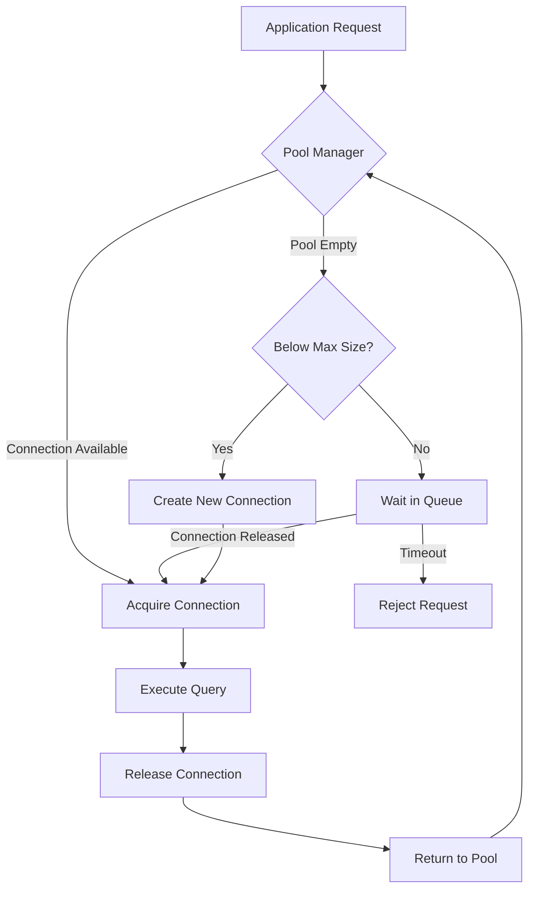
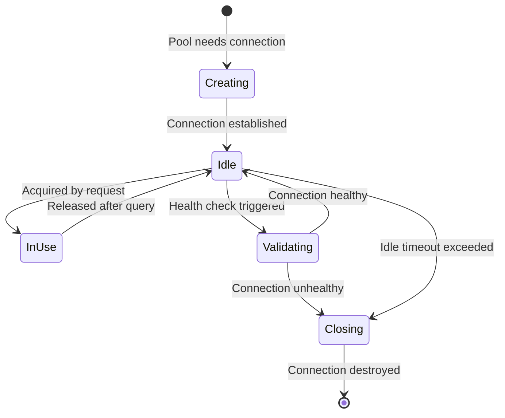

# How to Create Database Connection Management

Author: [nawazdhandala](https://github.com/nawazdhandala)

Tags: Database, Connection Pooling, Performance, Architecture

Description: Learn to create database connection management strategies for efficient resource utilization.

---

Database connections are expensive. Each connection consumes memory on both the application server and the database server, requires a TCP handshake, and often involves authentication overhead. Without proper connection management, applications suffer from exhausted connection limits, memory pressure, and unpredictable latency spikes. This guide walks through building a connection management system that handles real production workloads.

## Why Connection Management Matters

A naive approach opens a new connection for every query and closes it afterward. This works fine for a handful of requests per second. But at scale, the overhead becomes crippling:

| Metric | No Pooling | With Pooling |
| --- | --- | --- |
| Connection setup time | 20-50ms per query | Amortized to near zero |
| Max concurrent queries | Limited by DB max connections | Limited by pool size |
| Memory per connection | 5-10MB on DB server | Shared across requests |
| Failure mode | Connection storms during traffic spikes | Graceful queuing |

The core idea behind connection pooling is simple: maintain a set of open connections and reuse them across requests. The implementation details determine whether your system handles traffic gracefully or falls over during peak load.

## Connection Pool Architecture

A well-designed connection pool has several components working together. The following diagram shows how requests flow through a pooled system.



The pool manager tracks available connections, pending requests, and pool configuration. When a request needs a connection, the manager either hands out an idle connection, creates a new one if under the limit, or queues the request until one becomes available.

## Building a Connection Pool from Scratch

Let's build a connection pool in TypeScript that handles the critical concerns. This implementation uses a simple queue for pending requests and tracks connection health.

The pool configuration defines boundaries for resource usage:

```typescript
// pool-config.ts
interface PoolConfig {
  // Minimum connections to keep open
  minConnections: number;
  // Maximum connections allowed
  maxConnections: number;
  // How long to wait for a connection (ms)
  acquireTimeout: number;
  // How long a connection can be idle before removal (ms)
  idleTimeout: number;
  // How often to check connection health (ms)
  healthCheckInterval: number;
}

const defaultConfig: PoolConfig = {
  minConnections: 2,
  maxConnections: 10,
  acquireTimeout: 30000,
  idleTimeout: 60000,
  healthCheckInterval: 30000,
};
```

The connection wrapper tracks metadata needed for pool management:

```typescript
// pooled-connection.ts
interface PooledConnection {
  // The actual database connection
  connection: DatabaseConnection;
  // When the connection was created
  createdAt: Date;
  // Last time this connection was used
  lastUsedAt: Date;
  // Is this connection currently in use?
  inUse: boolean;
  // Unique identifier for debugging
  id: string;
}
```

The pool manager handles acquisition, release, and health checking:

```typescript
// connection-pool.ts
class ConnectionPool {
  private connections: PooledConnection[] = [];
  private waitingQueue: Array<{
    resolve: (conn: PooledConnection) => void;
    reject: (err: Error) => void;
    timeout: NodeJS.Timeout;
  }> = [];
  private config: PoolConfig;
  private healthCheckTimer: NodeJS.Timeout | null = null;

  constructor(config: Partial<PoolConfig> = {}) {
    this.config = { ...defaultConfig, ...config };
    this.initializePool();
    this.startHealthCheck();
  }

  // Create minimum connections on startup
  private async initializePool(): Promise<void> {
    const promises = [];
    for (let i = 0; i < this.config.minConnections; i++) {
      promises.push(this.createConnection());
    }
    await Promise.all(promises);
  }

  // Acquire a connection from the pool
  async acquire(): Promise<PooledConnection> {
    // Try to find an available connection
    const available = this.connections.find((c) => !c.inUse);
    if (available) {
      available.inUse = true;
      available.lastUsedAt = new Date();
      return available;
    }

    // Create new connection if under limit
    if (this.connections.length < this.config.maxConnections) {
      const conn = await this.createConnection();
      conn.inUse = true;
      return conn;
    }

    // Queue the request and wait
    return this.waitForConnection();
  }

  // Release a connection back to the pool
  release(pooledConn: PooledConnection): void {
    pooledConn.inUse = false;
    pooledConn.lastUsedAt = new Date();

    // If someone is waiting, hand off immediately
    if (this.waitingQueue.length > 0) {
      const waiter = this.waitingQueue.shift()!;
      clearTimeout(waiter.timeout);
      pooledConn.inUse = true;
      waiter.resolve(pooledConn);
    }
  }

  // Wait in queue for an available connection
  private waitForConnection(): Promise<PooledConnection> {
    return new Promise((resolve, reject) => {
      const timeout = setTimeout(() => {
        const index = this.waitingQueue.findIndex(
          (w) => w.resolve === resolve
        );
        if (index !== -1) {
          this.waitingQueue.splice(index, 1);
        }
        reject(new Error("Connection acquire timeout"));
      }, this.config.acquireTimeout);

      this.waitingQueue.push({ resolve, reject, timeout });
    });
  }

  // Create a new database connection
  private async createConnection(): Promise<PooledConnection> {
    const connection = await connectToDatabase();
    const pooledConn: PooledConnection = {
      connection,
      createdAt: new Date(),
      lastUsedAt: new Date(),
      inUse: false,
      id: crypto.randomUUID(),
    };
    this.connections.push(pooledConn);
    return pooledConn;
  }

  // Periodic health check removes stale connections
  private startHealthCheck(): void {
    this.healthCheckTimer = setInterval(async () => {
      const now = Date.now();

      for (const conn of this.connections) {
        // Skip connections in use
        if (conn.inUse) continue;

        // Remove idle connections above minimum
        const idleTime = now - conn.lastUsedAt.getTime();
        if (
          idleTime > this.config.idleTimeout &&
          this.connections.length > this.config.minConnections
        ) {
          await this.removeConnection(conn);
        }
      }
    }, this.config.healthCheckInterval);
  }

  // Safely remove a connection from the pool
  private async removeConnection(conn: PooledConnection): Promise<void> {
    const index = this.connections.indexOf(conn);
    if (index !== -1) {
      this.connections.splice(index, 1);
      await conn.connection.close();
    }
  }
}
```

## Connection Lifecycle States

Understanding the state machine behind connection management helps debug issues. Each connection moves through predictable states.



The validating state is important for production systems. Connections can go stale when the database restarts, network hiccups occur, or firewall rules time out idle connections. A simple validation query like `SELECT 1` before handing out a connection catches these issues.

## Handling Connection Failures

Production systems need to handle failures gracefully. Here are the key scenarios and how to address them:

**Connection creation failures**: When the database is unreachable, connection creation fails. Implement exponential backoff with jitter to avoid thundering herd problems when the database comes back online.

**Query failures on valid connections**: Sometimes a connection appears healthy but fails when used. Mark the connection as suspect and validate it before returning to the pool.

**Pool exhaustion under load**: When all connections are in use and the queue fills up, the system must shed load. Return errors quickly rather than letting requests pile up indefinitely.

The following snippet shows a retry wrapper that handles transient failures:

```typescript
// retry-wrapper.ts
async function withRetry<T>(
  pool: ConnectionPool,
  operation: (conn: PooledConnection) => Promise<T>,
  maxRetries: number = 3
): Promise<T> {
  let lastError: Error | null = null;

  for (let attempt = 0; attempt < maxRetries; attempt++) {
    const conn = await pool.acquire();
    try {
      const result = await operation(conn);
      pool.release(conn);
      return result;
    } catch (err) {
      lastError = err as Error;
      // Don't release bad connections back to pool
      if (isConnectionError(err)) {
        await pool.destroy(conn);
      } else {
        pool.release(conn);
        throw err; // Application error, don't retry
      }
    }

    // Exponential backoff with jitter
    const delay = Math.min(1000 * Math.pow(2, attempt), 10000);
    const jitter = Math.random() * 1000;
    await sleep(delay + jitter);
  }

  throw lastError;
}
```

## Monitoring Your Connection Pool

Effective connection management requires visibility into pool behavior. Track these metrics:

| Metric | What it tells you | Alert threshold |
| --- | --- | --- |
| Pool size | Current number of connections | Sustained at max |
| Wait queue length | Requests waiting for connections | Greater than 0 for extended periods |
| Acquire latency | Time to get a connection | P95 above 100ms |
| Connection age | How long connections live | Unusual churn patterns |
| Failed acquires | Requests that timed out | Any non-zero value |

Export these metrics to your observability platform. OneUptime can track these metrics alongside your application traces, giving you a complete picture of database performance.

## Production Recommendations

After running connection pools in production for years, these practices have proven valuable:

1. **Size pools based on actual workload**, not guesswork. Start small and increase based on queue length metrics.

2. **Set acquire timeouts shorter than request timeouts**. If a request has a 30-second timeout, the acquire timeout should be 5-10 seconds to leave room for the actual query.

3. **Use separate pools for different workloads**. Long-running analytics queries should not compete with quick transactional queries.

4. **Implement circuit breakers** at the pool level. If connection failures spike, stop trying to create new connections temporarily.

5. **Test pool behavior under failure conditions**. Chaos engineering that kills database connections reveals how your pool handles real-world problems.

Connection management is foundational infrastructure. Getting it right means your application handles traffic spikes gracefully, recovers from failures automatically, and uses database resources efficiently. The investment in proper pool management pays dividends in reliability and operational simplicity.
