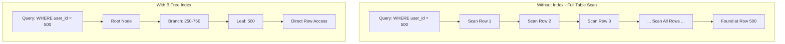
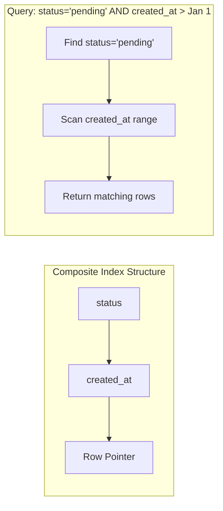
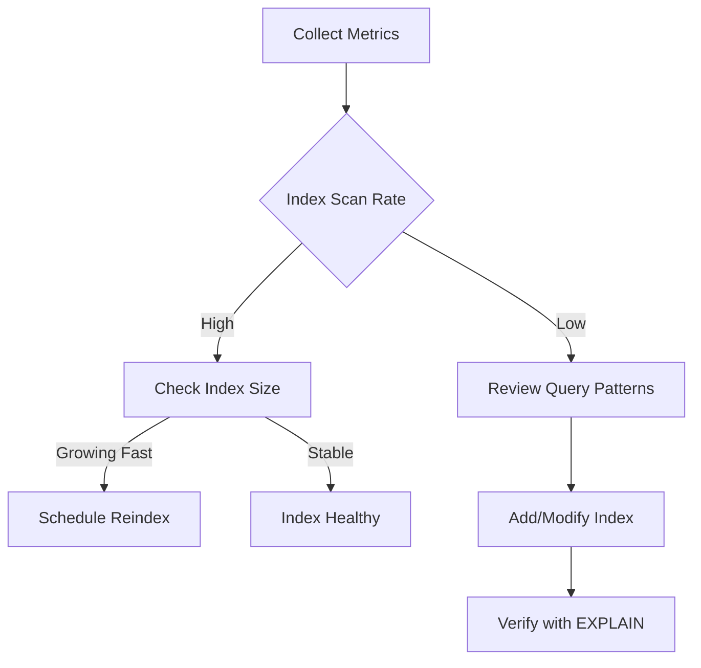

# How to Implement Database Indexing Strategies

Author: [nawazdhandala](https://github.com/nawazdhandala)

Tags: Database, Indexing, Performance, SQL

Description: Learn to implement database indexing strategies for optimal query performance and data retrieval.

---

Database indexes are one of the most powerful tools for improving query performance. Without proper indexing, even simple queries can scan millions of rows, turning sub-millisecond operations into multi-second waits. This guide walks through practical indexing strategies that you can apply to production databases today.

## Understanding How Indexes Work

An index is a separate data structure that maintains pointers to rows in your table. When you query with indexed columns, the database uses the index to locate rows directly instead of scanning the entire table.

The following diagram shows how a B-tree index speeds up lookups compared to a full table scan.



The B-tree structure reduces lookup complexity from O(n) to O(log n), which makes a significant difference at scale.

## Types of Indexes and When to Use Them

Different index types serve different purposes. Choosing the right type depends on your query patterns and data characteristics.

| Index Type | Best For | Avoid When |
|------------|----------|------------|
| B-Tree | Equality and range queries | High-cardinality text search |
| Hash | Exact equality lookups | Range queries, sorting |
| GIN | Full-text search, JSONB, arrays | Simple equality checks |
| GiST | Geometric data, nearest neighbor | Standard relational queries |
| BRIN | Large tables with natural ordering | Random data distribution |

## Creating Your First Index

Start with the columns that appear most frequently in WHERE clauses and JOIN conditions. The basic syntax creates a B-tree index by default.

```sql
-- Create a simple index on a frequently queried column
CREATE INDEX idx_users_email ON users(email);

-- Create a unique index when the column should have no duplicates
CREATE UNIQUE INDEX idx_users_username ON users(username);

-- Create an index with a specific type (PostgreSQL)
CREATE INDEX idx_orders_data ON orders USING GIN(metadata);
```

## Composite Indexes for Multi-Column Queries

When queries filter on multiple columns, composite indexes outperform multiple single-column indexes. Column order matters because the database can only use the index efficiently from left to right.

```sql
-- Create a composite index for queries that filter by status and created_at
CREATE INDEX idx_orders_status_created
ON orders(status, created_at DESC);

-- This index supports these query patterns:
-- WHERE status = 'pending'
-- WHERE status = 'pending' AND created_at > '2026-01-01'
-- WHERE status = 'pending' ORDER BY created_at DESC

-- But NOT efficiently:
-- WHERE created_at > '2026-01-01' (status column not used)
```

The following diagram illustrates how the database uses a composite index.



## Partial Indexes for Targeted Performance

Partial indexes cover only a subset of rows, making them smaller and faster to maintain. Use them when queries consistently filter on a specific condition.

```sql
-- Index only active users instead of all users
CREATE INDEX idx_users_active_email
ON users(email)
WHERE status = 'active';

-- Index only recent orders
CREATE INDEX idx_orders_recent
ON orders(customer_id, total)
WHERE created_at > CURRENT_DATE - INTERVAL '90 days';
```

Partial indexes reduce storage requirements and speed up both queries and write operations.

## Covering Indexes to Avoid Table Lookups

A covering index includes all columns needed by a query, allowing the database to return results directly from the index without accessing the table.

```sql
-- Include columns needed in SELECT to avoid table lookup
CREATE INDEX idx_orders_covering
ON orders(customer_id)
INCLUDE (order_total, created_at);

-- This query can be satisfied entirely from the index
SELECT customer_id, order_total, created_at
FROM orders
WHERE customer_id = 12345;
```

## Analyzing Index Usage

Before adding indexes, analyze your query patterns. After adding them, verify they are being used.

```sql
-- PostgreSQL: Analyze query execution plan
EXPLAIN ANALYZE
SELECT * FROM orders
WHERE customer_id = 12345 AND status = 'shipped';

-- Check index usage statistics
SELECT
    schemaname,
    tablename,
    indexname,
    idx_scan,
    idx_tup_read,
    idx_tup_fetch
FROM pg_stat_user_indexes
WHERE tablename = 'orders'
ORDER BY idx_scan DESC;
```

Look for these indicators in EXPLAIN output.

| Indicator | Good Sign | Warning Sign |
|-----------|-----------|--------------|
| Index Scan | Index is being used | - |
| Seq Scan | Small table, acceptable | Large table, missing index |
| Bitmap Index Scan | Multiple indexes combined | Possible over-indexing |
| Index Only Scan | Covering index working | - |

## Index Maintenance Strategies

Indexes require maintenance to stay performant. Bloat accumulates as rows are updated and deleted.

```sql
-- PostgreSQL: Rebuild a specific index
REINDEX INDEX idx_orders_status_created;

-- Rebuild all indexes on a table
REINDEX TABLE orders;

-- Concurrent reindex (doesn't block reads/writes)
REINDEX INDEX CONCURRENTLY idx_orders_status_created;

-- Check index bloat
SELECT
    tablename,
    indexname,
    pg_size_pretty(pg_relation_size(indexrelid)) as index_size
FROM pg_stat_user_indexes
WHERE schemaname = 'public'
ORDER BY pg_relation_size(indexrelid) DESC;
```

## Common Indexing Mistakes to Avoid

Several patterns lead to poor index performance or wasted resources.

**Over-indexing:** Every index slows down INSERT, UPDATE, and DELETE operations. Only index columns that appear in frequent queries.

**Indexing low-cardinality columns:** A boolean column with only two values rarely benefits from an index. The database may choose a full scan anyway.

**Wrong column order in composite indexes:** Place the most selective column first. A composite index on (country, user_id) is less useful than (user_id, country) if user_id is more selective.

**Ignoring index maintenance:** Bloated indexes perform poorly. Schedule regular REINDEX operations during low-traffic windows.

## Monitoring Index Health

Set up monitoring to track index performance over time.



Key metrics to track include index scan count, index size over time, and the ratio of index scans to sequential scans.

## Practical Recommendations

Start with these guidelines when implementing indexing strategies:

1. **Profile before indexing.** Use EXPLAIN ANALYZE to understand current query behavior.
2. **Index foreign keys.** Columns used in JOINs almost always benefit from indexes.
3. **Consider write patterns.** High-write tables need fewer, more targeted indexes.
4. **Use partial indexes.** When queries consistently filter on a condition, partial indexes are smaller and faster.
5. **Review unused indexes.** Drop indexes with zero or near-zero scan counts.
6. **Test in staging.** Verify index improvements with production-like data volumes.

Proper indexing transforms database performance from a bottleneck into a strength. Start with the highest-impact queries, measure the results, and iterate. The goal is not to index everything but to index strategically where it matters most.
