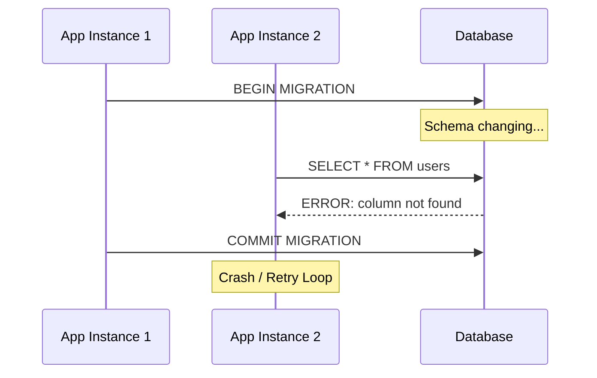
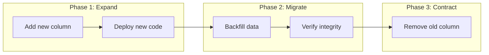
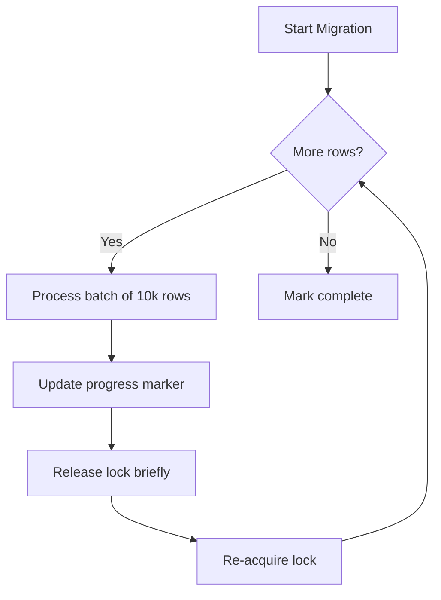
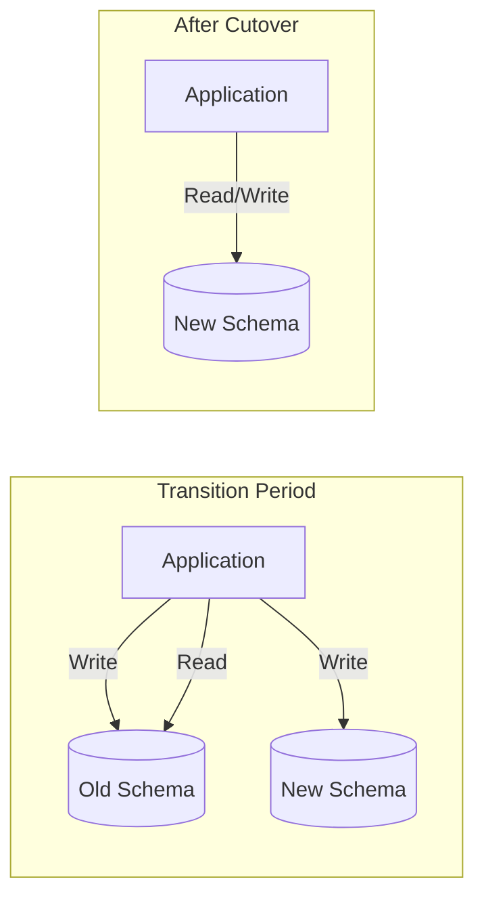

# How to Build Database Migration Coordination

Author: [nawazdhandala](https://github.com/nawazdhandala)

Tags: Database, Migrations, Blue-Green, Deployments

Description: Learn to build database migration coordination for zero-downtime schema changes.

---

Database migrations are one of the most dangerous operations in production systems. A poorly coordinated migration can lock tables, corrupt data, or bring your entire service offline. This guide walks through building a migration coordination system that keeps your database available while schema changes roll out.

## The Problem with Uncoordinated Migrations

When multiple application instances run against the same database, schema changes create race conditions. One instance might expect the old schema while another expects the new one. Without coordination, you end up with failed queries, data inconsistencies, and midnight pages.

The following diagram shows what happens when migrations run without coordination.



## Core Principles of Migration Coordination

A solid migration coordination system follows three principles: sequential execution, backward compatibility, and rollback capability. Every migration should work with both old and new application code during the transition window.



## Building the Migration Lock System

The first component you need is a distributed lock that prevents multiple instances from running migrations simultaneously. Here is a PostgreSQL-based implementation.

This table stores migration state and prevents concurrent execution.

```sql
-- Migration lock table schema
CREATE TABLE migration_locks (
    id SERIAL PRIMARY KEY,
    lock_name VARCHAR(255) UNIQUE NOT NULL,
    locked_by VARCHAR(255) NOT NULL,
    locked_at TIMESTAMP DEFAULT CURRENT_TIMESTAMP,
    expires_at TIMESTAMP NOT NULL
);

-- Index for fast lock lookups
CREATE INDEX idx_migration_locks_name ON migration_locks(lock_name);
CREATE INDEX idx_migration_locks_expires ON migration_locks(expires_at);
```

The lock acquisition function uses advisory locks to handle race conditions at the database level.

```sql
-- Acquire migration lock with timeout
CREATE OR REPLACE FUNCTION acquire_migration_lock(
    p_lock_name VARCHAR(255),
    p_locked_by VARCHAR(255),
    p_ttl_seconds INTEGER DEFAULT 3600
) RETURNS BOOLEAN AS $$
DECLARE
    v_acquired BOOLEAN := FALSE;
BEGIN
    -- Clean up expired locks first
    DELETE FROM migration_locks
    WHERE expires_at < CURRENT_TIMESTAMP;

    -- Try to insert new lock
    BEGIN
        INSERT INTO migration_locks (lock_name, locked_by, expires_at)
        VALUES (
            p_lock_name,
            p_locked_by,
            CURRENT_TIMESTAMP + (p_ttl_seconds || ' seconds')::INTERVAL
        );
        v_acquired := TRUE;
    EXCEPTION WHEN unique_violation THEN
        v_acquired := FALSE;
    END;

    RETURN v_acquired;
END;
$$ LANGUAGE plpgsql;
```

## The Migration Runner

With locking in place, you need a runner that executes migrations in order. The runner should track which migrations have been applied and skip those that already ran.

This Node.js implementation shows the core migration runner logic.

```typescript
// migration-runner.ts
import { Pool } from "pg";
import * as fs from "fs";
import * as path from "path";

interface Migration {
  version: string;
  name: string;
  up: string;
  down: string;
}

class MigrationRunner {
  private pool: Pool;
  private instanceId: string;

  constructor(pool: Pool) {
    this.pool = pool;
    // Unique identifier for this runner instance
    this.instanceId = `${process.env.HOSTNAME}-${process.pid}`;
  }

  async acquireLock(): Promise<boolean> {
    const result = await this.pool.query(
      "SELECT acquire_migration_lock($1, $2, $3)",
      ["schema_migration", this.instanceId, 3600]
    );
    return result.rows[0].acquire_migration_lock;
  }

  async releaseLock(): Promise<void> {
    await this.pool.query(
      "DELETE FROM migration_locks WHERE lock_name = $1 AND locked_by = $2",
      ["schema_migration", this.instanceId]
    );
  }

  async getAppliedMigrations(): Promise<Set<string>> {
    const result = await this.pool.query(
      "SELECT version FROM schema_migrations ORDER BY version"
    );
    return new Set(result.rows.map((r) => r.version));
  }

  async runMigrations(migrations: Migration[]): Promise<void> {
    // Acquire lock before running any migrations
    const locked = await this.acquireLock();
    if (!locked) {
      console.log("Another instance is running migrations, skipping...");
      return;
    }

    try {
      const applied = await this.getAppliedMigrations();

      for (const migration of migrations) {
        if (applied.has(migration.version)) {
          console.log(`Skipping ${migration.version}: already applied`);
          continue;
        }

        console.log(`Running migration ${migration.version}: ${migration.name}`);
        await this.executeMigration(migration);
      }
    } finally {
      // Always release lock when done
      await this.releaseLock();
    }
  }

  private async executeMigration(migration: Migration): Promise<void> {
    const client = await this.pool.connect();

    try {
      await client.query("BEGIN");

      // Run the migration SQL
      await client.query(migration.up);

      // Record that this migration was applied
      await client.query(
        "INSERT INTO schema_migrations (version, name, applied_at) VALUES ($1, $2, NOW())",
        [migration.version, migration.name]
      );

      await client.query("COMMIT");
    } catch (error) {
      await client.query("ROLLBACK");
      throw error;
    } finally {
      client.release();
    }
  }
}
```

## Handling Long-Running Migrations

Some migrations take hours to complete. Adding an index on a billion-row table or backfilling a new column cannot run in a single transaction. For these cases, you need a chunked migration approach.

The following diagram shows how chunked migrations work.



This function processes large tables in chunks without blocking other operations.

```typescript
// chunked-migration.ts
interface ChunkedMigrationConfig {
  batchSize: number;
  sleepBetweenBatches: number;
  progressKey: string;
}

async function runChunkedMigration(
  pool: Pool,
  config: ChunkedMigrationConfig,
  processBatch: (lastId: number) => Promise<number>
): Promise<void> {
  // Get last processed ID from progress table
  let lastId = await getProgress(pool, config.progressKey);

  while (true) {
    // Process one batch
    const processedCount = await processBatch(lastId);

    if (processedCount === 0) {
      console.log("Migration complete");
      break;
    }

    // Save progress so we can resume if interrupted
    lastId = await saveProgress(pool, config.progressKey, lastId + config.batchSize);

    // Brief pause to reduce database load
    await sleep(config.sleepBetweenBatches);
  }
}

// Example: Backfill a new column
async function backfillUserStatus(pool: Pool): Promise<void> {
  await runChunkedMigration(
    pool,
    { batchSize: 10000, sleepBetweenBatches: 100, progressKey: "backfill_user_status" },
    async (lastId) => {
      const result = await pool.query(`
        UPDATE users
        SET status = CASE
          WHEN last_login > NOW() - INTERVAL '30 days' THEN 'active'
          ELSE 'inactive'
        END
        WHERE id > $1 AND id <= $1 + 10000
        AND status IS NULL
        RETURNING id
      `, [lastId]);

      return result.rowCount || 0;
    }
  );
}
```

## Blue-Green Database Deployments

For truly zero-downtime migrations, consider running two database schemas side by side. The application writes to both during the transition, then switches reads to the new schema once migration completes.



This approach works well when combined with database views. You can create a view that unions data from old and new tables during transition.

```sql
-- During migration: view reads from both old and new structures
CREATE OR REPLACE VIEW users_unified AS
SELECT
    id,
    email,
    COALESCE(full_name, first_name || ' ' || last_name) as display_name,
    created_at
FROM users_v2
UNION ALL
SELECT
    id,
    email,
    first_name || ' ' || last_name as display_name,
    created_at
FROM users_v1
WHERE id NOT IN (SELECT id FROM users_v2);
```

## Monitoring Migration Progress

Every migration system needs observability. Track how long migrations take, which ones are pending, and whether any are stuck.

```typescript
// migration-metrics.ts
import { Counter, Gauge, Histogram } from "prom-client";

// Metrics for migration observability
const migrationDuration = new Histogram({
  name: "db_migration_duration_seconds",
  help: "Time taken to run database migrations",
  labelNames: ["version", "status"],
  buckets: [0.1, 1, 10, 60, 300, 900, 3600],
});

const pendingMigrations = new Gauge({
  name: "db_migrations_pending",
  help: "Number of migrations waiting to be applied",
});

const migrationErrors = new Counter({
  name: "db_migration_errors_total",
  help: "Total number of migration failures",
  labelNames: ["version"],
});

async function runWithMetrics(
  migration: Migration,
  runner: MigrationRunner
): Promise<void> {
  const timer = migrationDuration.startTimer({ version: migration.version });

  try {
    await runner.executeMigration(migration);
    timer({ status: "success" });
  } catch (error) {
    timer({ status: "failure" });
    migrationErrors.inc({ version: migration.version });
    throw error;
  }
}
```

## Rollback Strategies

Every migration needs a rollback plan. For additive changes like new columns, rollback is straightforward. For destructive changes, you need more planning.

The safest approach is keeping old data around until you are confident the migration succeeded. Use soft deletes and archive tables instead of dropping columns immediately.

```sql
-- Instead of dropping a column immediately
-- Step 1: Stop writing to old column (code change)
-- Step 2: Wait for verification period
-- Step 3: Archive the data
CREATE TABLE archived_user_fields AS
SELECT id, deprecated_field, archived_at
FROM users
WHERE deprecated_field IS NOT NULL;

-- Step 4: After 30 days, drop the column
ALTER TABLE users DROP COLUMN deprecated_field;
```

## Putting It All Together

A complete migration coordination system combines locking, ordered execution, progress tracking, and observability. The system should handle restarts gracefully, report its status clearly, and never leave the database in an inconsistent state.

Start with the lock table and runner. Add chunked migrations when you need to process large tables. Implement blue-green deployments when your uptime requirements demand it. Layer in monitoring from day one.

The goal is not to make migrations invisible. The goal is to make them predictable and recoverable. When a migration fails at 3 AM, you want clear logs, a known rollback path, and confidence that the system will retry correctly once the issue is fixed.

---

Database migration coordination is infrastructure that pays for itself on the first production incident you avoid. Build it before you need it, test your rollbacks regularly, and keep your migrations small and reversible whenever possible.
