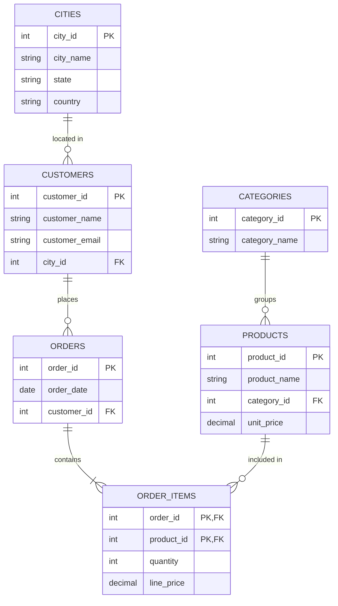
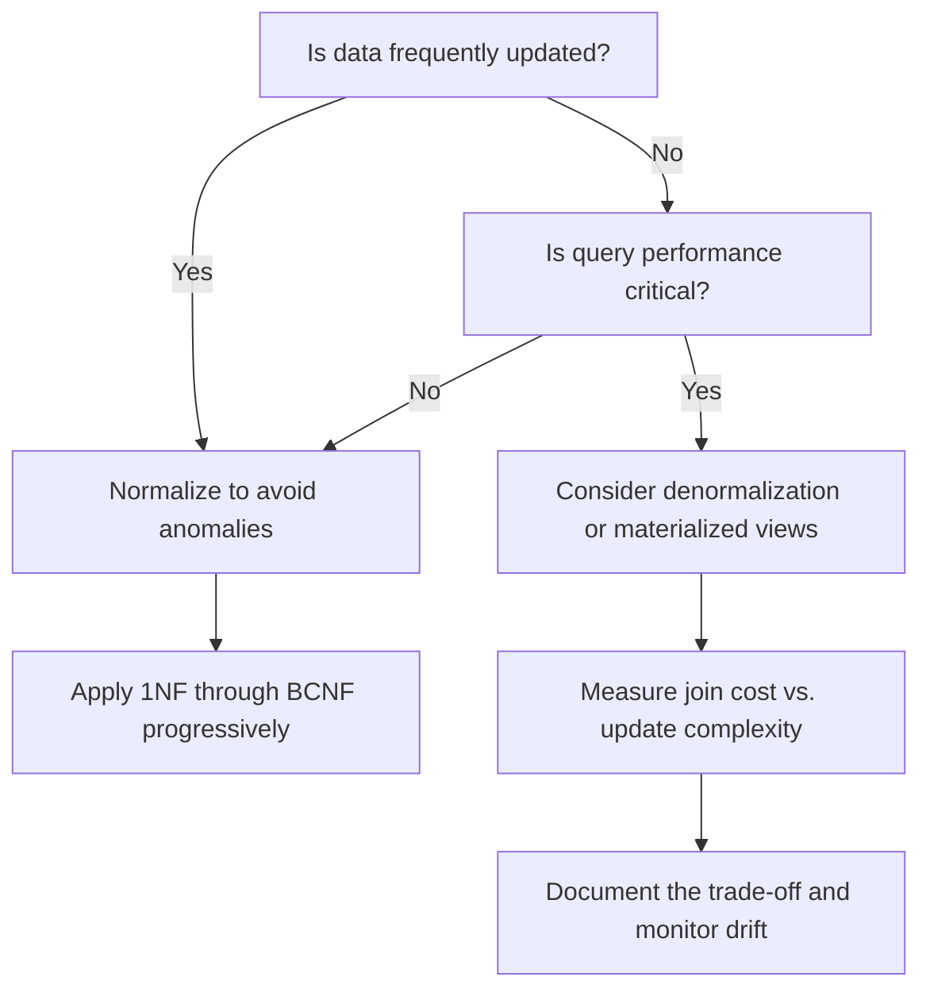

# How to Build Database Normalization Strategies

Author: [nawazdhandala](https://github.com/nawazdhandala)

Tags: Database, Normalization, SQL, Design

Description: A practical guide to database normalization from 1NF through BCNF, with SQL examples and advice on when breaking the rules makes sense.

---

Normalization is the process of organizing tables to reduce redundancy and prevent anomalies during inserts, updates, and deletes. Done right, it keeps your data consistent and your queries predictable. Done wrong, or taken too far, it turns simple lookups into join nightmares. This post walks through each normal form with concrete SQL examples, diagrams, and guidance on when to denormalize for performance.

## Why Normalization Matters

Before diving into the forms, consider what happens without normalization:

- **Update anomalies:** Change a customer's address in one row but forget another, and now the same customer has two addresses.
- **Insert anomalies:** You cannot record a new product category until at least one product exists in it.
- **Delete anomalies:** Removing the last order for a customer accidentally deletes the customer record too.

Normalization eliminates these problems by structuring tables so each fact lives in exactly one place.

## The Unnormalized Starting Point

Imagine an order management system with this flat table:

```sql
CREATE TABLE orders_flat (
    order_id INT,
    order_date DATE,
    customer_name VARCHAR(100),
    customer_email VARCHAR(100),
    customer_city VARCHAR(50),
    product_name VARCHAR(100),
    product_category VARCHAR(50),
    quantity INT,
    unit_price DECIMAL(10,2)
);
```

A single order with multiple products might look like this:

| order_id | order_date | customer_name | customer_email | customer_city | product_name | product_category | quantity | unit_price |
|----------|------------|---------------|----------------|---------------|--------------|------------------|----------|------------|
| 1 | 2026-01-15 | Alice Chen | alice@example.com | Seattle | Keyboard | Electronics | 2 | 75.00 |
| 1 | 2026-01-15 | Alice Chen | alice@example.com | Seattle | Monitor | Electronics | 1 | 350.00 |
| 2 | 2026-01-16 | Bob Smith | bob@example.com | Denver | Desk Chair | Furniture | 1 | 200.00 |

Customer data repeats on every row. Product categories duplicate. If Alice moves to Portland, you need to update every row she has ever ordered from.

## First Normal Form (1NF)

**Rule:** Each column holds atomic values, and each row is unique.

The table above already satisfies 1NF because no column contains lists or nested structures, and we can identify rows by a composite key (order_id, product_name). However, a common 1NF violation looks like this:

```sql
-- Violates 1NF: products stored as comma-separated list
CREATE TABLE orders_bad (
    order_id INT PRIMARY KEY,
    products VARCHAR(500)  -- "Keyboard, Monitor"
);
```

To fix it, move each product to its own row:

```sql
CREATE TABLE order_items (
    order_id INT,
    product_name VARCHAR(100),
    quantity INT,
    PRIMARY KEY (order_id, product_name)
);
```

**1NF summary:** No repeating groups, no multi-valued columns, every row uniquely identifiable.

## Second Normal Form (2NF)

**Rule:** Meet 1NF, plus every non-key column depends on the entire primary key, not just part of it.

2NF matters when you have a composite primary key. In our order_items table, the key is (order_id, product_name). But what if we also stored unit_price there?

```sql
CREATE TABLE order_items_bad (
    order_id INT,
    product_name VARCHAR(100),
    quantity INT,
    unit_price DECIMAL(10,2),  -- Depends only on product_name
    PRIMARY KEY (order_id, product_name)
);
```

The unit_price depends on product_name alone, not on the combination of order_id and product_name. This is a partial dependency, which violates 2NF.

**Fix:** Extract products into their own table:

```sql
CREATE TABLE products (
    product_id INT PRIMARY KEY,
    product_name VARCHAR(100) UNIQUE,
    unit_price DECIMAL(10,2)
);

CREATE TABLE order_items (
    order_id INT,
    product_id INT,
    quantity INT,
    PRIMARY KEY (order_id, product_id),
    FOREIGN KEY (product_id) REFERENCES products(product_id)
);
```

Now unit_price lives with the product, and order_items only tracks what was ordered and how many.

**2NF summary:** Remove partial dependencies by extracting columns that depend on only part of a composite key.

## Third Normal Form (3NF)

**Rule:** Meet 2NF, plus no transitive dependencies. Non-key columns must depend directly on the primary key, not on other non-key columns.

Look at a customers table:

```sql
CREATE TABLE customers_bad (
    customer_id INT PRIMARY KEY,
    customer_name VARCHAR(100),
    customer_email VARCHAR(100),
    city VARCHAR(50),
    state VARCHAR(50),
    country VARCHAR(50)
);
```

Here, state depends on city, and country depends on state. These are transitive dependencies. If a city moves to a different state (rare, but administrative boundaries do change), you would have to update every customer in that city.

**Fix:** Separate location data:

```sql
CREATE TABLE cities (
    city_id INT PRIMARY KEY,
    city_name VARCHAR(50),
    state VARCHAR(50),
    country VARCHAR(50)
);

CREATE TABLE customers (
    customer_id INT PRIMARY KEY,
    customer_name VARCHAR(100),
    customer_email VARCHAR(100),
    city_id INT,
    FOREIGN KEY (city_id) REFERENCES cities(city_id)
);
```

**3NF summary:** Every non-key column depends on the key, the whole key, and nothing but the key.

## Boyce-Codd Normal Form (BCNF)

**Rule:** For every functional dependency X -> Y, X must be a superkey.

BCNF is a stricter version of 3NF. Most tables that satisfy 3NF also satisfy BCNF, but edge cases exist. Consider a course scheduling scenario:

```sql
CREATE TABLE course_assignments (
    student_id INT,
    course VARCHAR(50),
    instructor VARCHAR(50),
    PRIMARY KEY (student_id, course)
);
```

Suppose each course is taught by exactly one instructor (course -> instructor), but an instructor can teach multiple courses. The primary key is (student_id, course), but course alone determines instructor. Since course is not a superkey, this violates BCNF.

**Fix:** Split into two tables:

```sql
CREATE TABLE courses (
    course VARCHAR(50) PRIMARY KEY,
    instructor VARCHAR(50)
);

CREATE TABLE enrollments (
    student_id INT,
    course VARCHAR(50),
    PRIMARY KEY (student_id, course),
    FOREIGN KEY (course) REFERENCES courses(course)
);
```

Now every determinant (course) is a key in its own table.

**BCNF summary:** Every determinant must be a candidate key. This eliminates all remaining redundancy from functional dependencies.

## The Full Normalized Schema

Putting it all together for our order system:

```sql
CREATE TABLE cities (
    city_id INT PRIMARY KEY,
    city_name VARCHAR(50),
    state VARCHAR(50),
    country VARCHAR(50)
);

CREATE TABLE customers (
    customer_id INT PRIMARY KEY,
    customer_name VARCHAR(100),
    customer_email VARCHAR(100) UNIQUE,
    city_id INT,
    FOREIGN KEY (city_id) REFERENCES cities(city_id)
);

CREATE TABLE categories (
    category_id INT PRIMARY KEY,
    category_name VARCHAR(50) UNIQUE
);

CREATE TABLE products (
    product_id INT PRIMARY KEY,
    product_name VARCHAR(100),
    category_id INT,
    unit_price DECIMAL(10,2),
    FOREIGN KEY (category_id) REFERENCES categories(category_id)
);

CREATE TABLE orders (
    order_id INT PRIMARY KEY,
    order_date DATE,
    customer_id INT,
    FOREIGN KEY (customer_id) REFERENCES customers(customer_id)
);

CREATE TABLE order_items (
    order_id INT,
    product_id INT,
    quantity INT,
    line_price DECIMAL(10,2),  -- Snapshot at time of order
    PRIMARY KEY (order_id, product_id),
    FOREIGN KEY (order_id) REFERENCES orders(order_id),
    FOREIGN KEY (product_id) REFERENCES products(product_id)
);
```

## Entity Relationship Diagram



## When to Denormalize

Normalization optimizes for write consistency and storage efficiency. But reads often suffer because queries require multiple joins. Here are situations where denormalization makes sense:

### 1. Read-Heavy Reporting

If your analytics dashboard runs the same aggregation query thousands of times per hour, materializing a denormalized view or summary table avoids repeated joins:

```sql
CREATE TABLE order_summary AS
SELECT
    o.order_id,
    o.order_date,
    c.customer_name,
    c.customer_email,
    ci.city_name,
    ci.state,
    SUM(oi.line_price) AS order_total
FROM orders o
JOIN customers c ON o.customer_id = c.customer_id
JOIN cities ci ON c.city_id = ci.city_id
JOIN order_items oi ON o.order_id = oi.order_id
GROUP BY o.order_id, o.order_date, c.customer_name, c.customer_email, ci.city_name, ci.state;
```

Refresh this table on a schedule or via triggers.

### 2. Caching Computed Values

Storing a computed total on the order row saves recalculating it on every read:

```sql
ALTER TABLE orders ADD COLUMN order_total DECIMAL(10,2);

-- Update via trigger or application logic after each order_items change
```

Accept the risk of stale data in exchange for faster reads.

### 3. Reducing Join Depth

If every product query also needs category name, and categories rarely change, embedding category_name directly in products might be acceptable:

```sql
ALTER TABLE products ADD COLUMN category_name VARCHAR(50);
```

You trade storage and update complexity for simpler queries.

### 4. Time-Series and Logging Tables

Append-only logs rarely need updates. Denormalizing user metadata into each log row lets you query without joining:

```sql
CREATE TABLE activity_log (
    log_id BIGINT PRIMARY KEY,
    event_time TIMESTAMP,
    user_id INT,
    user_email VARCHAR(100),  -- Denormalized
    action VARCHAR(50),
    details JSONB
);
```

Historical accuracy often matters more than current accuracy here.

## Decision Framework



## Practical Tips

1. **Start normalized.** It is easier to denormalize later than to normalize a tangled schema under production load.

2. **Benchmark real queries.** Do not assume joins are slow. Modern databases with proper indexes handle joins efficiently. Measure before optimizing.

3. **Use database features.** Materialized views, generated columns, and covering indexes often give you the read performance of denormalization without duplicating data in your schema.

4. **Document exceptions.** When you denormalize, write down why. Future maintainers need to understand the trade-off.

5. **Monitor for drift.** Denormalized columns can go stale. Build alerts or reconciliation jobs to catch inconsistencies.

## Summary

| Normal Form | Eliminates | Key Rule |
|-------------|------------|----------|
| 1NF | Repeating groups | Atomic values, unique rows |
| 2NF | Partial dependencies | Non-key columns depend on the whole key |
| 3NF | Transitive dependencies | Non-key columns depend only on the key |
| BCNF | All functional dependency anomalies | Every determinant is a superkey |

Normalization is a tool, not a religion. Apply it rigorously during initial design, measure query performance with realistic data, and denormalize deliberately when the numbers justify it. The goal is a schema you can reason about, update safely, and query without surprises.
