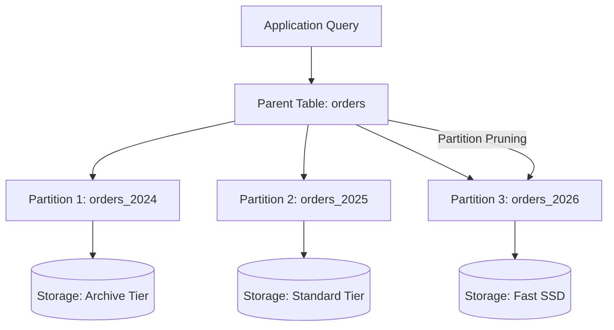
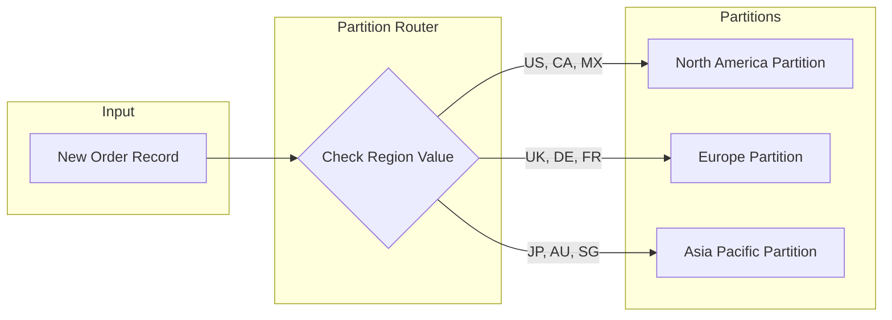

# How to Build Database Partitioning Types

Author: [nawazdhandala](https://github.com/nawazdhandala)

Tags: Database, Partitioning, PostgreSQL, MySQL

Description: Learn to build different database partitioning types including range, list, and hash partitioning.

---

Database partitioning splits large tables into smaller, more manageable pieces while keeping them logically unified. When your tables grow to millions or billions of rows, queries slow down, maintenance becomes painful, and storage costs increase. Partitioning solves these problems by organizing data into separate physical segments based on specific rules.

This guide walks through building three main partitioning types: range, list, and hash. Each serves different use cases, and understanding when to use which type will help you design better database architectures.

## Why Partition Your Database?

Before diving into implementation, here is why partitioning matters:

| Benefit | Description |
|---------|-------------|
| Query Performance | Partition pruning allows queries to scan only relevant partitions instead of entire tables |
| Maintenance Efficiency | Operations like VACUUM, REINDEX, or archiving can target individual partitions |
| Storage Management | Old partitions can be moved to cheaper storage or dropped entirely |
| Parallel Processing | Different partitions can be processed simultaneously |

## Partitioning Architecture Overview

The following diagram shows how a partitioned table distributes data across multiple partitions:



## Range Partitioning

Range partitioning divides data based on a continuous range of values. This works well for time-series data, sequential IDs, or any column with natural ordering.

The following SQL creates a range-partitioned table in PostgreSQL for storing order data by year:

```sql
-- Create the parent table with range partitioning
CREATE TABLE orders (
    order_id BIGSERIAL,
    customer_id INTEGER NOT NULL,
    order_date DATE NOT NULL,
    total_amount DECIMAL(10,2),
    status VARCHAR(20)
) PARTITION BY RANGE (order_date);

-- Create individual partitions for each year
CREATE TABLE orders_2024 PARTITION OF orders
    FOR VALUES FROM ('2024-01-01') TO ('2025-01-01');

CREATE TABLE orders_2025 PARTITION OF orders
    FOR VALUES FROM ('2025-01-01') TO ('2026-01-01');

CREATE TABLE orders_2026 PARTITION OF orders
    FOR VALUES FROM ('2026-01-01') TO ('2027-01-01');

-- Create indexes on each partition for faster lookups
CREATE INDEX idx_orders_2024_customer ON orders_2024(customer_id);
CREATE INDEX idx_orders_2025_customer ON orders_2025(customer_id);
CREATE INDEX idx_orders_2026_customer ON orders_2026(customer_id);
```

MySQL handles range partitioning differently. Here is the equivalent setup:

```sql
-- MySQL range partitioning syntax
CREATE TABLE orders (
    order_id BIGINT AUTO_INCREMENT,
    customer_id INT NOT NULL,
    order_date DATE NOT NULL,
    total_amount DECIMAL(10,2),
    status VARCHAR(20),
    PRIMARY KEY (order_id, order_date)
) PARTITION BY RANGE (YEAR(order_date)) (
    PARTITION p2024 VALUES LESS THAN (2025),
    PARTITION p2025 VALUES LESS THAN (2026),
    PARTITION p2026 VALUES LESS THAN (2027),
    PARTITION p_future VALUES LESS THAN MAXVALUE
);
```

## List Partitioning

List partitioning assigns rows to partitions based on discrete values. This suits categorical data like regions, product types, or status codes.

The diagram below illustrates how list partitioning routes data based on region values:



Here is the PostgreSQL implementation for list partitioning by region:

```sql
-- Create table partitioned by region list
CREATE TABLE customer_data (
    customer_id BIGSERIAL,
    name VARCHAR(100) NOT NULL,
    email VARCHAR(255),
    region VARCHAR(10) NOT NULL,
    created_at TIMESTAMP DEFAULT NOW()
) PARTITION BY LIST (region);

-- Create partitions for each region group
CREATE TABLE customer_data_na PARTITION OF customer_data
    FOR VALUES IN ('US', 'CA', 'MX');

CREATE TABLE customer_data_eu PARTITION OF customer_data
    FOR VALUES IN ('UK', 'DE', 'FR', 'ES', 'IT');

CREATE TABLE customer_data_apac PARTITION OF customer_data
    FOR VALUES IN ('JP', 'AU', 'SG', 'KR', 'IN');

-- Add a default partition for unspecified regions
CREATE TABLE customer_data_other PARTITION OF customer_data
    DEFAULT;
```

## Hash Partitioning

Hash partitioning distributes data evenly across partitions using a hash function. When you need uniform distribution without natural groupings, hash partitioning prevents data skew.

The following table compares when to use each partitioning type:

| Partitioning Type | Best For | Distribution | Pruning Efficiency |
|-------------------|----------|--------------|-------------------|
| Range | Time-series, sequential data | Based on value ranges | High for range queries |
| List | Categorical data, regions | Based on exact values | High for value lookups |
| Hash | Even distribution, random access | Mathematically computed | Lower, requires exact key |

PostgreSQL hash partitioning implementation:

```sql
-- Create hash-partitioned table for user sessions
CREATE TABLE user_sessions (
    session_id UUID NOT NULL,
    user_id INTEGER NOT NULL,
    started_at TIMESTAMP NOT NULL,
    data JSONB
) PARTITION BY HASH (session_id);

-- Create four hash partitions for even distribution
CREATE TABLE user_sessions_p0 PARTITION OF user_sessions
    FOR VALUES WITH (MODULUS 4, REMAINDER 0);

CREATE TABLE user_sessions_p1 PARTITION OF user_sessions
    FOR VALUES WITH (MODULUS 4, REMAINDER 1);

CREATE TABLE user_sessions_p2 PARTITION OF user_sessions
    FOR VALUES WITH (MODULUS 4, REMAINDER 2);

CREATE TABLE user_sessions_p3 PARTITION OF user_sessions
    FOR VALUES WITH (MODULUS 4, REMAINDER 3);
```

## Composite Partitioning

For complex scenarios, you can combine partitioning strategies. This example shows sub-partitioning by hash within range partitions:

```sql
-- Range partition by date, then hash partition by customer_id
CREATE TABLE transactions (
    txn_id BIGSERIAL,
    customer_id INTEGER NOT NULL,
    txn_date DATE NOT NULL,
    amount DECIMAL(12,2)
) PARTITION BY RANGE (txn_date);

-- Create range partition for 2026
CREATE TABLE transactions_2026 PARTITION OF transactions
    FOR VALUES FROM ('2026-01-01') TO ('2027-01-01')
    PARTITION BY HASH (customer_id);

-- Sub-partitions within the 2026 range
CREATE TABLE transactions_2026_p0
    PARTITION OF transactions_2026
    FOR VALUES WITH (MODULUS 4, REMAINDER 0);

CREATE TABLE transactions_2026_p1
    PARTITION OF transactions_2026
    FOR VALUES WITH (MODULUS 4, REMAINDER 1);
```

## Partition Management Operations

Managing partitions involves adding new ones and removing old ones. Here are common operations:

```sql
-- Add a new partition for next year
CREATE TABLE orders_2027 PARTITION OF orders
    FOR VALUES FROM ('2027-01-01') TO ('2028-01-01');

-- Detach a partition (keeps data, removes from parent)
ALTER TABLE orders DETACH PARTITION orders_2024;

-- Drop a partition entirely (deletes all data in partition)
DROP TABLE orders_2024;

-- Move partition to different tablespace
ALTER TABLE orders_2025 SET TABLESPACE archive_storage;
```

## Query Optimization with Partitions

The database optimizer uses partition pruning to skip irrelevant partitions. This query only scans the 2026 partition:

```sql
-- This query benefits from partition pruning
EXPLAIN ANALYZE
SELECT order_id, total_amount
FROM orders
WHERE order_date BETWEEN '2026-03-01' AND '2026-03-31';

-- Output shows only orders_2026 partition scanned
```

## Summary

Building database partitioning requires choosing the right strategy for your data patterns. Use range partitioning for time-series and sequential data. Use list partitioning when your data naturally groups into categories. Use hash partitioning when you need even distribution across partitions.

Start with a single partitioning type and add complexity only when needed. Monitor partition sizes and query patterns to ensure your partitioning strategy continues to serve your application well as data grows.
