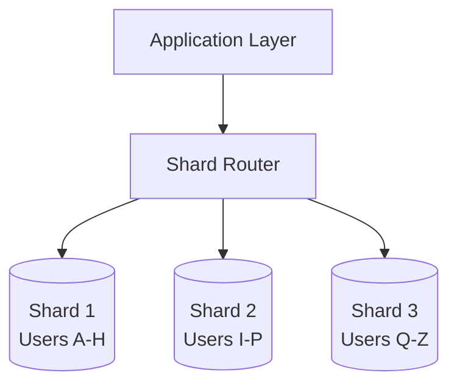
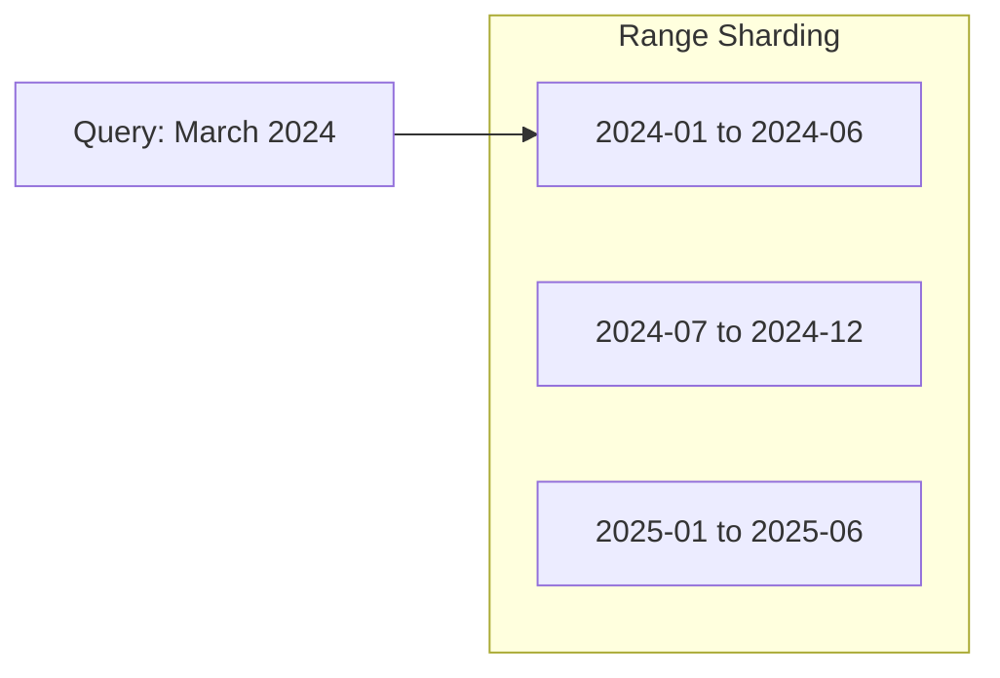

# How to Create Database Sharding Strategies

Author: [nawazdhandala](https://www.github.com/nawazdhandala)

Tags: Database, Sharding, Scaling, Architecture, Distributed Systems

Description: Design database sharding strategies with hash-based, range-based, and directory-based approaches for horizontal scaling of large datasets.

---

When your database starts groaning under millions of rows and read/write throughput tanks, vertical scaling only buys you time. Eventually, you need to split data across multiple database instances. That's sharding.

This guide walks through the three main sharding strategies, complete with code examples and trade-offs you'll encounter in production.

## What Sharding Actually Solves

Before diving into strategies, let's be clear about what sharding addresses:

- **Write bottlenecks**: A single database server has finite IOPS
- **Storage limits**: Even the beefiest server runs out of disk
- **Read latency**: Scanning billions of rows gets slow no matter how many indexes you add
- **Geographic distribution**: Users in Tokyo shouldn't wait for queries to round-trip to Virginia

Sharding distributes both data and load across multiple independent database nodes (shards). Each shard holds a subset of the total dataset.



## Strategy 1: Hash-Based Sharding

Hash-based sharding applies a hash function to a shard key (like user ID) and uses the result to determine which shard stores the data.

The following Python function demonstrates consistent shard selection based on user ID.

```python
import hashlib

def get_shard(user_id: str, num_shards: int) -> int:
    """
    Compute the shard index for a given user ID.

    Uses MD5 for uniform distribution. The modulo operation
    maps the hash to one of the available shards.
    """
    # Generate a consistent hash from the user_id
    hash_value = int(hashlib.md5(user_id.encode()).hexdigest(), 16)

    # Map to shard index
    return hash_value % num_shards


# Example: route a user to their shard
user_id = "user_12345"
shard_index = get_shard(user_id, num_shards=4)
print(f"User {user_id} belongs to shard {shard_index}")
```

**Pros:**
- Even data distribution across shards
- Simple to implement
- No need for a lookup table

**Cons:**
- Adding or removing shards requires rehashing (and migrating) most data
- Range queries (e.g., "all users created last week") hit every shard

### Handling Shard Expansion with Consistent Hashing

Standard modulo hashing breaks when you add shards. Consistent hashing minimizes data movement.

This implementation uses a hash ring where each shard owns a segment of the ring.

```python
import hashlib
from bisect import bisect_right
from typing import Dict, List

class ConsistentHashRing:
    """
    A consistent hash ring that minimizes data movement
    when shards are added or removed.
    """

    def __init__(self, shards: List[str], replicas: int = 100):
        """
        Initialize the ring with virtual nodes for each shard.

        Args:
            shards: List of shard identifiers (e.g., ["shard-0", "shard-1"])
            replicas: Virtual nodes per shard for better distribution
        """
        self.replicas = replicas
        self.ring: Dict[int, str] = {}
        self.sorted_keys: List[int] = []

        for shard in shards:
            self.add_shard(shard)

    def _hash(self, key: str) -> int:
        """Generate a consistent hash position on the ring."""
        return int(hashlib.sha256(key.encode()).hexdigest(), 16)

    def add_shard(self, shard: str) -> None:
        """Add a shard with its virtual nodes to the ring."""
        for i in range(self.replicas):
            virtual_key = f"{shard}:{i}"
            hash_val = self._hash(virtual_key)
            self.ring[hash_val] = shard
            self.sorted_keys.append(hash_val)

        self.sorted_keys.sort()

    def remove_shard(self, shard: str) -> None:
        """Remove a shard and its virtual nodes from the ring."""
        for i in range(self.replicas):
            virtual_key = f"{shard}:{i}"
            hash_val = self._hash(virtual_key)
            del self.ring[hash_val]
            self.sorted_keys.remove(hash_val)

    def get_shard(self, key: str) -> str:
        """
        Find the shard responsible for a given key.
        Walks clockwise on the ring to find the first shard.
        """
        if not self.ring:
            raise ValueError("No shards available")

        hash_val = self._hash(key)

        # Find the first shard position >= hash_val
        idx = bisect_right(self.sorted_keys, hash_val)

        # Wrap around to the first shard if we're past the end
        if idx == len(self.sorted_keys):
            idx = 0

        return self.ring[self.sorted_keys[idx]]


# Usage example
ring = ConsistentHashRing(["shard-0", "shard-1", "shard-2"])

# Route some keys
for user_id in ["alice", "bob", "charlie", "david"]:
    shard = ring.get_shard(user_id)
    print(f"{user_id} -> {shard}")

# Adding a new shard only moves ~25% of keys
ring.add_shard("shard-3")
```

## Strategy 2: Range-Based Sharding

Range-based sharding partitions data by value ranges. Common examples include date ranges for time-series data or alphabetical ranges for user names.



This SQL schema demonstrates range-based partitioning in PostgreSQL.

```sql
-- Create the parent table for orders
CREATE TABLE orders (
    order_id    BIGSERIAL,
    customer_id BIGINT NOT NULL,
    order_date  DATE NOT NULL,
    total       DECIMAL(10, 2),
    PRIMARY KEY (order_id, order_date)
) PARTITION BY RANGE (order_date);

-- Create partitions for each quarter
-- Each partition lives on a different shard/tablespace

CREATE TABLE orders_2024_q1 PARTITION OF orders
    FOR VALUES FROM ('2024-01-01') TO ('2024-04-01');

CREATE TABLE orders_2024_q2 PARTITION OF orders
    FOR VALUES FROM ('2024-04-01') TO ('2024-07-01');

CREATE TABLE orders_2024_q3 PARTITION OF orders
    FOR VALUES FROM ('2024-07-01') TO ('2024-10-01');

CREATE TABLE orders_2024_q4 PARTITION OF orders
    FOR VALUES FROM ('2024-10-01') TO ('2025-01-01');

-- Queries automatically route to the correct partition
SELECT * FROM orders
WHERE order_date BETWEEN '2024-02-01' AND '2024-03-15';
-- This only scans orders_2024_q1
```

**Pros:**
- Range queries are efficient (only relevant shards are scanned)
- Easy to archive old data (drop entire partitions)
- Natural fit for time-series workloads

**Cons:**
- Hot spots if recent data gets all the traffic
- Uneven distribution if ranges aren't chosen carefully

## Strategy 3: Directory-Based Sharding

Directory-based sharding uses a lookup table that maps each entity to its shard. This provides maximum flexibility but introduces a lookup dependency.

The router queries a directory service to find the correct shard.

```python
import redis
from typing import Optional

class ShardDirectory:
    """
    A directory service that maps entities to their shards.
    Uses Redis for fast lookups with persistence.
    """

    def __init__(self, redis_client: redis.Redis):
        self.redis = redis_client
        self.directory_key = "shard:directory"

    def assign_shard(self, entity_id: str, shard_id: str) -> None:
        """
        Assign an entity to a specific shard.
        Called during entity creation or migration.
        """
        self.redis.hset(self.directory_key, entity_id, shard_id)

    def get_shard(self, entity_id: str) -> Optional[str]:
        """
        Look up which shard holds a given entity.
        Returns None if the entity hasn't been assigned.
        """
        shard = self.redis.hget(self.directory_key, entity_id)
        return shard.decode() if shard else None

    def migrate_entity(self, entity_id: str, new_shard: str) -> None:
        """
        Update the directory after migrating an entity.
        The actual data migration happens separately.
        """
        self.assign_shard(entity_id, new_shard)

    def get_shard_stats(self) -> dict:
        """
        Return count of entities per shard for monitoring.
        Useful for detecting imbalanced shards.
        """
        all_mappings = self.redis.hgetall(self.directory_key)
        stats = {}

        for entity_id, shard_id in all_mappings.items():
            shard = shard_id.decode()
            stats[shard] = stats.get(shard, 0) + 1

        return stats


# Usage example
redis_client = redis.Redis(host='localhost', port=6379)
directory = ShardDirectory(redis_client)

# Assign new users to shards based on current load
directory.assign_shard("user_001", "shard-us-west-1")
directory.assign_shard("user_002", "shard-eu-central-1")

# Route a query
shard = directory.get_shard("user_001")
print(f"Query user_001 on {shard}")
```

**Pros:**
- Complete control over data placement
- Easy to rebalance by updating the directory
- Supports complex placement rules (geo, compliance, customer tier)

**Cons:**
- Directory becomes a single point of failure
- Extra network hop for every query
- Directory must scale with entity count

## Choosing the Right Strategy

The decision often comes down to query patterns:

| Pattern | Best Strategy |
|---------|---------------|
| Random access by ID | Hash-based |
| Time-range queries | Range-based |
| Geographic requirements | Directory-based |
| Multi-tenant isolation | Directory-based |
| Even write distribution | Hash-based with consistent hashing |

## Cross-Shard Query Considerations

Sharding works best when queries stay within a single shard. Cross-shard operations are expensive. Here's a pattern for scatter-gather queries when you can't avoid them.

```python
import asyncio
from typing import List, Dict, Any

async def scatter_gather_query(
    shards: List[str],
    query: str,
    params: dict
) -> List[Dict[str, Any]]:
    """
    Execute a query across all shards and merge results.
    Use sparingly - this defeats the purpose of sharding.
    """

    async def query_shard(shard: str) -> List[Dict[str, Any]]:
        # Each shard has its own connection pool
        connection = await get_shard_connection(shard)
        results = await connection.fetch(query, **params)
        return [dict(row) for row in results]

    # Query all shards concurrently
    tasks = [query_shard(shard) for shard in shards]
    shard_results = await asyncio.gather(*tasks)

    # Flatten results from all shards
    merged = []
    for results in shard_results:
        merged.extend(results)

    return merged
```

## Final Thoughts

Sharding isn't something you bolt on later without pain. Design for it early if you anticipate scale. Pick your shard key carefully - changing it later means migrating everything.

Start simple. Hash-based sharding with consistent hashing handles most use cases. Move to directory-based only when you need fine-grained control over data placement.

And remember: the best sharding strategy is the one that matches your access patterns. Profile your queries before you architect your shards.
