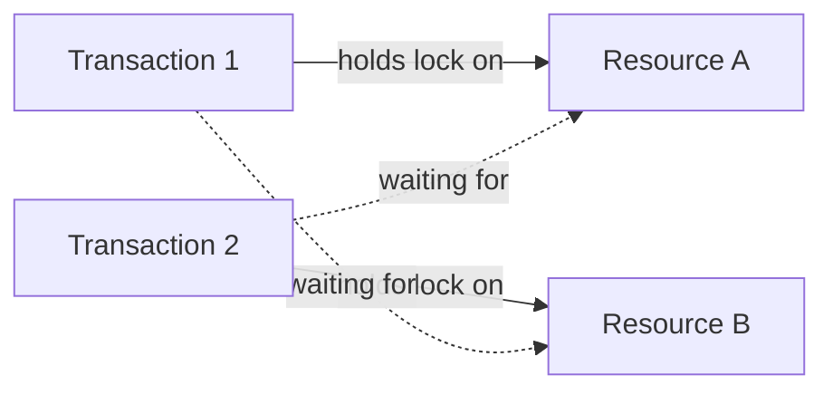
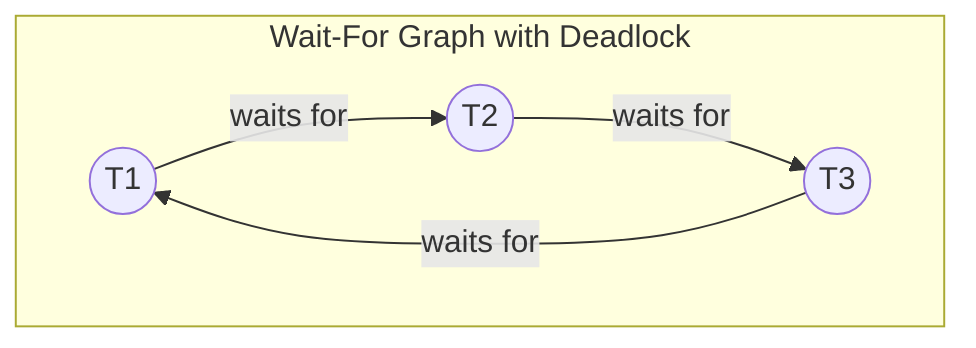
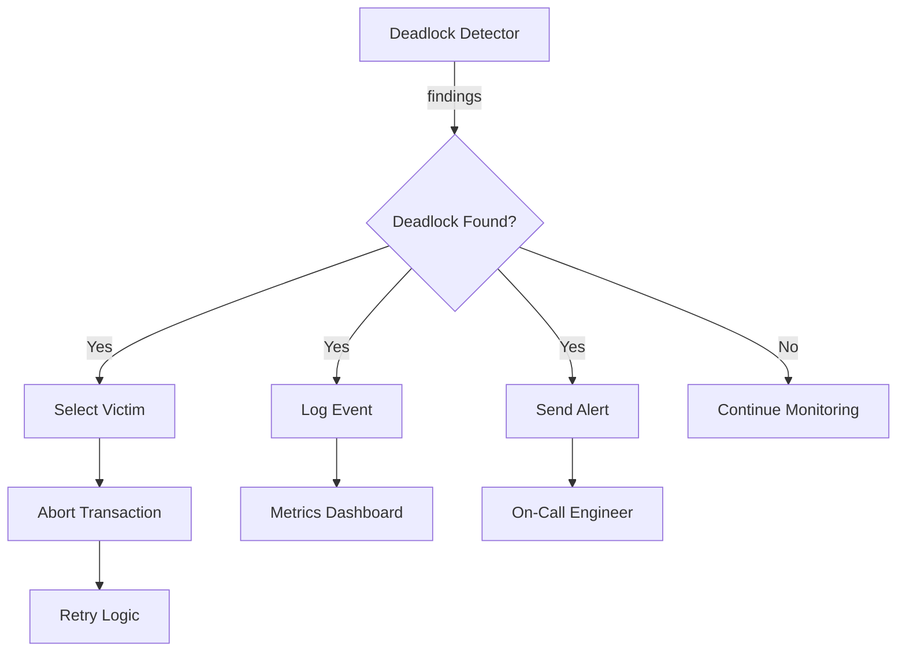

# How to Create Deadlock Detection

Author: [nawazdhandala](https://github.com/nawazdhandala)

Tags: Database, Deadlock, Monitoring, Troubleshooting

Description: Learn to create deadlock detection mechanisms for identifying and resolving database deadlocks.

---

Deadlocks are one of the most frustrating problems in database systems. Two or more transactions wait forever for each other to release locks, and your application grinds to a halt. The good news: you can build detection mechanisms that catch these situations before they cause outages.

This guide walks through the fundamentals of deadlock detection, from understanding how deadlocks form to implementing practical detection algorithms.

---

## What Is a Deadlock?

A deadlock occurs when two or more processes hold resources and each waits for a resource held by another. None can proceed. Consider this scenario:



Transaction 1 holds Resource A and wants Resource B. Transaction 2 holds Resource B and wants Resource A. Neither will release their lock until they get the other resource. Classic circular wait.

---

## The Four Conditions for Deadlock

Deadlocks require all four of these conditions to exist simultaneously. Remove any one and deadlock becomes impossible.

| Condition | Description | Example |
|-----------|-------------|---------|
| Mutual Exclusion | Resources cannot be shared | A row lock in a database |
| Hold and Wait | Process holds resources while waiting for others | Transaction keeps lock on table A while requesting lock on table B |
| No Preemption | Resources cannot be forcibly taken | Database cannot revoke a lock from an active transaction |
| Circular Wait | Chain of processes where each waits for the next | T1 waits for T2, T2 waits for T3, T3 waits for T1 |

---

## Detection Approach: Wait-For Graphs

The most common detection method uses a Wait-For Graph (WFG). Each node represents a transaction. Each directed edge represents "waits for" relationship. A cycle in this graph means deadlock.



The cycle T1 -> T2 -> T3 -> T1 indicates a deadlock involving three transactions.

---

## Building the Wait-For Graph

The following Python code demonstrates how to build and maintain a Wait-For Graph data structure. It tracks which transactions hold locks and which are waiting for locks.

```python
from collections import defaultdict
from typing import Dict, Set, List, Optional

class WaitForGraph:
    """
    Maintains a Wait-For Graph for deadlock detection.
    Nodes are transaction IDs, edges represent wait relationships.
    """

    def __init__(self):
        # Maps transaction -> set of transactions it waits for
        self.edges: Dict[str, Set[str]] = defaultdict(set)
        # Maps resource -> transaction holding the lock
        self.lock_holders: Dict[str, str] = {}
        # Maps resource -> list of transactions waiting
        self.wait_queues: Dict[str, List[str]] = defaultdict(list)

    def acquire_lock(self, txn_id: str, resource: str) -> bool:
        """
        Attempt to acquire a lock on a resource.
        Returns True if lock granted, False if must wait.
        """
        if resource not in self.lock_holders:
            # Resource is free, grant the lock
            self.lock_holders[resource] = txn_id
            return True

        holder = self.lock_holders[resource]
        if holder == txn_id:
            # Transaction already holds this lock
            return True

        # Must wait for the current holder
        self.edges[txn_id].add(holder)
        self.wait_queues[resource].append(txn_id)
        return False

    def release_lock(self, txn_id: str, resource: str):
        """
        Release a lock and update wait relationships.
        """
        if self.lock_holders.get(resource) != txn_id:
            return

        del self.lock_holders[resource]

        # Grant lock to next waiter if any
        if self.wait_queues[resource]:
            next_txn = self.wait_queues[resource].pop(0)
            self.lock_holders[resource] = next_txn
            # Remove wait edge
            self.edges[next_txn].discard(txn_id)
```

---

## Detecting Cycles with DFS

Cycle detection uses depth-first search. When we encounter a node already in our current path, we have found a cycle. This implementation returns the transactions involved in the deadlock.

```python
def detect_deadlock(self) -> Optional[List[str]]:
    """
    Detect deadlock by finding cycles in the Wait-For Graph.
    Returns list of transaction IDs in the cycle, or None.
    """
    visited = set()
    rec_stack = set()  # Tracks nodes in current DFS path
    path = []          # Records the actual path for cycle extraction

    def dfs(node: str) -> Optional[List[str]]:
        visited.add(node)
        rec_stack.add(node)
        path.append(node)

        for neighbor in self.edges.get(node, []):
            if neighbor not in visited:
                result = dfs(neighbor)
                if result:
                    return result
            elif neighbor in rec_stack:
                # Found a cycle, extract it
                cycle_start = path.index(neighbor)
                return path[cycle_start:]

        path.pop()
        rec_stack.remove(node)
        return None

    # Check all nodes as potential cycle starts
    for node in list(self.edges.keys()):
        if node not in visited:
            cycle = dfs(node)
            if cycle:
                return cycle

    return None
```

---

## Complete Detection System

Here is a complete deadlock detector that runs periodically and handles detection events. It includes timeout-based detection as a backup mechanism.

```python
import time
import threading
from datetime import datetime, timedelta

class DeadlockDetector:
    """
    Production-ready deadlock detection system.
    Combines graph-based detection with timeout monitoring.
    """

    def __init__(self, check_interval: float = 1.0, lock_timeout: float = 30.0):
        self.graph = WaitForGraph()
        self.check_interval = check_interval  # Seconds between checks
        self.lock_timeout = lock_timeout      # Max seconds to wait for lock
        self.wait_start_times: Dict[str, datetime] = {}
        self.running = False
        self._lock = threading.Lock()

    def request_lock(self, txn_id: str, resource: str) -> bool:
        """
        Request a lock, tracking wait time for timeout detection.
        """
        with self._lock:
            granted = self.graph.acquire_lock(txn_id, resource)
            if not granted:
                self.wait_start_times[txn_id] = datetime.now()
            return granted

    def release_lock(self, txn_id: str, resource: str):
        """
        Release a lock and clean up wait tracking.
        """
        with self._lock:
            self.graph.release_lock(txn_id, resource)
            self.wait_start_times.pop(txn_id, None)

    def check_for_deadlocks(self) -> dict:
        """
        Run detection and return findings.
        """
        with self._lock:
            result = {
                "timestamp": datetime.now().isoformat(),
                "cycle_deadlock": None,
                "timeout_deadlocks": []
            }

            # Graph-based cycle detection
            cycle = self.graph.detect_deadlock()
            if cycle:
                result["cycle_deadlock"] = {
                    "transactions": cycle,
                    "type": "circular_wait"
                }

            # Timeout-based detection
            now = datetime.now()
            for txn_id, start_time in list(self.wait_start_times.items()):
                wait_duration = (now - start_time).total_seconds()
                if wait_duration > self.lock_timeout:
                    result["timeout_deadlocks"].append({
                        "transaction": txn_id,
                        "wait_seconds": wait_duration,
                        "type": "timeout"
                    })

            return result

    def start_monitoring(self, callback):
        """
        Start background thread that periodically checks for deadlocks.
        """
        self.running = True

        def monitor_loop():
            while self.running:
                findings = self.check_for_deadlocks()
                if findings["cycle_deadlock"] or findings["timeout_deadlocks"]:
                    callback(findings)
                time.sleep(self.check_interval)

        thread = threading.Thread(target=monitor_loop, daemon=True)
        thread.start()

    def stop_monitoring(self):
        self.running = False
```

---

## Handling Detected Deadlocks

Once you detect a deadlock, you need a resolution strategy. The most common approach is victim selection: abort one transaction to break the cycle.

| Strategy | Description | Trade-off |
|----------|-------------|-----------|
| Youngest First | Abort the most recently started transaction | Simple but may abort transactions that did significant work |
| Least Work | Abort transaction with fewest operations | Minimizes lost work but requires tracking |
| Lowest Priority | Abort based on application-defined priority | Flexible but requires priority assignment |
| Random | Pick a random victim | Fair but unpredictable |

Here is a simple victim selection implementation.

```python
def select_victim(self, deadlocked_txns: List[str],
                  txn_metadata: Dict[str, dict]) -> str:
    """
    Select which transaction to abort to break deadlock.
    Uses least-work strategy based on operation count.
    """
    min_work = float('inf')
    victim = deadlocked_txns[0]

    for txn_id in deadlocked_txns:
        meta = txn_metadata.get(txn_id, {})
        work_done = meta.get("operation_count", 0)

        if work_done < min_work:
            min_work = work_done
            victim = txn_id

    return victim
```

---

## Database-Specific Detection Queries

Most databases have built-in deadlock detection, but you can query for lock information to build your own monitoring. Here are queries for common databases.

PostgreSQL provides detailed lock information through system views.

```sql
-- Find blocking relationships in PostgreSQL
SELECT
    blocked.pid AS blocked_pid,
    blocked.usename AS blocked_user,
    blocking.pid AS blocking_pid,
    blocking.usename AS blocking_user,
    blocked.query AS blocked_query
FROM pg_catalog.pg_locks blocked_locks
JOIN pg_catalog.pg_stat_activity blocked
    ON blocked.pid = blocked_locks.pid
JOIN pg_catalog.pg_locks blocking_locks
    ON blocking_locks.locktype = blocked_locks.locktype
    AND blocking_locks.relation = blocked_locks.relation
    AND blocking_locks.pid != blocked_locks.pid
JOIN pg_catalog.pg_stat_activity blocking
    ON blocking.pid = blocking_locks.pid
WHERE NOT blocked_locks.granted;
```

MySQL and MariaDB expose lock waits through the information schema.

```sql
-- Find lock waits in MySQL/MariaDB
SELECT
    r.trx_id AS waiting_trx_id,
    r.trx_mysql_thread_id AS waiting_thread,
    r.trx_query AS waiting_query,
    b.trx_id AS blocking_trx_id,
    b.trx_mysql_thread_id AS blocking_thread,
    b.trx_query AS blocking_query
FROM information_schema.innodb_lock_waits w
JOIN information_schema.innodb_trx b
    ON b.trx_id = w.blocking_trx_id
JOIN information_schema.innodb_trx r
    ON r.trx_id = w.requesting_trx_id;
```

---

## Monitoring and Alerting

Detection is only useful if you act on it. Connect your detector to your monitoring system to receive alerts.



Key metrics to track for deadlock monitoring.

| Metric | Description | Alert Threshold |
|--------|-------------|-----------------|
| deadlock_count | Total deadlocks detected | > 0 per minute |
| deadlock_resolution_time | Time to break deadlock | > 5 seconds |
| victim_abort_count | Transactions aborted | Increasing trend |
| avg_lock_wait_time | Mean time waiting for locks | > 10 seconds |

---

## Prevention Best Practices

Detection catches problems after they form. Prevention stops them from forming at all.

1. **Consistent Lock Ordering**: Always acquire locks in the same order across all transactions. If you need tables A, B, C, always lock them in alphabetical order.

2. **Short Transactions**: Keep transactions brief. The longer a transaction runs, the more likely it encounters conflicts.

3. **Lock Timeouts**: Set reasonable timeouts so transactions fail fast rather than waiting indefinitely.

4. **Reduce Lock Scope**: Use row-level locks instead of table locks when possible.

5. **Retry Logic**: Build retry mechanisms into your application for aborted transactions.

---

## Summary

Deadlock detection relies on modeling wait relationships between transactions and finding cycles in that model. The Wait-For Graph approach gives you clear visibility into which transactions block each other. Combine graph-based detection with timeout monitoring for a robust system.

Start with the built-in detection your database provides. Add custom monitoring when you need more visibility or faster detection. And remember: the best deadlock is the one that never happens. Invest in prevention alongside detection.

---

*Need to monitor your database and application health in one place? OneUptime provides unified observability for logs, metrics, traces, and alerts. Catch deadlocks and other issues before they impact your users.*
