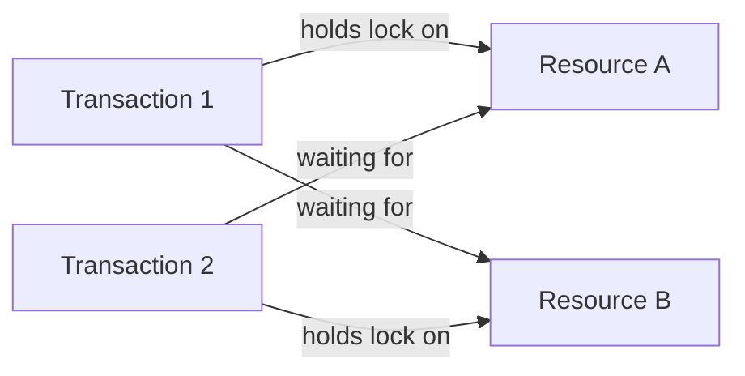
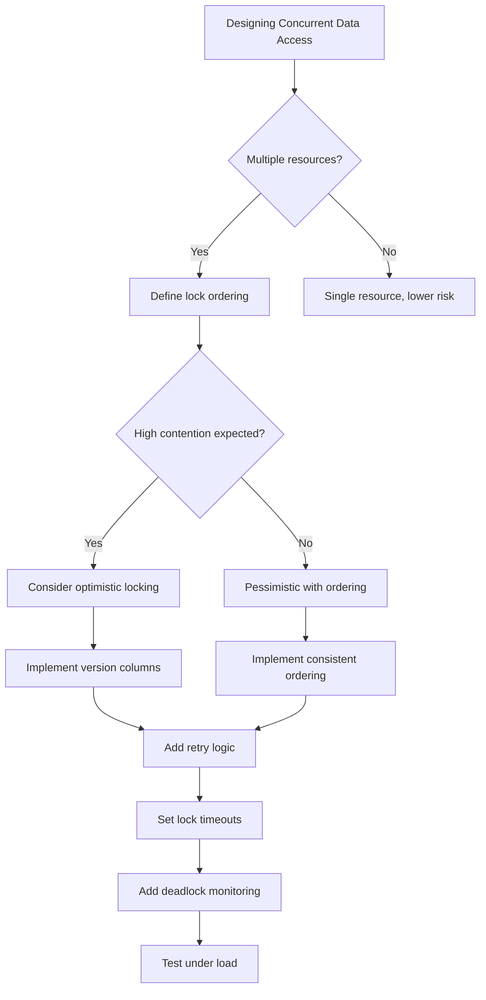

# How to Implement Deadlock Prevention

Author: [nawazdhandala](https://github.com/nawazdhandala)

Tags: Database, Concurrency, SQL, DevOps

Description: A practical guide to understanding, detecting, and preventing deadlocks in database systems and concurrent applications, with real-world strategies and code examples.

---

> Deadlocks are the silent killers of concurrent systems. They don't crash your application loudly. They just freeze it, leaving users staring at spinning loaders while your threads hold each other hostage.

Every engineer who has worked with databases or concurrent systems has encountered a deadlock at some point. One moment your application is humming along, the next it grinds to a halt. Two transactions, each waiting for the other to release a lock, stuck in an infinite standoff. Understanding how to prevent deadlocks before they happen is essential for building reliable, high-performance systems.

---

## 1. What Is a Deadlock?

A deadlock occurs when two or more processes are each waiting for the other to release a resource, creating a cycle of dependencies that can never be resolved. Neither process can proceed, and without intervention, they will wait forever.

The classic scenario involves two transactions and two resources:



Transaction 1 holds a lock on Resource A and needs Resource B. Transaction 2 holds a lock on Resource B and needs Resource A. Neither can proceed. This is a deadlock.

---

## 2. The Four Conditions for Deadlock

For a deadlock to occur, four conditions must all be present simultaneously. Understanding these conditions is the foundation of prevention strategies.

| Condition | Description | Prevention Strategy |
|-----------|-------------|---------------------|
| **Mutual Exclusion** | Resources cannot be shared; only one process can use a resource at a time | Use shareable resources where possible (read locks vs write locks) |
| **Hold and Wait** | Processes hold resources while waiting for additional resources | Require all resources upfront or release held resources before requesting new ones |
| **No Preemption** | Resources cannot be forcibly taken from a process | Allow the system to revoke resources or use timeouts |
| **Circular Wait** | A circular chain of processes exists, each waiting for a resource held by the next | Impose a total ordering on resource acquisition |

Breaking any one of these conditions prevents deadlocks. Most practical strategies focus on eliminating circular wait or hold and wait conditions.

---

## 3. Real-World Deadlock Example in SQL

Let's look at a concrete example. Imagine an e-commerce system where two transactions are processing orders simultaneously.

The following SQL demonstrates how a deadlock can occur when two transactions update the same rows in different orders.

```sql
-- Transaction 1: Transfer inventory from warehouse A to B
BEGIN TRANSACTION;

-- Locks row for product_id = 100 in warehouse A
UPDATE inventory
SET quantity = quantity - 10
WHERE warehouse_id = 'A' AND product_id = 100;

-- Simulating some processing time
-- Meanwhile, Transaction 2 starts...

-- Now tries to lock row for product_id = 100 in warehouse B
-- But Transaction 2 already holds this lock!
UPDATE inventory
SET quantity = quantity + 10
WHERE warehouse_id = 'B' AND product_id = 100;

COMMIT;
```

```sql
-- Transaction 2: Transfer inventory from warehouse B to A
BEGIN TRANSACTION;

-- Locks row for product_id = 100 in warehouse B
UPDATE inventory
SET quantity = quantity - 5
WHERE warehouse_id = 'B' AND product_id = 100;

-- Now tries to lock row for product_id = 100 in warehouse A
-- But Transaction 1 already holds this lock!
UPDATE inventory
SET quantity = quantity + 5
WHERE warehouse_id = 'A' AND product_id = 100;

COMMIT;
```

Both transactions are now waiting for each other. This is a deadlock.

---

## 4. Prevention Strategy 1: Consistent Lock Ordering

The most effective and widely used strategy is to always acquire locks in the same order. If every transaction locks resources in a predetermined sequence, circular wait becomes impossible.

This example shows how to prevent deadlocks by always acquiring locks in alphabetical order by warehouse ID.

```sql
-- Both transactions should lock in the same order: warehouse A first, then B

-- Transaction 1: Transfer from A to B
BEGIN TRANSACTION;

-- Always lock A first (alphabetically ordered)
SELECT * FROM inventory
WHERE warehouse_id = 'A' AND product_id = 100
FOR UPDATE;

-- Then lock B
SELECT * FROM inventory
WHERE warehouse_id = 'B' AND product_id = 100
FOR UPDATE;

-- Now perform updates safely
UPDATE inventory SET quantity = quantity - 10
WHERE warehouse_id = 'A' AND product_id = 100;

UPDATE inventory SET quantity = quantity + 10
WHERE warehouse_id = 'B' AND product_id = 100;

COMMIT;
```

```sql
-- Transaction 2: Transfer from B to A (still locks A first!)
BEGIN TRANSACTION;

-- Always lock A first, even though we're transferring FROM B
SELECT * FROM inventory
WHERE warehouse_id = 'A' AND product_id = 100
FOR UPDATE;

SELECT * FROM inventory
WHERE warehouse_id = 'B' AND product_id = 100
FOR UPDATE;

-- Now perform updates safely
UPDATE inventory SET quantity = quantity + 5
WHERE warehouse_id = 'A' AND product_id = 100;

UPDATE inventory SET quantity = quantity - 5
WHERE warehouse_id = 'B' AND product_id = 100;

COMMIT;
```

By establishing a consistent ordering (alphabetical by warehouse_id), both transactions acquire locks in the same sequence. No circular wait can form.

---

## 5. Prevention Strategy 2: Lock Timeouts

Even with careful design, deadlocks can slip through. Lock timeouts provide a safety net by automatically aborting transactions that wait too long.

This PostgreSQL example sets a lock timeout to prevent indefinite waiting.

```sql
-- Set a 5-second timeout for lock acquisition
SET lock_timeout = '5s';

BEGIN TRANSACTION;

-- If this lock cannot be acquired within 5 seconds,
-- PostgreSQL will raise an error and abort the transaction
UPDATE inventory
SET quantity = quantity - 10
WHERE warehouse_id = 'A' AND product_id = 100;

UPDATE inventory
SET quantity = quantity + 10
WHERE warehouse_id = 'B' AND product_id = 100;

COMMIT;
```

In application code, you should catch timeout exceptions and implement retry logic.

This Python example demonstrates handling lock timeouts with automatic retry.

```python
import psycopg2
from psycopg2 import errors
import time
import random

def transfer_inventory(conn, from_warehouse, to_warehouse, product_id, quantity, max_retries=3):
    """
    Transfer inventory between warehouses with deadlock prevention.
    Uses lock ordering and automatic retry on timeout.
    """

    # Sort warehouses to ensure consistent lock ordering
    # This prevents deadlocks by always locking in the same order
    warehouses = sorted([from_warehouse, to_warehouse])

    for attempt in range(max_retries):
        try:
            with conn.cursor() as cur:
                # Set a reasonable lock timeout
                cur.execute("SET lock_timeout = '5s'")

                # Acquire locks in sorted order
                for wh in warehouses:
                    cur.execute(
                        "SELECT * FROM inventory WHERE warehouse_id = %s AND product_id = %s FOR UPDATE",
                        (wh, product_id)
                    )

                # Perform the transfer
                cur.execute(
                    "UPDATE inventory SET quantity = quantity - %s WHERE warehouse_id = %s AND product_id = %s",
                    (quantity, from_warehouse, product_id)
                )
                cur.execute(
                    "UPDATE inventory SET quantity = quantity + %s WHERE warehouse_id = %s AND product_id = %s",
                    (quantity, to_warehouse, product_id)
                )

                conn.commit()
                return True

        except errors.LockNotAvailable:
            conn.rollback()
            if attempt < max_retries - 1:
                # Exponential backoff with jitter to reduce collision probability
                wait_time = (2 ** attempt) + random.uniform(0, 1)
                time.sleep(wait_time)
            else:
                raise Exception(f"Failed to acquire lock after {max_retries} attempts")

    return False
```

---

## 6. Prevention Strategy 3: Optimistic Locking

Instead of acquiring locks upfront (pessimistic locking), optimistic locking assumes conflicts are rare and validates at commit time. This approach works well for read-heavy workloads with occasional writes.

This example shows optimistic locking using a version column.

```sql
-- Add a version column to track changes
ALTER TABLE inventory ADD COLUMN version INTEGER DEFAULT 0;

-- Read the current state (no locks acquired)
SELECT id, quantity, version
FROM inventory
WHERE warehouse_id = 'A' AND product_id = 100;
-- Returns: id=1, quantity=100, version=5

-- Update only if version hasn't changed
UPDATE inventory
SET quantity = quantity - 10, version = version + 1
WHERE id = 1 AND version = 5;

-- Check if update succeeded (affected 1 row)
-- If affected 0 rows, another transaction modified the data
-- Retry the entire operation
```

Here is how to implement optimistic locking in Python with automatic retry.

```python
def update_inventory_optimistic(conn, warehouse_id, product_id, quantity_change, max_retries=5):
    """
    Update inventory using optimistic locking.
    Retries automatically if a concurrent modification is detected.
    """

    for attempt in range(max_retries):
        with conn.cursor() as cur:
            # Read current state without locking
            cur.execute(
                "SELECT id, quantity, version FROM inventory WHERE warehouse_id = %s AND product_id = %s",
                (warehouse_id, product_id)
            )
            row = cur.fetchone()

            if not row:
                raise ValueError("Inventory record not found")

            record_id, current_qty, version = row
            new_qty = current_qty + quantity_change

            if new_qty < 0:
                raise ValueError("Insufficient inventory")

            # Attempt update with version check
            cur.execute(
                """
                UPDATE inventory
                SET quantity = %s, version = version + 1
                WHERE id = %s AND version = %s
                """,
                (new_qty, record_id, version)
            )

            # Check if update succeeded
            if cur.rowcount == 1:
                conn.commit()
                return True
            else:
                # Version mismatch means concurrent modification occurred
                conn.rollback()
                # Brief sleep with jitter before retry
                time.sleep(random.uniform(0.01, 0.1))

    raise Exception(f"Optimistic lock failed after {max_retries} retries")
```

---

## 7. Prevention Strategy 4: Reduce Lock Scope and Duration

Holding locks for shorter periods reduces the window for deadlocks. Here are key techniques:

### Keep Transactions Short

Avoid doing I/O, network calls, or heavy computation while holding locks.

```python
# Bad: Holding lock during external API call
def process_order_bad(conn, order_id):
    with conn.cursor() as cur:
        cur.execute("SELECT * FROM orders WHERE id = %s FOR UPDATE", (order_id,))
        order = cur.fetchone()

        # DON'T DO THIS: External call while holding a lock
        payment_result = call_payment_api(order)  # Could take seconds!

        cur.execute("UPDATE orders SET status = %s WHERE id = %s",
                    (payment_result['status'], order_id))
        conn.commit()

# Good: Release lock before external call
def process_order_good(conn, order_id):
    # First, read the data we need (brief lock or no lock)
    with conn.cursor() as cur:
        cur.execute("SELECT * FROM orders WHERE id = %s", (order_id,))
        order = cur.fetchone()

    # External call without holding any database locks
    payment_result = call_payment_api(order)

    # Quick transaction to update status
    with conn.cursor() as cur:
        cur.execute(
            "UPDATE orders SET status = %s WHERE id = %s AND status = 'pending'",
            (payment_result['status'], order_id)
        )
        conn.commit()
```

### Use Row-Level Locking Instead of Table-Level

Most modern databases use row-level locking by default, but some operations can escalate to table locks.

```sql
-- This might escalate to table lock if updating many rows
UPDATE inventory SET quantity = 0 WHERE quantity < 0;

-- Better: Process in smaller batches
UPDATE inventory SET quantity = 0
WHERE id IN (
    SELECT id FROM inventory WHERE quantity < 0 LIMIT 100
);
```

---

## 8. Detecting and Monitoring Deadlocks

Prevention is ideal, but you should also monitor for deadlocks that slip through.

### PostgreSQL Deadlock Monitoring

```sql
-- Check for current locks and blocking
SELECT
    blocked.pid AS blocked_pid,
    blocked.query AS blocked_query,
    blocking.pid AS blocking_pid,
    blocking.query AS blocking_query
FROM pg_stat_activity blocked
JOIN pg_locks blocked_locks ON blocked.pid = blocked_locks.pid
JOIN pg_locks blocking_locks ON blocked_locks.relation = blocking_locks.relation
    AND blocked_locks.pid != blocking_locks.pid
JOIN pg_stat_activity blocking ON blocking_locks.pid = blocking.pid
WHERE NOT blocked_locks.granted;
```

```sql
-- Enable deadlock logging in postgresql.conf
-- log_lock_waits = on
-- deadlock_timeout = 1s

-- Query the logs for deadlock events
SELECT * FROM pg_stat_database_conflicts WHERE datname = 'your_database';
```

### Application-Level Monitoring

Track deadlock occurrences as metrics in your observability stack.

```python
from prometheus_client import Counter

deadlock_counter = Counter(
    'db_deadlocks_total',
    'Total number of deadlock occurrences',
    ['operation', 'table']
)

def execute_with_deadlock_tracking(conn, operation_name, table_name, func):
    """
    Wrapper that tracks deadlock occurrences for monitoring.
    """
    try:
        return func(conn)
    except psycopg2.errors.DeadlockDetected:
        deadlock_counter.labels(operation=operation_name, table=table_name).inc()
        raise
```

---

## 9. Deadlock Prevention Checklist

Use this checklist when designing systems that involve concurrent database access:



**Summary Checklist:**

1. Always acquire locks in a consistent, predetermined order
2. Set reasonable lock timeouts (typically 5-30 seconds depending on workload)
3. Keep transactions as short as possible
4. Avoid external calls or heavy computation while holding locks
5. Consider optimistic locking for read-heavy, low-contention scenarios
6. Monitor deadlock occurrences and alert on spikes
7. Use row-level locking and avoid operations that escalate to table locks
8. Implement retry logic with exponential backoff for transient failures
9. Test concurrent scenarios under realistic load conditions

---

## 10. When Deadlocks Are Acceptable

Sometimes, allowing occasional deadlocks and handling them gracefully is the right choice. If your workload has unpredictable access patterns making consistent ordering difficult, if deadlocks are rare (less than 0.1% of transactions), and if retry logic handles them transparently, then letting the database detect and resolve deadlocks might be simpler than complex prevention schemes.

Modern databases like PostgreSQL, MySQL, and SQL Server have built-in deadlock detection. They automatically choose a victim transaction to abort, allowing the other to proceed. Your application just needs to catch the exception and retry.

```python
def execute_with_deadlock_retry(conn, func, max_retries=3):
    """
    Execute a function with automatic retry on deadlock.
    Sometimes this is simpler than complex prevention logic.
    """
    for attempt in range(max_retries):
        try:
            return func(conn)
        except psycopg2.errors.DeadlockDetected:
            conn.rollback()
            if attempt == max_retries - 1:
                raise
            # Exponential backoff
            time.sleep((2 ** attempt) * 0.1)

    raise Exception("Max retries exceeded")
```

---

## Summary

Deadlocks are inevitable in concurrent systems, but they don't have to bring your application down. The key strategies are:

- **Consistent lock ordering** eliminates circular wait
- **Lock timeouts** prevent indefinite blocking
- **Optimistic locking** reduces contention for read-heavy workloads
- **Short transactions** minimize the window for conflicts
- **Monitoring and alerting** catch problems before users notice

Start with consistent lock ordering. It's the most effective single technique. Add timeouts as a safety net. Monitor your deadlock rate and tune based on real production data.

**Related Reading:**
- [When Performance Matters, Skip the ORM](https://oneuptime.com/blog/post/2025-11-13-when-performance-matters-skip-the-orm/view)
- [Basics of Profiling: Turning CPU and Memory Hotspots into Action](https://oneuptime.com/blog/post/2025-09-09-basics-of-profiling/view)
- [SRE Best Practices](https://oneuptime.com/blog/post/2025-11-28-sre-best-practices/view)

---

*Deadlocks are one of many issues that can silently degrade your system's reliability. OneUptime helps you monitor database performance, track error rates, and alert on anomalies before they impact users. Set up comprehensive observability to catch concurrency issues early.*
