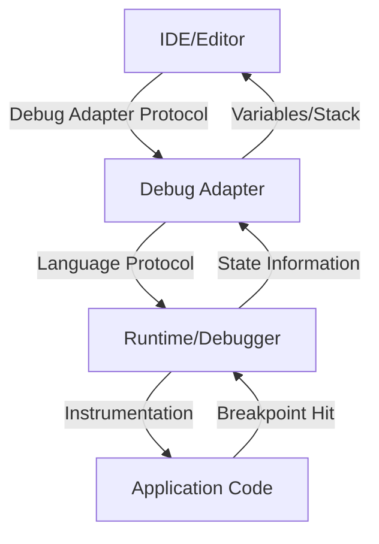
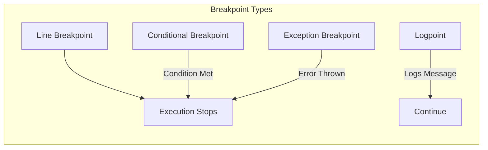
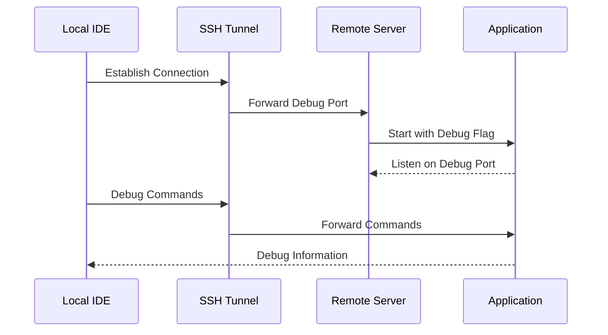
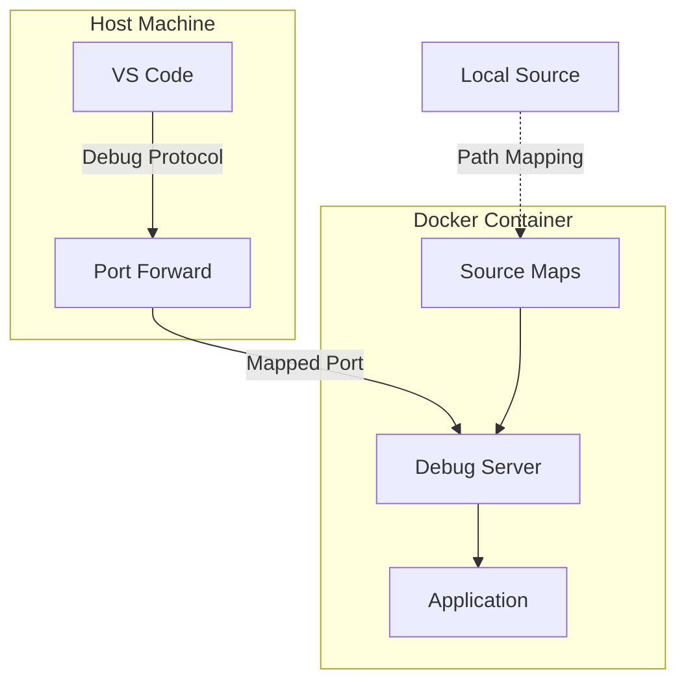
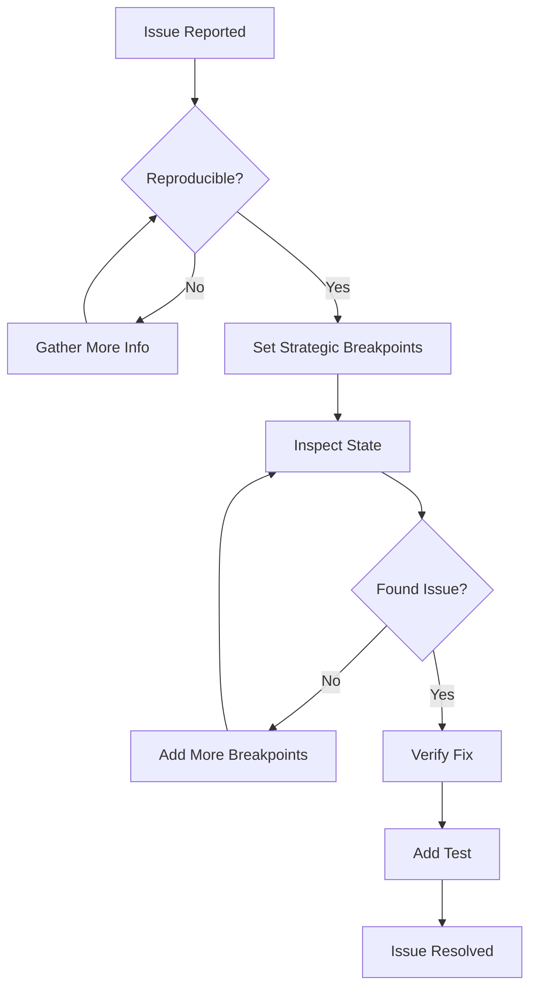

# How to Build Debugging Configuration

Author: [nawazdhandala](https://github.com/nawazdhandala)

Tags: Developer Experience, Debugging, Development Tools, IDE Configuration

Description: Learn to configure debugging environments with launch configurations, breakpoint management, and remote debugging for effective troubleshooting.

---

Debugging is an essential skill for every developer. While `console.log` statements can help in simple scenarios, a properly configured debugging environment transforms how you investigate and resolve issues in your code. This guide walks you through building a comprehensive debugging configuration that scales from local development to remote and containerized environments.

## Understanding the Debugging Architecture

Before diving into configurations, let's understand how debugging works at a high level.



The Debug Adapter Protocol (DAP) standardizes communication between editors and debuggers, allowing VS Code, JetBrains, and other IDEs to work with various language debuggers through a common interface.

## Setting Up launch.json

The `launch.json` file is the heart of your debugging configuration in VS Code. It lives in the `.vscode` directory and defines how your debugger should start and attach to applications.

### Basic Structure

```json
{
  "version": "0.2.0",
  "configurations": [
    {
      "name": "Debug Current File",
      "type": "node",
      "request": "launch",
      "program": "${file}",
      "console": "integratedTerminal"
    }
  ]
}
```

Let's break down the key properties:

- **name**: A descriptive label shown in the debug dropdown
- **type**: The debugger type (node, python, go, cppdbg, etc.)
- **request**: Either "launch" to start a new process or "attach" to connect to a running one
- **program**: The entry point of your application

### Node.js Configuration Examples

Here is a comprehensive Node.js debugging setup:

```json
{
  "version": "0.2.0",
  "configurations": [
    {
      "name": "Launch Program",
      "type": "node",
      "request": "launch",
      "program": "${workspaceFolder}/src/index.js",
      "cwd": "${workspaceFolder}",
      "env": {
        "NODE_ENV": "development",
        "DEBUG": "app:*"
      },
      "console": "integratedTerminal",
      "skipFiles": ["<node_internals>/**"],
      "sourceMaps": true,
      "outFiles": ["${workspaceFolder}/dist/**/*.js"]
    },
    {
      "name": "Debug TypeScript",
      "type": "node",
      "request": "launch",
      "program": "${workspaceFolder}/src/index.ts",
      "preLaunchTask": "tsc: build",
      "outFiles": ["${workspaceFolder}/dist/**/*.js"],
      "sourceMaps": true,
      "resolveSourceMapLocations": [
        "${workspaceFolder}/**",
        "!**/node_modules/**"
      ]
    },
    {
      "name": "Debug Jest Tests",
      "type": "node",
      "request": "launch",
      "program": "${workspaceFolder}/node_modules/.bin/jest",
      "args": [
        "--runInBand",
        "--watchAll=false",
        "${fileBasenameNoExtension}"
      ],
      "console": "integratedTerminal",
      "internalConsoleOptions": "neverOpen"
    }
  ]
}
```

### Python Configuration Examples

```json
{
  "version": "0.2.0",
  "configurations": [
    {
      "name": "Python: Current File",
      "type": "debugpy",
      "request": "launch",
      "program": "${file}",
      "console": "integratedTerminal",
      "justMyCode": false,
      "env": {
        "PYTHONPATH": "${workspaceFolder}"
      }
    },
    {
      "name": "Python: Django",
      "type": "debugpy",
      "request": "launch",
      "program": "${workspaceFolder}/manage.py",
      "args": ["runserver", "--noreload"],
      "django": true,
      "justMyCode": true
    },
    {
      "name": "Python: FastAPI",
      "type": "debugpy",
      "request": "launch",
      "module": "uvicorn",
      "args": [
        "app.main:app",
        "--reload",
        "--port", "8000"
      ],
      "jinja": true,
      "justMyCode": true
    }
  ]
}
```

### Go Configuration Examples

```json
{
  "version": "0.2.0",
  "configurations": [
    {
      "name": "Launch Package",
      "type": "go",
      "request": "launch",
      "mode": "auto",
      "program": "${workspaceFolder}/cmd/server",
      "env": {
        "GO_ENV": "development"
      },
      "args": ["-config", "config.yaml"]
    },
    {
      "name": "Debug Test Function",
      "type": "go",
      "request": "launch",
      "mode": "test",
      "program": "${workspaceFolder}/${relativeFileDirname}",
      "args": ["-test.run", "TestFunctionName"]
    }
  ]
}
```

## Mastering Breakpoints

Breakpoints are more powerful than simple line stops. Understanding different breakpoint types helps you debug more efficiently.



### Conditional Breakpoints

Stop execution only when specific conditions are met:

```javascript
// In VS Code, right-click the breakpoint and add a condition
// Example condition: user.role === 'admin' && user.permissions.length > 5

function processUser(user) {
  // Breakpoint with condition: user.id === 'debug-target'
  const permissions = calculatePermissions(user);

  // Breakpoint with hit count: break after 100 iterations
  for (const permission of permissions) {
    applyPermission(user, permission);
  }

  return user;
}
```

### Logpoints

Logpoints let you log messages without modifying your code:

```javascript
// Instead of adding console.log, create a logpoint with:
// Message: "User {user.name} processed with {permissions.length} permissions"

async function handleRequest(req, res) {
  const user = await getUser(req.userId);
  // Logpoint here - no code change needed
  const result = await processUser(user);
  res.json(result);
}
```

### Exception Breakpoints

Configure your debugger to pause on exceptions:

```json
{
  "version": "0.2.0",
  "configurations": [
    {
      "name": "Debug with Exception Handling",
      "type": "node",
      "request": "launch",
      "program": "${workspaceFolder}/src/index.js",
      "stopOnEntry": false
    }
  ]
}
```

In VS Code, use the Breakpoints panel to enable:
- **Uncaught Exceptions**: Pause when an unhandled error occurs
- **Caught Exceptions**: Pause on all exceptions, even handled ones

## Watch Expressions and Variable Inspection

Watch expressions let you monitor specific values throughout debugging sessions.

### Effective Watch Expressions

```javascript
// Example code being debugged
class OrderProcessor {
  constructor(orders) {
    this.orders = orders;
    this.processed = [];
    this.failed = [];
  }

  async processAll() {
    for (const order of this.orders) {
      try {
        await this.processOrder(order);
      } catch (error) {
        this.failed.push({ order, error: error.message });
      }
    }
  }
}

// Useful watch expressions:
// this.orders.length
// this.processed.length
// this.failed.length
// this.orders.filter(o => o.status === 'pending').length
// order.items.reduce((sum, item) => sum + item.price, 0)
// JSON.stringify(order, null, 2)
```

### Debug Console Evaluation

The debug console allows runtime evaluation:

```javascript
// While paused at a breakpoint, you can run:
> this.orders.find(o => o.id === 'ORD-123')
> Object.keys(this).filter(k => typeof this[k] === 'function')
> await this.validateOrder(currentOrder)  // In async contexts
> copy(JSON.stringify(largeObject))  // Copy to clipboard
```

## Remote Debugging

Remote debugging connects your local IDE to applications running on remote servers or cloud environments.



### Node.js Remote Debugging

On the remote server, start your application with the inspect flag:

```bash
# Start Node.js with remote debugging enabled
node --inspect=0.0.0.0:9229 server.js

# For breaking on first line
node --inspect-brk=0.0.0.0:9229 server.js
```

Create an SSH tunnel for secure access:

```bash
# Forward local port 9229 to remote debug port
ssh -L 9229:localhost:9229 user@remote-server
```

Configure VS Code to attach:

```json
{
  "version": "0.2.0",
  "configurations": [
    {
      "name": "Attach to Remote",
      "type": "node",
      "request": "attach",
      "address": "localhost",
      "port": 9229,
      "localRoot": "${workspaceFolder}",
      "remoteRoot": "/app",
      "sourceMaps": true,
      "skipFiles": ["<node_internals>/**"]
    }
  ]
}
```

### Python Remote Debugging

Install debugpy on the remote server:

```bash
pip install debugpy
```

Add debugging code to your application:

```python
# At the start of your application
import debugpy

debugpy.listen(("0.0.0.0", 5678))
print("Waiting for debugger to attach...")
debugpy.wait_for_client()  # Optional: pause until debugger connects
```

VS Code configuration:

```json
{
  "version": "0.2.0",
  "configurations": [
    {
      "name": "Python: Remote Attach",
      "type": "debugpy",
      "request": "attach",
      "connect": {
        "host": "localhost",
        "port": 5678
      },
      "pathMappings": [
        {
          "localRoot": "${workspaceFolder}",
          "remoteRoot": "/app"
        }
      ]
    }
  ]
}
```

## Container Debugging

Debugging applications running in Docker containers requires special configuration to bridge the container boundary.



### Docker Compose with Debug Support

```yaml
# docker-compose.debug.yml
version: '3.8'

services:
  api:
    build:
      context: .
      dockerfile: Dockerfile.dev
    ports:
      - "3000:3000"
      - "9229:9229"  # Debug port
    volumes:
      - ./src:/app/src
      - ./node_modules:/app/node_modules
    environment:
      - NODE_ENV=development
    command: node --inspect=0.0.0.0:9229 src/index.js

  worker:
    build:
      context: .
      dockerfile: Dockerfile.dev
    ports:
      - "9230:9229"  # Different host port for second service
    volumes:
      - ./src:/app/src
    command: node --inspect=0.0.0.0:9229 src/worker.js
```

### Development Dockerfile

```dockerfile
# Dockerfile.dev
FROM node:20-alpine

WORKDIR /app

# Install dependencies
COPY package*.json ./
RUN npm install

# Copy source code
COPY . .

# Expose application and debug ports
EXPOSE 3000 9229

# Start with debugging enabled
CMD ["node", "--inspect=0.0.0.0:9229", "src/index.js"]
```

### VS Code Configuration for Containers

```json
{
  "version": "0.2.0",
  "configurations": [
    {
      "name": "Docker: Attach to Node",
      "type": "node",
      "request": "attach",
      "port": 9229,
      "address": "localhost",
      "localRoot": "${workspaceFolder}",
      "remoteRoot": "/app",
      "sourceMaps": true,
      "restart": true,
      "skipFiles": ["<node_internals>/**"]
    },
    {
      "name": "Docker: Attach to Worker",
      "type": "node",
      "request": "attach",
      "port": 9230,
      "address": "localhost",
      "localRoot": "${workspaceFolder}",
      "remoteRoot": "/app",
      "sourceMaps": true
    }
  ],
  "compounds": [
    {
      "name": "Debug All Services",
      "configurations": [
        "Docker: Attach to Node",
        "Docker: Attach to Worker"
      ]
    }
  ]
}
```

### Kubernetes Debugging

For Kubernetes deployments, use port forwarding:

```bash
# Forward debug port from pod to local machine
kubectl port-forward pod/api-server-abc123 9229:9229

# Or forward from a service
kubectl port-forward service/api-server 9229:9229
```

Deploy with debug configuration:

```yaml
# deployment-debug.yaml
apiVersion: apps/v1
kind: Deployment
metadata:
  name: api-server-debug
spec:
  replicas: 1  # Single replica for debugging
  template:
    spec:
      containers:
        - name: api
          image: myapp:debug
          ports:
            - containerPort: 3000
            - containerPort: 9229
          command: ["node", "--inspect=0.0.0.0:9229", "src/index.js"]
          env:
            - name: NODE_ENV
              value: "development"
```

## Advanced Configuration Patterns

### Compound Launch Configurations

Debug multiple processes simultaneously:

```json
{
  "version": "0.2.0",
  "configurations": [
    {
      "name": "Server",
      "type": "node",
      "request": "launch",
      "program": "${workspaceFolder}/server/index.js",
      "cwd": "${workspaceFolder}/server"
    },
    {
      "name": "Client",
      "type": "chrome",
      "request": "launch",
      "url": "http://localhost:3000",
      "webRoot": "${workspaceFolder}/client/src"
    }
  ],
  "compounds": [
    {
      "name": "Full Stack Debug",
      "configurations": ["Server", "Client"],
      "stopAll": true,
      "preLaunchTask": "npm: build"
    }
  ]
}
```

### Environment-Specific Configurations

Use input variables for flexible debugging:

```json
{
  "version": "0.2.0",
  "inputs": [
    {
      "id": "environment",
      "type": "pickString",
      "description": "Select environment",
      "options": ["development", "staging", "production"],
      "default": "development"
    },
    {
      "id": "debugPort",
      "type": "promptString",
      "description": "Debug port",
      "default": "9229"
    }
  ],
  "configurations": [
    {
      "name": "Debug with Environment",
      "type": "node",
      "request": "launch",
      "program": "${workspaceFolder}/src/index.js",
      "env": {
        "NODE_ENV": "${input:environment}"
      }
    },
    {
      "name": "Attach to Port",
      "type": "node",
      "request": "attach",
      "port": "${input:debugPort}"
    }
  ]
}
```

### Pre-Launch Tasks

Combine with tasks.json for build steps:

```json
// .vscode/tasks.json
{
  "version": "2.0.0",
  "tasks": [
    {
      "label": "Build TypeScript",
      "type": "typescript",
      "tsconfig": "tsconfig.json",
      "problemMatcher": ["$tsc"],
      "group": {
        "kind": "build",
        "isDefault": true
      }
    },
    {
      "label": "Start Database",
      "type": "shell",
      "command": "docker-compose up -d postgres redis",
      "problemMatcher": []
    },
    {
      "label": "Prepare Debug",
      "dependsOn": ["Build TypeScript", "Start Database"],
      "dependsOrder": "sequence"
    }
  ]
}
```

Reference in launch.json:

```json
{
  "name": "Debug Full Setup",
  "type": "node",
  "request": "launch",
  "program": "${workspaceFolder}/dist/index.js",
  "preLaunchTask": "Prepare Debug",
  "postDebugTask": "Cleanup"
}
```

## Debugging Best Practices



### Tips for Effective Debugging

1. **Start with the error message**: Set an exception breakpoint and work backward from where the error occurs

2. **Use binary search**: If you have a long process, set breakpoints at the midpoint to narrow down where issues occur

3. **Leverage conditional breakpoints**: Instead of stepping through loops, break only on the iteration you care about

4. **Watch complex expressions**: Create watch expressions that compute derived values you need to see

5. **Use logpoints for production-like debugging**: When you cannot stop execution, logpoints give visibility without code changes

6. **Map source correctly**: Ensure sourceMaps and path mappings are correct for transpiled code

7. **Save launch configurations in version control**: Share debugging setups with your team via `.vscode/launch.json`

## Troubleshooting Common Issues

### Breakpoints Not Hitting

```json
{
  "name": "Debug with Source Maps",
  "type": "node",
  "request": "launch",
  "program": "${workspaceFolder}/dist/index.js",
  "sourceMaps": true,
  "outFiles": ["${workspaceFolder}/dist/**/*.js"],
  "resolveSourceMapLocations": [
    "${workspaceFolder}/**",
    "!**/node_modules/**"
  ],
  "trace": true  // Enable verbose logging
}
```

### Connection Refused on Remote Debug

Check these common issues:

1. Firewall blocking the debug port
2. Application binding to 127.0.0.1 instead of 0.0.0.0
3. SSH tunnel not established
4. Container port not exposed

### Slow Debugging Performance

```json
{
  "name": "Optimized Debug",
  "type": "node",
  "request": "launch",
  "program": "${workspaceFolder}/src/index.js",
  "skipFiles": [
    "<node_internals>/**",
    "${workspaceFolder}/node_modules/**"
  ],
  "smartStep": true,
  "autoAttachChildProcesses": false
}
```

## Conclusion

A well-configured debugging environment is a force multiplier for development productivity. By investing time in proper launch configurations, understanding breakpoint types, setting up remote debugging, and mastering container debugging, you equip yourself to tackle complex issues efficiently.

Start with basic configurations and gradually add complexity as needed. Share your debugging configurations with your team to ensure everyone can effectively troubleshoot issues. Remember that debugging is a skill that improves with practice - the more you use these tools, the faster you will become at identifying and fixing issues in your code.
