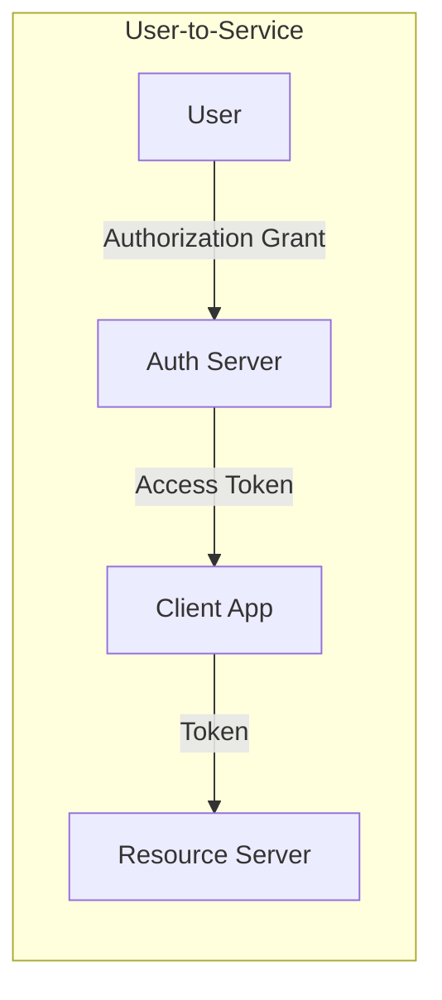
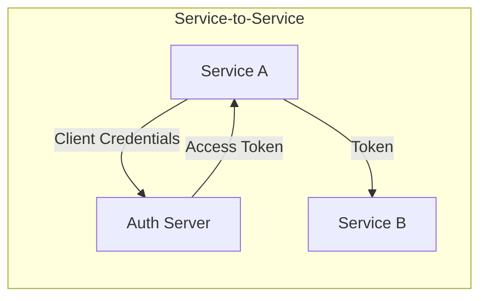
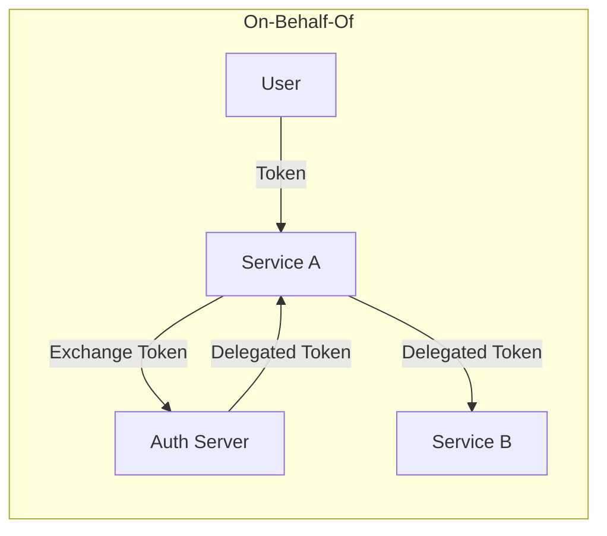
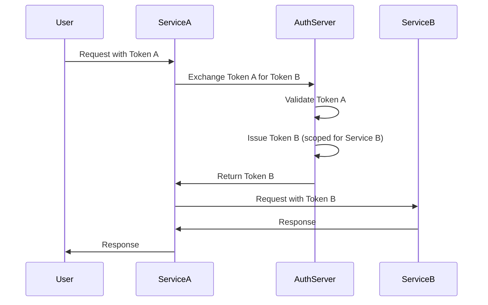

# How to Create Delegation Patterns

Author: [nawazdhandala](https://github.com/nawazdhandala)

Tags: Security, Delegation, Authorization, OAuth

Description: Learn to create delegation patterns for secure permission sharing and proxy access.

---

Delegation is the practice of letting one entity act on behalf of another without sharing long-lived credentials. Instead of handing over your password or API key, you issue a scoped, time-limited token that grants exactly the permissions needed for a specific task. This pattern underpins OAuth, service-to-service authentication, and most modern access control systems.

This guide covers the core delegation patterns, when to use each one, and how to implement them with practical code examples.

---

## Why delegation matters

- **Least privilege by design.** Delegated tokens carry only the permissions the task requires, not the full power of the original account.
- **Revocation without rotation.** You can invalidate a delegated token without changing the underlying credential.
- **Audit clarity.** Logs show which delegated identity performed each action, not just the root account.
- **Third-party integration.** External services can act on your behalf without ever seeing your password.

---

## The three core delegation patterns

Most delegation scenarios fall into one of three patterns: user-to-service, service-to-service, or on-behalf-of. Understanding these patterns helps you pick the right approach for each use case.







---

## Pattern 1: User-to-service delegation (OAuth Authorization Code)

This is the classic OAuth flow. A user grants a client application permission to access resources on their behalf. The client never sees the user's password.

The following example shows how to implement the authorization code exchange in a Node.js backend. The client receives an authorization code from the redirect and exchanges it for an access token.

```javascript
// Exchange authorization code for access token
// This runs on your backend after the OAuth redirect
async function exchangeCodeForToken(authCode, redirectUri) {
  const tokenEndpoint = 'https://auth.example.com/oauth/token';

  // Build the token request with client credentials
  const params = new URLSearchParams({
    grant_type: 'authorization_code',
    code: authCode,
    redirect_uri: redirectUri,
    client_id: process.env.OAUTH_CLIENT_ID,
    client_secret: process.env.OAUTH_CLIENT_SECRET,
  });

  const response = await fetch(tokenEndpoint, {
    method: 'POST',
    headers: { 'Content-Type': 'application/x-www-form-urlencoded' },
    body: params.toString(),
  });

  if (!response.ok) {
    throw new Error(`Token exchange failed: ${response.status}`);
  }

  // The access_token is what you use for API calls
  // The refresh_token lets you get new access tokens later
  const { access_token, refresh_token, expires_in } = await response.json();

  return { accessToken: access_token, refreshToken: refresh_token, expiresIn: expires_in };
}
```

Store the refresh token securely and use it to obtain new access tokens before expiration. Never expose the refresh token to frontend code.

---

## Pattern 2: Service-to-service delegation (Client Credentials)

When no user is involved and one service needs to call another, the client credentials grant is the right choice. The calling service authenticates directly with its own identity.

This pattern is common for background jobs, cron tasks, and internal microservice communication. The following example demonstrates a service requesting a token to call another internal API.

```javascript
// Service-to-service authentication using client credentials
// Use this when no user context is needed
async function getServiceToken() {
  const tokenEndpoint = 'https://auth.example.com/oauth/token';

  const params = new URLSearchParams({
    grant_type: 'client_credentials',
    client_id: process.env.SERVICE_CLIENT_ID,
    client_secret: process.env.SERVICE_CLIENT_SECRET,
    // Scope limits what this token can do
    scope: 'read:metrics write:alerts',
  });

  const response = await fetch(tokenEndpoint, {
    method: 'POST',
    headers: { 'Content-Type': 'application/x-www-form-urlencoded' },
    body: params.toString(),
  });

  const { access_token, expires_in } = await response.json();

  // Cache this token until it expires minus a buffer
  return { accessToken: access_token, expiresAt: Date.now() + (expires_in - 60) * 1000 };
}

// Use the token to call another service
async function callInternalApi(endpoint, data) {
  const { accessToken } = await getServiceToken();

  return fetch(`https://api.internal.example.com${endpoint}`, {
    method: 'POST',
    headers: {
      'Authorization': `Bearer ${accessToken}`,
      'Content-Type': 'application/json',
    },
    body: JSON.stringify(data),
  });
}
```

---

## Pattern 3: On-behalf-of delegation (Token Exchange)

The on-behalf-of flow handles the case where Service A receives a user's token and needs to call Service B while preserving the user's identity. Service A exchanges the original token for a new token scoped to Service B.

This pattern is essential for microservice architectures where user context must flow through multiple services. The diagram below shows the complete flow.



The following code shows how to implement the token exchange on Service A.

```javascript
// On-behalf-of token exchange
// Service A exchanges the user's token for a token valid at Service B
async function exchangeTokenForDownstream(incomingToken, targetAudience) {
  const tokenEndpoint = 'https://auth.example.com/oauth/token';

  const params = new URLSearchParams({
    grant_type: 'urn:ietf:params:oauth:grant-type:token-exchange',
    subject_token: incomingToken,
    subject_token_type: 'urn:ietf:params:oauth:token-type:access_token',
    requested_token_type: 'urn:ietf:params:oauth:token-type:access_token',
    // The audience identifies which service will accept the new token
    audience: targetAudience,
    client_id: process.env.SERVICE_A_CLIENT_ID,
    client_secret: process.env.SERVICE_A_CLIENT_SECRET,
  });

  const response = await fetch(tokenEndpoint, {
    method: 'POST',
    headers: { 'Content-Type': 'application/x-www-form-urlencoded' },
    body: params.toString(),
  });

  if (!response.ok) {
    const error = await response.text();
    throw new Error(`Token exchange failed: ${error}`);
  }

  const { access_token } = await response.json();
  return access_token;
}

// Middleware that exchanges tokens before calling downstream services
async function callServiceB(req, data) {
  // Extract the user's token from the incoming request
  const userToken = req.headers.authorization?.replace('Bearer ', '');

  if (!userToken) {
    throw new Error('No authorization token provided');
  }

  // Exchange for a token that Service B will accept
  const serviceBToken = await exchangeTokenForDownstream(
    userToken,
    'https://service-b.example.com'
  );

  return fetch('https://service-b.example.com/api/resource', {
    method: 'POST',
    headers: {
      'Authorization': `Bearer ${serviceBToken}`,
      'Content-Type': 'application/json',
    },
    body: JSON.stringify(data),
  });
}
```

---

## Implementing scoped permissions

Delegation becomes powerful when you combine it with fine-grained scopes. Instead of granting full access, each token carries only the permissions it needs.

Define scopes in your authorization server and validate them on every request. The following example shows a middleware that checks for required scopes.

```javascript
// Middleware to validate token scopes
// Attach this to routes that require specific permissions
function requireScopes(...requiredScopes) {
  return (req, res, next) => {
    // Token payload was already verified and attached by auth middleware
    const tokenScopes = req.tokenPayload.scope?.split(' ') || [];

    // Check that all required scopes are present
    const hasAllScopes = requiredScopes.every(scope => tokenScopes.includes(scope));

    if (!hasAllScopes) {
      return res.status(403).json({
        error: 'insufficient_scope',
        required: requiredScopes,
        provided: tokenScopes,
      });
    }

    next();
  };
}

// Usage in route definitions
app.get('/api/metrics', requireScopes('read:metrics'), getMetricsHandler);
app.post('/api/alerts', requireScopes('write:alerts'), createAlertHandler);
app.delete('/api/alerts/:id', requireScopes('write:alerts', 'delete:alerts'), deleteAlertHandler);
```

---

## Best practices for delegation

**Set short token lifetimes.** Access tokens should expire in minutes to hours, not days. Use refresh tokens for longer sessions.

**Always validate the audience claim.** A token issued for Service A should not be accepted by Service B unless explicitly exchanged.

**Log delegation events.** Record when tokens are issued, exchanged, and revoked. This audit trail is essential for incident response.

**Use asymmetric signing.** JWTs signed with RS256 or ES256 let services verify tokens without sharing secrets.

**Implement token revocation.** Maintain a revocation list or use short-lived tokens with frequent refresh to limit the window of compromise.

---

## Choosing the right pattern

| Scenario | Pattern | Grant Type |
|----------|---------|------------|
| User authorizes a web app | User-to-service | Authorization Code |
| Background job calls an API | Service-to-service | Client Credentials |
| API gateway calls microservices as user | On-behalf-of | Token Exchange |
| Mobile app accesses user data | User-to-service | Authorization Code + PKCE |

Start with the simplest pattern that meets your requirements. Add complexity only when the use case demands it. Most applications begin with authorization code for user flows and client credentials for service flows, then add on-behalf-of when building service meshes.

Delegation patterns form the foundation of zero-trust architectures. By replacing shared secrets with scoped, time-limited tokens, you reduce the blast radius of any single compromise and gain the visibility needed to detect and respond to threats.
