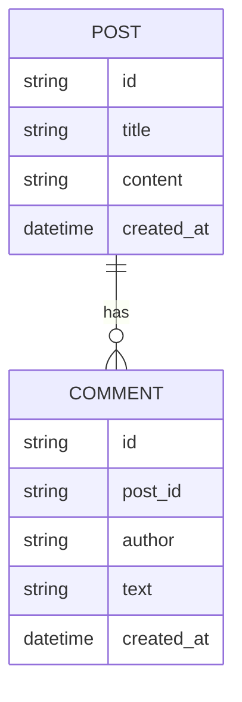
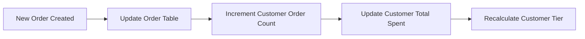
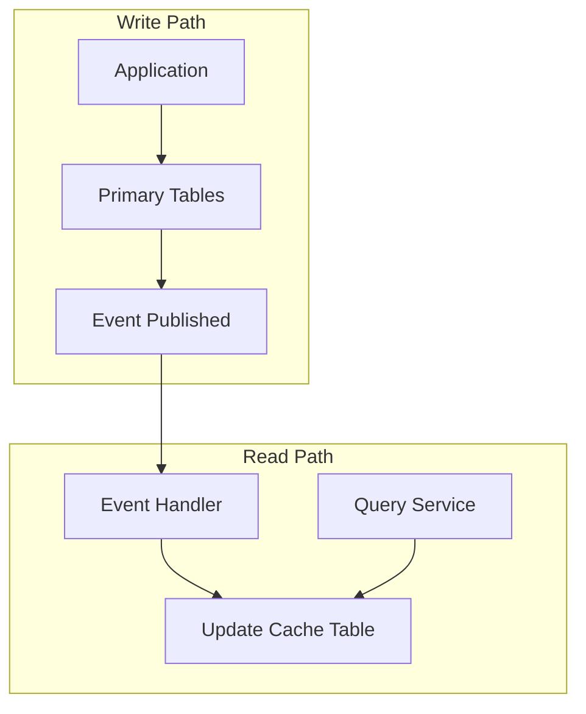

# How to Implement Denormalization Patterns

Author: [nawazdhandala](https://github.com/nawazdhandala)

Tags: Database, Denormalization, Performance, NoSQL

Description: Learn to implement denormalization patterns for improved read performance and query simplification.

---

Denormalization is a database optimization technique where you intentionally add redundant data to improve read performance. While normalization eliminates redundancy to maintain data integrity, denormalization trades storage space and write complexity for faster queries. This guide covers practical patterns you can apply to your applications today.

## When to Consider Denormalization

Before implementing denormalization, evaluate whether your application meets these criteria:

| Criteria | Good Fit for Denormalization | Better with Normalization |
|----------|------------------------------|---------------------------|
| Read/Write Ratio | High read, low write | Balanced or write-heavy |
| Query Complexity | Complex joins across tables | Simple single-table queries |
| Data Consistency | Eventual consistency acceptable | Strong consistency required |
| Scale Requirements | High throughput needed | Moderate traffic |
| Storage Costs | Not a primary concern | Budget constrained |

## Pattern 1: Embedded Documents

The embedded document pattern stores related data within a single document instead of spreading it across multiple tables. This eliminates joins entirely.

Consider a blog application where posts have comments. The normalized approach requires joining two tables for every post view.



The denormalized approach embeds comments directly within the post document.

```javascript
// Denormalized post document with embedded comments
const postDocument = {
  _id: "post_123",
  title: "Understanding Database Patterns",
  content: "Full post content here...",
  created_at: "2026-01-30T10:00:00Z",
  // Comments embedded directly in the post
  comments: [
    {
      author: "alice",
      text: "Great explanation!",
      created_at: "2026-01-30T11:00:00Z"
    },
    {
      author: "bob",
      text: "This helped me understand the concept.",
      created_at: "2026-01-30T12:00:00Z"
    }
  ],
  // Precomputed aggregate for quick access
  comment_count: 2
};
```

This pattern works well when the embedded data is bounded and accessed together with the parent document.

## Pattern 2: Computed Aggregates

Instead of calculating aggregates at query time, store precomputed values that update when underlying data changes.

The following diagram shows how aggregate updates flow through the system.



Here is an implementation that maintains computed aggregates using database triggers.

```sql
-- Table with denormalized aggregates
CREATE TABLE customers (
    id SERIAL PRIMARY KEY,
    name VARCHAR(255),
    email VARCHAR(255),
    -- Denormalized fields
    total_orders INTEGER DEFAULT 0,
    total_spent DECIMAL(10,2) DEFAULT 0,
    last_order_date TIMESTAMP,
    customer_tier VARCHAR(20) DEFAULT 'bronze'
);

-- Trigger function to update aggregates
CREATE OR REPLACE FUNCTION update_customer_aggregates()
RETURNS TRIGGER AS $$
BEGIN
    UPDATE customers
    SET
        total_orders = total_orders + 1,
        total_spent = total_spent + NEW.amount,
        last_order_date = NEW.created_at,
        -- Automatically calculate tier based on spending
        customer_tier = CASE
            WHEN total_spent + NEW.amount >= 10000 THEN 'platinum'
            WHEN total_spent + NEW.amount >= 5000 THEN 'gold'
            WHEN total_spent + NEW.amount >= 1000 THEN 'silver'
            ELSE 'bronze'
        END
    WHERE id = NEW.customer_id;
    RETURN NEW;
END;
$$ LANGUAGE plpgsql;

-- Attach trigger to orders table
CREATE TRIGGER after_order_insert
    AFTER INSERT ON orders
    FOR EACH ROW
    EXECUTE FUNCTION update_customer_aggregates();
```

## Pattern 3: Materialized Views

Materialized views store query results as physical tables. They work well for complex reporting queries that run frequently.

```sql
-- Create materialized view for sales reporting
CREATE MATERIALIZED VIEW daily_sales_summary AS
SELECT
    DATE(o.created_at) as sale_date,
    p.category,
    COUNT(*) as order_count,
    SUM(o.quantity) as units_sold,
    SUM(o.amount) as revenue,
    AVG(o.amount) as average_order_value
FROM orders o
JOIN products p ON o.product_id = p.id
GROUP BY DATE(o.created_at), p.category;

-- Create index for fast lookups
CREATE INDEX idx_daily_sales_date ON daily_sales_summary(sale_date);

-- Refresh the view (run periodically via cron or scheduler)
REFRESH MATERIALIZED VIEW CONCURRENTLY daily_sales_summary;
```

The tradeoff with materialized views is data freshness. Choose refresh intervals based on your tolerance for stale data.

| Refresh Strategy | Use Case | Data Freshness |
|------------------|----------|----------------|
| Manual refresh | Ad-hoc reporting | Minutes to hours |
| Scheduled refresh | Daily dashboards | Hours |
| Concurrent refresh | Production queries | Minimal downtime |
| Incremental refresh | Large datasets | Near real-time |

## Pattern 4: Denormalized Cache Tables

Create dedicated tables optimized for specific query patterns. This separates read and write models.



The implementation uses an event-driven approach to keep the cache table synchronized.

```javascript
// Event handler that maintains the denormalized cache
class OrderCacheUpdater {
  constructor(db) {
    this.db = db;
  }

  // Called when an order is created or updated
  async handleOrderEvent(event) {
    const { orderId, customerId, items, total } = event.payload;

    // Fetch related data needed for the cache
    const customer = await this.db.query(
      'SELECT name, email, tier FROM customers WHERE id = $1',
      [customerId]
    );

    const productNames = await this.db.query(
      'SELECT id, name FROM products WHERE id = ANY($1)',
      [items.map(i => i.productId)]
    );

    // Build denormalized record with all data needed for display
    const cacheRecord = {
      order_id: orderId,
      customer_id: customerId,
      customer_name: customer.rows[0].name,
      customer_email: customer.rows[0].email,
      customer_tier: customer.rows[0].tier,
      item_count: items.length,
      item_summary: items.map(i => ({
        name: productNames.rows.find(p => p.id === i.productId).name,
        quantity: i.quantity
      })),
      total_amount: total,
      created_at: new Date()
    };

    // Upsert into cache table
    await this.db.query(`
      INSERT INTO order_display_cache (order_id, data, updated_at)
      VALUES ($1, $2, NOW())
      ON CONFLICT (order_id)
      DO UPDATE SET data = $2, updated_at = NOW()
    `, [orderId, JSON.stringify(cacheRecord)]);
  }
}
```

## Managing Data Consistency

Denormalization introduces the challenge of keeping redundant data synchronized. Here are three strategies.

**Synchronous Updates**: Update all copies within the same transaction. This guarantees consistency but increases write latency.

**Asynchronous Updates**: Use message queues to propagate changes. This improves write performance but introduces eventual consistency.

**Periodic Reconciliation**: Run batch jobs to detect and fix inconsistencies. This serves as a safety net for the other approaches.

```javascript
// Reconciliation job that fixes inconsistencies
async function reconcileCustomerAggregates() {
  const result = await db.query(`
    UPDATE customers c
    SET
      total_orders = agg.order_count,
      total_spent = agg.total_amount
    FROM (
      SELECT
        customer_id,
        COUNT(*) as order_count,
        SUM(amount) as total_amount
      FROM orders
      GROUP BY customer_id
    ) agg
    WHERE c.id = agg.customer_id
    AND (c.total_orders != agg.order_count
         OR c.total_spent != agg.total_amount)
  `);

  console.log(`Reconciled ${result.rowCount} customer records`);
}
```

## Conclusion

Denormalization is a powerful tool when applied thoughtfully. Start with normalized data and denormalize specific access patterns based on measured performance requirements. Monitor both read performance gains and write overhead to ensure the tradeoffs remain favorable. Remember that the best pattern depends on your specific query patterns, data volume, and consistency requirements.
