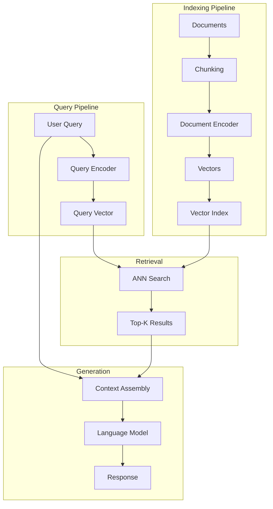
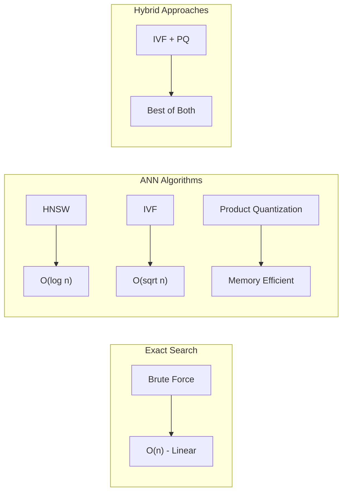
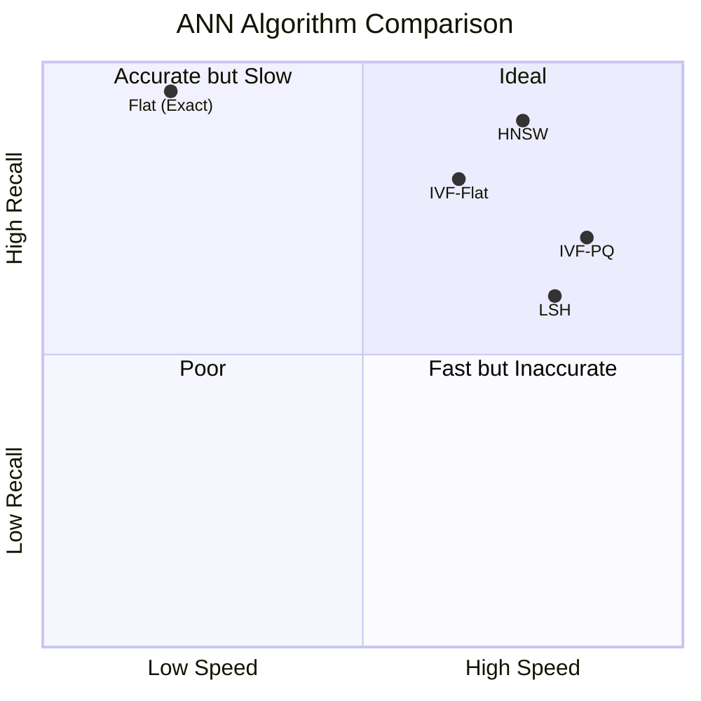
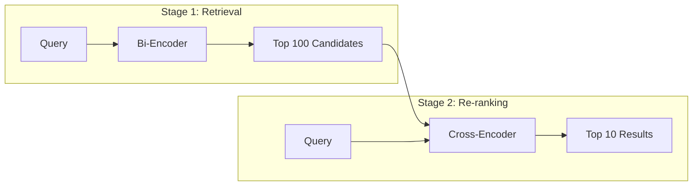

# How to Build Dense Retrieval

Author: [nawazdhandala](https://github.com/nawazdhandala)

Tags: RAG, Dense Retrieval, Vector Search, Embeddings

Description: Learn to implement dense retrieval with bi-encoder models, approximate nearest neighbor search, and query optimization for semantic search systems.

---

Dense retrieval has become the backbone of modern Retrieval-Augmented Generation (RAG) systems. Unlike traditional keyword-based search that relies on exact term matching, dense retrieval uses neural networks to encode text into continuous vector representations - capturing semantic meaning rather than surface-level patterns. This guide walks through building a production-ready dense retrieval system from the ground up.

## Understanding Dense Retrieval Architecture

Before diving into implementation, let us understand how dense retrieval fits into the broader RAG pipeline.



The system consists of two main pipelines: an offline indexing pipeline that encodes documents into vectors and stores them in a searchable index, and an online query pipeline that encodes user queries and retrieves relevant documents through approximate nearest neighbor (ANN) search.

## Embedding Models - The Foundation

The quality of your dense retrieval system depends heavily on the embedding model. Bi-encoder architectures have become the standard because they allow pre-computing document embeddings, making retrieval efficient at scale.

### Choosing an Embedding Model

Several factors influence model selection:

| Model | Dimensions | Max Tokens | Use Case |
|-------|------------|------------|----------|
| sentence-transformers/all-MiniLM-L6-v2 | 384 | 256 | Fast prototyping |
| BAAI/bge-base-en-v1.5 | 768 | 512 | Balanced performance |
| text-embedding-3-large (OpenAI) | 3072 | 8191 | High accuracy |
| voyage-large-2-instruct | 1024 | 16000 | Long documents |

### Implementing the Encoder

Here is a basic implementation using sentence-transformers:

```python
from sentence_transformers import SentenceTransformer
import numpy as np
from typing import List, Union

class DenseEncoder:
    def __init__(self, model_name: str = "BAAI/bge-base-en-v1.5"):
        self.model = SentenceTransformer(model_name)
        self.dimension = self.model.get_sentence_embedding_dimension()

    def encode_documents(
        self,
        documents: List[str],
        batch_size: int = 32,
        show_progress: bool = True
    ) -> np.ndarray:
        """Encode a list of documents into dense vectors."""
        embeddings = self.model.encode(
            documents,
            batch_size=batch_size,
            show_progress_bar=show_progress,
            normalize_embeddings=True  # L2 normalization for cosine similarity
        )
        return embeddings

    def encode_query(self, query: str) -> np.ndarray:
        """Encode a single query into a dense vector."""
        # Some models use query prefixes for asymmetric retrieval
        embedding = self.model.encode(
            query,
            normalize_embeddings=True
        )
        return embedding
```

### Asymmetric vs Symmetric Encoding

Many modern embedding models use asymmetric encoding - they apply different processing to queries versus documents. This accounts for the fact that queries are typically short while documents are longer and more detailed.

```python
class AsymmetricEncoder(DenseEncoder):
    def __init__(
        self,
        model_name: str = "BAAI/bge-base-en-v1.5",
        query_prefix: str = "Represent this sentence for searching relevant passages: ",
        doc_prefix: str = ""
    ):
        super().__init__(model_name)
        self.query_prefix = query_prefix
        self.doc_prefix = doc_prefix

    def encode_query(self, query: str) -> np.ndarray:
        """Encode query with instruction prefix."""
        prefixed_query = self.query_prefix + query
        return self.model.encode(prefixed_query, normalize_embeddings=True)

    def encode_documents(self, documents: List[str], **kwargs) -> np.ndarray:
        """Encode documents with optional prefix."""
        if self.doc_prefix:
            documents = [self.doc_prefix + doc for doc in documents]
        return super().encode_documents(documents, **kwargs)
```

## Vector Indexing Strategies

Once documents are encoded, you need an efficient way to store and search them. The choice of index structure dramatically impacts retrieval latency and accuracy.



### FAISS - Facebook AI Similarity Search

FAISS is the industry standard for vector indexing. Here is how to build different index types:

```python
import faiss
import numpy as np
from typing import Tuple, List

class VectorIndex:
    def __init__(self, dimension: int, index_type: str = "flat"):
        self.dimension = dimension
        self.index_type = index_type
        self.index = self._create_index()

    def _create_index(self) -> faiss.Index:
        """Create the appropriate FAISS index."""
        if self.index_type == "flat":
            # Exact search - use for small datasets (< 100k vectors)
            return faiss.IndexFlatIP(self.dimension)

        elif self.index_type == "hnsw":
            # HNSW - great balance of speed and accuracy
            index = faiss.IndexHNSWFlat(self.dimension, 32)  # 32 neighbors
            index.hnsw.efConstruction = 200  # Build-time accuracy
            index.hnsw.efSearch = 128  # Search-time accuracy
            return index

        elif self.index_type == "ivf":
            # IVF - good for large datasets
            nlist = 100  # Number of clusters
            quantizer = faiss.IndexFlatIP(self.dimension)
            index = faiss.IndexIVFFlat(quantizer, self.dimension, nlist)
            return index

        elif self.index_type == "ivfpq":
            # IVF with Product Quantization - memory efficient
            nlist = 100
            m = 8  # Number of subquantizers
            quantizer = faiss.IndexFlatIP(self.dimension)
            index = faiss.IndexIVFPQ(quantizer, self.dimension, nlist, m, 8)
            return index

        else:
            raise ValueError(f"Unknown index type: {self.index_type}")

    def train(self, vectors: np.ndarray):
        """Train the index (required for IVF-based indices)."""
        if hasattr(self.index, 'train'):
            self.index.train(vectors.astype(np.float32))

    def add(self, vectors: np.ndarray, ids: np.ndarray = None):
        """Add vectors to the index."""
        vectors = vectors.astype(np.float32)
        if ids is not None:
            # Use IndexIDMap if you need custom IDs
            self.index.add_with_ids(vectors, ids)
        else:
            self.index.add(vectors)

    def search(self, query_vectors: np.ndarray, k: int = 10) -> Tuple[np.ndarray, np.ndarray]:
        """Search for k nearest neighbors."""
        query_vectors = query_vectors.astype(np.float32)
        if len(query_vectors.shape) == 1:
            query_vectors = query_vectors.reshape(1, -1)

        scores, indices = self.index.search(query_vectors, k)
        return scores, indices
```

### Understanding ANN Algorithm Trade-offs



**HNSW (Hierarchical Navigable Small World)** builds a multi-layer graph structure. It offers excellent recall (often > 95%) with logarithmic search complexity, making it ideal for most production systems.

**IVF (Inverted File Index)** partitions the vector space into clusters. At query time, it only searches the most relevant clusters, trading some accuracy for speed.

**Product Quantization** compresses vectors by splitting them into subvectors and quantizing each independently. This reduces memory usage significantly but introduces quantization error.

## Building the Complete Retrieval System

Now let us combine everything into a production-ready retrieval system:

```python
import json
import os
from dataclasses import dataclass
from typing import List, Dict, Optional
import numpy as np

@dataclass
class Document:
    id: str
    content: str
    metadata: Dict = None

@dataclass
class RetrievalResult:
    document: Document
    score: float

class DenseRetriever:
    def __init__(
        self,
        encoder: DenseEncoder,
        index_type: str = "hnsw",
        index_path: Optional[str] = None
    ):
        self.encoder = encoder
        self.index_type = index_type
        self.index_path = index_path
        self.index = None
        self.documents: Dict[int, Document] = {}
        self.doc_id_to_index: Dict[str, int] = {}

    def index_documents(self, documents: List[Document], batch_size: int = 32):
        """Index a list of documents."""
        print(f"Indexing {len(documents)} documents...")

        # Store document mappings
        for i, doc in enumerate(documents):
            self.documents[i] = doc
            self.doc_id_to_index[doc.id] = i

        # Encode all documents
        texts = [doc.content for doc in documents]
        embeddings = self.encoder.encode_documents(texts, batch_size=batch_size)

        # Create and populate index
        self.index = VectorIndex(self.encoder.dimension, self.index_type)

        # Train if necessary (IVF-based indices)
        if self.index_type in ["ivf", "ivfpq"]:
            print("Training index...")
            self.index.train(embeddings)

        # Add vectors
        self.index.add(embeddings)
        print(f"Indexed {self.index.index.ntotal} vectors")

    def retrieve(
        self,
        query: str,
        top_k: int = 10,
        score_threshold: float = None
    ) -> List[RetrievalResult]:
        """Retrieve documents relevant to the query."""
        # Encode query
        query_vector = self.encoder.encode_query(query)

        # Search index
        scores, indices = self.index.search(query_vector, top_k)

        # Build results
        results = []
        for score, idx in zip(scores[0], indices[0]):
            if idx == -1:  # FAISS returns -1 for empty slots
                continue
            if score_threshold and score < score_threshold:
                continue

            results.append(RetrievalResult(
                document=self.documents[idx],
                score=float(score)
            ))

        return results

    def save(self, path: str):
        """Save the index and document store."""
        os.makedirs(path, exist_ok=True)

        # Save FAISS index
        faiss.write_index(self.index.index, os.path.join(path, "index.faiss"))

        # Save documents
        docs_data = {
            str(k): {"id": v.id, "content": v.content, "metadata": v.metadata}
            for k, v in self.documents.items()
        }
        with open(os.path.join(path, "documents.json"), "w") as f:
            json.dump(docs_data, f)

    def load(self, path: str):
        """Load a saved index and document store."""
        # Load FAISS index
        self.index = VectorIndex(self.encoder.dimension, self.index_type)
        self.index.index = faiss.read_index(os.path.join(path, "index.faiss"))

        # Load documents
        with open(os.path.join(path, "documents.json"), "r") as f:
            docs_data = json.load(f)

        self.documents = {
            int(k): Document(**v) for k, v in docs_data.items()
        }
        self.doc_id_to_index = {
            doc.id: idx for idx, doc in self.documents.items()
        }
```

## Query Encoding Optimization

Query encoding happens at request time, so optimizing it is crucial for low-latency retrieval.

### Query Expansion

Expand queries to capture more semantic variations:

```python
class QueryExpander:
    def __init__(self, llm_client=None):
        self.llm_client = llm_client

    def expand_with_synonyms(self, query: str, synonyms_map: Dict[str, List[str]]) -> List[str]:
        """Expand query using a synonyms dictionary."""
        expanded = [query]
        words = query.lower().split()

        for word in words:
            if word in synonyms_map:
                for synonym in synonyms_map[word]:
                    expanded.append(query.replace(word, synonym))

        return expanded

    def expand_with_llm(self, query: str) -> List[str]:
        """Use an LLM to generate query variations."""
        if not self.llm_client:
            return [query]

        prompt = f"""Generate 3 alternative phrasings of this search query that capture the same intent:
Query: {query}

Return only the alternative queries, one per line."""

        response = self.llm_client.generate(prompt)
        variations = [query] + [line.strip() for line in response.split("\n") if line.strip()]
        return variations[:4]  # Limit to 4 total


class MultiQueryRetriever:
    def __init__(self, retriever: DenseRetriever, expander: QueryExpander):
        self.retriever = retriever
        self.expander = expander

    def retrieve(self, query: str, top_k: int = 10) -> List[RetrievalResult]:
        """Retrieve using multiple query variations."""
        # Expand the query
        queries = self.expander.expand_with_synonyms(query, {
            "error": ["exception", "failure", "bug"],
            "fast": ["quick", "rapid", "efficient"],
            "install": ["setup", "configure", "deploy"]
        })

        # Retrieve for each variation
        all_results = {}
        for q in queries:
            results = self.retriever.retrieve(q, top_k=top_k)
            for result in results:
                doc_id = result.document.id
                if doc_id not in all_results or result.score > all_results[doc_id].score:
                    all_results[doc_id] = result

        # Sort by score and return top k
        sorted_results = sorted(all_results.values(), key=lambda x: x.score, reverse=True)
        return sorted_results[:top_k]
```

### Query Caching

For repeated queries, caching encoded vectors significantly reduces latency:

```python
from functools import lru_cache
import hashlib

class CachedEncoder(DenseEncoder):
    def __init__(self, model_name: str, cache_size: int = 10000):
        super().__init__(model_name)
        self._cache_size = cache_size

    @lru_cache(maxsize=10000)
    def _cached_encode(self, text: str) -> tuple:
        """Cache-friendly encoding that returns a tuple."""
        embedding = super().encode_query(text)
        return tuple(embedding.tolist())

    def encode_query(self, query: str) -> np.ndarray:
        """Encode with caching."""
        cached = self._cached_encode(query)
        return np.array(cached)
```

## Relevance Tuning

Even with good embeddings, relevance tuning helps optimize retrieval for your specific domain.

### Re-ranking with Cross-Encoders

Cross-encoders jointly encode query-document pairs, providing more accurate relevance scores at the cost of speed:



```python
from sentence_transformers import CrossEncoder

class ReRanker:
    def __init__(self, model_name: str = "cross-encoder/ms-marco-MiniLM-L-6-v2"):
        self.model = CrossEncoder(model_name)

    def rerank(
        self,
        query: str,
        results: List[RetrievalResult],
        top_k: int = 10
    ) -> List[RetrievalResult]:
        """Re-rank results using a cross-encoder."""
        if not results:
            return []

        # Create query-document pairs
        pairs = [(query, result.document.content) for result in results]

        # Score with cross-encoder
        scores = self.model.predict(pairs)

        # Update scores and sort
        for result, score in zip(results, scores):
            result.score = float(score)

        sorted_results = sorted(results, key=lambda x: x.score, reverse=True)
        return sorted_results[:top_k]


class TwoStageRetriever:
    def __init__(
        self,
        retriever: DenseRetriever,
        reranker: ReRanker,
        first_stage_k: int = 100
    ):
        self.retriever = retriever
        self.reranker = reranker
        self.first_stage_k = first_stage_k

    def retrieve(self, query: str, top_k: int = 10) -> List[RetrievalResult]:
        """Two-stage retrieval with re-ranking."""
        # Stage 1: Fast bi-encoder retrieval
        candidates = self.retriever.retrieve(query, top_k=self.first_stage_k)

        # Stage 2: Accurate cross-encoder re-ranking
        results = self.reranker.rerank(query, candidates, top_k=top_k)

        return results
```

### Score Calibration

Raw similarity scores are not always comparable across queries. Calibration helps normalize scores:

```python
class ScoreCalibrator:
    def __init__(self, retriever: DenseRetriever):
        self.retriever = retriever
        self.calibration_queries = []
        self.score_distribution = None

    def calibrate(self, queries: List[str], top_k: int = 100):
        """Learn score distribution from calibration queries."""
        all_scores = []

        for query in queries:
            results = self.retriever.retrieve(query, top_k=top_k)
            scores = [r.score for r in results]
            all_scores.extend(scores)

        self.score_distribution = {
            "mean": np.mean(all_scores),
            "std": np.std(all_scores),
            "min": np.min(all_scores),
            "max": np.max(all_scores),
            "percentiles": {
                "25": np.percentile(all_scores, 25),
                "50": np.percentile(all_scores, 50),
                "75": np.percentile(all_scores, 75),
                "90": np.percentile(all_scores, 90)
            }
        }

    def normalize_score(self, score: float) -> float:
        """Normalize a score to 0-1 range based on calibration."""
        if self.score_distribution is None:
            return score

        # Z-score normalization
        z_score = (score - self.score_distribution["mean"]) / self.score_distribution["std"]

        # Sigmoid to map to 0-1
        normalized = 1 / (1 + np.exp(-z_score))
        return float(normalized)
```

### Hybrid Search - Combining Dense and Sparse

Purely semantic search can miss exact keyword matches. Hybrid search combines dense retrieval with traditional BM25:

```python
from rank_bm25 import BM25Okapi
import re

class HybridRetriever:
    def __init__(
        self,
        dense_retriever: DenseRetriever,
        alpha: float = 0.7  # Weight for dense scores
    ):
        self.dense_retriever = dense_retriever
        self.alpha = alpha
        self.bm25 = None
        self.tokenized_corpus = None

    def _tokenize(self, text: str) -> List[str]:
        """Simple tokenization."""
        return re.findall(r'\w+', text.lower())

    def index_documents(self, documents: List[Document], **kwargs):
        """Index documents for both dense and sparse retrieval."""
        # Dense indexing
        self.dense_retriever.index_documents(documents, **kwargs)

        # BM25 indexing
        self.tokenized_corpus = [self._tokenize(doc.content) for doc in documents]
        self.bm25 = BM25Okapi(self.tokenized_corpus)

    def retrieve(self, query: str, top_k: int = 10) -> List[RetrievalResult]:
        """Hybrid retrieval combining dense and sparse."""
        # Dense retrieval
        dense_results = self.dense_retriever.retrieve(query, top_k=top_k * 2)

        # BM25 retrieval
        tokenized_query = self._tokenize(query)
        bm25_scores = self.bm25.get_scores(tokenized_query)

        # Normalize BM25 scores
        max_bm25 = max(bm25_scores) if max(bm25_scores) > 0 else 1
        normalized_bm25 = bm25_scores / max_bm25

        # Combine scores
        combined_scores = {}

        # Add dense scores
        for result in dense_results:
            idx = self.dense_retriever.doc_id_to_index[result.document.id]
            dense_score = result.score
            sparse_score = normalized_bm25[idx]

            combined = self.alpha * dense_score + (1 - self.alpha) * sparse_score
            combined_scores[result.document.id] = (result.document, combined)

        # Add any high BM25 results not in dense results
        top_bm25_indices = np.argsort(bm25_scores)[-top_k:][::-1]
        for idx in top_bm25_indices:
            doc = self.dense_retriever.documents[idx]
            if doc.id not in combined_scores:
                sparse_score = normalized_bm25[idx]
                combined_scores[doc.id] = (doc, (1 - self.alpha) * sparse_score)

        # Sort and return
        sorted_results = sorted(
            combined_scores.values(),
            key=lambda x: x[1],
            reverse=True
        )

        return [
            RetrievalResult(document=doc, score=score)
            for doc, score in sorted_results[:top_k]
        ]
```

## Performance Optimization

### Batched Retrieval

When processing multiple queries, batch them for GPU efficiency:

```python
class BatchRetriever:
    def __init__(self, retriever: DenseRetriever):
        self.retriever = retriever

    def retrieve_batch(
        self,
        queries: List[str],
        top_k: int = 10
    ) -> List[List[RetrievalResult]]:
        """Retrieve for multiple queries efficiently."""
        # Batch encode all queries
        query_vectors = np.array([
            self.retriever.encoder.encode_query(q) for q in queries
        ])

        # Batch search
        scores, indices = self.retriever.index.search(query_vectors, top_k)

        # Build results for each query
        all_results = []
        for query_scores, query_indices in zip(scores, indices):
            results = []
            for score, idx in zip(query_scores, query_indices):
                if idx == -1:
                    continue
                results.append(RetrievalResult(
                    document=self.retriever.documents[idx],
                    score=float(score)
                ))
            all_results.append(results)

        return all_results
```

### GPU Acceleration

FAISS supports GPU acceleration for both indexing and search:

```python
def create_gpu_index(cpu_index: faiss.Index, gpu_id: int = 0) -> faiss.Index:
    """Move a FAISS index to GPU."""
    res = faiss.StandardGpuResources()
    gpu_index = faiss.index_cpu_to_gpu(res, gpu_id, cpu_index)
    return gpu_index

def create_multi_gpu_index(cpu_index: faiss.Index, gpu_ids: List[int]) -> faiss.Index:
    """Distribute index across multiple GPUs."""
    co = faiss.GpuMultipleClonerOptions()
    co.shard = True  # Shard across GPUs
    gpu_index = faiss.index_cpu_to_all_gpus(cpu_index, co)
    return gpu_index
```

## Putting It All Together

Here is a complete example bringing all components together:

```python
def main():
    # Initialize encoder
    encoder = AsymmetricEncoder(
        model_name="BAAI/bge-base-en-v1.5",
        query_prefix="Represent this sentence for searching relevant passages: "
    )

    # Create retriever
    retriever = DenseRetriever(encoder, index_type="hnsw")

    # Sample documents
    documents = [
        Document(
            id="doc1",
            content="Dense retrieval uses neural networks to encode text into vectors.",
            metadata={"source": "tutorial"}
        ),
        Document(
            id="doc2",
            content="FAISS is a library for efficient similarity search.",
            metadata={"source": "documentation"}
        ),
        Document(
            id="doc3",
            content="RAG combines retrieval with language model generation.",
            metadata={"source": "paper"}
        ),
    ]

    # Index documents
    retriever.index_documents(documents)

    # Create two-stage retriever with re-ranking
    reranker = ReRanker()
    two_stage = TwoStageRetriever(retriever, reranker)

    # Retrieve
    query = "How does semantic search work?"
    results = two_stage.retrieve(query, top_k=3)

    print(f"Query: {query}\n")
    for i, result in enumerate(results, 1):
        print(f"{i}. [{result.score:.4f}] {result.document.content}")
        print(f"   Source: {result.document.metadata.get('source', 'unknown')}\n")

if __name__ == "__main__":
    main()
```

## Evaluation and Monitoring

Measuring retrieval quality is essential for continuous improvement:

```python
from typing import Set

def precision_at_k(retrieved: List[str], relevant: Set[str], k: int) -> float:
    """Calculate precision at k."""
    retrieved_k = retrieved[:k]
    relevant_retrieved = len(set(retrieved_k) & relevant)
    return relevant_retrieved / k

def recall_at_k(retrieved: List[str], relevant: Set[str], k: int) -> float:
    """Calculate recall at k."""
    retrieved_k = retrieved[:k]
    relevant_retrieved = len(set(retrieved_k) & relevant)
    return relevant_retrieved / len(relevant) if relevant else 0

def mrr(retrieved: List[str], relevant: Set[str]) -> float:
    """Calculate Mean Reciprocal Rank."""
    for i, doc_id in enumerate(retrieved, 1):
        if doc_id in relevant:
            return 1 / i
    return 0

def ndcg_at_k(retrieved: List[str], relevance_scores: Dict[str, int], k: int) -> float:
    """Calculate Normalized Discounted Cumulative Gain at k."""
    dcg = sum(
        relevance_scores.get(doc_id, 0) / np.log2(i + 2)
        for i, doc_id in enumerate(retrieved[:k])
    )

    ideal_scores = sorted(relevance_scores.values(), reverse=True)[:k]
    idcg = sum(
        score / np.log2(i + 2)
        for i, score in enumerate(ideal_scores)
    )

    return dcg / idcg if idcg > 0 else 0
```

## Key Takeaways

Building an effective dense retrieval system requires attention to several components:

1. **Embedding Model Selection** - Choose based on your accuracy requirements, latency constraints, and document lengths. Asymmetric models often perform better for retrieval tasks.

2. **Index Structure** - HNSW provides the best recall-speed trade-off for most use cases. Consider IVF-PQ for very large collections where memory is constrained.

3. **Query Optimization** - Use query expansion, caching, and proper batching to minimize latency. Consider using instruction prefixes for better query encoding.

4. **Relevance Tuning** - Implement two-stage retrieval with cross-encoder re-ranking for maximum accuracy. Hybrid search combining dense and sparse retrieval covers both semantic and keyword matching.

5. **Continuous Evaluation** - Track metrics like MRR, NDCG, and recall to measure and improve retrieval quality over time.

Dense retrieval is a rapidly evolving field. Keep experimenting with new embedding models, indexing strategies, and tuning techniques to build the best retrieval system for your RAG application.
