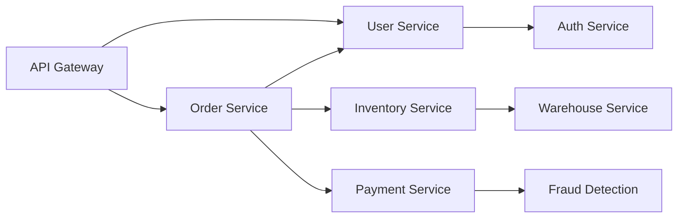
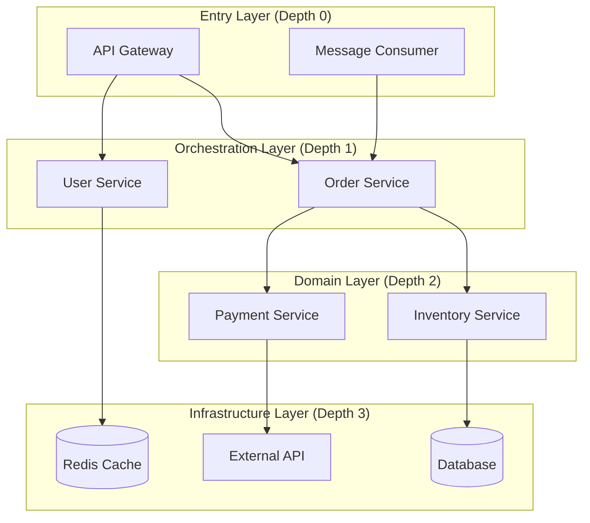
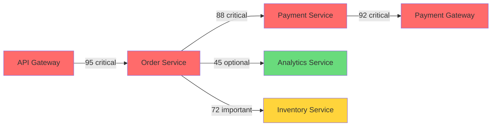
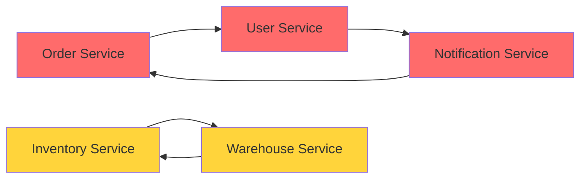
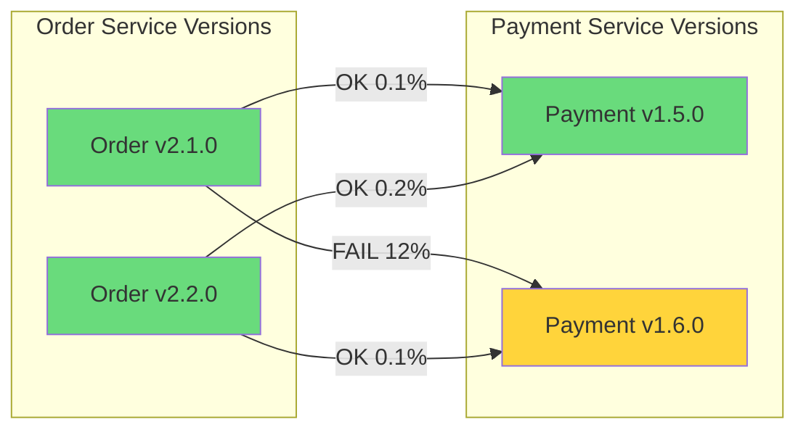
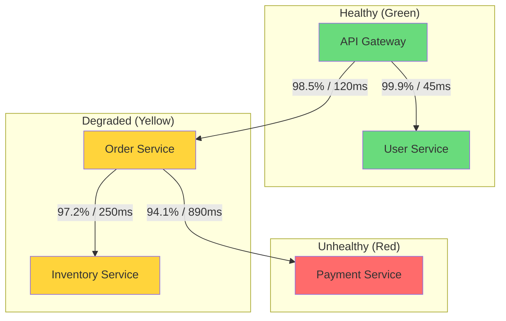

# How to Build Dependency Analysis

Author: [nawazdhandala](https://github.com/nawazdhandala)

Tags: Observability, Tracing, Architecture, Microservices

Description: Learn how to analyze service dependencies from trace data for architecture understanding.

---

Your distributed system has grown from three services to thirty. Somewhere in that growth, you lost track of what calls what. An architect draws a diagram. A team lead disagrees. Nobody really knows what depends on what, at what frequency, or which dependencies are actually critical to production traffic.

Traces hold the answer. Every span captures a parent-child relationship. Every trace captures a request path. Aggregate enough traces, and you can reconstruct your entire service topology, identify critical paths, detect circular dependencies, and surface health metrics for every edge in your architecture.

This guide shows you how to build dependency analysis from trace data, turning raw spans into actionable architecture insights.

---

## Table of Contents

1. Building Service Graphs from Traces
2. Dependency Direction Analysis
3. Critical Dependency Identification
4. Circular Dependency Detection
5. Version Dependency Tracking
6. Dependency Health Metrics
7. Putting It All Together
8. Production Considerations

---

## 1. Building Service Graphs from Traces

Every trace is a tree of spans. Each span knows its parent. Each span carries a `service.name` attribute. By walking the parent-child relationships and extracting service names, you build edges in a dependency graph.

### The Core Data Model

```typescript
interface ServiceEdge {
  source: string;       // Calling service
  target: string;       // Called service
  operation: string;    // The span name (e.g., "HTTP GET /users")
  callCount: number;    // Number of times this edge was traversed
  errorCount: number;   // Number of failed calls
  totalLatencyMs: number; // Sum of latencies for percentile calculation
  latencies: number[];  // Individual latencies (for p50/p95/p99)
}

interface ServiceNode {
  name: string;
  version?: string;
  inbound: Map<string, ServiceEdge>;  // Edges pointing to this service
  outbound: Map<string, ServiceEdge>; // Edges from this service
}

interface DependencyGraph {
  nodes: Map<string, ServiceNode>;
  edges: ServiceEdge[];
  lastUpdated: Date;
}
```

### Extracting Edges from Spans

The algorithm walks each trace and extracts parent-child service relationships:

```typescript
import { Span } from '@opentelemetry/api';

interface RawSpan {
  traceId: string;
  spanId: string;
  parentSpanId?: string;
  serviceName: string;
  operationName: string;
  startTime: number;
  endTime: number;
  status: 'OK' | 'ERROR' | 'UNSET';
  attributes: Record<string, any>;
}

function buildGraphFromSpans(spans: RawSpan[]): DependencyGraph {
  const graph: DependencyGraph = {
    nodes: new Map(),
    edges: [],
    lastUpdated: new Date(),
  };

  // Index spans by spanId for parent lookup
  const spanIndex = new Map<string, RawSpan>();
  for (const span of spans) {
    spanIndex.set(span.spanId, span);
  }

  // Process each span to find cross-service edges
  for (const span of spans) {
    if (!span.parentSpanId) continue; // Root spans have no parent

    const parentSpan = spanIndex.get(span.parentSpanId);
    if (!parentSpan) continue; // Parent not in this batch

    // Only create edge if services differ (cross-service call)
    if (parentSpan.serviceName === span.serviceName) continue;

    const edgeKey = `${parentSpan.serviceName}->${span.serviceName}:${span.operationName}`;

    // Ensure nodes exist
    if (!graph.nodes.has(parentSpan.serviceName)) {
      graph.nodes.set(parentSpan.serviceName, {
        name: parentSpan.serviceName,
        inbound: new Map(),
        outbound: new Map(),
      });
    }
    if (!graph.nodes.has(span.serviceName)) {
      graph.nodes.set(span.serviceName, {
        name: span.serviceName,
        inbound: new Map(),
        outbound: new Map(),
      });
    }

    // Find or create edge
    let edge = graph.edges.find(e =>
      e.source === parentSpan.serviceName &&
      e.target === span.serviceName &&
      e.operation === span.operationName
    );

    if (!edge) {
      edge = {
        source: parentSpan.serviceName,
        target: span.serviceName,
        operation: span.operationName,
        callCount: 0,
        errorCount: 0,
        totalLatencyMs: 0,
        latencies: [],
      };
      graph.edges.push(edge);
    }

    // Update edge metrics
    const latencyMs = span.endTime - span.startTime;
    edge.callCount++;
    edge.totalLatencyMs += latencyMs;
    edge.latencies.push(latencyMs);
    if (span.status === 'ERROR') {
      edge.errorCount++;
    }

    // Update node references
    const sourceNode = graph.nodes.get(parentSpan.serviceName)!;
    const targetNode = graph.nodes.get(span.serviceName)!;
    sourceNode.outbound.set(edgeKey, edge);
    targetNode.inbound.set(edgeKey, edge);
  }

  return graph;
}
```

### Visual Representation

The resulting graph can be visualized as a directed graph. Here is an example topology:



This shows request flow from the API Gateway through various services. Each edge represents a dependency relationship discovered from trace data.

---

## 2. Dependency Direction Analysis

Understanding dependency direction answers critical questions: What does this service depend on? What depends on this service? How deeply nested is a service in the call chain?

### Calculating Dependency Depth

Dependency depth measures how far a service is from entry points (API gateways, message consumers) versus how close it is to leaf services (databases, external APIs).

```typescript
interface DependencyDepth {
  service: string;
  upstreamDepth: number;   // Distance from entry points
  downstreamDepth: number; // Distance to leaf nodes
  criticalPathDepth: number; // Max depth in any path
}

function calculateDependencyDepths(graph: DependencyGraph): DependencyDepth[] {
  const depths: Map<string, DependencyDepth> = new Map();

  // Initialize all nodes
  for (const [name] of graph.nodes) {
    depths.set(name, {
      service: name,
      upstreamDepth: 0,
      downstreamDepth: 0,
      criticalPathDepth: 0,
    });
  }

  // Find entry points (nodes with no inbound edges)
  const entryPoints: string[] = [];
  for (const [name, node] of graph.nodes) {
    if (node.inbound.size === 0) {
      entryPoints.push(name);
    }
  }

  // BFS from entry points to calculate upstream depth
  function bfsUpstream(startNodes: string[]) {
    const visited = new Set<string>();
    const queue: Array<{ node: string; depth: number }> =
      startNodes.map(n => ({ node: n, depth: 0 }));

    while (queue.length > 0) {
      const { node, depth } = queue.shift()!;
      if (visited.has(node)) continue;
      visited.add(node);

      const depthInfo = depths.get(node)!;
      depthInfo.upstreamDepth = Math.max(depthInfo.upstreamDepth, depth);

      const serviceNode = graph.nodes.get(node)!;
      for (const edge of serviceNode.outbound.values()) {
        if (!visited.has(edge.target)) {
          queue.push({ node: edge.target, depth: depth + 1 });
        }
      }
    }
  }

  // Find leaf nodes (nodes with no outbound edges)
  const leafNodes: string[] = [];
  for (const [name, node] of graph.nodes) {
    if (node.outbound.size === 0) {
      leafNodes.push(name);
    }
  }

  // BFS from leaf nodes to calculate downstream depth
  function bfsDownstream(startNodes: string[]) {
    const visited = new Set<string>();
    const queue: Array<{ node: string; depth: number }> =
      startNodes.map(n => ({ node: n, depth: 0 }));

    while (queue.length > 0) {
      const { node, depth } = queue.shift()!;
      if (visited.has(node)) continue;
      visited.add(node);

      const depthInfo = depths.get(node)!;
      depthInfo.downstreamDepth = Math.max(depthInfo.downstreamDepth, depth);

      const serviceNode = graph.nodes.get(node)!;
      for (const edge of serviceNode.inbound.values()) {
        if (!visited.has(edge.source)) {
          queue.push({ node: edge.source, depth: depth + 1 });
        }
      }
    }
  }

  bfsUpstream(entryPoints);
  bfsDownstream(leafNodes);

  // Calculate critical path depth
  for (const [name, depthInfo] of depths) {
    depthInfo.criticalPathDepth = depthInfo.upstreamDepth + depthInfo.downstreamDepth;
  }

  return Array.from(depths.values());
}
```

### Dependency Direction Diagram

Visualizing direction helps identify architectural layers:



Services at depth 0 are entry points. Services at depth 3 are leaf dependencies. Services in between are orchestrators or domain services.

---

## 3. Critical Dependency Identification

Not all dependencies are equal. Some are critical paths that affect every request. Others are optional or have fallbacks. Identifying critical dependencies helps prioritize reliability investments.

### Criticality Scoring Algorithm

```typescript
interface DependencyCriticality {
  source: string;
  target: string;
  operation: string;
  score: number;          // 0-100 criticality score
  factors: {
    callVolume: number;   // Higher volume = more critical
    errorImpact: number;  // Do errors propagate?
    latencyImpact: number; // Does latency propagate?
    exclusivity: number;  // Is this the only path?
  };
}

function calculateCriticality(
  graph: DependencyGraph,
  timeWindowMinutes: number = 60
): DependencyCriticality[] {
  const results: DependencyCriticality[] = [];

  // Calculate total call volume for normalization
  const totalCalls = graph.edges.reduce((sum, e) => sum + e.callCount, 0);

  for (const edge of graph.edges) {
    const targetNode = graph.nodes.get(edge.target)!;
    const sourceNode = graph.nodes.get(edge.source)!;

    // Factor 1: Call Volume (normalized)
    const callVolumeScore = Math.min(100, (edge.callCount / totalCalls) * 1000);

    // Factor 2: Error Impact
    // If errors on this edge correlate with errors on the source, impact is high
    const errorRate = edge.errorCount / edge.callCount;
    const errorImpactScore = errorRate > 0.01 ? Math.min(100, errorRate * 500) : 0;

    // Factor 3: Latency Impact
    // Calculate what percentage of source latency comes from this dependency
    const avgLatency = edge.totalLatencyMs / edge.callCount;
    const latencyImpactScore = Math.min(100, avgLatency / 10); // 1000ms = 100 score

    // Factor 4: Exclusivity
    // If source has only one path to target's functionality, it's exclusive
    const alternativePaths = Array.from(sourceNode.outbound.values())
      .filter(e => e.target !== edge.target && e.operation.includes(edge.operation.split(' ')[0]))
      .length;
    const exclusivityScore = alternativePaths === 0 ? 100 : 100 / (alternativePaths + 1);

    // Weighted combination
    const overallScore = (
      callVolumeScore * 0.3 +
      errorImpactScore * 0.25 +
      latencyImpactScore * 0.25 +
      exclusivityScore * 0.2
    );

    results.push({
      source: edge.source,
      target: edge.target,
      operation: edge.operation,
      score: Math.round(overallScore),
      factors: {
        callVolume: Math.round(callVolumeScore),
        errorImpact: Math.round(errorImpactScore),
        latencyImpact: Math.round(latencyImpactScore),
        exclusivity: Math.round(exclusivityScore),
      },
    });
  }

  // Sort by criticality score descending
  return results.sort((a, b) => b.score - a.score);
}
```

### Critical Path Visualization



Red indicates critical dependencies (score > 80). Yellow indicates important dependencies (score 50-80). Green indicates optional dependencies (score < 50).

### Using Criticality Data

Once you have criticality scores, you can:

1. **Prioritize SLO coverage**: Critical dependencies need stricter SLOs
2. **Plan circuit breakers**: Non-critical dependencies can fail gracefully
3. **Focus chaos testing**: Test critical path failures first
4. **Guide architecture decisions**: Consider redundancy for exclusive critical paths

---

## 4. Circular Dependency Detection

Circular dependencies create coupling, complicate deployments, and can cause cascading failures. Detecting them from trace data reveals real runtime cycles, not just theoretical import relationships.

### Cycle Detection Algorithm

```typescript
interface CircularDependency {
  cycle: string[];        // Services in the cycle
  edges: ServiceEdge[];   // Edges forming the cycle
  frequency: number;      // How often this cycle is traversed
  avgCycleLatency: number; // Total latency around the cycle
}

function detectCircularDependencies(graph: DependencyGraph): CircularDependency[] {
  const cycles: CircularDependency[] = [];
  const visited = new Set<string>();
  const recursionStack = new Set<string>();
  const path: string[] = [];

  function dfs(node: string): void {
    visited.add(node);
    recursionStack.add(node);
    path.push(node);

    const serviceNode = graph.nodes.get(node);
    if (!serviceNode) return;

    for (const edge of serviceNode.outbound.values()) {
      const target = edge.target;

      if (!visited.has(target)) {
        dfs(target);
      } else if (recursionStack.has(target)) {
        // Found a cycle! Extract it from the path
        const cycleStart = path.indexOf(target);
        const cyclePath = path.slice(cycleStart);
        cyclePath.push(target); // Complete the cycle

        // Collect edges in this cycle
        const cycleEdges: ServiceEdge[] = [];
        let totalFrequency = 0;
        let totalLatency = 0;

        for (let i = 0; i < cyclePath.length - 1; i++) {
          const source = cyclePath[i];
          const dest = cyclePath[i + 1];
          const edgeInCycle = graph.edges.find(
            e => e.source === source && e.target === dest
          );
          if (edgeInCycle) {
            cycleEdges.push(edgeInCycle);
            totalFrequency += edgeInCycle.callCount;
            totalLatency += edgeInCycle.totalLatencyMs / edgeInCycle.callCount;
          }
        }

        // Only add if we haven't seen this cycle before
        const cycleKey = cyclePath.slice(0, -1).sort().join(',');
        if (!cycles.find(c => c.cycle.slice().sort().join(',') === cycleKey)) {
          cycles.push({
            cycle: cyclePath.slice(0, -1),
            edges: cycleEdges,
            frequency: Math.round(totalFrequency / cycleEdges.length),
            avgCycleLatency: Math.round(totalLatency),
          });
        }
      }
    }

    path.pop();
    recursionStack.delete(node);
  }

  // Run DFS from each unvisited node
  for (const [nodeName] of graph.nodes) {
    if (!visited.has(nodeName)) {
      dfs(nodeName);
    }
  }

  return cycles;
}
```

### Circular Dependency Visualization



The Order -> User -> Notification -> Order cycle and Inventory <-> Warehouse cycle represent architectural issues to address.

### Handling Detected Cycles

When you find circular dependencies:

1. **Assess necessity**: Some cycles are intentional (e.g., bidirectional sync)
2. **Measure impact**: High-frequency cycles are more problematic
3. **Consider refactoring**: Extract shared logic to break cycles
4. **Add async boundaries**: Replace sync calls with events to decouple

```typescript
interface CycleRemediationSuggestion {
  cycle: string[];
  suggestion: 'extract_service' | 'use_events' | 'merge_services' | 'accept';
  reasoning: string;
}

function suggestCycleRemediation(
  cycle: CircularDependency
): CycleRemediationSuggestion {
  // High frequency cycles between 2 services might need merging
  if (cycle.cycle.length === 2 && cycle.frequency > 1000) {
    return {
      cycle: cycle.cycle,
      suggestion: 'merge_services',
      reasoning: 'High-frequency bidirectional dependency suggests these services are tightly coupled and may belong together',
    };
  }

  // Long cycles suggest missing abstraction
  if (cycle.cycle.length > 3) {
    return {
      cycle: cycle.cycle,
      suggestion: 'extract_service',
      reasoning: 'Long dependency cycle suggests shared state or logic that could be extracted to a new service',
    };
  }

  // Low frequency cycles might be acceptable with async communication
  if (cycle.frequency < 100) {
    return {
      cycle: cycle.cycle,
      suggestion: 'use_events',
      reasoning: 'Low-frequency cycle can be broken by replacing one synchronous call with event-driven communication',
    };
  }

  return {
    cycle: cycle.cycle,
    suggestion: 'accept',
    reasoning: 'Cycle appears intentional and well-managed',
  };
}
```

---

## 5. Version Dependency Tracking

In microservices, different versions of a service often run simultaneously during deployments. Tracking version dependencies helps identify compatibility issues and rollout problems.

### Extracting Version Information

Version information typically comes from resource attributes in spans:

```typescript
interface VersionedEdge extends ServiceEdge {
  sourceVersion: string;
  targetVersion: string;
}

interface VersionCompatibility {
  source: string;
  sourceVersion: string;
  target: string;
  targetVersion: string;
  callCount: number;
  errorRate: number;
  avgLatencyMs: number;
  compatible: boolean; // Determined by error rate threshold
}

function extractVersionedEdges(spans: RawSpan[]): VersionedEdge[] {
  const edges: Map<string, VersionedEdge> = new Map();
  const spanIndex = new Map<string, RawSpan>();

  for (const span of spans) {
    spanIndex.set(span.spanId, span);
  }

  for (const span of spans) {
    if (!span.parentSpanId) continue;

    const parentSpan = spanIndex.get(span.parentSpanId);
    if (!parentSpan) continue;
    if (parentSpan.serviceName === span.serviceName) continue;

    // Extract versions from resource attributes
    const sourceVersion = parentSpan.attributes['service.version'] || 'unknown';
    const targetVersion = span.attributes['service.version'] || 'unknown';

    const edgeKey = `${parentSpan.serviceName}@${sourceVersion}->${span.serviceName}@${targetVersion}:${span.operationName}`;

    if (!edges.has(edgeKey)) {
      edges.set(edgeKey, {
        source: parentSpan.serviceName,
        target: span.serviceName,
        operation: span.operationName,
        callCount: 0,
        errorCount: 0,
        totalLatencyMs: 0,
        latencies: [],
        sourceVersion,
        targetVersion,
      });
    }

    const edge = edges.get(edgeKey)!;
    const latencyMs = span.endTime - span.startTime;
    edge.callCount++;
    edge.totalLatencyMs += latencyMs;
    edge.latencies.push(latencyMs);
    if (span.status === 'ERROR') {
      edge.errorCount++;
    }
  }

  return Array.from(edges.values());
}
```

### Version Compatibility Matrix

```typescript
function buildVersionCompatibilityMatrix(
  versionedEdges: VersionedEdge[]
): VersionCompatibility[] {
  const compatibilities: VersionCompatibility[] = [];

  // Group by source-target pair to compare versions
  const pairGroups = new Map<string, VersionedEdge[]>();

  for (const edge of versionedEdges) {
    const pairKey = `${edge.source}->${edge.target}`;
    if (!pairGroups.has(pairKey)) {
      pairGroups.set(pairKey, []);
    }
    pairGroups.get(pairKey)!.push(edge);
  }

  for (const [, edges] of pairGroups) {
    for (const edge of edges) {
      const errorRate = edge.errorCount / edge.callCount;
      const avgLatency = edge.totalLatencyMs / edge.callCount;

      compatibilities.push({
        source: edge.source,
        sourceVersion: edge.sourceVersion,
        target: edge.target,
        targetVersion: edge.targetVersion,
        callCount: edge.callCount,
        errorRate,
        avgLatencyMs: avgLatency,
        compatible: errorRate < 0.05, // 5% error threshold
      });
    }
  }

  return compatibilities;
}
```

### Version Dependency Visualization



This reveals that Order v2.1.0 has compatibility issues with Payment v1.6.0, while Order v2.2.0 works with both versions.

### Deployment Safety Checks

```typescript
interface DeploymentRisk {
  service: string;
  newVersion: string;
  currentVersion: string;
  risks: Array<{
    dependentService: string;
    dependentVersion: string;
    historicalErrorRate: number;
    riskLevel: 'low' | 'medium' | 'high' | 'unknown';
  }>;
}

function assessDeploymentRisk(
  serviceToUpdate: string,
  newVersion: string,
  compatibilityMatrix: VersionCompatibility[],
  currentDependents: Array<{ service: string; version: string }>
): DeploymentRisk {
  const risks: DeploymentRisk['risks'] = [];

  for (const dependent of currentDependents) {
    // Look for historical data on this version combination
    const historicalData = compatibilityMatrix.find(
      c => c.source === dependent.service &&
           c.sourceVersion === dependent.version &&
           c.target === serviceToUpdate &&
           c.targetVersion === newVersion
    );

    if (!historicalData) {
      risks.push({
        dependentService: dependent.service,
        dependentVersion: dependent.version,
        historicalErrorRate: -1,
        riskLevel: 'unknown',
      });
    } else {
      let riskLevel: 'low' | 'medium' | 'high' = 'low';
      if (historicalData.errorRate > 0.1) riskLevel = 'high';
      else if (historicalData.errorRate > 0.02) riskLevel = 'medium';

      risks.push({
        dependentService: dependent.service,
        dependentVersion: dependent.version,
        historicalErrorRate: historicalData.errorRate,
        riskLevel,
      });
    }
  }

  return {
    service: serviceToUpdate,
    newVersion,
    currentVersion: compatibilityMatrix.find(c => c.target === serviceToUpdate)?.targetVersion || 'unknown',
    risks,
  };
}
```

---

## 6. Dependency Health Metrics

Beyond structure, you need ongoing health metrics for each dependency. These metrics power dashboards, alerts, and SLO tracking.

### Key Metrics per Dependency

```typescript
interface DependencyHealthMetrics {
  source: string;
  target: string;
  operation: string;

  // Availability
  successRate: number;        // Percentage of successful calls
  errorRate: number;          // Percentage of failed calls

  // Latency
  latencyP50: number;         // Median latency
  latencyP95: number;         // 95th percentile
  latencyP99: number;         // 99th percentile

  // Throughput
  requestsPerSecond: number;  // Current RPS
  peakRps: number;            // Peak RPS in window

  // Saturation signals
  timeoutRate: number;        // Percentage of timeouts
  retryRate: number;          // Percentage of retries

  // Trend indicators
  latencyTrend: 'improving' | 'stable' | 'degrading';
  errorTrend: 'improving' | 'stable' | 'degrading';
}

function calculatePercentile(values: number[], percentile: number): number {
  if (values.length === 0) return 0;
  const sorted = [...values].sort((a, b) => a - b);
  const index = Math.ceil((percentile / 100) * sorted.length) - 1;
  return sorted[Math.max(0, index)];
}

function calculateHealthMetrics(
  edge: ServiceEdge,
  timeWindowSeconds: number,
  previousMetrics?: DependencyHealthMetrics
): DependencyHealthMetrics {
  const successRate = ((edge.callCount - edge.errorCount) / edge.callCount) * 100;
  const errorRate = (edge.errorCount / edge.callCount) * 100;

  const latencyP50 = calculatePercentile(edge.latencies, 50);
  const latencyP95 = calculatePercentile(edge.latencies, 95);
  const latencyP99 = calculatePercentile(edge.latencies, 99);

  const requestsPerSecond = edge.callCount / timeWindowSeconds;

  // Determine trends by comparing to previous metrics
  let latencyTrend: 'improving' | 'stable' | 'degrading' = 'stable';
  let errorTrend: 'improving' | 'stable' | 'degrading' = 'stable';

  if (previousMetrics) {
    const latencyChange = ((latencyP95 - previousMetrics.latencyP95) / previousMetrics.latencyP95) * 100;
    if (latencyChange > 10) latencyTrend = 'degrading';
    else if (latencyChange < -10) latencyTrend = 'improving';

    const errorChange = errorRate - previousMetrics.errorRate;
    if (errorChange > 1) errorTrend = 'degrading';
    else if (errorChange < -1) errorTrend = 'improving';
  }

  return {
    source: edge.source,
    target: edge.target,
    operation: edge.operation,
    successRate,
    errorRate,
    latencyP50,
    latencyP95,
    latencyP99,
    requestsPerSecond,
    peakRps: requestsPerSecond, // Would track over time in production
    timeoutRate: 0,  // Would extract from span attributes
    retryRate: 0,    // Would extract from span events
    latencyTrend,
    errorTrend,
  };
}
```

### Health Dashboard Data Structure

```typescript
interface DependencyHealthDashboard {
  timestamp: Date;
  overallHealth: 'healthy' | 'degraded' | 'unhealthy';
  totalServices: number;
  totalDependencies: number;

  summary: {
    healthyDependencies: number;
    degradedDependencies: number;
    unhealthyDependencies: number;
  };

  topIssues: Array<{
    dependency: string;
    issue: string;
    severity: 'warning' | 'critical';
  }>;

  metrics: DependencyHealthMetrics[];
}

function buildHealthDashboard(
  graph: DependencyGraph,
  timeWindowSeconds: number = 300
): DependencyHealthDashboard {
  const metrics: DependencyHealthMetrics[] = [];
  const issues: DependencyHealthDashboard['topIssues'] = [];

  let healthy = 0;
  let degraded = 0;
  let unhealthy = 0;

  for (const edge of graph.edges) {
    const healthMetrics = calculateHealthMetrics(edge, timeWindowSeconds);
    metrics.push(healthMetrics);

    // Classify health status
    if (healthMetrics.errorRate > 5 || healthMetrics.latencyP99 > 5000) {
      unhealthy++;
      issues.push({
        dependency: `${edge.source} -> ${edge.target}`,
        issue: healthMetrics.errorRate > 5
          ? `High error rate: ${healthMetrics.errorRate.toFixed(1)}%`
          : `High latency P99: ${healthMetrics.latencyP99}ms`,
        severity: 'critical',
      });
    } else if (healthMetrics.errorRate > 1 || healthMetrics.latencyP95 > 1000) {
      degraded++;
      issues.push({
        dependency: `${edge.source} -> ${edge.target}`,
        issue: healthMetrics.errorRate > 1
          ? `Elevated error rate: ${healthMetrics.errorRate.toFixed(1)}%`
          : `Elevated latency P95: ${healthMetrics.latencyP95}ms`,
        severity: 'warning',
      });
    } else {
      healthy++;
    }
  }

  let overallHealth: 'healthy' | 'degraded' | 'unhealthy' = 'healthy';
  if (unhealthy > 0) overallHealth = 'unhealthy';
  else if (degraded > 0) overallHealth = 'degraded';

  return {
    timestamp: new Date(),
    overallHealth,
    totalServices: graph.nodes.size,
    totalDependencies: graph.edges.length,
    summary: {
      healthyDependencies: healthy,
      degradedDependencies: degraded,
      unhealthyDependencies: unhealthy,
    },
    topIssues: issues.sort((a, b) =>
      a.severity === 'critical' ? -1 : b.severity === 'critical' ? 1 : 0
    ).slice(0, 10),
    metrics,
  };
}
```

### Health Status Visualization



---

## 7. Putting It All Together

Here is a complete dependency analysis system that ties all components together:

```typescript
interface DependencyAnalysisReport {
  generatedAt: Date;
  timeWindow: { start: Date; end: Date };

  graph: DependencyGraph;
  depths: DependencyDepth[];
  criticalities: DependencyCriticality[];
  cycles: CircularDependency[];
  versionCompatibility: VersionCompatibility[];
  health: DependencyHealthDashboard;

  recommendations: string[];
}

async function generateDependencyReport(
  spans: RawSpan[],
  timeWindowMinutes: number = 60
): Promise<DependencyAnalysisReport> {
  const now = new Date();
  const windowStart = new Date(now.getTime() - timeWindowMinutes * 60 * 1000);

  // Build the dependency graph from spans
  const graph = buildGraphFromSpans(spans);

  // Calculate all analyses
  const depths = calculateDependencyDepths(graph);
  const criticalities = calculateCriticality(graph, timeWindowMinutes);
  const cycles = detectCircularDependencies(graph);
  const versionedEdges = extractVersionedEdges(spans);
  const versionCompatibility = buildVersionCompatibilityMatrix(versionedEdges);
  const health = buildHealthDashboard(graph, timeWindowMinutes * 60);

  // Generate recommendations
  const recommendations: string[] = [];

  // Check for problematic cycles
  for (const cycle of cycles) {
    const suggestion = suggestCycleRemediation(cycle);
    if (suggestion.suggestion !== 'accept') {
      recommendations.push(
        `Circular dependency detected: ${cycle.cycle.join(' -> ')}. ` +
        `Recommendation: ${suggestion.suggestion}. ${suggestion.reasoning}`
      );
    }
  }

  // Check for highly critical single points of failure
  const criticalSinglePoints = criticalities.filter(
    c => c.score > 80 && c.factors.exclusivity > 90
  );
  for (const critical of criticalSinglePoints) {
    recommendations.push(
      `Critical single point of failure: ${critical.source} -> ${critical.target}. ` +
      `Consider adding redundancy or a fallback mechanism.`
    );
  }

  // Check for version incompatibilities
  const incompatible = versionCompatibility.filter(v => !v.compatible);
  for (const compat of incompatible) {
    recommendations.push(
      `Version incompatibility: ${compat.source}@${compat.sourceVersion} -> ` +
      `${compat.target}@${compat.targetVersion} has ${(compat.errorRate * 100).toFixed(1)}% error rate.`
    );
  }

  // Check for unhealthy dependencies
  for (const issue of health.topIssues.filter(i => i.severity === 'critical')) {
    recommendations.push(
      `Urgent: ${issue.dependency} - ${issue.issue}`
    );
  }

  return {
    generatedAt: now,
    timeWindow: { start: windowStart, end: now },
    graph,
    depths,
    criticalities,
    cycles,
    versionCompatibility,
    health,
    recommendations,
  };
}
```

### Example Usage

```typescript
// Fetch spans from your tracing backend (OneUptime, Jaeger, etc.)
const spans = await fetchSpansFromBackend({
  startTime: new Date(Date.now() - 60 * 60 * 1000), // Last hour
  endTime: new Date(),
});

// Generate comprehensive report
const report = await generateDependencyReport(spans, 60);

// Output summary
console.log(`Dependency Analysis Report`);
console.log(`Generated: ${report.generatedAt.toISOString()}`);
console.log(`Services: ${report.graph.nodes.size}`);
console.log(`Dependencies: ${report.graph.edges.length}`);
console.log(`Circular Dependencies: ${report.cycles.length}`);
console.log(`Overall Health: ${report.health.overallHealth}`);
console.log(`\nRecommendations:`);
for (const rec of report.recommendations) {
  console.log(`  - ${rec}`);
}
```

---

## 8. Production Considerations

### Scalability

Processing millions of spans requires efficient aggregation:

```typescript
interface AggregationConfig {
  // Use probabilistic data structures for high cardinality
  useHyperLogLog: boolean;

  // Aggregate at the collector level before analysis
  preAggregateAtCollector: boolean;

  // Sample older data more aggressively
  tieredSampling: {
    last1Hour: number;   // e.g., 100%
    last24Hours: number; // e.g., 10%
    last7Days: number;   // e.g., 1%
  };

  // Batch processing window
  batchWindowSeconds: number;
}

const productionConfig: AggregationConfig = {
  useHyperLogLog: true,
  preAggregateAtCollector: true,
  tieredSampling: {
    last1Hour: 1.0,
    last24Hours: 0.1,
    last7Days: 0.01,
  },
  batchWindowSeconds: 60,
};
```

### Storage Schema

For persistent dependency data:

```sql
-- Service nodes
CREATE TABLE service_nodes (
  id SERIAL PRIMARY KEY,
  name VARCHAR(255) UNIQUE NOT NULL,
  first_seen TIMESTAMP NOT NULL,
  last_seen TIMESTAMP NOT NULL
);

-- Dependency edges (aggregated)
CREATE TABLE dependency_edges (
  id SERIAL PRIMARY KEY,
  source_service_id INTEGER REFERENCES service_nodes(id),
  target_service_id INTEGER REFERENCES service_nodes(id),
  operation VARCHAR(500),
  time_bucket TIMESTAMP NOT NULL, -- 1-minute or 5-minute buckets
  call_count INTEGER DEFAULT 0,
  error_count INTEGER DEFAULT 0,
  total_latency_ms BIGINT DEFAULT 0,
  latency_histogram JSONB, -- Precomputed percentile buckets
  UNIQUE(source_service_id, target_service_id, operation, time_bucket)
);

-- Version tracking
CREATE TABLE service_versions (
  id SERIAL PRIMARY KEY,
  service_id INTEGER REFERENCES service_nodes(id),
  version VARCHAR(100) NOT NULL,
  first_seen TIMESTAMP NOT NULL,
  last_seen TIMESTAMP NOT NULL,
  UNIQUE(service_id, version)
);

-- Circular dependencies (detected)
CREATE TABLE circular_dependencies (
  id SERIAL PRIMARY KEY,
  cycle_hash VARCHAR(64) UNIQUE, -- Hash of sorted cycle members
  cycle_services TEXT[], -- Array of service names in order
  first_detected TIMESTAMP NOT NULL,
  last_detected TIMESTAMP NOT NULL,
  detection_count INTEGER DEFAULT 1
);
```

### Real-Time vs Batch Analysis

| Analysis Type | Update Frequency | Use Case |
|---------------|------------------|----------|
| Health metrics | Real-time (streaming) | Alerting, dashboards |
| Dependency graph | Near real-time (1-5 min) | Service maps, debugging |
| Criticality scores | Hourly batch | Capacity planning |
| Circular detection | Daily batch | Architecture review |
| Version compatibility | Per-deployment | Release safety |

---

## Summary

| Analysis | Question Answered | Action Enabled |
|----------|-------------------|----------------|
| Service Graph | What calls what? | Document architecture |
| Dependency Direction | Where does this service fit? | Understand blast radius |
| Critical Dependencies | Which dependencies matter most? | Prioritize reliability work |
| Circular Dependencies | Where are coupling problems? | Refactoring priorities |
| Version Tracking | Which versions work together? | Safe deployments |
| Health Metrics | How is each dependency performing? | Alerting and SLOs |

Traces are not just for debugging individual requests. Aggregated trace data reveals your system's true architecture, surfaces hidden dependencies, and provides ongoing health visibility. Build these analyses into your observability platform, and you will understand your system in ways that no static diagram can capture.

---

*Want to visualize your service dependencies? Send your traces to [OneUptime](https://oneuptime.com) and see your architecture come alive with real-time dependency maps, health metrics, and automated circular dependency detection.*

---

### Related Reading

- [Traces and Spans in OpenTelemetry: A Practical Guide](https://oneuptime.com/blog/post/2025-08-27-traces-and-spans-in-opentelemetry/view)
- [The Three Pillars of Observability: Logs, Metrics, Traces](https://oneuptime.com/blog/post/2025-08-20-three-pillars-of-observability-logs-metrics-traces/view)
- [How to Reduce Noise in OpenTelemetry](https://oneuptime.com/blog/post/2025-08-25-how-to-reduce-noise-in-opentelemetry/view)
