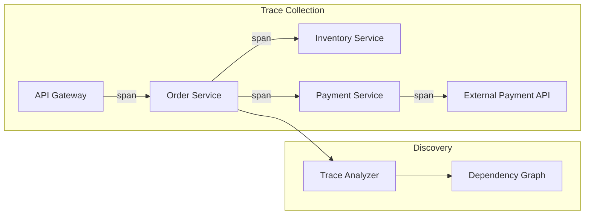
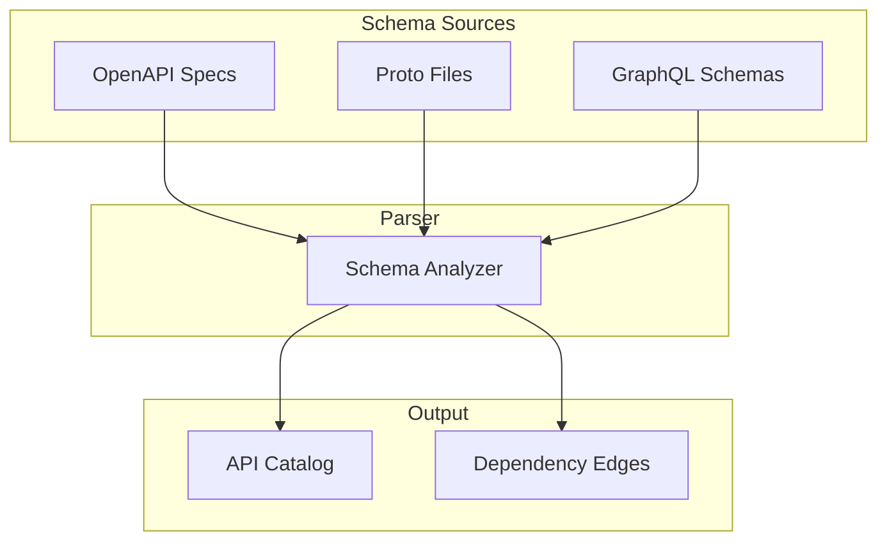
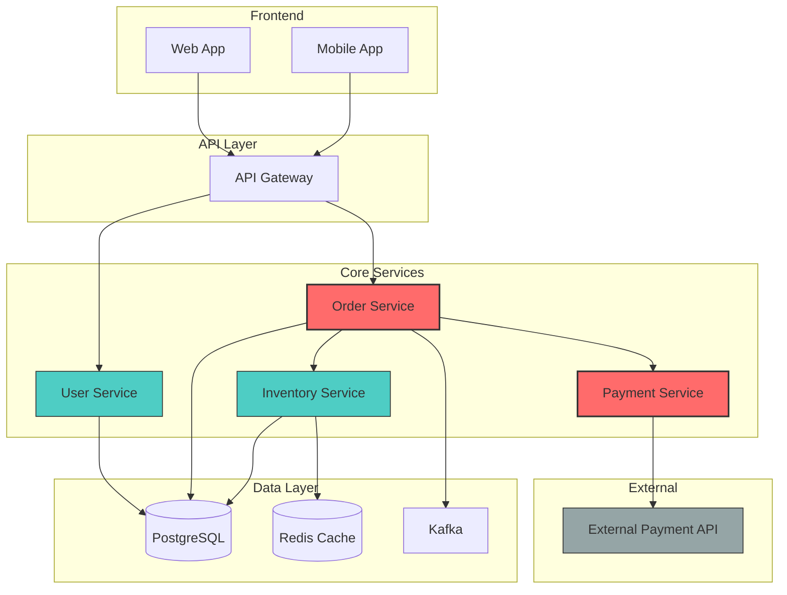
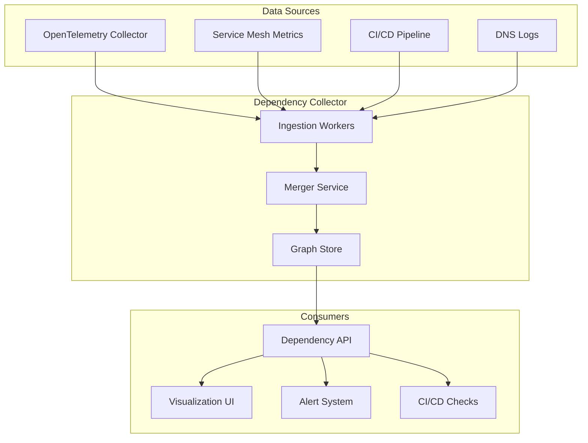
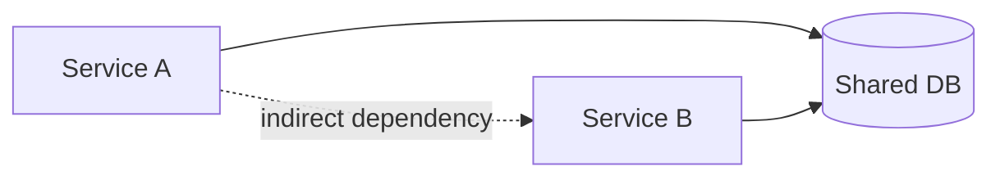

# How to Build Dependency Mapping

Author: [nawazdhandala](https://github.com/nawazdhandala)

Tags: Platform Engineering, Dependencies, Service Mesh, Observability

Description: Learn to implement dependency mapping for microservices with automatic discovery, visualization, and impact analysis for architecture understanding.

---

> Understanding how your services connect is the first step to understanding how they fail.

In modern distributed systems, services rarely exist in isolation. A single user request might traverse dozens of microservices, databases, message queues, and external APIs. When something breaks - and it will - the question "what depends on what?" becomes critical.

Dependency mapping is the practice of automatically discovering, documenting, and visualizing these relationships. Done well, it transforms your architecture from an opaque mystery into a queryable graph you can use for impact analysis, change planning, and incident response.

This guide walks through the core techniques for building dependency mapping into your platform engineering stack.

---

## Table of Contents

1. Why Dependency Mapping Matters
2. Discovery Methods
3. Building the Dependency Graph
4. Storing and Querying Dependencies
5. Visualization Techniques
6. Impact Analysis
7. Change Tracking and Drift Detection
8. Practical Implementation
9. Common Pitfalls
10. Putting It All Together

---

## 1. Why Dependency Mapping Matters

| Scenario | Without Dependency Map | With Dependency Map |
|----------|------------------------|---------------------|
| Incident triage | "What services might be affected?" - guessing | Immediate blast radius visualization |
| Planned maintenance | Manual Slack polling: "Does anyone use service X?" | Automated impact report with all consumers |
| Architecture review | Stale wiki diagrams | Live, queryable service topology |
| Security audit | Unknown data flow paths | Clear lineage from source to sink |
| Cost attribution | Services billed in isolation | Full dependency chain for accurate allocation |

The core value: dependency maps turn tribal knowledge into queryable data.

---

## 2. Discovery Methods

There are multiple approaches to discovering dependencies, each with different trade-offs. A robust platform typically combines several.

### 2.1 Trace-Based Discovery (Runtime)

Distributed tracing naturally captures service-to-service calls. By analyzing trace data, you can extract which services communicate.



**Pros:** Reflects actual runtime behavior, captures dynamic dependencies.
**Cons:** Only sees traffic that actually flows, requires instrumentation.

### 2.2 Service Mesh Sidecar Analysis

If you run Istio, Linkerd, or similar service mesh, sidecar proxies already intercept all traffic. Their metrics and logs are a goldmine.

```yaml
# Example: Extracting dependencies from Istio metrics
# Query Prometheus for source-destination pairs
- record: service_dependency
  expr: |
    sum by (source_workload, destination_workload) (
      rate(istio_requests_total[5m])
    ) > 0
```

**Pros:** Zero application instrumentation needed, comprehensive coverage.
**Cons:** Mesh overhead, only captures in-mesh traffic.

### 2.3 Static Analysis (Code and Config)

Parse import statements, Kubernetes manifests, Terraform files, and API schemas to extract dependencies without running anything.

```typescript
// Static dependency extractor - simplified example
interface Dependency {
  source: string;
  target: string;
  type: 'http' | 'grpc' | 'database' | 'queue' | 'import';
  file: string;
  line: number;
}

function extractFromKubernetes(manifests: KubeManifest[]): Dependency[] {
  const deps: Dependency[] = [];

  for (const manifest of manifests) {
    if (manifest.kind === 'Service') {
      // Extract service name
      const serviceName = manifest.metadata.name;

      // Find ConfigMaps/Secrets it references
      const envVars = manifest.spec?.template?.spec?.containers
        ?.flatMap(c => c.env || []) || [];

      for (const env of envVars) {
        if (env.valueFrom?.configMapKeyRef) {
          deps.push({
            source: serviceName,
            target: `configmap/${env.valueFrom.configMapKeyRef.name}`,
            type: 'import',
            file: manifest.sourceFile,
            line: manifest.sourceLine
          });
        }
      }
    }
  }
  return deps;
}
```

**Pros:** Works before deployment, catches unused code paths.
**Cons:** May include dead code, misses runtime-constructed URLs.

### 2.4 DNS and Network Flow Analysis

Monitor DNS queries and network connections at the infrastructure level.

```python
# Example: Extracting dependencies from DNS query logs
def extract_dns_dependencies(dns_logs: list[dict]) -> dict[str, set[str]]:
    """
    Build dependency map from DNS query logs.

    Each log entry contains:
    - source_pod: the pod making the query
    - query_name: the DNS name being resolved
    - timestamp: when the query occurred
    """
    dependencies = defaultdict(set)

    for log in dns_logs:
        source = extract_service_name(log['source_pod'])
        target = normalize_dns_name(log['query_name'])

        # Filter out noise (health checks to self, etc.)
        if source != target and is_internal_service(target):
            dependencies[source].add(target)

    return dict(dependencies)

def normalize_dns_name(name: str) -> str:
    """Convert k8s DNS to service name."""
    # payment-service.production.svc.cluster.local -> payment-service
    parts = name.split('.')
    if len(parts) >= 4 and parts[-2:] == ['cluster', 'local']:
        return parts[0]
    return name
```

**Pros:** Infrastructure-level visibility, no app changes needed.
**Cons:** Noisy, requires network access, misses non-DNS resolutions.

### 2.5 API Schema Analysis

Parse OpenAPI specs, GraphQL schemas, or gRPC proto files to understand declared interfaces.



---

## 3. Building the Dependency Graph

Once you have raw dependency data from multiple sources, you need to merge and model it as a graph.

### 3.1 Graph Data Model

```typescript
// Core types for dependency graph
interface ServiceNode {
  id: string;                    // Unique identifier (e.g., "payment-service")
  name: string;                  // Human-readable name
  type: 'service' | 'database' | 'queue' | 'external' | 'cache';
  metadata: {
    team: string;
    tier: 'critical' | 'standard' | 'experimental';
    repository: string;
    language: string;
    version: string;
  };
}

interface DependencyEdge {
  source: string;                // Source node ID
  target: string;                // Target node ID
  type: 'sync' | 'async' | 'data' | 'config';
  protocol: 'http' | 'grpc' | 'tcp' | 'amqp' | 'kafka';
  metadata: {
    discoveredBy: ('trace' | 'mesh' | 'static' | 'dns')[];
    lastSeen: Date;
    requestsPerSecond?: number;
    latencyP99?: number;
    errorRate?: number;
  };
}

interface DependencyGraph {
  nodes: Map<string, ServiceNode>;
  edges: DependencyEdge[];

  // Query methods
  getUpstream(nodeId: string): ServiceNode[];
  getDownstream(nodeId: string): ServiceNode[];
  getBlastRadius(nodeId: string, depth?: number): ServiceNode[];
  getCriticalPath(from: string, to: string): ServiceNode[];
}
```

### 3.2 Merging Multiple Discovery Sources

Different discovery methods may report the same dependency. Merge them intelligently:

```typescript
function mergeDependencies(
  traceDeps: DependencyEdge[],
  meshDeps: DependencyEdge[],
  staticDeps: DependencyEdge[]
): DependencyEdge[] {
  const merged = new Map<string, DependencyEdge>();

  // Helper to create unique key
  const edgeKey = (e: DependencyEdge) => `${e.source}->${e.target}:${e.protocol}`;

  // Process each source, combining metadata
  for (const deps of [traceDeps, meshDeps, staticDeps]) {
    for (const dep of deps) {
      const key = edgeKey(dep);
      const existing = merged.get(key);

      if (existing) {
        // Merge discovery sources
        existing.metadata.discoveredBy = [
          ...new Set([...existing.metadata.discoveredBy, ...dep.metadata.discoveredBy])
        ];
        // Take the most recent timestamp
        if (dep.metadata.lastSeen > existing.metadata.lastSeen) {
          existing.metadata.lastSeen = dep.metadata.lastSeen;
        }
        // Merge numeric metrics (prefer runtime data over static)
        if (dep.metadata.requestsPerSecond !== undefined) {
          existing.metadata.requestsPerSecond = dep.metadata.requestsPerSecond;
        }
      } else {
        merged.set(key, { ...dep });
      }
    }
  }

  return Array.from(merged.values());
}
```

### 3.3 Confidence Scoring

Not all discovered dependencies are equally reliable. Score them:

```typescript
function calculateConfidence(edge: DependencyEdge): number {
  let score = 0;

  // Multiple discovery sources increase confidence
  const sources = edge.metadata.discoveredBy;
  score += sources.length * 20;  // Up to 80 for 4 sources

  // Runtime evidence is more reliable than static
  if (sources.includes('trace') || sources.includes('mesh')) {
    score += 15;
  }

  // Recent observation increases confidence
  const daysSinceLastSeen =
    (Date.now() - edge.metadata.lastSeen.getTime()) / (1000 * 60 * 60 * 24);
  if (daysSinceLastSeen < 1) score += 20;
  else if (daysSinceLastSeen < 7) score += 10;
  else if (daysSinceLastSeen > 30) score -= 20;

  // Actual traffic is strong evidence
  if (edge.metadata.requestsPerSecond && edge.metadata.requestsPerSecond > 0) {
    score += 15;
  }

  return Math.max(0, Math.min(100, score));
}
```

---

## 4. Storing and Querying Dependencies

### 4.1 Storage Options

| Storage Type | Best For | Example |
|--------------|----------|---------|
| Graph Database | Complex traversals, path finding | Neo4j, Amazon Neptune |
| Relational + Recursive CTEs | Moderate complexity, existing Postgres | PostgreSQL |
| Document Store | Simple lookups, fast writes | MongoDB, Elasticsearch |
| Time-Series | Historical dependency tracking | InfluxDB, TimescaleDB |

### 4.2 PostgreSQL Schema

For most platforms, PostgreSQL with recursive queries handles dependency graphs well:

```sql
-- Core tables
CREATE TABLE services (
    id VARCHAR(255) PRIMARY KEY,
    name VARCHAR(255) NOT NULL,
    service_type VARCHAR(50) NOT NULL,
    team VARCHAR(255),
    tier VARCHAR(50),
    repository VARCHAR(500),
    metadata JSONB DEFAULT '{}',
    created_at TIMESTAMP DEFAULT NOW(),
    updated_at TIMESTAMP DEFAULT NOW()
);

CREATE TABLE dependencies (
    id SERIAL PRIMARY KEY,
    source_id VARCHAR(255) REFERENCES services(id),
    target_id VARCHAR(255) REFERENCES services(id),
    dependency_type VARCHAR(50) NOT NULL,
    protocol VARCHAR(50),
    discovered_by VARCHAR(50)[] DEFAULT '{}',
    confidence_score INTEGER DEFAULT 50,
    last_seen TIMESTAMP DEFAULT NOW(),
    requests_per_second DECIMAL(10,2),
    latency_p99_ms DECIMAL(10,2),
    error_rate DECIMAL(5,4),
    metadata JSONB DEFAULT '{}',
    created_at TIMESTAMP DEFAULT NOW(),
    updated_at TIMESTAMP DEFAULT NOW(),
    UNIQUE(source_id, target_id, protocol)
);

-- Indexes for common queries
CREATE INDEX idx_dependencies_source ON dependencies(source_id);
CREATE INDEX idx_dependencies_target ON dependencies(target_id);
CREATE INDEX idx_dependencies_last_seen ON dependencies(last_seen);
CREATE INDEX idx_services_team ON services(team);
```

### 4.3 Recursive Query for Blast Radius

Find all services affected by a failure (downstream dependencies):

```sql
-- Get all services that depend on a given service (blast radius)
WITH RECURSIVE blast_radius AS (
    -- Base case: direct dependents
    SELECT
        d.source_id as service_id,
        d.target_id as depends_on,
        1 as depth,
        ARRAY[d.source_id] as path
    FROM dependencies d
    WHERE d.target_id = 'payment-service'

    UNION ALL

    -- Recursive case: dependents of dependents
    SELECT
        d.source_id,
        d.target_id,
        br.depth + 1,
        br.path || d.source_id
    FROM dependencies d
    INNER JOIN blast_radius br ON d.target_id = br.service_id
    WHERE NOT d.source_id = ANY(br.path)  -- Prevent cycles
      AND br.depth < 5  -- Limit depth
)
SELECT DISTINCT
    s.id,
    s.name,
    s.team,
    s.tier,
    MIN(br.depth) as distance
FROM blast_radius br
JOIN services s ON s.id = br.service_id
GROUP BY s.id, s.name, s.team, s.tier
ORDER BY distance, s.tier DESC;
```

---

## 5. Visualization Techniques

### 5.1 Service Topology Map



### 5.2 Implementing Interactive Visualization

```typescript
// React component for dependency visualization using D3
import * as d3 from 'd3';
import { useEffect, useRef } from 'react';

interface GraphVisualizerProps {
  nodes: ServiceNode[];
  edges: DependencyEdge[];
  highlightedNode?: string;
  onNodeClick: (nodeId: string) => void;
}

function DependencyGraphVisualizer({
  nodes,
  edges,
  highlightedNode,
  onNodeClick
}: GraphVisualizerProps) {
  const svgRef = useRef<SVGSVGElement>(null);

  useEffect(() => {
    if (!svgRef.current) return;

    const svg = d3.select(svgRef.current);
    const width = 800;
    const height = 600;

    // Clear previous render
    svg.selectAll('*').remove();

    // Create force simulation
    const simulation = d3.forceSimulation(nodes as any)
      .force('link', d3.forceLink(edges)
        .id((d: any) => d.id)
        .distance(100))
      .force('charge', d3.forceManyBody().strength(-300))
      .force('center', d3.forceCenter(width / 2, height / 2));

    // Draw edges
    const link = svg.append('g')
      .selectAll('line')
      .data(edges)
      .enter()
      .append('line')
      .attr('stroke', d => getEdgeColor(d))
      .attr('stroke-width', d => Math.sqrt(d.metadata.requestsPerSecond || 1));

    // Draw nodes
    const node = svg.append('g')
      .selectAll('circle')
      .data(nodes)
      .enter()
      .append('circle')
      .attr('r', d => getNodeRadius(d))
      .attr('fill', d => getNodeColor(d, highlightedNode))
      .on('click', (event, d) => onNodeClick(d.id))
      .call(d3.drag()
        .on('start', dragStarted)
        .on('drag', dragged)
        .on('end', dragEnded) as any);

    // Add labels
    const label = svg.append('g')
      .selectAll('text')
      .data(nodes)
      .enter()
      .append('text')
      .text(d => d.name)
      .attr('font-size', 12)
      .attr('dx', 15)
      .attr('dy', 4);

    // Update positions on tick
    simulation.on('tick', () => {
      link
        .attr('x1', (d: any) => d.source.x)
        .attr('y1', (d: any) => d.source.y)
        .attr('x2', (d: any) => d.target.x)
        .attr('y2', (d: any) => d.target.y);

      node
        .attr('cx', (d: any) => d.x)
        .attr('cy', (d: any) => d.y);

      label
        .attr('x', (d: any) => d.x)
        .attr('y', (d: any) => d.y);
    });

    function dragStarted(event: any) {
      if (!event.active) simulation.alphaTarget(0.3).restart();
      event.subject.fx = event.subject.x;
      event.subject.fy = event.subject.y;
    }

    function dragged(event: any) {
      event.subject.fx = event.x;
      event.subject.fy = event.y;
    }

    function dragEnded(event: any) {
      if (!event.active) simulation.alphaTarget(0);
      event.subject.fx = null;
      event.subject.fy = null;
    }
  }, [nodes, edges, highlightedNode, onNodeClick]);

  return <svg ref={svgRef} width={800} height={600} />;
}

function getNodeColor(node: ServiceNode, highlighted?: string): string {
  if (highlighted === node.id) return '#ff6b6b';
  switch (node.metadata.tier) {
    case 'critical': return '#e74c3c';
    case 'standard': return '#3498db';
    case 'experimental': return '#95a5a6';
    default: return '#bdc3c7';
  }
}

function getNodeRadius(node: ServiceNode): number {
  switch (node.type) {
    case 'service': return 20;
    case 'database': return 25;
    case 'queue': return 18;
    case 'external': return 15;
    default: return 15;
  }
}

function getEdgeColor(edge: DependencyEdge): string {
  if (edge.metadata.errorRate && edge.metadata.errorRate > 0.01) return '#e74c3c';
  if (edge.type === 'async') return '#9b59b6';
  return '#95a5a6';
}
```

---

## 6. Impact Analysis

### 6.1 Blast Radius Calculation

When a service fails, what is affected?

```typescript
interface ImpactReport {
  failedService: string;
  directlyAffected: ServiceNode[];
  transitivelyAffected: ServiceNode[];
  criticalPathsBlocked: string[][];
  estimatedUserImpact: 'none' | 'partial' | 'major' | 'complete';
  affectedTeams: string[];
}

function analyzeImpact(
  graph: DependencyGraph,
  failedServiceId: string
): ImpactReport {
  const failedService = graph.nodes.get(failedServiceId);
  if (!failedService) throw new Error(`Unknown service: ${failedServiceId}`);

  // Get direct dependents (services that call the failed service)
  const directlyAffected = graph.getUpstream(failedServiceId);

  // Get transitive dependents (full blast radius)
  const transitivelyAffected = graph.getBlastRadius(failedServiceId, 5);

  // Identify blocked critical paths
  const criticalPathsBlocked: string[][] = [];
  const entryPoints = findEntryPoints(graph);

  for (const entry of entryPoints) {
    const paths = findAllPaths(graph, entry.id, failedServiceId);
    if (paths.length > 0) {
      criticalPathsBlocked.push(...paths.map(p => p.map(n => n.id)));
    }
  }

  // Estimate user impact
  const hasEntryPointAffected = transitivelyAffected.some(
    s => s.type === 'service' && isEntryPoint(graph, s.id)
  );
  const criticalAffected = transitivelyAffected.filter(
    s => s.metadata.tier === 'critical'
  );

  let estimatedUserImpact: ImpactReport['estimatedUserImpact'];
  if (hasEntryPointAffected && criticalAffected.length > 2) {
    estimatedUserImpact = 'complete';
  } else if (hasEntryPointAffected || criticalAffected.length > 0) {
    estimatedUserImpact = 'major';
  } else if (directlyAffected.length > 0) {
    estimatedUserImpact = 'partial';
  } else {
    estimatedUserImpact = 'none';
  }

  // Collect affected teams
  const affectedTeams = [...new Set(
    transitivelyAffected.map(s => s.metadata.team).filter(Boolean)
  )];

  return {
    failedService: failedServiceId,
    directlyAffected,
    transitivelyAffected,
    criticalPathsBlocked,
    estimatedUserImpact,
    affectedTeams
  };
}

function findEntryPoints(graph: DependencyGraph): ServiceNode[] {
  // Entry points are services with no upstream dependencies
  return Array.from(graph.nodes.values()).filter(node => {
    const upstream = graph.getUpstream(node.id);
    return upstream.length === 0 && node.type === 'service';
  });
}

function isEntryPoint(graph: DependencyGraph, nodeId: string): boolean {
  return graph.getUpstream(nodeId).length === 0;
}
```

### 6.2 Pre-Deployment Impact Assessment

Before deploying changes, assess what might break:

```typescript
interface DeploymentRisk {
  service: string;
  riskLevel: 'low' | 'medium' | 'high' | 'critical';
  reasons: string[];
  affectedServices: number;
  affectedCriticalServices: number;
  recommendations: string[];
}

function assessDeploymentRisk(
  graph: DependencyGraph,
  serviceId: string,
  changeType: 'code' | 'config' | 'schema' | 'api'
): DeploymentRisk {
  const service = graph.nodes.get(serviceId);
  if (!service) throw new Error(`Unknown service: ${serviceId}`);

  const reasons: string[] = [];
  const recommendations: string[] = [];

  // Get all services that depend on this one
  const dependents = graph.getBlastRadius(serviceId, 3);
  const criticalDependents = dependents.filter(
    s => s.metadata.tier === 'critical'
  );

  // Assess base risk from change type
  let riskScore = 0;
  switch (changeType) {
    case 'schema':
      riskScore += 40;
      reasons.push('Schema changes can break downstream consumers');
      recommendations.push('Ensure backward compatibility');
      recommendations.push('Consider versioned migrations');
      break;
    case 'api':
      riskScore += 35;
      reasons.push('API changes affect all consumers');
      recommendations.push('Deploy with feature flags');
      recommendations.push('Notify dependent teams');
      break;
    case 'code':
      riskScore += 20;
      break;
    case 'config':
      riskScore += 15;
      break;
  }

  // Factor in blast radius
  if (dependents.length > 10) {
    riskScore += 20;
    reasons.push(`${dependents.length} services in blast radius`);
  } else if (dependents.length > 5) {
    riskScore += 10;
  }

  // Factor in critical dependencies
  if (criticalDependents.length > 0) {
    riskScore += 25;
    reasons.push(
      `${criticalDependents.length} critical services depend on this`
    );
    recommendations.push('Schedule deployment during low-traffic window');
    recommendations.push('Prepare rollback procedure');
  }

  // Factor in service tier
  if (service.metadata.tier === 'critical') {
    riskScore += 15;
    reasons.push('This is a critical tier service');
  }

  // Determine risk level
  let riskLevel: DeploymentRisk['riskLevel'];
  if (riskScore >= 70) riskLevel = 'critical';
  else if (riskScore >= 50) riskLevel = 'high';
  else if (riskScore >= 30) riskLevel = 'medium';
  else riskLevel = 'low';

  return {
    service: serviceId,
    riskLevel,
    reasons,
    affectedServices: dependents.length,
    affectedCriticalServices: criticalDependents.length,
    recommendations
  };
}
```

---

## 7. Change Tracking and Drift Detection

### 7.1 Storing Historical Snapshots

Track how dependencies evolve over time:

```sql
-- Table for historical snapshots
CREATE TABLE dependency_snapshots (
    id SERIAL PRIMARY KEY,
    snapshot_time TIMESTAMP DEFAULT NOW(),
    source_id VARCHAR(255) NOT NULL,
    target_id VARCHAR(255) NOT NULL,
    protocol VARCHAR(50),
    requests_per_second DECIMAL(10,2),
    latency_p99_ms DECIMAL(10,2),
    error_rate DECIMAL(5,4)
);

CREATE INDEX idx_snapshots_time ON dependency_snapshots(snapshot_time);
CREATE INDEX idx_snapshots_source ON dependency_snapshots(source_id);

-- Function to capture current state
CREATE OR REPLACE FUNCTION capture_dependency_snapshot()
RETURNS void AS $$
BEGIN
    INSERT INTO dependency_snapshots
        (source_id, target_id, protocol, requests_per_second, latency_p99_ms, error_rate)
    SELECT
        source_id,
        target_id,
        protocol,
        requests_per_second,
        latency_p99_ms,
        error_rate
    FROM dependencies
    WHERE last_seen > NOW() - INTERVAL '1 day';
END;
$$ LANGUAGE plpgsql;

-- Query to detect new dependencies in the last week
SELECT DISTINCT d.source_id, d.target_id, d.protocol
FROM dependencies d
WHERE d.created_at > NOW() - INTERVAL '7 days'
AND NOT EXISTS (
    SELECT 1 FROM dependency_snapshots s
    WHERE s.source_id = d.source_id
    AND s.target_id = d.target_id
    AND s.snapshot_time < d.created_at
);
```

### 7.2 Drift Detection

Identify unexpected changes in the dependency graph:

```typescript
interface DriftReport {
  newDependencies: DependencyEdge[];
  removedDependencies: DependencyEdge[];
  changedDependencies: {
    edge: DependencyEdge;
    changes: {
      field: string;
      oldValue: any;
      newValue: any;
    }[];
  }[];
  unexpectedPatterns: string[];
}

async function detectDrift(
  db: Database,
  sinceTimestamp: Date
): Promise<DriftReport> {
  // Get current dependencies
  const current = await db.query<DependencyEdge>(
    'SELECT * FROM dependencies WHERE last_seen > NOW() - INTERVAL \'1 day\''
  );

  // Get previous snapshot
  const previous = await db.query<DependencyEdge>(
    `SELECT DISTINCT ON (source_id, target_id, protocol) *
     FROM dependency_snapshots
     WHERE snapshot_time < $1
     ORDER BY source_id, target_id, protocol, snapshot_time DESC`,
    [sinceTimestamp]
  );

  const currentMap = new Map(current.map(d => [edgeKey(d), d]));
  const previousMap = new Map(previous.map(d => [edgeKey(d), d]));

  const newDependencies: DependencyEdge[] = [];
  const removedDependencies: DependencyEdge[] = [];
  const changedDependencies: DriftReport['changedDependencies'] = [];

  // Find new dependencies
  for (const [key, edge] of currentMap) {
    if (!previousMap.has(key)) {
      newDependencies.push(edge);
    }
  }

  // Find removed dependencies
  for (const [key, edge] of previousMap) {
    if (!currentMap.has(key)) {
      removedDependencies.push(edge);
    }
  }

  // Find changed dependencies
  for (const [key, current] of currentMap) {
    const prev = previousMap.get(key);
    if (prev) {
      const changes = detectEdgeChanges(prev, current);
      if (changes.length > 0) {
        changedDependencies.push({ edge: current, changes });
      }
    }
  }

  // Detect unexpected patterns
  const unexpectedPatterns = detectUnexpectedPatterns(current);

  return {
    newDependencies,
    removedDependencies,
    changedDependencies,
    unexpectedPatterns
  };
}

function detectUnexpectedPatterns(edges: DependencyEdge[]): string[] {
  const patterns: string[] = [];

  // Check for circular dependencies
  const graph = buildAdjacencyList(edges);
  const cycles = findCycles(graph);
  for (const cycle of cycles) {
    patterns.push(`Circular dependency detected: ${cycle.join(' -> ')}`);
  }

  // Check for direct database access from frontend
  for (const edge of edges) {
    if (edge.source.includes('frontend') && edge.target.includes('database')) {
      patterns.push(
        `Direct database access from frontend: ${edge.source} -> ${edge.target}`
      );
    }
  }

  // Check for too many direct dependencies
  const dependencyCount = new Map<string, number>();
  for (const edge of edges) {
    dependencyCount.set(
      edge.source,
      (dependencyCount.get(edge.source) || 0) + 1
    );
  }
  for (const [service, count] of dependencyCount) {
    if (count > 15) {
      patterns.push(
        `Service ${service} has ${count} direct dependencies (potential god service)`
      );
    }
  }

  return patterns;
}
```

### 7.3 Change Notifications

Alert teams when their dependencies change:

```typescript
interface DependencyChangeEvent {
  type: 'added' | 'removed' | 'modified';
  edge: DependencyEdge;
  timestamp: Date;
  affectedTeams: string[];
}

async function notifyDependencyChanges(
  events: DependencyChangeEvent[],
  notificationService: NotificationService
) {
  // Group by affected team
  const byTeam = new Map<string, DependencyChangeEvent[]>();

  for (const event of events) {
    for (const team of event.affectedTeams) {
      if (!byTeam.has(team)) byTeam.set(team, []);
      byTeam.get(team)!.push(event);
    }
  }

  // Send notifications
  for (const [team, teamEvents] of byTeam) {
    const added = teamEvents.filter(e => e.type === 'added');
    const removed = teamEvents.filter(e => e.type === 'removed');

    const message = formatChangeNotification(team, added, removed);

    await notificationService.sendToTeam(team, {
      channel: 'dependency-changes',
      title: `Dependency Changes Affecting ${team}`,
      body: message,
      priority: removed.length > 0 ? 'high' : 'normal'
    });
  }
}

function formatChangeNotification(
  team: string,
  added: DependencyChangeEvent[],
  removed: DependencyChangeEvent[]
): string {
  let message = `## Dependency Changes for ${team}\n\n`;

  if (added.length > 0) {
    message += `### New Dependencies\n`;
    for (const e of added) {
      message += `- ${e.edge.source} now depends on ${e.edge.target}\n`;
    }
  }

  if (removed.length > 0) {
    message += `### Removed Dependencies\n`;
    for (const e of removed) {
      message += `- ${e.edge.source} no longer depends on ${e.edge.target}\n`;
    }
    message += `\n**Action Required:** Verify these removals are intentional.\n`;
  }

  return message;
}
```

---

## 8. Practical Implementation

### 8.1 Collector Service Architecture



### 8.2 OpenTelemetry Processor for Dependency Extraction

```typescript
// Custom OpenTelemetry processor to extract dependencies from spans
import {
  SpanProcessor,
  ReadableSpan
} from '@opentelemetry/sdk-trace-base';

interface ExtractedDependency {
  source: string;
  target: string;
  protocol: string;
  timestamp: Date;
}

class DependencyExtractorProcessor implements SpanProcessor {
  private dependencies: ExtractedDependency[] = [];
  private batchSize = 100;
  private flushInterval = 10000; // 10 seconds

  constructor(private dependencyService: DependencyService) {
    setInterval(() => this.flush(), this.flushInterval);
  }

  onStart(): void {
    // No action needed on span start
  }

  onEnd(span: ReadableSpan): void {
    const dep = this.extractDependency(span);
    if (dep) {
      this.dependencies.push(dep);
      if (this.dependencies.length >= this.batchSize) {
        this.flush();
      }
    }
  }

  private extractDependency(span: ReadableSpan): ExtractedDependency | null {
    const attrs = span.attributes;

    // Extract HTTP client calls
    if (span.kind === 2 && attrs['http.url']) { // SpanKind.CLIENT = 2
      const url = new URL(attrs['http.url'] as string);
      const source = span.resource.attributes['service.name'] as string;
      const target = this.resolveServiceFromHost(url.hostname);

      if (source && target && source !== target) {
        return {
          source,
          target,
          protocol: 'http',
          timestamp: new Date(span.startTime[0] * 1000)
        };
      }
    }

    // Extract database calls
    if (attrs['db.system']) {
      const source = span.resource.attributes['service.name'] as string;
      const dbName = attrs['db.name'] as string;
      const dbSystem = attrs['db.system'] as string;

      if (source && dbName) {
        return {
          source,
          target: `${dbSystem}:${dbName}`,
          protocol: dbSystem,
          timestamp: new Date(span.startTime[0] * 1000)
        };
      }
    }

    // Extract messaging calls
    if (attrs['messaging.system']) {
      const source = span.resource.attributes['service.name'] as string;
      const destination = attrs['messaging.destination'] as string;
      const system = attrs['messaging.system'] as string;

      if (source && destination) {
        return {
          source,
          target: `${system}:${destination}`,
          protocol: system,
          timestamp: new Date(span.startTime[0] * 1000)
        };
      }
    }

    return null;
  }

  private resolveServiceFromHost(hostname: string): string {
    // Strip k8s DNS suffixes
    // payment-service.default.svc.cluster.local -> payment-service
    const parts = hostname.split('.');
    if (parts.length >= 4 && parts.slice(-2).join('.') === 'cluster.local') {
      return parts[0];
    }
    return hostname;
  }

  private async flush(): Promise<void> {
    if (this.dependencies.length === 0) return;

    const batch = this.dependencies.splice(0, this.dependencies.length);
    await this.dependencyService.ingestBatch(batch);
  }

  async shutdown(): Promise<void> {
    await this.flush();
  }

  async forceFlush(): Promise<void> {
    await this.flush();
  }
}
```

### 8.3 API Endpoints

```typescript
// Express API for dependency queries
import express from 'express';

const app = express();

// Get all dependencies for a service
app.get('/api/services/:serviceId/dependencies', async (req, res) => {
  const { serviceId } = req.params;
  const { direction = 'both', depth = 1 } = req.query;

  const graph = await dependencyStore.getGraph();

  let result;
  if (direction === 'upstream') {
    result = graph.getUpstream(serviceId);
  } else if (direction === 'downstream') {
    result = graph.getDownstream(serviceId);
  } else {
    result = {
      upstream: graph.getUpstream(serviceId),
      downstream: graph.getDownstream(serviceId)
    };
  }

  res.json(result);
});

// Get blast radius for a service
app.get('/api/services/:serviceId/blast-radius', async (req, res) => {
  const { serviceId } = req.params;
  const { depth = 3 } = req.query;

  const graph = await dependencyStore.getGraph();
  const affected = graph.getBlastRadius(serviceId, Number(depth));

  res.json({
    service: serviceId,
    affectedServices: affected,
    count: affected.length,
    criticalCount: affected.filter(s => s.metadata.tier === 'critical').length
  });
});

// Assess deployment risk
app.post('/api/deployments/assess-risk', async (req, res) => {
  const { serviceId, changeType } = req.body;

  const graph = await dependencyStore.getGraph();
  const risk = assessDeploymentRisk(graph, serviceId, changeType);

  res.json(risk);
});

// Get full graph for visualization
app.get('/api/graph', async (req, res) => {
  const { team, tier } = req.query;

  let graph = await dependencyStore.getGraph();

  // Apply filters
  if (team) {
    graph = filterGraphByTeam(graph, team as string);
  }
  if (tier) {
    graph = filterGraphByTier(graph, tier as string);
  }

  res.json({
    nodes: Array.from(graph.nodes.values()),
    edges: graph.edges
  });
});

// Get drift report
app.get('/api/drift', async (req, res) => {
  const { since = '7d' } = req.query;
  const sinceDate = parseDuration(since as string);

  const drift = await detectDrift(db, sinceDate);

  res.json(drift);
});
```

---

## 9. Common Pitfalls

### 9.1 Over-Trusting Static Analysis

Static analysis finds what code *could* call, not what it *does* call. Feature flags, environment-specific configs, and dead code all create false positives.

**Solution:** Use static analysis for initial discovery, but validate with runtime data. Mark dependencies as "potential" until confirmed by traces or mesh metrics.

### 9.2 Ignoring Indirect Dependencies

A service may depend on another through shared infrastructure (same database, same cache cluster) without direct calls.



**Solution:** Include data dependencies in your model. Track which services read/write to which tables or cache keys.

### 9.3 Stale Data

Dependencies change constantly. A map from last month is already wrong.

**Solution:**
- Continuous ingestion from runtime sources
- TTL on dependency edges (remove if not seen in X days)
- Visual indicators for staleness

### 9.4 Too Much Granularity

Tracking every function call as a dependency creates noise that obscures real architectural relationships.

**Solution:** Focus on service-to-service boundaries. Internal function calls are spans, not dependencies.

### 9.5 Missing External Dependencies

Third-party APIs, SaaS services, and cloud provider services are easy to overlook.

**Solution:** Instrument all outbound HTTP calls. Maintain a registry of known external endpoints and map them to logical service names.

---

## 10. Putting It All Together

A complete dependency mapping system combines:

1. **Multi-source discovery** - traces, mesh, static analysis, DNS
2. **Unified graph model** - nodes (services) + edges (dependencies)
3. **Confidence scoring** - weight evidence from different sources
4. **Historical tracking** - detect drift over time
5. **Impact analysis** - blast radius, risk assessment
6. **Visualization** - interactive topology maps
7. **Integration** - CI/CD checks, incident response, change management

### Implementation Checklist

```
[ ] Instrument services with OpenTelemetry
[ ] Deploy trace collector with dependency extraction
[ ] Set up dependency database (PostgreSQL or graph DB)
[ ] Build API for querying dependencies
[ ] Create visualization UI
[ ] Integrate with CI/CD for pre-deploy checks
[ ] Set up drift detection alerts
[ ] Document ownership and update process
[ ] Train teams on using impact analysis
```

### Maturity Levels

| Level | Capabilities |
|-------|--------------|
| 1 - Manual | Wiki diagrams, manual updates |
| 2 - Discovered | Automatic discovery from traces |
| 3 - Unified | Multiple sources merged, confidence scores |
| 4 - Actionable | Impact analysis, CI/CD integration |
| 5 - Predictive | Drift detection, anomaly alerting, automated governance |

---

## Summary

| Challenge | Solution |
|-----------|----------|
| Unknown dependencies | Multi-source discovery (traces, mesh, static, DNS) |
| Stale documentation | Continuous automated ingestion |
| Incident blast radius | Graph traversal with impact scoring |
| Risky deployments | Pre-deploy dependency checks |
| Architecture drift | Historical snapshots and diff alerts |

Dependency mapping transforms your architecture from folklore into queryable fact. Start with trace-based discovery, add confidence scoring, and build toward full impact analysis. The investment pays off every time you need to answer "what breaks if X fails?" - and in distributed systems, that question comes up constantly.

---

*Want to see your service dependencies visualized? [OneUptime](https://oneuptime.com) provides automatic service discovery and dependency mapping powered by OpenTelemetry, helping you understand your architecture and respond to incidents faster.*

---

### See Also

- [Three Pillars of Observability: Logs, Metrics, Traces](/blog/post/2025-08-20-three-pillars-of-observability-logs-metrics-traces/) - Understand the telemetry that powers dependency discovery.
- [What are Traces and Spans in OpenTelemetry](/blog/post/2025-08-27-traces-and-spans-in-opentelemetry/) - Deep dive into the tracing concepts used for dependency mapping.
- [SRE Best Practices](/blog/post/2025-11-28-sre-best-practices/) - How dependency mapping fits into broader reliability engineering.
