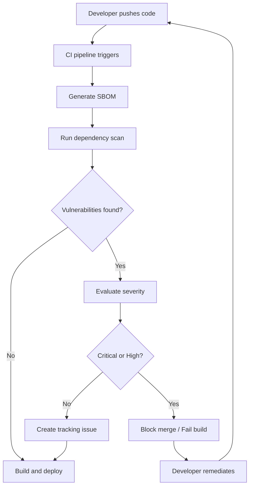
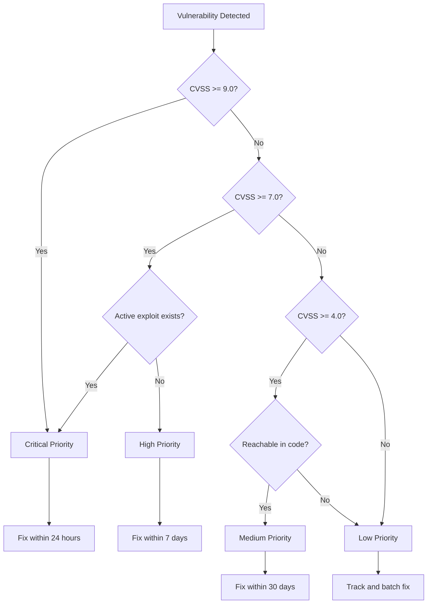

# How to Create Dependency Scanning Integration

Author: [nawazdhandala](https://github.com/nawazdhandala)

Tags: Testing, Security, SCA, Dependencies

Description: A complete guide to integrating dependency scanning into your CI/CD pipeline to catch vulnerable dependencies before they reach production.

---

Modern applications rely on hundreds of third-party packages. Each dependency is a potential attack vector. Dependency scanning, also known as Software Composition Analysis (SCA), automatically detects known vulnerabilities in your supply chain. This guide covers the tools, workflows, and automation needed to secure your dependencies at scale.

## Why Dependency Scanning Matters

A single vulnerable transitive dependency can expose your entire application. High-profile breaches like Log4Shell (CVE-2021-44228) demonstrated how a library buried deep in your dependency tree can bring down organizations overnight. Manual audits cannot keep pace with the volume of CVEs published daily. Automated scanning integrated into CI/CD catches issues before they merge.

## The Dependency Scanning Workflow

Here is how a typical dependency scanning pipeline operates:



The key stages are:
1. Generate a Software Bill of Materials (SBOM) listing all dependencies
2. Scan the SBOM against vulnerability databases
3. Prioritize findings by severity and exploitability
4. Block or warn based on policy thresholds
5. Automate remediation where possible

## Popular Dependency Scanning Tools

### Snyk

Snyk offers deep integration with package managers and provides fix recommendations. It scans your code, containers, and infrastructure as code.

```yaml
# .github/workflows/snyk.yml
# GitHub Actions workflow for Snyk dependency scanning
name: Snyk Security Scan

on:
  push:
    branches: [main]
  pull_request:
    branches: [main]
  # Run daily at midnight to catch newly disclosed vulnerabilities
  schedule:
    - cron: '0 0 * * *'

jobs:
  snyk:
    runs-on: ubuntu-latest
    steps:
      # Check out the repository code
      - uses: actions/checkout@v4

      # Set up Node.js for npm projects (adjust for your language)
      - name: Set up Node.js
        uses: actions/setup-node@v4
        with:
          node-version: '20'
          cache: 'npm'

      # Install dependencies so Snyk can analyze the lock file
      - name: Install dependencies
        run: npm ci

      # Run Snyk test to check for vulnerabilities
      # --severity-threshold=high: Only fail on high or critical issues
      # --fail-on=upgradable: Only fail if a fix is available
      - name: Run Snyk to check for vulnerabilities
        uses: snyk/actions/node@master
        env:
          SNYK_TOKEN: ${{ secrets.SNYK_TOKEN }}
        with:
          args: --severity-threshold=high --fail-on=upgradable

      # Upload results to GitHub Security tab for visibility
      - name: Upload Snyk results to GitHub Code Scanning
        uses: github/codeql-action/upload-sarif@v3
        if: always()
        with:
          sarif_file: snyk.sarif
```

### GitHub Dependabot

Dependabot is built into GitHub and automatically creates pull requests to update vulnerable dependencies.

```yaml
# .github/dependabot.yml
# Configuration for GitHub Dependabot automatic updates
version: 2
updates:
  # Enable updates for npm packages
  - package-ecosystem: "npm"
    directory: "/"
    schedule:
      # Check for updates weekly on Monday
      interval: "weekly"
      day: "monday"
      time: "09:00"
      timezone: "America/New_York"
    # Limit the number of open PRs to avoid overwhelming reviewers
    open-pull-requests-limit: 10
    # Group minor and patch updates to reduce PR noise
    groups:
      # Group all production dependency updates together
      production-dependencies:
        dependency-type: "production"
        update-types:
          - "minor"
          - "patch"
      # Group all dev dependency updates together
      development-dependencies:
        dependency-type: "development"
        update-types:
          - "minor"
          - "patch"
    # Automatically add labels and reviewers
    labels:
      - "dependencies"
      - "security"
    reviewers:
      - "security-team"
    # Commit message configuration
    commit-message:
      prefix: "chore(deps):"

  # Enable updates for Docker base images
  - package-ecosystem: "docker"
    directory: "/"
    schedule:
      interval: "weekly"
    labels:
      - "dependencies"
      - "docker"

  # Enable updates for GitHub Actions
  - package-ecosystem: "github-actions"
    directory: "/"
    schedule:
      interval: "weekly"
    labels:
      - "dependencies"
      - "ci"
```

### Trivy

Trivy is an open-source scanner that handles dependencies, container images, and infrastructure as code in one tool.

```yaml
# .github/workflows/trivy.yml
# GitHub Actions workflow for Trivy vulnerability scanning
name: Trivy Security Scan

on:
  push:
    branches: [main]
  pull_request:
    branches: [main]

jobs:
  trivy-fs-scan:
    name: Scan filesystem for vulnerabilities
    runs-on: ubuntu-latest
    steps:
      - uses: actions/checkout@v4

      # Scan the repository filesystem for vulnerable dependencies
      # This checks package.json, requirements.txt, go.mod, etc.
      - name: Run Trivy filesystem scan
        uses: aquasecurity/trivy-action@master
        with:
          scan-type: 'fs'
          # Scan the current directory
          scan-ref: '.'
          # Output format compatible with GitHub Security tab
          format: 'sarif'
          output: 'trivy-fs-results.sarif'
          # Only report high and critical vulnerabilities
          severity: 'HIGH,CRITICAL'
          # Ignore unfixed vulnerabilities (no patch available yet)
          ignore-unfixed: true

      # Upload results to GitHub Security tab
      - name: Upload Trivy scan results
        uses: github/codeql-action/upload-sarif@v3
        with:
          sarif_file: 'trivy-fs-results.sarif'

  trivy-image-scan:
    name: Scan container image for vulnerabilities
    runs-on: ubuntu-latest
    steps:
      - uses: actions/checkout@v4

      # Build the Docker image for scanning
      - name: Build Docker image
        run: docker build -t myapp:${{ github.sha }} .

      # Scan the built container image
      - name: Run Trivy image scan
        uses: aquasecurity/trivy-action@master
        with:
          scan-type: 'image'
          image-ref: 'myapp:${{ github.sha }}'
          format: 'sarif'
          output: 'trivy-image-results.sarif'
          severity: 'HIGH,CRITICAL'
          # Exit with error code 1 if vulnerabilities found
          exit-code: '1'

      - name: Upload Trivy image scan results
        uses: github/codeql-action/upload-sarif@v3
        if: always()
        with:
          sarif_file: 'trivy-image-results.sarif'
```

## Generating and Analyzing SBOMs

A Software Bill of Materials (SBOM) is a complete inventory of all components in your software. SBOMs enable vulnerability tracking, license compliance, and supply chain transparency.

### Generating SBOMs with Syft

```bash
#!/bin/bash
# generate-sbom.sh
# Script to generate SBOMs in multiple formats using Syft

set -euo pipefail

# Define the target to scan (directory, image, or archive)
TARGET="${1:-.}"
OUTPUT_DIR="./sbom-output"

# Create output directory if it does not exist
mkdir -p "$OUTPUT_DIR"

# Generate SBOM in CycloneDX format (widely supported by security tools)
# CycloneDX is an OWASP standard for SBOMs
syft "$TARGET" \
  --output cyclonedx-json="$OUTPUT_DIR/sbom-cyclonedx.json" \
  --output cyclonedx-xml="$OUTPUT_DIR/sbom-cyclonedx.xml"

# Generate SBOM in SPDX format (ISO standard, required for some compliance)
# SPDX is a Linux Foundation standard
syft "$TARGET" \
  --output spdx-json="$OUTPUT_DIR/sbom-spdx.json"

# Generate human-readable table output for quick review
syft "$TARGET" \
  --output table="$OUTPUT_DIR/sbom-table.txt"

echo "SBOMs generated in $OUTPUT_DIR"
echo "Files created:"
ls -la "$OUTPUT_DIR"
```

### Analyzing SBOMs for Vulnerabilities

```bash
#!/bin/bash
# scan-sbom.sh
# Script to scan an existing SBOM for vulnerabilities using Grype

set -euo pipefail

SBOM_FILE="${1:-./sbom-output/sbom-cyclonedx.json}"
OUTPUT_FORMAT="${2:-table}"

# Validate SBOM file exists
if [[ ! -f "$SBOM_FILE" ]]; then
  echo "Error: SBOM file not found: $SBOM_FILE"
  exit 1
fi

# Scan the SBOM with Grype vulnerability scanner
# --fail-on: Exit with error if vulnerabilities of this severity or higher exist
# --only-fixed: Only report vulnerabilities that have a fix available
grype sbom:"$SBOM_FILE" \
  --output "$OUTPUT_FORMAT" \
  --fail-on high \
  --only-fixed

# Exit code meanings:
# 0: No vulnerabilities found meeting the threshold
# 1: Vulnerabilities found meeting the threshold
# Other: Scanner error
```

### Integrating SBOM Generation into CI/CD

```yaml
# .github/workflows/sbom.yml
# Generate and store SBOMs as build artifacts
name: SBOM Generation

on:
  release:
    types: [published]
  push:
    branches: [main]

jobs:
  generate-sbom:
    runs-on: ubuntu-latest
    steps:
      - uses: actions/checkout@v4

      # Install Syft for SBOM generation
      - name: Install Syft
        uses: anchore/sbom-action/download-syft@v0

      # Build the application (example for Node.js)
      - name: Build application
        run: |
          npm ci
          npm run build

      # Generate SBOM for the built application
      - name: Generate SBOM
        uses: anchore/sbom-action@v0
        with:
          # Scan the current directory
          path: .
          # Output file path
          output-file: sbom.cyclonedx.json
          # Output format
          format: cyclonedx-json

      # Upload SBOM as a build artifact for later reference
      - name: Upload SBOM artifact
        uses: actions/upload-artifact@v4
        with:
          name: sbom-${{ github.sha }}
          path: sbom.cyclonedx.json
          # Retain for 90 days for compliance purposes
          retention-days: 90

      # For releases, attach SBOM to the GitHub release
      - name: Attach SBOM to release
        if: github.event_name == 'release'
        uses: softprops/action-gh-release@v1
        with:
          files: sbom.cyclonedx.json
```

## Vulnerability Prioritization

Not all vulnerabilities require immediate action. Prioritize based on:

1. **CVSS Score**: Critical (9.0-10.0) and High (7.0-8.9) need urgent attention
2. **Exploitability**: Is there a public exploit? Is it being actively exploited?
3. **Reachability**: Does your code actually call the vulnerable function?
4. **Environment**: Is the vulnerable component exposed to untrusted input?



### Implementing Priority-Based Policies

```javascript
// vulnerability-policy.js
// Policy engine to evaluate and prioritize vulnerabilities

/**
 * Vulnerability severity levels and their SLA requirements
 */
const SEVERITY_SLA = {
  critical: {
    maxDays: 1,      // Must fix within 24 hours
    blockMerge: true, // Block PR merges
    alertTeam: true,  // Send immediate alerts
  },
  high: {
    maxDays: 7,       // Must fix within 1 week
    blockMerge: true, // Block PR merges
    alertTeam: false, // Create issue only
  },
  medium: {
    maxDays: 30,      // Must fix within 1 month
    blockMerge: false, // Allow merge with warning
    alertTeam: false,
  },
  low: {
    maxDays: 90,      // Fix within quarter
    blockMerge: false,
    alertTeam: false,
  },
};

/**
 * Evaluate a vulnerability and determine the required action
 * @param {Object} vuln - Vulnerability object from scanner
 * @returns {Object} - Policy decision with priority and actions
 */
function evaluateVulnerability(vuln) {
  const {
    severity,
    cvssScore,
    hasExploit,
    isReachable,
    fixAvailable,
  } = vuln;

  // Determine effective priority based on multiple factors
  let effectivePriority = severity;

  // Upgrade priority if actively exploited
  if (hasExploit && severity !== 'critical') {
    effectivePriority = upgradeSeverity(severity);
  }

  // Downgrade priority if not reachable and no exploit exists
  if (!isReachable && !hasExploit && severity !== 'critical') {
    effectivePriority = downgradeSeverity(severity);
  }

  // Get policy for effective priority
  const policy = SEVERITY_SLA[effectivePriority];

  return {
    originalSeverity: severity,
    effectivePriority,
    cvssScore,
    fixAvailable,
    actions: {
      blockMerge: policy.blockMerge && fixAvailable,
      alertTeam: policy.alertTeam,
      createIssue: true,
      maxDaysToFix: policy.maxDays,
    },
    reasoning: generateReasoning(vuln, effectivePriority),
  };
}

/**
 * Upgrade severity by one level
 */
function upgradeSeverity(severity) {
  const levels = ['low', 'medium', 'high', 'critical'];
  const currentIndex = levels.indexOf(severity);
  return levels[Math.min(currentIndex + 1, levels.length - 1)];
}

/**
 * Downgrade severity by one level
 */
function downgradeSeverity(severity) {
  const levels = ['low', 'medium', 'high', 'critical'];
  const currentIndex = levels.indexOf(severity);
  return levels[Math.max(currentIndex - 1, 0)];
}

/**
 * Generate human-readable reasoning for the priority decision
 */
function generateReasoning(vuln, effectivePriority) {
  const reasons = [];

  if (vuln.hasExploit) {
    reasons.push('Active exploit exists in the wild');
  }
  if (vuln.isReachable) {
    reasons.push('Vulnerable code path is reachable');
  }
  if (!vuln.fixAvailable) {
    reasons.push('No fix available yet');
  }
  if (vuln.cvssScore >= 9.0) {
    reasons.push(`Critical CVSS score: ${vuln.cvssScore}`);
  }

  return reasons.join('; ') || 'Standard severity assessment';
}

module.exports = { evaluateVulnerability, SEVERITY_SLA };
```

## Automated Remediation with Pull Requests

Automating the creation of fix PRs reduces the burden on developers and speeds up remediation.

### Creating Automated Fix PRs

```yaml
# .github/workflows/auto-remediate.yml
# Automatically create PRs to fix vulnerable dependencies
name: Auto Remediate Vulnerabilities

on:
  # Trigger when Dependabot alerts are created
  repository_dispatch:
    types: [vulnerability-alert]
  # Also run on schedule to catch any missed alerts
  schedule:
    - cron: '0 6 * * 1'  # Every Monday at 6 AM
  # Allow manual trigger
  workflow_dispatch:

jobs:
  remediate:
    runs-on: ubuntu-latest
    permissions:
      contents: write
      pull-requests: write
      security-events: read

    steps:
      - uses: actions/checkout@v4
        with:
          # Full history needed for branch operations
          fetch-depth: 0

      - name: Set up Node.js
        uses: actions/setup-node@v4
        with:
          node-version: '20'

      # Install npm-check-updates for dependency updates
      - name: Install update tools
        run: npm install -g npm-check-updates

      # Check for outdated packages with known vulnerabilities
      - name: Audit and identify fixes
        id: audit
        run: |
          # Run npm audit and capture output
          npm audit --json > audit-report.json || true

          # Parse audit report to find fixable vulnerabilities
          node << 'EOF'
          const fs = require('fs');
          const audit = JSON.parse(fs.readFileSync('audit-report.json', 'utf8'));

          const fixes = [];
          for (const [name, advisory] of Object.entries(audit.vulnerabilities || {})) {
            if (advisory.fixAvailable) {
              fixes.push({
                name,
                severity: advisory.severity,
                currentVersion: advisory.range,
                fixAvailable: advisory.fixAvailable
              });
            }
          }

          fs.writeFileSync('fixes.json', JSON.stringify(fixes, null, 2));
          console.log(`Found ${fixes.length} fixable vulnerabilities`);

          // Set output for later steps
          const core = require('@actions/core');
          core.setOutput('has_fixes', fixes.length > 0);
          core.setOutput('fix_count', fixes.length);
          EOF

      # Apply fixes if any were found
      - name: Apply security fixes
        if: steps.audit.outputs.has_fixes == 'true'
        run: |
          # Create a new branch for the fixes
          BRANCH_NAME="security/auto-fix-$(date +%Y%m%d)"
          git checkout -b "$BRANCH_NAME"

          # Run npm audit fix to apply safe updates
          npm audit fix

          # For more aggressive fixes (may include breaking changes)
          # npm audit fix --force

          # Stage and commit changes
          git config user.name "github-actions[bot]"
          git config user.email "github-actions[bot]@users.noreply.github.com"

          git add package.json package-lock.json
          git commit -m "fix(security): auto-remediate vulnerable dependencies

          Applied automatic security fixes for the following:
          $(cat fixes.json | jq -r '.[] | "- \(.name): \(.severity)"')

          Generated by Auto Remediate workflow"

          # Push the branch
          git push origin "$BRANCH_NAME"

          echo "branch_name=$BRANCH_NAME" >> $GITHUB_OUTPUT
        id: apply_fixes

      # Create a pull request with the fixes
      - name: Create Pull Request
        if: steps.audit.outputs.has_fixes == 'true'
        uses: peter-evans/create-pull-request@v6
        with:
          token: ${{ secrets.GITHUB_TOKEN }}
          branch: ${{ steps.apply_fixes.outputs.branch_name }}
          title: "fix(security): Auto-remediate vulnerable dependencies"
          body: |
            ## Automated Security Fix

            This PR was automatically generated to fix vulnerable dependencies.

            ### Vulnerabilities Fixed
            ```json
            ${{ steps.audit.outputs.fixes }}
            ```

            ### Verification Steps
            - [ ] Review the dependency changes
            - [ ] Run the test suite locally
            - [ ] Verify no breaking changes in functionality

            ### Notes
            - This PR was created by the Auto Remediate workflow
            - All changes are limited to dependency version updates
            - Manual review is recommended before merging

            ---
            Generated by [Auto Remediate Vulnerabilities](.github/workflows/auto-remediate.yml)
          labels: |
            security
            dependencies
            automated
          reviewers: security-team
          draft: false
```

### Custom Remediation Script

```python
#!/usr/bin/env python3
"""
remediate_vulnerabilities.py
Script to automatically remediate vulnerable dependencies with safety checks.
"""

import json
import subprocess
import sys
from dataclasses import dataclass
from typing import Optional


@dataclass
class Vulnerability:
    """Represents a detected vulnerability."""
    package: str
    current_version: str
    fixed_version: Optional[str]
    severity: str
    cve_id: str


@dataclass
class RemediationResult:
    """Result of a remediation attempt."""
    package: str
    success: bool
    old_version: str
    new_version: Optional[str]
    error: Optional[str] = None


def get_vulnerabilities() -> list[Vulnerability]:
    """
    Parse npm audit output to get list of vulnerabilities.
    Returns a list of Vulnerability objects.
    """
    result = subprocess.run(
        ["npm", "audit", "--json"],
        capture_output=True,
        text=True
    )

    # npm audit returns non-zero if vulnerabilities found
    audit_data = json.loads(result.stdout)

    vulnerabilities = []
    for name, data in audit_data.get("vulnerabilities", {}).items():
        # Skip if no fix is available
        if not data.get("fixAvailable"):
            continue

        vuln = Vulnerability(
            package=name,
            current_version=data.get("range", "unknown"),
            fixed_version=data.get("fixAvailable", {}).get("version"),
            severity=data.get("severity", "unknown"),
            cve_id=data.get("via", [{}])[0].get("cve", "N/A")
        )
        vulnerabilities.append(vuln)

    return vulnerabilities


def test_fix_safety(package: str, new_version: str) -> bool:
    """
    Test if updating a package is safe by running tests.
    Returns True if tests pass, False otherwise.
    """
    print(f"Testing safety of {package}@{new_version}...")

    # Run the test suite
    result = subprocess.run(
        ["npm", "test"],
        capture_output=True,
        text=True
    )

    return result.returncode == 0


def apply_fix(vuln: Vulnerability, force: bool = False) -> RemediationResult:
    """
    Apply a fix for a specific vulnerability.
    Set force=True to skip safety tests (use with caution).
    """
    print(f"Attempting to fix {vuln.package}...")

    # First, try a safe update
    result = subprocess.run(
        ["npm", "update", vuln.package],
        capture_output=True,
        text=True
    )

    if result.returncode != 0:
        return RemediationResult(
            package=vuln.package,
            success=False,
            old_version=vuln.current_version,
            new_version=None,
            error=result.stderr
        )

    # Verify the fix was applied
    check_result = subprocess.run(
        ["npm", "list", vuln.package, "--json"],
        capture_output=True,
        text=True
    )

    list_data = json.loads(check_result.stdout)
    new_version = list_data.get("dependencies", {}).get(
        vuln.package, {}
    ).get("version", "unknown")

    # Run safety tests unless force mode
    if not force and not test_fix_safety(vuln.package, new_version):
        # Revert the change
        subprocess.run(["git", "checkout", "package.json", "package-lock.json"])
        subprocess.run(["npm", "ci"])

        return RemediationResult(
            package=vuln.package,
            success=False,
            old_version=vuln.current_version,
            new_version=new_version,
            error="Tests failed after update, reverted changes"
        )

    return RemediationResult(
        package=vuln.package,
        success=True,
        old_version=vuln.current_version,
        new_version=new_version
    )


def main():
    """Main entry point for the remediation script."""
    print("Scanning for vulnerable dependencies...")

    vulnerabilities = get_vulnerabilities()

    if not vulnerabilities:
        print("No fixable vulnerabilities found!")
        sys.exit(0)

    print(f"Found {len(vulnerabilities)} fixable vulnerabilities")

    # Sort by severity (critical first)
    severity_order = {"critical": 0, "high": 1, "medium": 2, "low": 3}
    vulnerabilities.sort(key=lambda v: severity_order.get(v.severity, 4))

    results = []
    for vuln in vulnerabilities:
        print(f"\n{'='*50}")
        print(f"Package: {vuln.package}")
        print(f"Severity: {vuln.severity}")
        print(f"CVE: {vuln.cve_id}")
        print(f"Current: {vuln.current_version}")
        print(f"Fixed in: {vuln.fixed_version}")

        result = apply_fix(vuln)
        results.append(result)

        if result.success:
            print(f"Successfully updated to {result.new_version}")
        else:
            print(f"Failed to fix: {result.error}")

    # Print summary
    print(f"\n{'='*50}")
    print("REMEDIATION SUMMARY")
    print(f"{'='*50}")

    successful = [r for r in results if r.success]
    failed = [r for r in results if not r.success]

    print(f"Successful fixes: {len(successful)}")
    for r in successful:
        print(f"  - {r.package}: {r.old_version} -> {r.new_version}")

    print(f"\nFailed fixes: {len(failed)}")
    for r in failed:
        print(f"  - {r.package}: {r.error}")

    # Exit with error if any critical/high vulnerabilities remain unfixed
    critical_failed = [
        r for r in failed
        if any(v.severity in ["critical", "high"]
               for v in vulnerabilities if v.package == r.package)
    ]

    if critical_failed:
        print("\nERROR: Critical/High vulnerabilities could not be fixed!")
        sys.exit(1)


if __name__ == "__main__":
    main()
```

## Integrating with Your Observability Stack

Track vulnerability metrics alongside your other operational data. Send scan results to your monitoring platform for dashboards and alerting.

```javascript
// metrics-exporter.js
// Export vulnerability metrics to OpenTelemetry

const { MeterProvider } = require('@opentelemetry/sdk-metrics');
const { OTLPMetricExporter } = require('@opentelemetry/exporter-metrics-otlp-http');

// Initialize OpenTelemetry metrics
const exporter = new OTLPMetricExporter({
  // Send to your OneUptime or other OTLP-compatible endpoint
  url: process.env.OTEL_EXPORTER_OTLP_ENDPOINT || 'http://localhost:4318/v1/metrics',
});

const meterProvider = new MeterProvider();
meterProvider.addMetricReader(exporter);

const meter = meterProvider.getMeter('dependency-scanner');

// Create gauges for vulnerability counts
const criticalVulnsGauge = meter.createObservableGauge(
  'security.vulnerabilities.critical',
  {
    description: 'Number of critical vulnerabilities',
    unit: 'count',
  }
);

const highVulnsGauge = meter.createObservableGauge(
  'security.vulnerabilities.high',
  {
    description: 'Number of high severity vulnerabilities',
    unit: 'count',
  }
);

const mediumVulnsGauge = meter.createObservableGauge(
  'security.vulnerabilities.medium',
  {
    description: 'Number of medium severity vulnerabilities',
    unit: 'count',
  }
);

const lowVulnsGauge = meter.createObservableGauge(
  'security.vulnerabilities.low',
  {
    description: 'Number of low severity vulnerabilities',
    unit: 'count',
  }
);

// Counter for remediation events
const remediationCounter = meter.createCounter(
  'security.remediation.total',
  {
    description: 'Total remediation attempts',
    unit: 'count',
  }
);

/**
 * Report vulnerability scan results to metrics backend
 * @param {Object} scanResults - Results from vulnerability scanner
 */
async function reportScanResults(scanResults) {
  const { vulnerabilities, repository } = scanResults;

  // Count by severity
  const counts = {
    critical: 0,
    high: 0,
    medium: 0,
    low: 0,
  };

  for (const vuln of vulnerabilities) {
    counts[vuln.severity] = (counts[vuln.severity] || 0) + 1;
  }

  // Update gauges with current counts
  const attributes = {
    repository: repository,
    scanner: 'trivy',
  };

  criticalVulnsGauge.addCallback((result) => {
    result.observe(counts.critical, attributes);
  });

  highVulnsGauge.addCallback((result) => {
    result.observe(counts.high, attributes);
  });

  mediumVulnsGauge.addCallback((result) => {
    result.observe(counts.medium, attributes);
  });

  lowVulnsGauge.addCallback((result) => {
    result.observe(counts.low, attributes);
  });

  console.log(`Reported metrics: ${JSON.stringify(counts)}`);
}

/**
 * Record a remediation attempt
 * @param {string} packageName - Name of the package
 * @param {boolean} success - Whether remediation succeeded
 * @param {string} severity - Severity of the vulnerability
 */
function recordRemediation(packageName, success, severity) {
  remediationCounter.add(1, {
    package: packageName,
    success: success.toString(),
    severity: severity,
  });
}

module.exports = {
  reportScanResults,
  recordRemediation,
};
```

## Best Practices Summary

1. **Scan Early and Often**: Run dependency scans on every PR and daily on main branches to catch newly disclosed CVEs.

2. **Generate SBOMs**: Create a complete inventory of your dependencies. Store SBOMs with your releases for compliance and incident response.

3. **Set Clear Policies**: Define severity thresholds and SLAs. Block merges for critical and high vulnerabilities with available fixes.

4. **Automate Remediation**: Use Dependabot or custom workflows to create fix PRs automatically. Reduce manual toil.

5. **Prioritize Intelligently**: Not all CVEs are equal. Consider exploitability, reachability, and exposure when prioritizing fixes.

6. **Track Metrics**: Monitor vulnerability counts over time. Celebrate improvements and investigate spikes.

7. **Integrate with Observability**: Send security metrics to your monitoring platform for unified dashboards and alerting.

---

Dependency scanning is not a one-time activity but a continuous practice. Integrate it into your CI/CD pipeline, automate where possible, and treat vulnerabilities like any other bug to fix. Your security posture improves with every automated scan and remediated package.
