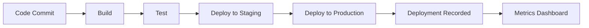
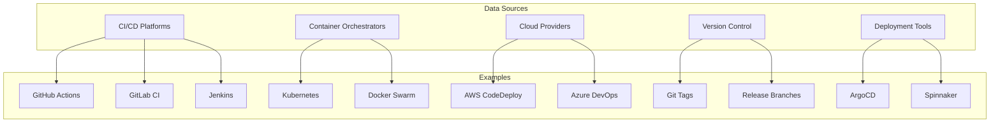
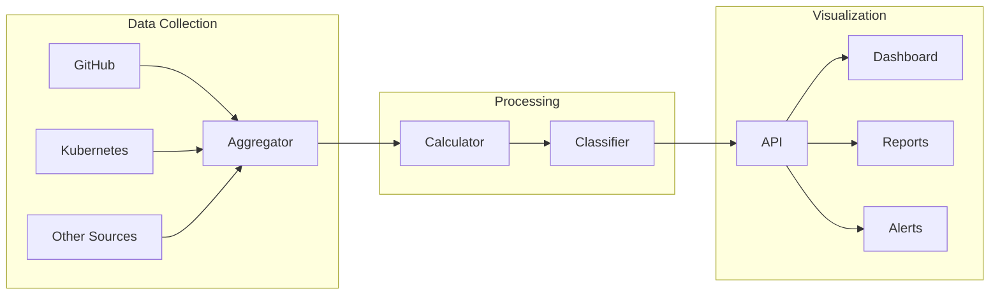
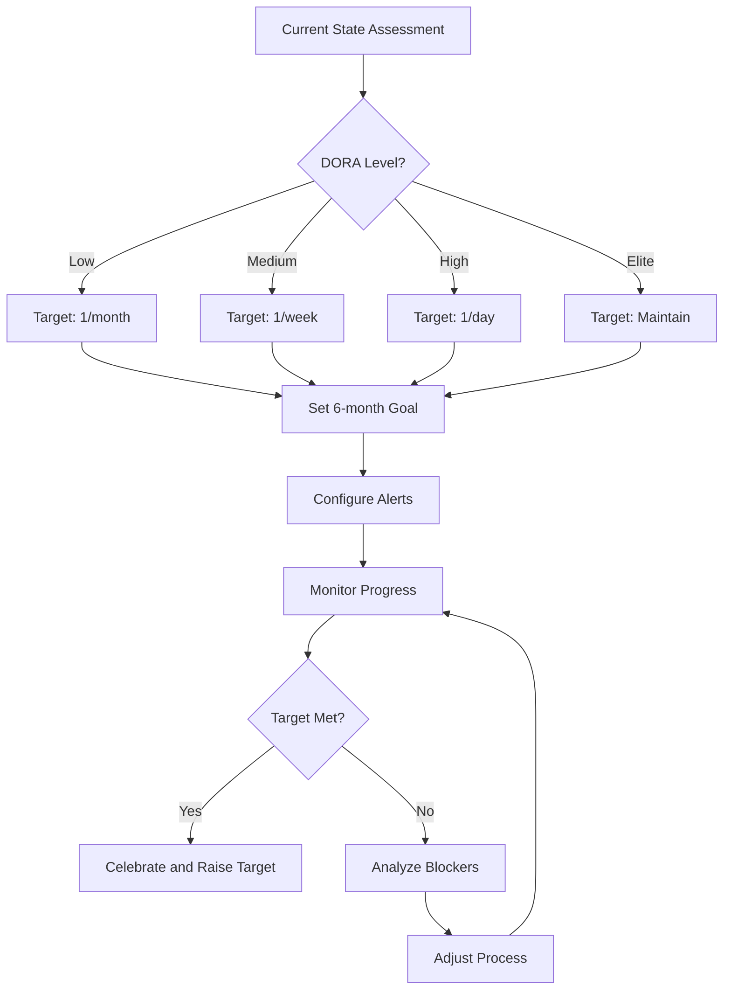
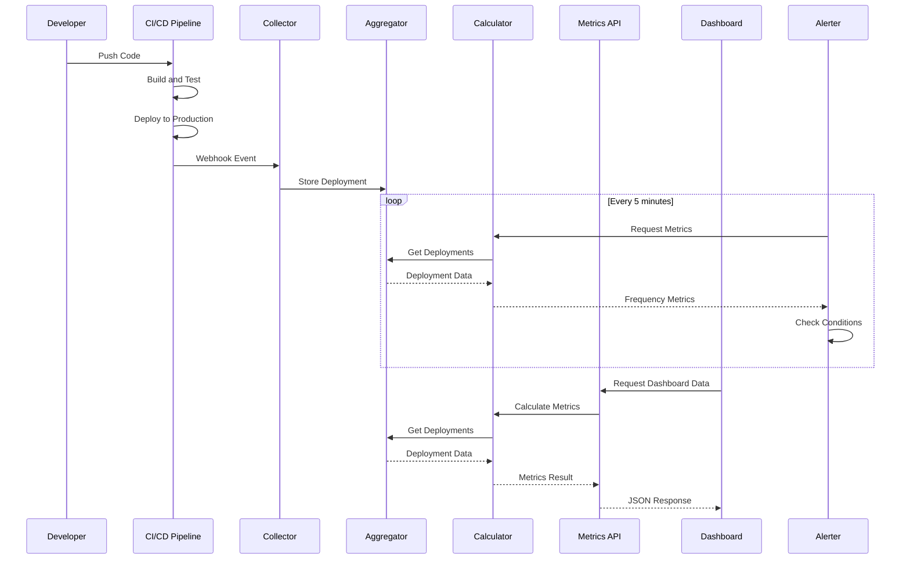

# How to Create Deployment Frequency

Author: [nawazdhandala](https://github.com/nawazdhandala)

Tags: DevOps, DORA Metrics, Deployment Frequency, CI/CD

Description: Learn to implement deployment frequency tracking with automated collection, trend analysis, and benchmarking for continuous delivery assessment.

---

Deployment frequency is one of the four key DORA (DevOps Research and Assessment) metrics that measure software delivery performance. It tracks how often your team successfully releases to production, serving as a direct indicator of your continuous delivery capabilities. In this guide, we will walk through creating a comprehensive deployment frequency measurement system from scratch.

## Understanding Deployment Frequency

Deployment frequency answers a simple question: "How often do we ship code to production?" High-performing teams deploy multiple times per day, while lower performers might deploy monthly or less frequently.



### Why Deployment Frequency Matters

- **Faster feedback loops** - More deployments mean quicker validation of changes
- **Reduced risk** - Smaller, frequent releases are easier to troubleshoot
- **Team velocity indicator** - Reflects pipeline efficiency and team throughput
- **Business agility** - Enables rapid response to market demands

## Data Sources for Deployment Tracking

Before collecting metrics, you need to identify where deployment data lives in your infrastructure.

### Common Data Sources



### Defining What Counts as a Deployment

Not every pipeline run is a deployment. Establish clear criteria:

```python
# deployment_criteria.py

class DeploymentCriteria:
    """Define what constitutes a valid deployment for metrics."""

    VALID_ENVIRONMENTS = ['production', 'prod', 'live']
    VALID_STATUSES = ['success', 'completed', 'succeeded']

    @classmethod
    def is_valid_deployment(cls, event: dict) -> bool:
        """
        Determine if an event should be counted as a deployment.

        Args:
            event: Dictionary containing deployment event data

        Returns:
            Boolean indicating if this is a valid deployment
        """
        environment = event.get('environment', '').lower()
        status = event.get('status', '').lower()

        is_production = any(
            env in environment
            for env in cls.VALID_ENVIRONMENTS
        )
        is_successful = status in cls.VALID_STATUSES

        return is_production and is_successful
```

## Automating Data Collection

Manual tracking does not scale. Here is how to automate deployment data collection from popular platforms.

### GitHub Actions Webhook Collector

Create a webhook endpoint that captures deployment events:

```python
# collectors/github_collector.py

from flask import Flask, request, jsonify
from datetime import datetime
import hashlib
import hmac
import os

app = Flask(__name__)

class GitHubDeploymentCollector:
    """Collect deployment events from GitHub Actions."""

    def __init__(self, webhook_secret: str):
        self.webhook_secret = webhook_secret
        self.deployments = []

    def verify_signature(self, payload: bytes, signature: str) -> bool:
        """Verify GitHub webhook signature for security."""
        expected = hmac.new(
            self.webhook_secret.encode(),
            payload,
            hashlib.sha256
        ).hexdigest()
        return hmac.compare_digest(f"sha256={expected}", signature)

    def parse_deployment_event(self, payload: dict) -> dict:
        """Extract relevant deployment information."""
        return {
            'id': payload.get('deployment', {}).get('id'),
            'repository': payload.get('repository', {}).get('full_name'),
            'environment': payload.get('deployment', {}).get('environment'),
            'status': payload.get('deployment_status', {}).get('state'),
            'sha': payload.get('deployment', {}).get('sha'),
            'ref': payload.get('deployment', {}).get('ref'),
            'timestamp': datetime.utcnow().isoformat(),
            'deployed_by': payload.get('sender', {}).get('login'),
            'source': 'github_actions'
        }

collector = GitHubDeploymentCollector(
    webhook_secret=os.environ.get('GITHUB_WEBHOOK_SECRET', '')
)

@app.route('/webhooks/github', methods=['POST'])
def handle_github_webhook():
    """Handle incoming GitHub deployment webhooks."""
    signature = request.headers.get('X-Hub-Signature-256', '')

    if not collector.verify_signature(request.data, signature):
        return jsonify({'error': 'Invalid signature'}), 401

    event_type = request.headers.get('X-GitHub-Event')

    if event_type == 'deployment_status':
        payload = request.json
        deployment = collector.parse_deployment_event(payload)

        if DeploymentCriteria.is_valid_deployment(deployment):
            save_deployment(deployment)
            return jsonify({'status': 'recorded'}), 200

    return jsonify({'status': 'ignored'}), 200
```

### Kubernetes Deployment Watcher

For Kubernetes-native deployments, watch for rollout events:

```python
# collectors/kubernetes_collector.py

from kubernetes import client, config, watch
from datetime import datetime
import threading

class KubernetesDeploymentWatcher:
    """Watch Kubernetes for deployment events."""

    def __init__(self, namespace: str = 'default'):
        self.namespace = namespace
        self.deployments = []
        self._setup_client()

    def _setup_client(self):
        """Initialize Kubernetes client."""
        try:
            config.load_incluster_config()
        except config.ConfigException:
            config.load_kube_config()

        self.apps_v1 = client.AppsV1Api()

    def watch_deployments(self, callback):
        """
        Watch for deployment changes in the cluster.

        Args:
            callback: Function to call when deployment completes
        """
        w = watch.Watch()

        for event in w.stream(
            self.apps_v1.list_namespaced_deployment,
            namespace=self.namespace
        ):
            event_type = event['type']
            deployment = event['object']

            if event_type == 'MODIFIED':
                if self._is_rollout_complete(deployment):
                    deployment_data = self._extract_deployment_info(deployment)
                    callback(deployment_data)

    def _is_rollout_complete(self, deployment) -> bool:
        """Check if deployment rollout has completed successfully."""
        status = deployment.status
        spec = deployment.spec

        if status.updated_replicas is None:
            return False

        return (
            status.updated_replicas == spec.replicas and
            status.ready_replicas == spec.replicas and
            status.available_replicas == spec.replicas
        )

    def _extract_deployment_info(self, deployment) -> dict:
        """Extract deployment information for metrics."""
        metadata = deployment.metadata

        return {
            'id': metadata.uid,
            'name': metadata.name,
            'namespace': metadata.namespace,
            'environment': metadata.labels.get('environment', 'unknown'),
            'status': 'success',
            'timestamp': datetime.utcnow().isoformat(),
            'image': self._get_container_image(deployment),
            'replicas': deployment.spec.replicas,
            'source': 'kubernetes'
        }

    def _get_container_image(self, deployment) -> str:
        """Get the primary container image from deployment."""
        containers = deployment.spec.template.spec.containers
        if containers:
            return containers[0].image
        return 'unknown'

# Usage example
def on_deployment(deployment_data):
    """Callback when deployment is detected."""
    if DeploymentCriteria.is_valid_deployment(deployment_data):
        save_deployment(deployment_data)
        print(f"Recorded deployment: {deployment_data['name']}")

watcher = KubernetesDeploymentWatcher(namespace='production')
thread = threading.Thread(target=watcher.watch_deployments, args=(on_deployment,))
thread.daemon = True
thread.start()
```

### Multi-Source Aggregator

Combine data from multiple sources into a unified format:

```python
# collectors/aggregator.py

from dataclasses import dataclass
from datetime import datetime
from typing import List, Optional
import sqlite3

@dataclass
class Deployment:
    """Unified deployment record."""
    id: str
    repository: str
    environment: str
    status: str
    timestamp: datetime
    source: str
    metadata: dict

class DeploymentAggregator:
    """Aggregate deployments from multiple sources."""

    def __init__(self, db_path: str = 'deployments.db'):
        self.db_path = db_path
        self._init_database()

    def _init_database(self):
        """Initialize SQLite database for deployment storage."""
        with sqlite3.connect(self.db_path) as conn:
            conn.execute('''
                CREATE TABLE IF NOT EXISTS deployments (
                    id TEXT PRIMARY KEY,
                    repository TEXT NOT NULL,
                    environment TEXT NOT NULL,
                    status TEXT NOT NULL,
                    timestamp TEXT NOT NULL,
                    source TEXT NOT NULL,
                    metadata TEXT
                )
            ''')

            conn.execute('''
                CREATE INDEX IF NOT EXISTS idx_timestamp
                ON deployments(timestamp)
            ''')

            conn.execute('''
                CREATE INDEX IF NOT EXISTS idx_repository
                ON deployments(repository)
            ''')

    def save_deployment(self, deployment: Deployment):
        """Save a deployment record to the database."""
        import json

        with sqlite3.connect(self.db_path) as conn:
            conn.execute('''
                INSERT OR REPLACE INTO deployments
                (id, repository, environment, status, timestamp, source, metadata)
                VALUES (?, ?, ?, ?, ?, ?, ?)
            ''', (
                deployment.id,
                deployment.repository,
                deployment.environment,
                deployment.status,
                deployment.timestamp.isoformat(),
                deployment.source,
                json.dumps(deployment.metadata)
            ))

    def get_deployments(
        self,
        start_date: datetime,
        end_date: datetime,
        repository: Optional[str] = None
    ) -> List[Deployment]:
        """Retrieve deployments within a date range."""
        import json

        query = '''
            SELECT id, repository, environment, status, timestamp, source, metadata
            FROM deployments
            WHERE timestamp >= ? AND timestamp <= ?
        '''
        params = [start_date.isoformat(), end_date.isoformat()]

        if repository:
            query += ' AND repository = ?'
            params.append(repository)

        query += ' ORDER BY timestamp DESC'

        with sqlite3.connect(self.db_path) as conn:
            cursor = conn.execute(query, params)

            return [
                Deployment(
                    id=row[0],
                    repository=row[1],
                    environment=row[2],
                    status=row[3],
                    timestamp=datetime.fromisoformat(row[4]),
                    source=row[5],
                    metadata=json.loads(row[6]) if row[6] else {}
                )
                for row in cursor.fetchall()
            ]
```

## Calculating Deployment Frequency

With data collected, we can compute meaningful metrics.

### Frequency Calculation Engine

```python
# metrics/frequency_calculator.py

from datetime import datetime, timedelta
from typing import List, Dict, Tuple
from collections import defaultdict
from dataclasses import dataclass

@dataclass
class FrequencyMetrics:
    """Deployment frequency metrics for a time period."""
    total_deployments: int
    daily_average: float
    weekly_average: float
    monthly_average: float
    deployments_per_day: Dict[str, int]
    peak_day: Tuple[str, int]
    trend: str  # 'increasing', 'decreasing', 'stable'

class DeploymentFrequencyCalculator:
    """Calculate deployment frequency metrics."""

    def __init__(self, aggregator: DeploymentAggregator):
        self.aggregator = aggregator

    def calculate_frequency(
        self,
        start_date: datetime,
        end_date: datetime,
        repository: str = None
    ) -> FrequencyMetrics:
        """
        Calculate deployment frequency metrics for a period.

        Args:
            start_date: Beginning of measurement period
            end_date: End of measurement period
            repository: Optional filter by repository

        Returns:
            FrequencyMetrics object with calculated values
        """
        deployments = self.aggregator.get_deployments(
            start_date, end_date, repository
        )

        # Group deployments by day
        daily_counts = defaultdict(int)
        for dep in deployments:
            day_key = dep.timestamp.strftime('%Y-%m-%d')
            daily_counts[day_key] = daily_counts[day_key] + 1

        # Calculate totals
        total_deployments = len(deployments)
        days_in_period = (end_date - start_date).days or 1
        weeks_in_period = days_in_period / 7
        months_in_period = days_in_period / 30

        # Calculate averages
        daily_average = total_deployments / days_in_period
        weekly_average = total_deployments / weeks_in_period if weeks_in_period > 0 else 0
        monthly_average = total_deployments / months_in_period if months_in_period > 0 else 0

        # Find peak day
        if daily_counts:
            peak_day = max(daily_counts.items(), key=lambda x: x[1])
        else:
            peak_day = ('N/A', 0)

        # Calculate trend
        trend = self._calculate_trend(daily_counts, days_in_period)

        return FrequencyMetrics(
            total_deployments=total_deployments,
            daily_average=round(daily_average, 2),
            weekly_average=round(weekly_average, 2),
            monthly_average=round(monthly_average, 2),
            deployments_per_day=dict(daily_counts),
            peak_day=peak_day,
            trend=trend
        )

    def _calculate_trend(
        self,
        daily_counts: Dict[str, int],
        days_in_period: int
    ) -> str:
        """Determine if deployment frequency is trending up or down."""
        if len(daily_counts) < 14:
            return 'insufficient_data'

        sorted_days = sorted(daily_counts.keys())
        midpoint = len(sorted_days) // 2

        first_half = sum(daily_counts[d] for d in sorted_days[:midpoint])
        second_half = sum(daily_counts[d] for d in sorted_days[midpoint:])

        # Calculate percentage change
        if first_half == 0:
            return 'increasing' if second_half > 0 else 'stable'

        change = ((second_half - first_half) / first_half) * 100

        if change > 10:
            return 'increasing'
        elif change < -10:
            return 'decreasing'
        return 'stable'

    def calculate_rolling_average(
        self,
        end_date: datetime,
        window_days: int = 7,
        repository: str = None
    ) -> List[Dict]:
        """
        Calculate rolling average deployment frequency.

        Args:
            end_date: End date for calculation
            window_days: Size of rolling window
            repository: Optional repository filter

        Returns:
            List of daily rolling averages
        """
        # Get extra days for the rolling window
        start_date = end_date - timedelta(days=window_days * 2)
        deployments = self.aggregator.get_deployments(
            start_date, end_date, repository
        )

        # Build daily counts
        daily_counts = defaultdict(int)
        for dep in deployments:
            day_key = dep.timestamp.strftime('%Y-%m-%d')
            daily_counts[day_key] = daily_counts[day_key] + 1

        # Calculate rolling averages
        results = []
        current_date = start_date + timedelta(days=window_days)

        while current_date <= end_date:
            window_total = 0
            for i in range(window_days):
                check_date = current_date - timedelta(days=i)
                day_key = check_date.strftime('%Y-%m-%d')
                window_total += daily_counts.get(day_key, 0)

            results.append({
                'date': current_date.strftime('%Y-%m-%d'),
                'rolling_average': round(window_total / window_days, 2),
                'daily_count': daily_counts.get(
                    current_date.strftime('%Y-%m-%d'), 0
                )
            })

            current_date += timedelta(days=1)

        return results
```

### DORA Performance Classification

Classify your team according to DORA benchmarks:

```python
# metrics/dora_classifier.py

from enum import Enum
from dataclasses import dataclass

class DORAPerformanceLevel(Enum):
    """DORA performance levels for deployment frequency."""
    ELITE = "elite"
    HIGH = "high"
    MEDIUM = "medium"
    LOW = "low"

@dataclass
class DORAClassification:
    """DORA classification result."""
    level: DORAPerformanceLevel
    description: str
    benchmark: str
    recommendation: str

class DORAFrequencyClassifier:
    """Classify deployment frequency according to DORA standards."""

    # DORA benchmarks based on State of DevOps reports
    BENCHMARKS = {
        DORAPerformanceLevel.ELITE: {
            'min_daily': 1.0,  # Multiple deploys per day
            'description': 'On-demand deployment (multiple per day)',
            'recommendation': 'Maintain practices and mentor other teams'
        },
        DORAPerformanceLevel.HIGH: {
            'min_daily': 0.14,  # At least once per week
            'description': 'Between once per day and once per week',
            'recommendation': 'Focus on reducing batch sizes and automation'
        },
        DORAPerformanceLevel.MEDIUM: {
            'min_daily': 0.033,  # At least once per month
            'description': 'Between once per week and once per month',
            'recommendation': 'Invest in CI/CD pipeline improvements'
        },
        DORAPerformanceLevel.LOW: {
            'min_daily': 0,
            'description': 'Less than once per month',
            'recommendation': 'Start with basic automation and testing'
        }
    }

    def classify(self, daily_average: float) -> DORAClassification:
        """
        Classify deployment frequency into DORA performance level.

        Args:
            daily_average: Average deployments per day

        Returns:
            DORAClassification with level and recommendations
        """
        for level in [
            DORAPerformanceLevel.ELITE,
            DORAPerformanceLevel.HIGH,
            DORAPerformanceLevel.MEDIUM,
            DORAPerformanceLevel.LOW
        ]:
            benchmark = self.BENCHMARKS[level]
            if daily_average >= benchmark['min_daily']:
                return DORAClassification(
                    level=level,
                    description=benchmark['description'],
                    benchmark=self._format_benchmark(level),
                    recommendation=benchmark['recommendation']
                )

        # Default to low if no match
        return DORAClassification(
            level=DORAPerformanceLevel.LOW,
            description=self.BENCHMARKS[DORAPerformanceLevel.LOW]['description'],
            benchmark=self._format_benchmark(DORAPerformanceLevel.LOW),
            recommendation=self.BENCHMARKS[DORAPerformanceLevel.LOW]['recommendation']
        )

    def _format_benchmark(self, level: DORAPerformanceLevel) -> str:
        """Format benchmark description for display."""
        benchmarks = {
            DORAPerformanceLevel.ELITE: '>= 1 deployment per day',
            DORAPerformanceLevel.HIGH: '>= 1 deployment per week',
            DORAPerformanceLevel.MEDIUM: '>= 1 deployment per month',
            DORAPerformanceLevel.LOW: '< 1 deployment per month'
        }
        return benchmarks[level]
```

## Building Visualization Dashboards

Transform raw data into actionable visualizations.

### Dashboard Data Flow



### REST API for Metrics

```python
# api/metrics_api.py

from flask import Flask, jsonify, request
from datetime import datetime, timedelta
from functools import wraps

app = Flask(__name__)

# Initialize components
aggregator = DeploymentAggregator()
calculator = DeploymentFrequencyCalculator(aggregator)
classifier = DORAFrequencyClassifier()

def parse_date_params(func):
    """Decorator to parse common date parameters."""
    @wraps(func)
    def wrapper(*args, **kwargs):
        end_date = request.args.get('end_date')
        start_date = request.args.get('start_date')
        days = request.args.get('days', 30, type=int)

        if end_date:
            end_date = datetime.fromisoformat(end_date)
        else:
            end_date = datetime.utcnow()

        if start_date:
            start_date = datetime.fromisoformat(start_date)
        else:
            start_date = end_date - timedelta(days=days)

        kwargs['start_date'] = start_date
        kwargs['end_date'] = end_date

        return func(*args, **kwargs)
    return wrapper

@app.route('/api/v1/metrics/frequency', methods=['GET'])
@parse_date_params
def get_deployment_frequency(start_date, end_date):
    """Get deployment frequency metrics."""
    repository = request.args.get('repository')

    metrics = calculator.calculate_frequency(
        start_date=start_date,
        end_date=end_date,
        repository=repository
    )

    classification = classifier.classify(metrics.daily_average)

    return jsonify({
        'period': {
            'start': start_date.isoformat(),
            'end': end_date.isoformat()
        },
        'metrics': {
            'total_deployments': metrics.total_deployments,
            'daily_average': metrics.daily_average,
            'weekly_average': metrics.weekly_average,
            'monthly_average': metrics.monthly_average,
            'trend': metrics.trend,
            'peak_day': {
                'date': metrics.peak_day[0],
                'count': metrics.peak_day[1]
            }
        },
        'dora_classification': {
            'level': classification.level.value,
            'description': classification.description,
            'benchmark': classification.benchmark,
            'recommendation': classification.recommendation
        }
    })

@app.route('/api/v1/metrics/frequency/timeseries', methods=['GET'])
@parse_date_params
def get_frequency_timeseries(start_date, end_date):
    """Get deployment frequency as time series data."""
    repository = request.args.get('repository')
    window = request.args.get('window', 7, type=int)

    rolling_data = calculator.calculate_rolling_average(
        end_date=end_date,
        window_days=window,
        repository=repository
    )

    return jsonify({
        'period': {
            'start': start_date.isoformat(),
            'end': end_date.isoformat()
        },
        'window_days': window,
        'data': rolling_data
    })

@app.route('/api/v1/metrics/frequency/compare', methods=['GET'])
def compare_repositories():
    """Compare deployment frequency across repositories."""
    repositories = request.args.getlist('repository')
    days = request.args.get('days', 30, type=int)

    end_date = datetime.utcnow()
    start_date = end_date - timedelta(days=days)

    comparisons = []
    for repo in repositories:
        metrics = calculator.calculate_frequency(
            start_date=start_date,
            end_date=end_date,
            repository=repo
        )
        classification = classifier.classify(metrics.daily_average)

        comparisons.append({
            'repository': repo,
            'daily_average': metrics.daily_average,
            'total_deployments': metrics.total_deployments,
            'dora_level': classification.level.value
        })

    # Sort by daily average descending
    comparisons.sort(key=lambda x: x['daily_average'], reverse=True)

    return jsonify({
        'period': {
            'start': start_date.isoformat(),
            'end': end_date.isoformat()
        },
        'comparisons': comparisons
    })
```

### Frontend Dashboard Component

```javascript
// dashboard/DeploymentFrequencyChart.jsx

import React, { useState, useEffect } from 'react';
import {
  LineChart,
  Line,
  XAxis,
  YAxis,
  CartesianGrid,
  Tooltip,
  Legend,
  ResponsiveContainer,
  BarChart,
  Bar
} from 'recharts';

const DORA_COLORS = {
  elite: '#22c55e',
  high: '#3b82f6',
  medium: '#f59e0b',
  low: '#ef4444'
};

const DeploymentFrequencyDashboard = ({ repository, days = 30 }) => {
  const [metrics, setMetrics] = useState(null);
  const [timeseries, setTimeseries] = useState([]);
  const [loading, setLoading] = useState(true);
  const [error, setError] = useState(null);

  useEffect(() => {
    const fetchData = async () => {
      setLoading(true);
      try {
        // Fetch summary metrics
        const metricsResponse = await fetch(
          `/api/v1/metrics/frequency?days=${days}&repository=${repository}`
        );
        const metricsData = await metricsResponse.json();
        setMetrics(metricsData);

        // Fetch timeseries data
        const timeseriesResponse = await fetch(
          `/api/v1/metrics/frequency/timeseries?days=${days}&repository=${repository}`
        );
        const timeseriesData = await timeseriesResponse.json();
        setTimeseries(timeseriesData.data);
      } catch (err) {
        setError(err.message);
      } finally {
        setLoading(false);
      }
    };

    fetchData();
  }, [repository, days]);

  if (loading) return <div className="loading">Loading metrics...</div>;
  if (error) return <div className="error">Error: {error}</div>;
  if (!metrics) return null;

  const { dora_classification } = metrics;
  const doraColor = DORA_COLORS[dora_classification.level];

  return (
    <div className="deployment-frequency-dashboard">
      <header className="dashboard-header">
        <h1>Deployment Frequency</h1>
        <span className="period">
          {metrics.period.start} to {metrics.period.end}
        </span>
      </header>

      {/* DORA Classification Card */}
      <div
        className="dora-card"
        style={{ borderLeftColor: doraColor }}
      >
        <div className="dora-level">
          <span
            className="level-badge"
            style={{ backgroundColor: doraColor }}
          >
            {dora_classification.level.toUpperCase()}
          </span>
          <p className="level-description">
            {dora_classification.description}
          </p>
        </div>
        <div className="dora-recommendation">
          <strong>Recommendation:</strong> {dora_classification.recommendation}
        </div>
      </div>

      {/* Key Metrics Grid */}
      <div className="metrics-grid">
        <MetricCard
          title="Total Deployments"
          value={metrics.metrics.total_deployments}
          subtitle={`${metrics.metrics.trend} trend`}
        />
        <MetricCard
          title="Daily Average"
          value={metrics.metrics.daily_average}
          subtitle="deployments per day"
        />
        <MetricCard
          title="Weekly Average"
          value={metrics.metrics.weekly_average}
          subtitle="deployments per week"
        />
        <MetricCard
          title="Peak Day"
          value={metrics.metrics.peak_day.count}
          subtitle={metrics.metrics.peak_day.date}
        />
      </div>

      {/* Timeseries Chart */}
      <div className="chart-container">
        <h2>Deployment Trend</h2>
        <ResponsiveContainer width="100%" height={300}>
          <LineChart data={timeseries}>
            <CartesianGrid strokeDasharray="3 3" />
            <XAxis
              dataKey="date"
              tickFormatter={(date) => date.slice(5)}
            />
            <YAxis />
            <Tooltip />
            <Legend />
            <Line
              type="monotone"
              dataKey="daily_count"
              stroke="#8884d8"
              name="Daily Deployments"
              dot={false}
            />
            <Line
              type="monotone"
              dataKey="rolling_average"
              stroke="#82ca9d"
              name="7-Day Average"
              strokeWidth={2}
            />
          </LineChart>
        </ResponsiveContainer>
      </div>

      {/* Daily Distribution */}
      <div className="chart-container">
        <h2>Daily Distribution</h2>
        <ResponsiveContainer width="100%" height={200}>
          <BarChart data={timeseries.slice(-14)}>
            <CartesianGrid strokeDasharray="3 3" />
            <XAxis
              dataKey="date"
              tickFormatter={(date) => date.slice(5)}
            />
            <YAxis />
            <Tooltip />
            <Bar
              dataKey="daily_count"
              fill={doraColor}
              name="Deployments"
            />
          </BarChart>
        </ResponsiveContainer>
      </div>
    </div>
  );
};

const MetricCard = ({ title, value, subtitle }) => (
  <div className="metric-card">
    <h3 className="metric-title">{title}</h3>
    <div className="metric-value">{value}</div>
    <div className="metric-subtitle">{subtitle}</div>
  </div>
);

export default DeploymentFrequencyDashboard;
```

## Setting Targets and Alerts

Define meaningful targets and get notified when metrics change.

### Target Configuration



### Alert System Implementation

```python
# alerts/frequency_alerts.py

from dataclasses import dataclass
from datetime import datetime, timedelta
from enum import Enum
from typing import List, Callable
import smtplib
from email.mime.text import MIMEText

class AlertSeverity(Enum):
    INFO = "info"
    WARNING = "warning"
    CRITICAL = "critical"

@dataclass
class FrequencyAlert:
    """Alert configuration for deployment frequency."""
    name: str
    condition: Callable
    severity: AlertSeverity
    message_template: str
    channels: List[str]

@dataclass
class AlertEvent:
    """Triggered alert event."""
    alert: FrequencyAlert
    triggered_at: datetime
    current_value: float
    threshold: float
    context: dict

class DeploymentFrequencyAlerter:
    """Monitor deployment frequency and trigger alerts."""

    def __init__(self, calculator: DeploymentFrequencyCalculator):
        self.calculator = calculator
        self.alerts: List[FrequencyAlert] = []
        self.notification_handlers = {}

    def add_alert(self, alert: FrequencyAlert):
        """Register a new alert configuration."""
        self.alerts.append(alert)

    def register_handler(self, channel: str, handler: Callable):
        """Register notification handler for a channel."""
        self.notification_handlers[channel] = handler

    def check_alerts(self, repository: str = None) -> List[AlertEvent]:
        """
        Check all alert conditions and return triggered alerts.

        Args:
            repository: Optional repository filter

        Returns:
            List of triggered AlertEvent objects
        """
        # Get current metrics
        end_date = datetime.utcnow()
        start_date = end_date - timedelta(days=7)

        metrics = self.calculator.calculate_frequency(
            start_date=start_date,
            end_date=end_date,
            repository=repository
        )

        triggered = []

        for alert in self.alerts:
            result = alert.condition(metrics)

            if result['triggered']:
                event = AlertEvent(
                    alert=alert,
                    triggered_at=datetime.utcnow(),
                    current_value=result['current_value'],
                    threshold=result['threshold'],
                    context={
                        'repository': repository,
                        'period_start': start_date.isoformat(),
                        'period_end': end_date.isoformat(),
                        'metrics': metrics
                    }
                )
                triggered.append(event)
                self._send_notifications(event)

        return triggered

    def _send_notifications(self, event: AlertEvent):
        """Send notifications for triggered alert."""
        message = event.alert.message_template.format(
            current_value=event.current_value,
            threshold=event.threshold,
            repository=event.context.get('repository', 'all'),
            triggered_at=event.triggered_at.isoformat()
        )

        for channel in event.alert.channels:
            if channel in self.notification_handlers:
                try:
                    self.notification_handlers[channel](
                        message=message,
                        severity=event.alert.severity,
                        event=event
                    )
                except Exception as e:
                    print(f"Failed to send notification to {channel}: {e}")

# Define common alert conditions
def below_threshold(threshold: float):
    """Create condition for when frequency drops below threshold."""
    def condition(metrics):
        return {
            'triggered': metrics.daily_average < threshold,
            'current_value': metrics.daily_average,
            'threshold': threshold
        }
    return condition

def declining_trend():
    """Create condition for declining deployment trend."""
    def condition(metrics):
        return {
            'triggered': metrics.trend == 'decreasing',
            'current_value': metrics.daily_average,
            'threshold': 0
        }
    return condition

def no_deployments_days(days: int):
    """Create condition for no deployments in N days."""
    def condition(metrics):
        recent_days = list(metrics.deployments_per_day.items())[-days:]
        zero_days = sum(1 for _, count in recent_days if count == 0)
        return {
            'triggered': zero_days >= days,
            'current_value': zero_days,
            'threshold': days
        }
    return condition

# Example usage
alerter = DeploymentFrequencyAlerter(calculator)

# Alert when daily average drops below 0.5
alerter.add_alert(FrequencyAlert(
    name="Low Deployment Frequency",
    condition=below_threshold(0.5),
    severity=AlertSeverity.WARNING,
    message_template="Deployment frequency dropped to {current_value}/day (threshold: {threshold}/day) for {repository}",
    channels=['slack', 'email']
))

# Alert on declining trend
alerter.add_alert(FrequencyAlert(
    name="Declining Deployment Trend",
    condition=declining_trend(),
    severity=AlertSeverity.INFO,
    message_template="Deployment frequency is declining for {repository}. Current average: {current_value}/day",
    channels=['slack']
))

# Alert when no deployments for 3 days
alerter.add_alert(FrequencyAlert(
    name="No Recent Deployments",
    condition=no_deployments_days(3),
    severity=AlertSeverity.CRITICAL,
    message_template="No deployments for {current_value} days for {repository}",
    channels=['slack', 'email', 'pagerduty']
))

# Register notification handlers
def slack_handler(message, severity, event):
    """Send notification to Slack."""
    # Implementation for Slack webhook
    pass

def email_handler(message, severity, event):
    """Send notification via email."""
    # Implementation for email
    pass

alerter.register_handler('slack', slack_handler)
alerter.register_handler('email', email_handler)
```

## Complete Integration Example

Here is how all components work together:



### Docker Compose Setup

```yaml
# docker-compose.yml

version: '3.8'

services:
  collector:
    build: ./collector
    ports:
      - "8080:8080"
    environment:
      - GITHUB_WEBHOOK_SECRET=${GITHUB_WEBHOOK_SECRET}
      - DATABASE_URL=postgresql://postgres:password@db:5432/deployments
    depends_on:
      - db
    restart: unless-stopped

  api:
    build: ./api
    ports:
      - "8081:8081"
    environment:
      - DATABASE_URL=postgresql://postgres:password@db:5432/deployments
    depends_on:
      - db
    restart: unless-stopped

  alerter:
    build: ./alerter
    environment:
      - DATABASE_URL=postgresql://postgres:password@db:5432/deployments
      - SLACK_WEBHOOK_URL=${SLACK_WEBHOOK_URL}
      - SMTP_HOST=${SMTP_HOST}
      - SMTP_USER=${SMTP_USER}
      - SMTP_PASSWORD=${SMTP_PASSWORD}
    depends_on:
      - db
    restart: unless-stopped

  dashboard:
    build: ./dashboard
    ports:
      - "3000:3000"
    environment:
      - API_URL=http://api:8081
    depends_on:
      - api
    restart: unless-stopped

  db:
    image: postgres:15
    environment:
      - POSTGRES_USER=postgres
      - POSTGRES_PASSWORD=password
      - POSTGRES_DB=deployments
    volumes:
      - postgres_data:/var/lib/postgresql/data
    restart: unless-stopped

  kubernetes-watcher:
    build: ./kubernetes-watcher
    environment:
      - DATABASE_URL=postgresql://postgres:password@db:5432/deployments
      - WATCH_NAMESPACE=production
    depends_on:
      - db
    restart: unless-stopped

volumes:
  postgres_data:
```

## Best Practices for Deployment Frequency Metrics

### Do

1. **Count only production deployments** - Staging and development deploys should not inflate your metrics
2. **Track by team and service** - Aggregate metrics hide important details
3. **Include rollbacks** - A rollback is still a deployment and indicates process health
4. **Automate collection** - Manual tracking introduces errors and gaps
5. **Review trends weekly** - Short-term fluctuations matter less than long-term direction

### Avoid

1. **Gaming the metric** - Splitting changes artificially to increase count adds no value
2. **Ignoring context** - A new team will naturally have lower frequency than a mature one
3. **Punishing low frequency** - Use the metric for improvement, not blame
4. **Focusing only on speed** - Balance frequency with the other DORA metrics

## Conclusion

Deployment frequency is a powerful indicator of your team's delivery capability. By implementing automated collection from your CI/CD pipelines and Kubernetes clusters, calculating meaningful metrics with trend analysis, and setting appropriate targets with alerting, you create visibility into your software delivery performance.

Start with basic collection, establish a baseline, and incrementally improve. Remember that deployment frequency is just one of four DORA metrics - lead time, change failure rate, and mean time to recovery complete the picture of software delivery performance.

The code examples in this guide provide a foundation you can adapt to your specific infrastructure. Whether you use GitHub Actions, GitLab CI, Jenkins, or another platform, the principles remain the same: collect deployment events, calculate frequency metrics, visualize trends, and use the data to drive continuous improvement.
