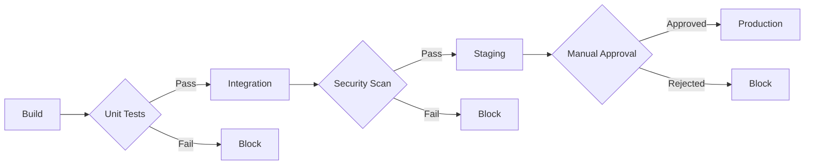
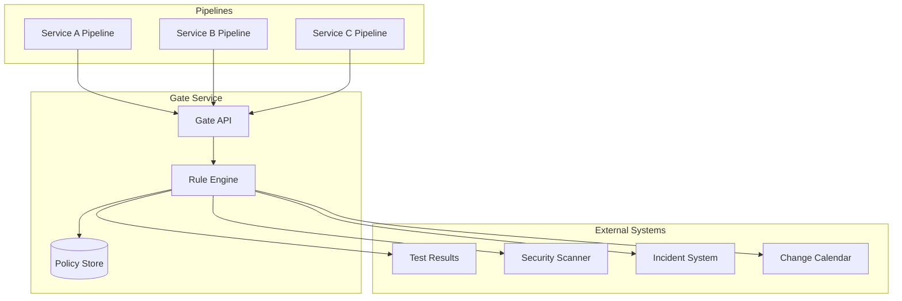

# How to Implement Deployment Gates

Author: [nawazdhandala](https://github.com/nawazdhandala)

Tags: DevOps, Gates, Quality Assurance, CI/CD

Description: Learn to implement deployment gates for quality and compliance checks before production.

---

Deployment gates act as checkpoints in your release pipeline. They enforce quality standards, security policies, and compliance requirements before code reaches production. Without gates, broken builds, security vulnerabilities, and untested features slip through. With them, you catch problems early and deploy with confidence.

## What Are Deployment Gates?

A deployment gate is a condition that must pass before a deployment proceeds. Gates can be automatic (test results, security scans) or manual (change approval, compliance sign-off). They sit between pipeline stages and block progression until all criteria are satisfied.



Gates serve multiple purposes in a mature delivery pipeline:

- **Quality Assurance**: Block deployments when tests fail or coverage drops
- **Security**: Prevent vulnerable code from reaching production
- **Compliance**: Enforce approval workflows for regulated environments
- **Stability**: Verify staging health before promoting to production

## Types of Deployment Gates

### Automated Gates

Automated gates evaluate conditions without human intervention. They run fast, scale well, and provide consistent enforcement.

Common automated gates include:

- Unit test pass rate (100% required)
- Code coverage thresholds (80%+ coverage)
- Static analysis scores (no critical issues)
- Security vulnerability scans (no high/critical CVEs)
- Integration test results
- Performance benchmark comparisons

### Manual Gates

Manual gates require human approval. Use them for high-risk changes, compliance requirements, or cross-team coordination.

Examples of manual gates:

- Change Advisory Board (CAB) approval
- Security team sign-off
- Product owner acceptance
- Compliance officer review

## Implementing Gates in GitHub Actions

GitHub Actions provides native support for deployment environments with protection rules. Here is a workflow that implements multiple gates before production deployment.

```yaml
# .github/workflows/deploy.yml
name: Deploy Pipeline

on:
  push:
    branches: [main]

jobs:
  # Gate 1: Build and run unit tests
  test:
    runs-on: ubuntu-latest
    steps:
      - uses: actions/checkout@v4

      - name: Run unit tests
        run: npm test

      # Fail the gate if coverage drops below 80%
      - name: Check coverage threshold
        run: |
          COVERAGE=$(npm run coverage:report --silent | grep "All files" | awk '{print $4}' | tr -d '%')
          if [ "$COVERAGE" -lt 80 ]; then
            echo "Coverage $COVERAGE% is below 80% threshold"
            exit 1
          fi

  # Gate 2: Security scanning
  security:
    runs-on: ubuntu-latest
    steps:
      - uses: actions/checkout@v4

      # Scan dependencies for known vulnerabilities
      - name: Run dependency audit
        run: npm audit --audit-level=high

      # Static Application Security Testing (SAST)
      - name: Run SAST scan
        uses: github/codeql-action/analyze@v3

  # Gate 3: Deploy to staging and verify health
  staging:
    needs: [test, security]
    runs-on: ubuntu-latest
    environment: staging
    steps:
      - uses: actions/checkout@v4

      - name: Deploy to staging
        run: ./scripts/deploy.sh staging

      # Health check gate - verify the deployment is responding
      - name: Verify staging health
        run: |
          for i in {1..30}; do
            if curl -sf https://staging.example.com/health; then
              echo "Staging is healthy"
              exit 0
            fi
            sleep 10
          done
          echo "Staging health check failed"
          exit 1

  # Gate 4: Production with manual approval
  production:
    needs: [staging]
    runs-on: ubuntu-latest
    environment:
      name: production
      # Require manual approval in GitHub environment settings
    steps:
      - uses: actions/checkout@v4

      - name: Deploy to production
        run: ./scripts/deploy.sh production
```

To enable the manual approval gate, configure the production environment in GitHub repository settings with required reviewers.

## Implementing Gates in GitLab CI

GitLab CI offers similar capabilities with stages, rules, and manual jobs. This pipeline demonstrates a gated deployment flow.

```yaml
# .gitlab-ci.yml
stages:
  - test
  - security
  - staging
  - approval
  - production

variables:
  COVERAGE_THRESHOLD: "80"

# Gate 1: Unit tests with coverage enforcement
unit-tests:
  stage: test
  script:
    - npm ci
    - npm test -- --coverage
    # Extract coverage percentage and compare against threshold
    - |
      COVERAGE=$(cat coverage/coverage-summary.json | jq '.total.lines.pct')
      if (( $(echo "$COVERAGE < $COVERAGE_THRESHOLD" | bc -l) )); then
        echo "Coverage $COVERAGE% below threshold $COVERAGE_THRESHOLD%"
        exit 1
      fi
  coverage: '/Lines\s*:\s*(\d+\.?\d*)%/'

# Gate 2: Security scanning
security-scan:
  stage: security
  script:
    - npm audit --audit-level=high
    # Container image scanning
    - trivy image --severity HIGH,CRITICAL --exit-code 1 $CI_REGISTRY_IMAGE:$CI_COMMIT_SHA

# Gate 3: Staging deployment with smoke tests
deploy-staging:
  stage: staging
  environment:
    name: staging
    url: https://staging.example.com
  script:
    - ./deploy.sh staging
    # Run smoke tests against staging
    - npm run test:smoke -- --base-url=https://staging.example.com
  rules:
    # Only deploy when tests and security pass
    - if: $CI_COMMIT_BRANCH == "main"

# Gate 4: Manual approval checkpoint
approval-gate:
  stage: approval
  script:
    - echo "Deployment approved by $GITLAB_USER_NAME"
  # Block until someone clicks the play button
  when: manual
  allow_failure: false

# Gate 5: Production deployment
deploy-production:
  stage: production
  environment:
    name: production
    url: https://example.com
  script:
    - ./deploy.sh production
  rules:
    - if: $CI_COMMIT_BRANCH == "main"
      when: on_success
```

## Implementing Gates in Azure DevOps

Azure DevOps provides rich gate functionality through release pipelines. Gates can query external services and wait for conditions to be met.

```yaml
# azure-pipelines.yml
trigger:
  - main

stages:
  - stage: Build
    jobs:
      - job: BuildAndTest
        pool:
          vmImage: 'ubuntu-latest'
        steps:
          - task: NodeTool@0
            inputs:
              versionSpec: '20.x'

          - script: npm ci && npm test
            displayName: 'Run tests'

          # Publish test results for gate evaluation
          - task: PublishTestResults@2
            inputs:
              testResultsFiles: '**/junit.xml'

  - stage: Staging
    dependsOn: Build
    jobs:
      - deployment: DeployStaging
        environment: staging
        strategy:
          runOnce:
            deploy:
              steps:
                - script: ./deploy.sh staging

  - stage: Production
    dependsOn: Staging
    jobs:
      - deployment: DeployProduction
        # Environment with approval gates configured in Azure DevOps
        environment: production
        strategy:
          runOnce:
            deploy:
              steps:
                - script: ./deploy.sh production
```

Configure gates in the Azure DevOps environment settings. Common gate types include:

- **Invoke REST API**: Check external services (monitoring, incident management)
- **Query Azure Monitor alerts**: Block if active alerts exist
- **Query work items**: Require linked work items
- **Approvals**: Require sign-off from specified users or groups

## Building Custom Gates

Sometimes built-in gates are not enough. Custom gates let you enforce domain-specific rules. Here is a script that implements a custom gate checking for open incidents before allowing deployment.

```bash
#!/bin/bash
# scripts/incident-gate.sh
# Block deployment if there are active P1/P2 incidents

set -e

# Query your incident management system API
INCIDENT_COUNT=$(curl -s -H "Authorization: Bearer $INCIDENT_API_TOKEN" \
  "https://incidents.example.com/api/v1/incidents?status=open&severity=P1,P2" \
  | jq '.total')

if [ "$INCIDENT_COUNT" -gt 0 ]; then
  echo "Deployment blocked: $INCIDENT_COUNT active P1/P2 incidents"
  echo "Resolve incidents before deploying to production"
  exit 1
fi

echo "No blocking incidents found. Deployment gate passed."
exit 0
```

You can also implement gates that check deployment windows, ensuring releases only happen during approved times.

```python
#!/usr/bin/env python3
# scripts/deployment_window_gate.py
# Only allow deployments during approved windows

from datetime import datetime
import sys

# Define allowed deployment windows (UTC)
ALLOWED_WINDOWS = [
    {"day": "Tuesday", "start": 14, "end": 18},
    {"day": "Thursday", "start": 14, "end": 18},
]

def is_deployment_allowed():
    now = datetime.utcnow()
    day_name = now.strftime("%A")
    hour = now.hour

    for window in ALLOWED_WINDOWS:
        if window["day"] == day_name:
            if window["start"] <= hour < window["end"]:
                return True

    return False

if __name__ == "__main__":
    if is_deployment_allowed():
        print("Deployment window is open. Proceeding.")
        sys.exit(0)
    else:
        print("Outside deployment window. Blocking deployment.")
        print("Allowed windows: Tuesday 14:00-18:00 UTC, Thursday 14:00-18:00 UTC")
        sys.exit(1)
```

## Gate Architecture for Complex Pipelines

For organizations with multiple services and environments, consider a centralized gate service. This architecture provides consistent policy enforcement across all pipelines.



The gate service evaluates all policies in one place. Pipelines call a single API endpoint and receive a pass/fail decision with detailed reasoning.

## Best Practices for Deployment Gates

**Start with essential gates.** Begin with tests and security scans. Add more gates as your process matures. Too many gates early on will slow adoption.

**Make gates fast.** Slow gates frustrate developers and encourage workarounds. Cache dependencies, parallelize checks, and set reasonable timeouts.

**Provide clear feedback.** When a gate fails, explain why. Include links to failing tests, vulnerable packages, or approval requests.

**Allow emergency bypasses.** Define a break-glass procedure for critical hotfixes. Log all bypasses and review them afterward.

**Monitor gate metrics.** Track gate pass rates, failure reasons, and time spent waiting. Use this data to improve your pipeline.

**Version your gate policies.** Store gate configurations in version control. Review policy changes like code changes.

---

Deployment gates transform your CI/CD pipeline from a simple automation tool into a quality enforcement system. Start with automated gates for tests and security, add manual approvals where compliance requires them, and build custom gates for your specific needs. The result is a pipeline that catches problems before they reach users and gives your team confidence in every release.
