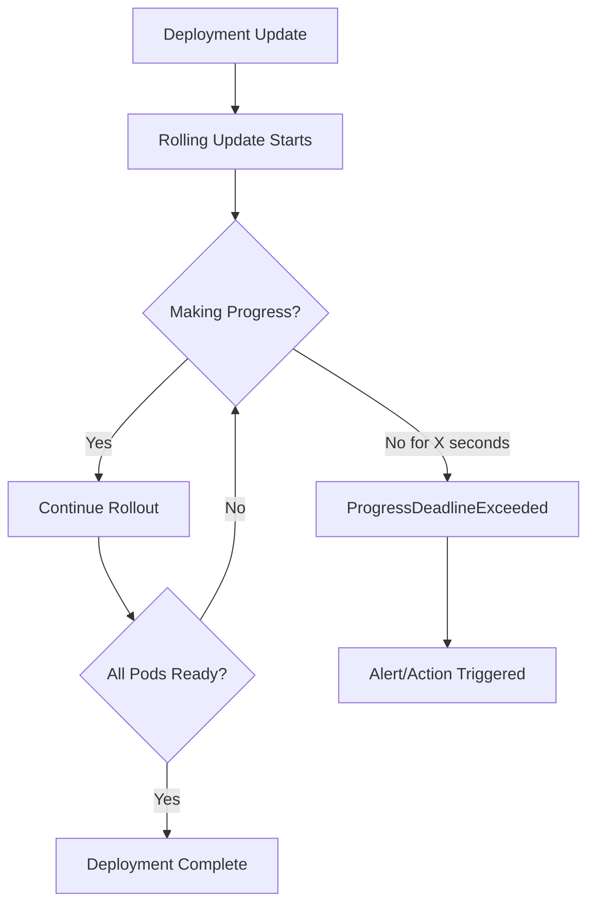
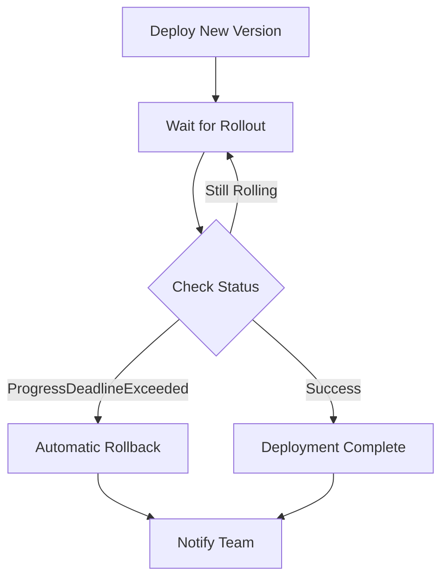
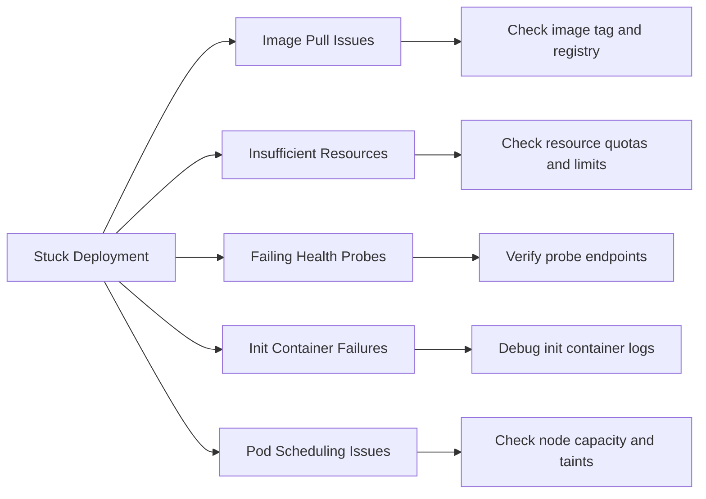

# How to Implement Deployment Progress Deadline

Author: [nawazdhandala](https://github.com/nawazdhandala)

Tags: Kubernetes, Deployments, Timeout, Progress

Description: Learn to implement deployment progress deadline for automatic rollback on stuck deployments.

---

Deployments can get stuck. A bad image tag, a failing health check, or insufficient cluster resources can leave your rollout hanging indefinitely. Without intervention, your team might not notice until users start complaining.

Kubernetes provides a built-in mechanism to handle this: the progress deadline. This setting tells Kubernetes how long to wait for a deployment to make progress before marking it as failed. Combined with proper monitoring and rollback strategies, progress deadlines prevent stuck deployments from becoming production incidents.

## How Deployment Progress Works

When you update a Deployment, Kubernetes creates new ReplicaSets and gradually transitions pods from the old version to the new one. During this process, Kubernetes tracks whether the deployment is making forward progress.

Progress means at least one of these conditions is true:

- New pods are becoming ready
- Old pods are being terminated
- New ReplicaSets are scaling up

If none of these happen within the progress deadline, Kubernetes marks the deployment condition as `ProgressDeadlineExceeded`.



## Configuring the Progress Deadline

The `progressDeadlineSeconds` field in your Deployment spec controls this timeout. The default is 600 seconds (10 minutes), which is often too long for production systems.

Set a progress deadline based on how long your pods typically take to become ready. Add buffer time for image pulls and initialization, but keep it tight enough to catch real problems quickly.

```yaml
apiVersion: apps/v1
kind: Deployment
metadata:
  name: api-server
  namespace: production
spec:
  # Number of seconds to wait for deployment progress
  # before considering the deployment stuck
  progressDeadlineSeconds: 180
  replicas: 3
  selector:
    matchLabels:
      app: api-server
  template:
    metadata:
      labels:
        app: api-server
    spec:
      containers:
        - name: api
          image: ghcr.io/example/api:v2.1.0
          # Readiness probe affects progress detection
          readinessProbe:
            httpGet:
              path: /health
              port: 8080
            initialDelaySeconds: 10
            periodSeconds: 5
```

## Choosing the Right Deadline Value

The progress deadline should be longer than your longest expected pod startup time but short enough to catch problems before they impact users. Consider these factors when setting the value.

| Factor | Impact on Deadline |
|--------|-------------------|
| Image size | Larger images need more pull time |
| Init containers | Add their execution time |
| Readiness probe delay | Include `initialDelaySeconds` |
| Application warmup | Database connections, cache priming |
| Node scaling | Time for cluster autoscaler to add nodes |

Here is a formula for calculating a reasonable deadline.

```
progressDeadlineSeconds =
    (image pull time) +
    (init container time) +
    (readiness probe initialDelaySeconds) +
    (application warmup) +
    (buffer for variability)
```

For most applications, a deadline between 120 and 300 seconds works well. Applications with heavy initialization or large images may need longer.

## Detecting Stuck Deployments

When a deployment exceeds its progress deadline, Kubernetes updates the deployment status. You can check this using kubectl or by monitoring the deployment conditions programmatically.

```bash
# Check deployment status
kubectl get deployment api-server -n production -o wide

# View detailed conditions including progress status
kubectl describe deployment api-server -n production | grep -A5 Conditions

# Watch for progress deadline events
kubectl get events -n production --field-selector reason=ProgressDeadlineExceeded
```

The deployment conditions will show the progress state.

```yaml
status:
  conditions:
    - type: Available
      status: "True"
    - type: Progressing
      status: "False"
      reason: ProgressDeadlineExceeded
      message: "Deployment does not have minimum availability"
```

## Automatic Rollback with CI/CD

The progress deadline becomes powerful when integrated with your CI/CD pipeline. Configure your deployment script to wait for the rollout and automatically roll back on failure.

This diagram shows the decision flow for automated deployments.



Here is a deployment script that handles progress deadline failures.

```bash
#!/bin/bash
# deploy.sh - Deploy with automatic rollback on stuck deployments

DEPLOYMENT_NAME="api-server"
NAMESPACE="production"
# Timeout should match progressDeadlineSeconds plus buffer
TIMEOUT="240s"

echo "Deploying ${DEPLOYMENT_NAME}..."

# Apply the deployment manifest
kubectl apply -f deployment.yaml

# Wait for rollout with timeout
# Returns non-zero exit code if deadline exceeded
if kubectl rollout status deployment/${DEPLOYMENT_NAME} \
    -n ${NAMESPACE} \
    --timeout=${TIMEOUT}; then
    echo "Deployment successful"
    exit 0
else
    echo "Deployment failed or timed out"

    # Check if it was a progress deadline issue
    CONDITION=$(kubectl get deployment ${DEPLOYMENT_NAME} \
        -n ${NAMESPACE} \
        -o jsonpath='{.status.conditions[?(@.type=="Progressing")].reason}')

    if [ "$CONDITION" == "ProgressDeadlineExceeded" ]; then
        echo "Progress deadline exceeded, rolling back..."
        kubectl rollout undo deployment/${DEPLOYMENT_NAME} -n ${NAMESPACE}

        # Wait for rollback to complete
        kubectl rollout status deployment/${DEPLOYMENT_NAME} \
            -n ${NAMESPACE} \
            --timeout=120s
    fi

    exit 1
fi
```

## Monitoring and Alerting

Set up alerts to notify your team when deployments get stuck. Use Prometheus metrics from kube-state-metrics to track deployment status.

This PrometheusRule creates alerts for deployment progress issues.

```yaml
apiVersion: monitoring.coreos.com/v1
kind: PrometheusRule
metadata:
  name: deployment-alerts
  namespace: monitoring
spec:
  groups:
    - name: deployment.rules
      rules:
        # Alert when deployment is stuck
        - alert: DeploymentProgressDeadlineExceeded
          expr: |
            kube_deployment_status_condition{
              condition="Progressing",
              status="false"
            } == 1
          for: 1m
          labels:
            severity: critical
          annotations:
            summary: "Deployment {{ $labels.deployment }} is stuck"
            description: "Deployment {{ $labels.deployment }} in namespace {{ $labels.namespace }} has exceeded its progress deadline"

        # Warning when deployment is taking longer than expected
        - alert: DeploymentRolloutSlow
          expr: |
            time() - kube_deployment_status_observed_generation{} > 300
            and
            kube_deployment_spec_replicas != kube_deployment_status_ready_replicas
          for: 2m
          labels:
            severity: warning
          annotations:
            summary: "Deployment {{ $labels.deployment }} rollout is slow"
```

## Common Causes of Stuck Deployments

Understanding why deployments get stuck helps you prevent issues and set appropriate deadlines. Here are the most common causes.



### Image Pull Failures

Wrong image tags or registry authentication issues prevent pods from starting. Always verify image accessibility before deploying.

```bash
# Check for image pull errors
kubectl describe pod -l app=api-server -n production | grep -A3 "Warning"

# Verify image exists and is pullable
kubectl run test-pull --image=ghcr.io/example/api:v2.1.0 --dry-run=server
```

### Resource Constraints

Pods cannot schedule when the cluster lacks sufficient CPU, memory, or GPU resources. Resource quotas may also block pod creation.

```bash
# Check pending pods and their events
kubectl get pods -n production -o wide | grep Pending

# View resource usage vs requests
kubectl top nodes
kubectl describe nodes | grep -A5 "Allocated resources"
```

### Failing Readiness Probes

If readiness probes never pass, Kubernetes keeps waiting for pods to become ready. Check your probe configuration and application health endpoints.

```bash
# Check probe failures in pod events
kubectl describe pod api-server-abc123 -n production | grep -A10 "Events"

# Test the health endpoint manually
kubectl exec -it api-server-abc123 -n production -- curl localhost:8080/health
```

## Best Practices

Follow these guidelines to get the most from deployment progress deadlines.

### Set Deadlines Per Application

Different applications have different startup characteristics. A lightweight API might be ready in 30 seconds while a Java application with heavy initialization might need 3 minutes.

```yaml
# Fast-starting application
apiVersion: apps/v1
kind: Deployment
metadata:
  name: nginx-proxy
spec:
  progressDeadlineSeconds: 120
  # ...

---
# Slow-starting application
apiVersion: apps/v1
kind: Deployment
metadata:
  name: analytics-engine
spec:
  progressDeadlineSeconds: 600
  # ...
```

### Combine with Rolling Update Strategy

The progress deadline works with your rolling update configuration. Set `maxUnavailable: 0` to prevent downtime and ensure the deadline catches issues before affecting users.

```yaml
spec:
  progressDeadlineSeconds: 180
  strategy:
    type: RollingUpdate
    rollingUpdate:
      # Never reduce capacity during rollout
      maxUnavailable: 0
      # Allow one extra pod for faster rollout
      maxSurge: 1
```

### Use with Pod Disruption Budgets

Pod Disruption Budgets (PDBs) protect running pods during voluntary disruptions. Combined with progress deadlines, they ensure your application stays available even when deployments fail.

```yaml
apiVersion: policy/v1
kind: PodDisruptionBudget
metadata:
  name: api-server-pdb
  namespace: production
spec:
  # Always keep at least 2 pods running
  minAvailable: 2
  selector:
    matchLabels:
      app: api-server
```

### Test Deadlines in Staging

Before deploying to production, verify your progress deadline catches real issues. Intentionally deploy a broken image in staging to confirm the deadline triggers and your rollback process works.

```bash
# Deploy a non-existent image to test deadline behavior
kubectl set image deployment/api-server \
    api=ghcr.io/example/api:nonexistent \
    -n staging

# Watch for the deadline to trigger
kubectl rollout status deployment/api-server -n staging --timeout=200s
```

---

Progress deadlines transform Kubernetes deployments from fire-and-forget operations into self-healing workflows. Set appropriate timeouts, integrate with your CI/CD pipeline, and configure alerts. Your deployments will either complete successfully or fail fast with automatic recovery.

Start with a deadline slightly longer than your typical deployment time, then tighten it based on observed behavior. The goal is catching stuck deployments before users notice while avoiding false positives from normal variation in pod startup times.
