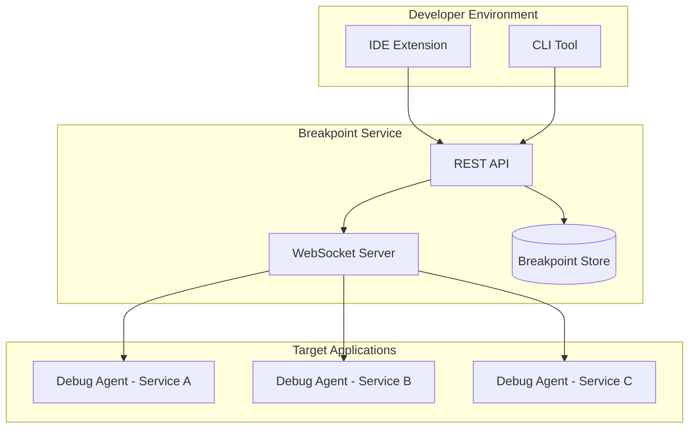
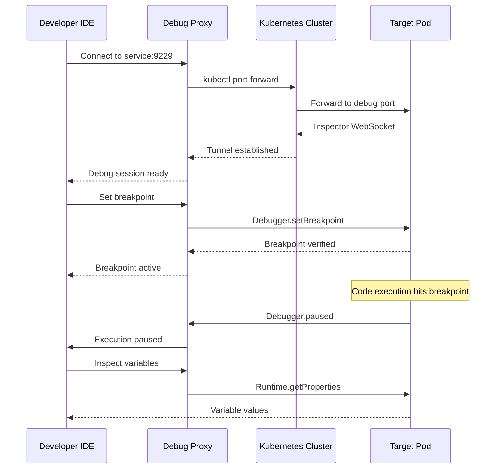
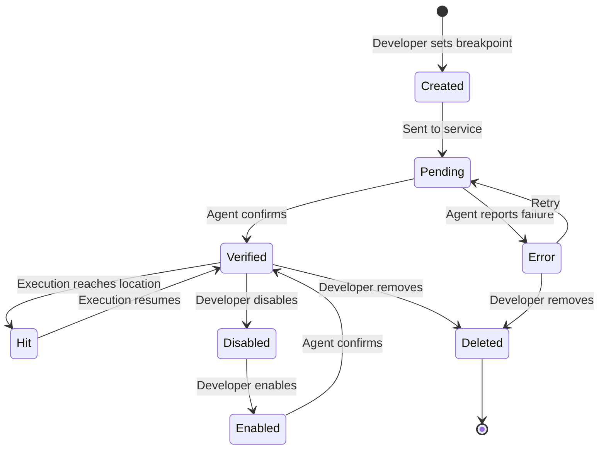

# How to Create Breakpoint Management

Author: [nawazdhandala](https://github.com/nawazdhandala)

Tags: Developer Experience, Debugging, Breakpoints, IDE

Description: Learn to create breakpoint management for effective debugging in distributed systems.

---

Debugging distributed systems requires more than just printing log statements. Modern applications span multiple services, run in containers, and scale across clusters. A well-designed breakpoint management system transforms chaotic debugging sessions into systematic investigations. This guide walks you through building a comprehensive breakpoint management solution that handles conditional breakpoints, logpoints, and remote debugging.

## Why Breakpoint Management Matters

Traditional debugging falls apart when your application runs across multiple services:

| Challenge | Impact |
|-----------|--------|
| **Scattered breakpoints** | Developers lose track of where debug points exist |
| **No persistence** | Breakpoints disappear after IDE restart |
| **Team isolation** | Each developer debugs independently without sharing context |
| **Production blindness** | Cannot debug issues that only appear in production |

A centralized breakpoint management system solves these problems by providing a unified interface for creating, tracking, and sharing debug configurations.

## Architecture Overview

The breakpoint management system consists of four core components:



## Core Data Model

Start by defining the breakpoint data structure that supports all breakpoint types:

```typescript
// breakpoint.types.ts
// Core type definitions for the breakpoint management system.
// These types support standard breakpoints, conditional breakpoints,
// and logpoints across multiple target applications.

export enum BreakpointType {
  STANDARD = 'standard',      // Pauses execution
  CONDITIONAL = 'conditional', // Pauses only when condition is true
  LOGPOINT = 'logpoint',       // Logs message without pausing
  HITCOUNT = 'hitcount'        // Pauses after N hits
}

export enum BreakpointState {
  ENABLED = 'enabled',
  DISABLED = 'disabled',
  PENDING = 'pending',   // Waiting for agent connection
  VERIFIED = 'verified', // Agent confirmed breakpoint is set
  ERROR = 'error'        // Failed to set breakpoint
}

export interface BreakpointLocation {
  // File path relative to project root for portability
  filePath: string;

  // 1-indexed line number where breakpoint is set
  lineNumber: number;

  // Optional column for expression-level breakpoints
  columnNumber?: number;
}

export interface Breakpoint {
  // Unique identifier for this breakpoint
  id: string;

  // Human-readable name for easy identification
  name?: string;

  // Type determines breakpoint behavior
  type: BreakpointType;

  // Current state in the breakpoint lifecycle
  state: BreakpointState;

  // Where the breakpoint is located
  location: BreakpointLocation;

  // Condition expression for CONDITIONAL type
  // Example: "user.id === 123 && request.method === 'POST'"
  condition?: string;

  // Message template for LOGPOINT type
  // Supports interpolation: "User {user.name} made request to {url}"
  logMessage?: string;

  // Hit count threshold for HITCOUNT type
  hitCount?: number;

  // Current hit count (tracked by agent)
  currentHitCount: number;

  // Target service identifier
  serviceId: string;

  // Environment (development, staging, production)
  environment: string;

  // Creator information for team collaboration
  createdBy: string;
  createdAt: Date;
  updatedAt: Date;

  // Tags for organization and filtering
  tags: string[];
}

export interface BreakpointGroup {
  // Group identifier
  id: string;

  // Group name for display
  name: string;

  // Description of what this group debugs
  description?: string;

  // Breakpoints in this group
  breakpointIds: string[];

  // Enable or disable entire group at once
  enabled: boolean;
}
```

## Building the Breakpoint Store

The store manages breakpoint persistence and provides querying capabilities:

```typescript
// breakpoint.store.ts
// Manages breakpoint storage with support for persistence,
// querying, and real-time updates via event emitters.

import { EventEmitter } from 'events';
import {
  Breakpoint,
  BreakpointType,
  BreakpointState,
  BreakpointGroup
} from './breakpoint.types';

// Storage interface allows swapping backends
// (in-memory, Redis, PostgreSQL, etc.)
interface StorageBackend {
  get(key: string): Promise<string | null>;
  set(key: string, value: string): Promise<void>;
  delete(key: string): Promise<void>;
  keys(pattern: string): Promise<string[]>;
}

export class BreakpointStore extends EventEmitter {
  private storage: StorageBackend;
  private prefix = 'breakpoint:';
  private groupPrefix = 'group:';

  constructor(storage: StorageBackend) {
    super();
    this.storage = storage;
  }

  // Generate a unique breakpoint ID
  private generateId(): string {
    return `bp_${Date.now()}_${Math.random().toString(36).substr(2, 9)}`;
  }

  // Create a new breakpoint with validation
  async createBreakpoint(
    input: Omit<Breakpoint, 'id' | 'createdAt' | 'updatedAt' | 'currentHitCount' | 'state'>
  ): Promise<Breakpoint> {
    // Validate required fields based on type
    this.validateBreakpointInput(input);

    const breakpoint: Breakpoint = {
      ...input,
      id: this.generateId(),
      state: BreakpointState.PENDING,
      currentHitCount: 0,
      createdAt: new Date(),
      updatedAt: new Date()
    };

    await this.storage.set(
      this.prefix + breakpoint.id,
      JSON.stringify(breakpoint)
    );

    // Emit event for real-time sync
    this.emit('breakpoint:created', breakpoint);

    return breakpoint;
  }

  // Validate breakpoint based on its type
  private validateBreakpointInput(
    input: Omit<Breakpoint, 'id' | 'createdAt' | 'updatedAt' | 'currentHitCount' | 'state'>
  ): void {
    if (!input.location.filePath || !input.location.lineNumber) {
      throw new Error('Breakpoint requires file path and line number');
    }

    if (input.type === BreakpointType.CONDITIONAL && !input.condition) {
      throw new Error('Conditional breakpoint requires a condition expression');
    }

    if (input.type === BreakpointType.LOGPOINT && !input.logMessage) {
      throw new Error('Logpoint requires a log message template');
    }

    if (input.type === BreakpointType.HITCOUNT && !input.hitCount) {
      throw new Error('Hit count breakpoint requires a hit count threshold');
    }
  }

  // Retrieve a breakpoint by ID
  async getBreakpoint(id: string): Promise<Breakpoint | null> {
    const data = await this.storage.get(this.prefix + id);
    if (!data) return null;

    return JSON.parse(data) as Breakpoint;
  }

  // Update breakpoint properties
  async updateBreakpoint(
    id: string,
    updates: Partial<Omit<Breakpoint, 'id' | 'createdAt'>>
  ): Promise<Breakpoint> {
    const existing = await this.getBreakpoint(id);
    if (!existing) {
      throw new Error(`Breakpoint ${id} not found`);
    }

    const updated: Breakpoint = {
      ...existing,
      ...updates,
      updatedAt: new Date()
    };

    await this.storage.set(this.prefix + id, JSON.stringify(updated));

    this.emit('breakpoint:updated', updated);

    return updated;
  }

  // Delete a breakpoint
  async deleteBreakpoint(id: string): Promise<void> {
    const breakpoint = await this.getBreakpoint(id);
    if (!breakpoint) return;

    await this.storage.delete(this.prefix + id);

    this.emit('breakpoint:deleted', breakpoint);
  }

  // Query breakpoints with filters
  async queryBreakpoints(filters: {
    serviceId?: string;
    environment?: string;
    type?: BreakpointType;
    state?: BreakpointState;
    createdBy?: string;
    tags?: string[];
    filePath?: string;
  }): Promise<Breakpoint[]> {
    const keys = await this.storage.keys(this.prefix + '*');
    const breakpoints: Breakpoint[] = [];

    for (const key of keys) {
      const data = await this.storage.get(key);
      if (!data) continue;

      const bp = JSON.parse(data) as Breakpoint;

      // Apply filters
      if (filters.serviceId && bp.serviceId !== filters.serviceId) continue;
      if (filters.environment && bp.environment !== filters.environment) continue;
      if (filters.type && bp.type !== filters.type) continue;
      if (filters.state && bp.state !== filters.state) continue;
      if (filters.createdBy && bp.createdBy !== filters.createdBy) continue;
      if (filters.filePath && !bp.location.filePath.includes(filters.filePath)) continue;
      if (filters.tags && filters.tags.length > 0) {
        const hasAllTags = filters.tags.every(tag => bp.tags.includes(tag));
        if (!hasAllTags) continue;
      }

      breakpoints.push(bp);
    }

    return breakpoints;
  }

  // Create a breakpoint group for batch operations
  async createGroup(
    name: string,
    description?: string
  ): Promise<BreakpointGroup> {
    const group: BreakpointGroup = {
      id: `grp_${Date.now()}`,
      name,
      description,
      breakpointIds: [],
      enabled: true
    };

    await this.storage.set(
      this.groupPrefix + group.id,
      JSON.stringify(group)
    );

    return group;
  }

  // Add breakpoints to a group
  async addToGroup(groupId: string, breakpointIds: string[]): Promise<void> {
    const data = await this.storage.get(this.groupPrefix + groupId);
    if (!data) throw new Error(`Group ${groupId} not found`);

    const group = JSON.parse(data) as BreakpointGroup;
    group.breakpointIds = [...new Set([...group.breakpointIds, ...breakpointIds])];

    await this.storage.set(this.groupPrefix + groupId, JSON.stringify(group));
  }

  // Toggle all breakpoints in a group
  async toggleGroup(groupId: string, enabled: boolean): Promise<void> {
    const data = await this.storage.get(this.groupPrefix + groupId);
    if (!data) throw new Error(`Group ${groupId} not found`);

    const group = JSON.parse(data) as BreakpointGroup;
    group.enabled = enabled;

    // Update all breakpoints in the group
    for (const bpId of group.breakpointIds) {
      await this.updateBreakpoint(bpId, {
        state: enabled ? BreakpointState.ENABLED : BreakpointState.DISABLED
      });
    }

    await this.storage.set(this.groupPrefix + groupId, JSON.stringify(group));
  }
}
```

## Implementing Conditional Breakpoints

Conditional breakpoints are powerful for debugging specific scenarios without stopping on every hit:

```typescript
// conditional.evaluator.ts
// Safely evaluates breakpoint conditions in a sandboxed context.
// Supports common debugging expressions without allowing arbitrary code execution.

import * as vm from 'vm';

export interface EvaluationContext {
  // Local variables in scope at breakpoint
  locals: Record<string, unknown>;

  // Current this binding
  thisArg?: unknown;

  // Call stack information
  callStack: string[];

  // Request context for web applications
  request?: {
    method: string;
    url: string;
    headers: Record<string, string>;
    body?: unknown;
  };
}

export class ConditionEvaluator {
  // Maximum time allowed for condition evaluation (prevent infinite loops)
  private timeout = 100; // milliseconds

  // Evaluate a condition expression safely
  evaluate(condition: string, context: EvaluationContext): boolean {
    // Create a sandboxed context with only the allowed variables
    const sandbox = this.createSandbox(context);

    try {
      // Run the condition in a VM with timeout
      const script = new vm.Script(`(${condition})`);
      const result = script.runInNewContext(sandbox, {
        timeout: this.timeout,
        displayErrors: false
      });

      return Boolean(result);
    } catch (error) {
      // Log evaluation errors but don't crash
      console.warn(`Condition evaluation failed: ${condition}`, error);
      return false;
    }
  }

  // Create a restricted sandbox for safe evaluation
  private createSandbox(context: EvaluationContext): vm.Context {
    // Start with local variables
    const sandbox: Record<string, unknown> = { ...context.locals };

    // Add this binding if available
    if (context.thisArg !== undefined) {
      sandbox['this'] = context.thisArg;
    }

    // Add request context for web debugging
    if (context.request) {
      sandbox['request'] = context.request;
      sandbox['req'] = context.request; // Shorthand
    }

    // Add safe utility functions
    sandbox['typeof'] = (val: unknown) => typeof val;
    sandbox['Array'] = { isArray: Array.isArray };
    sandbox['Object'] = { keys: Object.keys, values: Object.values };
    sandbox['JSON'] = { stringify: JSON.stringify };

    // Add comparison helpers
    sandbox['includes'] = (arr: unknown[], val: unknown) => arr.includes(val);
    sandbox['startsWith'] = (str: string, prefix: string) => str.startsWith(prefix);
    sandbox['endsWith'] = (str: string, suffix: string) => str.endsWith(suffix);
    sandbox['matches'] = (str: string, pattern: string) => new RegExp(pattern).test(str);

    return vm.createContext(sandbox);
  }

  // Validate condition syntax without executing
  validateCondition(condition: string): { valid: boolean; error?: string } {
    try {
      // Try to parse the condition
      new vm.Script(`(${condition})`);
      return { valid: true };
    } catch (error) {
      return {
        valid: false,
        error: error instanceof Error ? error.message : 'Invalid syntax'
      };
    }
  }

  // Parse condition to extract referenced variables
  extractVariables(condition: string): string[] {
    // Simple regex-based extraction
    // Matches identifiers that aren't keywords
    const identifierPattern = /\b([a-zA-Z_$][a-zA-Z0-9_$]*)\b/g;
    const keywords = new Set([
      'true', 'false', 'null', 'undefined',
      'typeof', 'instanceof', 'in', 'of',
      'if', 'else', 'return', 'this',
      'new', 'delete', 'void'
    ]);

    const matches = condition.matchAll(identifierPattern);
    const variables = new Set<string>();

    for (const match of matches) {
      const identifier = match[1];
      if (!keywords.has(identifier)) {
        variables.add(identifier);
      }
    }

    return Array.from(variables);
  }
}

// Example conditional breakpoint configurations
export const CONDITION_EXAMPLES = {
  // Break when specific user ID is encountered
  specificUser: 'user.id === 12345',

  // Break on error responses
  errorResponse: 'response.status >= 400',

  // Break on specific request method and path
  postToApi: 'request.method === "POST" && request.url.startsWith("/api/")',

  // Break when array is empty (edge case debugging)
  emptyArray: 'items.length === 0',

  // Break on null or undefined
  nullCheck: 'result === null || result === undefined',

  // Break when value exceeds threshold
  performanceThreshold: 'duration > 1000',

  // Break on specific error type
  specificError: 'error.code === "ECONNREFUSED"',

  // Complex condition with multiple checks
  complexCondition: `
    user.role === "admin" &&
    request.method === "DELETE" &&
    !request.headers["x-confirmed"]
  `.trim()
};
```

## Building Logpoints for Non-Intrusive Debugging

Logpoints let you add logging statements without modifying code or pausing execution:

```typescript
// logpoint.processor.ts
// Processes logpoint messages with variable interpolation,
// formatting, and safe output to various logging backends.

import { Breakpoint, BreakpointType } from './breakpoint.types';
import { EvaluationContext, ConditionEvaluator } from './conditional.evaluator';

export interface LogOutput {
  // Timestamp when logpoint was hit
  timestamp: Date;

  // Breakpoint that generated this log
  breakpointId: string;

  // Formatted message with interpolated values
  message: string;

  // Raw values that were interpolated
  interpolatedValues: Record<string, unknown>;

  // Location information
  location: {
    file: string;
    line: number;
    function?: string;
  };

  // Trace context for correlation
  traceId?: string;
  spanId?: string;
}

export class LogpointProcessor {
  private evaluator: ConditionEvaluator;
  private outputHandlers: Array<(output: LogOutput) => void> = [];

  constructor() {
    this.evaluator = new ConditionEvaluator();
  }

  // Register a handler for log output
  onOutput(handler: (output: LogOutput) => void): void {
    this.outputHandlers.push(handler);
  }

  // Process a logpoint hit
  processLogpoint(
    breakpoint: Breakpoint,
    context: EvaluationContext,
    traceContext?: { traceId: string; spanId: string }
  ): LogOutput | null {
    // Verify this is actually a logpoint
    if (breakpoint.type !== BreakpointType.LOGPOINT) {
      return null;
    }

    if (!breakpoint.logMessage) {
      return null;
    }

    // Interpolate the message template
    const { message, values } = this.interpolateMessage(
      breakpoint.logMessage,
      context
    );

    const output: LogOutput = {
      timestamp: new Date(),
      breakpointId: breakpoint.id,
      message,
      interpolatedValues: values,
      location: {
        file: breakpoint.location.filePath,
        line: breakpoint.location.lineNumber
      },
      traceId: traceContext?.traceId,
      spanId: traceContext?.spanId
    };

    // Notify all output handlers
    for (const handler of this.outputHandlers) {
      try {
        handler(output);
      } catch (error) {
        console.error('Logpoint handler error:', error);
      }
    }

    return output;
  }

  // Interpolate variables in message template
  // Supports: "User {user.name} requested {url}"
  private interpolateMessage(
    template: string,
    context: EvaluationContext
  ): { message: string; values: Record<string, unknown> } {
    const values: Record<string, unknown> = {};

    // Match {expression} patterns
    const interpolationPattern = /\{([^}]+)\}/g;

    const message = template.replace(interpolationPattern, (match, expression) => {
      try {
        // Create evaluation context for this expression
        const sandbox = { ...context.locals };
        if (context.request) {
          sandbox['request'] = context.request;
        }

        // Evaluate the expression
        const value = this.evaluateExpression(expression.trim(), sandbox);
        values[expression.trim()] = value;

        return this.formatValue(value);
      } catch {
        // Return placeholder on error
        values[expression.trim()] = '<error>';
        return `{${expression}:error}`;
      }
    });

    return { message, values };
  }

  // Safely evaluate an expression for interpolation
  private evaluateExpression(
    expression: string,
    context: Record<string, unknown>
  ): unknown {
    // Handle simple property access
    const parts = expression.split('.');
    let value: unknown = context;

    for (const part of parts) {
      if (value === null || value === undefined) {
        return undefined;
      }

      // Handle array indexing: items[0]
      const arrayMatch = part.match(/^(\w+)\[(\d+)\]$/);
      if (arrayMatch) {
        const [, prop, index] = arrayMatch;
        value = (value as Record<string, unknown>)[prop];
        if (Array.isArray(value)) {
          value = value[parseInt(index, 10)];
        }
      } else {
        value = (value as Record<string, unknown>)[part];
      }
    }

    return value;
  }

  // Format a value for display in log message
  private formatValue(value: unknown): string {
    if (value === undefined) return 'undefined';
    if (value === null) return 'null';

    if (typeof value === 'string') return value;
    if (typeof value === 'number') return value.toString();
    if (typeof value === 'boolean') return value.toString();

    if (Array.isArray(value)) {
      if (value.length <= 3) {
        return JSON.stringify(value);
      }
      return `[${value.length} items]`;
    }

    if (typeof value === 'object') {
      const keys = Object.keys(value);
      if (keys.length <= 3) {
        return JSON.stringify(value);
      }
      return `{${keys.length} properties}`;
    }

    return String(value);
  }
}

// Example logpoint message templates
export const LOGPOINT_TEMPLATES = {
  // Simple variable logging
  simpleVariable: 'Value of x: {x}',

  // Object property access
  objectProperty: 'User: {user.name} (ID: {user.id})',

  // Request logging
  requestLog: '[{request.method}] {request.url} from {request.headers.host}',

  // Array inspection
  arrayLog: 'Processing {items.length} items, first: {items[0].name}',

  // Performance logging
  performanceLog: 'Operation took {duration}ms with {result.count} results',

  // Error context
  errorContext: 'Error in {functionName}: {error.message}',

  // State change tracking
  stateChange: 'State changed from {previousState} to {currentState}'
};
```

## Debug Agent for Target Applications

The debug agent runs inside your application and manages breakpoint execution:

```typescript
// debug.agent.ts
// Debug agent that runs inside target applications.
// Connects to the breakpoint service and handles breakpoint execution.

import * as inspector from 'inspector';
import WebSocket from 'ws';
import {
  Breakpoint,
  BreakpointType,
  BreakpointState
} from './breakpoint.types';
import { ConditionEvaluator, EvaluationContext } from './conditional.evaluator';
import { LogpointProcessor } from './logpoint.processor';

// Message types for WebSocket communication
interface AgentMessage {
  type: 'register' | 'breakpoint_set' | 'breakpoint_hit' | 'breakpoint_error' | 'log_output';
  payload: unknown;
}

interface ServerMessage {
  type: 'set_breakpoint' | 'remove_breakpoint' | 'update_breakpoint' | 'ping';
  payload: unknown;
}

export class DebugAgent {
  private ws: WebSocket | null = null;
  private session: inspector.Session;
  private serviceId: string;
  private environment: string;
  private breakpoints: Map<string, Breakpoint> = new Map();
  private scriptMap: Map<string, string> = new Map(); // scriptId -> filePath
  private conditionEvaluator: ConditionEvaluator;
  private logpointProcessor: LogpointProcessor;
  private reconnectInterval: NodeJS.Timeout | null = null;

  constructor(config: {
    serviceId: string;
    environment: string;
    serverUrl: string;
  }) {
    this.serviceId = config.serviceId;
    this.environment = config.environment;
    this.session = new inspector.Session();
    this.conditionEvaluator = new ConditionEvaluator();
    this.logpointProcessor = new LogpointProcessor();

    // Set up logpoint output handler
    this.logpointProcessor.onOutput((output) => {
      this.sendMessage({
        type: 'log_output',
        payload: output
      });
    });

    this.connect(config.serverUrl);
  }

  // Connect to the breakpoint service
  private connect(serverUrl: string): void {
    this.ws = new WebSocket(serverUrl);

    this.ws.on('open', () => {
      console.log('[DebugAgent] Connected to breakpoint service');
      this.register();
      this.startInspectorSession();
    });

    this.ws.on('message', (data) => {
      try {
        const message = JSON.parse(data.toString()) as ServerMessage;
        this.handleServerMessage(message);
      } catch (error) {
        console.error('[DebugAgent] Failed to parse message:', error);
      }
    });

    this.ws.on('close', () => {
      console.log('[DebugAgent] Disconnected, attempting reconnect...');
      this.scheduleReconnect(serverUrl);
    });

    this.ws.on('error', (error) => {
      console.error('[DebugAgent] WebSocket error:', error);
    });
  }

  // Register this agent with the service
  private register(): void {
    this.sendMessage({
      type: 'register',
      payload: {
        serviceId: this.serviceId,
        environment: this.environment,
        pid: process.pid,
        nodeVersion: process.version,
        startTime: new Date().toISOString()
      }
    });
  }

  // Start the inspector session for breakpoint management
  private startInspectorSession(): void {
    this.session.connect();

    // Enable debugger
    this.session.post('Debugger.enable');

    // Track loaded scripts
    this.session.on('Debugger.scriptParsed', (event) => {
      const { scriptId, url } = event.params;
      if (url && !url.startsWith('internal/') && !url.includes('node_modules')) {
        this.scriptMap.set(scriptId, url);
      }
    });

    // Handle breakpoint hits
    this.session.on('Debugger.paused', (event) => {
      this.handlePause(event.params);
    });
  }

  // Handle server messages
  private handleServerMessage(message: ServerMessage): void {
    switch (message.type) {
      case 'set_breakpoint':
        this.setBreakpoint(message.payload as Breakpoint);
        break;

      case 'remove_breakpoint':
        this.removeBreakpoint((message.payload as { id: string }).id);
        break;

      case 'update_breakpoint':
        this.updateBreakpoint(message.payload as Partial<Breakpoint> & { id: string });
        break;

      case 'ping':
        // Respond to keep connection alive
        this.sendMessage({ type: 'register', payload: { pong: true } });
        break;
    }
  }

  // Set a breakpoint in the application
  private async setBreakpoint(breakpoint: Breakpoint): Promise<void> {
    try {
      // Find the script ID for this file
      const scriptId = this.findScriptId(breakpoint.location.filePath);

      if (!scriptId) {
        // File not loaded yet, store as pending
        this.breakpoints.set(breakpoint.id, {
          ...breakpoint,
          state: BreakpointState.PENDING
        });
        return;
      }

      // Set the breakpoint via inspector
      const response = await this.postAsync('Debugger.setBreakpoint', {
        location: {
          scriptId,
          lineNumber: breakpoint.location.lineNumber - 1, // 0-indexed
          columnNumber: breakpoint.location.columnNumber
        }
      });

      // Store breakpoint with V8 breakpoint ID
      this.breakpoints.set(breakpoint.id, {
        ...breakpoint,
        state: BreakpointState.VERIFIED,
        // Store V8 breakpoint ID for later removal
        _v8BreakpointId: (response as { breakpointId: string }).breakpointId
      } as Breakpoint & { _v8BreakpointId: string });

      this.sendMessage({
        type: 'breakpoint_set',
        payload: {
          id: breakpoint.id,
          state: BreakpointState.VERIFIED
        }
      });
    } catch (error) {
      console.error('[DebugAgent] Failed to set breakpoint:', error);

      this.sendMessage({
        type: 'breakpoint_error',
        payload: {
          id: breakpoint.id,
          error: error instanceof Error ? error.message : 'Unknown error'
        }
      });
    }
  }

  // Handle debugger pause event
  private async handlePause(params: {
    callFrames: Array<{
      callFrameId: string;
      functionName: string;
      location: { scriptId: string; lineNumber: number };
      scopeChain: Array<{ type: string; object: { objectId: string } }>;
    }>;
    reason: string;
    hitBreakpoints?: string[];
  }): Promise<void> {
    // Find which of our breakpoints was hit
    const hitBreakpoint = this.findHitBreakpoint(params);

    if (!hitBreakpoint) {
      // Not one of our managed breakpoints, resume
      this.session.post('Debugger.resume');
      return;
    }

    // Get evaluation context from call frame
    const context = await this.buildEvaluationContext(params.callFrames[0]);

    // Handle based on breakpoint type
    switch (hitBreakpoint.type) {
      case BreakpointType.CONDITIONAL:
        await this.handleConditionalBreakpoint(hitBreakpoint, context);
        break;

      case BreakpointType.LOGPOINT:
        this.handleLogpoint(hitBreakpoint, context);
        // Logpoints never pause, always resume
        this.session.post('Debugger.resume');
        break;

      case BreakpointType.HITCOUNT:
        await this.handleHitCountBreakpoint(hitBreakpoint, context);
        break;

      case BreakpointType.STANDARD:
      default:
        // Standard breakpoint, notify and stay paused
        this.notifyBreakpointHit(hitBreakpoint, context);
        break;
    }
  }

  // Handle conditional breakpoint logic
  private async handleConditionalBreakpoint(
    breakpoint: Breakpoint,
    context: EvaluationContext
  ): Promise<void> {
    if (!breakpoint.condition) {
      this.notifyBreakpointHit(breakpoint, context);
      return;
    }

    // Evaluate the condition
    const shouldPause = this.conditionEvaluator.evaluate(
      breakpoint.condition,
      context
    );

    if (shouldPause) {
      this.notifyBreakpointHit(breakpoint, context);
    } else {
      // Condition not met, resume execution
      this.session.post('Debugger.resume');
    }
  }

  // Handle logpoint (no pause)
  private handleLogpoint(
    breakpoint: Breakpoint,
    context: EvaluationContext
  ): void {
    this.logpointProcessor.processLogpoint(breakpoint, context);

    // Update hit count
    this.updateHitCount(breakpoint);
  }

  // Handle hit count breakpoint
  private async handleHitCountBreakpoint(
    breakpoint: Breakpoint,
    context: EvaluationContext
  ): Promise<void> {
    // Increment hit count
    const newCount = this.updateHitCount(breakpoint);

    // Check if we've reached the threshold
    if (newCount >= (breakpoint.hitCount || 1)) {
      this.notifyBreakpointHit(breakpoint, context);
      // Reset counter after hit
      this.breakpoints.set(breakpoint.id, {
        ...breakpoint,
        currentHitCount: 0
      });
    } else {
      // Haven't reached threshold yet, resume
      this.session.post('Debugger.resume');
    }
  }

  // Build evaluation context from call frame
  private async buildEvaluationContext(
    callFrame: {
      callFrameId: string;
      functionName: string;
      scopeChain: Array<{ type: string; object: { objectId: string } }>;
    }
  ): Promise<EvaluationContext> {
    const locals: Record<string, unknown> = {};

    // Extract local scope variables
    const localScope = callFrame.scopeChain.find(s => s.type === 'local');
    if (localScope) {
      const properties = await this.getObjectProperties(localScope.object.objectId);
      Object.assign(locals, properties);
    }

    return {
      locals,
      callStack: [callFrame.functionName]
    };
  }

  // Get object properties from inspector
  private async getObjectProperties(
    objectId: string
  ): Promise<Record<string, unknown>> {
    return new Promise((resolve) => {
      this.session.post(
        'Runtime.getProperties',
        { objectId, ownProperties: true },
        (err, result) => {
          if (err || !result) {
            resolve({});
            return;
          }

          const props: Record<string, unknown> = {};
          for (const prop of (result as { result: Array<{ name: string; value?: { value: unknown } }> }).result) {
            if (prop.value) {
              props[prop.name] = prop.value.value;
            }
          }
          resolve(props);
        }
      );
    });
  }

  // Utility: promisify session.post
  private postAsync(method: string, params?: object): Promise<unknown> {
    return new Promise((resolve, reject) => {
      this.session.post(method, params, (err, result) => {
        if (err) reject(err);
        else resolve(result);
      });
    });
  }

  // Find script ID by file path
  private findScriptId(filePath: string): string | undefined {
    for (const [scriptId, url] of this.scriptMap) {
      if (url.endsWith(filePath) || url.includes(filePath)) {
        return scriptId;
      }
    }
    return undefined;
  }

  // Find which breakpoint was hit
  private findHitBreakpoint(params: {
    callFrames: Array<{ location: { scriptId: string; lineNumber: number } }>;
    hitBreakpoints?: string[];
  }): Breakpoint | undefined {
    const frame = params.callFrames[0];
    const scriptPath = this.scriptMap.get(frame.location.scriptId);

    if (!scriptPath) return undefined;

    for (const bp of this.breakpoints.values()) {
      if (
        scriptPath.includes(bp.location.filePath) &&
        frame.location.lineNumber === bp.location.lineNumber - 1
      ) {
        return bp;
      }
    }

    return undefined;
  }

  // Update and return new hit count
  private updateHitCount(breakpoint: Breakpoint): number {
    const newCount = breakpoint.currentHitCount + 1;
    this.breakpoints.set(breakpoint.id, {
      ...breakpoint,
      currentHitCount: newCount
    });
    return newCount;
  }

  // Notify service of breakpoint hit
  private notifyBreakpointHit(
    breakpoint: Breakpoint,
    context: EvaluationContext
  ): void {
    this.sendMessage({
      type: 'breakpoint_hit',
      payload: {
        breakpointId: breakpoint.id,
        context: {
          locals: context.locals,
          callStack: context.callStack
        },
        timestamp: new Date().toISOString()
      }
    });
  }

  // Remove a breakpoint
  private removeBreakpoint(id: string): void {
    const bp = this.breakpoints.get(id) as (Breakpoint & { _v8BreakpointId?: string }) | undefined;
    if (!bp) return;

    if (bp._v8BreakpointId) {
      this.session.post('Debugger.removeBreakpoint', {
        breakpointId: bp._v8BreakpointId
      });
    }

    this.breakpoints.delete(id);
  }

  // Update a breakpoint
  private updateBreakpoint(update: Partial<Breakpoint> & { id: string }): void {
    const existing = this.breakpoints.get(update.id);
    if (!existing) return;

    this.breakpoints.set(update.id, { ...existing, ...update });
  }

  // Send message to server
  private sendMessage(message: AgentMessage): void {
    if (this.ws?.readyState === WebSocket.OPEN) {
      this.ws.send(JSON.stringify(message));
    }
  }

  // Schedule reconnection attempt
  private scheduleReconnect(serverUrl: string): void {
    if (this.reconnectInterval) return;

    this.reconnectInterval = setInterval(() => {
      console.log('[DebugAgent] Attempting reconnect...');
      this.connect(serverUrl);
    }, 5000);
  }

  // Clean shutdown
  shutdown(): void {
    if (this.reconnectInterval) {
      clearInterval(this.reconnectInterval);
    }
    this.session.disconnect();
    this.ws?.close();
  }
}
```

## Remote Debugging Architecture

For debugging distributed services, implement a remote debugging proxy:



Implement the remote debugging proxy:

```typescript
// remote.debug.proxy.ts
// Proxy server that enables remote debugging of containerized applications.
// Handles secure tunneling and connection management.

import * as net from 'net';
import * as http from 'http';
import { spawn, ChildProcess } from 'child_process';
import WebSocket, { WebSocketServer } from 'ws';

interface RemoteTarget {
  // Unique identifier for this target
  id: string;

  // Kubernetes namespace
  namespace: string;

  // Pod name
  podName: string;

  // Container name (optional if single container)
  containerName?: string;

  // Debug port inside container
  debugPort: number;

  // Local port for this tunnel
  localPort: number;

  // Tunnel process
  tunnel?: ChildProcess;

  // Connection status
  status: 'connecting' | 'connected' | 'error' | 'disconnected';
}

export class RemoteDebugProxy {
  private targets: Map<string, RemoteTarget> = new Map();
  private server: http.Server;
  private wss: WebSocketServer;
  private portCounter = 19229; // Starting port for tunnels

  constructor(port: number = 9339) {
    // HTTP server for REST API
    this.server = http.createServer(this.handleHttpRequest.bind(this));

    // WebSocket server for debug protocol forwarding
    this.wss = new WebSocketServer({ server: this.server });
    this.wss.on('connection', this.handleWebSocketConnection.bind(this));

    this.server.listen(port, () => {
      console.log(`[RemoteDebugProxy] Listening on port ${port}`);
    });
  }

  // Handle HTTP requests (REST API for target management)
  private handleHttpRequest(
    req: http.IncomingMessage,
    res: http.ServerResponse
  ): void {
    // Enable CORS for IDE extensions
    res.setHeader('Access-Control-Allow-Origin', '*');
    res.setHeader('Access-Control-Allow-Methods', 'GET, POST, DELETE');
    res.setHeader('Content-Type', 'application/json');

    const url = new URL(req.url || '/', `http://localhost`);

    if (req.method === 'GET' && url.pathname === '/json/list') {
      // Chrome DevTools compatible endpoint
      this.listTargets(res);
    } else if (req.method === 'POST' && url.pathname === '/targets') {
      // Add new remote target
      this.addTarget(req, res);
    } else if (req.method === 'DELETE' && url.pathname.startsWith('/targets/')) {
      // Remove target
      const targetId = url.pathname.split('/')[2];
      this.removeTarget(targetId, res);
    } else {
      res.statusCode = 404;
      res.end(JSON.stringify({ error: 'Not found' }));
    }
  }

  // List available debug targets (Chrome DevTools protocol compatible)
  private listTargets(res: http.ServerResponse): void {
    const targets = Array.from(this.targets.values())
      .filter(t => t.status === 'connected')
      .map(t => ({
        description: `${t.namespace}/${t.podName}`,
        devtoolsFrontendUrl: `devtools://devtools/bundled/js_app.html?ws=localhost:${t.localPort}`,
        id: t.id,
        title: `${t.podName} (${t.namespace})`,
        type: 'node',
        url: `ws://localhost:${t.localPort}`,
        webSocketDebuggerUrl: `ws://localhost:${t.localPort}`
      }));

    res.end(JSON.stringify(targets));
  }

  // Add a new remote debug target
  private async addTarget(
    req: http.IncomingMessage,
    res: http.ServerResponse
  ): Promise<void> {
    let body = '';
    req.on('data', chunk => { body += chunk; });
    req.on('end', async () => {
      try {
        const config = JSON.parse(body) as {
          namespace: string;
          podName: string;
          containerName?: string;
          debugPort?: number;
        };

        const target = await this.createTarget(config);
        res.statusCode = 201;
        res.end(JSON.stringify(target));
      } catch (error) {
        res.statusCode = 400;
        res.end(JSON.stringify({
          error: error instanceof Error ? error.message : 'Failed to add target'
        }));
      }
    });
  }

  // Create and connect to a remote target
  private async createTarget(config: {
    namespace: string;
    podName: string;
    containerName?: string;
    debugPort?: number;
  }): Promise<RemoteTarget> {
    const localPort = this.portCounter++;
    const debugPort = config.debugPort || 9229;

    const target: RemoteTarget = {
      id: `${config.namespace}-${config.podName}-${Date.now()}`,
      namespace: config.namespace,
      podName: config.podName,
      containerName: config.containerName,
      debugPort,
      localPort,
      status: 'connecting'
    };

    // Start kubectl port-forward
    const args = [
      'port-forward',
      '-n', config.namespace,
      `pod/${config.podName}`,
      `${localPort}:${debugPort}`
    ];

    if (config.containerName) {
      args.push('-c', config.containerName);
    }

    target.tunnel = spawn('kubectl', args);

    // Handle tunnel output
    target.tunnel.stdout?.on('data', (data) => {
      const output = data.toString();
      if (output.includes('Forwarding from')) {
        target.status = 'connected';
        console.log(`[RemoteDebugProxy] Tunnel established for ${target.id}`);
      }
    });

    target.tunnel.stderr?.on('data', (data) => {
      console.error(`[RemoteDebugProxy] Tunnel error: ${data}`);
      target.status = 'error';
    });

    target.tunnel.on('close', (code) => {
      console.log(`[RemoteDebugProxy] Tunnel closed with code ${code}`);
      target.status = 'disconnected';
      this.targets.delete(target.id);
    });

    this.targets.set(target.id, target);

    // Wait for connection with timeout
    await this.waitForConnection(target, 10000);

    return target;
  }

  // Wait for tunnel to be ready
  private waitForConnection(
    target: RemoteTarget,
    timeout: number
  ): Promise<void> {
    return new Promise((resolve, reject) => {
      const start = Date.now();

      const check = () => {
        if (target.status === 'connected') {
          resolve();
        } else if (target.status === 'error') {
          reject(new Error('Tunnel failed to connect'));
        } else if (Date.now() - start > timeout) {
          reject(new Error('Connection timeout'));
        } else {
          setTimeout(check, 100);
        }
      };

      check();
    });
  }

  // Handle WebSocket connections for debug protocol forwarding
  private handleWebSocketConnection(
    clientWs: WebSocket,
    req: http.IncomingMessage
  ): void {
    // Parse target from URL path: /ws/{targetId}
    const url = new URL(req.url || '/', 'http://localhost');
    const targetId = url.pathname.split('/')[2];

    const target = this.targets.get(targetId);
    if (!target || target.status !== 'connected') {
      clientWs.close(4004, 'Target not found or not connected');
      return;
    }

    // Connect to the actual debug target
    const targetWs = new WebSocket(`ws://localhost:${target.localPort}`);

    // Forward messages bidirectionally
    clientWs.on('message', (data) => {
      if (targetWs.readyState === WebSocket.OPEN) {
        targetWs.send(data);
      }
    });

    targetWs.on('message', (data) => {
      if (clientWs.readyState === WebSocket.OPEN) {
        clientWs.send(data);
      }
    });

    // Handle disconnections
    clientWs.on('close', () => {
      targetWs.close();
    });

    targetWs.on('close', () => {
      clientWs.close();
    });

    targetWs.on('error', (error) => {
      console.error(`[RemoteDebugProxy] Target connection error:`, error);
      clientWs.close(4005, 'Target connection error');
    });
  }

  // Remove a debug target
  private removeTarget(targetId: string, res: http.ServerResponse): void {
    const target = this.targets.get(targetId);

    if (!target) {
      res.statusCode = 404;
      res.end(JSON.stringify({ error: 'Target not found' }));
      return;
    }

    // Kill the tunnel process
    target.tunnel?.kill();
    this.targets.delete(targetId);

    res.end(JSON.stringify({ success: true }));
  }

  // Shutdown proxy
  shutdown(): void {
    // Close all tunnels
    for (const target of this.targets.values()) {
      target.tunnel?.kill();
    }

    this.wss.close();
    this.server.close();
  }
}
```

## IDE Extension Integration

Create a VS Code extension to manage breakpoints from the editor:

```typescript
// vscode-extension/breakpoint.provider.ts
// VS Code extension for breakpoint management integration.
// Provides UI for setting, viewing, and managing breakpoints.

import * as vscode from 'vscode';

// Types for breakpoint display
interface ManagedBreakpoint {
  id: string;
  name?: string;
  type: 'standard' | 'conditional' | 'logpoint' | 'hitcount';
  file: string;
  line: number;
  condition?: string;
  logMessage?: string;
  hitCount?: number;
  state: 'enabled' | 'disabled' | 'pending' | 'verified' | 'error';
  serviceId: string;
}

// Tree item for breakpoint display
class BreakpointTreeItem extends vscode.TreeItem {
  constructor(
    public readonly breakpoint: ManagedBreakpoint,
    public readonly collapsibleState: vscode.TreeItemCollapsibleState
  ) {
    // Create label with type indicator
    const typeIcon = {
      standard: '$(debug-breakpoint)',
      conditional: '$(debug-breakpoint-conditional)',
      logpoint: '$(debug-breakpoint-log)',
      hitcount: '$(debug-breakpoint-data)'
    }[breakpoint.type];

    super(`${typeIcon} ${breakpoint.name || breakpoint.file}:${breakpoint.line}`, collapsibleState);

    // Set description based on type
    if (breakpoint.type === 'conditional' && breakpoint.condition) {
      this.description = `when: ${breakpoint.condition}`;
    } else if (breakpoint.type === 'logpoint' && breakpoint.logMessage) {
      this.description = `log: ${breakpoint.logMessage}`;
    } else if (breakpoint.type === 'hitcount' && breakpoint.hitCount) {
      this.description = `hits: ${breakpoint.hitCount}`;
    }

    // Set context value for menu contributions
    this.contextValue = `breakpoint-${breakpoint.type}-${breakpoint.state}`;

    // Set icon based on state
    this.iconPath = this.getIconForState(breakpoint.state);

    // Add command to jump to breakpoint location
    this.command = {
      command: 'breakpointManager.gotoBreakpoint',
      title: 'Go to Breakpoint',
      arguments: [breakpoint]
    };
  }

  private getIconForState(state: string): vscode.ThemeIcon {
    switch (state) {
      case 'verified':
        return new vscode.ThemeIcon('check', new vscode.ThemeColor('debugIcon.breakpointForeground'));
      case 'pending':
        return new vscode.ThemeIcon('clock');
      case 'error':
        return new vscode.ThemeIcon('error', new vscode.ThemeColor('errorForeground'));
      case 'disabled':
        return new vscode.ThemeIcon('debug-breakpoint-disabled');
      default:
        return new vscode.ThemeIcon('debug-breakpoint');
    }
  }
}

// Tree data provider for breakpoint view
export class BreakpointProvider implements vscode.TreeDataProvider<BreakpointTreeItem> {
  private _onDidChangeTreeData = new vscode.EventEmitter<BreakpointTreeItem | undefined>();
  readonly onDidChangeTreeData = this._onDidChangeTreeData.event;

  private breakpoints: ManagedBreakpoint[] = [];
  private apiClient: BreakpointApiClient;

  constructor(apiClient: BreakpointApiClient) {
    this.apiClient = apiClient;
  }

  // Refresh the tree view
  refresh(): void {
    this._onDidChangeTreeData.fire(undefined);
  }

  // Load breakpoints from server
  async loadBreakpoints(): Promise<void> {
    try {
      this.breakpoints = await this.apiClient.listBreakpoints();
      this.refresh();
    } catch (error) {
      vscode.window.showErrorMessage(`Failed to load breakpoints: ${error}`);
    }
  }

  getTreeItem(element: BreakpointTreeItem): vscode.TreeItem {
    return element;
  }

  getChildren(element?: BreakpointTreeItem): BreakpointTreeItem[] {
    if (element) {
      // No children for individual breakpoints
      return [];
    }

    // Group breakpoints by service
    const byService = new Map<string, ManagedBreakpoint[]>();
    for (const bp of this.breakpoints) {
      const list = byService.get(bp.serviceId) || [];
      list.push(bp);
      byService.set(bp.serviceId, list);
    }

    // Create tree items
    return this.breakpoints.map(
      bp => new BreakpointTreeItem(bp, vscode.TreeItemCollapsibleState.None)
    );
  }

  // Add a conditional breakpoint at current cursor position
  async addConditionalBreakpoint(): Promise<void> {
    const editor = vscode.window.activeTextEditor;
    if (!editor) {
      vscode.window.showWarningMessage('No active editor');
      return;
    }

    // Prompt for condition
    const condition = await vscode.window.showInputBox({
      prompt: 'Enter breakpoint condition',
      placeHolder: 'e.g., user.id === 123',
      validateInput: (value) => {
        if (!value.trim()) {
          return 'Condition cannot be empty';
        }
        return null;
      }
    });

    if (!condition) return;

    // Get service ID from workspace config
    const serviceId = vscode.workspace.getConfiguration('breakpointManager').get<string>('serviceId');
    if (!serviceId) {
      vscode.window.showErrorMessage('Please configure breakpointManager.serviceId in settings');
      return;
    }

    try {
      const breakpoint = await this.apiClient.createBreakpoint({
        type: 'conditional',
        file: vscode.workspace.asRelativePath(editor.document.uri),
        line: editor.selection.active.line + 1,
        condition,
        serviceId
      });

      this.breakpoints.push(breakpoint);
      this.refresh();

      vscode.window.showInformationMessage(`Conditional breakpoint added: ${condition}`);
    } catch (error) {
      vscode.window.showErrorMessage(`Failed to add breakpoint: ${error}`);
    }
  }

  // Add a logpoint at current cursor position
  async addLogpoint(): Promise<void> {
    const editor = vscode.window.activeTextEditor;
    if (!editor) {
      vscode.window.showWarningMessage('No active editor');
      return;
    }

    // Prompt for log message
    const logMessage = await vscode.window.showInputBox({
      prompt: 'Enter log message (use {variable} for interpolation)',
      placeHolder: 'e.g., User {user.name} made request to {url}',
      validateInput: (value) => {
        if (!value.trim()) {
          return 'Log message cannot be empty';
        }
        return null;
      }
    });

    if (!logMessage) return;

    const serviceId = vscode.workspace.getConfiguration('breakpointManager').get<string>('serviceId');
    if (!serviceId) {
      vscode.window.showErrorMessage('Please configure breakpointManager.serviceId in settings');
      return;
    }

    try {
      const breakpoint = await this.apiClient.createBreakpoint({
        type: 'logpoint',
        file: vscode.workspace.asRelativePath(editor.document.uri),
        line: editor.selection.active.line + 1,
        logMessage,
        serviceId
      });

      this.breakpoints.push(breakpoint);
      this.refresh();

      vscode.window.showInformationMessage(`Logpoint added: ${logMessage}`);
    } catch (error) {
      vscode.window.showErrorMessage(`Failed to add logpoint: ${error}`);
    }
  }

  // Toggle breakpoint state
  async toggleBreakpoint(item: BreakpointTreeItem): Promise<void> {
    const newState = item.breakpoint.state === 'enabled' ? 'disabled' : 'enabled';

    try {
      await this.apiClient.updateBreakpoint(item.breakpoint.id, { state: newState });

      // Update local state
      const bp = this.breakpoints.find(b => b.id === item.breakpoint.id);
      if (bp) {
        bp.state = newState;
      }

      this.refresh();
    } catch (error) {
      vscode.window.showErrorMessage(`Failed to toggle breakpoint: ${error}`);
    }
  }

  // Delete a breakpoint
  async deleteBreakpoint(item: BreakpointTreeItem): Promise<void> {
    try {
      await this.apiClient.deleteBreakpoint(item.breakpoint.id);

      this.breakpoints = this.breakpoints.filter(b => b.id !== item.breakpoint.id);
      this.refresh();
    } catch (error) {
      vscode.window.showErrorMessage(`Failed to delete breakpoint: ${error}`);
    }
  }
}

// API client for breakpoint service
class BreakpointApiClient {
  private baseUrl: string;

  constructor(baseUrl: string) {
    this.baseUrl = baseUrl;
  }

  async listBreakpoints(): Promise<ManagedBreakpoint[]> {
    const response = await fetch(`${this.baseUrl}/breakpoints`);
    return response.json();
  }

  async createBreakpoint(data: Partial<ManagedBreakpoint>): Promise<ManagedBreakpoint> {
    const response = await fetch(`${this.baseUrl}/breakpoints`, {
      method: 'POST',
      headers: { 'Content-Type': 'application/json' },
      body: JSON.stringify(data)
    });
    return response.json();
  }

  async updateBreakpoint(id: string, updates: Partial<ManagedBreakpoint>): Promise<void> {
    await fetch(`${this.baseUrl}/breakpoints/${id}`, {
      method: 'PATCH',
      headers: { 'Content-Type': 'application/json' },
      body: JSON.stringify(updates)
    });
  }

  async deleteBreakpoint(id: string): Promise<void> {
    await fetch(`${this.baseUrl}/breakpoints/${id}`, { method: 'DELETE' });
  }
}

// Extension activation
export function activate(context: vscode.ExtensionContext): void {
  const serverUrl = vscode.workspace
    .getConfiguration('breakpointManager')
    .get<string>('serverUrl', 'http://localhost:3000');

  const apiClient = new BreakpointApiClient(serverUrl);
  const provider = new BreakpointProvider(apiClient);

  // Register tree view
  vscode.window.registerTreeDataProvider('breakpointManagerView', provider);

  // Register commands
  context.subscriptions.push(
    vscode.commands.registerCommand('breakpointManager.refresh', () => provider.loadBreakpoints()),
    vscode.commands.registerCommand('breakpointManager.addConditional', () => provider.addConditionalBreakpoint()),
    vscode.commands.registerCommand('breakpointManager.addLogpoint', () => provider.addLogpoint()),
    vscode.commands.registerCommand('breakpointManager.toggle', (item) => provider.toggleBreakpoint(item)),
    vscode.commands.registerCommand('breakpointManager.delete', (item) => provider.deleteBreakpoint(item)),
    vscode.commands.registerCommand('breakpointManager.gotoBreakpoint', (bp: ManagedBreakpoint) => {
      const uri = vscode.Uri.file(bp.file);
      vscode.window.showTextDocument(uri, {
        selection: new vscode.Range(bp.line - 1, 0, bp.line - 1, 0)
      });
    })
  );

  // Load breakpoints on activation
  provider.loadBreakpoints();
}
```

## Breakpoint Lifecycle Management

Track and manage breakpoint state through its lifecycle:



## Configuration and Best Practices

### Breakpoint Configuration File

Store breakpoint configurations for team sharing:

```yaml
# .breakpoints.yaml
# Shared breakpoint configuration for the team.
# These breakpoints are automatically loaded when the project opens.

version: "1.0"

# Default settings for all breakpoints
defaults:
  environment: development
  tags:
    - team-shared

# Breakpoint definitions
breakpoints:
  # Authentication debugging
  - name: auth-failure
    type: conditional
    location:
      file: src/auth/login.handler.ts
      line: 45
    condition: "result.success === false"
    tags:
      - auth
      - security

  # API request logging
  - name: api-request-log
    type: logpoint
    location:
      file: src/api/router.ts
      line: 12
    logMessage: "[{request.method}] {request.url} - User: {user?.id || 'anonymous'}"
    tags:
      - api
      - logging

  # Performance debugging
  - name: slow-query-detector
    type: conditional
    location:
      file: src/db/query.executor.ts
      line: 78
    condition: "queryTime > 1000"
    tags:
      - performance
      - database

  # Error handling
  - name: unhandled-error
    type: standard
    location:
      file: src/middleware/error.handler.ts
      line: 15
    tags:
      - errors

# Breakpoint groups for batch operations
groups:
  - name: auth-debugging
    description: All authentication related breakpoints
    breakpoints:
      - auth-failure
    enabled: true

  - name: performance-investigation
    description: Breakpoints for performance analysis
    breakpoints:
      - slow-query-detector
    enabled: false
```

### Best Practices for Breakpoint Management

| Practice | Description |
|----------|-------------|
| **Name your breakpoints** | Use descriptive names like "auth-failure" instead of relying on location |
| **Use conditional breakpoints** | Avoid stopping on every iteration when debugging loops |
| **Prefer logpoints in production** | Gather information without stopping execution |
| **Group related breakpoints** | Enable and disable sets of breakpoints together |
| **Clean up after debugging** | Remove breakpoints when investigation is complete |
| **Document conditions** | Add comments explaining why specific conditions are used |

## Testing Your Breakpoint System

Create integration tests to verify breakpoint behavior:

```typescript
// breakpoint.integration.test.ts
// Integration tests for the breakpoint management system.
// Verifies end-to-end functionality from API to agent execution.

import { BreakpointStore } from './breakpoint.store';
import { DebugAgent } from './debug.agent';
import { ConditionEvaluator } from './conditional.evaluator';
import { BreakpointType, BreakpointState } from './breakpoint.types';

describe('Breakpoint Management Integration', () => {
  let store: BreakpointStore;
  let evaluator: ConditionEvaluator;

  beforeEach(() => {
    // Use in-memory storage for tests
    const memoryStorage = new Map<string, string>();
    store = new BreakpointStore({
      get: async (key) => memoryStorage.get(key) || null,
      set: async (key, value) => { memoryStorage.set(key, value); },
      delete: async (key) => { memoryStorage.delete(key); },
      keys: async (pattern) => {
        const prefix = pattern.replace('*', '');
        return Array.from(memoryStorage.keys()).filter(k => k.startsWith(prefix));
      }
    });
    evaluator = new ConditionEvaluator();
  });

  describe('Breakpoint CRUD Operations', () => {
    it('should create a standard breakpoint', async () => {
      const bp = await store.createBreakpoint({
        type: BreakpointType.STANDARD,
        location: {
          filePath: 'src/app.ts',
          lineNumber: 42
        },
        serviceId: 'test-service',
        environment: 'test',
        createdBy: 'test-user',
        tags: ['test']
      });

      expect(bp.id).toBeDefined();
      expect(bp.state).toBe(BreakpointState.PENDING);
      expect(bp.currentHitCount).toBe(0);
    });

    it('should reject conditional breakpoint without condition', async () => {
      await expect(store.createBreakpoint({
        type: BreakpointType.CONDITIONAL,
        location: {
          filePath: 'src/app.ts',
          lineNumber: 42
        },
        serviceId: 'test-service',
        environment: 'test',
        createdBy: 'test-user',
        tags: []
        // Missing condition
      })).rejects.toThrow('Conditional breakpoint requires a condition expression');
    });

    it('should query breakpoints by service', async () => {
      await store.createBreakpoint({
        type: BreakpointType.STANDARD,
        location: { filePath: 'src/a.ts', lineNumber: 1 },
        serviceId: 'service-a',
        environment: 'test',
        createdBy: 'user',
        tags: []
      });

      await store.createBreakpoint({
        type: BreakpointType.STANDARD,
        location: { filePath: 'src/b.ts', lineNumber: 1 },
        serviceId: 'service-b',
        environment: 'test',
        createdBy: 'user',
        tags: []
      });

      const results = await store.queryBreakpoints({ serviceId: 'service-a' });
      expect(results).toHaveLength(1);
      expect(results[0].serviceId).toBe('service-a');
    });
  });

  describe('Condition Evaluation', () => {
    it('should evaluate simple equality condition', () => {
      const result = evaluator.evaluate('x === 5', {
        locals: { x: 5 },
        callStack: []
      });
      expect(result).toBe(true);
    });

    it('should evaluate complex condition with request context', () => {
      const result = evaluator.evaluate(
        'request.method === "POST" && user.role === "admin"',
        {
          locals: { user: { role: 'admin' } },
          callStack: [],
          request: { method: 'POST', url: '/api/users', headers: {} }
        }
      );
      expect(result).toBe(true);
    });

    it('should handle evaluation errors gracefully', () => {
      const result = evaluator.evaluate('nonexistent.property.access', {
        locals: {},
        callStack: []
      });
      // Should return false on error, not throw
      expect(result).toBe(false);
    });

    it('should timeout on infinite loops', () => {
      const result = evaluator.evaluate('while(true){}', {
        locals: {},
        callStack: []
      });
      // Should return false after timeout
      expect(result).toBe(false);
    });
  });

  describe('Breakpoint Groups', () => {
    it('should toggle all breakpoints in group', async () => {
      const bp1 = await store.createBreakpoint({
        type: BreakpointType.STANDARD,
        location: { filePath: 'src/a.ts', lineNumber: 1 },
        serviceId: 'service',
        environment: 'test',
        createdBy: 'user',
        tags: []
      });

      const bp2 = await store.createBreakpoint({
        type: BreakpointType.STANDARD,
        location: { filePath: 'src/b.ts', lineNumber: 1 },
        serviceId: 'service',
        environment: 'test',
        createdBy: 'user',
        tags: []
      });

      const group = await store.createGroup('test-group');
      await store.addToGroup(group.id, [bp1.id, bp2.id]);

      // Disable the group
      await store.toggleGroup(group.id, false);

      const updated1 = await store.getBreakpoint(bp1.id);
      const updated2 = await store.getBreakpoint(bp2.id);

      expect(updated1?.state).toBe(BreakpointState.DISABLED);
      expect(updated2?.state).toBe(BreakpointState.DISABLED);
    });
  });
});
```

## Summary

Building a comprehensive breakpoint management system requires attention to several key areas:

| Component | Purpose |
|-----------|---------|
| **Data Model** | Define flexible types supporting standard, conditional, logpoint, and hit count breakpoints |
| **Breakpoint Store** | Persist breakpoints with querying and grouping capabilities |
| **Condition Evaluator** | Safely evaluate expressions in sandboxed context |
| **Logpoint Processor** | Format and output log messages without pausing execution |
| **Debug Agent** | Run inside target applications to execute breakpoints |
| **Remote Proxy** | Enable debugging of containerized and distributed applications |
| **IDE Extension** | Provide intuitive interface for developers |

A well-designed breakpoint management system transforms debugging from a reactive, frustrating exercise into a proactive, systematic investigation. By supporting conditional breakpoints, logpoints, and remote debugging, you give your team the tools to understand complex distributed systems without constantly redeploying with print statements.

Start with the core breakpoint store and agent, then expand to remote debugging and IDE integration as your needs grow. The investment in proper debugging infrastructure pays dividends in reduced incident resolution time and improved developer experience.
