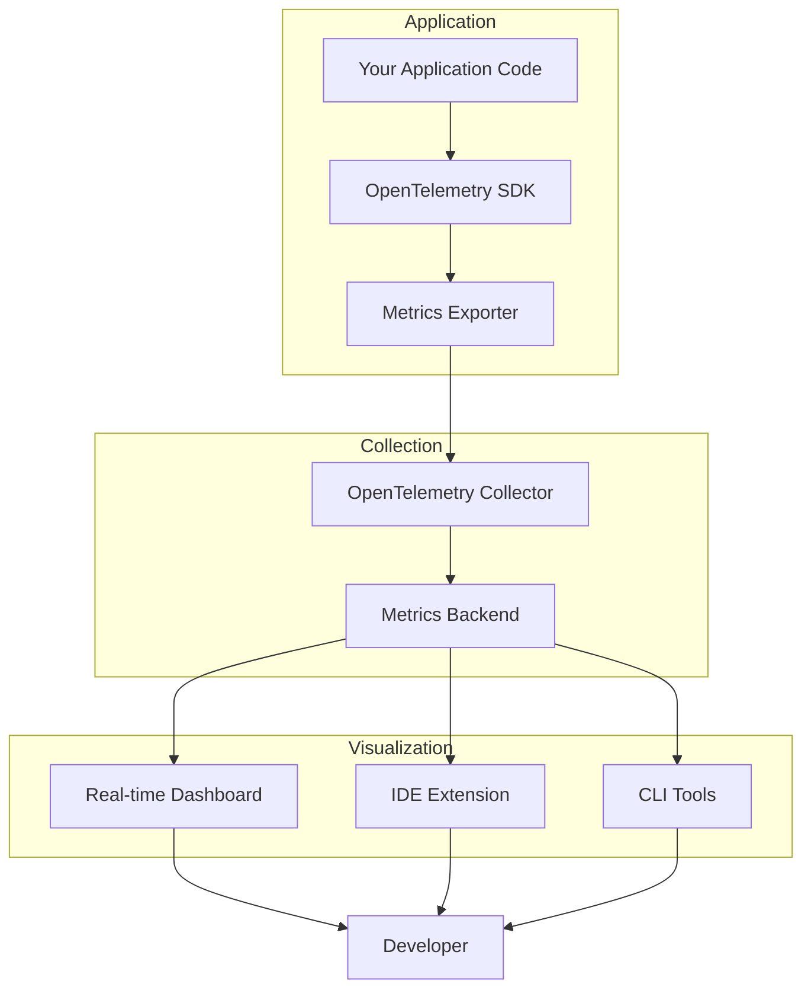
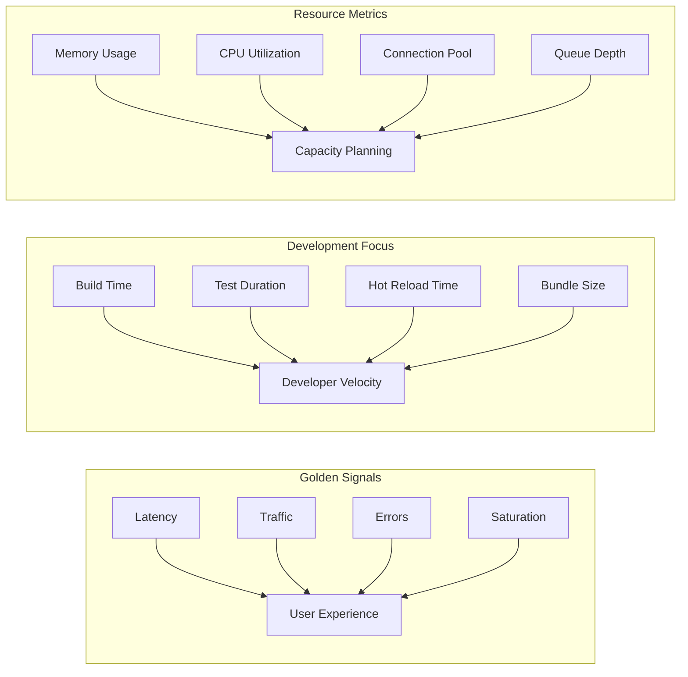
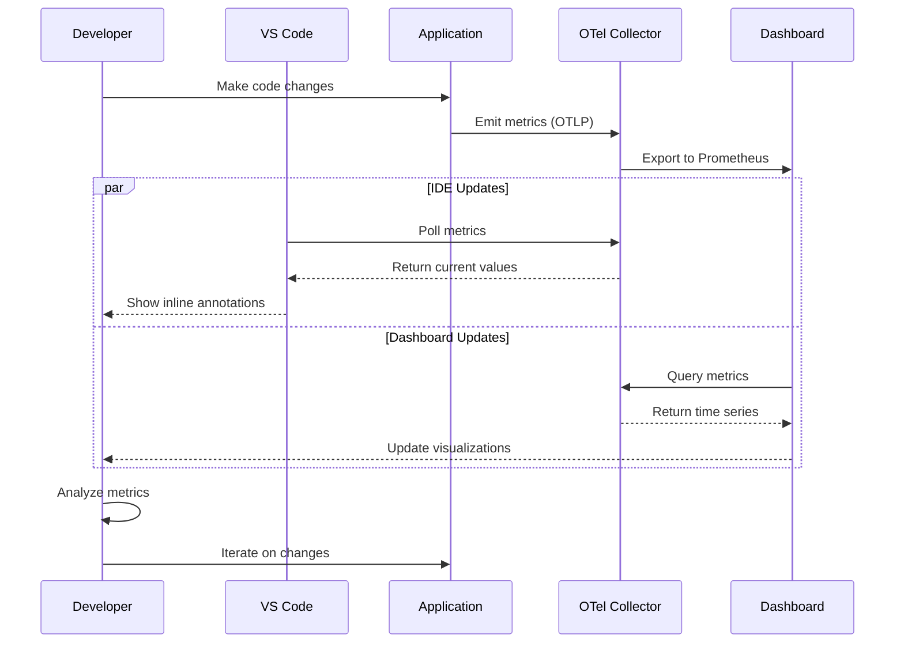

# How to Implement Metrics Visualization

Author: [nawazdhandala](https://github.com/nawazdhandala)

Tags: Developer Experience, Metrics, Visualization, Observability

Description: Learn to implement metrics visualization for understanding application behavior during development.

---

Every developer knows the frustration: your application behaves differently in production than on your local machine. Without visibility into what your code is actually doing, debugging becomes guesswork. Metrics visualization transforms that guesswork into insight.

This guide walks through implementing metrics visualization that fits naturally into your development workflow. We will cover metric selection, real-time dashboards, IDE integration, and practical code examples you can adapt immediately.

---

## Why Developers Need Metrics Visualization

Metrics visualization is not just for SREs and operations teams. During development, visualizing metrics helps you:

- **Catch performance regressions before they ship** by comparing metrics across branches
- **Understand resource consumption patterns** as you iterate on features
- **Debug latency issues** by correlating request timing with code changes
- **Validate optimization efforts** with concrete before/after comparisons

The key is making metrics accessible where you work: your IDE, terminal, and local development environment.

---

## Architecture Overview

Before diving into code, let us understand how the pieces connect:



The flow is straightforward:

1. Your application emits metrics via OpenTelemetry
2. A collector aggregates and routes metrics
3. Visualization tools query the backend and display data

---

## Step 1: Instrument Your Application

Start by adding OpenTelemetry instrumentation to emit meaningful metrics. Here is a Node.js example with detailed comments:

```typescript
// metrics.ts
// This module sets up metric collection for your application.
// It creates instruments that track key performance indicators.

import { metrics, MeterProvider } from '@opentelemetry/api';
import {
    OTLPMetricExporter
} from '@opentelemetry/exporter-metrics-otlp-http';
import {
    PeriodicExportingMetricReader
} from '@opentelemetry/sdk-metrics';

// Initialize the meter provider with OTLP export
// The exporter sends metrics to your collector every 10 seconds
const exporter = new OTLPMetricExporter({
    url: process.env.OTEL_EXPORTER_OTLP_ENDPOINT || 'http://localhost:4318/v1/metrics',
});

const meterProvider = new MeterProvider({
    readers: [
        new PeriodicExportingMetricReader({
            exporter,
            exportIntervalMillis: 10000, // Export every 10 seconds
        }),
    ],
});

// Register as the global meter provider
metrics.setGlobalMeterProvider(meterProvider);

// Create a meter for your service
// The meter groups related metrics under a common namespace
const meter = metrics.getMeter('my-service', '1.0.0');

// Counter: tracks cumulative values that only increase
// Use for: request counts, error counts, completed operations
export const requestCounter = meter.createCounter('http_requests_total', {
    description: 'Total number of HTTP requests received',
    unit: '1', // dimensionless count
});

// Histogram: tracks distribution of values
// Use for: latency measurements, request sizes, response times
export const requestDuration = meter.createHistogram('http_request_duration_ms', {
    description: 'HTTP request duration in milliseconds',
    unit: 'ms',
    // Define bucket boundaries for latency distribution
    // These buckets help visualize percentile distributions
    advice: {
        explicitBucketBoundaries: [5, 10, 25, 50, 100, 250, 500, 1000, 2500, 5000],
    },
});

// Gauge: tracks values that can go up or down
// Use for: active connections, queue depth, memory usage
export const activeConnections = meter.createObservableGauge(
    'active_connections',
    {
        description: 'Number of currently active connections',
        unit: '1',
    }
);

// UpDownCounter: tracks values that increment and decrement
// Use for: items in queue, active requests, cache size
export const queueSize = meter.createUpDownCounter('queue_size', {
    description: 'Current number of items in the processing queue',
    unit: '1',
});
```

Now integrate these metrics into your request handlers:

```typescript
// server.ts
// Express server with integrated metrics collection

import express, { Request, Response, NextFunction } from 'express';
import { requestCounter, requestDuration, queueSize } from './metrics';

const app = express();

// Middleware to track request metrics
// This captures timing and counts for every request
app.use((req: Request, res: Response, next: NextFunction) => {
    const startTime = Date.now();

    // Track request start
    // Attributes help you slice and dice metrics later
    requestCounter.add(1, {
        method: req.method,
        path: req.path,
        // Include environment for filtering dev vs prod
        environment: process.env.NODE_ENV || 'development',
    });

    // Capture response timing when request completes
    res.on('finish', () => {
        const duration = Date.now() - startTime;

        requestDuration.record(duration, {
            method: req.method,
            path: req.path,
            status_code: res.statusCode.toString(),
            // Categorize status codes for easier filtering
            status_class: `${Math.floor(res.statusCode / 100)}xx`,
        });
    });

    next();
});

// Example endpoint that demonstrates queue metrics
app.post('/jobs', async (req: Request, res: Response) => {
    // Increment queue size when job is added
    queueSize.add(1, { queue: 'default' });

    try {
        // Simulate job processing
        await processJob(req.body);
        res.status(201).json({ status: 'queued' });
    } finally {
        // Decrement when job processing completes
        queueSize.add(-1, { queue: 'default' });
    }
});

app.listen(3000, () => {
    console.log('Server running on port 3000');
});
```

For Python applications, here is the equivalent setup:

```python
# metrics.py
# Python metrics instrumentation using OpenTelemetry

from opentelemetry import metrics
from opentelemetry.sdk.metrics import MeterProvider
from opentelemetry.sdk.metrics.export import PeriodicExportingMetricReader
from opentelemetry.exporter.otlp.proto.http.metric_exporter import OTLPMetricExporter
import os

# Configure the OTLP exporter
# This sends metrics to your collector endpoint
exporter = OTLPMetricExporter(
    endpoint=os.getenv('OTEL_EXPORTER_OTLP_ENDPOINT', 'http://localhost:4318/v1/metrics')
)

# Create a metric reader that exports periodically
# 10 second intervals balance freshness with overhead
reader = PeriodicExportingMetricReader(
    exporter,
    export_interval_millis=10000
)

# Initialize and register the meter provider
provider = MeterProvider(metric_readers=[reader])
metrics.set_meter_provider(provider)

# Get a meter for your service
meter = metrics.get_meter('my-python-service', '1.0.0')

# Create metric instruments
# Each instrument type serves a different measurement pattern

request_counter = meter.create_counter(
    name='http_requests_total',
    description='Total HTTP requests received',
    unit='1'
)

request_duration = meter.create_histogram(
    name='http_request_duration_ms',
    description='HTTP request duration in milliseconds',
    unit='ms'
)

# Observable gauge uses a callback function
# The callback is invoked at each collection interval
def get_memory_usage(options):
    import psutil
    process = psutil.Process()
    memory_mb = process.memory_info().rss / 1024 / 1024
    yield metrics.Observation(memory_mb, {'process': 'main'})

memory_gauge = meter.create_observable_gauge(
    name='process_memory_mb',
    callbacks=[get_memory_usage],
    description='Process memory usage in megabytes',
    unit='MB'
)
```

---

## Step 2: Configure the OpenTelemetry Collector

The collector receives, processes, and exports your metrics. Here is a configuration optimized for development:

```yaml
# otel-collector-config.yaml
# Configuration for local development metrics collection

receivers:
  # OTLP receiver accepts metrics from your applications
  otlp:
    protocols:
      http:
        endpoint: 0.0.0.0:4318
      grpc:
        endpoint: 0.0.0.0:4317

processors:
  # Batch processor groups metrics for efficient export
  batch:
    timeout: 5s
    send_batch_size: 1000

  # Memory limiter prevents collector from using too much RAM
  # Important for local development where resources are shared
  memory_limiter:
    check_interval: 1s
    limit_mib: 512
    spike_limit_mib: 128

  # Attributes processor adds useful metadata
  attributes:
    actions:
      - key: collector.version
        value: "1.0.0"
        action: insert
      - key: environment
        value: "development"
        action: insert

exporters:
  # Prometheus exporter exposes metrics for scraping
  # This enables integration with visualization tools
  prometheus:
    endpoint: 0.0.0.0:8889
    namespace: devmetrics
    # Enable exemplars for trace correlation
    enable_open_metrics: true

  # Debug exporter prints metrics to console
  # Useful for verifying metrics are flowing
  debug:
    verbosity: basic
    sampling_initial: 5
    sampling_thereafter: 100

  # OTLP exporter for sending to OneUptime or other backends
  otlp/oneuptime:
    endpoint: ${ONEUPTIME_OTLP_ENDPOINT}
    headers:
      Authorization: "Bearer ${ONEUPTIME_API_KEY}"

service:
  pipelines:
    metrics:
      receivers: [otlp]
      processors: [memory_limiter, batch, attributes]
      exporters: [prometheus, debug]
```

Run the collector locally with Docker:

```bash
# Start the OpenTelemetry Collector
# Mount the config file and expose necessary ports

docker run -d \
  --name otel-collector \
  -p 4317:4317 \
  -p 4318:4318 \
  -p 8889:8889 \
  -v $(pwd)/otel-collector-config.yaml:/etc/otelcol/config.yaml \
  otel/opentelemetry-collector-contrib:latest \
  --config=/etc/otelcol/config.yaml
```

---

## Step 3: Select the Right Metrics

Not all metrics are equally useful. Focus on metrics that answer specific questions:



Here is a practical selection guide:

| Category | Metric | When to Use |
|----------|--------|-------------|
| **Latency** | `http_request_duration_ms` | Always - core user experience indicator |
| **Throughput** | `http_requests_total` | Track load patterns and rate limiting |
| **Errors** | `http_errors_total` by type | Debug failures and track error rates |
| **Saturation** | `connection_pool_active` | Identify resource exhaustion |
| **Business** | `orders_processed` | Validate feature correctness |

Implement metric selection with proper cardinality control:

```typescript
// metric-selection.ts
// Demonstrates choosing metrics with appropriate cardinality

import { metrics } from '@opentelemetry/api';

const meter = metrics.getMeter('metric-selection-demo');

// GOOD: Low cardinality attributes
// These dimensions are bounded and meaningful
const goodLatencyMetric = meter.createHistogram('api_latency_ms', {
    description: 'API latency with bounded dimensions',
});

function recordGoodLatency(durationMs: number, endpoint: string, method: string) {
    goodLatencyMetric.record(durationMs, {
        // Bounded: limited number of endpoints
        endpoint: endpoint,
        // Bounded: HTTP methods are finite
        method: method,
        // Bounded: environment is controlled
        env: process.env.NODE_ENV || 'dev',
    });
}

// BAD: High cardinality attributes (avoid this pattern)
// These dimensions grow unbounded and explode storage costs
const badLatencyMetric = meter.createHistogram('api_latency_bad_ms', {
    description: 'API latency with problematic dimensions',
});

function recordBadLatency(durationMs: number, userId: string, requestId: string) {
    badLatencyMetric.record(durationMs, {
        // UNBOUNDED: user IDs grow with user base
        user_id: userId,
        // UNBOUNDED: every request has unique ID
        request_id: requestId,
        // UNBOUNDED: timestamps are effectively infinite
        timestamp: new Date().toISOString(),
    });
}

// BETTER: Bucket high-cardinality values
// Transform unbounded dimensions into bounded categories
function recordSmartLatency(
    durationMs: number,
    endpoint: string,
    userTier: string,
    responseSize: number
) {
    goodLatencyMetric.record(durationMs, {
        endpoint: endpoint,
        // Transform user ID into bounded tier
        user_tier: userTier, // 'free', 'pro', 'enterprise'
        // Bucket response size into ranges
        response_size_bucket: categorizeSize(responseSize),
    });
}

// Helper to bucket numeric values
function categorizeSize(bytes: number): string {
    if (bytes < 1024) return 'tiny';      // < 1KB
    if (bytes < 10240) return 'small';    // < 10KB
    if (bytes < 102400) return 'medium';  // < 100KB
    if (bytes < 1048576) return 'large';  // < 1MB
    return 'xlarge';                       // >= 1MB
}
```

---

## Step 4: Build Real-Time Dashboards

Create dashboards that update as you develop. Here is a React component for real-time metric visualization:

```tsx
// MetricsDashboard.tsx
// Real-time metrics dashboard component for developer tools

import React, { useState, useEffect, useCallback, useRef } from 'react';

// Type definitions for our metrics data
interface MetricDataPoint {
    timestamp: number;
    value: number;
}

interface MetricSeries {
    name: string;
    data: MetricDataPoint[];
    color: string;
}

interface DashboardProps {
    // Endpoint for your metrics API
    metricsEndpoint: string;
    // How often to refresh data (milliseconds)
    refreshInterval?: number;
    // Number of data points to display
    dataWindow?: number;
}

export const MetricsDashboard: React.FC<DashboardProps> = ({
    metricsEndpoint,
    refreshInterval = 5000,
    dataWindow = 60,
}) => {
    // Store multiple metric series for comparison
    const [series, setSeries] = useState<MetricSeries[]>([]);
    const [isConnected, setIsConnected] = useState(false);
    const [lastUpdate, setLastUpdate] = useState<Date | null>(null);

    // Use ref to track component mount state
    const isMounted = useRef(true);

    // Fetch metrics from your backend
    const fetchMetrics = useCallback(async () => {
        try {
            const response = await fetch(metricsEndpoint);
            if (!response.ok) throw new Error('Failed to fetch metrics');

            const data = await response.json();

            if (!isMounted.current) return;

            // Transform API response into chart-friendly format
            setSeries(prevSeries => {
                return data.metrics.map((metric: any, index: number) => {
                    const existing = prevSeries.find(s => s.name === metric.name);
                    const newPoint: MetricDataPoint = {
                        timestamp: Date.now(),
                        value: metric.value,
                    };

                    // Append new point and trim to window size
                    const updatedData = existing
                        ? [...existing.data, newPoint].slice(-dataWindow)
                        : [newPoint];

                    return {
                        name: metric.name,
                        data: updatedData,
                        color: CHART_COLORS[index % CHART_COLORS.length],
                    };
                });
            });

            setIsConnected(true);
            setLastUpdate(new Date());
        } catch (error) {
            console.error('Metrics fetch error:', error);
            setIsConnected(false);
        }
    }, [metricsEndpoint, dataWindow]);

    // Set up polling interval
    useEffect(() => {
        isMounted.current = true;
        fetchMetrics(); // Initial fetch

        const interval = setInterval(fetchMetrics, refreshInterval);

        return () => {
            isMounted.current = false;
            clearInterval(interval);
        };
    }, [fetchMetrics, refreshInterval]);

    return (
        <div className="metrics-dashboard">
            {/* Connection status indicator */}
            <header className="dashboard-header">
                <h2>Development Metrics</h2>
                <StatusIndicator connected={isConnected} lastUpdate={lastUpdate} />
            </header>

            {/* Metric cards grid */}
            <div className="metrics-grid">
                {series.map(metric => (
                    <MetricCard
                        key={metric.name}
                        series={metric}
                        dataWindow={dataWindow}
                    />
                ))}
            </div>

            {/* Combined chart for correlation */}
            <div className="combined-chart">
                <CombinedMetricsChart series={series} />
            </div>
        </div>
    );
};

// Individual metric card with sparkline
interface MetricCardProps {
    series: MetricSeries;
    dataWindow: number;
}

const MetricCard: React.FC<MetricCardProps> = ({ series, dataWindow }) => {
    const currentValue = series.data[series.data.length - 1]?.value ?? 0;
    const previousValue = series.data[series.data.length - 2]?.value ?? currentValue;
    const percentChange = previousValue !== 0
        ? ((currentValue - previousValue) / previousValue) * 100
        : 0;

    return (
        <div className="metric-card">
            <h3>{formatMetricName(series.name)}</h3>
            <div className="metric-value">
                {formatValue(currentValue)}
                <TrendIndicator change={percentChange} />
            </div>
            <Sparkline data={series.data} color={series.color} />
        </div>
    );
};

// Sparkline chart component
interface SparklineProps {
    data: MetricDataPoint[];
    color: string;
}

const Sparkline: React.FC<SparklineProps> = ({ data, color }) => {
    if (data.length < 2) return null;

    const width = 200;
    const height = 40;
    const padding = 4;

    // Calculate SVG path for the sparkline
    const values = data.map(d => d.value);
    const minValue = Math.min(...values);
    const maxValue = Math.max(...values);
    const range = maxValue - minValue || 1;

    const points = data.map((point, index) => {
        const x = padding + (index / (data.length - 1)) * (width - 2 * padding);
        const y = height - padding - ((point.value - minValue) / range) * (height - 2 * padding);
        return `${x},${y}`;
    });

    const pathD = `M ${points.join(' L ')}`;

    return (
        <svg width={width} height={height} className="sparkline">
            <path
                d={pathD}
                fill="none"
                stroke={color}
                strokeWidth="2"
                strokeLinecap="round"
                strokeLinejoin="round"
            />
        </svg>
    );
};

// Helper components and utilities
const StatusIndicator: React.FC<{ connected: boolean; lastUpdate: Date | null }> = ({
    connected,
    lastUpdate
}) => (
    <div className={`status-indicator ${connected ? 'connected' : 'disconnected'}`}>
        <span className="status-dot" />
        {connected ? 'Live' : 'Disconnected'}
        {lastUpdate && (
            <span className="last-update">
                Updated {formatRelativeTime(lastUpdate)}
            </span>
        )}
    </div>
);

const TrendIndicator: React.FC<{ change: number }> = ({ change }) => {
    const isPositive = change > 0;
    const isNeutral = Math.abs(change) < 0.1;

    return (
        <span className={`trend ${isNeutral ? 'neutral' : isPositive ? 'up' : 'down'}`}>
            {isNeutral ? '~' : isPositive ? '+' : ''}{change.toFixed(1)}%
        </span>
    );
};

// Chart colors for different series
const CHART_COLORS = [
    '#3b82f6', // blue
    '#10b981', // green
    '#f59e0b', // amber
    '#ef4444', // red
    '#8b5cf6', // purple
];

// Utility functions
function formatMetricName(name: string): string {
    return name
        .replace(/_/g, ' ')
        .replace(/\b\w/g, c => c.toUpperCase());
}

function formatValue(value: number): string {
    if (value >= 1000000) return `${(value / 1000000).toFixed(1)}M`;
    if (value >= 1000) return `${(value / 1000).toFixed(1)}K`;
    return value.toFixed(value < 10 ? 2 : 0);
}

function formatRelativeTime(date: Date): string {
    const seconds = Math.floor((Date.now() - date.getTime()) / 1000);
    if (seconds < 60) return `${seconds}s ago`;
    return `${Math.floor(seconds / 60)}m ago`;
}
```

Add accompanying CSS for the dashboard:

```css
/* metrics-dashboard.css */
/* Styles for the real-time metrics dashboard */

.metrics-dashboard {
    font-family: -apple-system, BlinkMacSystemFont, 'Segoe UI', Roboto, sans-serif;
    padding: 20px;
    background: #0f172a;
    color: #e2e8f0;
    min-height: 100vh;
}

.dashboard-header {
    display: flex;
    justify-content: space-between;
    align-items: center;
    margin-bottom: 24px;
}

.dashboard-header h2 {
    margin: 0;
    font-size: 1.5rem;
    font-weight: 600;
}

.status-indicator {
    display: flex;
    align-items: center;
    gap: 8px;
    font-size: 0.875rem;
}

.status-dot {
    width: 8px;
    height: 8px;
    border-radius: 50%;
    background: #ef4444;
}

.status-indicator.connected .status-dot {
    background: #10b981;
}

.last-update {
    color: #64748b;
    margin-left: 8px;
}

.metrics-grid {
    display: grid;
    grid-template-columns: repeat(auto-fit, minmax(280px, 1fr));
    gap: 16px;
    margin-bottom: 24px;
}

.metric-card {
    background: #1e293b;
    border-radius: 12px;
    padding: 20px;
    border: 1px solid #334155;
}

.metric-card h3 {
    margin: 0 0 12px 0;
    font-size: 0.875rem;
    font-weight: 500;
    color: #94a3b8;
    text-transform: uppercase;
    letter-spacing: 0.05em;
}

.metric-value {
    display: flex;
    align-items: baseline;
    gap: 12px;
    font-size: 2rem;
    font-weight: 700;
    margin-bottom: 16px;
}

.trend {
    font-size: 0.875rem;
    font-weight: 500;
    padding: 2px 8px;
    border-radius: 4px;
}

.trend.up {
    background: rgba(239, 68, 68, 0.2);
    color: #ef4444;
}

.trend.down {
    background: rgba(16, 185, 129, 0.2);
    color: #10b981;
}

.trend.neutral {
    background: rgba(100, 116, 139, 0.2);
    color: #64748b;
}

.sparkline {
    display: block;
    width: 100%;
    height: 40px;
}

.combined-chart {
    background: #1e293b;
    border-radius: 12px;
    padding: 24px;
    border: 1px solid #334155;
}
```

---

## Step 5: IDE Integration

Bring metrics directly into your development environment. Here is a VS Code extension that displays metrics inline:

```typescript
// extension.ts
// VS Code extension for inline metrics display

import * as vscode from 'vscode';

// Store for metric decorations
const metricDecorations = new Map<string, vscode.TextEditorDecorationType>();

// Metric data cache
interface MetricInfo {
    name: string;
    value: number;
    unit: string;
    trend: 'up' | 'down' | 'stable';
}

const metricsCache = new Map<string, MetricInfo>();

export function activate(context: vscode.ExtensionContext) {
    console.log('Metrics visualization extension activated');

    // Register command to toggle metric overlays
    const toggleCommand = vscode.commands.registerCommand(
        'devmetrics.toggle',
        () => toggleMetricOverlays()
    );

    // Register command to refresh metrics
    const refreshCommand = vscode.commands.registerCommand(
        'devmetrics.refresh',
        () => refreshMetrics()
    );

    // Create status bar item showing key metrics
    const statusBarItem = vscode.window.createStatusBarItem(
        vscode.StatusBarAlignment.Right,
        100
    );
    statusBarItem.command = 'devmetrics.toggle';
    statusBarItem.show();

    // Update status bar periodically
    const updateInterval = setInterval(() => {
        updateStatusBar(statusBarItem);
    }, 5000);

    // Listen for active editor changes
    vscode.window.onDidChangeActiveTextEditor(
        editor => {
            if (editor) {
                updateEditorDecorations(editor);
            }
        },
        null,
        context.subscriptions
    );

    // Listen for document changes
    vscode.workspace.onDidChangeTextDocument(
        event => {
            const editor = vscode.window.activeTextEditor;
            if (editor && event.document === editor.document) {
                // Debounced update
                setTimeout(() => updateEditorDecorations(editor), 500);
            }
        },
        null,
        context.subscriptions
    );

    context.subscriptions.push(
        toggleCommand,
        refreshCommand,
        statusBarItem,
        { dispose: () => clearInterval(updateInterval) }
    );

    // Initial metrics fetch
    refreshMetrics();
}

// Fetch metrics from the local collector
async function refreshMetrics(): Promise<void> {
    try {
        const config = vscode.workspace.getConfiguration('devmetrics');
        const endpoint = config.get<string>('endpoint', 'http://localhost:8889/metrics');

        const response = await fetch(endpoint);
        const text = await response.text();

        // Parse Prometheus format metrics
        parsePrometheusMetrics(text);

        // Update all visible editors
        vscode.window.visibleTextEditors.forEach(updateEditorDecorations);

        vscode.window.showInformationMessage('Metrics refreshed');
    } catch (error) {
        vscode.window.showErrorMessage(`Failed to fetch metrics: ${error}`);
    }
}

// Parse Prometheus exposition format
function parsePrometheusMetrics(text: string): void {
    const lines = text.split('\n');

    for (const line of lines) {
        // Skip comments and empty lines
        if (line.startsWith('#') || line.trim() === '') continue;

        // Parse metric line: metric_name{labels} value
        const match = line.match(/^(\w+)(\{[^}]*\})?\s+([\d.]+)/);
        if (match) {
            const [, name, , valueStr] = match;
            const value = parseFloat(valueStr);

            // Store in cache with computed trend
            const previous = metricsCache.get(name);
            const trend: 'up' | 'down' | 'stable' =
                !previous ? 'stable' :
                value > previous.value * 1.05 ? 'up' :
                value < previous.value * 0.95 ? 'down' : 'stable';

            metricsCache.set(name, {
                name,
                value,
                unit: inferUnit(name),
                trend,
            });
        }
    }
}

// Infer unit from metric name conventions
function inferUnit(name: string): string {
    if (name.includes('_ms') || name.includes('_milliseconds')) return 'ms';
    if (name.includes('_seconds')) return 's';
    if (name.includes('_bytes')) return 'B';
    if (name.includes('_total') || name.includes('_count')) return '';
    return '';
}

// Update decorations in the active editor
function updateEditorDecorations(editor: vscode.TextEditor): void {
    const document = editor.document;
    const text = document.getText();

    // Find metric references in the code
    // Look for patterns like: meter.createCounter('metric_name', ...)
    const metricPattern = /(?:createCounter|createHistogram|createGauge|create_counter|create_histogram)\s*\(\s*['"]([^'"]+)['"]/g;

    let match;
    const decorations: vscode.DecorationOptions[] = [];

    while ((match = metricPattern.exec(text)) !== null) {
        const metricName = match[1];
        const metricInfo = metricsCache.get(metricName);

        if (metricInfo) {
            const startPos = document.positionAt(match.index);
            const endPos = document.positionAt(match.index + match[0].length);
            const range = new vscode.Range(startPos, endPos);

            // Create inline decoration showing current value
            decorations.push({
                range,
                renderOptions: {
                    after: {
                        contentText: formatMetricBadge(metricInfo),
                        color: getTrendColor(metricInfo.trend),
                        margin: '0 0 0 12px',
                        fontStyle: 'normal',
                        fontWeight: '500',
                    },
                },
            });
        }
    }

    // Apply decorations
    const decorationType = getOrCreateDecorationType('metrics');
    editor.setDecorations(decorationType, decorations);
}

// Format metric value for inline display
function formatMetricBadge(metric: MetricInfo): string {
    const trendIcon = metric.trend === 'up' ? '+' : metric.trend === 'down' ? '-' : '~';
    const value = formatNumber(metric.value);
    return `${trendIcon} ${value}${metric.unit}`;
}

// Format number for display
function formatNumber(value: number): string {
    if (value >= 1000000) return `${(value / 1000000).toFixed(1)}M`;
    if (value >= 1000) return `${(value / 1000).toFixed(1)}K`;
    return value.toFixed(value < 10 ? 2 : 0);
}

// Get color based on trend
function getTrendColor(trend: 'up' | 'down' | 'stable'): string {
    switch (trend) {
        case 'up': return '#f59e0b';    // amber for increases
        case 'down': return '#10b981';  // green for decreases (usually good for latency)
        case 'stable': return '#64748b'; // gray for stable
    }
}

// Get or create decoration type
function getOrCreateDecorationType(key: string): vscode.TextEditorDecorationType {
    let decorationType = metricDecorations.get(key);
    if (!decorationType) {
        decorationType = vscode.window.createTextEditorDecorationType({});
        metricDecorations.set(key, decorationType);
    }
    return decorationType;
}

// Toggle metric overlays on/off
let overlaysEnabled = true;
function toggleMetricOverlays(): void {
    overlaysEnabled = !overlaysEnabled;

    if (overlaysEnabled) {
        vscode.window.visibleTextEditors.forEach(updateEditorDecorations);
    } else {
        // Clear all decorations
        metricDecorations.forEach((decorationType, key) => {
            vscode.window.visibleTextEditors.forEach(editor => {
                editor.setDecorations(decorationType, []);
            });
        });
    }

    vscode.window.showInformationMessage(
        `Metric overlays ${overlaysEnabled ? 'enabled' : 'disabled'}`
    );
}

// Update status bar with key metrics
function updateStatusBar(statusBarItem: vscode.StatusBarItem): void {
    const latencyMetric = metricsCache.get('http_request_duration_ms');
    const errorMetric = metricsCache.get('http_errors_total');

    if (latencyMetric || errorMetric) {
        const parts: string[] = [];
        if (latencyMetric) {
            parts.push(`P99: ${formatNumber(latencyMetric.value)}ms`);
        }
        if (errorMetric) {
            parts.push(`Err: ${formatNumber(errorMetric.value)}`);
        }
        statusBarItem.text = `$(pulse) ${parts.join(' | ')}`;
        statusBarItem.tooltip = 'Click to toggle metric overlays';
    } else {
        statusBarItem.text = '$(pulse) Metrics';
        statusBarItem.tooltip = 'No metrics available. Click to refresh.';
    }
}

export function deactivate() {
    metricDecorations.forEach(decorationType => decorationType.dispose());
    metricDecorations.clear();
}
```

Configure the extension in `package.json`:

```json
{
    "name": "devmetrics",
    "displayName": "Developer Metrics",
    "description": "Inline metrics visualization for developers",
    "version": "1.0.0",
    "engines": {
        "vscode": "^1.80.0"
    },
    "categories": ["Other"],
    "activationEvents": [
        "onLanguage:typescript",
        "onLanguage:javascript",
        "onLanguage:python"
    ],
    "main": "./out/extension.js",
    "contributes": {
        "commands": [
            {
                "command": "devmetrics.toggle",
                "title": "Toggle Metric Overlays",
                "category": "Dev Metrics"
            },
            {
                "command": "devmetrics.refresh",
                "title": "Refresh Metrics",
                "category": "Dev Metrics"
            }
        ],
        "configuration": {
            "title": "Developer Metrics",
            "properties": {
                "devmetrics.endpoint": {
                    "type": "string",
                    "default": "http://localhost:8889/metrics",
                    "description": "Prometheus metrics endpoint URL"
                },
                "devmetrics.refreshInterval": {
                    "type": "number",
                    "default": 5000,
                    "description": "Metrics refresh interval in milliseconds"
                }
            }
        }
    }
}
```

---

## Step 6: CLI Tools for Quick Access

Sometimes you just need metrics in your terminal. Here is a CLI tool for quick metric queries:

```typescript
#!/usr/bin/env node
// devmetrics-cli.ts
// Command-line tool for querying development metrics

import { Command } from 'commander';
import chalk from 'chalk';

const program = new Command();

// Configure CLI
program
    .name('devmetrics')
    .description('Query and visualize development metrics')
    .version('1.0.0');

// Watch command: live metric updates in terminal
program
    .command('watch')
    .description('Watch metrics in real-time')
    .option('-i, --interval <ms>', 'Refresh interval', '2000')
    .option('-m, --metrics <names>', 'Comma-separated metric names')
    .option('-e, --endpoint <url>', 'Metrics endpoint', 'http://localhost:8889/metrics')
    .action(async (options) => {
        console.log(chalk.cyan('Starting metrics watch mode...'));
        console.log(chalk.gray(`Endpoint: ${options.endpoint}`));
        console.log(chalk.gray(`Refresh: ${options.interval}ms`));
        console.log(chalk.gray('Press Ctrl+C to exit\n'));

        // Clear screen and position cursor
        const clearScreen = () => process.stdout.write('\x1B[2J\x1B[0;0H');

        const filterNames = options.metrics?.split(',').map((s: string) => s.trim());

        // Polling loop
        const refresh = async () => {
            try {
                const metrics = await fetchMetrics(options.endpoint);
                const filtered = filterNames
                    ? metrics.filter(m => filterNames.some(
                        (name: string) => m.name.includes(name)
                      ))
                    : metrics;

                clearScreen();
                displayMetricsTable(filtered);
            } catch (error) {
                console.error(chalk.red(`Error: ${error}`));
            }
        };

        // Initial fetch and start interval
        await refresh();
        setInterval(refresh, parseInt(options.interval));
    });

// Query command: one-time metric query
program
    .command('query <metric>')
    .description('Query a specific metric')
    .option('-e, --endpoint <url>', 'Metrics endpoint', 'http://localhost:8889/metrics')
    .option('-l, --labels <labels>', 'Label filters (key=value,...)')
    .action(async (metric, options) => {
        try {
            const metrics = await fetchMetrics(options.endpoint);
            const matches = metrics.filter(m => m.name.includes(metric));

            if (matches.length === 0) {
                console.log(chalk.yellow(`No metrics found matching '${metric}'`));
                return;
            }

            // Apply label filters if provided
            const filtered = options.labels
                ? filterByLabels(matches, options.labels)
                : matches;

            displayMetricsTable(filtered);
        } catch (error) {
            console.error(chalk.red(`Error: ${error}`));
            process.exit(1);
        }
    });

// Histogram command: show distribution
program
    .command('histogram <metric>')
    .description('Display histogram distribution')
    .option('-e, --endpoint <url>', 'Metrics endpoint', 'http://localhost:8889/metrics')
    .action(async (metric, options) => {
        try {
            const metrics = await fetchMetrics(options.endpoint);
            const histogramData = extractHistogramBuckets(metrics, metric);

            if (histogramData.length === 0) {
                console.log(chalk.yellow(`No histogram data found for '${metric}'`));
                return;
            }

            displayHistogram(metric, histogramData);
        } catch (error) {
            console.error(chalk.red(`Error: ${error}`));
            process.exit(1);
        }
    });

// Metric data interface
interface MetricData {
    name: string;
    labels: Record<string, string>;
    value: number;
}

// Fetch and parse Prometheus metrics
async function fetchMetrics(endpoint: string): Promise<MetricData[]> {
    const response = await fetch(endpoint);
    const text = await response.text();
    return parsePrometheusFormat(text);
}

// Parse Prometheus exposition format
function parsePrometheusFormat(text: string): MetricData[] {
    const metrics: MetricData[] = [];
    const lines = text.split('\n');

    for (const line of lines) {
        if (line.startsWith('#') || line.trim() === '') continue;

        // Match: metric_name{label1="value1",label2="value2"} 123.45
        const match = line.match(/^(\w+)(\{([^}]*)\})?\s+([\d.eE+-]+)/);
        if (match) {
            const [, name, , labelsStr, valueStr] = match;
            const labels: Record<string, string> = {};

            if (labelsStr) {
                // Parse labels
                const labelPairs = labelsStr.match(/(\w+)="([^"]*)"/g) || [];
                for (const pair of labelPairs) {
                    const [key, value] = pair.split('=');
                    labels[key] = value.replace(/"/g, '');
                }
            }

            metrics.push({
                name,
                labels,
                value: parseFloat(valueStr),
            });
        }
    }

    return metrics;
}

// Filter metrics by label values
function filterByLabels(metrics: MetricData[], labelsArg: string): MetricData[] {
    const filters = labelsArg.split(',').map(pair => {
        const [key, value] = pair.split('=');
        return { key: key.trim(), value: value.trim() };
    });

    return metrics.filter(m =>
        filters.every(f => m.labels[f.key] === f.value)
    );
}

// Display metrics in a formatted table
function displayMetricsTable(metrics: MetricData[]): void {
    console.log(chalk.bold('\nMetrics:\n'));

    // Group by metric name
    const grouped = new Map<string, MetricData[]>();
    for (const m of metrics) {
        const existing = grouped.get(m.name) || [];
        existing.push(m);
        grouped.set(m.name, existing);
    }

    for (const [name, items] of grouped) {
        console.log(chalk.cyan.bold(name));

        for (const item of items) {
            const labelStr = Object.entries(item.labels)
                .map(([k, v]) => `${chalk.gray(k)}=${chalk.white(v)}`)
                .join(' ');

            const valueStr = formatValue(item.value);
            console.log(`  ${labelStr || chalk.gray('(no labels)')} ${chalk.green(valueStr)}`);
        }
        console.log();
    }
}

// Extract histogram bucket data
interface HistogramBucket {
    le: number;
    count: number;
}

function extractHistogramBuckets(metrics: MetricData[], baseName: string): HistogramBucket[] {
    const bucketMetrics = metrics.filter(
        m => m.name === `${baseName}_bucket` && m.labels.le
    );

    return bucketMetrics
        .map(m => ({
            le: m.labels.le === '+Inf' ? Infinity : parseFloat(m.labels.le),
            count: m.value,
        }))
        .sort((a, b) => a.le - b.le);
}

// Display ASCII histogram
function displayHistogram(name: string, buckets: HistogramBucket[]): void {
    console.log(chalk.bold(`\nHistogram: ${name}\n`));

    const maxCount = Math.max(...buckets.map(b => b.count));
    const barWidth = 40;

    let prevCount = 0;
    for (const bucket of buckets) {
        const bucketCount = bucket.count - prevCount;
        prevCount = bucket.count;

        const barLength = Math.round((bucketCount / maxCount) * barWidth);
        const bar = '|'.repeat(barLength);
        const leStr = bucket.le === Infinity ? '+Inf' : bucket.le.toString();

        console.log(
            chalk.gray(leStr.padStart(8)) + ' ' +
            chalk.green(bar) + ' ' +
            chalk.white(bucketCount.toString())
        );
    }
    console.log();
}

// Format numeric value for display
function formatValue(value: number): string {
    if (value >= 1000000) return `${(value / 1000000).toFixed(2)}M`;
    if (value >= 1000) return `${(value / 1000).toFixed(2)}K`;
    if (value < 0.01 && value > 0) return value.toExponential(2);
    return value.toFixed(2);
}

program.parse();
```

---

## Complete Development Setup

Here is a Docker Compose configuration that ties everything together:

```yaml
# docker-compose.yml
# Complete development metrics stack

version: '3.8'

services:
  # OpenTelemetry Collector
  otel-collector:
    image: otel/opentelemetry-collector-contrib:latest
    container_name: otel-collector
    command: ["--config=/etc/otel-collector-config.yaml"]
    volumes:
      - ./otel-collector-config.yaml:/etc/otel-collector-config.yaml:ro
    ports:
      - "4317:4317"   # OTLP gRPC
      - "4318:4318"   # OTLP HTTP
      - "8889:8889"   # Prometheus metrics
    networks:
      - devmetrics

  # Prometheus for metric storage (optional, for longer retention)
  prometheus:
    image: prom/prometheus:latest
    container_name: prometheus
    volumes:
      - ./prometheus.yml:/etc/prometheus/prometheus.yml:ro
      - prometheus-data:/prometheus
    ports:
      - "9090:9090"
    command:
      - '--config.file=/etc/prometheus/prometheus.yml'
      - '--storage.tsdb.path=/prometheus'
      - '--storage.tsdb.retention.time=7d'
      - '--web.enable-lifecycle'
    networks:
      - devmetrics

  # Grafana for advanced visualization (optional)
  grafana:
    image: grafana/grafana:latest
    container_name: grafana
    environment:
      - GF_SECURITY_ADMIN_USER=admin
      - GF_SECURITY_ADMIN_PASSWORD=devmetrics
      - GF_USERS_ALLOW_SIGN_UP=false
    volumes:
      - grafana-data:/var/lib/grafana
      - ./grafana/provisioning:/etc/grafana/provisioning:ro
    ports:
      - "3001:3000"
    networks:
      - devmetrics

networks:
  devmetrics:
    driver: bridge

volumes:
  prometheus-data:
  grafana-data:
```

Prometheus configuration:

```yaml
# prometheus.yml
# Prometheus configuration for scraping the OTel collector

global:
  scrape_interval: 15s
  evaluation_interval: 15s

scrape_configs:
  # Scrape OTel collector Prometheus endpoint
  - job_name: 'otel-collector'
    static_configs:
      - targets: ['otel-collector:8889']

  # Scrape Prometheus itself for meta-metrics
  - job_name: 'prometheus'
    static_configs:
      - targets: ['localhost:9090']
```

---

## Workflow Integration

Here is how the metrics flow through your development workflow:



---

## Best Practices

1. **Start with the Golden Signals**: Latency, traffic, errors, and saturation cover most debugging scenarios.

2. **Keep Cardinality Bounded**: High-cardinality labels (like user IDs) explode storage costs. Use bucketing or sampling instead.

3. **Instrument at Boundaries**: Focus metrics on service boundaries, database calls, and external API interactions.

4. **Use Histograms for Latency**: Counters and gauges cannot capture percentile distributions. Histograms reveal tail latency.

5. **Correlate with Traces**: Add `trace_id` and `span_id` to metric labels for drill-down capability. This enables jumping from a metric spike to the specific request that caused it.

6. **Set Up Alerts Early**: Even in development, alerts help you notice performance regressions as you code.

---

## Troubleshooting Common Issues

| Problem | Symptom | Solution |
|---------|---------|----------|
| No metrics appearing | Empty dashboard | Check collector logs, verify OTLP endpoint |
| High memory usage | Collector OOM | Reduce batch size, add memory_limiter processor |
| Missing labels | Cannot filter data | Verify attributes are added before export |
| Slow queries | Dashboard timeouts | Reduce cardinality, add indexes |
| Stale data | Outdated values | Check export interval, verify network connectivity |

---

## Next Steps

With metrics visualization in place, you can:

- **Compare Branches**: Run the same workload against different branches and compare metrics
- **Profile Optimizations**: Measure the actual impact of performance improvements
- **Debug Production Issues Locally**: Reproduce issues with metric correlation
- **Build SLO Awareness**: Understand how your code affects service level objectives

Metrics visualization is not just about pretty charts. It is about shortening the feedback loop between writing code and understanding its behavior. When you can see the impact of every change, you write better software faster.

---

**Related Resources:**

- [Three Pillars of Observability: Logs, Metrics, Traces](https://oneuptime.com/blog/post/2025-08-20-three-pillars-of-observability-logs-metrics-traces/view)
- [18 SRE Metrics Worth Tracking](https://oneuptime.com/blog/post/2025-11-28-sre-metrics-to-track/view)
- [OpenTelemetry Collector Basics](https://oneuptime.com/blog/post/2025-09-18-what-is-opentelemetry-collector-and-why-use-one/view)
