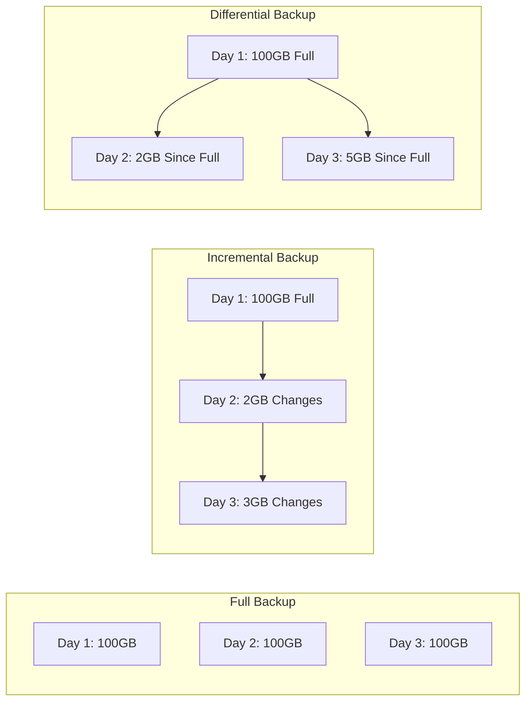
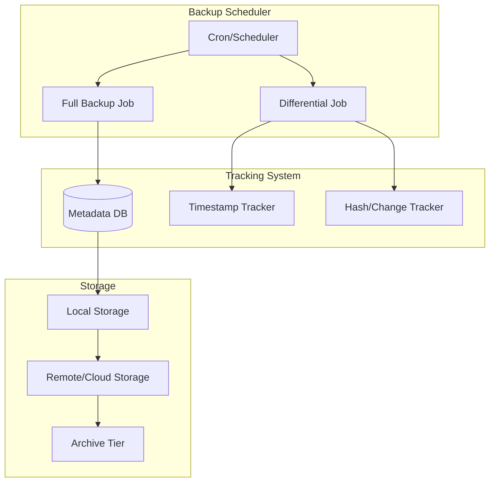
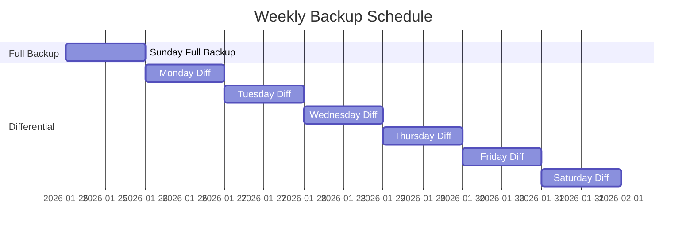
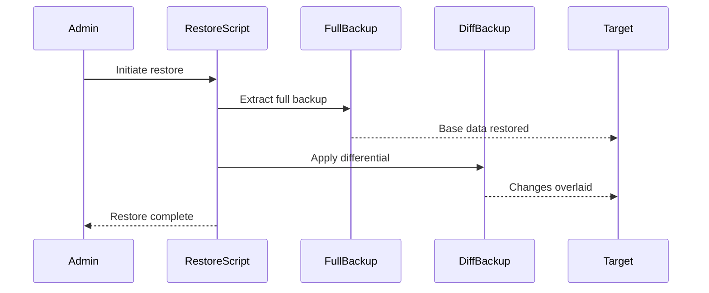
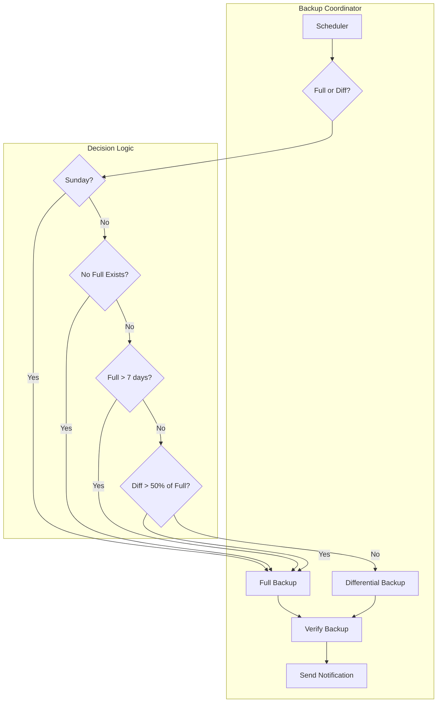
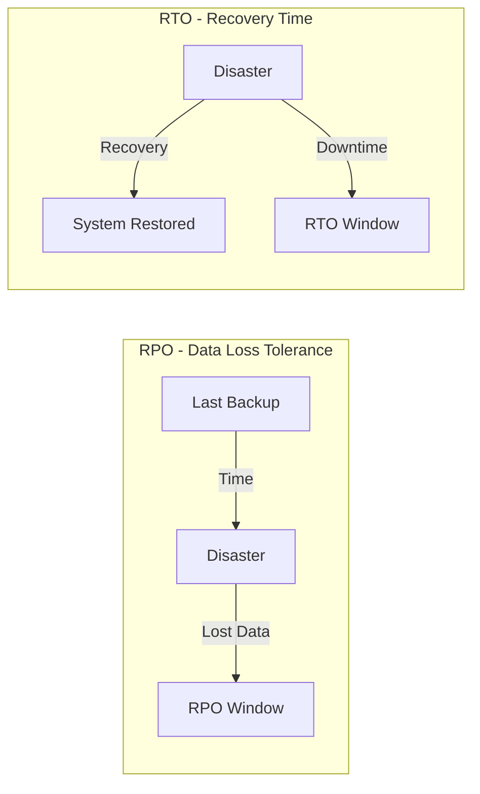

# How to Build Differential Backup Scheduling

Author: [nawazdhandala](https://github.com/nawazdhandala)

Tags: Backup, Disaster Recovery, SRE, Data Protection

Description: Learn how to implement differential backups for efficient data protection.

---

Backups are the foundation of disaster recovery, but not all backup strategies are created equal. While full backups provide complete data copies, they consume massive storage and time. Differential backups offer a middle ground - capturing only what changed since the last full backup, dramatically reducing backup windows while maintaining fast recovery times.

## Understanding Backup Types

Before diving into differential backups, let's clarify the three main backup strategies:



### Full Backup
A complete copy of all data. Simple but storage-intensive.

### Incremental Backup
Only backs up changes since the last backup (any type). Smallest storage footprint but requires all increments for recovery.

### Differential Backup
Backs up all changes since the last full backup. Grows over time but only needs the full backup plus one differential for recovery.

## Differential vs Incremental: The Trade-offs

| Aspect | Differential | Incremental |
|--------|-------------|-------------|
| Storage Usage | Medium (grows until next full) | Low (only daily changes) |
| Backup Speed | Medium | Fast |
| Recovery Speed | Fast (full + 1 differential) | Slow (full + all increments) |
| Complexity | Medium | High |
| Failure Impact | Low | High (chain dependency) |


## Building a Differential Backup System

### Core Architecture



### Implementation: Differential Backup Script

Here's a production-ready differential backup implementation in Bash:

```bash
#!/bin/bash
# differential-backup.sh
# Production differential backup system

set -euo pipefail

# Configuration
BACKUP_SOURCE="/data"
BACKUP_DEST="/backups"
FULL_BACKUP_DAY="Sunday"  # Weekly full backup
RETENTION_DAYS=30
TIMESTAMP_FILE="$BACKUP_DEST/.last_full_backup"
LOG_FILE="/var/log/backup.log"

# Logging function
log() {
    echo "[$(date '+%Y-%m-%d %H:%M:%S')] $1" | tee -a "$LOG_FILE"
}

# Check if full backup is needed
needs_full_backup() {
    local current_day=$(date +%A)

    # Full backup on designated day
    if [[ "$current_day" == "$FULL_BACKUP_DAY" ]]; then
        return 0
    fi

    # Full backup if no previous full exists
    if [[ ! -f "$TIMESTAMP_FILE" ]]; then
        return 0
    fi

    # Full backup if timestamp is older than 7 days
    local last_full=$(cat "$TIMESTAMP_FILE")
    local age=$(( ($(date +%s) - last_full) / 86400 ))
    if [[ $age -ge 7 ]]; then
        return 0
    fi

    return 1
}

# Perform full backup
full_backup() {
    local backup_name="full_$(date +%Y%m%d_%H%M%S)"
    local backup_path="$BACKUP_DEST/$backup_name"

    log "Starting full backup: $backup_name"

    # Create backup using tar with compression
    tar -czf "$backup_path.tar.gz" \
        --exclude='*.tmp' \
        --exclude='*.log' \
        -C "$(dirname "$BACKUP_SOURCE")" \
        "$(basename "$BACKUP_SOURCE")"

    # Record timestamp
    date +%s > "$TIMESTAMP_FILE"

    # Create snapshot for differential comparison
    find "$BACKUP_SOURCE" -type f -printf '%T@ %p\n' > "$BACKUP_DEST/.snapshot"

    log "Full backup completed: $(du -h "$backup_path.tar.gz" | cut -f1)"
}

# Perform differential backup
differential_backup() {
    local backup_name="diff_$(date +%Y%m%d_%H%M%S)"
    local backup_path="$BACKUP_DEST/$backup_name"
    local last_full=$(cat "$TIMESTAMP_FILE")
    local last_full_date=$(date -d "@$last_full" '+%Y-%m-%d %H:%M:%S')

    log "Starting differential backup since: $last_full_date"

    # Find files modified since last full backup
    find "$BACKUP_SOURCE" -type f -newer "$TIMESTAMP_FILE" > /tmp/changed_files.txt

    local file_count=$(wc -l < /tmp/changed_files.txt)

    if [[ $file_count -eq 0 ]]; then
        log "No changes detected since last full backup"
        return 0
    fi

    log "Found $file_count changed files"

    # Create differential backup
    tar -czf "$backup_path.tar.gz" \
        --files-from=/tmp/changed_files.txt \
        --transform="s|^$BACKUP_SOURCE|data|"

    # Store metadata
    cat > "$backup_path.meta" << EOF
type=differential
base_full=$last_full
timestamp=$(date +%s)
files_count=$file_count
EOF

    log "Differential backup completed: $(du -h "$backup_path.tar.gz" | cut -f1)"

    rm -f /tmp/changed_files.txt
}

# Cleanup old backups
cleanup_old_backups() {
    log "Cleaning up backups older than $RETENTION_DAYS days"

    find "$BACKUP_DEST" -name "*.tar.gz" -mtime +$RETENTION_DAYS -delete
    find "$BACKUP_DEST" -name "*.meta" -mtime +$RETENTION_DAYS -delete

    log "Cleanup completed"
}

# Main execution
main() {
    mkdir -p "$BACKUP_DEST"

    log "=== Backup job started ==="

    if needs_full_backup; then
        full_backup
    else
        differential_backup
    fi

    cleanup_old_backups

    log "=== Backup job completed ==="
}

main "$@"
```

### Python Implementation with Database Tracking

For more sophisticated tracking, use a database to manage backup metadata:

```python
#!/usr/bin/env python3
"""
Differential Backup System with SQLite Tracking
"""

import os
import sqlite3
import hashlib
import tarfile
import logging
from datetime import datetime, timedelta
from pathlib import Path
from typing import List, Tuple, Optional

logging.basicConfig(
    level=logging.INFO,
    format='%(asctime)s - %(levelname)s - %(message)s'
)
logger = logging.getLogger(__name__)

class DifferentialBackupManager:
    def __init__(self, source_dir: str, backup_dir: str, db_path: str):
        self.source_dir = Path(source_dir)
        self.backup_dir = Path(backup_dir)
        self.db_path = db_path
        self.backup_dir.mkdir(parents=True, exist_ok=True)
        self._init_db()

    def _init_db(self):
        """Initialize SQLite database for tracking backups."""
        with sqlite3.connect(self.db_path) as conn:
            conn.execute('''
                CREATE TABLE IF NOT EXISTS backups (
                    id INTEGER PRIMARY KEY,
                    backup_type TEXT NOT NULL,
                    backup_path TEXT NOT NULL,
                    timestamp DATETIME DEFAULT CURRENT_TIMESTAMP,
                    base_full_id INTEGER,
                    file_count INTEGER,
                    size_bytes INTEGER,
                    checksum TEXT,
                    FOREIGN KEY (base_full_id) REFERENCES backups(id)
                )
            ''')
            conn.execute('''
                CREATE TABLE IF NOT EXISTS file_snapshots (
                    id INTEGER PRIMARY KEY,
                    backup_id INTEGER NOT NULL,
                    file_path TEXT NOT NULL,
                    file_hash TEXT NOT NULL,
                    modified_time REAL NOT NULL,
                    size_bytes INTEGER NOT NULL,
                    FOREIGN KEY (backup_id) REFERENCES backups(id)
                )
            ''')
            conn.execute('''
                CREATE INDEX IF NOT EXISTS idx_file_path
                ON file_snapshots(file_path)
            ''')

    def _get_file_hash(self, filepath: Path) -> str:
        """Calculate MD5 hash of a file."""
        hasher = hashlib.md5()
        with open(filepath, 'rb') as f:
            for chunk in iter(lambda: f.read(8192), b''):
                hasher.update(chunk)
        return hasher.hexdigest()

    def _get_last_full_backup(self) -> Optional[Tuple[int, datetime]]:
        """Get the most recent full backup info."""
        with sqlite3.connect(self.db_path) as conn:
            row = conn.execute('''
                SELECT id, timestamp FROM backups
                WHERE backup_type = 'full'
                ORDER BY timestamp DESC LIMIT 1
            ''').fetchone()
            if row:
                return row[0], datetime.fromisoformat(row[1])
        return None

    def _get_changed_files(self, since_backup_id: int) -> List[Path]:
        """Find files changed since the specified backup."""
        changed_files = []

        with sqlite3.connect(self.db_path) as conn:
            # Get snapshot from last full backup
            snapshot = {}
            for row in conn.execute('''
                SELECT file_path, file_hash, modified_time
                FROM file_snapshots WHERE backup_id = ?
            ''', (since_backup_id,)):
                snapshot[row[0]] = (row[1], row[2])

        # Compare current files with snapshot
        for filepath in self.source_dir.rglob('*'):
            if not filepath.is_file():
                continue

            rel_path = str(filepath.relative_to(self.source_dir))
            current_mtime = filepath.stat().st_mtime

            if rel_path not in snapshot:
                # New file
                changed_files.append(filepath)
            elif snapshot[rel_path][1] < current_mtime:
                # Modified file (check hash to confirm)
                if self._get_file_hash(filepath) != snapshot[rel_path][0]:
                    changed_files.append(filepath)

        return changed_files

    def _create_snapshot(self, backup_id: int):
        """Create file snapshot for the backup."""
        with sqlite3.connect(self.db_path) as conn:
            for filepath in self.source_dir.rglob('*'):
                if not filepath.is_file():
                    continue

                conn.execute('''
                    INSERT INTO file_snapshots
                    (backup_id, file_path, file_hash, modified_time, size_bytes)
                    VALUES (?, ?, ?, ?, ?)
                ''', (
                    backup_id,
                    str(filepath.relative_to(self.source_dir)),
                    self._get_file_hash(filepath),
                    filepath.stat().st_mtime,
                    filepath.stat().st_size
                ))

    def full_backup(self) -> str:
        """Perform a full backup."""
        timestamp = datetime.now().strftime('%Y%m%d_%H%M%S')
        backup_name = f"full_{timestamp}.tar.gz"
        backup_path = self.backup_dir / backup_name

        logger.info(f"Starting full backup: {backup_name}")

        # Create tarball
        file_count = 0
        with tarfile.open(backup_path, 'w:gz') as tar:
            for filepath in self.source_dir.rglob('*'):
                if filepath.is_file():
                    tar.add(filepath, filepath.relative_to(self.source_dir))
                    file_count += 1

        # Calculate checksum
        checksum = self._get_file_hash(backup_path)
        size_bytes = backup_path.stat().st_size

        # Record in database
        with sqlite3.connect(self.db_path) as conn:
            cursor = conn.execute('''
                INSERT INTO backups
                (backup_type, backup_path, file_count, size_bytes, checksum)
                VALUES (?, ?, ?, ?, ?)
            ''', ('full', str(backup_path), file_count, size_bytes, checksum))
            backup_id = cursor.lastrowid

        # Create snapshot
        self._create_snapshot(backup_id)

        logger.info(f"Full backup completed: {file_count} files, "
                   f"{size_bytes / 1024 / 1024:.2f} MB")

        return str(backup_path)

    def differential_backup(self) -> Optional[str]:
        """Perform a differential backup."""
        last_full = self._get_last_full_backup()

        if not last_full:
            logger.warning("No full backup found, performing full backup instead")
            return self.full_backup()

        full_backup_id, full_timestamp = last_full
        logger.info(f"Starting differential backup (base: {full_timestamp})")

        # Find changed files
        changed_files = self._get_changed_files(full_backup_id)

        if not changed_files:
            logger.info("No changes detected since last full backup")
            return None

        timestamp = datetime.now().strftime('%Y%m%d_%H%M%S')
        backup_name = f"diff_{timestamp}.tar.gz"
        backup_path = self.backup_dir / backup_name

        # Create tarball with changed files only
        with tarfile.open(backup_path, 'w:gz') as tar:
            for filepath in changed_files:
                tar.add(filepath, filepath.relative_to(self.source_dir))

        checksum = self._get_file_hash(backup_path)
        size_bytes = backup_path.stat().st_size

        # Record in database
        with sqlite3.connect(self.db_path) as conn:
            conn.execute('''
                INSERT INTO backups
                (backup_type, backup_path, base_full_id, file_count,
                 size_bytes, checksum)
                VALUES (?, ?, ?, ?, ?, ?)
            ''', ('differential', str(backup_path), full_backup_id,
                  len(changed_files), size_bytes, checksum))

        logger.info(f"Differential backup completed: {len(changed_files)} files, "
                   f"{size_bytes / 1024 / 1024:.2f} MB")

        return str(backup_path)

    def should_run_full_backup(self, full_backup_day: str = 'Sunday',
                                max_age_days: int = 7) -> bool:
        """Determine if a full backup should be run."""
        # Check day of week
        if datetime.now().strftime('%A') == full_backup_day:
            return True

        # Check if full backup exists
        last_full = self._get_last_full_backup()
        if not last_full:
            return True

        # Check age
        _, full_timestamp = last_full
        age = datetime.now() - full_timestamp
        if age > timedelta(days=max_age_days):
            return True

        return False

    def restore(self, target_dir: str, point_in_time: datetime = None):
        """Restore from backup."""
        target_path = Path(target_dir)
        target_path.mkdir(parents=True, exist_ok=True)

        with sqlite3.connect(self.db_path) as conn:
            # Find appropriate full backup
            if point_in_time:
                full_backup = conn.execute('''
                    SELECT id, backup_path FROM backups
                    WHERE backup_type = 'full' AND timestamp <= ?
                    ORDER BY timestamp DESC LIMIT 1
                ''', (point_in_time.isoformat(),)).fetchone()
            else:
                full_backup = conn.execute('''
                    SELECT id, backup_path FROM backups
                    WHERE backup_type = 'full'
                    ORDER BY timestamp DESC LIMIT 1
                ''').fetchone()

            if not full_backup:
                raise ValueError("No suitable full backup found")

            full_id, full_path = full_backup
            logger.info(f"Restoring from full backup: {full_path}")

            # Extract full backup
            with tarfile.open(full_path, 'r:gz') as tar:
                tar.extractall(target_path)

            # Find and apply differential backup
            if point_in_time:
                diff_backup = conn.execute('''
                    SELECT backup_path FROM backups
                    WHERE backup_type = 'differential'
                    AND base_full_id = ? AND timestamp <= ?
                    ORDER BY timestamp DESC LIMIT 1
                ''', (full_id, point_in_time.isoformat())).fetchone()
            else:
                diff_backup = conn.execute('''
                    SELECT backup_path FROM backups
                    WHERE backup_type = 'differential' AND base_full_id = ?
                    ORDER BY timestamp DESC LIMIT 1
                ''', (full_id,)).fetchone()

            if diff_backup:
                logger.info(f"Applying differential backup: {diff_backup[0]}")
                with tarfile.open(diff_backup[0], 'r:gz') as tar:
                    tar.extractall(target_path)

        logger.info(f"Restore completed to: {target_path}")


# Example usage
if __name__ == '__main__':
    backup_manager = DifferentialBackupManager(
        source_dir='/data',
        backup_dir='/backups',
        db_path='/backups/backup_tracking.db'
    )

    if backup_manager.should_run_full_backup():
        backup_manager.full_backup()
    else:
        backup_manager.differential_backup()
```

## Scheduling Strategies

### Basic Weekly Schedule

The most common pattern: weekly full backup with daily differentials.



### Cron Configuration

```bash
# /etc/cron.d/differential-backup

# Full backup every Sunday at 2 AM
0 2 * * 0 root /opt/backup/differential-backup.sh full

# Differential backup Mon-Sat at 2 AM
0 2 * * 1-6 root /opt/backup/differential-backup.sh differential

# Verification check daily at 6 AM
0 6 * * * root /opt/backup/verify-backup.sh
```

### Kubernetes CronJob

```yaml
apiVersion: batch/v1
kind: CronJob
metadata:
  name: differential-backup
  namespace: backup-system
spec:
  schedule: "0 2 * * *"
  concurrencyPolicy: Forbid
  jobTemplate:
    spec:
      template:
        spec:
          containers:
            - name: backup
              image: backup-agent:latest
              command:
                - /bin/sh
                - -c
                - |
                  # Determine backup type based on day
                  DAY=$(date +%u)
                  if [ "$DAY" = "7" ]; then
                    /backup/differential-backup.py --type full
                  else
                    /backup/differential-backup.py --type differential
                  fi
              env:
                - name: BACKUP_SOURCE
                  value: "/data"
                - name: BACKUP_DEST
                  value: "/backups"
                - name: S3_BUCKET
                  valueFrom:
                    secretKeyRef:
                      name: backup-secrets
                      key: s3-bucket
              volumeMounts:
                - name: data
                  mountPath: /data
                  readOnly: true
                - name: backups
                  mountPath: /backups
          volumes:
            - name: data
              persistentVolumeClaim:
                claimName: app-data
            - name: backups
              persistentVolumeClaim:
                claimName: backup-storage
          restartPolicy: OnFailure
```

## Storage Growth Management

Differential backups grow larger each day until the next full backup. Managing this growth is critical.


### Storage Tiering Strategy

```python
class BackupStorageManager:
    """Manage backup storage with tiering."""

    def __init__(self, local_path: str, s3_bucket: str):
        self.local_path = Path(local_path)
        self.s3_bucket = s3_bucket
        self.s3_client = boto3.client('s3')

    def apply_retention_policy(self):
        """Apply tiered retention policy."""
        now = datetime.now()

        for backup_file in self.local_path.glob('*.tar.gz'):
            file_age = now - datetime.fromtimestamp(backup_file.stat().st_mtime)

            if file_age > timedelta(days=7):
                # Move to S3 Standard
                self._move_to_s3(backup_file, 'STANDARD')

            if file_age > timedelta(days=30):
                # Move to S3 Glacier
                self._change_storage_class(backup_file.name, 'GLACIER')

            if file_age > timedelta(days=365):
                # Delete or move to Deep Archive
                self._change_storage_class(backup_file.name, 'DEEP_ARCHIVE')

    def _move_to_s3(self, filepath: Path, storage_class: str):
        """Upload backup to S3."""
        key = f"backups/{filepath.name}"

        self.s3_client.upload_file(
            str(filepath),
            self.s3_bucket,
            key,
            ExtraArgs={'StorageClass': storage_class}
        )

        # Verify upload
        response = self.s3_client.head_object(Bucket=self.s3_bucket, Key=key)
        if response['ContentLength'] == filepath.stat().st_size:
            filepath.unlink()
            logger.info(f"Moved {filepath.name} to S3 {storage_class}")

    def _change_storage_class(self, key: str, storage_class: str):
        """Change S3 storage class for cost optimization."""
        copy_source = {'Bucket': self.s3_bucket, 'Key': f"backups/{key}"}

        self.s3_client.copy_object(
            Bucket=self.s3_bucket,
            CopySource=copy_source,
            Key=f"backups/{key}",
            StorageClass=storage_class
        )
        logger.info(f"Changed {key} to {storage_class}")
```

### Compression and Deduplication

```bash
#!/bin/bash
# Optimized backup with compression levels

backup_with_optimization() {
    local source=$1
    local dest=$2
    local backup_type=$3

    # Use different compression levels based on backup type
    if [[ "$backup_type" == "full" ]]; then
        # Higher compression for full backups (run less frequently)
        GZIP_LEVEL=9
    else
        # Faster compression for differential (run daily)
        GZIP_LEVEL=6
    fi

    # Create backup with specified compression
    tar -I "gzip -$GZIP_LEVEL" -cf "$dest" "$source"

    # Calculate deduplication potential
    local original_size=$(du -sb "$source" | cut -f1)
    local compressed_size=$(stat -c%s "$dest")
    local ratio=$(echo "scale=2; $compressed_size * 100 / $original_size" | bc)

    echo "Compression ratio: ${ratio}% (original: $original_size, compressed: $compressed_size)"
}
```

## Recovery Time Optimization

Recovery speed is where differential backups shine. You only need two files: the full backup plus the latest differential.



### Recovery Script

```bash
#!/bin/bash
# restore-differential.sh

set -euo pipefail

BACKUP_DIR="/backups"
RESTORE_TARGET="/restore"
POINT_IN_TIME=${1:-"latest"}

log() {
    echo "[$(date '+%Y-%m-%d %H:%M:%S')] $1"
}

find_backups() {
    local pit=$1

    if [[ "$pit" == "latest" ]]; then
        # Find most recent full backup
        FULL_BACKUP=$(ls -t "$BACKUP_DIR"/full_*.tar.gz 2>/dev/null | head -1)

        # Find most recent differential based on that full
        local full_timestamp=$(basename "$FULL_BACKUP" | sed 's/full_\(.*\)\.tar\.gz/\1/')
        DIFF_BACKUP=$(ls -t "$BACKUP_DIR"/diff_*.tar.gz 2>/dev/null | head -1)
    else
        # Find full backup before point in time
        FULL_BACKUP=$(ls -t "$BACKUP_DIR"/full_*.tar.gz | while read f; do
            ts=$(basename "$f" | sed 's/full_\(.*\)\.tar\.gz/\1/')
            if [[ "$ts" < "$pit" ]] || [[ "$ts" == "$pit" ]]; then
                echo "$f"
                break
            fi
        done)

        # Find differential before point in time
        DIFF_BACKUP=$(ls -t "$BACKUP_DIR"/diff_*.tar.gz | while read f; do
            ts=$(basename "$f" | sed 's/diff_\(.*\)\.tar\.gz/\1/')
            if [[ "$ts" < "$pit" ]] || [[ "$ts" == "$pit" ]]; then
                echo "$f"
                break
            fi
        done)
    fi
}

restore() {
    log "=== Starting Restoration ==="
    log "Point in time: $POINT_IN_TIME"

    find_backups "$POINT_IN_TIME"

    if [[ -z "$FULL_BACKUP" ]]; then
        log "ERROR: No full backup found"
        exit 1
    fi

    log "Full backup: $FULL_BACKUP"
    log "Differential backup: ${DIFF_BACKUP:-none}"

    # Clear and prepare target
    rm -rf "$RESTORE_TARGET"/*
    mkdir -p "$RESTORE_TARGET"

    # Restore full backup
    log "Extracting full backup..."
    tar -xzf "$FULL_BACKUP" -C "$RESTORE_TARGET"
    log "Full backup restored: $(du -sh "$RESTORE_TARGET" | cut -f1)"

    # Apply differential if exists
    if [[ -n "$DIFF_BACKUP" ]]; then
        log "Applying differential backup..."
        tar -xzf "$DIFF_BACKUP" -C "$RESTORE_TARGET"
        log "Differential applied: $(du -sh "$RESTORE_TARGET" | cut -f1)"
    fi

    # Verify restoration
    log "Verifying restored files..."
    local file_count=$(find "$RESTORE_TARGET" -type f | wc -l)
    log "Restored $file_count files"

    log "=== Restoration Complete ==="
}

restore
```

## Integration with Full Backups

A well-designed system coordinates full and differential backups seamlessly.



### Intelligent Backup Decision Engine

```python
class BackupDecisionEngine:
    """Intelligent backup type selection."""

    def __init__(self, config: dict):
        self.full_backup_day = config.get('full_backup_day', 'Sunday')
        self.max_full_age_days = config.get('max_full_age_days', 7)
        self.diff_threshold_percent = config.get('diff_threshold_percent', 50)
        self.db_path = config.get('db_path')

    def decide_backup_type(self) -> str:
        """Determine optimal backup type."""
        reasons = []

        # Rule 1: Scheduled full backup day
        if datetime.now().strftime('%A') == self.full_backup_day:
            reasons.append(f"Scheduled full backup day ({self.full_backup_day})")
            return 'full', reasons

        # Rule 2: No full backup exists
        last_full = self._get_last_full_backup()
        if not last_full:
            reasons.append("No existing full backup")
            return 'full', reasons

        full_id, full_timestamp, full_size = last_full

        # Rule 3: Full backup too old
        age = (datetime.now() - full_timestamp).days
        if age >= self.max_full_age_days:
            reasons.append(f"Full backup age ({age} days) exceeds limit ({self.max_full_age_days})")
            return 'full', reasons

        # Rule 4: Differential would be too large
        estimated_diff_size = self._estimate_differential_size(full_id)
        threshold = full_size * (self.diff_threshold_percent / 100)

        if estimated_diff_size > threshold:
            reasons.append(
                f"Estimated differential size ({estimated_diff_size / 1024 / 1024:.0f}MB) "
                f"exceeds {self.diff_threshold_percent}% of full backup"
            )
            return 'full', reasons

        reasons.append("Standard differential backup")
        return 'differential', reasons

    def _get_last_full_backup(self):
        """Get last full backup details."""
        with sqlite3.connect(self.db_path) as conn:
            return conn.execute('''
                SELECT id, timestamp, size_bytes FROM backups
                WHERE backup_type = 'full'
                ORDER BY timestamp DESC LIMIT 1
            ''').fetchone()

    def _estimate_differential_size(self, full_backup_id: int) -> int:
        """Estimate size of upcoming differential backup."""
        # This is a simplified estimation
        # In production, you would track change rates
        with sqlite3.connect(self.db_path) as conn:
            result = conn.execute('''
                SELECT AVG(size_bytes) FROM backups
                WHERE backup_type = 'differential'
                AND base_full_id = ?
            ''', (full_backup_id,)).fetchone()

            if result and result[0]:
                # Assume 20% growth per day from average
                days_since_full = (datetime.now() - self._get_full_timestamp(full_backup_id)).days
                return int(result[0] * (1 + 0.2 * days_since_full))

            return 0
```

## Monitoring and Verification

Never trust a backup until you have verified it.

### Backup Verification System

```python
class BackupVerifier:
    """Verify backup integrity and recoverability."""

    def __init__(self, backup_dir: str):
        self.backup_dir = Path(backup_dir)

    def verify_backup(self, backup_path: str) -> dict:
        """Comprehensive backup verification."""
        results = {
            'backup_path': backup_path,
            'timestamp': datetime.now().isoformat(),
            'checks': {}
        }

        backup_file = Path(backup_path)

        # Check 1: File exists and has content
        results['checks']['exists'] = backup_file.exists()
        results['checks']['size'] = backup_file.stat().st_size if backup_file.exists() else 0

        # Check 2: Archive integrity
        results['checks']['archive_valid'] = self._verify_archive_integrity(backup_path)

        # Check 3: Checksum verification
        results['checks']['checksum_valid'] = self._verify_checksum(backup_path)

        # Check 4: Sample extraction test
        results['checks']['extraction_test'] = self._test_extraction(backup_path)

        # Overall status
        results['status'] = 'PASS' if all(
            v for k, v in results['checks'].items()
            if k not in ['size']
        ) else 'FAIL'

        return results

    def _verify_archive_integrity(self, backup_path: str) -> bool:
        """Test archive can be read."""
        try:
            with tarfile.open(backup_path, 'r:gz') as tar:
                # List contents without extracting
                tar.getnames()
            return True
        except Exception as e:
            logger.error(f"Archive integrity check failed: {e}")
            return False

    def _verify_checksum(self, backup_path: str) -> bool:
        """Verify stored checksum matches."""
        meta_path = backup_path.replace('.tar.gz', '.meta')

        if not Path(meta_path).exists():
            return True  # No checksum stored

        with open(meta_path) as f:
            for line in f:
                if line.startswith('checksum='):
                    stored_checksum = line.strip().split('=')[1]
                    break
            else:
                return True

        actual_checksum = self._calculate_checksum(backup_path)
        return stored_checksum == actual_checksum

    def _test_extraction(self, backup_path: str) -> bool:
        """Test extracting a few files."""
        try:
            with tarfile.open(backup_path, 'r:gz') as tar:
                members = tar.getmembers()[:5]  # First 5 files

                with tempfile.TemporaryDirectory() as tmpdir:
                    for member in members:
                        if member.isfile():
                            tar.extract(member, tmpdir)
            return True
        except Exception as e:
            logger.error(f"Extraction test failed: {e}")
            return False

    def _calculate_checksum(self, filepath: str) -> str:
        """Calculate file checksum."""
        hasher = hashlib.md5()
        with open(filepath, 'rb') as f:
            for chunk in iter(lambda: f.read(8192), b''):
                hasher.update(chunk)
        return hasher.hexdigest()
```

### Prometheus Metrics and Alerts

```yaml
# prometheus-rules.yaml
groups:
  - name: backup-alerts
    rules:
      - alert: BackupJobFailed
        expr: |
          backup_job_status{type="differential"} == 0
        for: 5m
        labels:
          severity: critical
        annotations:
          summary: "Differential backup failed"
          description: "Backup job {{ $labels.job_name }} has failed"

      - alert: BackupTooOld
        expr: |
          time() - backup_last_success_timestamp{type="full"} > 604800
        for: 1h
        labels:
          severity: warning
        annotations:
          summary: "Full backup is over 7 days old"

      - alert: DifferentialBackupTooLarge
        expr: |
          backup_size_bytes{type="differential"} /
          backup_size_bytes{type="full"} > 0.5
        for: 5m
        labels:
          severity: warning
        annotations:
          summary: "Differential backup exceeds 50% of full backup size"
          description: "Consider running a new full backup"

      - alert: BackupVerificationFailed
        expr: |
          backup_verification_status == 0
        for: 5m
        labels:
          severity: critical
        annotations:
          summary: "Backup verification failed"
```

### Monitoring Dashboard Metrics

```python
from prometheus_client import Counter, Gauge, Histogram

# Metrics
backup_duration = Histogram(
    'backup_duration_seconds',
    'Time spent performing backup',
    ['backup_type']
)

backup_size = Gauge(
    'backup_size_bytes',
    'Size of backup in bytes',
    ['backup_type', 'backup_name']
)

backup_files_count = Gauge(
    'backup_files_count',
    'Number of files in backup',
    ['backup_type']
)

backup_success = Counter(
    'backup_success_total',
    'Total successful backups',
    ['backup_type']
)

backup_failure = Counter(
    'backup_failure_total',
    'Total failed backups',
    ['backup_type']
)

last_backup_timestamp = Gauge(
    'backup_last_success_timestamp',
    'Timestamp of last successful backup',
    ['backup_type']
)
```

## Best Practices Summary

1. **Schedule wisely**: Weekly full backups with daily differentials work for most workloads. Adjust based on your change rate.

2. **Monitor growth**: Track differential backup sizes. If they consistently exceed 50% of full backup size, increase full backup frequency.

3. **Test restores regularly**: A backup is worthless if you cannot restore from it. Test monthly at minimum.

4. **Automate verification**: Every backup should be automatically verified for integrity immediately after creation.

5. **Use tiered storage**: Keep recent backups on fast storage, move older ones to cheaper archive tiers.

6. **Document recovery procedures**: When disaster strikes, you need clear runbooks, not guesswork.

7. **Calculate RTO and RPO**: Know your Recovery Time Objective and Recovery Point Objective. Design your backup schedule to meet them.



---

Differential backups strike the perfect balance between storage efficiency and recovery speed. They are more forgiving than incremental backups when a single backup file is corrupted, and far more storage-efficient than daily full backups. Implement them with proper monitoring, verification, and testing, and you will have a backup strategy that actually works when you need it most.
