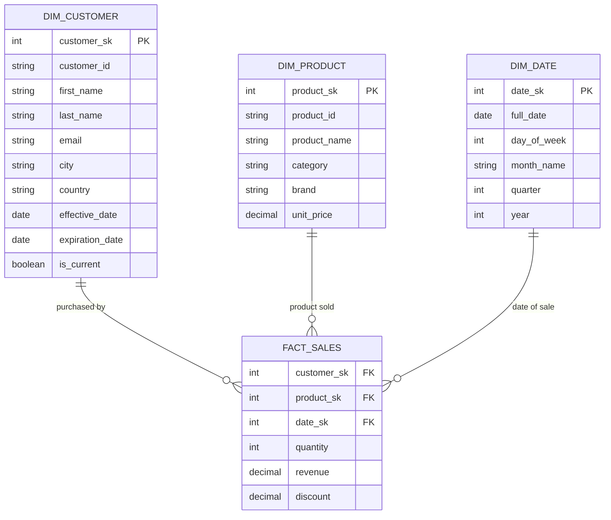
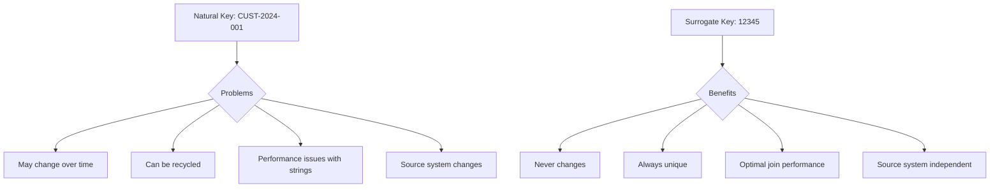
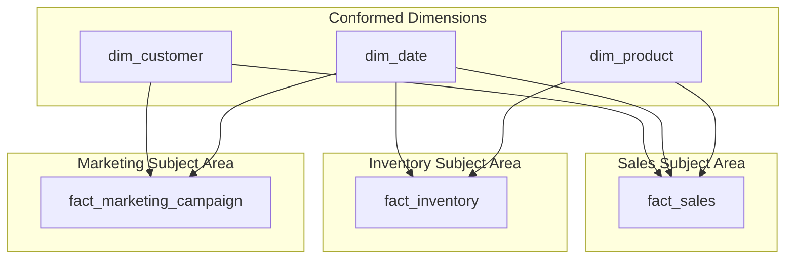
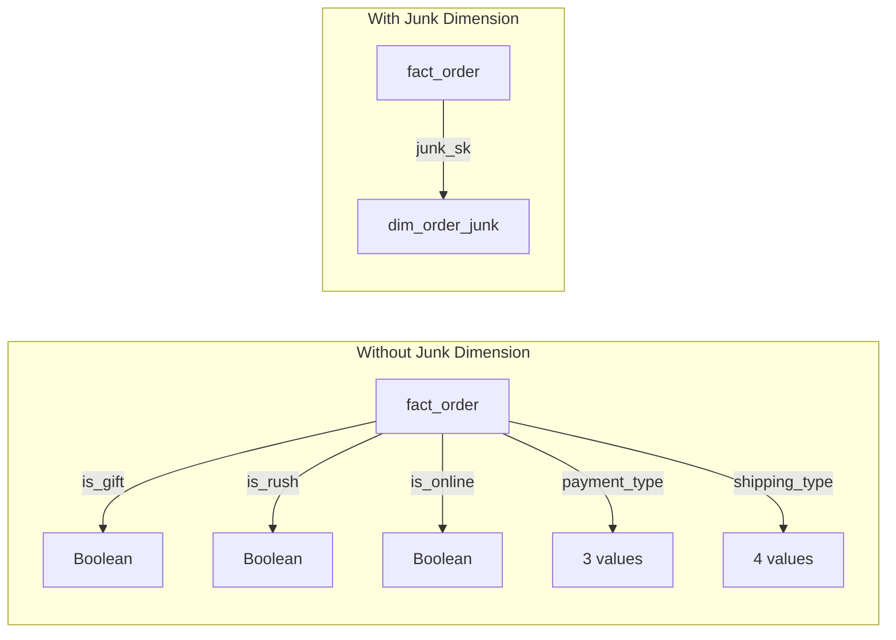
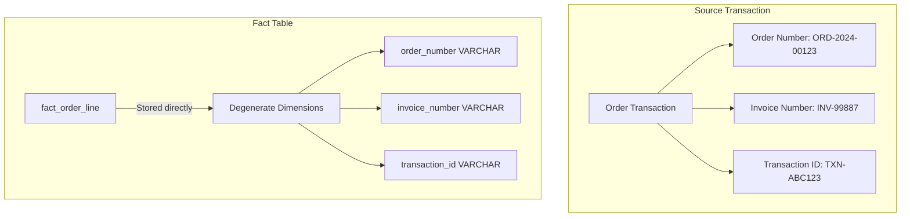
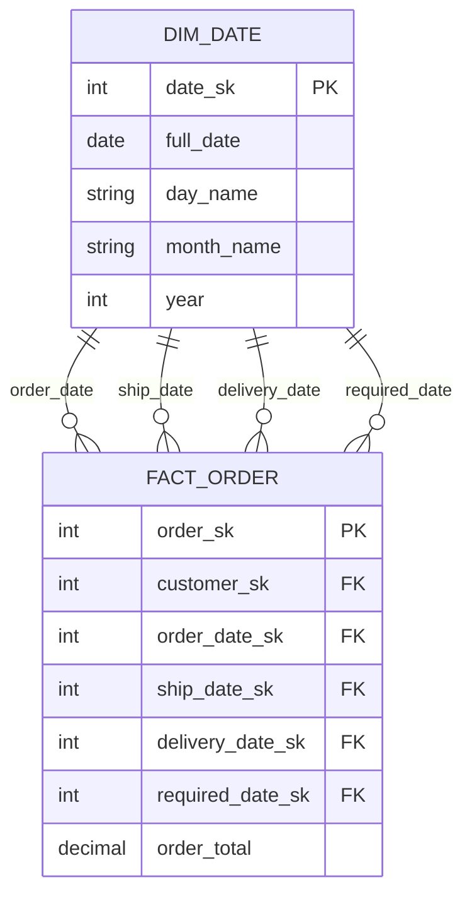
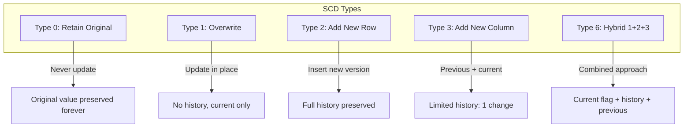
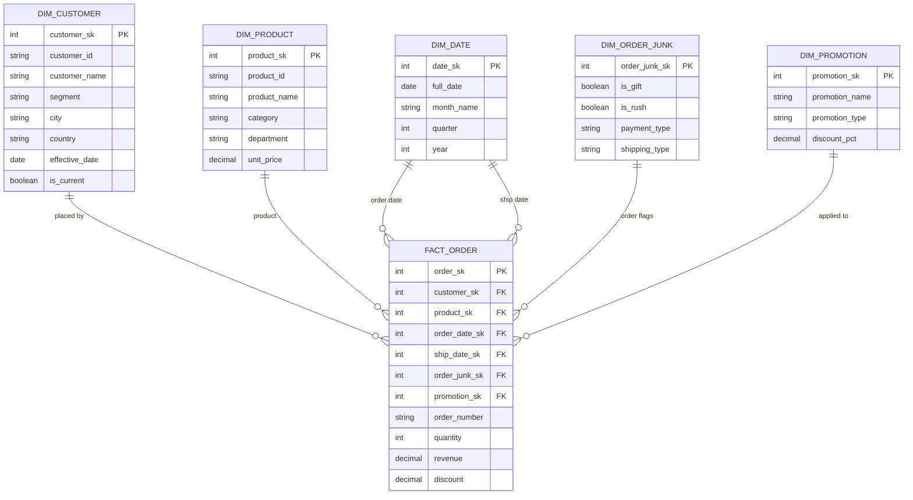

# How to Implement Dimension Table Design

Author: [nawazdhandala](https://github.com/nawazdhandala)

Tags: Data Warehouse, Dimensional Modeling, Dimensions, Data Engineering

Description: Learn how to design dimension tables for descriptive context in analytics.

---

Dimension tables are the backbone of any dimensional data warehouse. They provide the descriptive context that transforms raw transactional data into meaningful business insights. While fact tables capture the "what happened" and "how much," dimension tables answer the crucial questions of "who," "what," "where," "when," and "why."

This guide walks through the core concepts of dimension table design, covering surrogate key strategies, conformed dimensions, junk dimensions, degenerate dimensions, and role-playing dimensions with practical SQL examples you can adapt for production.

---

## Table of Contents

1. What Are Dimension Tables?
2. Surrogate Key Strategies
3. Conformed Dimensions
4. Junk Dimensions
5. Degenerate Dimensions
6. Role-Playing Dimensions
7. Slowly Changing Dimensions (SCD) Overview
8. Best Practices for Dimension Design
9. Complete Implementation Example
10. Common Anti-Patterns to Avoid

---

## 1. What Are Dimension Tables?

Dimension tables store descriptive attributes that provide context to the numeric measurements in fact tables. They are typically wide (many columns), shallow (fewer rows compared to fact tables), and contain textual or categorical data.



Key characteristics of dimension tables:

| Characteristic | Description |
|----------------|-------------|
| Denormalized | Flattened structure for query performance |
| Descriptive | Contains textual attributes for filtering and grouping |
| Slowly changing | Attributes may change over time (handled via SCD patterns) |
| Surrogate keyed | Uses synthetic keys instead of natural business keys |

---

## 2. Surrogate Key Strategies

Surrogate keys are artificial, system-generated identifiers that replace natural business keys. They provide several advantages over using natural keys directly.

### Why Use Surrogate Keys?



### Implementation Approaches

**Approach 1: Auto-incrementing integers (simplest)**

```sql
-- Create dimension table with auto-increment surrogate key
-- This is the most common approach for single-database warehouses
CREATE TABLE dim_customer (
    -- Surrogate key: auto-generated, never exposed to business users
    customer_sk INT IDENTITY(1,1) PRIMARY KEY,

    -- Natural key: the original business identifier from source system
    customer_id VARCHAR(50) NOT NULL,

    -- Descriptive attributes
    first_name VARCHAR(100),
    last_name VARCHAR(100),
    email VARCHAR(255),
    phone VARCHAR(20),

    -- Geographic attributes (denormalized for query performance)
    street_address VARCHAR(255),
    city VARCHAR(100),
    state VARCHAR(50),
    country VARCHAR(100),
    postal_code VARCHAR(20),

    -- Audit columns for tracking data lineage
    source_system VARCHAR(50),
    created_date DATETIME DEFAULT GETDATE(),
    updated_date DATETIME DEFAULT GETDATE(),

    -- Index on natural key for ETL lookups
    CONSTRAINT uq_customer_id UNIQUE (customer_id)
);

-- Create index for faster ETL lookups during dimension loading
CREATE INDEX idx_customer_natural_key ON dim_customer(customer_id);
```

**Approach 2: Sequence-based keys (better for distributed systems)**

```sql
-- Create a sequence for generating surrogate keys
-- Sequences provide more control and work across multiple tables
CREATE SEQUENCE seq_customer_sk
    START WITH 1
    INCREMENT BY 1
    NO MAXVALUE
    CACHE 1000;  -- Cache 1000 values for performance

-- Use sequence in table definition
CREATE TABLE dim_customer (
    customer_sk INT PRIMARY KEY DEFAULT NEXTVAL('seq_customer_sk'),
    customer_id VARCHAR(50) NOT NULL UNIQUE,
    -- ... other columns
);

-- Manual key generation during ETL (when you need the value beforehand)
INSERT INTO dim_customer (customer_sk, customer_id, first_name, last_name)
SELECT
    NEXTVAL('seq_customer_sk'),
    src.customer_id,
    src.first_name,
    src.last_name
FROM staging_customer src
WHERE NOT EXISTS (
    SELECT 1 FROM dim_customer d
    WHERE d.customer_id = src.customer_id
);
```

**Approach 3: Hash-based keys (for distributed/parallel loading)**

```sql
-- Hash-based surrogate keys work well for parallel ETL processes
-- They are deterministic: same input always produces same key
CREATE TABLE dim_customer (
    -- Use MD5 or SHA hash of natural key as surrogate
    -- Converted to BIGINT for join performance
    customer_sk BIGINT PRIMARY KEY,
    customer_id VARCHAR(50) NOT NULL UNIQUE,
    first_name VARCHAR(100),
    last_name VARCHAR(100)
);

-- Generate hash-based surrogate key during ETL
-- ABS() ensures positive values, modulo prevents overflow
INSERT INTO dim_customer (customer_sk, customer_id, first_name, last_name)
SELECT
    -- Create deterministic hash from natural key
    ABS(HASHBYTES('MD5', customer_id) % 9223372036854775807) AS customer_sk,
    customer_id,
    first_name,
    last_name
FROM staging_customer;
```

### Surrogate Key Lookup Pattern

During fact table loading, you need to look up surrogate keys:

```sql
-- Efficient surrogate key lookup during fact table ETL
-- This pattern is used millions of times during large loads
INSERT INTO fact_sales (
    customer_sk,
    product_sk,
    date_sk,
    quantity,
    revenue
)
SELECT
    -- Look up customer surrogate key (use COALESCE for unknown members)
    COALESCE(dc.customer_sk, -1) AS customer_sk,

    -- Look up product surrogate key
    COALESCE(dp.product_sk, -1) AS product_sk,

    -- Look up date surrogate key (dates should always exist)
    dd.date_sk,

    -- Measures from staging
    stg.quantity,
    stg.revenue
FROM staging_sales stg
-- Left joins allow facts with unknown dimensions to load
LEFT JOIN dim_customer dc ON stg.customer_id = dc.customer_id
LEFT JOIN dim_product dp ON stg.product_id = dp.product_id
-- Inner join on date assumes date dimension is pre-populated
INNER JOIN dim_date dd ON CAST(stg.sale_date AS DATE) = dd.full_date;
```

---

## 3. Conformed Dimensions

Conformed dimensions are dimensions that are shared across multiple fact tables and subject areas, ensuring consistent analysis across the enterprise.



### Types of Conformance

**1. Identical Conformed Dimensions**

The exact same dimension table is used across all fact tables:

```sql
-- Conformed date dimension used by ALL fact tables in the warehouse
-- This is the most common example of a conformed dimension
CREATE TABLE dim_date (
    date_sk INT PRIMARY KEY,
    full_date DATE NOT NULL UNIQUE,

    -- Calendar attributes
    day_of_week INT,              -- 1-7 (Sunday=1)
    day_of_week_name VARCHAR(10), -- 'Monday', 'Tuesday', etc.
    day_of_month INT,             -- 1-31
    day_of_year INT,              -- 1-366

    -- Week attributes
    week_of_year INT,             -- 1-53
    week_start_date DATE,
    week_end_date DATE,

    -- Month attributes
    month_number INT,             -- 1-12
    month_name VARCHAR(20),       -- 'January', 'February', etc.
    month_start_date DATE,
    month_end_date DATE,

    -- Quarter attributes
    quarter_number INT,           -- 1-4
    quarter_name VARCHAR(10),     -- 'Q1', 'Q2', etc.

    -- Year attributes
    calendar_year INT,

    -- Fiscal calendar (adjust based on your fiscal year)
    fiscal_month INT,
    fiscal_quarter INT,
    fiscal_year INT,

    -- Useful flags for filtering
    is_weekend BOOLEAN,
    is_holiday BOOLEAN,
    holiday_name VARCHAR(100),
    is_business_day BOOLEAN
);

-- Populate date dimension for 20 years (adjust range as needed)
-- This is typically done once during initial warehouse setup
INSERT INTO dim_date
WITH date_series AS (
    SELECT
        DATEADD(DAY, seq.n, '2020-01-01') AS full_date
    FROM (
        -- Generate sequence of numbers 0 to 7299 (20 years)
        SELECT ROW_NUMBER() OVER (ORDER BY (SELECT NULL)) - 1 AS n
        FROM sys.objects a, sys.objects b
    ) seq
    WHERE DATEADD(DAY, seq.n, '2020-01-01') <= '2039-12-31'
)
SELECT
    -- Surrogate key format: YYYYMMDD (easy to read and debug)
    CAST(FORMAT(full_date, 'yyyyMMdd') AS INT) AS date_sk,
    full_date,
    DATEPART(WEEKDAY, full_date) AS day_of_week,
    DATENAME(WEEKDAY, full_date) AS day_of_week_name,
    DAY(full_date) AS day_of_month,
    DATEPART(DAYOFYEAR, full_date) AS day_of_year,
    DATEPART(WEEK, full_date) AS week_of_year,
    DATEADD(DAY, 1 - DATEPART(WEEKDAY, full_date), full_date) AS week_start_date,
    DATEADD(DAY, 7 - DATEPART(WEEKDAY, full_date), full_date) AS week_end_date,
    MONTH(full_date) AS month_number,
    DATENAME(MONTH, full_date) AS month_name,
    DATEFROMPARTS(YEAR(full_date), MONTH(full_date), 1) AS month_start_date,
    EOMONTH(full_date) AS month_end_date,
    DATEPART(QUARTER, full_date) AS quarter_number,
    'Q' + CAST(DATEPART(QUARTER, full_date) AS VARCHAR) AS quarter_name,
    YEAR(full_date) AS calendar_year,
    -- Fiscal year starting in July (adjust for your organization)
    CASE WHEN MONTH(full_date) >= 7
         THEN MONTH(full_date) - 6
         ELSE MONTH(full_date) + 6 END AS fiscal_month,
    CASE WHEN MONTH(full_date) >= 7
         THEN (MONTH(full_date) - 7) / 3 + 1
         ELSE (MONTH(full_date) + 5) / 3 + 1 END AS fiscal_quarter,
    CASE WHEN MONTH(full_date) >= 7
         THEN YEAR(full_date) + 1
         ELSE YEAR(full_date) END AS fiscal_year,
    CASE WHEN DATEPART(WEEKDAY, full_date) IN (1, 7) THEN 1 ELSE 0 END AS is_weekend,
    0 AS is_holiday,  -- Populate separately with holiday calendar
    NULL AS holiday_name,
    CASE WHEN DATEPART(WEEKDAY, full_date) NOT IN (1, 7) THEN 1 ELSE 0 END AS is_business_day
FROM date_series;
```

**2. Shrunken Conformed Dimensions (Subset)**

A subset of attributes from a larger dimension, used when a fact table needs less granularity:

```sql
-- Full product dimension with all attributes
CREATE TABLE dim_product (
    product_sk INT PRIMARY KEY,
    product_id VARCHAR(50) NOT NULL,
    product_name VARCHAR(200),
    product_description TEXT,

    -- Category hierarchy (denormalized)
    category_id VARCHAR(50),
    category_name VARCHAR(100),
    subcategory_id VARCHAR(50),
    subcategory_name VARCHAR(100),
    department_id VARCHAR(50),
    department_name VARCHAR(100),

    -- Product attributes
    brand VARCHAR(100),
    color VARCHAR(50),
    size VARCHAR(20),
    weight_kg DECIMAL(10,2),

    -- Pricing
    unit_cost DECIMAL(10,2),
    unit_price DECIMAL(10,2),

    -- Status
    is_active BOOLEAN,
    launch_date DATE,
    discontinue_date DATE
);

-- Shrunken dimension for inventory snapshots (category level only)
-- Use this when fact grain is at category level, not product level
CREATE VIEW dim_product_category AS
SELECT DISTINCT
    -- Create category-level surrogate key
    category_id AS category_sk,
    category_id,
    category_name,
    subcategory_id,
    subcategory_name,
    department_id,
    department_name
FROM dim_product
WHERE category_id IS NOT NULL;
```

**3. Rollup Conformed Dimensions**

Pre-aggregated dimension for specific analytical needs:

```sql
-- Geographic dimension at multiple levels of granularity
-- Supports drill-down from country to city
CREATE TABLE dim_geography (
    geography_sk INT PRIMARY KEY,

    -- City level (finest grain)
    city_id VARCHAR(50),
    city_name VARCHAR(100),

    -- State/Province level
    state_id VARCHAR(50),
    state_name VARCHAR(100),
    state_abbreviation VARCHAR(10),

    -- Country level
    country_id VARCHAR(50),
    country_name VARCHAR(100),
    country_code_iso2 CHAR(2),
    country_code_iso3 CHAR(3),

    -- Region level (coarsest grain)
    region_id VARCHAR(50),
    region_name VARCHAR(100),

    -- Additional geographic data
    latitude DECIMAL(9,6),
    longitude DECIMAL(9,6),
    timezone VARCHAR(50),
    population INT
);

-- Create rollup views for different granularities
CREATE VIEW dim_geography_country AS
SELECT DISTINCT
    country_id AS geography_sk,
    country_id,
    country_name,
    country_code_iso2,
    country_code_iso3,
    region_id,
    region_name
FROM dim_geography;

CREATE VIEW dim_geography_region AS
SELECT DISTINCT
    region_id AS geography_sk,
    region_id,
    region_name
FROM dim_geography;
```

---

## 4. Junk Dimensions

Junk dimensions consolidate multiple low-cardinality flags and indicators into a single dimension table, reducing the number of foreign keys in fact tables.



### Creating a Junk Dimension

```sql
-- Junk dimension combining order flags and indicators
-- Instead of 5 separate FK columns, we use 1 surrogate key
CREATE TABLE dim_order_junk (
    order_junk_sk INT PRIMARY KEY,

    -- Order type flags
    is_gift_order BOOLEAN NOT NULL,
    is_rush_order BOOLEAN NOT NULL,
    is_online_order BOOLEAN NOT NULL,

    -- Categorical attributes with limited values
    payment_type VARCHAR(20) NOT NULL,      -- 'Credit', 'Debit', 'Cash'
    shipping_type VARCHAR(30) NOT NULL,     -- 'Standard', 'Express', 'Overnight', 'Pickup'

    -- Concatenated key for lookups during ETL
    junk_key VARCHAR(100) GENERATED ALWAYS AS (
        CONCAT(
            CAST(is_gift_order AS VARCHAR), '|',
            CAST(is_rush_order AS VARCHAR), '|',
            CAST(is_online_order AS VARCHAR), '|',
            payment_type, '|',
            shipping_type
        )
    ) STORED
);

-- Create unique index on the concatenated key for fast lookups
CREATE UNIQUE INDEX idx_order_junk_key ON dim_order_junk(junk_key);

-- Pre-populate all possible combinations
-- This ensures referential integrity during fact loading
INSERT INTO dim_order_junk (
    order_junk_sk,
    is_gift_order,
    is_rush_order,
    is_online_order,
    payment_type,
    shipping_type
)
WITH
-- Define all possible values for each attribute
gift_flag AS (SELECT * FROM (VALUES (0), (1)) AS t(is_gift)),
rush_flag AS (SELECT * FROM (VALUES (0), (1)) AS t(is_rush)),
online_flag AS (SELECT * FROM (VALUES (0), (1)) AS t(is_online)),
payment AS (SELECT * FROM (VALUES ('Credit'), ('Debit'), ('Cash')) AS t(payment_type)),
shipping AS (SELECT * FROM (VALUES ('Standard'), ('Express'), ('Overnight'), ('Pickup')) AS t(shipping_type))

-- Generate Cartesian product of all combinations
SELECT
    ROW_NUMBER() OVER (ORDER BY is_gift, is_rush, is_online, payment_type, shipping_type) AS order_junk_sk,
    CAST(is_gift AS BOOLEAN),
    CAST(is_rush AS BOOLEAN),
    CAST(is_online AS BOOLEAN),
    payment_type,
    shipping_type
FROM gift_flag
CROSS JOIN rush_flag
CROSS JOIN online_flag
CROSS JOIN payment
CROSS JOIN shipping;

-- Total combinations: 2 * 2 * 2 * 3 * 4 = 96 rows
-- This is much better than adding 5 columns to a billion-row fact table
```

### Using Junk Dimensions in ETL

```sql
-- Look up junk dimension key during fact table loading
INSERT INTO fact_order (
    order_sk,
    customer_sk,
    order_junk_sk,
    order_date_sk,
    order_total
)
SELECT
    stg.order_id,
    dc.customer_sk,
    -- Look up the junk dimension key using concatenated key
    dj.order_junk_sk,
    dd.date_sk,
    stg.order_total
FROM staging_orders stg
JOIN dim_customer dc ON stg.customer_id = dc.customer_id
JOIN dim_date dd ON CAST(stg.order_date AS DATE) = dd.full_date
-- Join to junk dimension using concatenated lookup key
JOIN dim_order_junk dj ON dj.junk_key = CONCAT(
    CAST(stg.is_gift AS VARCHAR), '|',
    CAST(stg.is_rush AS VARCHAR), '|',
    CAST(stg.is_online AS VARCHAR), '|',
    stg.payment_type, '|',
    stg.shipping_type
);
```

### Benefits of Junk Dimensions

| Benefit | Explanation |
|---------|-------------|
| Fewer fact table columns | Reduces fact table width and storage |
| Better query performance | Single join instead of multiple flag columns |
| Easier to add new flags | Just add combinations to junk dimension |
| Cleaner schema | Groups related flags logically |

---

## 5. Degenerate Dimensions

Degenerate dimensions are dimension attributes stored directly in the fact table, typically because they have no meaningful attributes beyond the identifier itself.



### Common Degenerate Dimensions

```sql
-- Fact table with degenerate dimensions
-- These are transaction identifiers that would create 1:1 dimension tables
CREATE TABLE fact_order_line (
    -- Surrogate key for the fact row
    order_line_sk BIGINT IDENTITY(1,1) PRIMARY KEY,

    -- Foreign keys to regular dimensions
    customer_sk INT REFERENCES dim_customer(customer_sk),
    product_sk INT REFERENCES dim_product(product_sk),
    order_date_sk INT REFERENCES dim_date(date_sk),
    ship_date_sk INT REFERENCES dim_date(date_sk),
    store_sk INT REFERENCES dim_store(store_sk),

    -- Degenerate dimensions (no separate dimension table needed)
    -- These are unique identifiers from the source transaction system
    order_number VARCHAR(50) NOT NULL,      -- Groups line items into orders
    invoice_number VARCHAR(50),              -- Links to invoice document
    shipment_tracking_number VARCHAR(100),   -- Carrier tracking ID
    purchase_order_number VARCHAR(50),       -- Customer PO reference

    -- Line item attributes
    line_number INT NOT NULL,

    -- Measures
    quantity INT NOT NULL,
    unit_price DECIMAL(10,2) NOT NULL,
    discount_amount DECIMAL(10,2) DEFAULT 0,
    tax_amount DECIMAL(10,2) DEFAULT 0,
    line_total DECIMAL(12,2) NOT NULL,

    -- Audit
    created_date DATETIME DEFAULT GETDATE()
);

-- Index on degenerate dimensions for common query patterns
-- Users often search by order number or invoice number
CREATE INDEX idx_fact_order_number ON fact_order_line(order_number);
CREATE INDEX idx_fact_invoice_number ON fact_order_line(invoice_number);
CREATE INDEX idx_fact_tracking_number ON fact_order_line(shipment_tracking_number);
```

### When to Use Degenerate Dimensions

Use degenerate dimensions when:

```sql
-- Example: Order number would create a useless dimension
-- This dimension adds NO value because it has no descriptive attributes
CREATE TABLE dim_order_number_bad_example (
    order_number_sk INT PRIMARY KEY,
    order_number VARCHAR(50) UNIQUE  -- This is the only attribute!
);

-- Instead, store order_number directly in the fact table
-- Query example: Find all line items for a specific order
SELECT
    f.order_number,
    f.line_number,
    p.product_name,
    f.quantity,
    f.line_total
FROM fact_order_line f
JOIN dim_product p ON f.product_sk = p.product_sk
WHERE f.order_number = 'ORD-2024-00123'
ORDER BY f.line_number;
```

### Degenerate Dimension vs Regular Dimension Decision

| Scenario | Recommendation |
|----------|----------------|
| ID with no other attributes | Degenerate dimension |
| ID with 1-2 attributes that never change | Consider degenerate with extra columns |
| ID with many attributes | Create regular dimension table |
| ID with attributes that change over time | Create regular dimension with SCD |
| ID that is frequently used for grouping | Regular dimension (better for aggregation) |

---

## 6. Role-Playing Dimensions

Role-playing dimensions are single physical dimension tables that appear multiple times in a fact table, each time playing a different logical role.



### Implementing Role-Playing Dimensions

```sql
-- Single physical date dimension table
CREATE TABLE dim_date (
    date_sk INT PRIMARY KEY,
    full_date DATE NOT NULL UNIQUE,
    day_of_week_name VARCHAR(10),
    month_name VARCHAR(20),
    quarter_number INT,
    calendar_year INT,
    fiscal_year INT,
    is_weekend BOOLEAN,
    is_holiday BOOLEAN
);

-- Fact table with multiple date roles
CREATE TABLE fact_order (
    order_sk BIGINT IDENTITY(1,1) PRIMARY KEY,
    customer_sk INT NOT NULL REFERENCES dim_customer(customer_sk),

    -- Multiple references to the same date dimension
    -- Each plays a different business role
    order_date_sk INT NOT NULL REFERENCES dim_date(date_sk),
    ship_date_sk INT REFERENCES dim_date(date_sk),           -- NULL if not shipped
    delivery_date_sk INT REFERENCES dim_date(date_sk),       -- NULL if not delivered
    required_date_sk INT REFERENCES dim_date(date_sk),       -- Customer requested date
    cancel_date_sk INT REFERENCES dim_date(date_sk),         -- NULL if not cancelled

    -- Measures
    order_total DECIMAL(12,2) NOT NULL,
    shipping_cost DECIMAL(10,2),
    tax_amount DECIMAL(10,2)
);

-- Create views for each role to simplify queries
-- These views act as "virtual" dimension tables
CREATE VIEW dim_order_date AS
SELECT
    date_sk AS order_date_sk,
    full_date AS order_date,
    day_of_week_name AS order_day_of_week,
    month_name AS order_month,
    quarter_number AS order_quarter,
    calendar_year AS order_year
FROM dim_date;

CREATE VIEW dim_ship_date AS
SELECT
    date_sk AS ship_date_sk,
    full_date AS ship_date,
    day_of_week_name AS ship_day_of_week,
    month_name AS ship_month,
    quarter_number AS ship_quarter,
    calendar_year AS ship_year
FROM dim_date;

CREATE VIEW dim_delivery_date AS
SELECT
    date_sk AS delivery_date_sk,
    full_date AS delivery_date,
    day_of_week_name AS delivery_day_of_week,
    month_name AS delivery_month,
    quarter_number AS delivery_quarter,
    calendar_year AS delivery_year
FROM dim_date;
```

### Querying Role-Playing Dimensions

```sql
-- Query using table aliases to join the same dimension multiple times
-- This is the fundamental pattern for role-playing dimensions
SELECT
    c.customer_name,

    -- Order date attributes
    order_d.full_date AS order_date,
    order_d.month_name AS order_month,

    -- Ship date attributes
    ship_d.full_date AS ship_date,
    ship_d.month_name AS ship_month,

    -- Calculate days between order and ship
    DATEDIFF(DAY, order_d.full_date, ship_d.full_date) AS days_to_ship,

    -- Delivery date attributes
    delivery_d.full_date AS delivery_date,
    DATEDIFF(DAY, ship_d.full_date, delivery_d.full_date) AS days_in_transit,

    f.order_total
FROM fact_order f
JOIN dim_customer c ON f.customer_sk = c.customer_sk
-- Same physical table joined multiple times with different aliases
JOIN dim_date order_d ON f.order_date_sk = order_d.date_sk
LEFT JOIN dim_date ship_d ON f.ship_date_sk = ship_d.date_sk
LEFT JOIN dim_date delivery_d ON f.delivery_date_sk = delivery_d.date_sk
WHERE order_d.calendar_year = 2024
  AND delivery_d.full_date IS NOT NULL;  -- Only delivered orders

-- Aggregate by different date roles
-- Find monthly order volume vs shipment volume
SELECT
    d.month_name,
    d.calendar_year,
    COUNT(DISTINCT f_ordered.order_sk) AS orders_placed,
    COUNT(DISTINCT f_shipped.order_sk) AS orders_shipped,
    SUM(f_ordered.order_total) AS order_value,
    SUM(f_shipped.order_total) AS shipped_value
FROM dim_date d
-- Orders placed in this month
LEFT JOIN fact_order f_ordered ON d.date_sk = f_ordered.order_date_sk
-- Orders shipped in this month
LEFT JOIN fact_order f_shipped ON d.date_sk = f_shipped.ship_date_sk
WHERE d.calendar_year = 2024
GROUP BY d.month_name, d.calendar_year, d.month_number
ORDER BY d.month_number;
```

### Other Common Role-Playing Scenarios

```sql
-- Employee dimension playing multiple roles
CREATE TABLE fact_support_ticket (
    ticket_sk BIGINT PRIMARY KEY,

    -- Same employee dimension, different roles
    created_by_employee_sk INT REFERENCES dim_employee(employee_sk),
    assigned_to_employee_sk INT REFERENCES dim_employee(employee_sk),
    resolved_by_employee_sk INT REFERENCES dim_employee(employee_sk),
    approved_by_employee_sk INT REFERENCES dim_employee(employee_sk),

    -- Dates
    created_date_sk INT REFERENCES dim_date(date_sk),
    resolved_date_sk INT REFERENCES dim_date(date_sk),

    -- Measures
    resolution_hours DECIMAL(10,2)
);

-- Geography dimension playing multiple roles
CREATE TABLE fact_shipment (
    shipment_sk BIGINT PRIMARY KEY,

    -- Same geography dimension, different roles
    origin_geography_sk INT REFERENCES dim_geography(geography_sk),
    destination_geography_sk INT REFERENCES dim_geography(geography_sk),
    billing_geography_sk INT REFERENCES dim_geography(geography_sk),

    -- Measures
    weight_kg DECIMAL(10,2),
    shipping_cost DECIMAL(10,2)
);
```

---

## 7. Slowly Changing Dimensions (SCD) Overview

Dimension attributes can change over time. Slowly Changing Dimension (SCD) techniques handle these changes while preserving historical context.



### SCD Type 2 Implementation (Most Common)

```sql
-- Type 2 SCD: Full history tracking with row versioning
CREATE TABLE dim_customer_scd2 (
    -- Surrogate key: unique per version of the customer
    customer_sk INT IDENTITY(1,1) PRIMARY KEY,

    -- Natural key: identifies the business entity
    customer_id VARCHAR(50) NOT NULL,

    -- Tracked attributes (changes create new rows)
    first_name VARCHAR(100),
    last_name VARCHAR(100),
    email VARCHAR(255),
    city VARCHAR(100),
    state VARCHAR(50),
    country VARCHAR(100),
    customer_segment VARCHAR(50),  -- e.g., 'Gold', 'Silver', 'Bronze'

    -- SCD Type 2 metadata columns
    effective_date DATE NOT NULL,           -- When this version became active
    expiration_date DATE NOT NULL,          -- When this version expired (9999-12-31 if current)
    is_current BOOLEAN NOT NULL DEFAULT 1,  -- Flag for easy filtering

    -- Row version for debugging
    version_number INT NOT NULL DEFAULT 1,

    -- Audit columns
    created_date DATETIME DEFAULT GETDATE(),
    created_by VARCHAR(100)
);

-- Indexes for common query patterns
CREATE INDEX idx_customer_scd2_natural ON dim_customer_scd2(customer_id, is_current);
CREATE INDEX idx_customer_scd2_effective ON dim_customer_scd2(customer_id, effective_date, expiration_date);
```

### SCD Type 2 ETL Process

```sql
-- Stored procedure for SCD Type 2 updates
-- This handles both new customers and changes to existing customers
CREATE PROCEDURE usp_load_dim_customer_scd2
AS
BEGIN
    DECLARE @today DATE = CAST(GETDATE() AS DATE);
    DECLARE @end_of_time DATE = '9999-12-31';

    -- Step 1: Expire changed records
    -- Find current dimension records where source data has changed
    UPDATE dim_customer_scd2
    SET
        expiration_date = DATEADD(DAY, -1, @today),
        is_current = 0
    WHERE is_current = 1
      AND customer_id IN (
          SELECT stg.customer_id
          FROM staging_customer stg
          JOIN dim_customer_scd2 dim
            ON stg.customer_id = dim.customer_id
           AND dim.is_current = 1
          WHERE -- Check if any tracked attribute has changed
              COALESCE(stg.first_name, '') <> COALESCE(dim.first_name, '')
           OR COALESCE(stg.last_name, '') <> COALESCE(dim.last_name, '')
           OR COALESCE(stg.email, '') <> COALESCE(dim.email, '')
           OR COALESCE(stg.city, '') <> COALESCE(dim.city, '')
           OR COALESCE(stg.state, '') <> COALESCE(dim.state, '')
           OR COALESCE(stg.country, '') <> COALESCE(dim.country, '')
           OR COALESCE(stg.customer_segment, '') <> COALESCE(dim.customer_segment, '')
      );

    -- Step 2: Insert new versions of changed records
    INSERT INTO dim_customer_scd2 (
        customer_id,
        first_name,
        last_name,
        email,
        city,
        state,
        country,
        customer_segment,
        effective_date,
        expiration_date,
        is_current,
        version_number
    )
    SELECT
        stg.customer_id,
        stg.first_name,
        stg.last_name,
        stg.email,
        stg.city,
        stg.state,
        stg.country,
        stg.customer_segment,
        @today AS effective_date,
        @end_of_time AS expiration_date,
        1 AS is_current,
        COALESCE(prev.version_number, 0) + 1 AS version_number
    FROM staging_customer stg
    LEFT JOIN dim_customer_scd2 prev
        ON stg.customer_id = prev.customer_id
       AND prev.expiration_date = DATEADD(DAY, -1, @today)  -- Just expired
    WHERE NOT EXISTS (
        -- Not already current in dimension
        SELECT 1 FROM dim_customer_scd2 dim
        WHERE dim.customer_id = stg.customer_id
          AND dim.is_current = 1
    );

    -- Step 3: Insert brand new customers (first time load)
    INSERT INTO dim_customer_scd2 (
        customer_id,
        first_name,
        last_name,
        email,
        city,
        state,
        country,
        customer_segment,
        effective_date,
        expiration_date,
        is_current,
        version_number
    )
    SELECT
        stg.customer_id,
        stg.first_name,
        stg.last_name,
        stg.email,
        stg.city,
        stg.state,
        stg.country,
        stg.customer_segment,
        @today AS effective_date,
        @end_of_time AS expiration_date,
        1 AS is_current,
        1 AS version_number
    FROM staging_customer stg
    WHERE NOT EXISTS (
        SELECT 1 FROM dim_customer_scd2 dim
        WHERE dim.customer_id = stg.customer_id
    );
END;
```

---

## 8. Best Practices for Dimension Design

### Checklist for Dimension Table Design

| Practice | Description |
|----------|-------------|
| Use surrogate keys | Always use system-generated keys, not natural keys |
| Denormalize aggressively | Include all attributes needed for analysis in one table |
| Add "Unknown" member | Create a default row (SK = -1) for missing dimension values |
| Use meaningful NULL handling | Replace NULLs with 'Unknown', 'N/A', or 'Not Applicable' |
| Include audit columns | Track when records were created and modified |
| Design for query patterns | Add calculated columns users frequently need |
| Keep names consistent | Use standard naming conventions across all dimensions |

### Standard Unknown Member Pattern

```sql
-- Insert unknown member for handling orphaned fact records
-- This is typically the first record loaded into every dimension
INSERT INTO dim_customer (
    customer_sk,
    customer_id,
    first_name,
    last_name,
    email,
    city,
    state,
    country,
    customer_segment
)
VALUES (
    -1,              -- Standard unknown surrogate key
    'UNKNOWN',       -- Natural key placeholder
    'Unknown',       -- Display value for reports
    'Customer',
    'unknown@unknown.com',
    'Unknown',
    'Unknown',
    'Unknown',
    'Unknown'
);

-- Insert unknown member for date dimension
INSERT INTO dim_date (
    date_sk,
    full_date,
    day_of_week_name,
    month_name,
    quarter_number,
    calendar_year,
    is_weekend,
    is_holiday
)
VALUES (
    -1,
    '1900-01-01',    -- Placeholder date
    'Unknown',
    'Unknown',
    0,
    1900,
    0,
    0
);
```

### Dimension Hierarchies

```sql
-- Product dimension with embedded hierarchy
-- Supports drill-down: Department > Category > Subcategory > Product
CREATE TABLE dim_product (
    product_sk INT PRIMARY KEY,
    product_id VARCHAR(50) NOT NULL,

    -- Product level (leaf)
    product_name VARCHAR(200),
    product_description TEXT,

    -- Subcategory level
    subcategory_id VARCHAR(50),
    subcategory_name VARCHAR(100),

    -- Category level
    category_id VARCHAR(50),
    category_name VARCHAR(100),

    -- Department level (root)
    department_id VARCHAR(50),
    department_name VARCHAR(100),

    -- Hierarchy path for easy breadcrumb display
    hierarchy_path VARCHAR(500) GENERATED ALWAYS AS (
        CONCAT(department_name, ' > ', category_name, ' > ', subcategory_name, ' > ', product_name)
    ) STORED,

    -- Level indicator for ragged hierarchies
    hierarchy_level INT DEFAULT 4  -- 1=Dept, 2=Cat, 3=Subcat, 4=Product
);
```

---

## 9. Complete Implementation Example

Here is a complete dimensional model for an e-commerce analytics system:



### Complete DDL Script

```sql
-- =================================================================
-- E-COMMERCE DIMENSIONAL MODEL - COMPLETE IMPLEMENTATION
-- =================================================================

-- -----------------------------------------------------------------
-- DIMENSION: Date (Conformed, Role-Playing)
-- -----------------------------------------------------------------
CREATE TABLE dim_date (
    date_sk INT PRIMARY KEY,
    full_date DATE NOT NULL UNIQUE,
    day_of_week INT,
    day_of_week_name VARCHAR(10),
    day_of_month INT,
    week_of_year INT,
    month_number INT,
    month_name VARCHAR(20),
    quarter_number INT,
    quarter_name VARCHAR(10),
    calendar_year INT,
    fiscal_quarter INT,
    fiscal_year INT,
    is_weekend BOOLEAN,
    is_holiday BOOLEAN,
    holiday_name VARCHAR(100)
);

-- Insert unknown member
INSERT INTO dim_date VALUES (-1, '1900-01-01', 0, 'Unknown', 0, 0, 0, 'Unknown', 0, 'Unknown', 1900, 0, 1900, 0, 0, NULL);

-- -----------------------------------------------------------------
-- DIMENSION: Customer (SCD Type 2)
-- -----------------------------------------------------------------
CREATE TABLE dim_customer (
    customer_sk INT IDENTITY(1,1) PRIMARY KEY,
    customer_id VARCHAR(50) NOT NULL,
    first_name VARCHAR(100),
    last_name VARCHAR(100),
    full_name VARCHAR(200) GENERATED ALWAYS AS (CONCAT(first_name, ' ', last_name)) STORED,
    email VARCHAR(255),
    phone VARCHAR(20),
    street_address VARCHAR(255),
    city VARCHAR(100),
    state VARCHAR(50),
    country VARCHAR(100),
    postal_code VARCHAR(20),
    customer_segment VARCHAR(50),
    loyalty_tier VARCHAR(20),
    effective_date DATE NOT NULL,
    expiration_date DATE NOT NULL,
    is_current BOOLEAN NOT NULL DEFAULT 1,
    version_number INT NOT NULL DEFAULT 1,
    source_system VARCHAR(50),
    created_date DATETIME DEFAULT GETDATE()
);

CREATE INDEX idx_customer_lookup ON dim_customer(customer_id, is_current);

-- Insert unknown member
SET IDENTITY_INSERT dim_customer ON;
INSERT INTO dim_customer (customer_sk, customer_id, first_name, last_name, email, city, state, country, customer_segment, effective_date, expiration_date, is_current)
VALUES (-1, 'UNKNOWN', 'Unknown', 'Customer', 'unknown@unknown.com', 'Unknown', 'Unknown', 'Unknown', 'Unknown', '1900-01-01', '9999-12-31', 1);
SET IDENTITY_INSERT dim_customer OFF;

-- -----------------------------------------------------------------
-- DIMENSION: Product (Standard)
-- -----------------------------------------------------------------
CREATE TABLE dim_product (
    product_sk INT IDENTITY(1,1) PRIMARY KEY,
    product_id VARCHAR(50) NOT NULL UNIQUE,
    product_name VARCHAR(200),
    product_description TEXT,
    sku VARCHAR(50),
    upc VARCHAR(20),
    brand VARCHAR(100),
    subcategory_id VARCHAR(50),
    subcategory_name VARCHAR(100),
    category_id VARCHAR(50),
    category_name VARCHAR(100),
    department_id VARCHAR(50),
    department_name VARCHAR(100),
    unit_cost DECIMAL(10,2),
    unit_price DECIMAL(10,2),
    weight_kg DECIMAL(10,2),
    is_active BOOLEAN DEFAULT 1,
    launch_date DATE,
    discontinue_date DATE,
    created_date DATETIME DEFAULT GETDATE()
);

-- Insert unknown member
SET IDENTITY_INSERT dim_product ON;
INSERT INTO dim_product (product_sk, product_id, product_name, category_name, department_name, unit_price, is_active)
VALUES (-1, 'UNKNOWN', 'Unknown Product', 'Unknown', 'Unknown', 0, 1);
SET IDENTITY_INSERT dim_product OFF;

-- -----------------------------------------------------------------
-- DIMENSION: Promotion (Standard)
-- -----------------------------------------------------------------
CREATE TABLE dim_promotion (
    promotion_sk INT IDENTITY(1,1) PRIMARY KEY,
    promotion_id VARCHAR(50) NOT NULL UNIQUE,
    promotion_name VARCHAR(200),
    promotion_description TEXT,
    promotion_type VARCHAR(50),
    discount_type VARCHAR(20),
    discount_value DECIMAL(10,2),
    discount_percent DECIMAL(5,2),
    start_date DATE,
    end_date DATE,
    is_active BOOLEAN DEFAULT 1,
    min_order_amount DECIMAL(10,2),
    max_discount_amount DECIMAL(10,2),
    created_date DATETIME DEFAULT GETDATE()
);

-- Insert "No Promotion" member
SET IDENTITY_INSERT dim_promotion ON;
INSERT INTO dim_promotion (promotion_sk, promotion_id, promotion_name, promotion_type, discount_type, discount_value, discount_percent)
VALUES (-1, 'NONE', 'No Promotion', 'None', 'None', 0, 0);
SET IDENTITY_INSERT dim_promotion OFF;

-- -----------------------------------------------------------------
-- DIMENSION: Order Junk (Junk Dimension)
-- -----------------------------------------------------------------
CREATE TABLE dim_order_junk (
    order_junk_sk INT PRIMARY KEY,
    is_gift_order BOOLEAN NOT NULL,
    is_rush_order BOOLEAN NOT NULL,
    is_online_order BOOLEAN NOT NULL,
    is_first_order BOOLEAN NOT NULL,
    payment_type VARCHAR(20) NOT NULL,
    shipping_type VARCHAR(30) NOT NULL,
    junk_key VARCHAR(100)
);

CREATE UNIQUE INDEX idx_order_junk_key ON dim_order_junk(junk_key);

-- Populate all combinations (2^4 * 3 * 4 = 192 rows)
-- In production, use a script to generate these
INSERT INTO dim_order_junk VALUES
(-1, 0, 0, 0, 0, 'Unknown', 'Unknown', 'Unknown'),
(1, 0, 0, 0, 0, 'Credit', 'Standard', '0|0|0|0|Credit|Standard'),
(2, 0, 0, 0, 0, 'Credit', 'Express', '0|0|0|0|Credit|Express'),
(3, 0, 0, 0, 0, 'Credit', 'Overnight', '0|0|0|0|Credit|Overnight'),
(4, 0, 0, 0, 0, 'Credit', 'Pickup', '0|0|0|0|Credit|Pickup'),
(5, 0, 0, 0, 0, 'Debit', 'Standard', '0|0|0|0|Debit|Standard'),
(6, 0, 0, 0, 0, 'Debit', 'Express', '0|0|0|0|Debit|Express')
-- ... continue for all combinations
;

-- -----------------------------------------------------------------
-- FACT: Order (Transaction Grain)
-- -----------------------------------------------------------------
CREATE TABLE fact_order (
    order_sk BIGINT IDENTITY(1,1) PRIMARY KEY,

    -- Dimension foreign keys
    customer_sk INT NOT NULL REFERENCES dim_customer(customer_sk),
    product_sk INT NOT NULL REFERENCES dim_product(product_sk),
    order_date_sk INT NOT NULL REFERENCES dim_date(date_sk),
    ship_date_sk INT REFERENCES dim_date(date_sk),
    delivery_date_sk INT REFERENCES dim_date(date_sk),
    promotion_sk INT NOT NULL DEFAULT -1 REFERENCES dim_promotion(promotion_sk),
    order_junk_sk INT NOT NULL DEFAULT -1 REFERENCES dim_order_junk(order_junk_sk),

    -- Degenerate dimensions
    order_number VARCHAR(50) NOT NULL,
    order_line_number INT NOT NULL,
    invoice_number VARCHAR(50),

    -- Measures
    quantity INT NOT NULL,
    unit_price DECIMAL(10,2) NOT NULL,
    extended_price DECIMAL(12,2) NOT NULL,
    discount_amount DECIMAL(10,2) DEFAULT 0,
    tax_amount DECIMAL(10,2) DEFAULT 0,
    shipping_amount DECIMAL(10,2) DEFAULT 0,
    net_amount DECIMAL(12,2) NOT NULL,

    -- Audit
    etl_batch_id INT,
    created_date DATETIME DEFAULT GETDATE()
);

-- Indexes for common query patterns
CREATE INDEX idx_fact_order_date ON fact_order(order_date_sk);
CREATE INDEX idx_fact_customer ON fact_order(customer_sk);
CREATE INDEX idx_fact_product ON fact_order(product_sk);
CREATE INDEX idx_fact_order_number ON fact_order(order_number);

-- -----------------------------------------------------------------
-- SAMPLE ANALYTICAL QUERIES
-- -----------------------------------------------------------------

-- Query 1: Sales by customer segment and product category
SELECT
    c.customer_segment,
    p.category_name,
    d.quarter_name,
    d.calendar_year,
    COUNT(DISTINCT f.order_number) AS total_orders,
    SUM(f.quantity) AS total_units,
    SUM(f.net_amount) AS total_revenue,
    AVG(f.net_amount) AS avg_order_value
FROM fact_order f
JOIN dim_customer c ON f.customer_sk = c.customer_sk AND c.is_current = 1
JOIN dim_product p ON f.product_sk = p.product_sk
JOIN dim_date d ON f.order_date_sk = d.date_sk
WHERE d.calendar_year = 2024
GROUP BY c.customer_segment, p.category_name, d.quarter_name, d.calendar_year
ORDER BY c.customer_segment, d.quarter_name;

-- Query 2: Shipping performance using role-playing dates
SELECT
    ship_d.month_name AS ship_month,
    j.shipping_type,
    COUNT(*) AS orders_shipped,
    AVG(DATEDIFF(DAY, order_d.full_date, ship_d.full_date)) AS avg_days_to_ship,
    AVG(DATEDIFF(DAY, ship_d.full_date, del_d.full_date)) AS avg_days_in_transit
FROM fact_order f
JOIN dim_date order_d ON f.order_date_sk = order_d.date_sk
JOIN dim_date ship_d ON f.ship_date_sk = ship_d.date_sk
LEFT JOIN dim_date del_d ON f.delivery_date_sk = del_d.date_sk
JOIN dim_order_junk j ON f.order_junk_sk = j.order_junk_sk
WHERE ship_d.calendar_year = 2024
GROUP BY ship_d.month_name, ship_d.month_number, j.shipping_type
ORDER BY ship_d.month_number, j.shipping_type;

-- Query 3: Promotion effectiveness
SELECT
    pr.promotion_name,
    pr.promotion_type,
    pr.discount_percent,
    COUNT(DISTINCT f.order_number) AS orders_with_promo,
    SUM(f.discount_amount) AS total_discount_given,
    SUM(f.net_amount) AS revenue_after_discount,
    SUM(f.discount_amount) / NULLIF(SUM(f.net_amount + f.discount_amount), 0) * 100 AS discount_rate_pct
FROM fact_order f
JOIN dim_promotion pr ON f.promotion_sk = pr.promotion_sk
WHERE pr.promotion_sk <> -1  -- Exclude "No Promotion"
GROUP BY pr.promotion_name, pr.promotion_type, pr.discount_percent
ORDER BY revenue_after_discount DESC;
```

---

## 10. Common Anti-Patterns to Avoid

| Anti-Pattern | Problem | Solution |
|--------------|---------|----------|
| Using natural keys as primary keys | Keys can change, be recycled, or have performance issues | Always use surrogate keys |
| Over-normalizing dimensions | Causes excessive joins, hurts query performance | Denormalize into single table |
| Missing unknown members | Causes referential integrity failures | Always create SK = -1 unknown row |
| Storing calculated values that change | Creates maintenance burden and staleness | Calculate at query time or use views |
| Too many junk dimension combinations | Exponential growth with each attribute | Limit to 5-6 low-cardinality attributes |
| Not indexing natural keys | Slow ETL lookups | Index natural key columns |
| Mixing SCD types in one table | Confusing behavior, hard to maintain | Pick one SCD type per dimension or use Type 6 |
| Wide fact tables with dimension attributes | Violates dimensional modeling principles | Move attributes to proper dimension tables |

---

## Summary

Dimension table design is fundamental to building a successful data warehouse. The key concepts covered in this guide include:

| Concept | Purpose | When to Use |
|---------|---------|-------------|
| Surrogate Keys | System-generated identifiers | Always use for dimension PKs |
| Conformed Dimensions | Shared dimensions across subject areas | When consistency across facts is needed |
| Junk Dimensions | Consolidate low-cardinality flags | When you have multiple boolean/flag columns |
| Degenerate Dimensions | Transaction IDs in fact tables | When dimension would have no attributes |
| Role-Playing Dimensions | Same dimension, multiple roles | When fact has multiple FKs to same dimension |
| SCD Type 2 | Track full attribute history | When historical analysis is required |

Well-designed dimensions provide the foundation for intuitive, high-performance analytics. Invest time in getting them right, and your users will be able to slice and dice their data effectively without needing to understand the underlying complexity.

---

### See Also

- [Star Schema vs Snowflake Schema](/blog/post/star-vs-snowflake-schema/) - Understanding the two main dimensional modeling approaches
- [Fact Table Design Patterns](/blog/post/fact-table-design-patterns/) - Deep dive into fact table types and granularity
- [ETL Best Practices for Data Warehouses](/blog/post/etl-best-practices/) - Loading strategies for dimensional models
