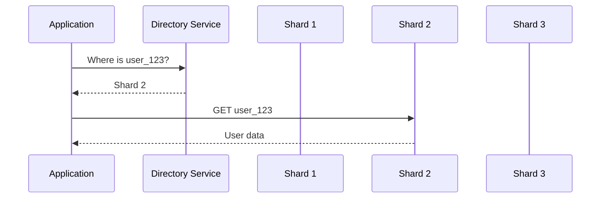
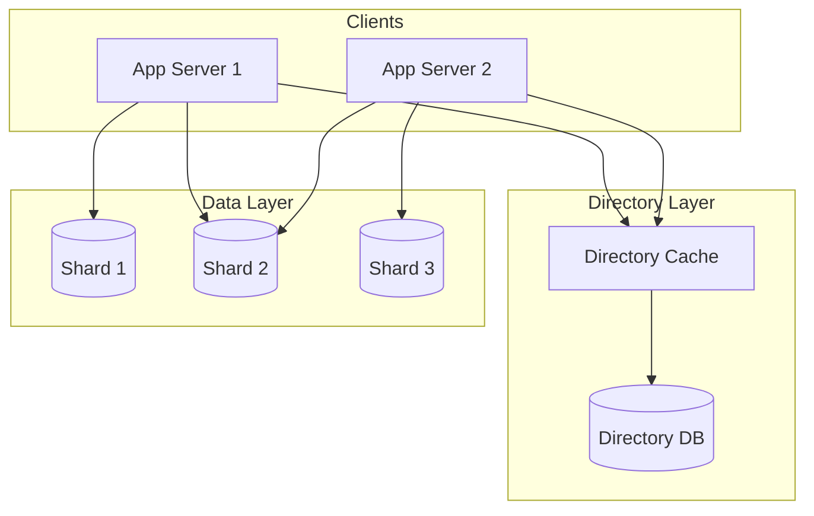
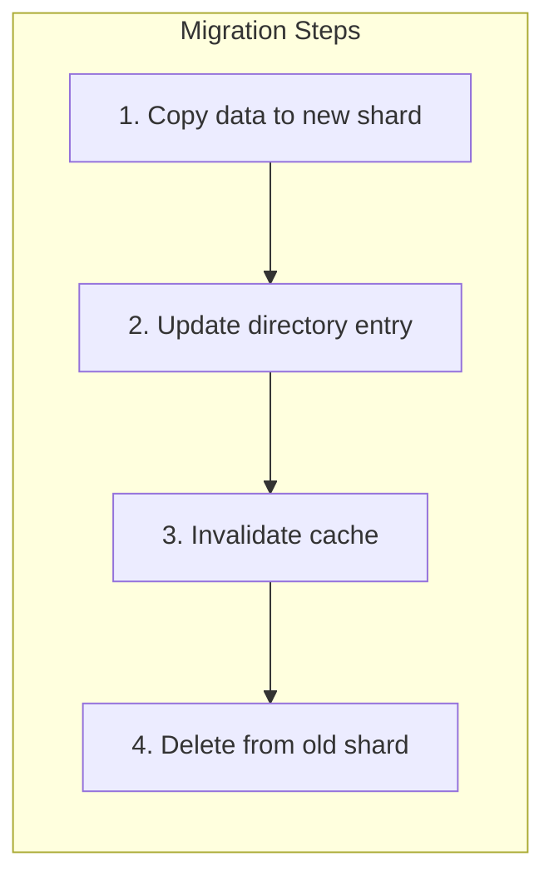

# How to Create Directory-Based Sharding

Author: [nawazdhandala](https://github.com/nawazdhandala)

Tags: Database, Sharding, Distributed Systems, Scalability

Description: Learn to create directory-based sharding using lookup tables for flexible data distribution.

---

When a single database can no longer handle your workload, sharding becomes necessary. Among the various sharding strategies, directory-based sharding stands out for its flexibility and control. Unlike hash-based or range-based approaches, directory-based sharding uses a lookup table to map each piece of data to its designated shard. This gives you complete control over data placement and makes rebalancing straightforward.

## What is Directory-Based Sharding?

Directory-based sharding maintains a separate lookup service that knows exactly which shard holds each piece of data. When your application needs to read or write a record, it first queries this directory to find the correct shard, then routes the request accordingly.

The following diagram shows how a request flows through a directory-based sharding system.



## Comparing Sharding Strategies

Before diving into implementation, understanding when to use directory-based sharding helps you make better architectural decisions.

| Strategy | How it Works | Best For | Trade-offs |
| --- | --- | --- | --- |
| **Hash-Based** | Hash the shard key, mod by shard count | Even distribution, simple routing | Adding shards requires reshuffling data |
| **Range-Based** | Assign key ranges to shards | Time-series, sequential data | Hot spots if ranges are accessed unevenly |
| **Directory-Based** | Lookup table maps keys to shards | Complex routing rules, flexible rebalancing | Extra lookup hop, directory becomes critical path |

Directory-based sharding works best when you need fine-grained control over data placement, have complex routing requirements, or want the ability to move individual records between shards without downtime.

## Architecture Overview

A directory-based sharding system has three main components: the directory service, the shard registry, and the shards themselves.



The directory database stores the mapping between shard keys and shard locations. A caching layer sits in front to reduce lookup latency. Application servers query the cache first, falling back to the directory database on cache misses.

## Implementing the Directory Service

The directory service needs to store mappings and provide fast lookups. Here is a basic schema for the directory table.

```sql
-- Directory table stores the mapping between entity keys and shards
CREATE TABLE shard_directory (
    entity_type VARCHAR(50) NOT NULL,    -- e.g., 'user', 'order', 'product'
    entity_id VARCHAR(255) NOT NULL,      -- the actual key being sharded
    shard_id VARCHAR(50) NOT NULL,        -- identifier for the target shard
    created_at TIMESTAMP DEFAULT NOW(),
    updated_at TIMESTAMP DEFAULT NOW(),
    PRIMARY KEY (entity_type, entity_id)
);

-- Index for finding all entities on a specific shard (useful for migrations)
CREATE INDEX idx_shard_lookup ON shard_directory(shard_id);
```

You also need a registry that tracks available shards and their connection details.

```sql
-- Shard registry tracks all available shards and their status
CREATE TABLE shard_registry (
    shard_id VARCHAR(50) PRIMARY KEY,
    host VARCHAR(255) NOT NULL,
    port INTEGER NOT NULL,
    status VARCHAR(20) DEFAULT 'active',  -- active, draining, offline
    capacity_weight INTEGER DEFAULT 100,   -- for load balancing new assignments
    created_at TIMESTAMP DEFAULT NOW()
);
```

## Building the Routing Layer

The routing layer handles lookups and caches results for performance. The following Python implementation demonstrates the core logic.

```python
import redis
import psycopg2
from typing import Optional, Dict
import json

class ShardRouter:
    def __init__(self, directory_db_config: Dict, cache_config: Dict):
        # Connect to the directory database for authoritative lookups
        self.db = psycopg2.connect(**directory_db_config)

        # Redis cache reduces directory database load
        self.cache = redis.Redis(**cache_config)
        self.cache_ttl = 300  # 5 minutes

        # Local cache of shard connection details
        self.shard_connections = {}
        self._load_shard_registry()

    def _load_shard_registry(self):
        """Load all shard connection details into memory."""
        cursor = self.db.cursor()
        cursor.execute(
            "SELECT shard_id, host, port, status FROM shard_registry WHERE status = 'active'"
        )
        for row in cursor.fetchall():
            shard_id, host, port, status = row
            self.shard_connections[shard_id] = {
                'host': host,
                'port': port,
                'status': status
            }
        cursor.close()

    def get_shard(self, entity_type: str, entity_id: str) -> Optional[str]:
        """Find which shard holds a given entity."""
        cache_key = f"shard:{entity_type}:{entity_id}"

        # Check cache first to avoid database round trip
        cached = self.cache.get(cache_key)
        if cached:
            return cached.decode('utf-8')

        # Cache miss: query the directory database
        cursor = self.db.cursor()
        cursor.execute(
            "SELECT shard_id FROM shard_directory WHERE entity_type = %s AND entity_id = %s",
            (entity_type, entity_id)
        )
        row = cursor.fetchone()
        cursor.close()

        if row:
            shard_id = row[0]
            # Populate cache for future requests
            self.cache.setex(cache_key, self.cache_ttl, shard_id)
            return shard_id

        return None

    def assign_shard(self, entity_type: str, entity_id: str) -> str:
        """Assign a new entity to a shard using weighted random selection."""
        # Get active shards weighted by capacity
        cursor = self.db.cursor()
        cursor.execute(
            "SELECT shard_id, capacity_weight FROM shard_registry WHERE status = 'active'"
        )
        shards = cursor.fetchall()

        # Weighted random selection for even distribution
        import random
        total_weight = sum(weight for _, weight in shards)
        pick = random.randint(1, total_weight)

        current = 0
        selected_shard = shards[0][0]
        for shard_id, weight in shards:
            current += weight
            if pick <= current:
                selected_shard = shard_id
                break

        # Record the assignment in the directory
        cursor.execute(
            """INSERT INTO shard_directory (entity_type, entity_id, shard_id)
               VALUES (%s, %s, %s)
               ON CONFLICT (entity_type, entity_id) DO UPDATE SET shard_id = %s""",
            (entity_type, entity_id, selected_shard, selected_shard)
        )
        self.db.commit()
        cursor.close()

        return selected_shard
```

## Using the Router in Your Application

With the router in place, your application code becomes straightforward. Here is how you would use it for user operations.

```python
class UserService:
    def __init__(self, shard_router: ShardRouter):
        self.router = shard_router

    def get_user(self, user_id: str) -> Optional[Dict]:
        """Fetch a user from the appropriate shard."""
        # Find which shard has this user
        shard_id = self.router.get_shard('user', user_id)

        if not shard_id:
            return None

        # Get connection details and query the shard
        conn_info = self.router.shard_connections[shard_id]
        shard_db = self._connect_to_shard(conn_info)

        cursor = shard_db.cursor()
        cursor.execute("SELECT * FROM users WHERE id = %s", (user_id,))
        user = cursor.fetchone()
        cursor.close()

        return user

    def create_user(self, user_id: str, user_data: Dict) -> bool:
        """Create a new user on an assigned shard."""
        # Assign this user to a shard
        shard_id = self.router.assign_shard('user', user_id)

        # Insert the user on the assigned shard
        conn_info = self.router.shard_connections[shard_id]
        shard_db = self._connect_to_shard(conn_info)

        cursor = shard_db.cursor()
        cursor.execute(
            "INSERT INTO users (id, name, email) VALUES (%s, %s, %s)",
            (user_id, user_data['name'], user_data['email'])
        )
        shard_db.commit()
        cursor.close()

        return True
```

## Handling Shard Migrations

One of the main advantages of directory-based sharding is the ability to move data between shards. The migration process involves copying data, updating the directory, and cleaning up.



The following migration function handles moving a single entity between shards.

```python
def migrate_entity(router: ShardRouter, entity_type: str, entity_id: str, target_shard: str):
    """Move an entity from its current shard to a new one."""
    # Find current location
    current_shard = router.get_shard(entity_type, entity_id)

    if current_shard == target_shard:
        return  # Already on target shard

    # Step 1: Copy data to new shard
    source_conn = router._connect_to_shard(router.shard_connections[current_shard])
    target_conn = router._connect_to_shard(router.shard_connections[target_shard])

    # Read from source
    cursor = source_conn.cursor()
    cursor.execute(f"SELECT * FROM {entity_type}s WHERE id = %s", (entity_id,))
    data = cursor.fetchone()

    # Write to target
    target_cursor = target_conn.cursor()
    target_cursor.execute(
        f"INSERT INTO {entity_type}s VALUES %s ON CONFLICT DO NOTHING",
        (data,)
    )
    target_conn.commit()

    # Step 2: Update directory (atomic switch)
    dir_cursor = router.db.cursor()
    dir_cursor.execute(
        "UPDATE shard_directory SET shard_id = %s WHERE entity_type = %s AND entity_id = %s",
        (target_shard, entity_type, entity_id)
    )
    router.db.commit()

    # Step 3: Invalidate cache
    cache_key = f"shard:{entity_type}:{entity_id}"
    router.cache.delete(cache_key)

    # Step 4: Delete from old shard (cleanup)
    cursor.execute(f"DELETE FROM {entity_type}s WHERE id = %s", (entity_id,))
    source_conn.commit()
```

## Making the Directory Highly Available

The directory service sits on the critical path for every request, so it needs to be resilient. Consider these patterns for production deployments.

| Concern | Solution |
| --- | --- |
| **Single point of failure** | Run directory database with replication (PostgreSQL streaming replication, CockroachDB, or similar) |
| **Cache stampede** | Use probabilistic early expiration or cache locking |
| **Stale cache entries** | Publish invalidation events when directory changes |
| **Directory database overload** | Aggressive caching with longer TTLs, read replicas |

For critical applications, consider running the directory on a distributed database like CockroachDB or TiDB that handles replication and failover automatically.

## Monitoring Your Shards

Track these metrics to keep your sharding layer healthy:

- **Directory lookup latency** (p50, p95, p99)
- **Cache hit ratio** (should be above 90%)
- **Per-shard query distribution** (watch for hot shards)
- **Shard capacity utilization** (disk, connections, CPU)
- **Migration queue depth** (if running background rebalancing)

Set up alerts when any shard receives more than 150% of average traffic or when directory lookup latency exceeds your SLO. Tools like OneUptime can aggregate these metrics and wake you up when something goes wrong.

## When to Choose Directory-Based Sharding

Directory-based sharding adds complexity but provides control that other strategies cannot match. Choose this approach when you need to move specific customers to dedicated shards for compliance, want to place related entities on the same shard to enable joins, or require the ability to rebalance without reshuffling your entire dataset.

If your routing logic is simple and even distribution is sufficient, hash-based sharding will serve you with less overhead. But when your sharding requirements evolve, having a directory in place makes adaptation possible without rebuilding your data layer from scratch.
