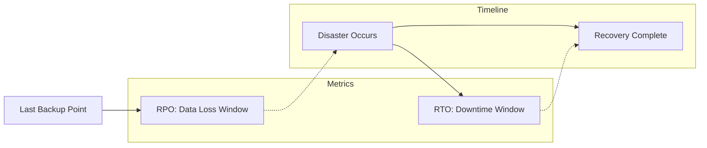
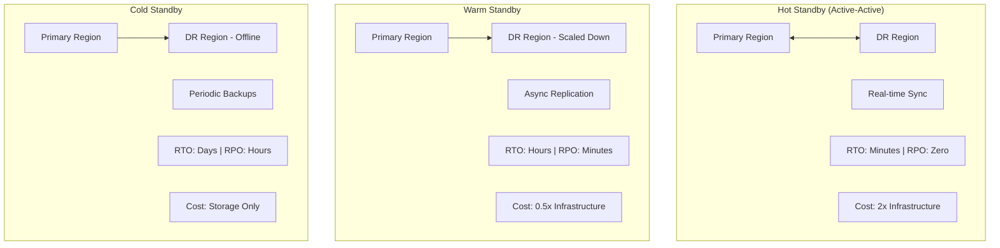
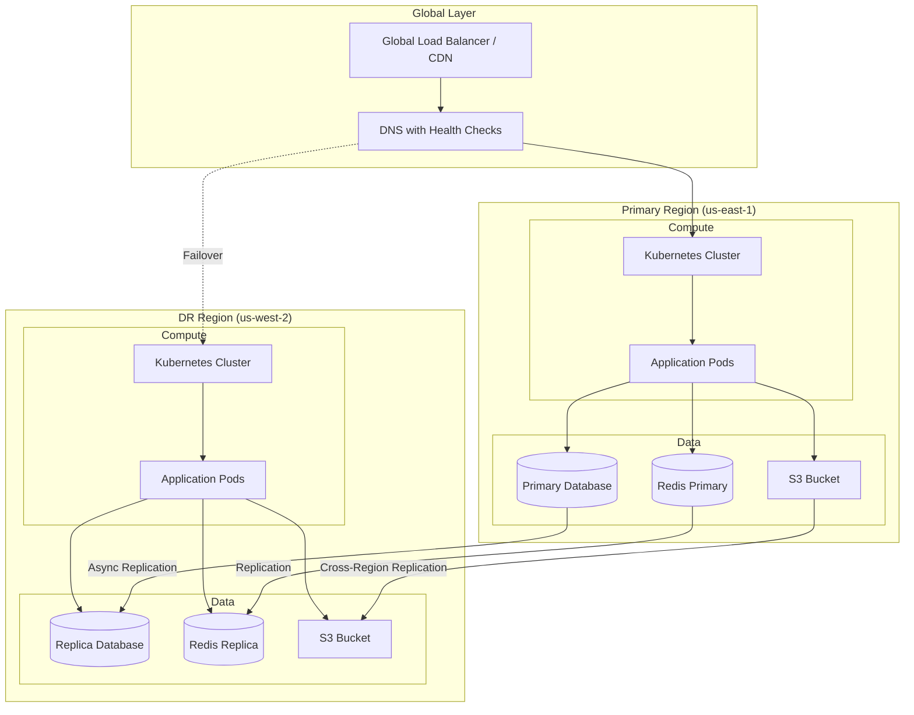
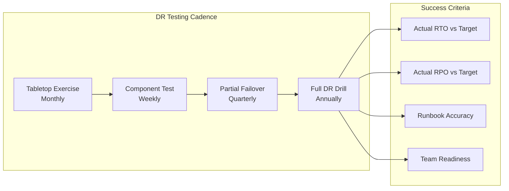

# How to Build Disaster Recovery Planning

Author: [nawazdhandala](https://github.com/nawazdhandala)

Tags: Disaster Recovery, Business Continuity, SRE, Infrastructure

Description: Learn how to design disaster recovery plans with RPO and RTO objectives for critical systems.

---

When systems fail, the difference between a minor inconvenience and a catastrophic business impact comes down to one thing: your disaster recovery plan. This guide walks you through building a comprehensive DR strategy that protects your critical systems.

## Understanding RPO and RTO

Before designing any DR solution, you must define two critical metrics:



### Recovery Point Objective (RPO)

RPO answers: "How much data can we afford to lose?"

- **RPO = 0**: No data loss acceptable. Requires synchronous replication.
- **RPO = 1 hour**: Up to 1 hour of data loss acceptable. Hourly backups or async replication.
- **RPO = 24 hours**: Daily backups sufficient. Lower cost but higher risk.

### Recovery Time Objective (RTO)

RTO answers: "How long can we be down?"

- **RTO = 0**: No downtime acceptable. Requires active-active architecture.
- **RTO = 1 hour**: Must recover within 1 hour. Hot standby required.
- **RTO = 24 hours**: Can tolerate day-long outage. Cold standby acceptable.

### Calculating RPO and RTO by Business Impact

```python
# Framework for calculating RPO/RTO based on business impact
# This helps prioritize which systems need tighter objectives

def calculate_recovery_objectives(
    hourly_revenue: float,          # Revenue generated per hour
    transaction_volume: int,        # Transactions per hour
    regulatory_requirements: str,   # 'none', 'moderate', 'strict'
    customer_impact: str,           # 'low', 'medium', 'high', 'critical'
    data_recreation_cost: float     # Cost to recreate lost data manually
) -> dict:
    """
    Calculate recommended RPO and RTO based on business factors.
    Returns objectives in hours.
    """

    # Base calculations
    # Higher revenue = tighter objectives needed
    revenue_factor = min(hourly_revenue / 10000, 1.0)

    # Map customer impact to multiplier
    # Critical systems need faster recovery
    impact_multipliers = {
        'low': 1.0,
        'medium': 0.5,
        'high': 0.25,
        'critical': 0.1
    }
    impact_factor = impact_multipliers.get(customer_impact, 1.0)

    # Regulatory requirements tighten objectives
    # Financial and healthcare systems often have strict requirements
    regulatory_factors = {
        'none': 1.0,
        'moderate': 0.5,
        'strict': 0.1
    }
    reg_factor = regulatory_factors.get(regulatory_requirements, 1.0)

    # Calculate base RTO (starting from 24 hours max)
    base_rto = 24.0
    rto = base_rto * impact_factor * reg_factor * (1 - revenue_factor)
    rto = max(rto, 0.25)  # Minimum 15 minutes

    # Calculate RPO based on data recreation cost and transaction volume
    # Higher costs and volumes = need tighter RPO
    if data_recreation_cost > 100000 or transaction_volume > 10000:
        rpo = min(rto / 2, 1.0)  # At most 1 hour
    elif data_recreation_cost > 10000 or transaction_volume > 1000:
        rpo = min(rto, 4.0)      # At most 4 hours
    else:
        rpo = min(rto * 2, 24.0) # At most 24 hours

    return {
        'rpo_hours': round(rpo, 2),
        'rto_hours': round(rto, 2),
        'recommended_strategy': _get_strategy(rto, rpo),
        'estimated_annual_cost': _estimate_cost(rto, rpo)
    }

def _get_strategy(rto: float, rpo: float) -> str:
    """
    Recommend DR strategy based on objectives.
    """
    if rto <= 0.25 and rpo <= 0.25:
        return 'hot_standby_sync_replication'
    elif rto <= 1.0 and rpo <= 1.0:
        return 'hot_standby_async_replication'
    elif rto <= 4.0:
        return 'warm_standby'
    else:
        return 'cold_standby'

def _estimate_cost(rto: float, rpo: float) -> str:
    """
    Rough cost tier based on objectives.
    Tighter objectives = higher infrastructure costs.
    """
    if rto <= 0.25:
        return 'very_high'  # 2x or more of primary infrastructure
    elif rto <= 1.0:
        return 'high'       # 1.5x of primary infrastructure
    elif rto <= 4.0:
        return 'medium'     # 0.5x of primary infrastructure
    else:
        return 'low'        # Minimal standby costs


# Example usage for different system types
if __name__ == "__main__":
    # E-commerce payment system
    payment_system = calculate_recovery_objectives(
        hourly_revenue=50000,
        transaction_volume=5000,
        regulatory_requirements='strict',
        customer_impact='critical',
        data_recreation_cost=500000
    )
    print(f"Payment System: RPO={payment_system['rpo_hours']}h, "
          f"RTO={payment_system['rto_hours']}h, "
          f"Strategy={payment_system['recommended_strategy']}")

    # Internal reporting dashboard
    reporting = calculate_recovery_objectives(
        hourly_revenue=100,
        transaction_volume=50,
        regulatory_requirements='none',
        customer_impact='low',
        data_recreation_cost=1000
    )
    print(f"Reporting: RPO={reporting['rpo_hours']}h, "
          f"RTO={reporting['rto_hours']}h, "
          f"Strategy={reporting['recommended_strategy']}")
```

## DR Standby Strategies

There are three primary standby strategies, each with different cost and recovery characteristics:



### Hot Standby Architecture

Hot standby provides the fastest recovery with zero or near-zero data loss. Both sites actively process traffic.

```yaml
# Kubernetes configuration for hot standby deployment
# Both regions run identical workloads simultaneously

# Primary region deployment
apiVersion: apps/v1
kind: Deployment
metadata:
  name: api-server
  namespace: production
  labels:
    app: api-server
    region: us-east-1
    dr-tier: hot-standby
spec:
  replicas: 3
  selector:
    matchLabels:
      app: api-server
  template:
    metadata:
      labels:
        app: api-server
        region: us-east-1
    spec:
      # Spread pods across availability zones for local HA
      topologySpreadConstraints:
        - maxSkew: 1
          topologyKey: topology.kubernetes.io/zone
          whenUnsatisfiable: DoNotSchedule
          labelSelector:
            matchLabels:
              app: api-server
      containers:
        - name: api
          image: myapp/api:v2.1.0
          ports:
            - containerPort: 8080
          # Health checks ensure traffic only goes to healthy pods
          readinessProbe:
            httpGet:
              path: /health/ready
              port: 8080
            initialDelaySeconds: 5
            periodSeconds: 10
          livenessProbe:
            httpGet:
              path: /health/live
              port: 8080
            initialDelaySeconds: 15
            periodSeconds: 20
          resources:
            requests:
              memory: "256Mi"
              cpu: "250m"
            limits:
              memory: "512Mi"
              cpu: "500m"
          env:
            # Database connection uses global endpoint
            # This allows automatic failover to DR region
            - name: DATABASE_URL
              valueFrom:
                secretKeyRef:
                  name: db-credentials
                  key: global-endpoint
            # Region identifier for logging and metrics
            - name: REGION
              value: "us-east-1"
---
# Global load balancer service using external-dns
# Automatically updates DNS for multi-region routing
apiVersion: v1
kind: Service
metadata:
  name: api-server-global
  annotations:
    # External DNS will create weighted DNS records
    external-dns.alpha.kubernetes.io/hostname: api.example.com
    external-dns.alpha.kubernetes.io/ttl: "60"
    # 50% traffic to each region in active-active mode
    external-dns.alpha.kubernetes.io/set-identifier: us-east-1
    external-dns.alpha.kubernetes.io/aws-weight: "50"
spec:
  type: LoadBalancer
  selector:
    app: api-server
  ports:
    - port: 443
      targetPort: 8080
```

### Warm Standby Architecture

Warm standby keeps a scaled-down version of your infrastructure running in the DR region.

```yaml
# Warm standby configuration
# DR region runs minimal replicas, scales up during failover

apiVersion: apps/v1
kind: Deployment
metadata:
  name: api-server
  namespace: production
  labels:
    app: api-server
    region: us-west-2
    dr-tier: warm-standby
spec:
  # Minimal replicas during normal operation
  # Keeps pods warm and ready to scale
  replicas: 1
  selector:
    matchLabels:
      app: api-server
  template:
    metadata:
      labels:
        app: api-server
        region: us-west-2
    spec:
      containers:
        - name: api
          image: myapp/api:v2.1.0
          ports:
            - containerPort: 8080
          env:
            # Points to read replica in DR region
            # Will be updated to primary during failover
            - name: DATABASE_URL
              valueFrom:
                secretKeyRef:
                  name: db-credentials
                  key: replica-endpoint
            - name: REGION
              value: "us-west-2"
            # Flag indicates this is DR environment
            - name: DR_MODE
              value: "warm-standby"
---
# Horizontal Pod Autoscaler for DR region
# Allows rapid scale-up during failover event
apiVersion: autoscaling/v2
kind: HorizontalPodAutoscaler
metadata:
  name: api-server-hpa
  namespace: production
spec:
  scaleTargetRef:
    apiVersion: apps/v1
    kind: Deployment
    name: api-server
  # Can scale from 1 to 10 replicas
  minReplicas: 1
  maxReplicas: 10
  metrics:
    - type: Resource
      resource:
        name: cpu
        target:
          type: Utilization
          averageUtilization: 70
  # Fast scale-up for DR scenarios
  behavior:
    scaleUp:
      stabilizationWindowSeconds: 0
      policies:
        - type: Percent
          value: 100
          periodSeconds: 15
        - type: Pods
          value: 4
          periodSeconds: 15
      selectPolicy: Max
```

### Cold Standby Architecture

Cold standby relies on backups and infrastructure-as-code to rebuild the environment.

```bash
#!/bin/bash
# cold-standby-restore.sh
# Script to restore services in DR region from cold standby
# This script should be tested monthly during DR drills

set -euo pipefail

# Configuration variables
DR_REGION="us-west-2"
BACKUP_BUCKET="s3://company-dr-backups"
CLUSTER_NAME="production-dr"
TERRAFORM_STATE="s3://company-terraform-state/dr"

# Log function for audit trail
log() {
    echo "[$(date -u '+%Y-%m-%d %H:%M:%S UTC')] $1" | tee -a /var/log/dr-restore.log
}

log "Starting cold standby restoration in ${DR_REGION}"

# Step 1: Provision infrastructure using Terraform
# This creates all cloud resources from scratch
log "Provisioning infrastructure with Terraform..."
cd /opt/terraform/dr-environment

terraform init \
    -backend-config="bucket=company-terraform-state" \
    -backend-config="key=dr/terraform.tfstate" \
    -backend-config="region=${DR_REGION}"

terraform apply \
    -var="region=${DR_REGION}" \
    -var="environment=production-dr" \
    -auto-approve

# Capture outputs for subsequent steps
VPC_ID=$(terraform output -raw vpc_id)
EKS_CLUSTER=$(terraform output -raw eks_cluster_name)
RDS_ENDPOINT=$(terraform output -raw rds_endpoint)

log "Infrastructure provisioned: VPC=${VPC_ID}, EKS=${EKS_CLUSTER}"

# Step 2: Configure kubectl for new cluster
log "Configuring kubectl for DR cluster..."
aws eks update-kubeconfig \
    --region "${DR_REGION}" \
    --name "${EKS_CLUSTER}"

# Step 3: Restore database from latest backup
log "Restoring database from backup..."
LATEST_BACKUP=$(aws rds describe-db-cluster-snapshots \
    --db-cluster-identifier production-primary \
    --query 'DBClusterSnapshots | sort_by(@, &SnapshotCreateTime) | [-1].DBClusterSnapshotIdentifier' \
    --output text)

log "Restoring from snapshot: ${LATEST_BACKUP}"
aws rds restore-db-cluster-from-snapshot \
    --db-cluster-identifier production-dr \
    --snapshot-identifier "${LATEST_BACKUP}" \
    --engine aurora-postgresql \
    --vpc-security-group-ids "$(terraform output -raw db_security_group)"

# Wait for database to be available
aws rds wait db-cluster-available \
    --db-cluster-identifier production-dr

log "Database restored successfully"

# Step 4: Deploy applications using Helm
log "Deploying applications to DR cluster..."
helm upgrade --install api-server ./charts/api-server \
    --namespace production \
    --create-namespace \
    --set image.tag=v2.1.0 \
    --set database.host="${RDS_ENDPOINT}" \
    --set replicas=3 \
    --wait --timeout 10m

# Step 5: Restore application data from object storage
log "Restoring application data..."
aws s3 sync \
    "${BACKUP_BUCKET}/application-data/latest/" \
    /tmp/restore-data/

kubectl cp /tmp/restore-data/ production/api-server-0:/data/

# Step 6: Update DNS to point to DR region
log "Updating DNS records..."
aws route53 change-resource-record-sets \
    --hosted-zone-id Z1234567890ABC \
    --change-batch '{
        "Changes": [{
            "Action": "UPSERT",
            "ResourceRecordSet": {
                "Name": "api.example.com",
                "Type": "A",
                "AliasTarget": {
                    "HostedZoneId": "Z2345678901BCD",
                    "DNSName": "'$(terraform output -raw alb_dns_name)'",
                    "EvaluateTargetHealth": true
                }
            }
        }]
    }'

# Step 7: Verify services are healthy
log "Verifying service health..."
for i in {1..30}; do
    if curl -sf "https://api.example.com/health" > /dev/null; then
        log "Services are healthy and accepting traffic"
        break
    fi
    log "Waiting for services to become healthy... (attempt $i/30)"
    sleep 10
done

# Calculate and report RTO
END_TIME=$(date +%s)
RTO_MINUTES=$(( (END_TIME - START_TIME) / 60 ))
log "Cold standby restoration complete. RTO: ${RTO_MINUTES} minutes"

# Send notification
curl -X POST "${SLACK_WEBHOOK}" \
    -H "Content-Type: application/json" \
    -d "{\"text\":\"DR Restoration Complete in ${DR_REGION}. RTO: ${RTO_MINUTES} minutes\"}"
```

## Multi-Region DR Architecture

A complete multi-region DR setup requires coordination across multiple layers:



### Database Replication Setup

```yaml
# PostgreSQL replication using CloudNativePG operator
# Primary cluster in us-east-1

apiVersion: postgresql.cnpg.io/v1
kind: Cluster
metadata:
  name: production-db
  namespace: database
spec:
  instances: 3
  imageName: ghcr.io/cloudnative-pg/postgresql:16.1

  # Primary cluster configuration
  primaryUpdateStrategy: unsupervised

  # Storage configuration
  storage:
    size: 500Gi
    storageClass: gp3-encrypted

  # Enable WAL archiving for point-in-time recovery
  # This is essential for meeting RPO requirements
  backup:
    barmanObjectStore:
      destinationPath: s3://company-db-backups/production
      s3Credentials:
        accessKeyId:
          name: aws-creds
          key: ACCESS_KEY_ID
        secretAccessKey:
          name: aws-creds
          key: SECRET_ACCESS_KEY
      wal:
        compression: gzip
        maxParallel: 8
    retentionPolicy: "30d"

  # PostgreSQL configuration for replication
  postgresql:
    parameters:
      # Synchronous commit for zero data loss
      # Trade-off: higher latency for writes
      synchronous_commit: "remote_apply"
      # Number of sync standbys required
      synchronous_standby_names: "ANY 1 (production-db-2, production-db-3)"
      # WAL settings for replication performance
      max_wal_senders: "10"
      max_replication_slots: "10"
      wal_keep_size: "1GB"

  # Monitoring integration
  monitoring:
    enablePodMonitor: true

---
# DR replica cluster in us-west-2
# Receives streaming replication from primary

apiVersion: postgresql.cnpg.io/v1
kind: Cluster
metadata:
  name: production-db-dr
  namespace: database
spec:
  instances: 2
  imageName: ghcr.io/cloudnative-pg/postgresql:16.1

  # This cluster is a replica of the primary
  replica:
    enabled: true
    source: production-db-primary

  storage:
    size: 500Gi
    storageClass: gp3-encrypted

  # External cluster reference for replication
  externalClusters:
    - name: production-db-primary
      connectionParameters:
        host: production-db-rw.us-east-1.example.com
        user: streaming_replica
        sslmode: verify-full
      sslKey:
        name: replica-tls
        key: tls.key
      sslCert:
        name: replica-tls
        key: tls.crt
      sslRootCert:
        name: replica-tls
        key: ca.crt
      password:
        name: replica-credentials
        key: password
```

### Automated Failover Controller

```go
// failover-controller.go
// Kubernetes controller that monitors primary region health
// and triggers automated failover when thresholds are exceeded

package main

import (
    "context"
    "fmt"
    "net/http"
    "time"

    "k8s.io/client-go/kubernetes"
    "k8s.io/client-go/rest"
)

// FailoverConfig defines the thresholds for automatic failover
type FailoverConfig struct {
    // PrimaryEndpoint is the health check URL for primary region
    PrimaryEndpoint string

    // HealthCheckInterval is how often we check primary health
    HealthCheckInterval time.Duration

    // FailureThreshold is consecutive failures before failover
    FailureThreshold int

    // FailoverCooldown prevents rapid failover/failback cycles
    FailoverCooldown time.Duration

    // RPOCheckEnabled verifies data sync before failover
    RPOCheckEnabled bool

    // MaxAcceptableRPO is maximum data lag before blocking failover
    MaxAcceptableRPO time.Duration
}

// FailoverController manages the DR failover process
type FailoverController struct {
    config         FailoverConfig
    k8sClient      *kubernetes.Clientset
    consecutiveFails int
    lastFailover   time.Time
    httpClient     *http.Client
}

// NewFailoverController creates a new controller instance
func NewFailoverController(config FailoverConfig) (*FailoverController, error) {
    // Create in-cluster Kubernetes client
    k8sConfig, err := rest.InClusterConfig()
    if err != nil {
        return nil, fmt.Errorf("failed to get k8s config: %w", err)
    }

    clientset, err := kubernetes.NewForConfig(k8sConfig)
    if err != nil {
        return nil, fmt.Errorf("failed to create k8s client: %w", err)
    }

    return &FailoverController{
        config:    config,
        k8sClient: clientset,
        httpClient: &http.Client{
            Timeout: 10 * time.Second,
        },
    }, nil
}

// Run starts the failover controller main loop
func (fc *FailoverController) Run(ctx context.Context) error {
    ticker := time.NewTicker(fc.config.HealthCheckInterval)
    defer ticker.Stop()

    for {
        select {
        case <-ctx.Done():
            return ctx.Err()
        case <-ticker.C:
            if err := fc.checkAndFailover(ctx); err != nil {
                // Log error but continue monitoring
                fmt.Printf("Health check error: %v\n", err)
            }
        }
    }
}

// checkAndFailover performs health check and triggers failover if needed
func (fc *FailoverController) checkAndFailover(ctx context.Context) error {
    healthy, err := fc.checkPrimaryHealth(ctx)
    if err != nil {
        return err
    }

    if healthy {
        // Reset failure counter on successful check
        fc.consecutiveFails = 0
        return nil
    }

    // Increment failure counter
    fc.consecutiveFails++
    fmt.Printf("Primary unhealthy, consecutive failures: %d/%d\n",
        fc.consecutiveFails, fc.config.FailureThreshold)

    // Check if we should trigger failover
    if fc.consecutiveFails >= fc.config.FailureThreshold {
        // Verify cooldown period has passed
        if time.Since(fc.lastFailover) < fc.config.FailoverCooldown {
            fmt.Println("Failover blocked: cooldown period active")
            return nil
        }

        // Verify RPO is acceptable before failover
        if fc.config.RPOCheckEnabled {
            replicationLag, err := fc.checkReplicationLag(ctx)
            if err != nil {
                return fmt.Errorf("failed to check replication lag: %w", err)
            }

            if replicationLag > fc.config.MaxAcceptableRPO {
                fmt.Printf("Failover blocked: replication lag %v exceeds RPO %v\n",
                    replicationLag, fc.config.MaxAcceptableRPO)
                return nil
            }
        }

        // Execute failover
        if err := fc.executeFailover(ctx); err != nil {
            return fmt.Errorf("failover failed: %w", err)
        }

        fc.lastFailover = time.Now()
        fc.consecutiveFails = 0
    }

    return nil
}

// checkPrimaryHealth performs HTTP health check against primary region
func (fc *FailoverController) checkPrimaryHealth(ctx context.Context) (bool, error) {
    req, err := http.NewRequestWithContext(ctx, "GET", fc.config.PrimaryEndpoint, nil)
    if err != nil {
        return false, err
    }

    resp, err := fc.httpClient.Do(req)
    if err != nil {
        // Network error indicates primary is unreachable
        return false, nil
    }
    defer resp.Body.Close()

    // Consider 2xx responses as healthy
    return resp.StatusCode >= 200 && resp.StatusCode < 300, nil
}

// checkReplicationLag queries the replica to determine data lag
func (fc *FailoverController) checkReplicationLag(ctx context.Context) (time.Duration, error) {
    // Query PostgreSQL replica for replication lag
    // This ensures we know how much data might be lost

    // Implementation would query:
    // SELECT EXTRACT(EPOCH FROM (now() - pg_last_xact_replay_timestamp()))

    // Placeholder return
    return 30 * time.Second, nil
}

// executeFailover performs the actual failover to DR region
func (fc *FailoverController) executeFailover(ctx context.Context) error {
    fmt.Println("Initiating failover to DR region...")

    // Step 1: Scale up DR region deployments
    // This brings warm standby to full capacity

    // Step 2: Promote database replica to primary
    // This involves running pg_promote or equivalent

    // Step 3: Update DNS records to point to DR region
    // This redirects traffic to the new primary

    // Step 4: Send notifications to operations team

    // Step 5: Update monitoring and alerting targets

    fmt.Println("Failover complete")
    return nil
}

func main() {
    config := FailoverConfig{
        PrimaryEndpoint:     "https://api.us-east-1.example.com/health",
        HealthCheckInterval: 30 * time.Second,
        FailureThreshold:    3,
        FailoverCooldown:    30 * time.Minute,
        RPOCheckEnabled:     true,
        MaxAcceptableRPO:    5 * time.Minute,
    }

    controller, err := NewFailoverController(config)
    if err != nil {
        panic(err)
    }

    ctx := context.Background()
    if err := controller.Run(ctx); err != nil {
        panic(err)
    }
}
```

## DR Testing and Validation

A DR plan is only as good as your last test. Regular testing is essential.



### DR Drill Automation

```python
# dr_drill_framework.py
# Framework for conducting automated DR drills
# Run this quarterly to validate your DR capabilities

import asyncio
import logging
from dataclasses import dataclass
from datetime import datetime, timedelta
from enum import Enum
from typing import List, Optional

import aiohttp
import boto3


class DrillType(Enum):
    """Types of DR drills with increasing complexity"""
    TABLETOP = "tabletop"           # Discussion only, no actual changes
    COMPONENT = "component"          # Test individual components
    PARTIAL = "partial"              # Failover subset of services
    FULL = "full"                    # Complete region failover


@dataclass
class DrillResult:
    """Results from a DR drill execution"""
    drill_type: DrillType
    start_time: datetime
    end_time: datetime
    target_rto_minutes: int
    actual_rto_minutes: int
    target_rpo_minutes: int
    actual_rpo_minutes: int
    services_tested: List[str]
    issues_found: List[str]
    runbook_updates_needed: List[str]
    success: bool

    @property
    def rto_met(self) -> bool:
        return self.actual_rto_minutes <= self.target_rto_minutes

    @property
    def rpo_met(self) -> bool:
        return self.actual_rpo_minutes <= self.target_rpo_minutes


class DRDrillFramework:
    """
    Framework for conducting DR drills.
    Supports multiple drill types and validates recovery objectives.
    """

    def __init__(
        self,
        primary_region: str,
        dr_region: str,
        target_rto_minutes: int,
        target_rpo_minutes: int,
        notification_webhook: str
    ):
        self.primary_region = primary_region
        self.dr_region = dr_region
        self.target_rto = target_rto_minutes
        self.target_rpo = target_rpo_minutes
        self.webhook = notification_webhook
        self.logger = logging.getLogger(__name__)

        # Initialize AWS clients
        self.route53 = boto3.client('route53')
        self.rds = boto3.client('rds', region_name=dr_region)
        self.eks = boto3.client('eks', region_name=dr_region)

    async def run_drill(
        self,
        drill_type: DrillType,
        services: List[str],
        dry_run: bool = False
    ) -> DrillResult:
        """
        Execute a DR drill of the specified type.

        Args:
            drill_type: Level of drill to perform
            services: List of services to include in drill
            dry_run: If True, validate steps without executing

        Returns:
            DrillResult with metrics and findings
        """
        start_time = datetime.utcnow()
        issues = []
        runbook_updates = []

        await self._notify(f"Starting {drill_type.value} DR drill")

        try:
            if drill_type == DrillType.TABLETOP:
                # Tabletop exercises just validate runbooks exist
                issues = await self._validate_runbooks(services)

            elif drill_type == DrillType.COMPONENT:
                # Test individual components in isolation
                issues = await self._test_components(services, dry_run)

            elif drill_type == DrillType.PARTIAL:
                # Failover subset of services
                issues = await self._partial_failover(services, dry_run)

            elif drill_type == DrillType.FULL:
                # Complete region failover
                issues = await self._full_failover(services, dry_run)

            # Measure actual recovery time
            end_time = datetime.utcnow()
            actual_rto = int((end_time - start_time).total_seconds() / 60)

            # Check replication lag at time of failover
            actual_rpo = await self._measure_rpo()

            # Validate services are healthy in DR region
            health_issues = await self._validate_dr_health(services)
            issues.extend(health_issues)

            success = len(issues) == 0

        except Exception as e:
            self.logger.error(f"Drill failed with exception: {e}")
            end_time = datetime.utcnow()
            actual_rto = int((end_time - start_time).total_seconds() / 60)
            actual_rpo = -1  # Unknown due to failure
            issues.append(f"Drill failed: {str(e)}")
            success = False

        result = DrillResult(
            drill_type=drill_type,
            start_time=start_time,
            end_time=end_time,
            target_rto_minutes=self.target_rto,
            actual_rto_minutes=actual_rto,
            target_rpo_minutes=self.target_rpo,
            actual_rpo_minutes=actual_rpo,
            services_tested=services,
            issues_found=issues,
            runbook_updates_needed=runbook_updates,
            success=success
        )

        await self._notify(self._format_result(result))
        await self._store_result(result)

        return result

    async def _validate_runbooks(self, services: List[str]) -> List[str]:
        """Validate runbooks exist and are up to date for all services"""
        issues = []

        for service in services:
            # Check runbook exists in documentation system
            runbook_path = f"/runbooks/dr/{service}.md"

            # Validate runbook was updated recently (within 90 days)
            # Stale runbooks are a common cause of DR failures

            # Validate runbook has required sections:
            # - Prerequisites
            # - Failover steps
            # - Validation steps
            # - Rollback procedure

            self.logger.info(f"Validated runbook for {service}")

        return issues

    async def _test_components(
        self,
        services: List[str],
        dry_run: bool
    ) -> List[str]:
        """Test individual DR components without full failover"""
        issues = []

        # Test 1: Verify backups are current
        backup_age = await self._check_backup_freshness()
        if backup_age > timedelta(hours=24):
            issues.append(f"Backup is {backup_age} old, exceeds 24h threshold")

        # Test 2: Verify DR region can access backups
        if not dry_run:
            can_restore = await self._test_backup_restore()
            if not can_restore:
                issues.append("Unable to restore from backup in DR region")

        # Test 3: Verify DNS failover is configured
        dns_ready = await self._verify_dns_config()
        if not dns_ready:
            issues.append("DNS failover not properly configured")

        # Test 4: Verify DR cluster has capacity
        has_capacity = await self._check_dr_capacity(services)
        if not has_capacity:
            issues.append("DR region lacks sufficient capacity")

        return issues

    async def _partial_failover(
        self,
        services: List[str],
        dry_run: bool
    ) -> List[str]:
        """Perform partial failover of selected services"""
        issues = []

        for service in services:
            self.logger.info(f"Failing over {service} to DR region")

            if not dry_run:
                # Scale up service in DR region
                await self._scale_service(service, replicas=3)

                # Update DNS to route traffic to DR
                await self._update_dns(service, self.dr_region)

                # Verify service is healthy
                healthy = await self._check_service_health(service)
                if not healthy:
                    issues.append(f"{service} unhealthy after failover")

        return issues

    async def _full_failover(
        self,
        services: List[str],
        dry_run: bool
    ) -> List[str]:
        """Perform complete region failover"""
        issues = []

        if not dry_run:
            # Step 1: Promote database replica
            await self._promote_database()

            # Step 2: Scale up all services in DR
            for service in services:
                await self._scale_service(service, replicas=3)

            # Step 3: Update all DNS records
            await self._failover_dns()

            # Step 4: Verify all services healthy
            for service in services:
                healthy = await self._check_service_health(service)
                if not healthy:
                    issues.append(f"{service} unhealthy after failover")

        return issues

    async def _measure_rpo(self) -> int:
        """Measure actual data loss (RPO) during failover"""
        # Query database replication lag
        # Return value in minutes
        return 2  # Placeholder

    async def _validate_dr_health(self, services: List[str]) -> List[str]:
        """Validate all services are healthy in DR region"""
        issues = []

        async with aiohttp.ClientSession() as session:
            for service in services:
                url = f"https://{service}.{self.dr_region}.example.com/health"
                try:
                    async with session.get(url, timeout=10) as resp:
                        if resp.status != 200:
                            issues.append(
                                f"{service} health check failed: {resp.status}"
                            )
                except Exception as e:
                    issues.append(f"{service} unreachable: {e}")

        return issues

    async def _notify(self, message: str):
        """Send notification to operations channel"""
        async with aiohttp.ClientSession() as session:
            await session.post(
                self.webhook,
                json={"text": message}
            )

    def _format_result(self, result: DrillResult) -> str:
        """Format drill result for notification"""
        status = "SUCCESS" if result.success else "FAILED"

        return f"""
DR Drill Complete: {status}
Type: {result.drill_type.value}
Duration: {result.actual_rto_minutes} minutes

RTO: {result.actual_rto_minutes}m (target: {result.target_rto_minutes}m) {'PASS' if result.rto_met else 'FAIL'}
RPO: {result.actual_rpo_minutes}m (target: {result.target_rpo_minutes}m) {'PASS' if result.rpo_met else 'FAIL'}

Services tested: {', '.join(result.services_tested)}
Issues found: {len(result.issues_found)}
"""

    async def _store_result(self, result: DrillResult):
        """Store drill result for historical tracking"""
        # Store in database or S3 for trend analysis
        pass

    # Placeholder implementations for actual DR operations
    async def _check_backup_freshness(self) -> timedelta:
        return timedelta(hours=6)

    async def _test_backup_restore(self) -> bool:
        return True

    async def _verify_dns_config(self) -> bool:
        return True

    async def _check_dr_capacity(self, services: List[str]) -> bool:
        return True

    async def _scale_service(self, service: str, replicas: int):
        pass

    async def _update_dns(self, service: str, region: str):
        pass

    async def _check_service_health(self, service: str) -> bool:
        return True

    async def _promote_database(self):
        pass

    async def _failover_dns(self):
        pass


# Example usage
async def main():
    framework = DRDrillFramework(
        primary_region="us-east-1",
        dr_region="us-west-2",
        target_rto_minutes=60,
        target_rpo_minutes=15,
        notification_webhook="https://hooks.slack.com/services/xxx"
    )

    # Run quarterly full DR drill
    result = await framework.run_drill(
        drill_type=DrillType.FULL,
        services=["api", "web", "worker", "scheduler"],
        dry_run=False
    )

    if not result.success:
        print("DR drill failed! Review issues:")
        for issue in result.issues_found:
            print(f"  - {issue}")


if __name__ == "__main__":
    asyncio.run(main())
```

## DR Documentation Template

Every DR plan should include these essential sections:

```yaml
# disaster-recovery-plan.yaml
# Template for documenting your DR strategy

metadata:
  document_version: "2.0"
  last_updated: "2026-01-30"
  owner: "platform-team"
  review_frequency: "quarterly"

executive_summary:
  description: |
    This document outlines the disaster recovery strategy for
    production systems. It defines recovery objectives, procedures,
    and responsibilities for restoring services during an outage.

  key_metrics:
    rto_target: "1 hour"
    rpo_target: "15 minutes"
    dr_strategy: "warm standby"
    estimated_annual_cost: "$50,000"

scope:
  in_scope:
    - "Production API services"
    - "Customer-facing web application"
    - "PostgreSQL primary database"
    - "Redis cache cluster"
    - "S3 object storage"

  out_of_scope:
    - "Development environments"
    - "CI/CD pipelines"
    - "Internal tools"

recovery_objectives:
  by_service:
    - service: "api-gateway"
      rto: "15 minutes"
      rpo: "0 minutes"
      tier: "critical"

    - service: "user-service"
      rto: "30 minutes"
      rpo: "5 minutes"
      tier: "critical"

    - service: "reporting-service"
      rto: "4 hours"
      rpo: "1 hour"
      tier: "standard"

architecture:
  primary_region: "us-east-1"
  dr_region: "us-west-2"

  replication:
    database:
      type: "streaming replication"
      lag_threshold: "5 minutes"

    object_storage:
      type: "cross-region replication"
      lag_threshold: "15 minutes"

    cache:
      type: "none - rebuilt on failover"

procedures:
  failover:
    automated_trigger:
      enabled: true
      conditions:
        - "Primary region health check fails 3 consecutive times"
        - "Primary database unreachable for 5 minutes"

    manual_trigger:
      authorization_required: "On-call lead + Engineering manager"
      command: "kubectl apply -f /runbooks/failover/initiate.yaml"

    steps:
      - step: 1
        action: "Verify primary region is truly unavailable"
        owner: "on-call engineer"
        duration: "5 minutes"

      - step: 2
        action: "Notify stakeholders of impending failover"
        owner: "on-call engineer"
        duration: "2 minutes"

      - step: 3
        action: "Promote DR database to primary"
        owner: "database team"
        duration: "10 minutes"
        command: "kubectl cnpg promote production-db-dr"

      - step: 4
        action: "Scale up DR region deployments"
        owner: "platform team"
        duration: "5 minutes"
        command: "kubectl scale deployment --all --replicas=3 -n production"

      - step: 5
        action: "Update DNS to point to DR region"
        owner: "platform team"
        duration: "5 minutes"
        command: "terraform apply -target=module.dns_failover"

      - step: 6
        action: "Verify services are healthy"
        owner: "on-call engineer"
        duration: "10 minutes"

      - step: 7
        action: "Update status page"
        owner: "on-call engineer"
        duration: "2 minutes"

  failback:
    prerequisites:
      - "Primary region is fully operational"
      - "Data has been synchronized from DR to primary"
      - "Maintenance window has been scheduled"

    steps:
      - step: 1
        action: "Announce maintenance window"
        duration: "24 hours before"

      - step: 2
        action: "Enable database replication from DR to primary"
        duration: "varies based on data volume"

      - step: 3
        action: "Verify data sync is complete"
        duration: "30 minutes"

      - step: 4
        action: "Gradually shift traffic to primary"
        duration: "1 hour"

      - step: 5
        action: "Decommission DR as primary"
        duration: "30 minutes"

testing:
  schedule:
    tabletop: "monthly"
    component: "weekly"
    partial_failover: "quarterly"
    full_failover: "annually"

  success_criteria:
    - "RTO achieved within target"
    - "RPO achieved within target"
    - "All critical services operational"
    - "No data corruption"
    - "Customer notifications sent"

contacts:
  primary_oncall:
    escalation: "PagerDuty - Production Critical"

  stakeholders:
    - role: "Engineering Manager"
      contact: "eng-manager@example.com"

    - role: "VP Engineering"
      contact: "vp-eng@example.com"

    - role: "Customer Success"
      contact: "cs-team@example.com"
```

## Common DR Pitfalls

Avoid these frequent mistakes that cause DR plans to fail:

1. **Untested Backups**: Backups that have never been restored are just hopes.

2. **Stale Runbooks**: Procedures written for last year's architecture.

3. **Missing Dependencies**: Forgetting about DNS, certificates, secrets, or third-party services.

4. **No Communication Plan**: Technical recovery without customer communication.

5. **Single Points of Failure**: DR region relies on same services as primary.

6. **Insufficient Capacity**: DR region cannot handle production load.

7. **Manual Steps**: Too many manual steps increase RTO and error probability.

## Monitoring DR Readiness

```yaml
# Prometheus alerting rules for DR readiness

groups:
  - name: dr-readiness
    rules:
      # Alert if database replication lag exceeds RPO
      - alert: DatabaseReplicationLagHigh
        expr: pg_replication_lag_seconds > 900
        for: 5m
        labels:
          severity: warning
        annotations:
          summary: "Database replication lag exceeds RPO"
          description: |
            Replication lag is {{ $value }}s, exceeding 15m RPO target.
            This means potential data loss in a failover scenario.

      # Alert if backup is older than expected
      - alert: BackupTooOld
        expr: time() - backup_last_success_timestamp > 86400
        for: 1h
        labels:
          severity: critical
        annotations:
          summary: "Backup is more than 24 hours old"
          description: |
            Last successful backup was {{ $value | humanizeDuration }} ago.
            Investigate backup job failures immediately.

      # Alert if DR region health check fails
      - alert: DRRegionUnhealthy
        expr: probe_success{job="dr-health-check"} == 0
        for: 10m
        labels:
          severity: warning
        annotations:
          summary: "DR region health check failing"
          description: |
            DR region has been unhealthy for 10 minutes.
            Verify DR infrastructure is operational.

      # Alert if DR region has insufficient capacity
      - alert: DRCapacityInsufficient
        expr: |
          (
            sum(kube_node_status_allocatable{resource="cpu", cluster="dr"})
            /
            sum(kube_pod_container_resource_requests{resource="cpu", cluster="primary"})
          ) < 1
        for: 1h
        labels:
          severity: warning
        annotations:
          summary: "DR region has insufficient CPU capacity"
          description: |
            DR region cannot handle current primary workload.
            Scale up DR cluster or reduce primary resource requests.
```

## Summary

Building an effective disaster recovery plan requires:

1. **Define Clear Objectives**: Establish RPO and RTO based on business requirements and cost tolerance.

2. **Choose the Right Strategy**: Select hot, warm, or cold standby based on your objectives and budget.

3. **Implement Comprehensive Replication**: Cover databases, object storage, and configuration.

4. **Automate Failover**: Reduce human error and RTO with automated procedures.

5. **Test Regularly**: A DR plan is only as good as your last successful drill.

6. **Document Everything**: Maintain up-to-date runbooks and contact lists.

7. **Monitor Continuously**: Track replication lag, backup freshness, and DR region health.

The goal is not to prevent all disasters but to ensure your business can survive them. Start with your most critical systems, implement basic DR capabilities, then iterate toward more sophisticated solutions as your requirements evolve.
