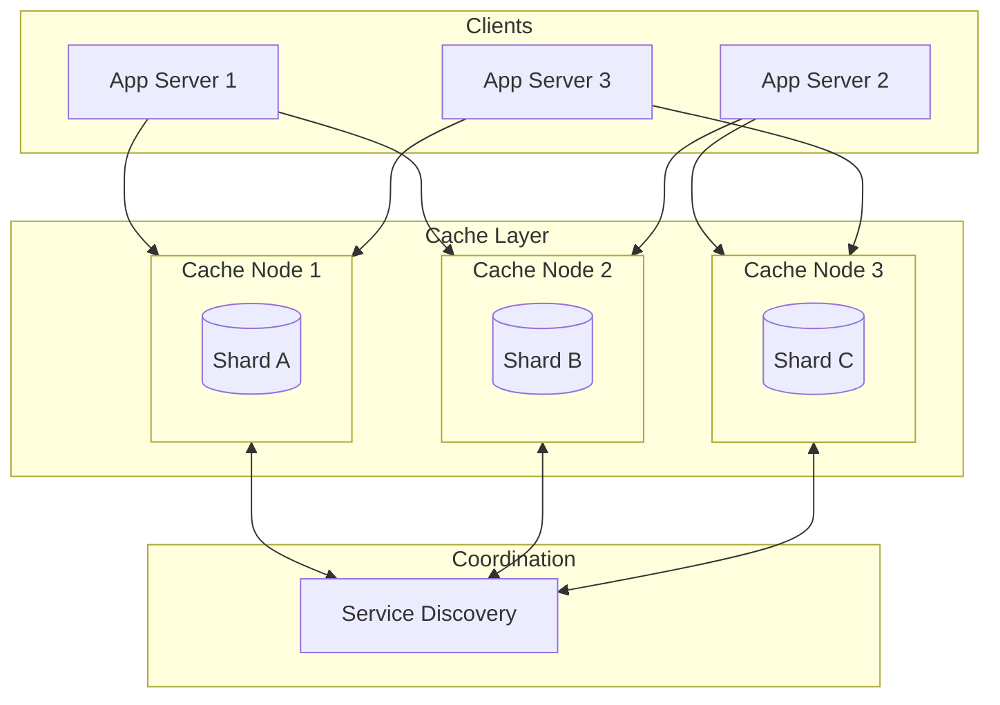
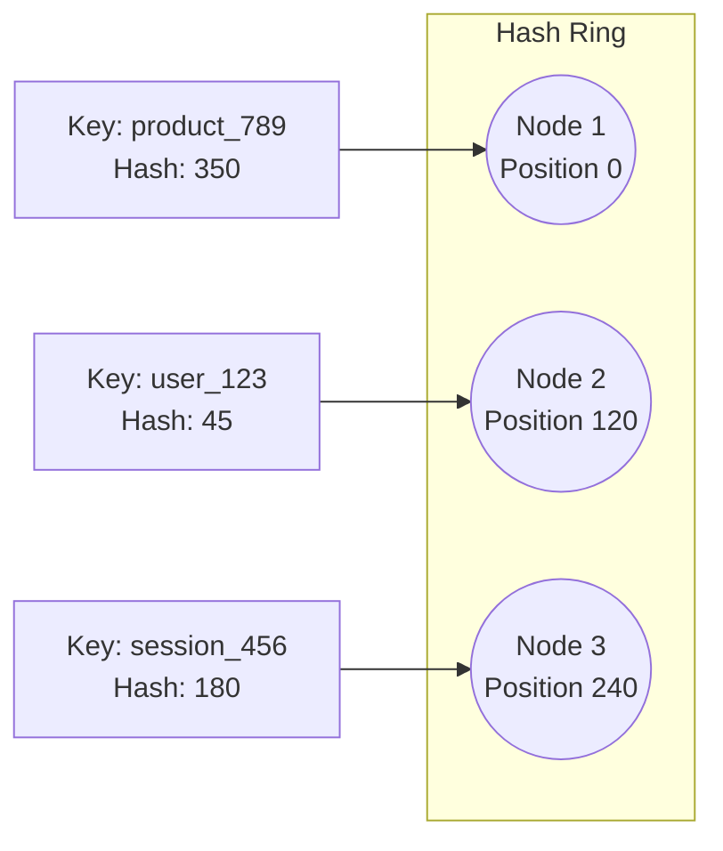
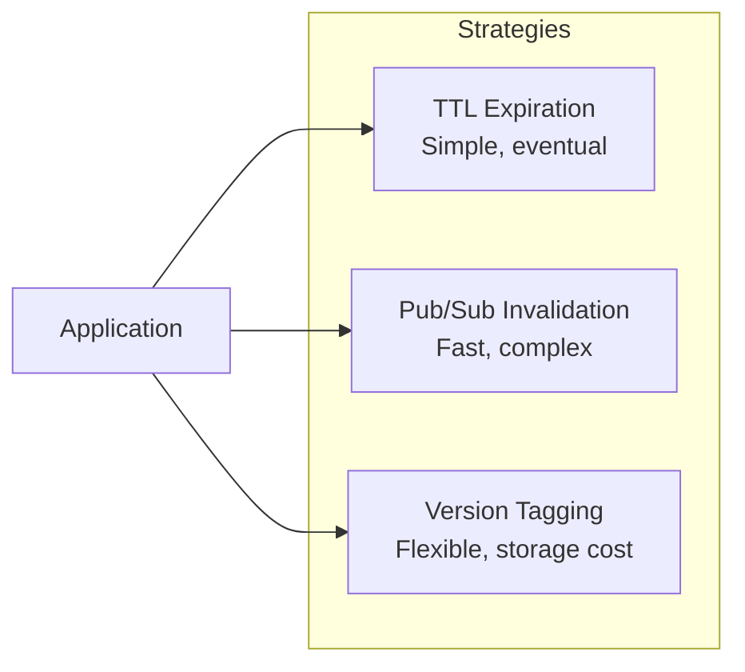

# How to Build Distributed Cache Design

Author: [nawazdhandala](https://github.com/nawazdhandala)

Tags: Caching, Distributed Systems, Redis, Architecture

Description: Learn to build distributed cache design for scalable caching across multiple nodes.

---

A distributed cache stores data across multiple nodes, allowing applications to scale horizontally while maintaining fast data access. Unlike single-node caches, distributed caches handle larger datasets, provide fault tolerance, and reduce latency for geographically distributed users.

This guide walks through the core concepts, architecture patterns, and implementation details for building a distributed cache system.

## Why Distributed Caching?

Single-node caches hit limits quickly. When your application grows, you need a cache that can:

- Scale beyond a single server's memory
- Survive node failures without data loss
- Serve requests from multiple regions with low latency
- Handle millions of concurrent connections

Here is a comparison between single-node and distributed caching approaches.

| Feature | Single-Node Cache | Distributed Cache |
|---------|-------------------|-------------------|
| Capacity | Limited to one server | Scales across nodes |
| Availability | Single point of failure | Fault tolerant |
| Latency | Local only | Can be geo-distributed |
| Complexity | Simple | Requires coordination |
| Cost | Lower initial cost | Higher but scales better |

## Architecture Overview

A distributed cache typically consists of three main components: clients, cache nodes, and a coordination layer.



## Consistent Hashing

The foundation of most distributed caches is consistent hashing. This algorithm distributes keys across nodes while minimizing redistribution when nodes join or leave the cluster.

Traditional modulo-based hashing causes massive key redistribution when node count changes. With consistent hashing, only a fraction of keys move.



Here is a Python implementation of consistent hashing with virtual nodes for better key distribution.

```python
import hashlib
from bisect import bisect_right
from typing import Dict, List, Optional

class ConsistentHash:
    def __init__(self, nodes: List[str], virtual_nodes: int = 150):
        # virtual_nodes improves key distribution across physical nodes
        self.virtual_nodes = virtual_nodes
        self.ring: Dict[int, str] = {}
        self.sorted_keys: List[int] = []

        for node in nodes:
            self.add_node(node)

    def _hash(self, key: str) -> int:
        # MD5 provides good distribution for cache keys
        return int(hashlib.md5(key.encode()).hexdigest(), 16)

    def add_node(self, node: str) -> None:
        # Create virtual nodes to spread load evenly
        for i in range(self.virtual_nodes):
            virtual_key = f"{node}:vn{i}"
            hash_value = self._hash(virtual_key)
            self.ring[hash_value] = node
            self.sorted_keys.append(hash_value)

        self.sorted_keys.sort()

    def remove_node(self, node: str) -> None:
        # Remove all virtual nodes for this physical node
        for i in range(self.virtual_nodes):
            virtual_key = f"{node}:vn{i}"
            hash_value = self._hash(virtual_key)
            del self.ring[hash_value]
            self.sorted_keys.remove(hash_value)

    def get_node(self, key: str) -> Optional[str]:
        if not self.ring:
            return None

        hash_value = self._hash(key)
        # Find first node clockwise from the key's position
        idx = bisect_right(self.sorted_keys, hash_value)

        # Wrap around to start of ring if needed
        if idx == len(self.sorted_keys):
            idx = 0

        return self.ring[self.sorted_keys[idx]]
```

## Replication Strategy

Distributed caches replicate data across multiple nodes for fault tolerance. The two common approaches are synchronous and asynchronous replication.

| Replication Type | Consistency | Latency | Use Case |
|------------------|-------------|---------|----------|
| Synchronous | Strong | Higher | Financial data, sessions |
| Asynchronous | Eventual | Lower | Product catalogs, content |

This cache client writes to a primary node and replicates asynchronously to backup nodes.

```python
import asyncio
from typing import Any, List
import aioredis

class ReplicatedCacheClient:
    def __init__(self, primary: str, replicas: List[str]):
        self.primary = primary
        self.replicas = replicas
        self.primary_conn = None
        self.replica_conns = []

    async def connect(self):
        # Primary handles all writes
        self.primary_conn = await aioredis.from_url(self.primary)
        # Replicas handle read scaling
        self.replica_conns = [
            await aioredis.from_url(r) for r in self.replicas
        ]

    async def set(self, key: str, value: Any, ttl: int = 3600) -> bool:
        # Write to primary first
        await self.primary_conn.set(key, value, ex=ttl)

        # Replicate asynchronously without blocking the caller
        asyncio.create_task(self._replicate(key, value, ttl))
        return True

    async def _replicate(self, key: str, value: Any, ttl: int):
        # Fire and forget replication to all replicas
        tasks = [
            conn.set(key, value, ex=ttl)
            for conn in self.replica_conns
        ]
        await asyncio.gather(*tasks, return_exceptions=True)

    async def get(self, key: str) -> Any:
        # Read from a random replica for load distribution
        import random
        if self.replica_conns:
            conn = random.choice(self.replica_conns)
            result = await conn.get(key)
            if result:
                return result

        # Fall back to primary if replicas miss
        return await self.primary_conn.get(key)
```

## Cache Invalidation

Cache invalidation is notoriously difficult in distributed systems. Three common strategies exist.



Here is a pub/sub based invalidation system using Redis.

```python
import json
import aioredis
from typing import Callable, Dict

class CacheInvalidator:
    def __init__(self, redis_url: str, channel: str = "cache:invalidate"):
        self.redis_url = redis_url
        self.channel = channel
        self.local_cache: Dict[str, any] = {}
        self.conn = None
        self.pubsub = None

    async def connect(self):
        self.conn = await aioredis.from_url(self.redis_url)
        self.pubsub = self.conn.pubsub()
        await self.pubsub.subscribe(self.channel)

    async def invalidate(self, key: str):
        # Remove from local cache
        self.local_cache.pop(key, None)

        # Broadcast to all nodes in the cluster
        message = json.dumps({"action": "invalidate", "key": key})
        await self.conn.publish(self.channel, message)

    async def listen_for_invalidations(self):
        # Run this in a background task
        async for message in self.pubsub.listen():
            if message["type"] == "message":
                data = json.loads(message["data"])
                if data["action"] == "invalidate":
                    # Remove key from local cache when notified
                    self.local_cache.pop(data["key"], None)
```

## Handling Node Failures

When a cache node fails, the system must detect the failure and redistribute traffic. Here is how to implement basic health checking and failover.

```python
import asyncio
from typing import Dict, Optional
import aioredis

class HealthyNodePool:
    def __init__(self, nodes: Dict[str, str], check_interval: int = 5):
        # nodes: {"node1": "redis://host1:6379", ...}
        self.nodes = nodes
        self.healthy_nodes: set = set()
        self.check_interval = check_interval
        self.connections: Dict[str, aioredis.Redis] = {}

    async def start_health_checks(self):
        while True:
            for name, url in self.nodes.items():
                try:
                    conn = await aioredis.from_url(url, socket_timeout=2)
                    await conn.ping()
                    self.healthy_nodes.add(name)
                    self.connections[name] = conn
                except Exception:
                    # Mark node as unhealthy on any failure
                    self.healthy_nodes.discard(name)
                    self.connections.pop(name, None)

            await asyncio.sleep(self.check_interval)

    def get_healthy_connection(self, preferred: str) -> Optional[aioredis.Redis]:
        # Return preferred node if healthy
        if preferred in self.healthy_nodes:
            return self.connections[preferred]

        # Otherwise return any healthy node
        if self.healthy_nodes:
            fallback = next(iter(self.healthy_nodes))
            return self.connections[fallback]

        return None
```

## Performance Considerations

When deploying a distributed cache, keep these factors in mind.

| Factor | Recommendation |
|--------|----------------|
| Network | Co-locate cache nodes with application servers |
| Serialization | Use binary formats like MessagePack or Protocol Buffers |
| Connection pooling | Reuse connections to reduce overhead |
| Key design | Keep keys short and use prefixes for namespacing |
| Value size | Compress large values, split if over 1MB |

## Conclusion

Building a distributed cache requires careful attention to consistent hashing, replication, invalidation, and failure handling. Start with a simple setup using consistent hashing and async replication. Add complexity like pub/sub invalidation and sophisticated health checks as your system grows.

The code examples in this guide provide a foundation you can extend for production use. Consider using battle-tested solutions like Redis Cluster or Memcached for the underlying cache nodes while implementing custom distribution and failover logic at the client level.
