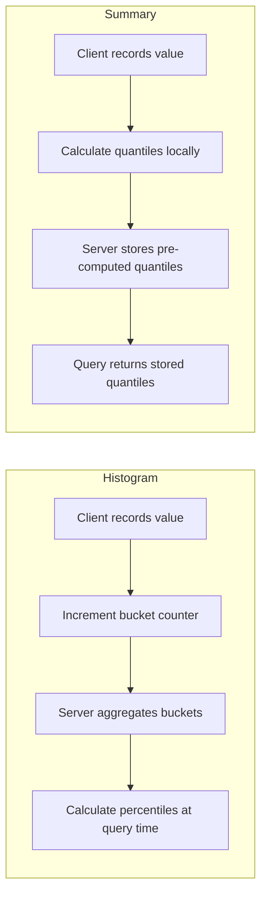
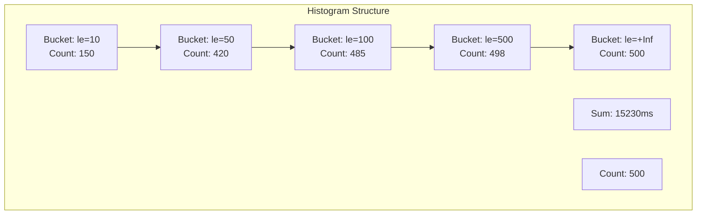
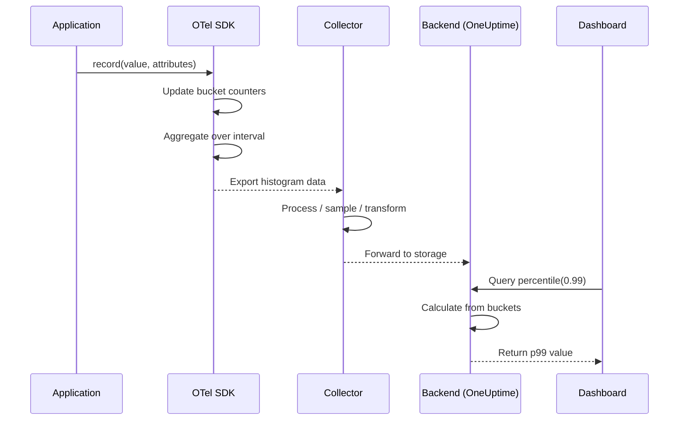

# How to Implement Distribution Metrics

Author: [nawazdhandala](https://github.com/nawazdhandala)

Tags: Metrics, Distribution, OpenTelemetry, Statistics

Description: Learn to implement distribution metrics for statistical analysis of values.

---

## Why Distribution Metrics Matter

When you measure latency, request sizes, or queue depths, a single number rarely tells the whole story. Averages hide outliers. Totals obscure patterns. Distribution metrics solve this by capturing the full spread of values, letting you answer questions like: "What latency do 99% of users experience?" or "How often do requests exceed 1MB?"

Distribution metrics come in two primary forms: **histograms** and **summaries**. Both track how values are distributed across buckets or quantiles, but they differ in where computation happens and how flexible they are at query time.

This guide walks through the concepts, implementation patterns, and practical code examples for building distribution metrics into your observability stack using OpenTelemetry.

---

## Histograms vs Summaries

Before writing code, understand the tradeoffs between these two approaches.



| Aspect | Histogram | Summary |
|--------|-----------|---------|
| **Computation** | Server-side at query time | Client-side at record time |
| **Aggregation** | Can combine across instances | Cannot aggregate quantiles |
| **Flexibility** | Query any percentile | Fixed quantiles at instrumentation |
| **Accuracy** | Bounded by bucket boundaries | Configurable error margin |
| **Memory** | Fixed (number of buckets) | Grows with data volume |

**Recommendation**: Use histograms for most cases. They aggregate cleanly across service instances and let you query any percentile without re-instrumenting. Use summaries only when you need precise quantiles from a single instance and cannot afford query-time computation.

---

## Anatomy of a Histogram

A histogram tracks three pieces of data:

1. **Buckets**: Counters for values falling at or below each boundary
2. **Sum**: Total of all recorded values
3. **Count**: Number of recorded values



When you record a value of 75ms, the histogram increments all buckets where the boundary is greater than or equal to 75 (le=100, le=500, le=+Inf), plus the sum and count.

### Choosing Bucket Boundaries

Bucket boundaries determine the resolution of your percentile calculations. Too few buckets means coarse estimates. Too many means wasted memory and cardinality.

```javascript
// Good: Boundaries aligned with meaningful thresholds
const latencyBuckets = [5, 10, 25, 50, 100, 250, 500, 1000, 2500, 5000, 10000];

// Bad: Linear buckets that waste resolution in common ranges
const linearBuckets = [100, 200, 300, 400, 500, 600, 700, 800, 900, 1000];
```

**Guidelines for bucket selection:**

- Place more buckets where most values fall
- Align boundaries with SLO thresholds (if your SLO is 500ms, include a 500 bucket)
- Use exponential growth for wide-ranging values
- Keep total bucket count under 20 for most use cases

---

## Implementing Histograms in OpenTelemetry

### Node.js / TypeScript Example

```javascript
const { MeterProvider } = require('@opentelemetry/sdk-metrics');
const { OTLPMetricExporter } = require('@opentelemetry/exporter-metrics-otlp-http');
const { Resource } = require('@opentelemetry/resources');

// Configure the meter provider with OTLP export
const meterProvider = new MeterProvider({
  resource: new Resource({
    'service.name': 'order-service',
    'deployment.environment': process.env.NODE_ENV || 'development',
  }),
  readers: [
    {
      exporter: new OTLPMetricExporter({
        url: process.env.OTEL_EXPORTER_OTLP_ENDPOINT || 'https://otel.oneuptime.com/v1/metrics',
        headers: {
          'x-oneuptime-token': process.env.ONEUPTIME_TOKEN,
        },
      }),
      exportIntervalMillis: 60000, // Export every 60 seconds
    },
  ],
});

const meter = meterProvider.getMeter('order-service', '1.0.0');

// Create a histogram for request latency with explicit bucket boundaries
const requestLatency = meter.createHistogram('http_request_duration_ms', {
  description: 'HTTP request latency distribution in milliseconds',
  unit: 'ms',
  advice: {
    // Bucket boundaries optimized for typical web request latencies
    explicitBucketBoundaries: [5, 10, 25, 50, 100, 250, 500, 1000, 2500, 5000],
  },
});

// Create a histogram for request payload sizes
const requestSize = meter.createHistogram('http_request_size_bytes', {
  description: 'HTTP request body size distribution in bytes',
  unit: 'bytes',
  advice: {
    // Exponential boundaries for file uploads and API payloads
    explicitBucketBoundaries: [100, 1000, 10000, 100000, 1000000, 10000000],
  },
});

// Middleware to record both metrics
function metricsMiddleware(req, res, next) {
  const startTime = process.hrtime.bigint();

  // Record request size immediately
  const contentLength = parseInt(req.headers['content-length'] || '0', 10);
  requestSize.record(contentLength, {
    'http.method': req.method,
    'http.route': req.route?.path || 'unknown',
  });

  // Record latency when response completes
  res.on('finish', () => {
    const endTime = process.hrtime.bigint();
    const durationMs = Number(endTime - startTime) / 1_000_000;

    requestLatency.record(durationMs, {
      'http.method': req.method,
      'http.route': req.route?.path || 'unknown',
      'http.status_code': res.statusCode.toString(),
    });
  });

  next();
}

module.exports = { metricsMiddleware, requestLatency, requestSize };
```

### Python Example

```python
from opentelemetry import metrics
from opentelemetry.sdk.metrics import MeterProvider
from opentelemetry.sdk.metrics.export import PeriodicExportingMetricReader
from opentelemetry.sdk.metrics.view import View, ExplicitBucketHistogramAggregation
from opentelemetry.exporter.otlp.proto.http.metric_exporter import OTLPMetricExporter
from opentelemetry.sdk.resources import Resource
import time
from functools import wraps

# Define custom bucket boundaries through views
latency_view = View(
    instrument_name="http_request_duration_ms",
    aggregation=ExplicitBucketHistogramAggregation(
        boundaries=[5, 10, 25, 50, 100, 250, 500, 1000, 2500, 5000]
    ),
)

size_view = View(
    instrument_name="http_request_size_bytes",
    aggregation=ExplicitBucketHistogramAggregation(
        boundaries=[100, 1000, 10000, 100000, 1000000, 10000000]
    ),
)

# Configure meter provider with views
exporter = OTLPMetricExporter(endpoint="https://otel.oneuptime.com/v1/metrics")
reader = PeriodicExportingMetricReader(exporter, export_interval_millis=60000)
provider = MeterProvider(
    resource=Resource.create({"service.name": "order-service"}),
    metric_readers=[reader],
    views=[latency_view, size_view],
)
metrics.set_meter_provider(provider)

meter = metrics.get_meter("order-service", "1.0.0")

# Create histogram instruments
request_latency = meter.create_histogram(
    name="http_request_duration_ms",
    description="HTTP request latency distribution in milliseconds",
    unit="ms",
)

request_size = meter.create_histogram(
    name="http_request_size_bytes",
    description="HTTP request body size distribution in bytes",
    unit="bytes",
)


def track_distribution(endpoint_name):
    """Decorator to track latency distribution for an endpoint."""
    def decorator(func):
        @wraps(func)
        def wrapper(*args, **kwargs):
            start_time = time.perf_counter()
            status = "success"
            try:
                result = func(*args, **kwargs)
                return result
            except Exception:
                status = "error"
                raise
            finally:
                duration_ms = (time.perf_counter() - start_time) * 1000
                request_latency.record(
                    duration_ms,
                    attributes={
                        "endpoint": endpoint_name,
                        "status": status,
                    },
                )
        return wrapper
    return decorator


# Usage example
@track_distribution("checkout")
def process_checkout(order_data):
    # Record payload size
    request_size.record(
        len(str(order_data)),
        attributes={"endpoint": "checkout", "content_type": "json"},
    )
    # Process the order
    pass
```

---

## Recording Distribution Data

The data flow for distribution metrics follows a clear path from instrumentation to analysis.



### Recording Patterns

**Pattern 1: Direct recording**

```javascript
// Record a single observation
requestLatency.record(127.5, {
  'http.method': 'POST',
  'http.route': '/api/orders',
});
```

**Pattern 2: Timed operation**

```javascript
// Helper function for timing async operations
async function withTiming(histogram, attributes, operation) {
  const start = process.hrtime.bigint();
  try {
    return await operation();
  } finally {
    const durationMs = Number(process.hrtime.bigint() - start) / 1_000_000;
    histogram.record(durationMs, attributes);
  }
}

// Usage
const result = await withTiming(
  requestLatency,
  { 'db.operation': 'select', 'db.table': 'orders' },
  () => database.query('SELECT * FROM orders WHERE id = ?', [orderId])
);
```

**Pattern 3: Batch recording**

```javascript
// Record multiple values from a batch operation
function recordBatchMetrics(histogram, values, baseAttributes) {
  for (const value of values) {
    histogram.record(value, baseAttributes);
  }
}

// Example: record processing times for items in a batch job
const processingTimes = items.map(item => processItem(item));
recordBatchMetrics(processingTimeHistogram, processingTimes, {
  'job.name': 'nightly-sync',
  'job.batch_id': batchId,
});
```

---

## Querying Distribution Metrics

Once your histograms are stored, you can compute percentiles and analyze distributions.

### Prometheus / PromQL

```promql
# Calculate p99 latency across all instances
histogram_quantile(0.99,
  sum(rate(http_request_duration_ms_bucket[5m])) by (le)
)

# Calculate p99 latency per endpoint
histogram_quantile(0.99,
  sum(rate(http_request_duration_ms_bucket[5m])) by (le, http_route)
)

# Calculate median (p50) for comparison
histogram_quantile(0.50,
  sum(rate(http_request_duration_ms_bucket[5m])) by (le)
)

# Calculate average from histogram
sum(rate(http_request_duration_ms_sum[5m]))
/
sum(rate(http_request_duration_ms_count[5m]))
```

### SQL (ClickHouse example)

```sql
-- Calculate percentiles from histogram data
SELECT
    quantile(0.50)(duration_ms) AS p50,
    quantile(0.90)(duration_ms) AS p90,
    quantile(0.95)(duration_ms) AS p95,
    quantile(0.99)(duration_ms) AS p99,
    avg(duration_ms) AS mean,
    max(duration_ms) AS max
FROM http_requests
WHERE
    timestamp > now() - INTERVAL 1 HOUR
    AND service_name = 'order-service'
GROUP BY http_route
ORDER BY p99 DESC;
```

---

## Common Pitfalls and Fixes

| Problem | Symptom | Solution |
|---------|---------|----------|
| **Bucket boundaries too coarse** | p99 jumps between values | Add boundaries near your SLO thresholds |
| **High cardinality attributes** | Memory explosion, slow queries | Limit to 5-7 attribute keys; avoid IDs |
| **Missing +Inf bucket** | Percentile calculation fails | Always include an upper bound bucket |
| **Aggregating summaries** | Incorrect percentiles | Switch to histograms for multi-instance services |
| **Wrong time windows** | Noisy percentiles | Use 5m+ windows for rate calculations |

### Cardinality Management

```javascript
// Bad: High cardinality will explode your metrics
requestLatency.record(duration, {
  'user.id': userId,           // Unbounded cardinality
  'request.id': requestId,     // Unique per request
  'timestamp': Date.now(),     // Always unique
});

// Good: Bounded, meaningful dimensions
requestLatency.record(duration, {
  'http.method': method,       // ~5 values
  'http.route': route,         // Bounded by your API
  'http.status_code': status,  // ~50 values
  'region': region,            // Small set
});
```

---

## Practical Checklist

Before shipping distribution metrics to production:

1. **Define bucket boundaries** based on expected value ranges and SLO thresholds
2. **Limit attribute cardinality** to prevent metric explosion
3. **Set appropriate export intervals** (30-60 seconds for most cases)
4. **Include a +Inf bucket** for values exceeding your highest boundary
5. **Test percentile accuracy** by comparing query results against known distributions
6. **Document metric semantics** so consumers understand what they are querying
7. **Set up alerts on percentile thresholds** not just averages

---

## Conclusion

Distribution metrics give you the statistical visibility that counters and gauges cannot provide. By implementing histograms with well-chosen bucket boundaries and keeping attribute cardinality in check, you can answer questions about user experience that would otherwise require guesswork.

Start with latency histograms for your most critical endpoints. Add payload size distributions for APIs handling variable data. Then expand to queue depths, batch sizes, and any other metric where the shape of the distribution matters as much as its center.

The goal is not to measure everything. It is to measure the right things in a way that surfaces anomalies before your users notice them.

---

**Related Reading:**

- [How to Build Latency Percentile SLOs](https://oneuptime.com/blog/post/2026-01-30-latency-percentile-slos/view)
- [What are Metrics in OpenTelemetry](https://oneuptime.com/blog/post/2025-08-26-what-are-metrics-in-opentelemetry/view)
- [18 SRE Metrics Worth Tracking](https://oneuptime.com/blog/post/2025-11-28-sre-metrics-to-track/view)
