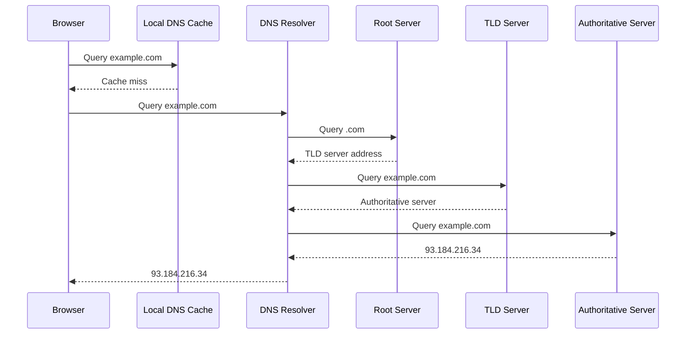
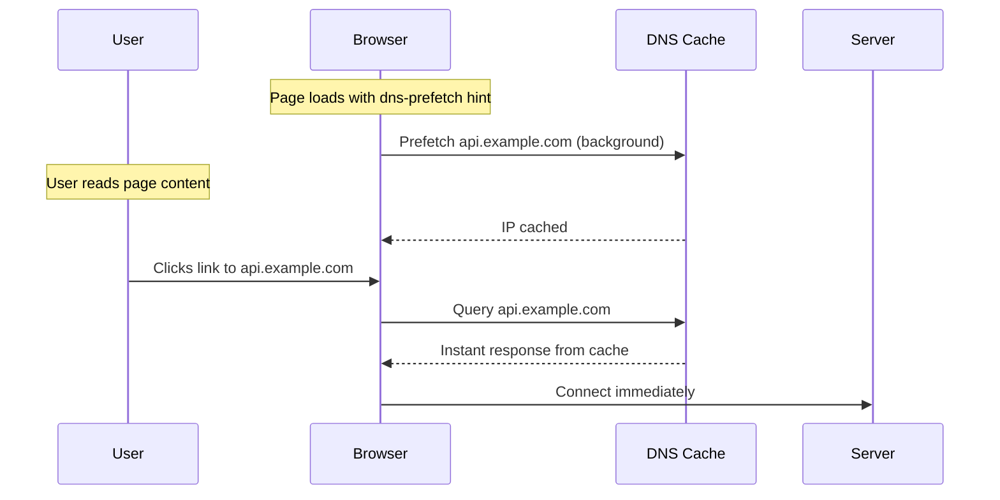
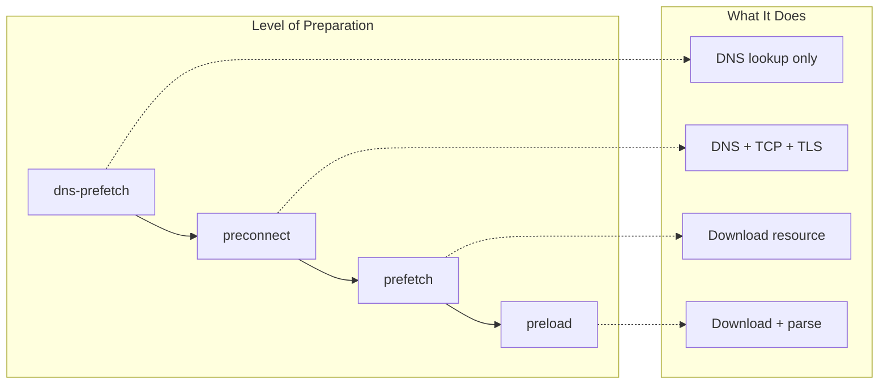

# How to Create DNS Prefetching

Author: [nawazdhandala](https://github.com/nawazdhandala)

Tags: DNS, Performance, WebOptimization, Latency

Description: Learn how DNS prefetching reduces page load latency by resolving domain names before users click links.

---

Every millisecond counts in web performance. When a user clicks a link, their browser must first resolve the domain name to an IP address before it can establish a connection. This DNS lookup typically takes 20 to 120 milliseconds, but can exceed 200ms on slower networks or for domains with poor DNS infrastructure.

DNS prefetching eliminates this latency by resolving domain names in advance, before the user actually needs them.

---

## How DNS Resolution Works

Before understanding prefetching, let's review what happens during a normal DNS lookup:



This entire chain happens before your browser can even begin establishing a TCP connection. On mobile networks with high latency, this adds significant delay to every new domain your page needs to contact.

---

## The DNS Prefetch Mechanism

DNS prefetching tells the browser to resolve a domain name proactively. The browser performs the lookup in the background while the user is still reading the current page. When they finally click a link or when a resource from that domain is needed, the IP address is already cached locally.



The key insight is that DNS resolution happens during idle time, not when the user is waiting.

---

## Implementing DNS Prefetch

### Basic Implementation

Add the `dns-prefetch` link hint to your HTML `<head>` section:

```html
<!DOCTYPE html>
<html>
<head>
    <meta charset="UTF-8">
    <title>My Application</title>

    <!-- DNS prefetch for external domains your page will contact -->
    <link rel="dns-prefetch" href="//api.example.com">
    <link rel="dns-prefetch" href="//cdn.example.com">
    <link rel="dns-prefetch" href="//analytics.example.com">

    <!-- Note: Use protocol-relative URLs (starting with //) -->
    <!-- This allows the browser to use HTTPS or HTTP as appropriate -->
</head>
<body>
    <!-- Page content -->
</body>
</html>
```

### Common Use Cases

Prefetch domains for resources your page will definitely need:

```html
<!-- Third-party services commonly used -->
<link rel="dns-prefetch" href="//fonts.googleapis.com">
<link rel="dns-prefetch" href="//fonts.gstatic.com">
<link rel="dns-prefetch" href="//www.google-analytics.com">
<link rel="dns-prefetch" href="//connect.facebook.net">

<!-- Your own infrastructure -->
<link rel="dns-prefetch" href="//api.yoursite.com">
<link rel="dns-prefetch" href="//static.yoursite.com">
<link rel="dns-prefetch" href="//images.yoursite.com">
```

### Dynamic DNS Prefetching with JavaScript

For single-page applications or dynamic content, you can add prefetch hints programmatically:

```javascript
// Function to add DNS prefetch for a domain
function addDnsPrefetch(domain) {
    // Check if prefetch hint already exists
    const existing = document.querySelector(
        `link[rel="dns-prefetch"][href="//${domain}"]`
    );
    if (existing) return;

    // Create and append the link element
    const link = document.createElement('link');
    link.rel = 'dns-prefetch';
    link.href = `//${domain}`;
    document.head.appendChild(link);
}

// Prefetch domains when user hovers over links
document.addEventListener('mouseover', (event) => {
    const link = event.target.closest('a');
    if (!link) return;

    try {
        const url = new URL(link.href);
        // Only prefetch external domains
        if (url.hostname !== window.location.hostname) {
            addDnsPrefetch(url.hostname);
        }
    } catch (e) {
        // Invalid URL, ignore
    }
});
```

---

## Resource Hints: Beyond DNS Prefetch

DNS prefetch is just one of several resource hints available. Each provides a different level of preparation:



### Preconnect: The Next Level

If you know you will definitely need a resource from a domain, `preconnect` goes further than `dns-prefetch`. It performs DNS resolution, TCP handshake, and TLS negotiation all in advance:

```html
<!-- DNS prefetch only resolves the domain name -->
<link rel="dns-prefetch" href="//api.example.com">

<!-- Preconnect establishes a full connection -->
<link rel="preconnect" href="https://api.example.com">

<!-- Use crossorigin attribute for fonts and CORS requests -->
<link rel="preconnect" href="https://fonts.gstatic.com" crossorigin>
```

### When to Use Each Hint

```html
<head>
    <!--
        dns-prefetch: Low cost, use liberally
        - Domains you might need
        - Links user might click
        - Third-party services
    -->
    <link rel="dns-prefetch" href="//possible-click.example.com">

    <!--
        preconnect: Higher cost, use selectively
        - Domains you will definitely need soon
        - Critical third-party resources
        - Limit to 2-4 domains to avoid wasting connections
    -->
    <link rel="preconnect" href="https://critical-api.example.com">
    <link rel="preconnect" href="https://fonts.googleapis.com">

    <!--
        prefetch: Downloads the resource
        - Resources needed for next page navigation
        - Low priority background download
    -->
    <link rel="prefetch" href="/next-page-bundle.js">

    <!--
        preload: High priority download
        - Critical resources for current page
        - Fonts, hero images, key scripts
    -->
    <link rel="preload" href="/critical-font.woff2" as="font" type="font/woff2" crossorigin>
</head>
```

---

## Timing Comparison

The following diagram shows the difference in timing between a request with and without DNS prefetching:

```mermaid
gantt
    title Request Timeline Comparison
    dateFormat X
    axisFormat %L ms

    section Without Prefetch
    DNS Lookup        :a1, 0, 80
    TCP Handshake     :a2, after a1, 40
    TLS Handshake     :a3, after a2, 60
    Request/Response  :a4, after a3, 100

    section With dns-prefetch
    DNS (prefetched)  :done, b1, 0, 0
    TCP Handshake     :b2, 0, 40
    TLS Handshake     :b3, after b2, 60
    Request/Response  :b4, after b3, 100

    section With preconnect
    All prep (done)   :done, c1, 0, 0
    Request/Response  :c4, 0, 100
```



On a typical connection:
- **Without hints**: 280ms total (80ms DNS + 40ms TCP + 60ms TLS + 100ms request)
- **With dns-prefetch**: 200ms total (DNS already resolved)
- **With preconnect**: 100ms total (connection already established)

---

## Mobile Considerations

DNS prefetching is especially valuable on mobile networks where latency is higher. However, there are tradeoffs to consider:

### Battery and Data Usage

Each DNS lookup consumes a small amount of battery and data. Browsers implement safeguards:

```html
<!-- Browsers may ignore prefetch hints when: -->
<!-- - User has enabled data saver mode -->
<!-- - Device is on a metered connection -->
<!-- - Battery is critically low -->

<!-- You can help by being selective about what you prefetch -->
<head>
    <!-- Only prefetch domains you are confident will be needed -->
    <link rel="dns-prefetch" href="//definitely-needed-api.com">

    <!-- Avoid prefetching domains that might not be used -->
    <!-- Bad: <link rel="dns-prefetch" href="//rarely-used-service.com"> -->
</head>
```

### Respecting User Preferences

Some users disable prefetching for privacy or performance reasons. Check for data saver mode:

```javascript
// Check if user has requested reduced data usage
if (navigator.connection && navigator.connection.saveData) {
    console.log('Data saver enabled, skipping prefetch');
} else {
    // Safe to add prefetch hints
    addDnsPrefetch('api.example.com');
}

// Also respect the Reduce Data Usage header
// Your server can check: Save-Data: on
```

---

## Security and Privacy Considerations

DNS prefetching has privacy implications that you should understand:

### Information Leakage

When a browser prefetches DNS, it reveals to the DNS server which domains are being considered. This can expose user intent:

```html
<!--
    If your page includes:
    <link rel="dns-prefetch" href="//cancer-treatment-center.com">

    The user's DNS queries reveal their interest in this topic,
    even if they never click the link.
-->
```

### Controlling Prefetch Behavior

You can disable automatic DNS prefetching if needed:

```html
<!-- Disable all automatic DNS prefetching -->
<meta http-equiv="x-dns-prefetch-control" content="off">

<!-- Or re-enable it explicitly -->
<meta http-equiv="x-dns-prefetch-control" content="on">
```

### HTTPS Considerations

When using preconnect (which establishes full connections), always specify HTTPS:

```html
<!-- Always use https:// with preconnect for security -->
<link rel="preconnect" href="https://api.example.com">

<!-- Protocol-relative URLs are fine for dns-prefetch -->
<link rel="dns-prefetch" href="//api.example.com">
```

---

## Practical Implementation Example

Here is a complete example showing best practices for a typical web application:

```html
<!DOCTYPE html>
<html lang="en">
<head>
    <meta charset="UTF-8">
    <meta name="viewport" content="width=device-width, initial-scale=1.0">
    <title>My Web Application</title>

    <!--
        Resource hints should be placed early in <head>
        Order them by priority: preconnect first, then dns-prefetch
    -->

    <!-- Preconnect to critical third-party origins -->
    <!-- Limit to 2-4 most important connections -->
    <link rel="preconnect" href="https://fonts.googleapis.com">
    <link rel="preconnect" href="https://fonts.gstatic.com" crossorigin>
    <link rel="preconnect" href="https://api.myapp.com">

    <!-- DNS prefetch for less critical but likely domains -->
    <link rel="dns-prefetch" href="//cdn.myapp.com">
    <link rel="dns-prefetch" href="//analytics.myapp.com">
    <link rel="dns-prefetch" href="//www.google-analytics.com">
    <link rel="dns-prefetch" href="//www.googletagmanager.com">

    <!-- Preload critical resources -->
    <link rel="preload" href="/fonts/main.woff2" as="font" type="font/woff2" crossorigin>
    <link rel="preload" href="/css/critical.css" as="style">

    <!-- Regular stylesheets -->
    <link rel="stylesheet" href="/css/main.css">

    <script>
        // Dynamic prefetching for navigation links
        document.addEventListener('DOMContentLoaded', () => {
            // Prefetch DNS for links in navigation
            const navLinks = document.querySelectorAll('nav a[href^="http"]');
            navLinks.forEach(link => {
                try {
                    const url = new URL(link.href);
                    if (url.hostname !== location.hostname) {
                        const hint = document.createElement('link');
                        hint.rel = 'dns-prefetch';
                        hint.href = `//${url.hostname}`;
                        document.head.appendChild(hint);
                    }
                } catch (e) {
                    // Invalid URL
                }
            });
        });
    </script>
</head>
<body>
    <nav>
        <a href="https://docs.myapp.com">Documentation</a>
        <a href="https://status.myapp.com">Status</a>
        <a href="https://blog.myapp.com">Blog</a>
    </nav>

    <main>
        <!-- Page content -->
    </main>
</body>
</html>
```

---

## Measuring the Impact

Use browser developer tools to verify your prefetch hints are working:

```javascript
// Monitor DNS timing using the Performance API
const observer = new PerformanceObserver((list) => {
    list.getEntries().forEach((entry) => {
        if (entry.entryType === 'resource') {
            console.log(`${entry.name}:`);
            console.log(`  DNS: ${entry.domainLookupEnd - entry.domainLookupStart}ms`);
            console.log(`  TCP: ${entry.connectEnd - entry.connectStart}ms`);
            console.log(`  Total: ${entry.responseEnd - entry.startTime}ms`);
        }
    });
});

observer.observe({ entryTypes: ['resource'] });

// A DNS time of 0ms indicates the lookup was prefetched or cached
```

In Chrome DevTools:
1. Open Network tab
2. Right-click column headers and enable "DNS Lookup"
3. Compare DNS times for prefetched vs non-prefetched domains

---

## Summary

DNS prefetching is a low-cost optimization that can meaningfully reduce perceived latency:

- Use `dns-prefetch` liberally for domains you might need
- Use `preconnect` selectively for domains you will definitely need
- Place resource hints early in `<head>` for maximum benefit
- Consider mobile users and respect data saver preferences
- Measure impact with Performance API and browser dev tools

The best part about DNS prefetching is its simplicity. A few lines of HTML can save your users hundreds of milliseconds on every page load. In the world of web performance, that is a significant win for minimal effort.
