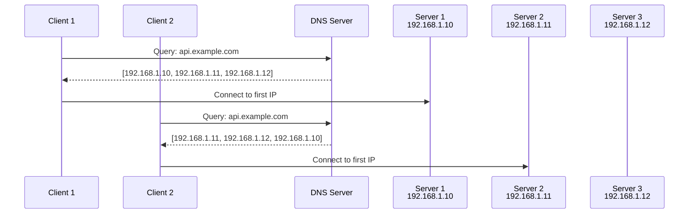
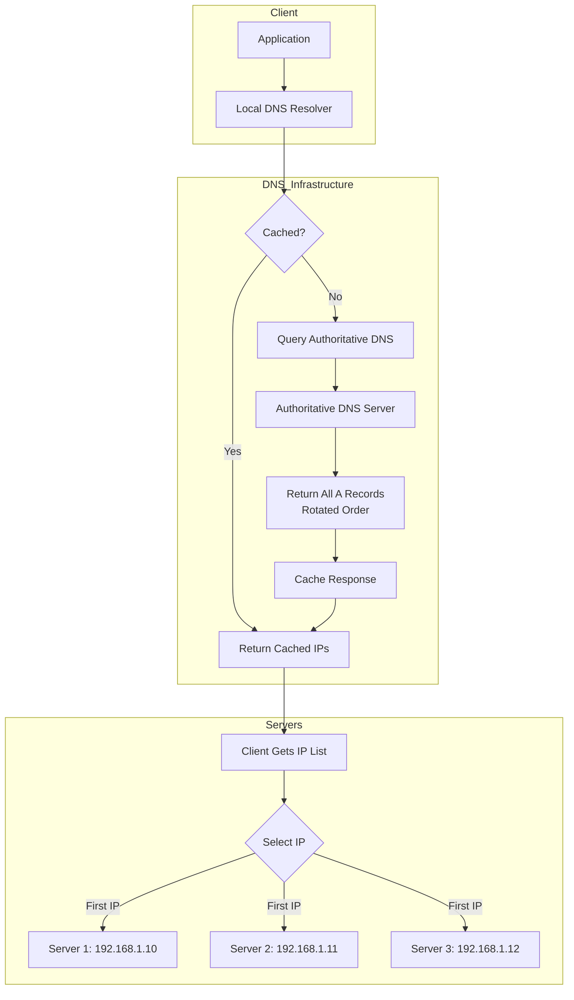
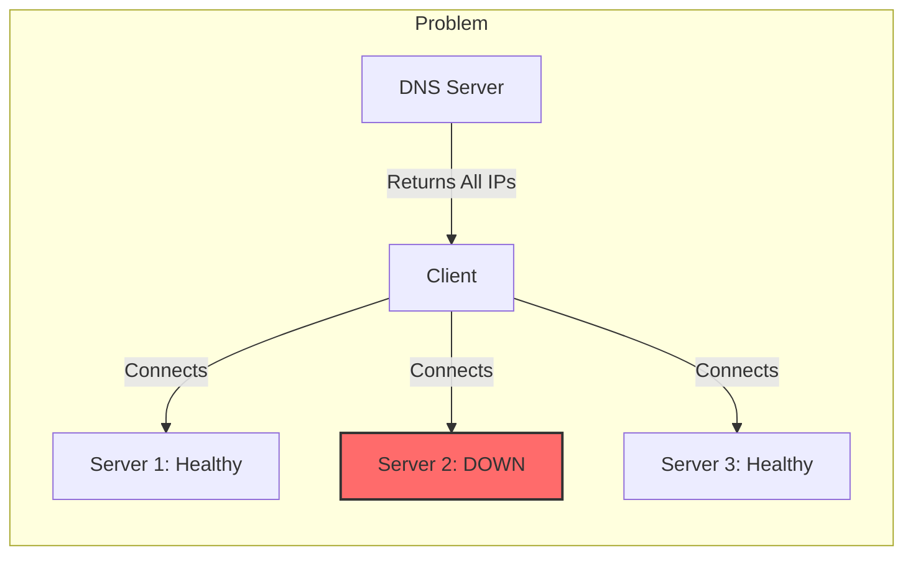
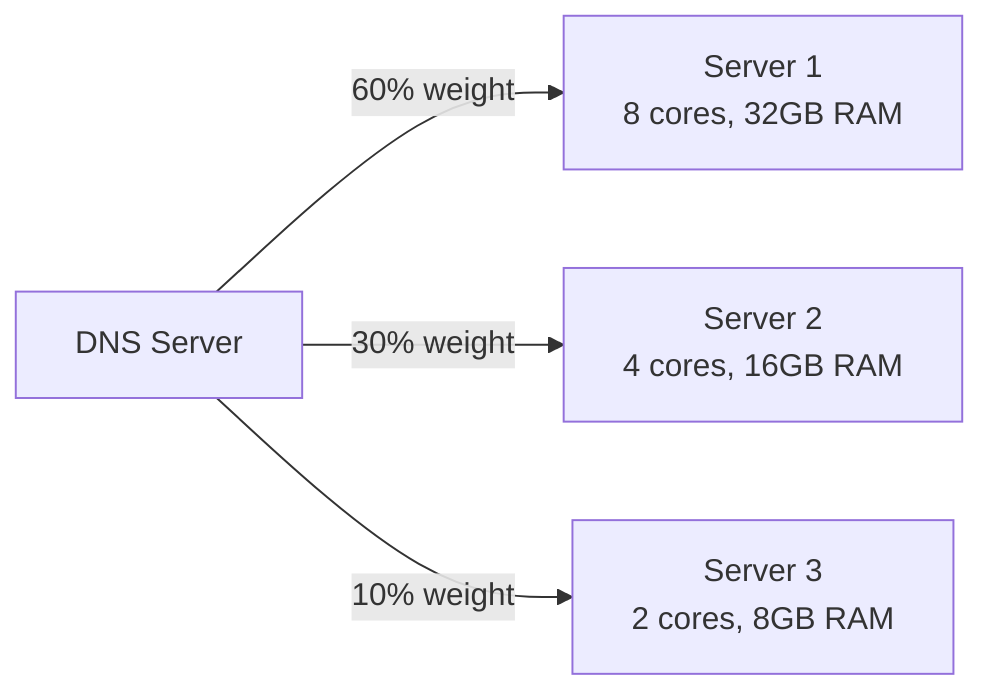
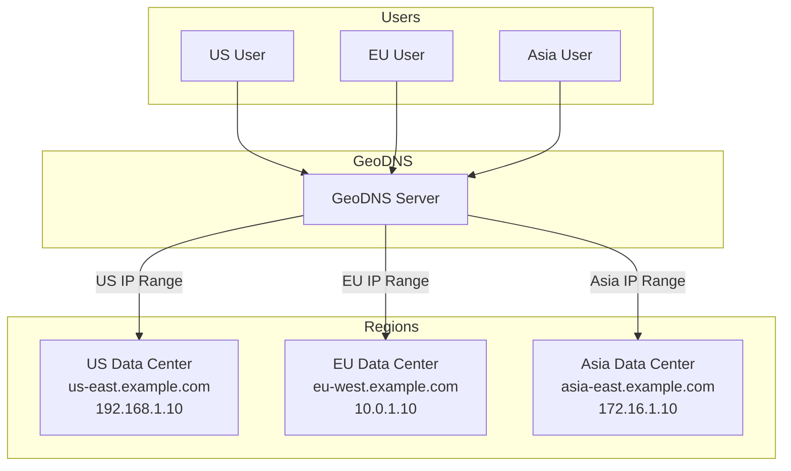

# How to Build DNS Round Robin Load Balancing

Author: [nawazdhandala](https://github.com/nawazdhandala)

Tags: DNS, LoadBalancing, Networking, HighAvailability

Description: Learn how DNS round robin distributes traffic across multiple servers using simple A record configuration for basic load balancing.

---

DNS round robin is one of the oldest and simplest load balancing techniques. It requires no special hardware, no dedicated load balancer, and works with any DNS provider. While it has limitations, understanding it is essential for anyone building distributed systems.

## How DNS Round Robin Works

The concept is straightforward: configure multiple A records for the same domain, each pointing to a different IP address. When a client queries the DNS server, it receives all IP addresses in a rotating order.



Each DNS response rotates the order of IP addresses. Most clients connect to the first IP in the list, naturally distributing traffic across servers.

## Configuring A Records for Round Robin

### BIND Zone File Configuration

```bash
; Zone file for example.com
; Multiple A records for round robin load balancing

$TTL 60  ; Short TTL for faster failover (60 seconds)

@       IN      SOA     ns1.example.com. admin.example.com. (
                        2026013001      ; Serial number (YYYYMMDDNN)
                        3600            ; Refresh (1 hour)
                        600             ; Retry (10 minutes)
                        604800          ; Expire (1 week)
                        60              ; Minimum TTL (60 seconds)
                        )

; Name servers
@       IN      NS      ns1.example.com.
@       IN      NS      ns2.example.com.

; Round robin A records for api.example.com
; DNS server will rotate these in responses
api     IN      A       192.168.1.10    ; Server 1 - US East
api     IN      A       192.168.1.11    ; Server 2 - US East
api     IN      A       192.168.1.12    ; Server 3 - US East

; Round robin for web servers
www     IN      A       10.0.1.100      ; Web Server 1
www     IN      A       10.0.1.101      ; Web Server 2
www     IN      A       10.0.1.102      ; Web Server 3
www     IN      A       10.0.1.103      ; Web Server 4
```

### Cloud DNS Configuration (AWS Route 53)

```bash
#!/bin/bash
# Create round robin A records using AWS CLI

HOSTED_ZONE_ID="Z1234567890ABC"
DOMAIN="api.example.com"

# Create a JSON file with multiple A records
cat > dns-records.json << 'EOF'
{
  "Changes": [
    {
      "Action": "UPSERT",
      "ResourceRecordSet": {
        "Name": "api.example.com",
        "Type": "A",
        "TTL": 60,
        "ResourceRecords": [
          { "Value": "192.168.1.10" },
          { "Value": "192.168.1.11" },
          { "Value": "192.168.1.12" }
        ]
      }
    }
  ]
}
EOF

# Apply the DNS changes
aws route53 change-resource-record-sets \
  --hosted-zone-id "$HOSTED_ZONE_ID" \
  --change-batch file://dns-records.json

echo "Round robin DNS records created for $DOMAIN"
```

### Terraform Configuration

```hcl
# Terraform configuration for DNS round robin with AWS Route 53

variable "server_ips" {
  description = "List of server IP addresses for round robin"
  type        = list(string)
  default     = ["192.168.1.10", "192.168.1.11", "192.168.1.12"]
}

resource "aws_route53_zone" "main" {
  name = "example.com"
}

# Single record set with multiple IPs enables round robin
resource "aws_route53_record" "api_round_robin" {
  zone_id = aws_route53_zone.main.zone_id
  name    = "api.example.com"
  type    = "A"
  ttl     = 60  # Short TTL for faster updates

  # All IPs in a single record set - DNS rotates them automatically
  records = var.server_ips
}

output "dns_name" {
  value = aws_route53_record.api_round_robin.fqdn
}
```

## DNS Resolution Flow



## Verifying Round Robin with dig

```bash
#!/bin/bash
# Script to verify DNS round robin is working

DOMAIN="api.example.com"
DNS_SERVER="8.8.8.8"  # Use a public DNS for testing

echo "Testing DNS round robin for $DOMAIN"
echo "====================================="

# Query multiple times to see rotation
for i in {1..5}; do
  echo ""
  echo "Query $i:"
  dig +short @"$DNS_SERVER" "$DOMAIN" A
  sleep 1
done

# Full DNS response with all records
echo ""
echo "Full DNS Response:"
echo "=================="
dig @"$DNS_SERVER" "$DOMAIN" A

# Check TTL values
echo ""
echo "TTL Check:"
echo "=========="
dig +nocmd +noall +answer @"$DNS_SERVER" "$DOMAIN" A
```

**Example output showing rotation:**

```
Query 1:
192.168.1.10
192.168.1.11
192.168.1.12

Query 2:
192.168.1.11
192.168.1.12
192.168.1.10

Query 3:
192.168.1.12
192.168.1.10
192.168.1.11
```

## Limitations and Health Check Considerations

DNS round robin has significant limitations that you must understand before deploying it in production.

### The Health Check Problem



**DNS does not perform health checks.** If a server goes down, DNS continues returning its IP address. Clients connecting to a failed server will experience errors.

### Key Limitations

| Limitation | Impact | Mitigation |
|------------|--------|------------|
| No health checks | Traffic sent to dead servers | External health monitoring + DNS updates |
| Caching | Slow failover due to TTL | Use short TTLs (30-60 seconds) |
| Uneven distribution | Some clients cache, others do not | Accept approximate distribution |
| No session affinity | Stateful apps may break | Use stateless architecture |
| No weighted distribution | Cannot send more traffic to stronger servers | Use weighted DNS instead |

### Implementing External Health Checks

```python
#!/usr/bin/env python3
"""
DNS Health Checker - Removes failed servers from DNS round robin.
Integrates with AWS Route 53 to update A records based on health.
"""

import boto3
import requests
import time
from typing import List, Dict

class DNSHealthChecker:
    def __init__(self, hosted_zone_id: str, domain: str):
        self.route53 = boto3.client('route53')
        self.hosted_zone_id = hosted_zone_id
        self.domain = domain
        self.check_interval = 30  # seconds
        self.timeout = 5  # seconds

    def check_server_health(self, ip: str, port: int = 80) -> bool:
        """Check if a server is responding to health checks."""
        try:
            # HTTP health check endpoint
            response = requests.get(
                f"http://{ip}:{port}/health",
                timeout=self.timeout
            )
            return response.status_code == 200
        except requests.RequestException:
            return False

    def get_current_ips(self) -> List[str]:
        """Get current A record IPs from Route 53."""
        response = self.route53.list_resource_record_sets(
            HostedZoneId=self.hosted_zone_id,
            StartRecordName=self.domain,
            StartRecordType='A',
            MaxItems='1'
        )

        for record in response['ResourceRecordSets']:
            if record['Name'] == f"{self.domain}." and record['Type'] == 'A':
                return [r['Value'] for r in record['ResourceRecords']]
        return []

    def update_dns_records(self, healthy_ips: List[str]) -> None:
        """Update Route 53 with only healthy server IPs."""
        if not healthy_ips:
            print("WARNING: No healthy servers! Keeping existing records.")
            return

        change_batch = {
            'Changes': [{
                'Action': 'UPSERT',
                'ResourceRecordSet': {
                    'Name': self.domain,
                    'Type': 'A',
                    'TTL': 60,
                    'ResourceRecords': [{'Value': ip} for ip in healthy_ips]
                }
            }]
        }

        self.route53.change_resource_record_sets(
            HostedZoneId=self.hosted_zone_id,
            ChangeBatch=change_batch
        )
        print(f"Updated DNS with healthy IPs: {healthy_ips}")

    def run(self, all_server_ips: List[str]) -> None:
        """Main loop - continuously check health and update DNS."""
        print(f"Starting health checks for {self.domain}")
        print(f"Monitoring servers: {all_server_ips}")

        while True:
            healthy_ips = [
                ip for ip in all_server_ips
                if self.check_server_health(ip)
            ]

            current_ips = self.get_current_ips()

            # Only update if the healthy set changed
            if set(healthy_ips) != set(current_ips):
                print(f"Health change detected!")
                print(f"  Previous: {current_ips}")
                print(f"  Current:  {healthy_ips}")
                self.update_dns_records(healthy_ips)

            time.sleep(self.check_interval)


if __name__ == "__main__":
    checker = DNSHealthChecker(
        hosted_zone_id="Z1234567890ABC",
        domain="api.example.com"
    )

    # All possible server IPs (healthy or not)
    servers = [
        "192.168.1.10",
        "192.168.1.11",
        "192.168.1.12"
    ]

    checker.run(servers)
```

## Weighted DNS for Uneven Distribution

When servers have different capacities, weighted DNS allows you to send more traffic to stronger servers.



### AWS Route 53 Weighted Routing

```bash
#!/bin/bash
# Configure weighted DNS routing with AWS Route 53

HOSTED_ZONE_ID="Z1234567890ABC"

# Create weighted records - each needs a unique SetIdentifier
cat > weighted-dns.json << 'EOF'
{
  "Changes": [
    {
      "Action": "UPSERT",
      "ResourceRecordSet": {
        "Name": "api.example.com",
        "Type": "A",
        "SetIdentifier": "server-1-heavy",
        "Weight": 60,
        "TTL": 60,
        "ResourceRecords": [{ "Value": "192.168.1.10" }]
      }
    },
    {
      "Action": "UPSERT",
      "ResourceRecordSet": {
        "Name": "api.example.com",
        "Type": "A",
        "SetIdentifier": "server-2-medium",
        "Weight": 30,
        "TTL": 60,
        "ResourceRecords": [{ "Value": "192.168.1.11" }]
      }
    },
    {
      "Action": "UPSERT",
      "ResourceRecordSet": {
        "Name": "api.example.com",
        "Type": "A",
        "SetIdentifier": "server-3-light",
        "Weight": 10,
        "TTL": 60,
        "ResourceRecords": [{ "Value": "192.168.1.12" }]
      }
    }
  ]
}
EOF

aws route53 change-resource-record-sets \
  --hosted-zone-id "$HOSTED_ZONE_ID" \
  --change-batch file://weighted-dns.json

echo "Weighted DNS records configured"
```

### Terraform Weighted DNS

```hcl
# Weighted DNS routing with Terraform

variable "servers" {
  description = "Server configurations with weights"
  type = list(object({
    ip     = string
    weight = number
    name   = string
  }))
  default = [
    { ip = "192.168.1.10", weight = 60, name = "server-1-heavy" },
    { ip = "192.168.1.11", weight = 30, name = "server-2-medium" },
    { ip = "192.168.1.12", weight = 10, name = "server-3-light" }
  ]
}

resource "aws_route53_record" "weighted" {
  for_each = { for s in var.servers : s.name => s }

  zone_id = aws_route53_zone.main.zone_id
  name    = "api.example.com"
  type    = "A"
  ttl     = 60

  weighted_routing_policy {
    weight = each.value.weight
  }

  set_identifier = each.value.name
  records        = [each.value.ip]
}
```

## GeoDNS for Geographic Distribution

GeoDNS routes users to the nearest server based on their geographic location.



### Route 53 Geolocation Routing

```bash
#!/bin/bash
# Configure geolocation-based DNS routing

HOSTED_ZONE_ID="Z1234567890ABC"

cat > geo-dns.json << 'EOF'
{
  "Changes": [
    {
      "Action": "UPSERT",
      "ResourceRecordSet": {
        "Name": "api.example.com",
        "Type": "A",
        "SetIdentifier": "us-east",
        "GeoLocation": {
          "ContinentCode": "NA"
        },
        "TTL": 60,
        "ResourceRecords": [{ "Value": "192.168.1.10" }]
      }
    },
    {
      "Action": "UPSERT",
      "ResourceRecordSet": {
        "Name": "api.example.com",
        "Type": "A",
        "SetIdentifier": "eu-west",
        "GeoLocation": {
          "ContinentCode": "EU"
        },
        "TTL": 60,
        "ResourceRecords": [{ "Value": "10.0.1.10" }]
      }
    },
    {
      "Action": "UPSERT",
      "ResourceRecordSet": {
        "Name": "api.example.com",
        "Type": "A",
        "SetIdentifier": "asia-pacific",
        "GeoLocation": {
          "ContinentCode": "AS"
        },
        "TTL": 60,
        "ResourceRecords": [{ "Value": "172.16.1.10" }]
      }
    },
    {
      "Action": "UPSERT",
      "ResourceRecordSet": {
        "Name": "api.example.com",
        "Type": "A",
        "SetIdentifier": "default",
        "GeoLocation": {
          "CountryCode": "*"
        },
        "TTL": 60,
        "ResourceRecords": [{ "Value": "192.168.1.10" }]
      }
    }
  ]
}
EOF

aws route53 change-resource-record-sets \
  --hosted-zone-id "$HOSTED_ZONE_ID" \
  --change-batch file://geo-dns.json

echo "Geolocation DNS routing configured"
```

## Combining Round Robin with Health Checks

For production use, combine DNS round robin with Route 53 health checks.

```hcl
# Terraform: Round robin with health checks

resource "aws_route53_health_check" "server" {
  for_each = toset(var.server_ips)

  ip_address        = each.value
  port              = 80
  type              = "HTTP"
  resource_path     = "/health"
  failure_threshold = 3
  request_interval  = 30

  tags = {
    Name = "health-check-${each.value}"
  }
}

resource "aws_route53_record" "api_with_health" {
  for_each = toset(var.server_ips)

  zone_id = aws_route53_zone.main.zone_id
  name    = "api.example.com"
  type    = "A"
  ttl     = 60

  # Weighted routing allows health check association
  weighted_routing_policy {
    weight = 1  # Equal weight for round robin effect
  }

  set_identifier  = "server-${each.value}"
  records         = [each.value]
  health_check_id = aws_route53_health_check.server[each.value].id
}
```

## Node.js Client with Retry Logic

```javascript
/**
 * HTTP client with DNS round robin awareness and retry logic.
 * Handles the case where DNS returns a failed server IP.
 */

const dns = require('dns').promises;
const https = require('https');

class RoundRobinClient {
  constructor(hostname, options = {}) {
    this.hostname = hostname;
    this.maxRetries = options.maxRetries || 3;
    this.timeout = options.timeout || 5000;
    this.ipCache = [];
    this.cacheExpiry = 0;
    this.cacheTTL = options.cacheTTL || 30000; // 30 seconds
  }

  /**
   * Resolve hostname to IP addresses with caching.
   * Returns IPs in DNS-provided order (rotated by server).
   */
  async resolveIPs() {
    const now = Date.now();

    // Return cached IPs if still valid
    if (this.ipCache.length > 0 && now < this.cacheExpiry) {
      return this.ipCache;
    }

    // Resolve fresh IPs from DNS
    try {
      this.ipCache = await dns.resolve4(this.hostname);
      this.cacheExpiry = now + this.cacheTTL;
      console.log(`DNS resolved ${this.hostname} to: ${this.ipCache.join(', ')}`);
      return this.ipCache;
    } catch (error) {
      console.error(`DNS resolution failed: ${error.message}`);
      // Return stale cache if available
      if (this.ipCache.length > 0) {
        console.log('Using stale DNS cache');
        return this.ipCache;
      }
      throw error;
    }
  }

  /**
   * Make HTTP request with automatic retry on different IPs.
   */
  async request(path, options = {}) {
    const ips = await this.resolveIPs();
    let lastError;

    // Try each IP in sequence until one succeeds
    for (let attempt = 0; attempt < Math.min(this.maxRetries, ips.length); attempt++) {
      const ip = ips[attempt];

      try {
        const result = await this.makeRequest(ip, path, options);
        return result;
      } catch (error) {
        console.log(`Request to ${ip} failed: ${error.message}`);
        lastError = error;

        // Remove failed IP from cache to avoid immediate retry
        this.ipCache = this.ipCache.filter(cachedIP => cachedIP !== ip);
      }
    }

    throw lastError || new Error('All servers failed');
  }

  /**
   * Make HTTP request to a specific IP.
   */
  makeRequest(ip, path, options) {
    return new Promise((resolve, reject) => {
      const requestOptions = {
        hostname: ip,
        port: 443,
        path: path,
        method: options.method || 'GET',
        timeout: this.timeout,
        headers: {
          'Host': this.hostname,  // Important: Set Host header for virtual hosting
          ...options.headers
        }
      };

      const req = https.request(requestOptions, (res) => {
        let data = '';
        res.on('data', chunk => data += chunk);
        res.on('end', () => {
          if (res.statusCode >= 200 && res.statusCode < 300) {
            resolve({ status: res.statusCode, data, ip });
          } else {
            reject(new Error(`HTTP ${res.statusCode}`));
          }
        });
      });

      req.on('error', reject);
      req.on('timeout', () => {
        req.destroy();
        reject(new Error('Request timeout'));
      });

      if (options.body) {
        req.write(options.body);
      }
      req.end();
    });
  }
}

// Usage example
async function main() {
  const client = new RoundRobinClient('api.example.com', {
    maxRetries: 3,
    timeout: 5000,
    cacheTTL: 30000
  });

  try {
    const response = await client.request('/users');
    console.log(`Success from ${response.ip}:`, response.data);
  } catch (error) {
    console.error('All requests failed:', error.message);
  }
}

main();
```

## When to Use DNS Round Robin

### Good Use Cases

- **Static content servers** - CDN origins, file servers
- **Stateless APIs** - REST APIs without server-side sessions
- **Development/staging** - Simple load distribution without cost
- **Disaster recovery** - Geographic failover between data centers
- **Read replicas** - Distribute read traffic across database replicas

### Poor Use Cases

- **Session-based applications** - Users may hit different servers mid-session
- **Real-time failover required** - DNS TTL causes delayed failover
- **Fine-grained traffic control** - Cannot route based on URL, headers, etc.
- **Uneven server capacity** - Basic round robin cannot weight traffic

## Comparison with Other Load Balancing Methods

| Feature | DNS Round Robin | Hardware LB | Software LB | Cloud LB |
|---------|-----------------|-------------|-------------|----------|
| Cost | Free | $$$$ | $ | $$ |
| Setup complexity | Low | High | Medium | Low |
| Health checks | External only | Built-in | Built-in | Built-in |
| Failover speed | Minutes (TTL) | Milliseconds | Milliseconds | Seconds |
| Session affinity | No | Yes | Yes | Yes |
| SSL termination | No | Yes | Yes | Yes |
| Geographic routing | Yes (GeoDNS) | No | No | Yes |
| Weighted routing | Yes | Yes | Yes | Yes |

---

DNS round robin is not a replacement for proper load balancing, but it remains useful for simple distribution scenarios and as a building block for more sophisticated architectures. Understand its limitations, implement health checks, and use it where appropriate. For production workloads requiring high availability, combine it with proper load balancers or use managed solutions that provide automatic health checking and instant failover.
