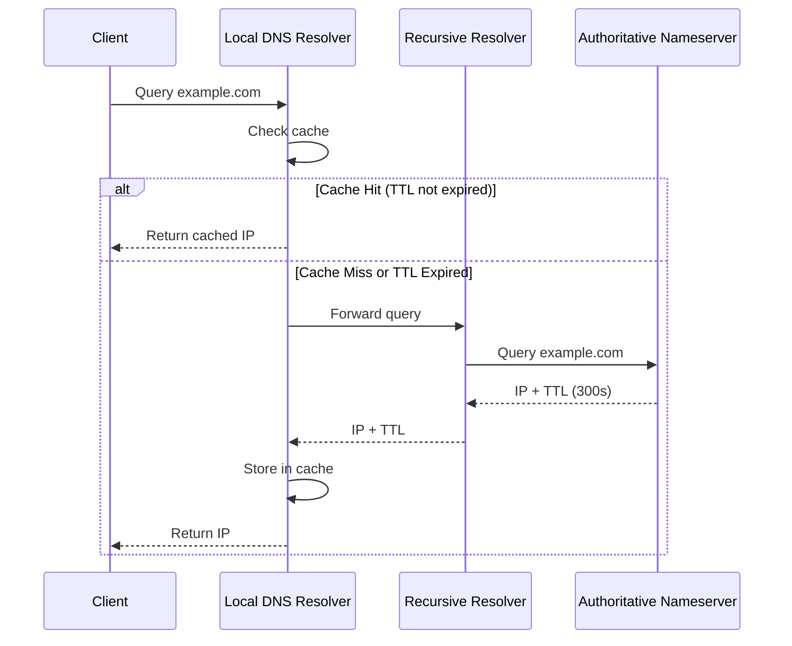
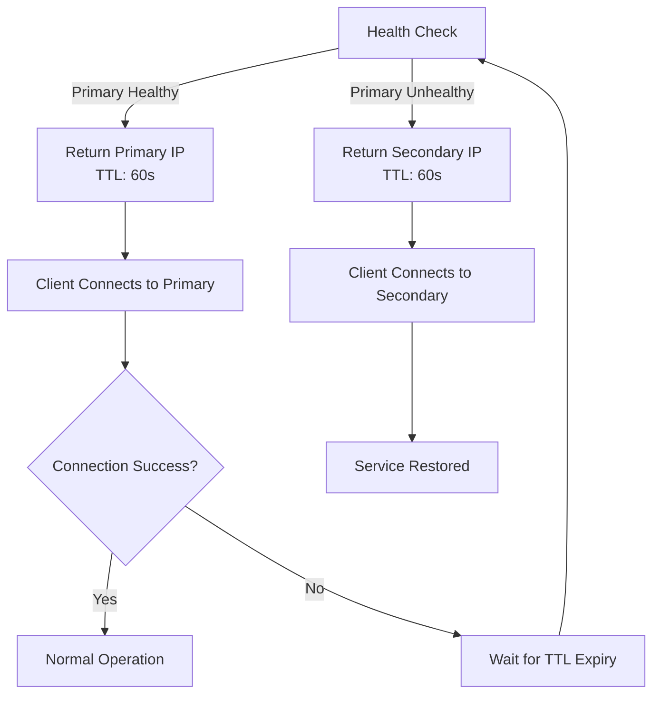

# How to Implement DNS TTL Strategies

Author: [nawazdhandala](https://github.com/nawazdhandala)

Tags: DNS, Caching, Networking, Performance

Description: Learn how to optimize DNS caching performance through strategic TTL configuration for reliability, speed, and failover scenarios.

---

## Introduction

DNS Time-to-Live (TTL) is a fundamental setting that controls how long DNS records are cached by resolvers, browsers, and operating systems. Choosing the right TTL strategy can significantly impact your application's performance, reliability, and ability to recover from failures.

In this guide, we will explore DNS TTL concepts, tradeoffs between low and high TTL values, failover strategies, and practical implementation examples.

## Understanding DNS TTL and Caching Behavior

TTL is a value in seconds that tells DNS resolvers how long to cache a DNS record before querying the authoritative nameserver again. When a client requests a domain name resolution, the response includes the TTL value, and the resolver stores this mapping until the TTL expires.

### How DNS Caching Works



### The TTL Countdown

When a DNS record is cached, the TTL value decrements over time. If the remaining TTL is 120 seconds and another client requests the same record, they receive the cached response with the remaining TTL, not the original value.

```python
# Simulating TTL countdown behavior
import time

class DNSCache:
    def __init__(self):
        self.cache = {}

    def store(self, domain, ip_address, ttl):
        """Store a DNS record with its expiration time."""
        expiration_time = time.time() + ttl
        self.cache[domain] = {
            'ip': ip_address,
            'expires_at': expiration_time
        }
        print(f"Cached {domain} -> {ip_address} for {ttl} seconds")

    def lookup(self, domain):
        """Look up a domain and return remaining TTL."""
        if domain not in self.cache:
            return None, 0

        record = self.cache[domain]
        remaining_ttl = int(record['expires_at'] - time.time())

        if remaining_ttl <= 0:
            # TTL expired, remove from cache
            del self.cache[domain]
            return None, 0

        return record['ip'], remaining_ttl

# Example usage
cache = DNSCache()
cache.store('api.example.com', '192.168.1.100', 300)

# Simulate time passing
time.sleep(60)
ip, remaining = cache.lookup('api.example.com')
print(f"Lookup result: {ip}, TTL remaining: {remaining}s")
# Output: Lookup result: 192.168.1.100, TTL remaining: 240s
```

## Low TTL vs High TTL Tradeoffs

Choosing between low and high TTL values involves balancing several factors. Here is a comparison of the tradeoffs:

| Factor | Low TTL (30-300s) | High TTL (3600s+) |
|--------|-------------------|-------------------|
| DNS Query Load | Higher | Lower |
| Propagation Speed | Fast | Slow |
| Failover Time | Quick | Delayed |
| Resolver Caching | Less effective | More effective |
| Cost (if using paid DNS) | Higher | Lower |

### When to Use Low TTL

Low TTL values (typically 30 to 300 seconds) are appropriate when:

- **Active failover systems**: You need quick DNS-based failover
- **During migrations**: Switching servers or cloud providers
- **Dynamic IP environments**: Frequently changing infrastructure
- **A/B testing**: Routing traffic to different backends

```bash
# Example: Setting a low TTL for a failover-ready A record
# Using AWS Route53 CLI

aws route53 change-resource-record-sets \
    --hosted-zone-id Z1234567890ABC \
    --change-batch '{
        "Changes": [{
            "Action": "UPSERT",
            "ResourceRecordSet": {
                "Name": "api.example.com",
                "Type": "A",
                "TTL": 60,
                "ResourceRecords": [{"Value": "203.0.113.10"}]
            }
        }]
    }'
```

### When to Use High TTL

High TTL values (3600 seconds or more) are appropriate when:

- **Stable infrastructure**: IPs rarely change
- **Reducing DNS costs**: Minimizing query volume
- **Improving performance**: Maximizing cache hits
- **Static content CDNs**: Endpoints that never change

```bash
# Example: Setting a high TTL for a stable service
# Using dig to verify current TTL

dig +nocmd +noall +answer example.com A

# Output example:
# example.com.    3600    IN    A    93.184.216.34
```

## TTL Strategies for Failover

DNS-based failover requires careful TTL planning to balance quick recovery with system efficiency.

### Active-Passive Failover Strategy



### Implementing Health-Based DNS Failover

```python
import dns.resolver
import requests
from typing import Optional

class DNSFailoverManager:
    def __init__(self, primary_ip: str, secondary_ip: str, health_endpoint: str):
        self.primary_ip = primary_ip
        self.secondary_ip = secondary_ip
        self.health_endpoint = health_endpoint
        self.current_active = primary_ip
        self.failover_ttl = 60  # Low TTL during failover
        self.normal_ttl = 300   # Normal operation TTL

    def check_health(self, ip: str) -> bool:
        """Check if the server at the given IP is healthy."""
        try:
            url = f"http://{ip}{self.health_endpoint}"
            response = requests.get(url, timeout=5)
            return response.status_code == 200
        except requests.RequestException:
            return False

    def get_active_ip_and_ttl(self) -> tuple[str, int]:
        """Determine which IP should be active and appropriate TTL."""
        primary_healthy = self.check_health(self.primary_ip)
        secondary_healthy = self.check_health(self.secondary_ip)

        if primary_healthy:
            # Primary is healthy, use normal TTL
            self.current_active = self.primary_ip
            return self.primary_ip, self.normal_ttl
        elif secondary_healthy:
            # Failover to secondary with low TTL
            # Low TTL allows quick return to primary when recovered
            self.current_active = self.secondary_ip
            return self.secondary_ip, self.failover_ttl
        else:
            # Both unhealthy, keep current with very low TTL
            return self.current_active, 30

# Example usage
failover = DNSFailoverManager(
    primary_ip='10.0.1.100',
    secondary_ip='10.0.2.100',
    health_endpoint='/health'
)

active_ip, ttl = failover.get_active_ip_and_ttl()
print(f"Active IP: {active_ip}, TTL: {ttl}s")
```

### Pre-Failover TTL Reduction

Before planned maintenance or anticipated failovers, reduce TTL ahead of time:

```python
import time
from datetime import datetime, timedelta

class PlannedFailover:
    def __init__(self, dns_client, domain: str):
        self.dns_client = dns_client
        self.domain = domain
        self.original_ttl = 3600
        self.failover_ttl = 60

    def prepare_for_failover(self, failover_time: datetime):
        """
        Reduce TTL before planned failover.
        Start TTL reduction at least 2x the original TTL before failover.
        """
        preparation_time = failover_time - timedelta(seconds=self.original_ttl * 2)

        current_time = datetime.now()
        if current_time >= preparation_time:
            # Time to reduce TTL
            print(f"Reducing TTL from {self.original_ttl}s to {self.failover_ttl}s")
            self.dns_client.update_ttl(self.domain, self.failover_ttl)
            return True
        else:
            wait_seconds = (preparation_time - current_time).total_seconds()
            print(f"TTL reduction scheduled in {wait_seconds}s")
            return False

    def execute_failover(self, new_ip: str):
        """Execute the failover by updating the DNS record."""
        print(f"Updating {self.domain} to {new_ip} with TTL {self.failover_ttl}s")
        self.dns_client.update_record(self.domain, new_ip, self.failover_ttl)

    def restore_normal_ttl(self):
        """After failover stabilizes, restore normal TTL."""
        print(f"Restoring TTL to {self.original_ttl}s")
        self.dns_client.update_ttl(self.domain, self.original_ttl)
```

## Negative Caching and NXDOMAIN

Negative caching stores the fact that a domain does not exist (NXDOMAIN) or that a specific record type is not available. This prevents repeated queries for non-existent records.

### Understanding Negative TTL

The negative TTL is defined in the SOA (Start of Authority) record as the minimum TTL field:

```bash
# Query the SOA record to see negative TTL
dig +nocmd +noall +answer example.com SOA

# Output example:
# example.com. 3600 IN SOA ns1.example.com. admin.example.com. (
#     2024010101  ; Serial
#     7200        ; Refresh
#     3600        ; Retry
#     1209600     ; Expire
#     300         ; Negative TTL (Minimum)
# )
```

### Handling NXDOMAIN Responses

```python
import dns.resolver
import dns.exception
from typing import Optional
import time

class NegativeCacheHandler:
    def __init__(self):
        self.negative_cache = {}
        self.default_negative_ttl = 300  # 5 minutes default

    def resolve_with_negative_cache(self, domain: str) -> Optional[str]:
        """
        Resolve a domain with negative caching support.
        Returns None if domain does not exist (cached or fresh).
        """
        # Check negative cache first
        if domain in self.negative_cache:
            cache_entry = self.negative_cache[domain]
            if time.time() < cache_entry['expires_at']:
                print(f"Negative cache hit for {domain}")
                return None
            else:
                # Negative cache expired
                del self.negative_cache[domain]

        try:
            answers = dns.resolver.resolve(domain, 'A')
            return str(answers[0])
        except dns.resolver.NXDOMAIN as e:
            # Domain does not exist, cache the negative result
            # Try to get TTL from SOA record
            negative_ttl = self._get_negative_ttl(domain)
            self.negative_cache[domain] = {
                'expires_at': time.time() + negative_ttl,
                'reason': 'NXDOMAIN'
            }
            print(f"Cached NXDOMAIN for {domain}, TTL: {negative_ttl}s")
            return None
        except dns.resolver.NoAnswer:
            # Record type does not exist for this domain
            self.negative_cache[domain] = {
                'expires_at': time.time() + self.default_negative_ttl,
                'reason': 'NoAnswer'
            }
            return None

    def _get_negative_ttl(self, domain: str) -> int:
        """Extract negative TTL from SOA record."""
        try:
            # Get the parent zone SOA
            parts = domain.split('.')
            for i in range(len(parts)):
                zone = '.'.join(parts[i:])
                try:
                    soa = dns.resolver.resolve(zone, 'SOA')
                    # The minimum field is the negative TTL
                    return soa[0].minimum
                except (dns.resolver.NXDOMAIN, dns.resolver.NoAnswer):
                    continue
        except Exception:
            pass
        return self.default_negative_ttl

# Example usage
handler = NegativeCacheHandler()

# First query for non-existent domain
result = handler.resolve_with_negative_cache('nonexistent.example.com')
# Output: Cached NXDOMAIN for nonexistent.example.com, TTL: 300s

# Second query hits negative cache
result = handler.resolve_with_negative_cache('nonexistent.example.com')
# Output: Negative cache hit for nonexistent.example.com
```

### NXDOMAIN Hijacking Prevention

Some ISPs hijack NXDOMAIN responses for advertising. Configure your resolver to handle this:

```python
class NXDOMAINValidator:
    def __init__(self, known_hijack_ips: list[str]):
        """
        Initialize with known ISP hijack IP addresses.
        These are IPs that ISPs redirect NXDOMAIN to for ads.
        """
        self.hijack_ips = set(known_hijack_ips)

    def is_legitimate_response(self, ip: str, domain: str) -> bool:
        """
        Check if a DNS response is legitimate or hijacked.
        """
        if ip in self.hijack_ips:
            print(f"Warning: {domain} resolved to known hijack IP {ip}")
            return False
        return True

# Common ISP hijack IPs (examples)
validator = NXDOMAINValidator([
    '67.215.65.132',   # Example hijack IP
    '93.184.216.34',   # Example hijack IP
])
```

## Practical TTL Configuration Examples

### Multi-Environment TTL Strategy

```yaml
# dns-config.yaml
# TTL configuration for different environments

environments:
  production:
    # Stable production with moderate TTL
    default_ttl: 300
    records:
      - name: api.example.com
        type: A
        ttl: 60        # Lower TTL for failover capability
        value: 10.0.1.100
      - name: www.example.com
        type: CNAME
        ttl: 3600      # Higher TTL for stable CDN
        value: cdn.example.com
      - name: static.example.com
        type: A
        ttl: 86400     # Very high TTL for static assets
        value: 10.0.2.100

  staging:
    # Lower TTL for flexibility during testing
    default_ttl: 60
    records:
      - name: api.staging.example.com
        type: A
        ttl: 60
        value: 10.1.1.100

  development:
    # Very low TTL for rapid iteration
    default_ttl: 30
    records:
      - name: "*.dev.example.com"
        type: A
        ttl: 30
        value: 10.2.1.100
```

### Dynamic TTL Based on Server Load

```python
import psutil
from dataclasses import dataclass
from typing import Callable

@dataclass
class DynamicTTLConfig:
    min_ttl: int = 30
    max_ttl: int = 300
    load_threshold_low: float = 0.3
    load_threshold_high: float = 0.8

class DynamicTTLManager:
    def __init__(self, config: DynamicTTLConfig):
        self.config = config

    def calculate_ttl(self) -> int:
        """
        Calculate TTL based on current server load.
        Higher load = lower TTL (easier to shift traffic away)
        Lower load = higher TTL (stable caching)
        """
        cpu_load = psutil.cpu_percent() / 100
        memory_load = psutil.virtual_memory().percent / 100

        # Use the higher of CPU or memory load
        current_load = max(cpu_load, memory_load)

        if current_load >= self.config.load_threshold_high:
            # High load: use minimum TTL for quick failover
            return self.config.min_ttl
        elif current_load <= self.config.load_threshold_low:
            # Low load: use maximum TTL for efficiency
            return self.config.max_ttl
        else:
            # Scale TTL linearly between thresholds
            load_range = self.config.load_threshold_high - self.config.load_threshold_low
            load_position = (current_load - self.config.load_threshold_low) / load_range
            ttl_range = self.config.max_ttl - self.config.min_ttl
            return int(self.config.max_ttl - (load_position * ttl_range))

# Example usage
manager = DynamicTTLManager(DynamicTTLConfig())
ttl = manager.calculate_ttl()
print(f"Current recommended TTL: {ttl}s")
```

### TTL Monitoring and Alerting

```python
import dns.resolver
from datetime import datetime
import logging

logging.basicConfig(level=logging.INFO)
logger = logging.getLogger(__name__)

class TTLMonitor:
    def __init__(self, domains: list[str], expected_ttls: dict[str, int]):
        """
        Monitor DNS TTL values and alert on unexpected changes.

        Args:
            domains: List of domains to monitor
            expected_ttls: Dictionary mapping domains to expected TTL values
        """
        self.domains = domains
        self.expected_ttls = expected_ttls
        self.ttl_tolerance = 0.1  # 10% tolerance

    def check_ttl(self, domain: str) -> dict:
        """Check current TTL for a domain."""
        try:
            answers = dns.resolver.resolve(domain, 'A')
            current_ttl = answers.rrset.ttl
            expected_ttl = self.expected_ttls.get(domain, 300)

            # Calculate if TTL is within expected range
            min_expected = expected_ttl * (1 - self.ttl_tolerance)
            max_expected = expected_ttl * (1 + self.ttl_tolerance)
            is_normal = min_expected <= current_ttl <= max_expected

            return {
                'domain': domain,
                'current_ttl': current_ttl,
                'expected_ttl': expected_ttl,
                'is_normal': is_normal,
                'timestamp': datetime.now().isoformat()
            }
        except Exception as e:
            logger.error(f"Failed to check TTL for {domain}: {e}")
            return {
                'domain': domain,
                'error': str(e),
                'timestamp': datetime.now().isoformat()
            }

    def run_checks(self) -> list[dict]:
        """Run TTL checks for all monitored domains."""
        results = []
        for domain in self.domains:
            result = self.check_ttl(domain)
            results.append(result)

            if not result.get('is_normal', True):
                logger.warning(
                    f"TTL anomaly detected for {domain}: "
                    f"current={result.get('current_ttl')}, "
                    f"expected={result.get('expected_ttl')}"
                )

        return results

# Example usage
monitor = TTLMonitor(
    domains=['api.example.com', 'www.example.com'],
    expected_ttls={
        'api.example.com': 60,
        'www.example.com': 3600
    }
)

results = monitor.run_checks()
for result in results:
    print(f"{result['domain']}: TTL={result.get('current_ttl', 'N/A')}")
```

## Best Practices Summary

1. **Start with moderate TTL values** (300 to 600 seconds) and adjust based on your needs
2. **Lower TTL before planned changes** to ensure quick propagation
3. **Use health checks with DNS failover** to automate traffic shifting
4. **Monitor TTL values** to detect unauthorized changes
5. **Consider negative caching** when designing error handling
6. **Document your TTL strategy** for operational clarity
7. **Test failover scenarios** regularly to validate TTL settings

## Conclusion

DNS TTL configuration is a balance between performance optimization and operational flexibility. Low TTLs provide quick failover but increase DNS query load, while high TTLs reduce load but slow down propagation. By understanding these tradeoffs and implementing appropriate strategies for your use case, you can build more resilient and performant systems.

Remember that DNS caching occurs at multiple levels (browser, OS, resolver), and actual propagation times may vary. Always test your TTL strategy in a staging environment before deploying to production.
