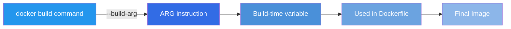
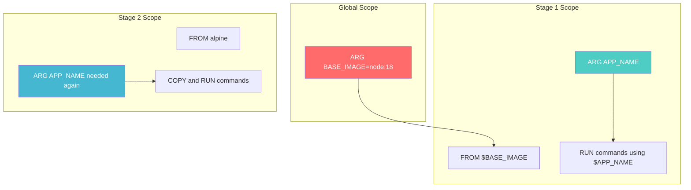
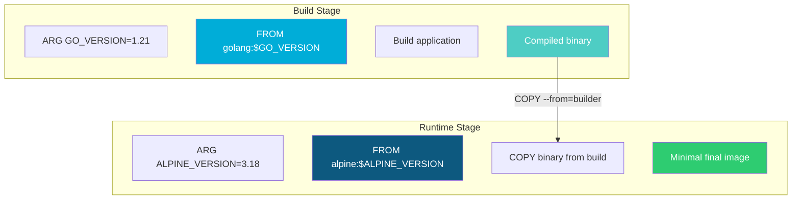
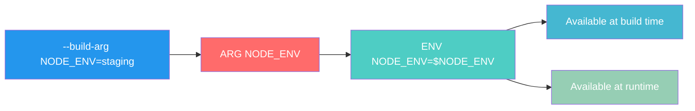
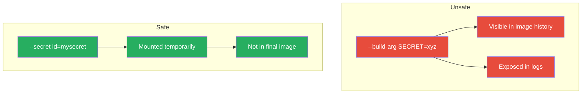

# How to Build Docker Images with Build Arguments

Author: [nawazdhandala](https://github.com/nawazdhandala)

Tags: Docker, Build Arguments, CI/CD, Dockerfile

Description: Learn to use Docker build arguments with ARG instructions, default values, and multi-stage propagation for flexible and reusable builds.

---

Docker build arguments provide a powerful mechanism for parameterizing your image builds. Instead of hardcoding values like version numbers, base images, or configuration options, you can pass them at build time. This makes your Dockerfiles more flexible, reusable, and easier to maintain across different environments.

## What Are Docker Build Arguments?

Build arguments are variables that you can pass to the Docker build process using the `--build-arg` flag. Inside your Dockerfile, you declare these variables using the `ARG` instruction. Unlike environment variables set with `ENV`, build arguments are only available during the build phase and are not persisted in the final image (unless explicitly converted).



## The ARG Instruction Basics

The `ARG` instruction defines a variable that users can pass at build time. Here is the basic syntax:

```dockerfile
ARG <name>[=<default value>]
```

### Simple Example

```dockerfile
# Declare a build argument
ARG APP_VERSION

# Use the argument in your Dockerfile
RUN echo "Building version: $APP_VERSION"
```

To build this image with a specific version:

```bash
docker build --build-arg APP_VERSION=1.2.3 -t myapp:1.2.3 .
```

### With Default Values

You can provide default values that will be used if no argument is passed:

```dockerfile
ARG NODE_VERSION=18
ARG ENVIRONMENT=production

FROM node:${NODE_VERSION}-alpine

RUN echo "Environment: $ENVIRONMENT"
```

Now you can build with defaults or override them:

```bash
# Uses defaults (NODE_VERSION=18, ENVIRONMENT=production)
docker build -t myapp .

# Override the Node version
docker build --build-arg NODE_VERSION=20 -t myapp .

# Override both
docker build --build-arg NODE_VERSION=20 --build-arg ENVIRONMENT=staging -t myapp .
```

## Understanding ARG Scoping

One of the most important concepts to understand is that ARG variables have specific scoping rules in Docker.

### Before FROM vs After FROM

ARGs declared before the first `FROM` instruction are in a special scope. They can only be used in `FROM` instructions, not in subsequent build stages.



```dockerfile
# This ARG is in global scope - only usable in FROM
ARG BASE_IMAGE=node:18-alpine

FROM ${BASE_IMAGE}

# This ARG is scoped to this build stage
ARG APP_NAME=myapp

WORKDIR /app
RUN echo "Building ${APP_NAME}"
```

### Stage-Specific Scoping

Each `FROM` instruction starts a new build stage with its own scope. ARGs do not automatically carry over between stages:

```dockerfile
ARG VERSION=1.0.0

FROM node:18 AS builder
# VERSION is not available here unless redeclared
ARG VERSION
RUN echo "Builder version: $VERSION"

FROM node:18-alpine AS runtime
# VERSION is not available here either - must redeclare
ARG VERSION
RUN echo "Runtime version: $VERSION"
```

## Multi-Stage Builds with Build Arguments

Multi-stage builds are a powerful feature for creating optimized images. Build arguments can make them even more flexible.



### Practical Multi-Stage Example

Here is a complete example for a Go application:

```dockerfile
# Global ARGs for base image versions
ARG GO_VERSION=1.21
ARG ALPINE_VERSION=3.18

# Build stage
FROM golang:${GO_VERSION}-alpine AS builder

ARG APP_VERSION=dev
ARG BUILD_DATE

WORKDIR /src

# Copy dependency files first for better caching
COPY go.mod go.sum ./
RUN go mod download

# Copy source and build
COPY . .
RUN CGO_ENABLED=0 go build \
    -ldflags="-X main.Version=${APP_VERSION} -X main.BuildDate=${BUILD_DATE}" \
    -o /app/server ./cmd/server

# Runtime stage
FROM alpine:${ALPINE_VERSION}

ARG APP_VERSION=dev

# Add labels for image metadata
LABEL version="${APP_VERSION}"
LABEL maintainer="team@example.com"

# Create non-root user
RUN addgroup -S appgroup && adduser -S appuser -G appgroup

WORKDIR /app

# Copy only the binary from builder
COPY --from=builder /app/server .

# Switch to non-root user
USER appuser

EXPOSE 8080
CMD ["./server"]
```

Build command with all arguments:

```bash
docker build \
    --build-arg GO_VERSION=1.22 \
    --build-arg ALPINE_VERSION=3.19 \
    --build-arg APP_VERSION=2.1.0 \
    --build-arg BUILD_DATE=$(date -u +%Y-%m-%dT%H:%M:%SZ) \
    -t myapp:2.1.0 .
```

## Converting ARG to ENV

Sometimes you need a build-time value to also be available at runtime. You can convert an ARG to an ENV:

```dockerfile
ARG NODE_ENV=production

# Convert ARG to ENV for runtime availability
ENV NODE_ENV=${NODE_ENV}

# Now NODE_ENV is available both during build and at runtime
RUN echo "Build-time NODE_ENV: $NODE_ENV"
CMD ["node", "server.js"]  # Runtime can access NODE_ENV
```



## Security Considerations

Build arguments are visible in the image history and build logs. Never use them for sensitive data like passwords, API keys, or tokens.

### What NOT to Do

```dockerfile
# DANGEROUS - Never do this!
ARG DATABASE_PASSWORD
ARG API_SECRET_KEY

ENV DB_PASS=${DATABASE_PASSWORD}
RUN echo "Connecting with password: $DATABASE_PASSWORD"
```

Anyone can view these values:

```bash
# View image history and see ARG values
docker history myimage

# Inspect build cache
docker buildx imagetools inspect myimage
```

### Secure Alternatives

For sensitive data, use Docker secrets or mount secret files during build:

```dockerfile
# Using BuildKit secret mounts (recommended)
RUN --mount=type=secret,id=api_key \
    API_KEY=$(cat /run/secrets/api_key) && \
    ./configure --api-key="$API_KEY"
```

Build with secrets:

```bash
docker build --secret id=api_key,src=./api_key.txt -t myapp .
```



## Predefined ARGs

Docker provides several predefined ARGs that you can use without declaring them:

| ARG | Description |
|-----|-------------|
| `HTTP_PROXY` | HTTP proxy server |
| `HTTPS_PROXY` | HTTPS proxy server |
| `FTP_PROXY` | FTP proxy server |
| `NO_PROXY` | Hosts to exclude from proxying |
| `TARGETPLATFORM` | Platform of the build result (e.g., linux/amd64) |
| `TARGETOS` | OS component of TARGETPLATFORM |
| `TARGETARCH` | Architecture component of TARGETPLATFORM |
| `BUILDPLATFORM` | Platform of the node performing the build |

### Cross-Platform Build Example

```dockerfile
FROM --platform=$BUILDPLATFORM golang:1.21 AS builder

ARG TARGETOS
ARG TARGETARCH

WORKDIR /src
COPY . .

# Cross-compile for the target platform
RUN GOOS=${TARGETOS} GOARCH=${TARGETARCH} go build -o /app/server

FROM alpine:3.18
COPY --from=builder /app/server /usr/local/bin/
CMD ["server"]
```

Build for multiple platforms:

```bash
docker buildx build --platform linux/amd64,linux/arm64 -t myapp:latest .
```

## CI/CD Integration Examples

### GitHub Actions

```yaml
name: Build and Push

on:
  push:
    tags:
      - 'v*'

jobs:
  build:
    runs-on: ubuntu-latest
    steps:
      - uses: actions/checkout@v4

      - name: Extract version
        id: version
        run: echo "VERSION=${GITHUB_REF#refs/tags/v}" >> $GITHUB_OUTPUT

      - name: Build and push
        uses: docker/build-push-action@v5
        with:
          push: true
          tags: myapp:${{ steps.version.outputs.VERSION }}
          build-args: |
            APP_VERSION=${{ steps.version.outputs.VERSION }}
            BUILD_DATE=${{ github.event.head_commit.timestamp }}
            GIT_COMMIT=${{ github.sha }}
```

### GitLab CI

```yaml
build:
  stage: build
  script:
    - docker build
        --build-arg APP_VERSION=${CI_COMMIT_TAG:-dev}
        --build-arg BUILD_DATE=$(date -u +%Y-%m-%dT%H:%M:%SZ)
        --build-arg GIT_COMMIT=${CI_COMMIT_SHA}
        -t ${CI_REGISTRY_IMAGE}:${CI_COMMIT_TAG:-latest} .
    - docker push ${CI_REGISTRY_IMAGE}:${CI_COMMIT_TAG:-latest}
```

## Best Practices Summary

1. **Always provide default values** - Makes your Dockerfile usable without mandatory arguments
2. **Document your ARGs** - Add comments explaining what each ARG does and valid values
3. **Use meaningful names** - `APP_VERSION` is better than `VER` or `V`
4. **Group related ARGs** - Keep ARGs organized at the top of each stage
5. **Never pass secrets via ARG** - Use BuildKit secrets or runtime injection instead
6. **Redeclare ARGs in multi-stage builds** - Remember they do not carry over between stages
7. **Use predefined ARGs for cross-platform builds** - Leverage TARGETARCH and TARGETOS

## Conclusion

Docker build arguments transform static Dockerfiles into flexible, reusable templates. By parameterizing base image versions, application versions, and build-time configurations, you can use a single Dockerfile across different environments and CI/CD pipelines. Just remember to keep security in mind - build arguments are not for secrets - and understand the scoping rules when working with multi-stage builds.

Start small by adding version arguments to your existing Dockerfiles, then gradually expand to more advanced patterns as your needs grow. The flexibility you gain will make maintaining and deploying your containerized applications significantly easier.
