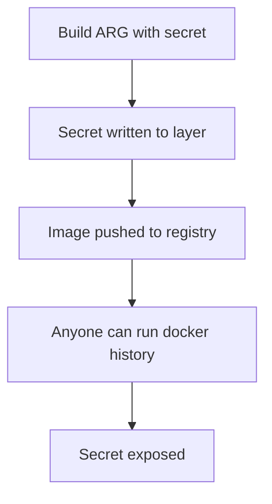
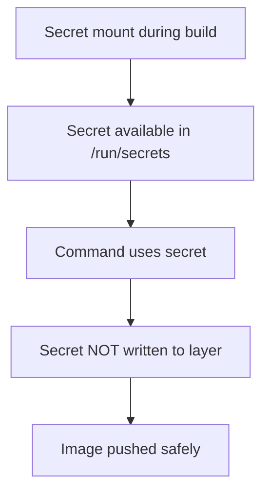

# How to Build Docker Images with BuildKit Secrets

Author: [nawazdhandala](https://www.github.com/nawazdhandala)

Tags: Docker, BuildKit, Secrets, Security, DevOps

Description: Securely handle sensitive data during Docker builds using BuildKit secrets, SSH forwarding, and mount types without leaking credentials into image layers.

---

If you have ever needed to pull packages from a private npm registry, clone a private Git repository, or authenticate with an API during your Docker build, you have probably faced the challenge of handling credentials safely. The traditional approach of using build arguments or copying secret files into the image is risky because those secrets end up baked into image layers, visible to anyone who inspects the image history.

BuildKit, Docker's modern build engine, solves this problem with secret mounts. Secrets are available during the build but never written to image layers. This post walks through how to use BuildKit secrets effectively in real-world scenarios.

## Why BuildKit Secrets Matter

Before diving into the how, let's understand the security problem with the old approach.

The following diagram shows what happens when you use build arguments for secrets:



With BuildKit secrets, the flow changes:



The key difference is that secrets mounted with BuildKit are only accessible during the specific RUN instruction and are never persisted in the final image.

## Enabling BuildKit

BuildKit is the default builder in Docker Desktop and recent Docker Engine versions, but you can ensure it is enabled with:

```bash
# Set environment variable for a single build
DOCKER_BUILDKIT=1 docker build -t myimage .

# Or enable permanently in your shell profile
export DOCKER_BUILDKIT=1
```

For Docker daemon configuration, add to `/etc/docker/daemon.json`:

```json
{
  "features": {
    "buildkit": true
  }
}
```

## Basic Secret Usage

The syntax for mounting secrets uses the `--mount=type=secret` directive in your Dockerfile.

Here is a minimal example that reads a token during the build:

```dockerfile
# syntax=docker/dockerfile:1.4
FROM alpine:3.19

# The secret is mounted at /run/secrets/mytoken by default
# It only exists during this specific RUN instruction
RUN --mount=type=secret,id=mytoken \
    echo "Token exists: $(test -f /run/secrets/mytoken && echo yes || echo no)"
```

Build the image by passing the secret from a file:

```bash
# Create a secret file
echo "my-secret-value" > token.txt

# Build with the secret
docker build --secret id=mytoken,src=./token.txt -t myimage .
```

You can also pass secrets from environment variables:

```bash
# Export the secret
export MY_TOKEN="my-secret-value"

# Build using the environment variable
docker build --secret id=mytoken,env=MY_TOKEN -t myimage .
```

## Practical Example: Private npm Registry

One of the most common use cases is authenticating with a private npm registry. Here is a complete Dockerfile that handles this securely:

```dockerfile
# syntax=docker/dockerfile:1.4
FROM node:20-alpine AS builder

WORKDIR /app

# Copy package files first for better layer caching
COPY package.json package-lock.json ./

# Mount the .npmrc file during npm install
# The secret is mounted to the location npm expects it
RUN --mount=type=secret,id=npmrc,target=/root/.npmrc \
    npm ci

# Copy source code and build
COPY . .
RUN npm run build

# Production stage - no secrets here
FROM node:20-alpine AS production

WORKDIR /app

# Copy only what we need from the builder
COPY --from=builder /app/dist ./dist
COPY --from=builder /app/node_modules ./node_modules
COPY package.json ./

USER node
EXPOSE 3000
CMD ["node", "dist/index.js"]
```

Build command:

```bash
# Your .npmrc file contains the registry token
docker build \
    --secret id=npmrc,src=$HOME/.npmrc \
    -t myapp:latest .
```

The beauty of this approach is that the `.npmrc` file with your registry token is never copied into any image layer. It is only available during the `npm ci` command.

## SSH Agent Forwarding

For cloning private Git repositories, BuildKit supports SSH agent forwarding. This lets you use your local SSH keys without copying them into the image.

```dockerfile
# syntax=docker/dockerfile:1.4
FROM alpine:3.19

# Install git and ssh client
RUN apk add --no-cache git openssh-client

# Add GitHub's host key to known_hosts
# This prevents the "host key verification failed" error
RUN mkdir -p /root/.ssh && \
    ssh-keyscan github.com >> /root/.ssh/known_hosts

# Clone private repository using SSH agent forwarding
RUN --mount=type=ssh \
    git clone git@github.com:myorg/private-repo.git /app
```

Build with SSH forwarding:

```bash
# Start SSH agent and add your key
eval $(ssh-agent)
ssh-add ~/.ssh/id_ed25519

# Build with SSH forwarding enabled
docker build --ssh default -t myimage .
```

## Multiple Secrets in One Build

Real applications often need multiple secrets. You can mount several secrets in a single RUN instruction:

```dockerfile
# syntax=docker/dockerfile:1.4
FROM python:3.11-slim

WORKDIR /app
COPY requirements.txt .

# Mount both pip config and a private PyPI token
RUN --mount=type=secret,id=pip_conf,target=/root/.pip/pip.conf \
    --mount=type=secret,id=pypi_token \
    pip install -r requirements.txt

COPY . .
CMD ["python", "main.py"]
```

Build command with multiple secrets:

```bash
docker build \
    --secret id=pip_conf,src=./pip.conf \
    --secret id=pypi_token,env=PYPI_TOKEN \
    -t myapp .
```

## Using Secrets in Docker Compose

Docker Compose also supports build secrets. Here is how to configure them:

```yaml
# docker-compose.yml
services:
  app:
    build:
      context: .
      dockerfile: Dockerfile
      secrets:
        - npmrc
        - github_token

secrets:
  npmrc:
    file: ~/.npmrc
  github_token:
    environment: GITHUB_TOKEN
```

Build with:

```bash
docker compose build
```

## Security Best Practices

Even with BuildKit secrets, there are a few things to keep in mind.

First, always use the Dockerfile syntax directive:

```dockerfile
# syntax=docker/dockerfile:1.4
```

This ensures you have access to the latest BuildKit features.

Second, verify your secrets are not leaking by inspecting the image history:

```bash
# Check image history for exposed secrets
docker history --no-trunc myimage:latest

# Save and inspect layers
docker save myimage:latest | tar -tv | grep -v "layer.tar"
```

Third, consider using tools like Trivy to scan for accidentally committed secrets:

```bash
trivy image myimage:latest
```

## Common Pitfalls

One mistake developers make is trying to use the secret in a subsequent RUN instruction:

```dockerfile
# This will NOT work
RUN --mount=type=secret,id=token \
    cat /run/secrets/token > /tmp/token

# The file /tmp/token now contains your secret in the layer!
RUN cat /tmp/token  # Secret is exposed
```

Each secret mount is only available for that specific RUN instruction. If you need to use a secret across multiple commands, chain them in a single RUN:

```dockerfile
# Correct approach - single RUN instruction
RUN --mount=type=secret,id=token \
    npm config set //registry.npmjs.org/:_authToken=$(cat /run/secrets/token) && \
    npm install && \
    npm config delete //registry.npmjs.org/:_authToken
```

## Conclusion

BuildKit secrets provide a secure way to use sensitive data during Docker builds without risking exposure in your final images. Whether you need to authenticate with private registries, clone private repositories, or use API keys during builds, the `--mount=type=secret` syntax keeps your credentials safe.

The key points to remember:

- Secrets are mounted temporarily and never written to image layers
- Use `--secret id=name,src=file` or `--secret id=name,env=VAR` when building
- SSH forwarding with `--mount=type=ssh` handles Git authentication cleanly
- Always verify with `docker history` that no secrets leaked

By adopting BuildKit secrets in your Docker workflows, you eliminate a significant source of credential exposure and make your container builds production-ready from a security standpoint.
