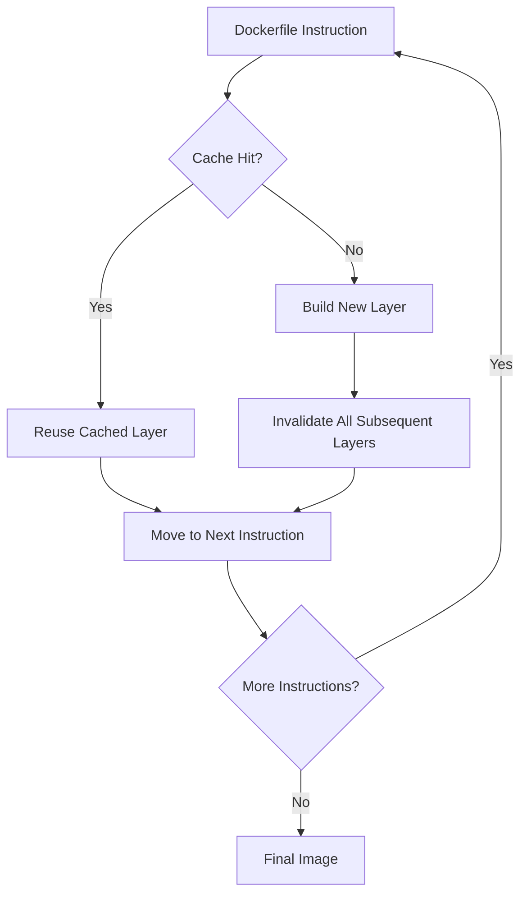
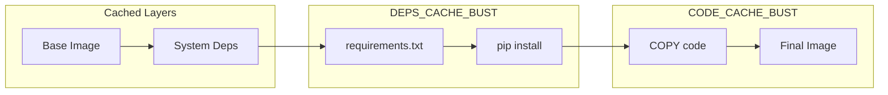
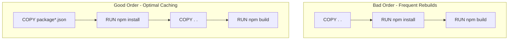
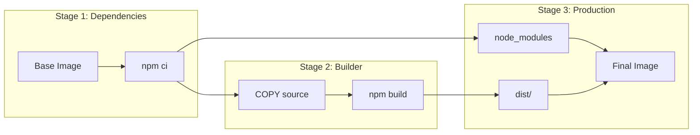

# How to Build Docker Images with Cache Busting

Author: [nawazdhandala](https://github.com/nawazdhandala)

Tags: Docker, Cache, Build Optimization, CI/CD

Description: Learn to implement Docker cache busting strategies with build arguments, timestamps, and selective invalidation for fresh dependency updates.

---

Docker's layer caching is a powerful feature that speeds up builds by reusing unchanged layers. However, there are situations where you need to force fresh builds - whether to pull the latest dependencies, ensure security patches are applied, or troubleshoot build issues. This guide covers practical cache busting techniques to give you full control over your Docker builds.

## Understanding Docker Layer Caching

Before diving into cache busting, let's understand how Docker caching works:



Docker caches each layer based on:
- The instruction itself
- The base image
- Files copied into the image (checksum-based)
- Build arguments and environment variables

When any layer changes, all subsequent layers are rebuilt. This cascade effect is key to understanding cache busting strategies.

## Method 1: The --no-cache Flag

The simplest approach is to disable caching entirely:

```bash
docker build --no-cache -t myapp:latest .
```

This rebuilds every layer from scratch. While effective, it's often overkill and significantly increases build time.

**When to use:** Complete rebuilds, debugging cache-related issues, or when you need to ensure absolutely nothing is cached.

## Method 2: ARG-Based Cache Busting

A more surgical approach uses build arguments to invalidate specific layers:

```dockerfile
FROM node:20-alpine

WORKDIR /app

# Cache buster argument - change this to invalidate cache
ARG CACHE_BUST=1

# This layer and all following layers will rebuild when CACHE_BUST changes
RUN echo "Cache bust: $CACHE_BUST" && npm cache clean --force

COPY package*.json ./
RUN npm install

COPY . .
RUN npm run build

CMD ["npm", "start"]
```

Build with a unique value to bust the cache:

```bash
# Using timestamp
docker build --build-arg CACHE_BUST=$(date +%s) -t myapp:latest .

# Using git commit hash
docker build --build-arg CACHE_BUST=$(git rev-parse HEAD) -t myapp:latest .

# Using random value
docker build --build-arg CACHE_BUST=$RANDOM -t myapp:latest .
```

## Method 3: Selective Layer Invalidation

Target specific layers for cache invalidation while keeping others cached:

```dockerfile
FROM python:3.12-slim

WORKDIR /app

# System dependencies - rarely change, keep cached
RUN apt-get update && apt-get install -y \
    gcc \
    libpq-dev \
    && rm -rf /var/lib/apt/lists/*

# Dependencies cache buster - use when you need fresh packages
ARG DEPS_CACHE_BUST=1
COPY requirements.txt .
RUN pip install --no-cache-dir -r requirements.txt

# Application code cache buster - use for code changes
ARG CODE_CACHE_BUST=1
COPY . .

CMD ["python", "app.py"]
```

Now you can selectively invalidate:

```bash
# Bust only dependency cache
docker build --build-arg DEPS_CACHE_BUST=$(date +%s) -t myapp:latest .

# Bust only code cache (dependencies stay cached)
docker build --build-arg CODE_CACHE_BUST=$(date +%s) -t myapp:latest .

# Bust both
docker build \
    --build-arg DEPS_CACHE_BUST=$(date +%s) \
    --build-arg CODE_CACHE_BUST=$(date +%s) \
    -t myapp:latest .
```



## Method 4: Timestamp-Based Invalidation

Force rebuilds based on time intervals:

```dockerfile
FROM golang:1.22-alpine

WORKDIR /app

# Invalidate cache daily (YYYYMMDD format)
ARG BUILD_DATE
RUN echo "Build date: $BUILD_DATE"

# Fetch fresh dependencies
COPY go.mod go.sum ./
RUN go mod download

COPY . .
RUN go build -o main .

CMD ["./main"]
```

```bash
# Daily cache invalidation
docker build --build-arg BUILD_DATE=$(date +%Y%m%d) -t myapp:latest .

# Hourly cache invalidation
docker build --build-arg BUILD_DATE=$(date +%Y%m%d%H) -t myapp:latest .

# Weekly cache invalidation (year + week number)
docker build --build-arg BUILD_DATE=$(date +%Y%V) -t myapp:latest .
```

## Method 5: Dependency File Hashing

Create cache invalidation based on dependency file changes:

```dockerfile
FROM ruby:3.3-alpine

WORKDIR /app

# Copy dependency files first
COPY Gemfile Gemfile.lock ./

# ARG that changes when dependencies change
ARG GEMFILE_HASH

# This rebuilds when Gemfile content changes
RUN echo "Gemfile hash: $GEMFILE_HASH" && bundle install

COPY . .

CMD ["rails", "server"]
```

```bash
# Generate hash from dependency files
GEMFILE_HASH=$(cat Gemfile Gemfile.lock | sha256sum | cut -d' ' -f1)

docker build --build-arg GEMFILE_HASH=$GEMFILE_HASH -t myapp:latest .
```

## Optimizing Layer Order for Effective Caching

The order of instructions significantly impacts cache efficiency:



**Best Practice Dockerfile:**

```dockerfile
FROM node:20-alpine

WORKDIR /app

# Layer 1: Rarely changes - system dependencies
RUN apk add --no-cache python3 make g++

# Layer 2: Changes occasionally - npm dependencies
# Copy only package files first
COPY package.json package-lock.json ./

# Optional: Cache bust for fresh dependencies
ARG NPM_CACHE_BUST=1
RUN npm ci --only=production

# Layer 3: Changes frequently - application code
COPY . .

# Layer 4: Build step
RUN npm run build

# Runtime configuration
ENV NODE_ENV=production
EXPOSE 3000
CMD ["node", "dist/index.js"]
```

## CI/CD Integration Examples

### GitHub Actions

```yaml
name: Build and Push

on:
  push:
    branches: [main]
  schedule:
    # Weekly fresh build every Sunday at midnight
    - cron: '0 0 * * 0'

jobs:
  build:
    runs-on: ubuntu-latest
    steps:
      - uses: actions/checkout@v4

      - name: Set cache bust value
        id: cache
        run: |
          if [ "${{ github.event_name }}" == "schedule" ]; then
            # Scheduled builds get fresh dependencies
            echo "CACHE_BUST=$(date +%s)" >> $GITHUB_OUTPUT
          else
            # Regular builds use weekly cache
            echo "CACHE_BUST=$(date +%Y%V)" >> $GITHUB_OUTPUT
          fi

      - name: Build Docker image
        run: |
          docker build \
            --build-arg CACHE_BUST=${{ steps.cache.outputs.CACHE_BUST }} \
            --build-arg BUILD_SHA=${{ github.sha }} \
            -t myapp:${{ github.sha }} \
            .
```

### GitLab CI

```yaml
build:
  stage: build
  script:
    - |
      # Determine cache strategy
      if [ "$CI_PIPELINE_SOURCE" == "schedule" ]; then
        CACHE_BUST=$(date +%s)
      else
        CACHE_BUST=$(date +%Y%V)
      fi
    - docker build
        --build-arg CACHE_BUST=$CACHE_BUST
        --build-arg CI_COMMIT_SHA=$CI_COMMIT_SHA
        -t $CI_REGISTRY_IMAGE:$CI_COMMIT_SHA
        .
    - docker push $CI_REGISTRY_IMAGE:$CI_COMMIT_SHA
```

## Multi-Stage Builds with Cache Busting

For complex applications, combine multi-stage builds with targeted cache invalidation:

```dockerfile
# Stage 1: Dependencies
FROM node:20-alpine AS dependencies

WORKDIR /app

ARG DEPS_CACHE_BUST=1
COPY package*.json ./
RUN npm ci

# Stage 2: Build
FROM dependencies AS builder

ARG CODE_CACHE_BUST=1
COPY . .
RUN npm run build

# Stage 3: Production
FROM node:20-alpine AS production

WORKDIR /app

# Copy only production dependencies
COPY --from=dependencies /app/node_modules ./node_modules

# Copy built application
COPY --from=builder /app/dist ./dist

ENV NODE_ENV=production
USER node
CMD ["node", "dist/index.js"]
```



## BuildKit Cache Mounts

Docker BuildKit provides advanced caching with cache mounts that persist between builds:

```dockerfile
# syntax=docker/dockerfile:1.4
FROM python:3.12-slim

WORKDIR /app

# Use cache mount for pip - survives between builds
ARG CACHE_BUST=1
RUN --mount=type=cache,target=/root/.cache/pip \
    pip install --upgrade pip

COPY requirements.txt .
RUN --mount=type=cache,target=/root/.cache/pip \
    pip install -r requirements.txt

COPY . .
CMD ["python", "app.py"]
```

To bust the BuildKit cache:

```bash
# Clear BuildKit cache entirely
docker builder prune

# Clear specific cache types
docker builder prune --filter type=exec.cachemount

# Build with no cache
DOCKER_BUILDKIT=1 docker build --no-cache -t myapp:latest .
```

## Quick Reference Commands

| Command | Purpose |
|---------|---------|
| `docker build --no-cache` | Rebuild everything from scratch |
| `docker build --pull` | Pull fresh base images |
| `docker build --build-arg CACHE_BUST=$(date +%s)` | Timestamp-based invalidation |
| `docker builder prune` | Clear BuildKit cache |
| `docker system prune -a` | Remove all unused images and cache |

## Best Practices Summary

1. **Order layers by change frequency** - Put rarely changing instructions first
2. **Use multi-stage builds** - Separate build-time and runtime dependencies
3. **Be specific with COPY** - Copy dependency files before source code
4. **Use ARG strategically** - Place cache bust ARGs immediately before the layers you want to invalidate
5. **Automate in CI/CD** - Use scheduled builds for regular fresh dependency updates
6. **Document your strategy** - Make cache busting intentions clear in your Dockerfile

## Conclusion

Docker cache busting gives you fine-grained control over your build process. By understanding how layer caching works and applying targeted invalidation strategies, you can balance build speed with the need for fresh dependencies and security updates. Start with the simple `--no-cache` flag for troubleshooting, then adopt ARG-based strategies for production workflows where you need both speed and control.

Remember: the goal is not to bust the cache constantly, but to have the tools ready when you need a fresh build. Use these techniques judiciously to maintain fast builds while ensuring your images stay up to date.
