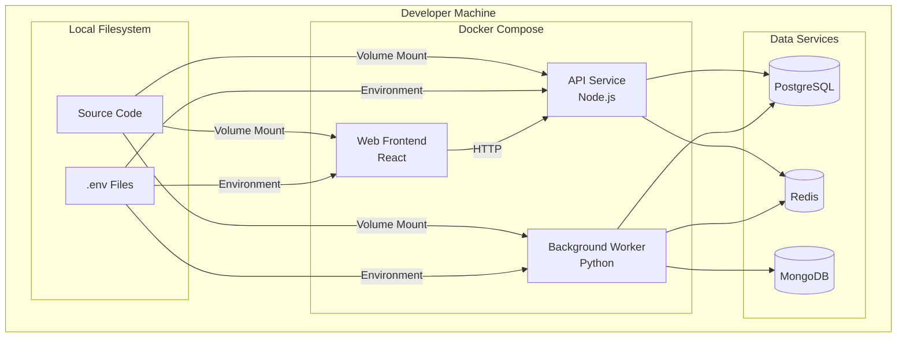
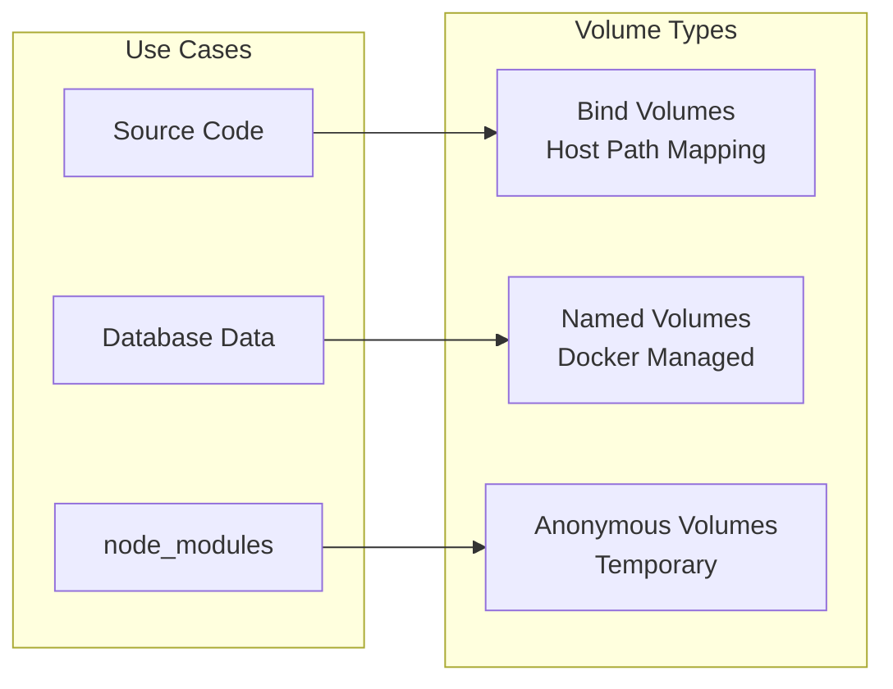
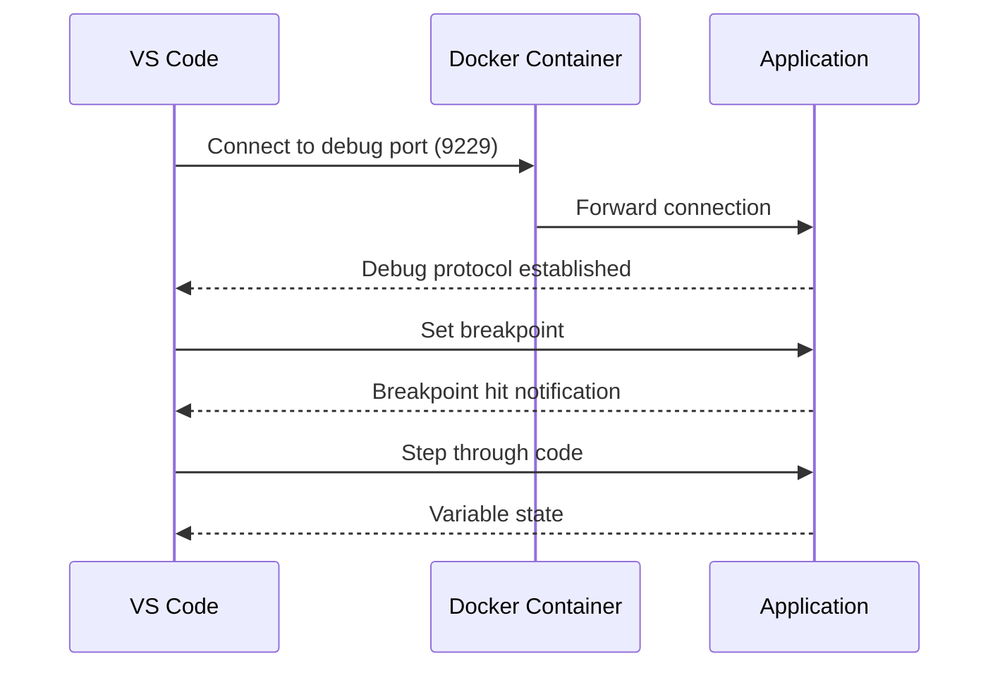
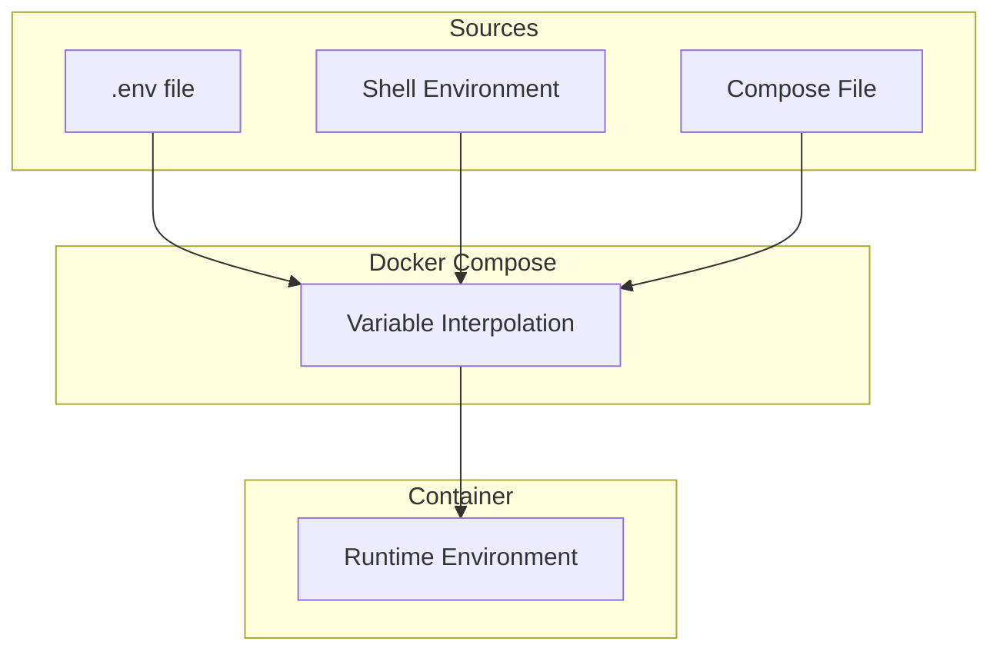
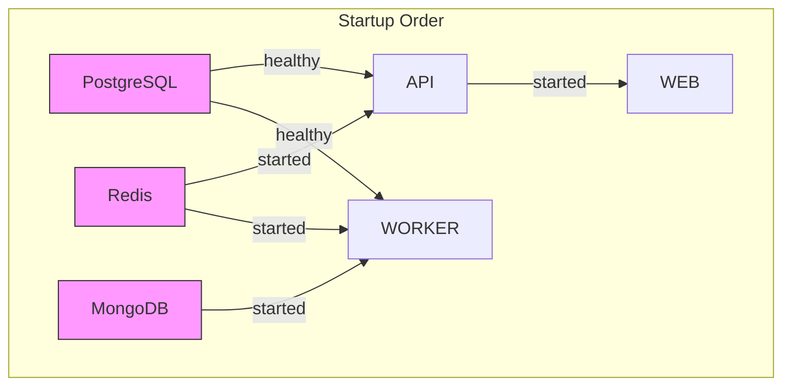

# How to Build Docker Compose for Local Development

Author: [nawazdhandala](https://github.com/nawazdhandala)

Tags: Docker, Docker Compose, Local Development, Developer Experience

Description: Learn to configure Docker Compose for local development with hot reload, debugging, and service orchestration for productive development workflows.

---

Docker Compose has become an essential tool for developers working with containerized applications. While production deployments often use Kubernetes or other orchestrators, Docker Compose shines in local development environments where simplicity and fast iteration are key. This guide walks you through building a Docker Compose setup optimized for local development workflows.

## Understanding the Local Development Architecture

Before diving into configuration, let us visualize how Docker Compose orchestrates services in a local development environment:



## Project Structure

A well-organized project structure makes Docker Compose configuration cleaner and more maintainable:

```
project/
├── docker-compose.yml           # Base compose file
├── docker-compose.override.yml  # Local development overrides
├── docker-compose.prod.yml      # Production overrides
├── .env                         # Environment variables
├── .env.example                 # Template for environment variables
├── services/
│   ├── api/
│   │   ├── Dockerfile
│   │   ├── Dockerfile.dev
│   │   └── src/
│   ├── web/
│   │   ├── Dockerfile
│   │   ├── Dockerfile.dev
│   │   └── src/
│   └── worker/
│       ├── Dockerfile
│       ├── Dockerfile.dev
│       └── src/
└── scripts/
    ├── setup.sh
    └── seed-db.sh
```

## Base Docker Compose Configuration

Start with a base `docker-compose.yml` that defines your services:

```yaml
version: '3.8'

services:
  api:
    build:
      context: ./services/api
      dockerfile: Dockerfile.dev
    ports:
      - "3000:3000"
    environment:
      - NODE_ENV=development
      - DATABASE_URL=postgresql://postgres:password@db:5432/myapp
      - REDIS_URL=redis://redis:6379
    depends_on:
      db:
        condition: service_healthy
      redis:
        condition: service_started
    networks:
      - app-network

  web:
    build:
      context: ./services/web
      dockerfile: Dockerfile.dev
    ports:
      - "8080:8080"
    environment:
      - VITE_API_URL=http://localhost:3000
    depends_on:
      - api
    networks:
      - app-network

  worker:
    build:
      context: ./services/worker
      dockerfile: Dockerfile.dev
    environment:
      - DATABASE_URL=postgresql://postgres:password@db:5432/myapp
      - REDIS_URL=redis://redis:6379
      - MONGO_URL=mongodb://mongo:27017/myapp
    depends_on:
      db:
        condition: service_healthy
      redis:
        condition: service_started
      mongo:
        condition: service_started
    networks:
      - app-network

  db:
    image: postgres:15-alpine
    ports:
      - "5432:5432"
    environment:
      - POSTGRES_USER=postgres
      - POSTGRES_PASSWORD=password
      - POSTGRES_DB=myapp
    volumes:
      - postgres-data:/var/lib/postgresql/data
    healthcheck:
      test: ["CMD-SHELL", "pg_isready -U postgres"]
      interval: 5s
      timeout: 5s
      retries: 5
    networks:
      - app-network

  redis:
    image: redis:7-alpine
    ports:
      - "6379:6379"
    volumes:
      - redis-data:/data
    networks:
      - app-network

  mongo:
    image: mongo:6
    ports:
      - "27017:27017"
    volumes:
      - mongo-data:/data/db
    networks:
      - app-network

networks:
  app-network:
    driver: bridge

volumes:
  postgres-data:
  redis-data:
  mongo-data:
```

## Volume Mounts for Live Code Reload

The key to a productive local development experience is having your code changes reflected immediately without rebuilding containers. Volume mounts make this possible.

### Understanding Volume Mount Types



Create a `docker-compose.override.yml` for development-specific volume mounts:

```yaml
version: '3.8'

services:
  api:
    volumes:
      # Mount source code for live reload
      - ./services/api/src:/app/src:cached
      # Mount package.json for dependency changes
      - ./services/api/package.json:/app/package.json:cached
      # Use anonymous volume for node_modules to avoid conflicts
      - /app/node_modules
    command: npm run dev

  web:
    volumes:
      - ./services/web/src:/app/src:cached
      - ./services/web/package.json:/app/package.json:cached
      - ./services/web/vite.config.ts:/app/vite.config.ts:cached
      - /app/node_modules
    command: npm run dev

  worker:
    volumes:
      - ./services/worker/src:/app/src:cached
      - ./services/worker/requirements.txt:/app/requirements.txt:cached
    command: python -m watchdog.watchmedo auto-restart --patterns="*.py" --recursive -- python main.py
```

### Volume Mount Options Explained

The `:cached` flag optimizes performance on macOS and Windows by allowing the host to be slightly ahead of the container. Here are the available options:

| Option | Description | Best For |
|--------|-------------|----------|
| `consistent` | Perfect sync (default) | Critical data |
| `cached` | Host may be ahead | Source code (macOS/Windows) |
| `delegated` | Container may be ahead | Build artifacts |

## Implementing Hot Reload

Hot reload requires both proper volume mounts and development server configuration.

### Node.js with Nodemon

Create a development Dockerfile (`Dockerfile.dev`) for the API service:

```dockerfile
FROM node:20-alpine

WORKDIR /app

# Install dependencies first for better caching
COPY package*.json ./
RUN npm install

# Install nodemon globally for hot reload
RUN npm install -g nodemon

# Copy source code
COPY . .

# Expose port and debug port
EXPOSE 3000 9229

# Default command - can be overridden in compose
CMD ["nodemon", "--inspect=0.0.0.0:9229", "src/index.js"]
```

Configure `nodemon.json` for optimal watching:

```json
{
  "watch": ["src"],
  "ext": "js,json,ts",
  "ignore": ["src/**/*.test.js", "node_modules"],
  "delay": "500",
  "exec": "node --inspect=0.0.0.0:9229 src/index.js"
}
```

### React/Vite Hot Module Replacement

For the web frontend with Vite:

```dockerfile
FROM node:20-alpine

WORKDIR /app

COPY package*.json ./
RUN npm install

COPY . .

EXPOSE 8080

CMD ["npm", "run", "dev", "--", "--host", "0.0.0.0", "--port", "8080"]
```

Configure Vite to work properly in Docker (`vite.config.ts`):

```typescript
import { defineConfig } from 'vite';
import react from '@vitejs/plugin-react';

export default defineConfig({
  plugins: [react()],
  server: {
    host: '0.0.0.0',
    port: 8080,
    watch: {
      usePolling: true, // Required for Docker on some systems
      interval: 100
    },
    hmr: {
      port: 8080
    }
  }
});
```

### Python with Watchdog

For the Python worker service:

```dockerfile
FROM python:3.11-slim

WORKDIR /app

COPY requirements.txt .
RUN pip install --no-cache-dir -r requirements.txt
RUN pip install watchdog[watchmedo]

COPY . .

CMD ["watchmedo", "auto-restart", "--patterns=*.py", "--recursive", "--", "python", "main.py"]
```

## Debugging Configuration

Debugging containerized applications requires exposing debug ports and configuring your IDE.

### Debug Architecture



### VS Code Debug Configuration

Create `.vscode/launch.json`:

```json
{
  "version": "0.2.0",
  "configurations": [
    {
      "name": "Docker: Attach to API",
      "type": "node",
      "request": "attach",
      "port": 9229,
      "address": "localhost",
      "localRoot": "${workspaceFolder}/services/api/src",
      "remoteRoot": "/app/src",
      "restart": true,
      "skipFiles": ["<node_internals>/**"]
    },
    {
      "name": "Docker: Attach to Worker (Python)",
      "type": "debugpy",
      "request": "attach",
      "connect": {
        "host": "localhost",
        "port": 5678
      },
      "pathMappings": [
        {
          "localRoot": "${workspaceFolder}/services/worker/src",
          "remoteRoot": "/app/src"
        }
      ]
    }
  ]
}
```

### Python Debug Setup

Update the worker Dockerfile for debugging:

```dockerfile
FROM python:3.11-slim

WORKDIR /app

COPY requirements.txt .
RUN pip install --no-cache-dir -r requirements.txt
RUN pip install debugpy watchdog[watchmedo]

COPY . .

EXPOSE 5678

# Start with debugpy for remote debugging
CMD ["python", "-m", "debugpy", "--listen", "0.0.0.0:5678", "--wait-for-client", "main.py"]
```

Add the debug port to `docker-compose.override.yml`:

```yaml
services:
  worker:
    ports:
      - "5678:5678"
    environment:
      - DEBUG=true
```

## Environment Variables Management

Proper environment variable management keeps sensitive data secure and configuration flexible.

### Environment Variable Flow



### Creating Environment Files

Create a `.env` file in your project root:

```bash
# Database Configuration
POSTGRES_USER=postgres
POSTGRES_PASSWORD=localdevpassword
POSTGRES_DB=myapp
DATABASE_URL=postgresql://${POSTGRES_USER}:${POSTGRES_PASSWORD}@db:5432/${POSTGRES_DB}

# Redis Configuration
REDIS_URL=redis://redis:6379

# MongoDB Configuration
MONGO_URL=mongodb://mongo:27017/myapp

# Application Settings
NODE_ENV=development
LOG_LEVEL=debug
API_PORT=3000
WEB_PORT=8080

# Feature Flags
ENABLE_DEBUG=true
ENABLE_SWAGGER=true

# External Services (use mock values for local dev)
STRIPE_API_KEY=sk_test_fake_key
AWS_ACCESS_KEY_ID=local_fake_key
AWS_SECRET_ACCESS_KEY=local_fake_secret
```

Create a `.env.example` as a template:

```bash
# Database Configuration
POSTGRES_USER=postgres
POSTGRES_PASSWORD=
POSTGRES_DB=myapp
DATABASE_URL=postgresql://${POSTGRES_USER}:${POSTGRES_PASSWORD}@db:5432/${POSTGRES_DB}

# Redis Configuration
REDIS_URL=redis://redis:6379

# MongoDB Configuration
MONGO_URL=mongodb://mongo:27017/myapp

# Application Settings
NODE_ENV=development
LOG_LEVEL=debug
API_PORT=3000
WEB_PORT=8080

# Feature Flags
ENABLE_DEBUG=true
ENABLE_SWAGGER=true

# External Services
STRIPE_API_KEY=
AWS_ACCESS_KEY_ID=
AWS_SECRET_ACCESS_KEY=
```

### Using Environment Variables in Compose

Reference environment variables in your compose file:

```yaml
version: '3.8'

services:
  api:
    build:
      context: ./services/api
      args:
        - NODE_ENV=${NODE_ENV:-development}
    ports:
      - "${API_PORT:-3000}:3000"
    environment:
      - NODE_ENV=${NODE_ENV}
      - DATABASE_URL=${DATABASE_URL}
      - REDIS_URL=${REDIS_URL}
      - LOG_LEVEL=${LOG_LEVEL:-info}
      - ENABLE_SWAGGER=${ENABLE_SWAGGER:-false}
    env_file:
      - .env
      - .env.local  # Optional local overrides

  db:
    image: postgres:15-alpine
    environment:
      POSTGRES_USER: ${POSTGRES_USER}
      POSTGRES_PASSWORD: ${POSTGRES_PASSWORD}
      POSTGRES_DB: ${POSTGRES_DB}
```

### Multiple Environment Support

Create environment-specific files:

```bash
# .env.development
NODE_ENV=development
LOG_LEVEL=debug
ENABLE_DEBUG=true

# .env.test
NODE_ENV=test
LOG_LEVEL=warn
ENABLE_DEBUG=false
DATABASE_URL=postgresql://postgres:password@db:5432/myapp_test

# .env.staging
NODE_ENV=staging
LOG_LEVEL=info
ENABLE_DEBUG=false
```

Load specific environments:

```bash
# Load development environment
docker compose --env-file .env.development up

# Load test environment
docker compose --env-file .env.test up
```

## Service Dependencies and Health Checks

Proper dependency management ensures services start in the correct order and are truly ready before dependent services connect.

### Dependency Flow



### Health Check Configuration

Define comprehensive health checks for each service:

```yaml
version: '3.8'

services:
  api:
    build:
      context: ./services/api
    healthcheck:
      test: ["CMD", "curl", "-f", "http://localhost:3000/health"]
      interval: 10s
      timeout: 5s
      retries: 5
      start_period: 30s
    depends_on:
      db:
        condition: service_healthy
      redis:
        condition: service_healthy

  db:
    image: postgres:15-alpine
    healthcheck:
      test: ["CMD-SHELL", "pg_isready -U ${POSTGRES_USER} -d ${POSTGRES_DB}"]
      interval: 5s
      timeout: 5s
      retries: 5
      start_period: 10s

  redis:
    image: redis:7-alpine
    healthcheck:
      test: ["CMD", "redis-cli", "ping"]
      interval: 5s
      timeout: 3s
      retries: 5

  mongo:
    image: mongo:6
    healthcheck:
      test: ["CMD", "mongosh", "--eval", "db.adminCommand('ping')"]
      interval: 10s
      timeout: 5s
      retries: 5
      start_period: 20s

  web:
    build:
      context: ./services/web
    depends_on:
      api:
        condition: service_healthy

  worker:
    build:
      context: ./services/worker
    depends_on:
      db:
        condition: service_healthy
      redis:
        condition: service_healthy
      mongo:
        condition: service_healthy
```

### Implementing Health Endpoints

Add health check endpoints to your services. For Node.js:

```javascript
// src/routes/health.js
const express = require('express');
const router = express.Router();
const { Pool } = require('pg');
const Redis = require('ioredis');

const pool = new Pool({ connectionString: process.env.DATABASE_URL });
const redis = new Redis(process.env.REDIS_URL);

router.get('/health', async (req, res) => {
  const health = {
    status: 'healthy',
    timestamp: new Date().toISOString(),
    checks: {}
  };

  // Check database
  try {
    await pool.query('SELECT 1');
    health.checks.database = 'healthy';
  } catch (error) {
    health.checks.database = 'unhealthy';
    health.status = 'unhealthy';
  }

  // Check Redis
  try {
    await redis.ping();
    health.checks.redis = 'healthy';
  } catch (error) {
    health.checks.redis = 'unhealthy';
    health.status = 'unhealthy';
  }

  const statusCode = health.status === 'healthy' ? 200 : 503;
  res.status(statusCode).json(health);
});

module.exports = router;
```

## Development Workflow Scripts

Create helper scripts to streamline common development tasks.

### Setup Script

Create `scripts/setup.sh`:

```bash
#!/bin/bash

set -e

echo "Setting up development environment..."

# Copy environment file if it doesn't exist
if [ ! -f .env ]; then
    echo "Creating .env file from template..."
    cp .env.example .env
    echo "Please edit .env with your configuration"
fi

# Build images
echo "Building Docker images..."
docker compose build

# Start services
echo "Starting services..."
docker compose up -d

# Wait for database to be ready
echo "Waiting for database..."
until docker compose exec -T db pg_isready -U postgres; do
    sleep 2
done

# Run migrations
echo "Running database migrations..."
docker compose exec api npm run migrate

# Seed database
echo "Seeding database..."
docker compose exec api npm run seed

echo "Development environment is ready!"
echo "API: http://localhost:3000"
echo "Web: http://localhost:8080"
```

### Database Management Script

Create `scripts/db.sh`:

```bash
#!/bin/bash

case "$1" in
    migrate)
        docker compose exec api npm run migrate
        ;;
    rollback)
        docker compose exec api npm run migrate:rollback
        ;;
    seed)
        docker compose exec api npm run seed
        ;;
    reset)
        docker compose exec api npm run migrate:rollback:all
        docker compose exec api npm run migrate
        docker compose exec api npm run seed
        ;;
    shell)
        docker compose exec db psql -U postgres -d myapp
        ;;
    dump)
        docker compose exec db pg_dump -U postgres myapp > backup.sql
        ;;
    restore)
        docker compose exec -T db psql -U postgres myapp < backup.sql
        ;;
    *)
        echo "Usage: $0 {migrate|rollback|seed|reset|shell|dump|restore}"
        exit 1
        ;;
esac
```

### Makefile for Common Tasks

Create a `Makefile` for convenient shortcuts:

```makefile
.PHONY: up down build logs shell test lint clean

# Start all services
up:
	docker compose up -d

# Start with logs
up-logs:
	docker compose up

# Stop all services
down:
	docker compose down

# Stop and remove volumes
down-clean:
	docker compose down -v

# Build images
build:
	docker compose build

# Rebuild without cache
build-clean:
	docker compose build --no-cache

# View logs
logs:
	docker compose logs -f

# View logs for specific service
logs-%:
	docker compose logs -f $*

# Shell into service
shell-api:
	docker compose exec api sh

shell-web:
	docker compose exec web sh

shell-worker:
	docker compose exec worker sh

shell-db:
	docker compose exec db psql -U postgres -d myapp

# Run tests
test:
	docker compose exec api npm test
	docker compose exec worker pytest

# Run linting
lint:
	docker compose exec api npm run lint
	docker compose exec web npm run lint
	docker compose exec worker flake8

# Clean up
clean:
	docker compose down -v --rmi local
	docker system prune -f

# Database operations
db-migrate:
	docker compose exec api npm run migrate

db-seed:
	docker compose exec api npm run seed

db-reset:
	docker compose exec api npm run migrate:rollback:all
	docker compose exec api npm run migrate
	docker compose exec api npm run seed

# Initial setup
setup:
	./scripts/setup.sh
```

## Performance Optimization Tips

### Optimize Build Caching

Use multi-stage builds and layer ordering:

```dockerfile
# Stage 1: Dependencies
FROM node:20-alpine AS deps
WORKDIR /app
COPY package*.json ./
RUN npm ci

# Stage 2: Development
FROM node:20-alpine AS dev
WORKDIR /app
COPY --from=deps /app/node_modules ./node_modules
COPY . .
CMD ["npm", "run", "dev"]
```

### Volume Performance on macOS/Windows

Use Docker's new VirtioFS or gRPC FUSE file sharing for better performance:

```yaml
services:
  api:
    volumes:
      - type: bind
        source: ./services/api/src
        target: /app/src
        consistency: cached
```

### Resource Limits

Set resource limits to prevent containers from consuming too many resources:

```yaml
services:
  api:
    deploy:
      resources:
        limits:
          cpus: '1'
          memory: 1G
        reservations:
          cpus: '0.5'
          memory: 512M
```

## Troubleshooting Common Issues

### Container Networking Issues

If services cannot communicate:

```bash
# Check network configuration
docker network ls
docker network inspect project_app-network

# Test connectivity from within a container
docker compose exec api ping db
docker compose exec api nc -zv db 5432
```

### Volume Permission Issues

On Linux, you may encounter permission issues:

```yaml
services:
  api:
    user: "${UID:-1000}:${GID:-1000}"
    volumes:
      - ./services/api/src:/app/src
```

Run compose with your user ID:

```bash
UID=$(id -u) GID=$(id -g) docker compose up
```

### Hot Reload Not Working

If file changes are not detected:

1. Ensure polling is enabled for your file watcher
2. Check volume mount paths are correct
3. Verify the development server is configured for Docker

```yaml
services:
  web:
    environment:
      - CHOKIDAR_USEPOLLING=true
      - WATCHPACK_POLLING=true
```

## Conclusion

Building an effective Docker Compose setup for local development requires careful consideration of volume mounts, hot reload configuration, debugging support, environment management, and service dependencies. By following the patterns outlined in this guide, you can create a development environment that closely mirrors production while maintaining the fast feedback loops essential for productive development.

Key takeaways:

- Use volume mounts with appropriate consistency flags for live code reload
- Configure health checks to ensure proper service startup order
- Separate development and production configurations using override files
- Implement proper debugging support with exposed ports and IDE configuration
- Manage environment variables securely with .env files and templates
- Create helper scripts and Makefiles to streamline common tasks

With these practices in place, your team can enjoy consistent, reproducible development environments that eliminate the classic "works on my machine" problem while maintaining developer productivity.
