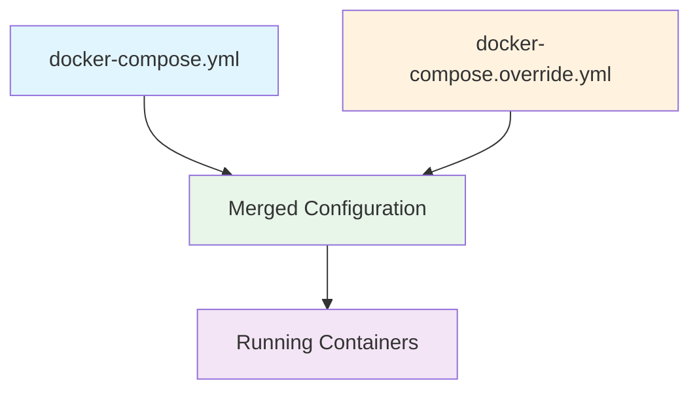
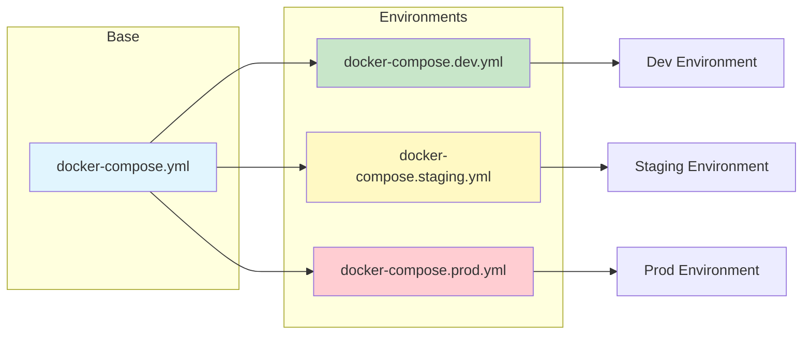
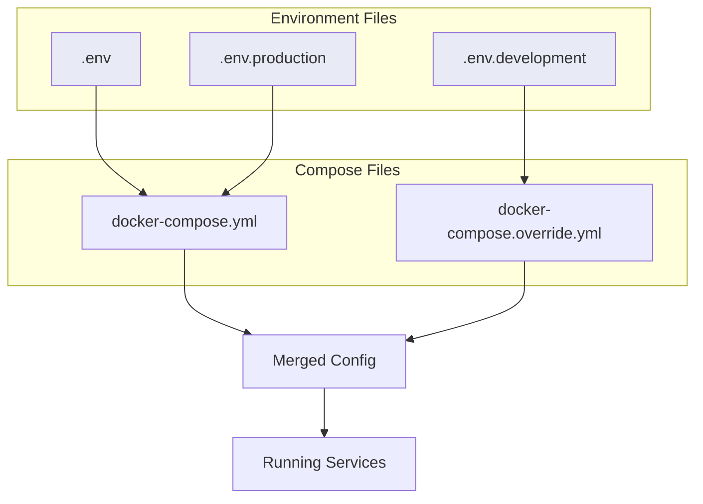
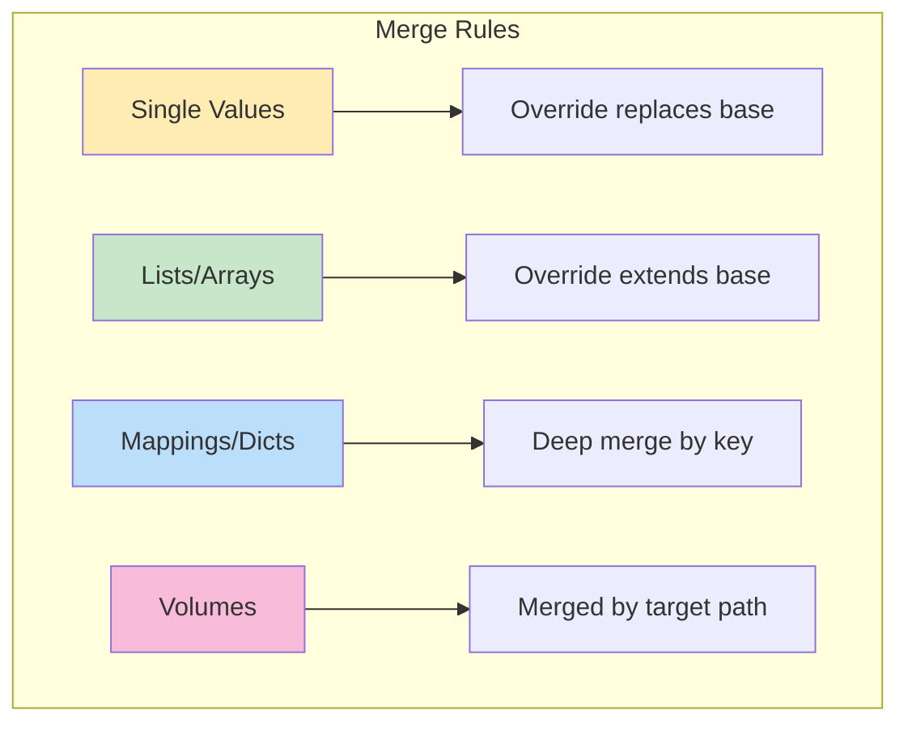

# How to Create Docker Compose Override Strategies

Author: [nawazdhandala](https://github.com/nawazdhandala)

Tags: Docker, Docker Compose, Development, DevOps

Description: Learn how to use Docker Compose override files for environment-specific configurations.

---

Managing different configurations across development, staging, and production environments is a common challenge for development teams. Docker Compose provides a powerful override system that allows you to layer configuration files, making it easy to customize your container setup for each environment without duplicating code.

In this guide, we will explore Docker Compose override strategies that will streamline your development workflows and keep your configurations clean and maintainable.

## Understanding the Override Mechanism

Docker Compose automatically looks for two files when you run `docker-compose up`:

1. `docker-compose.yml` - The base configuration
2. `docker-compose.override.yml` - The override configuration (applied automatically)

When both files exist, Compose merges them together, with the override file taking precedence for conflicting values.



## Basic Override Structure

Let us start with a base `docker-compose.yml` file that defines your application services:

```yaml
# docker-compose.yml
# Base configuration shared across all environments
# This file contains production-ready defaults

version: '3.8'

services:
  # Web application service
  web:
    image: myapp:latest
    ports:
      - "80:80"
    environment:
      # Default to production mode
      - NODE_ENV=production
    restart: always

  # Database service
  database:
    image: postgres:15
    environment:
      - POSTGRES_DB=myapp
      - POSTGRES_USER=appuser
    volumes:
      # Named volume for persistent data
      - db_data:/var/lib/postgresql/data
    restart: always

volumes:
  db_data:
```

Now create a `docker-compose.override.yml` for development:

```yaml
# docker-compose.override.yml
# Development overrides - applied automatically
# Optimized for local development experience

version: '3.8'

services:
  web:
    # Build from local Dockerfile instead of using image
    build:
      context: .
      dockerfile: Dockerfile.dev
    ports:
      # Add debug port
      - "80:80"
      - "9229:9229"
    environment:
      # Override to development mode
      - NODE_ENV=development
      - DEBUG=true
    volumes:
      # Mount source code for hot reloading
      - ./src:/app/src
      - ./package.json:/app/package.json
    # Remove restart policy for development
    restart: "no"

  database:
    ports:
      # Expose database port for local tools
      - "5432:5432"
    environment:
      # Simple password for local development only
      - POSTGRES_PASSWORD=devpassword
```

## Multiple Override Files for Different Environments

For more complex setups, you can use the `-f` flag to specify which files to merge:



### Development Configuration

```yaml
# docker-compose.dev.yml
# Development-specific configuration
# Run with: docker-compose -f docker-compose.yml -f docker-compose.dev.yml up

version: '3.8'

services:
  web:
    build:
      context: .
      dockerfile: Dockerfile.dev
      # Build arguments for development
      args:
        - INSTALL_DEV_DEPS=true
    environment:
      - NODE_ENV=development
      - DEBUG=*
      - LOG_LEVEL=debug
    volumes:
      # Source code mounting for live reload
      - ./src:/app/src:delegated
      # Prevent node_modules from being overwritten
      - /app/node_modules
    # Enable stdin for debugging
    stdin_open: true
    tty: true

  # Add development-only services
  mailhog:
    # Local email testing server
    image: mailhog/mailhog
    ports:
      - "1025:1025"
      - "8025:8025"

  redis:
    # Add Redis for caching during development
    image: redis:7-alpine
    ports:
      - "6379:6379"
```

### Staging Configuration

```yaml
# docker-compose.staging.yml
# Staging environment configuration
# Mirrors production but with debugging capabilities

version: '3.8'

services:
  web:
    image: myapp:staging
    environment:
      - NODE_ENV=staging
      - LOG_LEVEL=info
      - DEBUG=app:*
    deploy:
      # Limited resources for staging
      resources:
        limits:
          cpus: '1'
          memory: 1G
    logging:
      driver: json-file
      options:
        max-size: "10m"
        max-file: "3"

  database:
    environment:
      - POSTGRES_PASSWORD_FILE=/run/secrets/db_password
    secrets:
      - db_password

secrets:
  db_password:
    file: ./secrets/staging_db_password.txt
```

### Production Configuration

```yaml
# docker-compose.prod.yml
# Production environment configuration
# Optimized for performance, security, and reliability

version: '3.8'

services:
  web:
    image: myapp:${VERSION:-latest}
    environment:
      - NODE_ENV=production
      - LOG_LEVEL=warn
    deploy:
      # Production scaling and resources
      replicas: 3
      resources:
        limits:
          cpus: '2'
          memory: 2G
        reservations:
          cpus: '0.5'
          memory: 512M
      # Rolling update strategy
      update_config:
        parallelism: 1
        delay: 10s
        failure_action: rollback
      # Restart policy
      restart_policy:
        condition: on-failure
        delay: 5s
        max_attempts: 3
    # Health check configuration
    healthcheck:
      test: ["CMD", "curl", "-f", "http://localhost/health"]
      interval: 30s
      timeout: 10s
      retries: 3
      start_period: 40s
    logging:
      driver: json-file
      options:
        max-size: "50m"
        max-file: "5"

  database:
    environment:
      - POSTGRES_PASSWORD_FILE=/run/secrets/db_password
    secrets:
      - db_password
    deploy:
      placement:
        # Pin database to specific node
        constraints:
          - node.labels.db == true

secrets:
  db_password:
    external: true
```

## Environment Files Strategy

Environment files provide another layer of configuration management. They work seamlessly with Docker Compose overrides.



### Base Environment File

```bash
# .env
# Base environment variables
# These are default values used across all environments

# Application settings
APP_NAME=myapp
APP_PORT=3000

# Database connection
DB_HOST=database
DB_PORT=5432
DB_NAME=myapp

# Redis connection
REDIS_HOST=redis
REDIS_PORT=6379
```

### Development Environment File

```bash
# .env.development
# Development-specific environment variables
# DO NOT commit sensitive values to version control

# Application settings
NODE_ENV=development
DEBUG=true
LOG_LEVEL=debug

# Database credentials (local development only)
DB_USER=devuser
DB_PASSWORD=devpassword

# Feature flags for development
ENABLE_HOT_RELOAD=true
ENABLE_DEBUG_TOOLBAR=true

# External service mocks
USE_MOCK_PAYMENT=true
USE_MOCK_EMAIL=true
```

### Production Environment File

```bash
# .env.production
# Production environment variables template
# Actual values should be injected via CI/CD or secrets management

# Application settings
NODE_ENV=production
LOG_LEVEL=warn

# Database credentials (use secrets in production)
DB_USER=${DB_USER}
DB_PASSWORD=${DB_PASSWORD}

# Feature flags
ENABLE_HOT_RELOAD=false
ENABLE_DEBUG_TOOLBAR=false

# External services
USE_MOCK_PAYMENT=false
USE_MOCK_EMAIL=false
```

### Using Environment Files in Compose

```yaml
# docker-compose.yml
# Referencing environment files

version: '3.8'

services:
  web:
    image: myapp:latest
    # Load environment from file
    env_file:
      - .env
    environment:
      # These override values from env_file
      - APP_PORT=${APP_PORT:-3000}
      - DB_HOST=${DB_HOST}
      - DB_PORT=${DB_PORT}
```

```yaml
# docker-compose.dev.yml
# Development override with specific env file

version: '3.8'

services:
  web:
    env_file:
      # Load base first, then development overrides
      - .env
      - .env.development
```

## Practical Override Patterns

### Pattern 1: Volume Mounting for Development

```yaml
# docker-compose.override.yml
# Local development with live code reloading

services:
  web:
    volumes:
      # Mount entire source directory
      - ./src:/app/src:delegated
      # Mount configuration files
      - ./config:/app/config:ro
      # Preserve node_modules from container
      - node_modules:/app/node_modules

volumes:
  node_modules:
```

### Pattern 2: Service Dependencies

```yaml
# docker-compose.dev.yml
# Add development-only dependencies

services:
  web:
    depends_on:
      database:
        condition: service_healthy
      redis:
        condition: service_started
      mailhog:
        condition: service_started

  # Development database with health check
  database:
    healthcheck:
      test: ["CMD-SHELL", "pg_isready -U $$POSTGRES_USER -d $$POSTGRES_DB"]
      interval: 5s
      timeout: 5s
      retries: 5
```

### Pattern 3: Debug Configuration

```yaml
# docker-compose.debug.yml
# Configuration for debugging sessions

services:
  web:
    build:
      args:
        - DEBUG_BUILD=true
    # Expose debugger ports
    ports:
      - "9229:9229"  # Node.js debugger
      - "5678:5678"  # Python debugger
    environment:
      - NODE_OPTIONS=--inspect=0.0.0.0:9229
    # Keep container running for debugging
    command: ["npm", "run", "debug"]
    # Security settings for debugging
    cap_add:
      - SYS_PTRACE
    security_opt:
      - seccomp:unconfined
```

### Pattern 4: Resource Constraints

```yaml
# docker-compose.prod.yml
# Production resource management

services:
  web:
    deploy:
      resources:
        limits:
          cpus: '2.0'
          memory: 2G
        reservations:
          cpus: '0.5'
          memory: 512M

  database:
    deploy:
      resources:
        limits:
          cpus: '4.0'
          memory: 4G
        reservations:
          cpus: '1.0'
          memory: 1G
    # Database-specific settings
    command: >
      postgres
      -c shared_buffers=1GB
      -c effective_cache_size=3GB
      -c maintenance_work_mem=256MB
```

## Automation with Makefile or Scripts

Create helper scripts to simplify environment management:

```makefile
# Makefile
# Shortcuts for common Docker Compose operations

.PHONY: dev staging prod build clean

# Development environment
dev:
	docker-compose -f docker-compose.yml -f docker-compose.dev.yml up

# Development with rebuild
dev-build:
	docker-compose -f docker-compose.yml -f docker-compose.dev.yml up --build

# Staging environment
staging:
	docker-compose -f docker-compose.yml -f docker-compose.staging.yml up -d

# Production environment
prod:
	docker-compose -f docker-compose.yml -f docker-compose.prod.yml up -d

# Build all images
build:
	docker-compose -f docker-compose.yml -f docker-compose.prod.yml build

# Clean up all containers and volumes
clean:
	docker-compose down -v --remove-orphans

# View logs
logs:
	docker-compose logs -f

# Shell into web container
shell:
	docker-compose exec web /bin/sh
```

## Best Practices

### 1. Keep Base Configuration Minimal

Your `docker-compose.yml` should contain only the essential, shared configuration. Environment-specific details belong in override files.

### 2. Use Explicit File Ordering

When using multiple override files, order matters. Later files override earlier ones:

```bash
# Correct ordering: base -> environment -> local customizations
docker-compose \
  -f docker-compose.yml \
  -f docker-compose.dev.yml \
  -f docker-compose.local.yml \
  up
```

### 3. Document Your Override Files

Add comments explaining the purpose of each override file and when to use it:

```yaml
# docker-compose.test.yml
# Purpose: Configuration for running integration tests
# Usage: docker-compose -f docker-compose.yml -f docker-compose.test.yml run tests
# Note: This configuration uses isolated test databases
```

### 4. Secure Sensitive Data

Never commit sensitive data to version control:

```yaml
# docker-compose.prod.yml
# Use external secrets or environment variable injection

services:
  web:
    environment:
      # Reference external secrets
      - DB_PASSWORD_FILE=/run/secrets/db_password
      - API_KEY_FILE=/run/secrets/api_key
    secrets:
      - db_password
      - api_key

secrets:
  db_password:
    external: true
  api_key:
    external: true
```

### 5. Use COMPOSE_FILE Environment Variable

Set the `COMPOSE_FILE` variable to avoid typing long commands:

```bash
# .envrc or shell profile
# Development environment
export COMPOSE_FILE=docker-compose.yml:docker-compose.dev.yml

# Now you can simply run:
docker-compose up
```

## Override Merge Behavior Reference

Understanding how Docker Compose merges configurations is essential:



| Configuration Type | Merge Behavior |
|-------------------|----------------|
| `image` | Replaced |
| `command` | Replaced |
| `environment` | Merged by variable name |
| `ports` | Appended |
| `volumes` | Merged by mount target |
| `depends_on` | Merged |
| `labels` | Merged by key |

## Conclusion

Docker Compose override strategies provide a flexible and maintainable approach to managing configurations across different environments. By separating concerns between base configurations and environment-specific overrides, you can:

- Reduce configuration duplication
- Minimize the risk of production misconfigurations
- Enable faster local development workflows
- Maintain clear separation between environments

Start with a simple base configuration and gradually add override files as your needs grow. Remember to document your setup and establish clear conventions for your team.

## Further Reading

- [Docker Compose File Reference](https://docs.docker.com/compose/compose-file/)
- [Docker Compose Environment Variables](https://docs.docker.com/compose/environment-variables/)
- [Docker Secrets Management](https://docs.docker.com/engine/swarm/secrets/)
