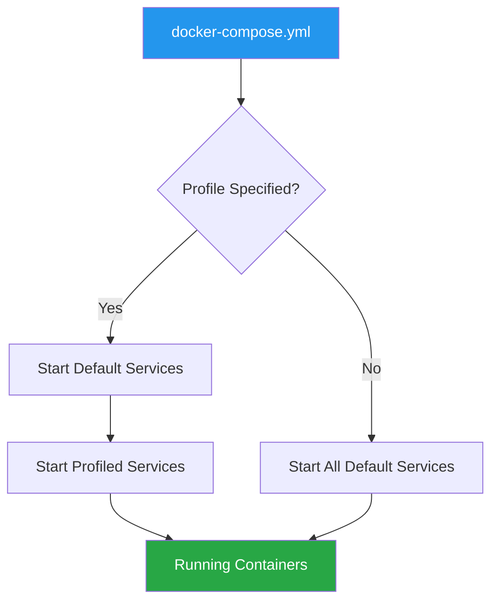
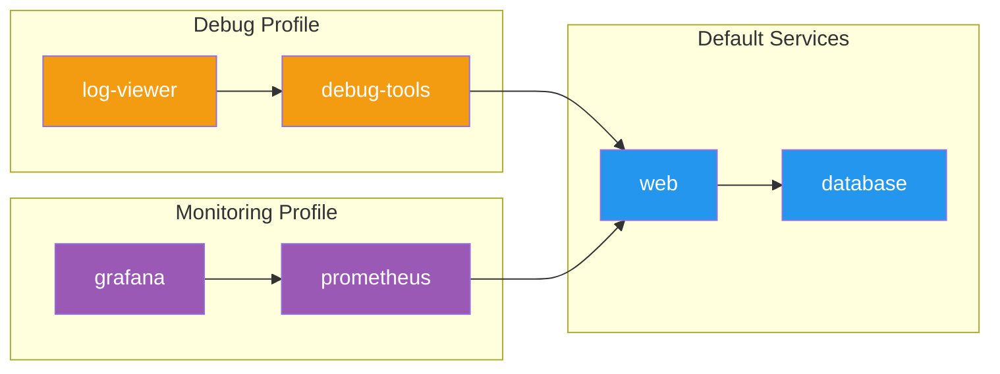
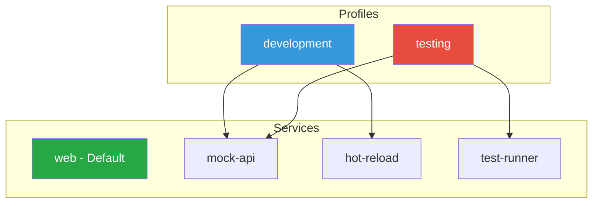
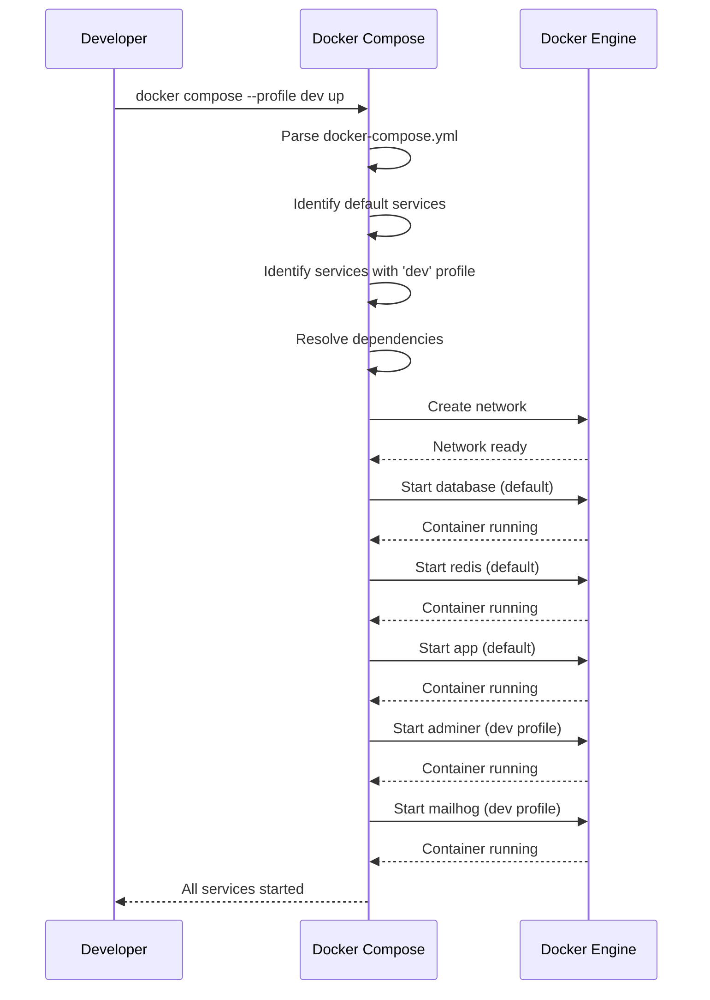
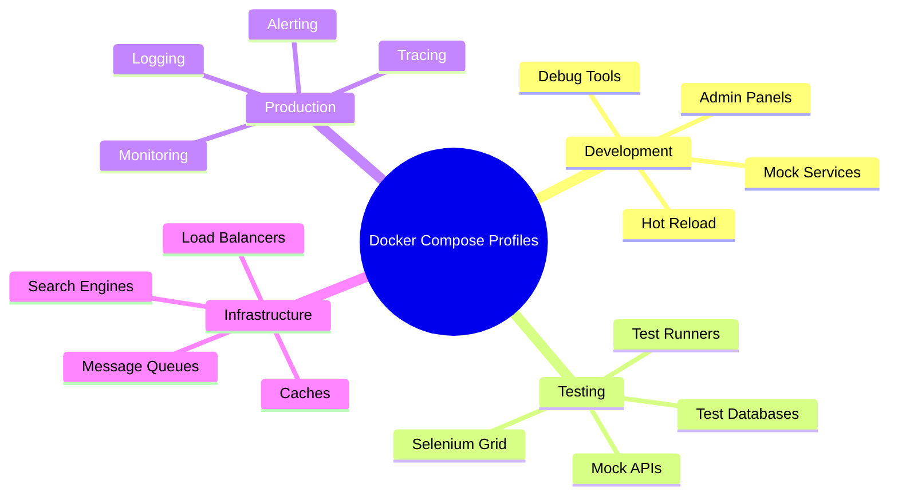

# How to Create Docker Compose with Profiles

Author: [nawazdhandala](https://github.com/nawazdhandala)

Tags: Docker, Docker Compose, Profiles, Development

Description: Learn to use Docker Compose profiles for selective service startup with profile groups, dependencies, and environment-specific configurations.

---

Docker Compose profiles provide a powerful way to selectively start services based on your needs. Instead of running all services defined in your `docker-compose.yml` file, profiles let you group services and activate only the ones required for a specific task or environment. This is particularly useful when managing development, testing, and production configurations within a single compose file.

## Understanding Docker Compose Profiles

Profiles allow you to mark services so they only start when that profile is explicitly activated. Services without a profile assignment will always start by default, while profiled services require explicit activation.



## Basic Profile Definition

To assign a profile to a service, use the `profiles` attribute in your service definition. A service can belong to multiple profiles.

### Simple Example

```yaml
# docker-compose.yml
version: "3.9"

services:
  # This service starts by default (no profile)
  web:
    image: nginx:alpine
    ports:
      - "80:80"

  # This service only starts when 'debug' profile is active
  debug-tools:
    image: busybox
    profiles:
      - debug
    command: sleep infinity

  # This service only starts when 'monitoring' profile is active
  prometheus:
    image: prom/prometheus:latest
    profiles:
      - monitoring
    ports:
      - "9090:9090"
```

In this example:
- `web` starts every time you run `docker compose up`
- `debug-tools` only starts when the `debug` profile is activated
- `prometheus` only starts when the `monitoring` profile is activated

## Activating Profiles

There are several ways to activate profiles when starting your services.

### Using the Command Line Flag

```bash
# Activate a single profile
docker compose --profile debug up

# Activate multiple profiles
docker compose --profile debug --profile monitoring up

# Short form
docker compose -p debug -p monitoring up
```

### Using Environment Variables

```bash
# Set the profile via environment variable
export COMPOSE_PROFILES=debug,monitoring
docker compose up

# Or inline
COMPOSE_PROFILES=debug docker compose up
```

### Using a .env File

```bash
# .env file
COMPOSE_PROFILES=debug,monitoring
```

Then simply run:

```bash
docker compose up
```

## Profile Dependencies and Service Relationships

When a profiled service depends on another profiled service, you need to ensure both profiles are activated. Docker Compose handles dependencies intelligently.



### Handling Dependencies

```yaml
version: "3.9"

services:
  # Default service - always starts
  database:
    image: postgres:15
    environment:
      POSTGRES_PASSWORD: secret
    volumes:
      - db-data:/var/lib/postgresql/data

  # Default service - always starts
  web:
    image: myapp:latest
    depends_on:
      - database
    ports:
      - "8080:8080"

  # Debug profile - depends on web
  debug-tools:
    image: debug-toolkit:latest
    profiles:
      - debug
    depends_on:
      - web
    environment:
      - DEBUG_TARGET=web:8080

  # Monitoring profile services
  prometheus:
    image: prom/prometheus:latest
    profiles:
      - monitoring
    depends_on:
      - web
    ports:
      - "9090:9090"
    volumes:
      - ./prometheus.yml:/etc/prometheus/prometheus.yml

  grafana:
    image: grafana/grafana:latest
    profiles:
      - monitoring
    depends_on:
      - prometheus
    ports:
      - "3000:3000"

volumes:
  db-data:
```

When you run `docker compose --profile monitoring up`, Docker Compose will:
1. Start `database` (default service, dependency of `web`)
2. Start `web` (default service, dependency of `prometheus`)
3. Start `prometheus` (monitoring profile)
4. Start `grafana` (monitoring profile, depends on `prometheus`)

## Multiple Profiles per Service

A service can belong to multiple profiles, making it available in different contexts.

```yaml
version: "3.9"

services:
  web:
    image: nginx:alpine
    ports:
      - "80:80"

  # Available in both development and testing profiles
  mock-api:
    image: mockserver/mockserver:latest
    profiles:
      - development
      - testing
    ports:
      - "1080:1080"

  # Only for development
  hot-reload:
    image: node:18-alpine
    profiles:
      - development
    volumes:
      - ./src:/app/src
    command: npm run watch

  # Only for testing
  test-runner:
    image: cypress/included:latest
    profiles:
      - testing
    volumes:
      - ./tests:/tests
    environment:
      - CYPRESS_baseUrl=http://web:80
```



## Environment-Specific Configurations

Profiles excel at managing environment-specific configurations within a single compose file.

### Complete Environment Management Example

```yaml
version: "3.9"

services:
  # Core services - always run
  app:
    image: myapp:${APP_VERSION:-latest}
    ports:
      - "8080:8080"
    environment:
      - DATABASE_URL=postgresql://db:5432/myapp
      - REDIS_URL=redis://redis:6379
    depends_on:
      - database
      - redis

  database:
    image: postgres:15
    environment:
      POSTGRES_DB: myapp
      POSTGRES_PASSWORD: ${DB_PASSWORD:-development}
    volumes:
      - db-data:/var/lib/postgresql/data

  redis:
    image: redis:7-alpine

  # Development profile services
  adminer:
    image: adminer:latest
    profiles:
      - dev
    ports:
      - "8081:8080"
    depends_on:
      - database

  mailhog:
    image: mailhog/mailhog:latest
    profiles:
      - dev
    ports:
      - "1025:1025"
      - "8025:8025"

  # Testing profile services
  test-db:
    image: postgres:15
    profiles:
      - test
    environment:
      POSTGRES_DB: myapp_test
      POSTGRES_PASSWORD: test
    tmpfs:
      - /var/lib/postgresql/data

  selenium:
    image: selenium/standalone-chrome:latest
    profiles:
      - test
    ports:
      - "4444:4444"
    shm_size: 2gb

  # Production monitoring profile
  prometheus:
    image: prom/prometheus:latest
    profiles:
      - prod
      - monitoring
    ports:
      - "9090:9090"
    volumes:
      - ./prometheus.yml:/etc/prometheus/prometheus.yml
      - prometheus-data:/prometheus

  grafana:
    image: grafana/grafana:latest
    profiles:
      - prod
      - monitoring
    ports:
      - "3000:3000"
    volumes:
      - grafana-data:/var/lib/grafana
    depends_on:
      - prometheus

  alertmanager:
    image: prom/alertmanager:latest
    profiles:
      - prod
    ports:
      - "9093:9093"
    volumes:
      - ./alertmanager.yml:/etc/alertmanager/alertmanager.yml

  # Debugging profile
  jaeger:
    image: jaegertracing/all-in-one:latest
    profiles:
      - debug
      - dev
    ports:
      - "16686:16686"
      - "6831:6831/udp"

volumes:
  db-data:
  prometheus-data:
  grafana-data:
```

### Usage Scenarios

```bash
# Development environment with debugging tools
docker compose --profile dev up

# Run tests with isolated test database
docker compose --profile test up

# Production with full monitoring stack
docker compose --profile prod up

# Development with additional debugging
docker compose --profile dev --profile debug up

# Just monitoring (can be added to any environment)
docker compose --profile monitoring up
```

## Profile Workflow Visualization



## Advanced Profile Patterns

### Conditional Service Configuration

You can combine profiles with environment variable interpolation for more flexible configurations.

```yaml
version: "3.9"

services:
  app:
    image: myapp:${APP_VERSION:-latest}
    environment:
      - LOG_LEVEL=${LOG_LEVEL:-info}
      - ENABLE_DEBUG=${ENABLE_DEBUG:-false}
    ports:
      - "${APP_PORT:-8080}:8080"

  # Verbose logging sidecar
  log-aggregator:
    image: fluent/fluentd:latest
    profiles:
      - logging
    volumes:
      - ./fluentd.conf:/fluentd/etc/fluent.conf
      - app-logs:/var/log/app

  # Performance profiling
  pyroscope:
    image: pyroscope/pyroscope:latest
    profiles:
      - profiling
    ports:
      - "4040:4040"

  # Security scanning
  trivy:
    image: aquasec/trivy:latest
    profiles:
      - security
    volumes:
      - /var/run/docker.sock:/var/run/docker.sock
    command: image --severity HIGH,CRITICAL myapp:${APP_VERSION:-latest}

volumes:
  app-logs:
```

### Profile Groups for Complex Deployments

```yaml
version: "3.9"

services:
  # API Gateway
  gateway:
    image: kong:latest
    ports:
      - "8000:8000"
      - "8443:8443"

  # Microservices - can be started individually or as a group
  user-service:
    image: myapp/user-service:latest
    profiles:
      - backend
      - users

  order-service:
    image: myapp/order-service:latest
    profiles:
      - backend
      - orders

  inventory-service:
    image: myapp/inventory-service:latest
    profiles:
      - backend
      - inventory

  notification-service:
    image: myapp/notification-service:latest
    profiles:
      - backend
      - notifications

  # Supporting infrastructure
  rabbitmq:
    image: rabbitmq:3-management
    profiles:
      - backend
      - messaging
    ports:
      - "5672:5672"
      - "15672:15672"

  elasticsearch:
    image: elasticsearch:8.11.0
    profiles:
      - backend
      - search
    environment:
      - discovery.type=single-node
      - xpack.security.enabled=false
```

```bash
# Start everything
docker compose --profile backend up

# Start only user-related services
docker compose --profile users up

# Start messaging infrastructure
docker compose --profile messaging up
```

## Best Practices

### 1. Keep Default Services Minimal

Only services that are always needed should run by default. Everything else should be in a profile.

```yaml
services:
  # Essential - no profile
  app:
    image: myapp:latest

  database:
    image: postgres:15

  # Optional - use profiles
  cache:
    image: redis:alpine
    profiles:
      - performance
```

### 2. Use Descriptive Profile Names

Choose profile names that clearly indicate their purpose.

```yaml
profiles:
  - dev           # Development tools
  - test          # Testing infrastructure
  - prod          # Production monitoring
  - debug         # Debugging utilities
  - monitoring    # Metrics and dashboards
  - security      # Security scanning tools
```

### 3. Document Your Profiles

Add comments explaining what each profile includes.

```yaml
# Profiles:
# - dev: Development tools (adminer, mailhog, hot-reload)
# - test: Testing infrastructure (test-db, selenium, test-runner)
# - prod: Production monitoring (prometheus, grafana, alertmanager)
# - debug: Debugging tools (jaeger, debug-proxy)

services:
  # ... service definitions
```

### 4. Create a Makefile for Common Commands

```makefile
.PHONY: dev test prod up down

dev:
	docker compose --profile dev up -d

test:
	docker compose --profile test up -d

prod:
	docker compose --profile prod up -d

monitoring:
	docker compose --profile monitoring up -d

all:
	docker compose --profile dev --profile monitoring up -d

down:
	docker compose --profile dev --profile test --profile prod down

logs:
	docker compose logs -f
```

## Common Use Cases



### Use Case 1: Feature Development

```yaml
services:
  app:
    image: myapp:dev
    volumes:
      - ./src:/app/src

  feature-flags:
    image: unleash-server:latest
    profiles:
      - features
    ports:
      - "4242:4242"
```

### Use Case 2: CI/CD Pipeline

```yaml
services:
  app:
    image: myapp:${CI_COMMIT_SHA:-latest}

  integration-tests:
    image: myapp-tests:latest
    profiles:
      - ci
    depends_on:
      - app
    command: pytest tests/integration

  e2e-tests:
    image: playwright:latest
    profiles:
      - ci
    depends_on:
      - app
    volumes:
      - ./e2e:/tests
```

```bash
# In CI pipeline
docker compose --profile ci up --exit-code-from integration-tests
```

### Use Case 3: Local vs Cloud Development

```yaml
services:
  app:
    image: myapp:latest
    environment:
      - DATABASE_URL=${DATABASE_URL}

  # Local development database
  local-db:
    image: postgres:15
    profiles:
      - local
    environment:
      POSTGRES_PASSWORD: local

  # Local S3 replacement
  minio:
    image: minio/minio:latest
    profiles:
      - local
    ports:
      - "9000:9000"
    command: server /data
```

## Conclusion

Docker Compose profiles provide a flexible and maintainable way to manage different service configurations within a single compose file. By organizing services into logical profiles, you can:

- Reduce resource usage by only running necessary services
- Maintain a single source of truth for all environment configurations
- Simplify onboarding by providing clear profile-based commands
- Enable selective testing and debugging capabilities

Start by identifying the different contexts in which you run your services, then group them into meaningful profiles. As your application grows, profiles will help keep your Docker Compose setup organized and efficient.

## Further Reading

- [Docker Compose Profiles Documentation](https://docs.docker.com/compose/profiles/)
- [Docker Compose File Reference](https://docs.docker.com/compose/compose-file/)
- [Docker Compose CLI Reference](https://docs.docker.com/compose/reference/)
