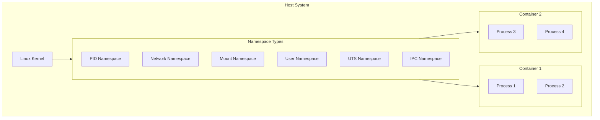
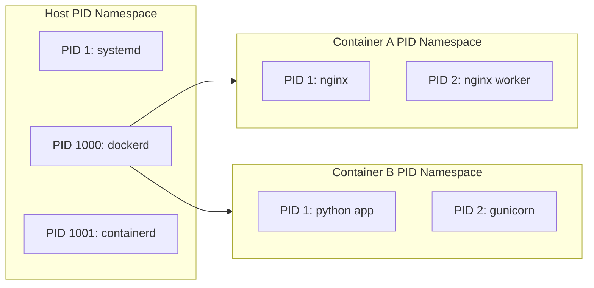
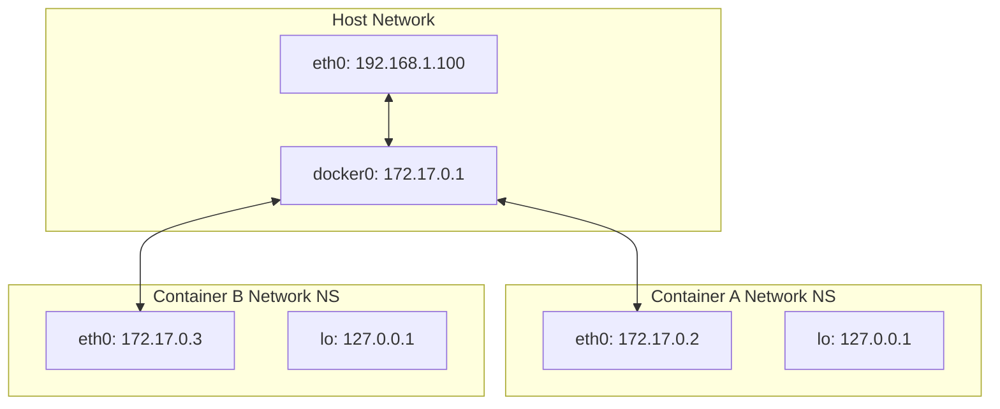
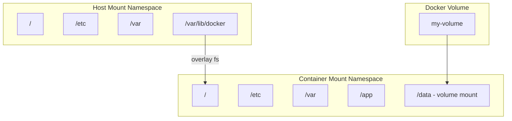
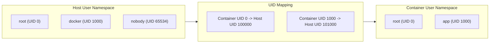
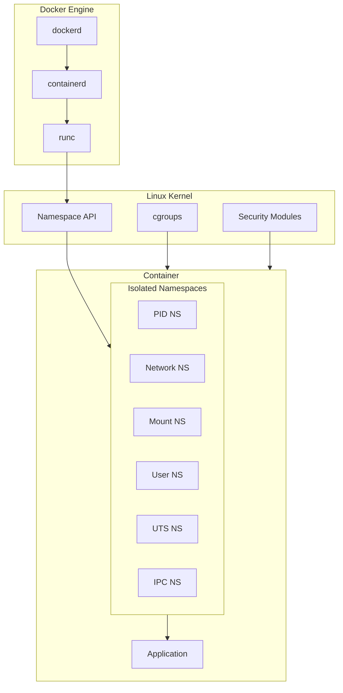

# How to Implement Docker Container Namespaces

Author: [nawazdhandala](https://github.com/nawazdhandala)

Tags: Docker, Namespaces, Container Security, Linux

Description: Learn how Docker uses Linux namespaces for container isolation and security.

---

## Introduction

Linux namespaces are the foundation of container isolation in Docker. They provide a way to partition kernel resources so that one set of processes sees one set of resources while another set of processes sees a different set of resources. This blog post explores how Docker leverages namespaces to create isolated container environments.

## What Are Linux Namespaces?

Namespaces are a feature of the Linux kernel that isolate and virtualize system resources for a collection of processes. Docker uses several types of namespaces to provide complete container isolation.



## Types of Namespaces Used by Docker

### 1. PID Namespace

The PID namespace isolates the process ID number space. Processes in different PID namespaces can have the same PID. This allows each container to have its own init process (PID 1).



#### Viewing PID Namespace Isolation

```bash
# Run a container and check its PID namespace
docker run -d --name test-container nginx

# View processes inside the container
# The nginx process appears as PID 1 inside the container
docker exec test-container ps aux

# View the same container's processes from the host
# Here you'll see the actual host PIDs
docker top test-container
```

#### Creating a Container with Shared PID Namespace

```bash
# Share PID namespace with the host
# This allows the container to see all host processes
docker run -d \
    --name shared-pid \
    --pid=host \
    nginx

# Share PID namespace between containers
# First container
docker run -d --name container-a nginx

# Second container sharing PID namespace with first
docker run -d \
    --name container-b \
    --pid=container:container-a \
    alpine sleep infinity
```

### 2. Network Namespace

Network namespaces provide isolation for network resources including network devices, IP addresses, IP routing tables, port numbers, and firewall rules.



#### Network Namespace Configuration Examples

```bash
# Create a container with default bridge network
# Each container gets its own network namespace
docker run -d \
    --name web-server \
    -p 8080:80 \
    nginx

# Create a container with host network namespace
# Container shares the host's network stack
docker run -d \
    --name host-network-container \
    --network host \
    nginx

# Create a container with no network
# Completely isolated network namespace
docker run -d \
    --name no-network \
    --network none \
    alpine sleep infinity

# Share network namespace between containers
# Useful for sidecar patterns
docker run -d --name main-app nginx

docker run -d \
    --name sidecar \
    --network container:main-app \
    alpine sleep infinity
```

#### Custom Network with Specific Configuration

```bash
# Create a custom bridge network with specific subnet
docker network create \
    --driver bridge \
    --subnet 10.10.0.0/16 \
    --gateway 10.10.0.1 \
    --opt "com.docker.network.bridge.name"="custom-bridge" \
    custom-network

# Run container on custom network with static IP
docker run -d \
    --name static-ip-container \
    --network custom-network \
    --ip 10.10.0.100 \
    nginx
```

### 3. Mount Namespace

Mount namespaces isolate the set of filesystem mount points seen by a group of processes. This allows containers to have their own root filesystem independent of the host.



#### Mount Namespace Examples

```bash
# Run container with a bind mount
# Maps host directory to container directory
docker run -d \
    --name bind-mount-example \
    -v /host/data:/container/data:rw \
    nginx

# Run container with a named volume
# Docker manages the volume storage
docker run -d \
    --name volume-example \
    -v my-named-volume:/app/data \
    nginx

# Run container with tmpfs mount
# Data stored in memory only
docker run -d \
    --name tmpfs-example \
    --tmpfs /app/cache:rw,noexec,nosuid,size=100m \
    nginx

# Run container with read-only root filesystem
# Enhanced security through immutable container
docker run -d \
    --name readonly-example \
    --read-only \
    --tmpfs /tmp \
    --tmpfs /var/run \
    nginx
```

#### Docker Compose Mount Configuration

```yaml
# docker-compose.yml
# Demonstrates various mount namespace configurations

version: '3.8'

services:
  web:
    image: nginx:latest
    volumes:
      # Named volume for persistent data
      - web-data:/usr/share/nginx/html

      # Bind mount for configuration
      - ./nginx.conf:/etc/nginx/nginx.conf:ro

      # tmpfs for temporary files
      - type: tmpfs
        target: /tmp
        tmpfs:
          size: 100000000  # 100MB
          mode: 1777

    # Read-only root filesystem
    read_only: true

volumes:
  web-data:
    driver: local
```

### 4. User Namespace

User namespaces isolate user and group ID number spaces. A process can have a normal unprivileged user ID outside a namespace while having user ID 0 (root) inside the namespace.



#### Enabling User Namespace Remapping

```bash
# Configure Docker daemon for user namespace remapping
# Edit /etc/docker/daemon.json

cat > /etc/docker/daemon.json << 'EOF'
{
    "userns-remap": "default"
}
EOF

# This creates subordinate UID/GID ranges
# Check /etc/subuid and /etc/subgid for mappings

# Restart Docker daemon
sudo systemctl restart docker

# Verify user namespace is enabled
docker info | grep -i "user namespace"
```

#### Running Containers with Specific User

```bash
# Run container as non-root user
# Specifies the user inside the container
docker run -d \
    --name non-root-container \
    --user 1000:1000 \
    nginx

# Run container with specific user and capabilities
docker run -d \
    --name limited-caps \
    --user 1000:1000 \
    --cap-drop ALL \
    --cap-add NET_BIND_SERVICE \
    nginx
```

#### Dockerfile User Configuration

```dockerfile
# Dockerfile demonstrating user namespace best practices

FROM nginx:alpine

# Create a non-root user for running the application
# Using numeric IDs for better portability
RUN addgroup -g 1001 -S appgroup && \
    adduser -u 1001 -S appuser -G appgroup

# Create necessary directories with proper ownership
RUN mkdir -p /app/data && \
    chown -R appuser:appgroup /app && \
    chown -R appuser:appgroup /var/cache/nginx && \
    chown -R appuser:appgroup /var/log/nginx && \
    touch /var/run/nginx.pid && \
    chown appuser:appgroup /var/run/nginx.pid

# Switch to non-root user
USER appuser

# Application runs as non-root inside the container
EXPOSE 8080
CMD ["nginx", "-g", "daemon off;"]
```

## Advanced Namespace Configuration

### Combining Multiple Namespace Options

```bash
# Run a highly isolated container with custom namespace settings
docker run -d \
    --name secure-container \
    --user 1000:1000 \
    --read-only \
    --tmpfs /tmp:rw,noexec,nosuid \
    --cap-drop ALL \
    --cap-add NET_BIND_SERVICE \
    --security-opt no-new-privileges:true \
    --security-opt seccomp=/path/to/seccomp-profile.json \
    --network custom-network \
    --pids-limit 100 \
    nginx
```

### Using unshare for Manual Namespace Creation

```bash
#!/bin/bash
# Script demonstrating manual namespace creation using unshare
# This shows what Docker does behind the scenes

# Create a new PID namespace and run a shell
# The shell becomes PID 1 in the new namespace
sudo unshare --pid --fork --mount-proc /bin/bash

# Create multiple namespaces at once
# Combines PID, mount, network, and UTS namespaces
sudo unshare \
    --pid \
    --fork \
    --mount-proc \
    --net \
    --uts \
    /bin/bash

# Inside the new namespace, verify isolation
hostname new-container-host
ip link
ps aux
```

### Inspecting Container Namespaces

```bash
# Find the container's process ID on the host
CONTAINER_PID=$(docker inspect --format '{{.State.Pid}}' container-name)

# List all namespaces for the container
ls -la /proc/$CONTAINER_PID/ns/

# Enter specific namespace of a running container
# Enter the network namespace
sudo nsenter --target $CONTAINER_PID --net ip addr

# Enter multiple namespaces
sudo nsenter \
    --target $CONTAINER_PID \
    --mount \
    --uts \
    --ipc \
    --net \
    --pid \
    /bin/bash
```

## Namespace Isolation Architecture



## Security Best Practices

### 1. Always Use User Namespace Remapping in Production

```bash
# Configure daemon.json for production
cat > /etc/docker/daemon.json << 'EOF'
{
    "userns-remap": "default",
    "no-new-privileges": true,
    "live-restore": true,
    "userland-proxy": false
}
EOF
```

### 2. Implement Network Segmentation

```yaml
# docker-compose.yml with network segmentation

version: '3.8'

services:
  frontend:
    image: nginx:alpine
    networks:
      - frontend-net

  backend:
    image: node:alpine
    networks:
      - frontend-net
      - backend-net

  database:
    image: postgres:alpine
    networks:
      - backend-net

networks:
  frontend-net:
    driver: bridge
    internal: false
  backend-net:
    driver: bridge
    internal: true  # No external access
```

### 3. Minimal Mount Points

```bash
# Run container with minimal filesystem access
docker run -d \
    --name minimal-mounts \
    --read-only \
    --tmpfs /tmp:rw,noexec,nosuid,size=64m \
    --tmpfs /var/run:rw,noexec,nosuid,size=8m \
    -v app-data:/app/data:rw \
    --mount type=bind,source=/etc/localtime,target=/etc/localtime,readonly \
    myapp:latest
```

## Troubleshooting Namespace Issues

### Debugging PID Namespace Problems

```bash
# Check if processes are properly isolated
docker exec container-name ps aux

# Verify PID namespace from host
docker inspect --format '{{.State.Pid}}' container-name
cat /proc/$(docker inspect --format '{{.State.Pid}}' container-name)/status | grep NSpid
```

### Debugging Network Namespace Issues

```bash
# Check network configuration inside container
docker exec container-name ip addr
docker exec container-name ip route
docker exec container-name cat /etc/resolv.conf

# Check network namespace from host
CONTAINER_PID=$(docker inspect --format '{{.State.Pid}}' container-name)
sudo nsenter --target $CONTAINER_PID --net ip addr
```

### Debugging Mount Namespace Issues

```bash
# List mounts inside container
docker exec container-name mount

# Check mount propagation
docker exec container-name findmnt

# Verify volume mounts
docker inspect container-name --format '{{json .Mounts}}' | jq
```

## Conclusion

Docker container namespaces provide the fundamental isolation mechanisms that make containers secure and portable. Understanding how PID, network, mount, and user namespaces work enables you to configure containers for optimal security and performance. Key takeaways include:

- **PID Namespace**: Isolates process trees, giving each container its own PID 1
- **Network Namespace**: Provides separate network stacks with independent interfaces and routing
- **Mount Namespace**: Isolates filesystem views, enabling containers to have their own root filesystem
- **User Namespace**: Maps container users to different host users, adding a security layer

By properly configuring these namespaces, you can create secure, isolated container environments that protect both the host system and other containers from potential security threats.

## Further Reading

- Linux man pages for namespaces(7) and unshare(1)
- Docker security documentation
- Open Container Initiative (OCI) runtime specification
- Linux kernel namespace implementation details
